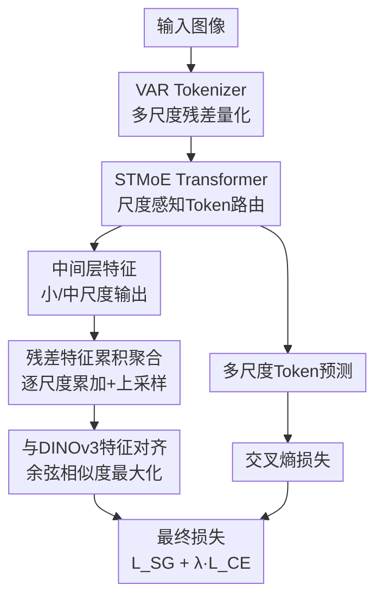

# MEPA: Multi-Scale Representation Alignment for Visual Autoregressive Modeling with Mixture of Experts

**会议**: ECCV 2026  
**arXiv**: [2607.00371](https://arxiv.org/abs/2607.00371)  
**代码**: 无  
**领域**: 图像生成  
**关键词**: 视觉自回归建模、混合专家模型、多尺度表示对齐、语义引导、图像生成

## 一句话总结
MEPA 针对 VAR（Visual AutoRegressive）模型中共享架构导致的多尺度表示学习冲突和早期尺度语义错误传播问题，提出尺度感知的 Token 路由混合专家（STMoE）解耦不同尺度的模型容量，并结合自监督视觉特征（DINOv3）对早期尺度的残差聚合表示做语义对齐，在 ImageNet 256x256 上用一半训练轮数即超越 VAR 基线，FID 降低 0.63-0.69。

## 研究背景与动机
视觉自回归建模（VAR）通过「下一尺度预测」范式实现了粗到细的多尺度自回归图像生成，在生成质量和推理速度上均表现优异。VAR 将图像压缩为多尺度残差 token 序列，从小到大逐尺度预测，每个尺度内并行解码，大幅提升了效率。

然而，VAR 在多尺度表示学习上存在两个固有缺陷。第一，**不同尺度的学习目标差异巨大**：小尺度主要建模全局语义布局，大尺度关注细粒度纹理细节，但所有尺度共享同一个 Transformer 架构，导致优化目标冲突——模型被迫在同一套参数里同时学会「画轮廓」和「描细节」。第二，**自回归因果链上的误差传播**：由于生成过程从小尺度到大尺度串行依赖，早期尺度如果语义预测不准（例如物体位置偏移、类别混淆），这个错误会被后续所有尺度当作条件输入，层层放大，最终严重破坏生成质量。论文通过实证分析（Fig.1）验证了这两点：不同尺度的特征空间确实分布迥异，且早期语义错误确实会导致不可接受的输出。

本文的核心洞察是：**用混合专家（MoE）架构让不同尺度/不同 token 自适应选择不同的 FFN 专家，实现解耦的专用化表示学习；同时用预训练自监督视觉特征（DINOv3）对 VAR 早期尺度的聚合表示做语义正则化，从源头阻断错误传播。** 这是首个在 VAR 范式下系统性研究表示对齐的工作。

## 方法详解

### 整体框架
MEPA 在 VAR 的下一尺度预测框架上引入两个核心模块：尺度感知的 Token 路由 MoE 层和语义引导机制。输入图像经 VAR tokenizer 量化为 K 个尺度的残差 token 序列 $\{r_1, r_2, \ldots, r_K\}$，从小尺度到大尺度依次输入 Transformer。MEPA 将 Transformer 中的标准 FFN 替换为 STMoE 层，每个 token 根据自身内容加尺度嵌入，通过路由器选择 top-k 个专家进行处理。训练时，额外从 Transformer 中间层提取小尺度和中尺度的输出特征，经 MLP 投影后按尺度累积聚合（从小到大逐尺度累加并上采样），与冻结的 DINOv3 编码器提取的完整图像特征做余弦相似度对齐，形成语义引导损失 $\mathcal{L}_{SG}$。最终损失为语义引导损失与原始交叉熵损失的加权和。推理时仅使用 STMoE  Transformer 做标准自回归生成，无额外开销。

### 关键设计

**1. 尺度感知的 Token 路由混合专家（STMoE）：从尺度路由到 Token 路由的演进**

VAR 不同尺度的特征空间差异显著，共享 FFN 迫使模型在所有尺度上妥协，无法为每个尺度学习专用表示。最直观的想法是按尺度分配专家——即 Scale-routed MoE（SMoE）：为每个尺度学习一个可学习的尺度嵌入，通过路由矩阵 $S = \text{Softmax}_E(SE(scale(x)) W)$ 计算尺度到专家的亲和度，同一尺度的所有 token 共享相同的专家激活模式。

但 SMoE 有两个致命缺陷。其一，不同尺度的 token 数量差异悬殊（小尺度 token 少、大尺度 token 多），导致专家负载严重不均——如 Table 1 所示，SMoE 下 8 个专家的负载方差高达 6.62，而 STMoE 仅 2.41。其二，同一尺度内的不同 token 因空间位置不同而具有不同的语义重要性和内容特征（如边界 token vs 中心 token），SMoE 对同尺度所有 token 施加相同的专家激活，造成了路由同质化，限制了模型的细粒度专业化能力。

为此，STMoE 将尺度嵌入注入到 token 表示中，再做逐 token 的路由：$S = \text{Softmax}_E((SE(scale(x)) + x) W)$。实际上 VAR Transformer 本身就为输入 token 添加了位置嵌入和尺度嵌入，因此 STMoE 可以自然地复用这些信息。这样，每个 token 根据自身内容和所属尺度的综合信息独立选择专家，既能感知尺度差异（大尺度 token 倾向于选某些专家、小尺度 token 倾向另一些），又能根据 token 级语义做细粒度路由（如边界 token 和中心 token 在同一尺度内可能选不同专家）。路由热力图（Fig.4）验证了这一点：STMoE 在尺度 10 上，专家 3 偏好边界 token，专家 6 偏好非边界 token，专家 1 偏好特征图第一行的 token。此外，引入标准的负载均衡损失 $\mathcal{L}_b = M \sum_{j=1}^{m}(\frac{1}{N}\sum_{i=1}^{N}\mathbb{I}(G_{i,j}\neq 0))(\frac{1}{N}\sum_{i=1}^{N}S_{i,j})$，通过惩罚专家被选中的频率与路由得分的乘积，鼓励均匀使用所有专家，保障分布式训练效率。

**2. 残差特征聚合：桥接 VAR 残差空间与自监督完整表示空间**

直接对 VAR 的单个残差表示与自监督特征做对齐效果很差，因为两者存在根本性的表示空间鸿沟：VAR 的 $r_k$ 是尺度 k 相对于前 k-1 个尺度的残差增量，而 DINO/DINOv3 等自监督编码器输出的是基于图像块的完整表示。残差特征是局部的、增量的，自监督特征是全局的、完整的。直接强行对齐会导致特征失配，不仅无法注入有效语义，还可能干扰 VAR 自身的生成学习。

MEPA 的设计是：先将 VAR Transformer 中间层输出经 MLP $m_\phi$ 投影到与 DINOv3 特征相同的通道维度，然后从小到大逐尺度累积求和并上采样至目标分辨率：$z_j = \sum_{i=1}^{j} \text{Up}(m_\phi(h_\theta)_i, sz_K)$。这个操作将残差表示空间转换为渐进丰富的聚合表示空间——$z_1$ 仅含最粗的全局结构信息，$z_3$ 已累积了前三个尺度的语义内容，$z_K$ 则是完整的聚合表示。这种「从小到大累加」的过程天然契合 VAR 的因果生成顺序，使得聚合表示的信息丰富度随尺度单调递增。

**3. 早期尺度的语义引导：从源头阻断错误传播**

有了聚合表示后，一个关键问题是「在哪些尺度上做对齐」。最朴素的做法是对最终完整聚合表示 $z_K$ 做对齐（记为 +SG-Last），但这只约束了生成终点，并没有直接强化早期尺度的语义正确性。由于 VAR 的因果依赖结构——大尺度预测严格以早期尺度的特征图为条件——早期语义错误一旦出现就会沿着生成链传播和放大。

MEPA 的选择是仅对早期和中期的聚合表示做语义引导：设 $F$ 为选定的早期聚合尺度集合（实验确定为尺度 1-5、1-6、1-7 的聚合特征，即 +SG-M），对这些选定的 $z_j (j \in F)$ 分别与 DINOv3 特征 $g$ 做逐 patch 的余弦相似度最大化：

$$\mathcal{L}_{SG}(\theta, \phi) = -\mathbb{E}_x\left[\frac{1}{N}\sum_{i=1}^{N}\sum_{j \in F} \text{sim}(g^i, z_j^i)\right]$$

这种做法直接强化了小中尺度阶段的语义正确性——迫使模型在生成粗粒度语义草图时就产出准确的物体类别、空间布局和整体结构。由于大尺度细节生成以这些早期特征为条件，一个更准确的语义基础自然引导出更可靠的细粒度细节生成，从根源上减少了误差传播。消融实验（Table 6）证实：+SG-M（中间尺度组）FID 3.59 最优，优于 +SG-Last 的 3.81 和 +SG-S（最小三个尺度）的 3.64，也与「强化早期语义基础」的动机完全吻合。

### 损失函数 / 训练策略
最终训练目标为语义引导损失与原始 VAR 交叉熵损失的加权组合：$\mathcal{L} = \mathcal{L}_{SG} + \lambda \mathcal{L}_{CE}$，其中 $\lambda = 0.5$。此外 STMoE 层额外附加负载均衡损失 $\mathcal{L}_b$。训练使用 AdamW 优化器，batch size 96，weight decay 0.05，$\beta_1=0.9, \beta_2=0.95$，基础学习率从 $1\times10^{-4}$ 线性退火至 $1\times10^{-5}$，与 VAR 原论文保持一致。所有实验在 ImageNet-1K 256x256 上进行，默认训练 200 轮（同时也报告 100 轮的效率结果）。语义引导使用冻结的 DINOv3 作为目标编码器，对齐时从 VAR Transformer 的中间层（而非最后一层）提取特征，实验表明这比用最后一层效果更好。

## 实验关键数据

### 主实验
在 ImageNet 256x256 类条件生成基准上对比主流方法。MEPA-d16（585M 参数，10 步生成）在 200 轮训练后 FID 达 2.32，显著优于 VAR-d16（3.55）和 VAR-d20（2.95），且参数量更少。在仅 100 轮训练下，MEPA-d16 的 FID 为 2.65，已超过 VAR-d16 全量 200 轮训练的 3.55，体现约 2 倍的训练加速。

| 类型 | 模型 | FID↓ | IS↑ | 参数 | 步数 | 轮数 |
|------|------|------|-----|------|------|------|
| GAN | StyleGAN-XL | 2.30 | 265.1 | 166M | 1 | - |
| Diffusion | DiT-XL/2 | 2.27 | 278.2 | 675M | 250 | - |
| AR | MAR-B | 2.31 | 281.7 | 208M | 64 | 800 |
| VAR | VAR-d16 | 3.55 | 280.4 | 310M | 10 | 200 |
| VAR | VAR-d20 | 2.95 | 302.6 | 600M | 10 | 250 |
| VAR | FlexVAR-d20 | 2.41 | 299.3 | 600M | 10 | 250 |
| VAR | SpectralAR-d16 | 3.02 | 282.2 | 310M | 64 | 200 |
| VAR | **MEPA-d16 (100轮)** | **2.65** | 304.6 | 585M | 10 | 100 |
| VAR | **MEPA-d16 (200轮)** | **2.32** | 311.3 | 585M | 10 | 200 |

### 消融实验

| 配置 | FID↓ | IS↑ | 说明 |
|------|------|-----|------|
| VAR-d16 基线 (100轮) | 4.10 | 241.6 | 无 STMoE，无 SG |
| +STMoE only | 2.99 | 284.2 | 仅加 STMoE，FID 降 1.11 |
| +SG only (DINOv3) | 3.59 | 269.0 | 仅加语义引导，FID 降 0.51 |
| **+STMoE + SG (Full MEPA)** | **2.65** | **304.6** | 两者联合最优，FID 降 1.45 |

| MoE 类型 | FID↓ | IS↑ | 说明 |
|----------|------|-----|------|
| VAR 基线 | 4.10 | 241.6 | 无 MoE |
| +MoEEC | 4.06 | 234.9 | 通用 MoE，无尺度感知，几乎无提升 |
| +MoE++ | 3.39 | 271.7 | 通用 MoE 改进版 |
| +SMoE | 3.11 | 280.7 | 尺度路由，同尺度路由同质化 |
| **+STMoE** | **2.99** | **284.2** | Token 级路由+尺度感知，最优 |

### 关键发现
- **STMoE 和 SG 互补而非重叠**：单独加入 STMoE 或 SG 均有显著提升，且两者组合效果进一步放大（FID 从 4.10 降至 2.65），说明它们分别解决了多尺度表示学习中的不同瓶颈——STMoE 解耦模型容量，SG 强化早期语义。
- **STMoE 的路由灵活性远超 SMoE**：路由热力图显示 STMoE 激活了全部 8 个专家（SMoE 仅激活 6 个），且在同一尺度内不同空间位置的 token 会选不同专家，实现了更细粒度的专业化。
- **中间尺度聚合对齐效果最优**：+SG-M（尺度 1-5/1-6/1-7）FID 3.59，优于 +SG-Last（仅最终完整表示，FID 3.81）和 +SG-S（仅最小三个尺度，FID 3.64），验证了「强化早期语义基础」比「约束终点」更有效。
- **语义引导加速收敛**：在相同性能水平上，带 SG 的模型达到基线 200 轮性能仅需约 100 轮，实现约 2 倍训练加速（Fig.5）。
- **MEPA 推理开销可控**：相比 VAR-d20，MEPA-d16 推理时间从 0.50s 增至 0.85s（约 0.7x 增幅），每轮训练时间仅增 4.50%，但以 100 轮即超越 200 轮基线，实际训练总时间更短。

## 亮点与洞察
- **从架构层面解耦多尺度学习**：用 MoE 让不同专家自适应地专门处理不同尺度和不同语义的 token，比手工设计多分支或多头架构更优雅——路由器自己学会「哪些 token 该找哪个专家」，不需要人工划分尺度边界。
- **「残差累加再对齐」是核心工程智慧**：直接对齐残差特征和自监督特征会因为表示空间不匹配而失败，但先沿 VAR 的因果方向做累积求和，把残差空间「翻译」成渐进完整的表示空间，就能自然桥接两者。这个思路可以迁移到任何残差式生成架构（如级联扩散模型、渐进式 GAN）中引入自监督表示引导。
- **不是对齐终点而是对齐起点**：+SG-M 优于 +SG-Last 的结果揭示了一个反直觉的结论——在自回归生成中，约束早期中间表示比约束最终输出更有效。这对其他自回归模型（LLM 的中间层表示对齐、推理链的中间步骤监督）有直接启发。
- **训练效率与生成质量的双赢**：MEPA 没有像大多数工作那样以更多计算换更好质量，而是通过更好的表示学习实现了训练加速（2x），同时最终性能也更好，展示了「学得更快」和「学得更好」可以同时成立。

## 局限与展望
- 作者承认受计算资源限制，未能在 512x512 分辨率上充分训练（仅跑了 66 轮），更高分辨率下的 scaling 行为有待验证。
- STMoE 引入的额外参数（585M vs VAR-d16 的 310M，但激活参数更少）使得与 dense 基线的参数量不完全对等；虽然有推理效率优势（10 步 vs Diffusion 的 250 步），但单步推理时间增加了 0.7x。
- 语义引导目前仅探索了 DINO/DINOv3 等判别式自监督特征，其他类型的预训练表示（如 CLIP 的多模态特征、MAE 的重建式特征）是否能提供互补的语义信号尚未尝试。
- MoE 的路由策略仍有改进空间：当前使用固定的 top-k 选择，未来可探索动态 top-k、基于不确定性/难度感知的路由，或在训练过程中逐步增加专家数量。

## 相关工作与启发
- **vs REPA（扩散模型的表示对齐）**: REPA 在扩散模型的去噪过程中对齐自监督特征，而 MEPA 是首个在 VAR 范式下做表示对齐的工作。关键区别在于 VAR 的残差多尺度特征空间——不能像扩散模型那样直接对齐，而需要先做残差累积聚合再选择性对齐早期尺度。MEPA 的 FID 增益（21.36%）远超 REPA 在 SiT 上的增益（12.62%），说明针对 VAR 特性设计的对齐策略更有效。
- **vs 通用 MoE（MoEEC / MoE++）**: 这些通用 MoE 方法直接替换 FFN 为 MoE 层但不引入尺度感知设计，在 VAR 上几乎没有提升（FID 4.06 vs 4.10），说明在 VAR 这种多尺度架构中，尺度信息是 MoE 发挥作用的必要条件。
- **vs FlexVAR / SpectralAR**: 这些工作从不同角度改进 VAR（灵活尺度策略 / 频域建模），与 MEPA 的 MoE + 表示对齐正交，可以组合使用。

## 评分
- 新颖性: ⭐⭐⭐⭐☆ 首次将 MoE 和表示对齐引入 VAR 范式，STMoE 从 SMoE 到 token 级路由的演进和残差聚合对齐策略均有原创性，但 MoE 和表示对齐各自在 NLP/扩散模型中已有先例。
- 实验充分度: ⭐⭐⭐⭐⭐ 消融实验覆盖了 MoE 类型、路由策略、自监督编码器选择、聚合尺度组选择、负载均衡、与 REPA 对比等多个维度，热力图可视化和收敛曲线分析也很有说服力。
- 写作质量: ⭐⭐⭐⭐☆ 逻辑清晰，动机（Fig.1 实证分析）到方法（两个模块）到实验（逐层消融）的链条完整，但部分公式排版略乱。
- 价值: ⭐⭐⭐⭐☆ 在训练效率（2x 加速）和生成质量上双赢，对 AR 图像生成社区有实用价值；残差聚合再对齐的思路对更广泛的残差式生成模型有启发性。

<!-- RELATED:START -->

## 相关论文

- [\[ICLR 2026\] Multi-Subspace Multi-Modal Modeling for Diffusion Models: Estimation, Convergence and Mixture of Experts](../../ICLR2026/image_generation/multi-subspace_multi-modal_modeling_for_diffusion_models_estimation_convergence_.md)
- [\[ICLR 2026\] MVAR: Visual Autoregressive Modeling with Scale and Spatial Markovian Conditioning](../../ICLR2026/image_generation/mvar_visual_autoregressive_modeling_with_scale_and_spatial_markovian_conditionin.md)
- [\[ICLR 2026\] SSG: Scaled Spatial Guidance for Multi-Scale Visual Autoregressive Generation](../../ICLR2026/image_generation/ssg_scaled_spatial_guidance_for_multi-scale_visual_autoregressive_generation.md)
- [\[ICML 2026\] Visual Implicit Autoregressive Modeling](../../ICML2026/image_generation/visual_implicit_autoregressive_modeling.md)
- [\[CVPR 2026\] Mixture of Style Experts for Diverse Image Stylization](../../CVPR2026/image_generation/mixture_of_style_experts_for_diverse_image_stylization.md)

<!-- RELATED:END -->
