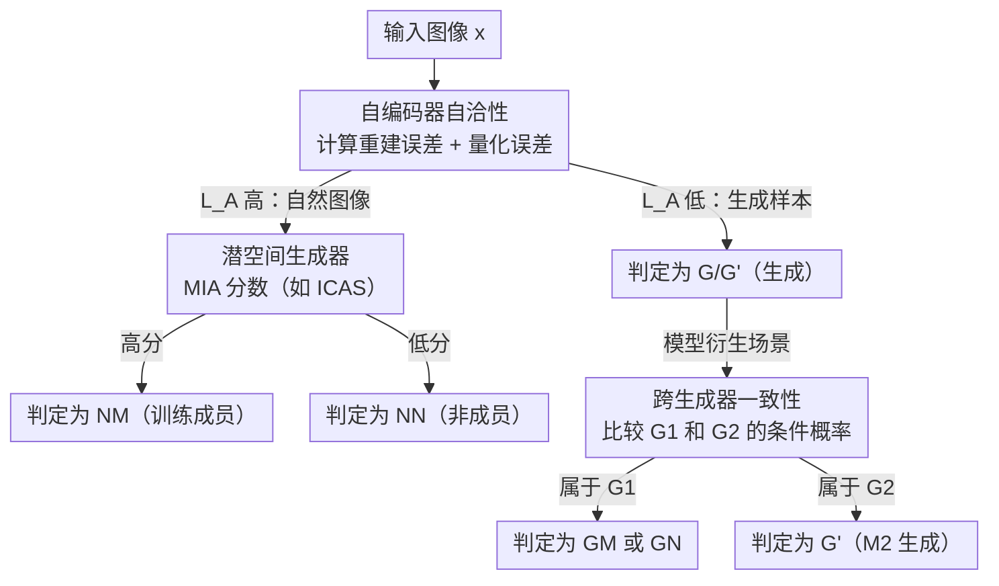

# MGI: Member vs Generated Inference

**会议**: ECCV 2026  
**arXiv**: [2606.23872](https://arxiv.org/abs/2606.23872)  
**代码**: 无  
**领域**: 扩散模型 / AI安全  
**关键词**: 成员推理攻击, 生成内容归属, 隐私审计, 数据溯源, 自编码器一致性

## 一句话总结
本文提出一个新任务 MGI（Member vs Generated Inference）：给定一个样本和一个生成模型，判断该样本是模型的训练成员还是模型自己生成的输出；并设计了三阶段级联方法 DCB，利用自编码器重建/量化误差过滤生成样本、再用潜空间生成器做成员推理、最后跨生成器比较条件概率做溯源，在 IAR 和扩散模型上均显著超越现有 MIA 和归属方法。

## 研究背景与动机
现代图像生成模型（扩散模型、图像自回归模型）生成的样本与真实训练数据肉眼不可区分，且模型可能无意中记忆并复现训练样本。这模糊了「训练成员」和「模型生成输出」之间的边界。现有方法分为两派：成员推理攻击（MIA，如 PIAR、ICAS、CLiD）旨在判断某样本是否在训练集中，但不能区分生成样本——生成样本在潜空间中的似然分数与真实成员同样高，因此 MIA 会系统性地把生成样本误判为成员；图像归属方法（如 PRADA）旨在判断某样本是否由某模型生成，但它们依赖同样的似然信号，常常把真实训练成员误判为生成样本。核心矛盾在于：两类方法都只盯着潜空间生成器输出的似然/概率分数，而忽略了生成模型另一个关键组件——自编码器（autoencoder）——中蕴含的区分信号。生成样本经历了「编码-解码」完整管线，在自编码器下会留下可测量的痕迹（更低的重建误差和量化误差），而自然图像则没有。

本文进一步将 MGI 拓展到**模型衍生场景**（model derivative setting）：模型 M1 生成的图像可能被爬取并用于训练下一代模型 M2，形成「数据回路」（data circuits），导致模型退化。在该场景下，不仅要区分自然成员 vs 生成样本，还要区分「M1 生成后用作 M2 训练成员的样本」「M1 生成但未用于训练 M2 的样本」「M2 自己生成的样本」三类生成数据。核心 idea：通过**自编码器自洽性过滤生成样本 + 潜空间生成器做成员推理 + 跨生成器概率差异做溯源**的三阶段级联，覆盖生成模型的完整管线，从根本上解决 MGI。

## 方法详解

### 整体框架
DCB 方法的核心洞察是：生成模型的完整管线包含自编码器 A = D o E（编码器 E + 解码器 D）和潜空间生成器 G 两部分。现有 MIA 和归属方法只利用了 G 的似然信号，而 DCB 同时利用 A 的重建/量化误差和 G 的条件概率，通过三阶段级联解决 MGI。

**输入**：待查询图像 x、目标生成模型 M = <E, D, G>、可选的第二个模型 M2（模型衍生场景）。**输出**：x 属于哪一类——自然训练成员 NM、自然非成员 NN、生成样本 G（或 GM/GN/G'）。

流程分三阶段。第一阶段用自编码器分数 L_A 将样本分为「自然」和「生成」两类；第二阶段对自然样本用标准 MIA 区分训练成员与非成员；第三阶段仅在模型衍生场景下触发，用跨生成器概率差异将生成样本进一步归属到具体模型。

### 关键设计

**1. 自编码器自洽性：利用重建误差和量化误差分离自然与生成图像**

生成图像经过模型自编码器的完整「编码-量化-解码」管线，与该自编码器的流形天然对齐，因此重建误差和量化误差均低于从未经过该管线的自然图像。DCB 定义重建误差为 L_Rec(x) = MSE(x, A(x))，即原图与自编码器重建结果之间的均方误差。为进一步稳定跨图像比较，引入**双重重建比**（double reconstruction ratio）：$ρ_{Rec}(x) = L_{Rec}(x) / MSE(A(x), A(A(x)))$，分母作为每图基线——如果图像与自编码器流形对齐良好，第二次重建几乎不引入额外损失，比值稳定。

对使用 VQ-VAE 的图像自回归模型，额外定义量化误差 $L_Q(x) = MSE(E(x), Q^{-1} o Q o E(x))$，度量连续潜表示到离散码本再映射回来的损失。生成图像在量化步骤中损失更小，因为它们本来就是从该码本中采样解码而来。最终自编码器归属分数为：IAR/VQ-VAE 下 $L_A(x) = ρ_{Rec}(x) · L_Q(x)$；DM/VAE 下 $L_A(x) = ρ_{Rec}(x)$。该分数对生成样本给出显著更低的值，从而在 Stage 1 实现高置信度的自然/生成分离。

对 IAR，可选地对编码器做后处理微调：固定解码器 D，在一个不相交的潜特征集上微调编码器 E_hat，使得 E_hat o D(z) ≈ z，提升 L_A 的稳定性。

**2. 跨生成器一致性：用二维概率向量 + KDE 做生成源归属**

在模型衍生场景中，所有生成图像都由同一个解码器解码，自编码器分数 L_A 对 GM、GN、G' 三类生成样本完全相同，无法区分。DCB 引入跨生成器特征：对于两个候选模型 M1 和 M2，构造二维特征向量 $φ(x, c) = (log P_{G1}(E(x)|c), log P_{G2}(E(x)|c))$，即图像在两个潜空间生成器下的条件对数概率。直觉是：由 G1 生成的图像在 G1 下的条件概率相对更高，反之亦然。

具体地，DCB 用 M1 和 M2 分别独立生成参考集 R_G 和 R_G'，在这些参考集的特征向量上用 KDE 估计类条件密度 p_hat_G(φ) 和 p_hat_G'(φ)。对查询图像，比较其 φ 向量在两个密度下的似然，取更可能的来源。这一阶段使 DCB 能在 GM/GN/G' 之间做细粒度归属，这是纯 MIA 或纯自编码器方法都无法做到的。

**3. 三阶段级联协议：为什么这个顺序不能颠倒**

DCB 三个阶段按「先滤生成、再分成员、最后溯源」的顺序执行，这个顺序有严格逻辑：Stage 1 必须先执行，因为如果让生成样本进入 Stage 2 的标准 MIA，它们会被系统性误判为训练成员（生成样本的潜空间似然与成员同样高），这正是本文证明的现有 MIA 失效的根本原因。Stage 2 只在 Stage 1 过滤后的自然样本子集上运行 MIA，此时「成员 vs 非成员」的核心假设被恢复，ICAS 等标准方法即可有效工作。Stage 3 只在模型衍生场景下、且样本被 Stage 1 标记为生成后触发——它只关心「哪个模型生成的」，与成员/非成员无关。该级联顺序使三个阶段互补而不互相干扰。

### 一个完整示例
以一个 VAR-d30 模型衍生场景为例。假设 M1（VAR）生成了 5000 张图像 GM 用于微调 M2（同样 VAR 架构），M2 又生成了新图像 G'；此外还有 M1 生成但未用于训练的 1000 张 GN，以及原始 ImageNet 的自然训练成员 NM 和验证集非成员 NN。

- **Stage 1**：对每张图像计算 L_A = ρ_Rec · L_Q。GM、GN、G' 三类生成图像的 L_A 均显著低于 NM 和 NN（因为都经过了同一 VQ-VAE 的编解码）。DCB 设定阈值将低 L_A 的样本标记为「生成」，进入 Stage 3；高 L_A 的自然样本进入 Stage 2。
- **Stage 2**：对自然样本计算 ICAS 分数。NM（训练成员）的分数显著高于 NN（验证集非成员），以 TPR@1%FPR = 87.0% 区分二者——恢复到了标准 MIA 在无生成样本干扰下的表现。
- **Stage 3**：对 Stage 1 标记为「生成」的样本，计算特征向量 φ = (log P_G1, log P_G2)。GM 和 GN（均由 M1 生成）在 G1 下的条件概率高于 G2，在 KDE 密度比较下聚为一簇；G'（由 M2 生成）在 G2 下的条件概率更高，聚为另一簇。最终 GM/GN vs G' 的 TPR@1%FPR = 99.0%；GM vs GN 的分离则退化为标准 MIA 问题（GM 作为 M2 的训练成员，MIA 分数更高），TPR@1%FPR = 100.0%。整体平均 TPR@1%FPR = 95.8%。

### 损失函数 / 训练策略
DCB 本身是推理时方法，不涉及训练损失。但模型衍生场景中需要微调 M2：对 IAR（VAR、RAR）在 5000 张 M1 生成图像上微调 5 epoch，对 DM（SD1.4、SD2.1）微调 20 epoch，固定学习率 1e-5，AdamW 优化器，仅微调潜空间生成器（transformer/UNet），冻结自编码器权重。Stage 3 的 KDE 使用高斯核，带宽和密度阈值见附录 J（α=0.03~0.07、σ=0.10~0.50 范围内 DCB 不敏感）。Stage 1 可选的后处理编码器微调在不相交的潜特征集上以 L_Inv = MSE(E_hat o D(z), z) 为目标训练。

## 实验关键数据

### 主实验
**直接训练场景（IAR）**：下表为 TPR@1%FPR 指标，DCB 在所有模型上一致优于基线。

| 方法 | RAR (Avg) | VAR (Avg) | LlamaGen (Avg) | 整体 Avg |
|------|-----------|-----------|-----------------|----------|
| PIAR | 54.0 | 53.9 | 8.3 | 38.8 |
| ICAS | 57.4 | 64.8 | 35.6 | 52.6 |
| PRADA | 81.3 | 40.6 | 28.4 | 50.1 |
| **DCB** | **90.8** | **99.2** | **72.4** | **87.4** |

关键细项：DCB 在 NM/G（成员 vs 生成）比较上，RAR 达 99.9、VAR 达 99.3、LlamaGen 达 100.0，而所有基线在 NM/G 上均显著弱于各自的 NM/NN（成员 vs 非成员）表现——这直接验证了 MIA 在 MGI 任务上的失效。LlamaGen 的 NM/NN 仅 17.2（ICAS 基线亦如此），说明该模型的成员推理本身很难，但 DCB 在 NM/G 和 NN/G 仍保持 100.0。

**直接训练场景（DM）**：DCB 在扩散模型上同样大幅领先。

| 方法 | SD1.4 (Avg) | SD2.1 (Avg) | 整体 Avg |
|------|-------------|-------------|----------|
| CLiD | 41.5 | 37.9 | 39.7 |
| ICAS | 41.2 | 37.9 | 39.5 |
| PRADA | 0.5 | 0.4 | 0.5 |
| **DCB** | **78.5** | **77.2** | **77.8** |

DM 上 PRADA 几乎完全失效（Avg 仅 0.5），因为它仅基于潜空间生成器概率比，而扩散模型的似然估计本质上更困难。DCB 在 NM/G 上获 99.9+（SD1.4）和 100.0（SD2.1），但在 NM/NN 上与 CLiD/ICAS 持平（35.7/31.5），因 Stage 2 回退到 ICAS 分数，发挥空间受限于基线 MIA 能力。

### 消融与分析

**强 MIA 对比（模型衍生场景）**：即使给 LiRA 和 RMIA 训练 5 个影子模型（额外优势），DCB 仍全面领先。

| 模型 | 方法 | Natural vs Generated (Avg) | Among Generated (Avg) | 整体 Avg |
|------|------|---------------------------|----------------------|----------|
| VAR | LiRA | 38.0 | 55.2 | 40.0 |
| VAR | RMIA | 76.4 | 88.5 | 76.4 |
| VAR | **DCB** | **99.4** | **91.3** | **95.8** |
| RAR | LiRA | 40.3 | 49.0 | 40.6 |
| RAR | RMIA | 93.3 | 82.6 | 82.7 |
| RAR | **DCB** | **99.9** | **98.5** | **96.7** |

即使 RMIA 有影子模型辅助估计生成成员/非成员分布（对 GM/GN 有天然优势），DCB 依赖全管线信号的方式仍更准确。LiRA 在 among generated 上显著弱于 DCB，因为单维 score 分布的区分度远不及 DCB 的多维特征 + KDE。

**记忆样本鲁棒性**：在 RAR-XXL 的 169 个 SSCD 相似度 > 0.7 的记忆样本上：

| 指标 | Delta(PIAR) | ICAS | PRADA | **DCB** |
|------|-------------|------|-------|---------|
| AUC | 61.8 | 61.4 | 57.9 | **97.5** |
| TPR@5%FPR | 3.0 | 0.0 | 0.0 | **93.5** |

记忆样本近乎逐像素复现训练图像，MIA 和归属方法几乎完全失效（TPR@5%FPR 接近 0），因为它们给原图和复现图分配几乎相同的似然分数。DCB 的自编码器阶段捕捉到复现图像经编解码管线引入的微弱生成痕迹，AUC 高出 35+ 点。

### 关键发现
- **Stage 1 是最关键模块**：去掉自编码器过滤（即只用 ICAS 做 MGI），NM/G 的 TPR@1%FPR 从 99.9 跌至 0.0（RAR），验证了生成样本的高似然分数是 MIA 失效的根源。
- **DM 的 NM/NN 区分度是 DCB 的上限**：DCB 在 Stage 2 回退到 ICAS/CLiD 处理成员推理，因此 SD1.4/SD2.1 上 NM/NN 的最高 TPR@1%FPR 约 35——这反映的是扩散模型成员推理任务本身的难度，而非 DCB 的短板。
- **跨架构场景比同架构更简单**：当 M2 与 M1 架构不同时，两个自编码器天然不同，Stage 1 的分离更容易（附录 Table A10 中 GM/G' AUC ≥ 99.0）。同架构是更难的设置，因为所有生成图像共享同一个自编码器。
- **KDE 超参数不敏感**：α ∈ [0.03, 0.07]、σ ∈ [0.10, 0.50] 范围内，VAR-d30 的 TPR@1%FPR 保持在 97.2-99.5，SD2.1 保持在 96.9-98.4。
- **计算开销可控**：DCB 相对于单次 MIA 推理仅增加 16%-46%（M1 场景）和 66%-71%（M1+M2 场景），且仅需前向传播、可跨图像并行。

## 亮点与洞察
- **把自编码器从「透明管道」升级为信号源**：此前 MIA 方法几乎完全忽略自编码器，把它当作从像素到潜空间的无损映射。DCB 的核心洞察是生成图像在自编码器下更「自洽」——这是被所有人看见但没人用过的一个信号，简洁而强大。
- **三阶段级联的逻辑顺序设计精巧**：先滤生成→再分成员→最后溯源，每一阶段修复前一阶段无法解决的问题，而非简单堆砌。Stage 1 排除了破坏 MIA 假设的生成样本，Stage 2 恢复经典 MIA 有效性，Stage 3 填补 Stage 1 无法区分的生成子类——这种「恢复假设再求解」的思路可迁移到其他推理任务。
- **记忆样本场景下的鲁棒性令人意外**：DCB 在近乎逐像素复现的记忆样本上仍能区分原图和复现图（AUC 97.5 vs 基线 61.8），证明自编码器引入的痕迹虽然肉眼不可见但在潜空间可测。这为深度伪造检测和数据溯源提供了新思路——不依赖内容本身，而依赖生成管线留下的「指纹」。
- **KDE 二维密度比对的简洁性**：Stage 3 不做复杂分类器训练，仅需从两个模型各采一批参考样本做 KDE，然后比较似然。这种「零训练」的设计使 DCB 很容易适配新模型。

## 局限与展望
- **DM 上 NM/NN 成员推理受限于基线 MIA 能力**：DCB 的 Stage 2 直接使用现有 MIA 方法（ICAS/CLiD），因此当这些方法本身在 DM 上表现一般（NM/NN TPR@1%FPR 仅 ~35%）时，DCB 的整体上限也被限制。探索更适合 DM 的 Stage 2 替代方案是直接改进方向。
- **需要访问模型内部（白盒/灰盒）**：DCB 需要自编码器的重建输出和潜空间生成器的 log 概率，属于灰盒设定（匹配 PIAR/CLiD/ICAS 的访问假设）。完全黑盒（仅 API 输出）下 DCB 无法工作。
- **模型衍生场景假设已知 M1 和 M2**：实际中可能只知道 M2 而不知道 M1 的完整权重，或者 M1 有多个候选。论文未讨论仅 M2 可用的退化情况。
- **仅验证类条件生成**：实验均在 ImageNet 类条件生成（IAR）和 MS-COCO 微调（DM）上完成，未涉及文生图大模型（如 SDXL、Flux）的开放域文本条件生成，后者的条件空间更复杂，L_A 和 φ 的分布可能不同。
- **Stage 1 阈值的自动化设定**：当前需根据参考生成集估计 KDE 密度阈值，论文未给出完全不依赖参考集的纯单样本判定方案。

## 相关工作与启发
- **vs PIAR / ICAS / CLiD（MIA 方法）**：这些方法仅用潜空间生成器的条件概率差异 Δ 做成员推理假设「成员分数 > 所有非成员」。DCB 证明当非成员中包含生成样本时，该假设崩溃，因为生成样本的 Δ 与成员同样高。DCB 通过 Stage 1 排除生成样本、恢复假设。
- **vs PRADA（图像归属）**：PRADA 也用概率比但方向相反——假设生成样本分数最高。DCB 证明该假设同样不成立，因为训练成员和生成样本的分数分布高度重叠。DCB 的改进是用自编码器误差（而非生成器概率）做生成检测，两者信号互补。
- **vs LiRA / RMIA（强 MIA）**：即使给影子模型辅助，它们的一维 score 分布在 MGI 下仍不足以分离生成和成员，因为影子模型本身也是在相似数据上训练的，生成样本对它们同样是高分。这反向说明 MGI 问题的本质不是统计功效不足，而是信号源单一——DCB 的核心贡献在于引入新信号源（自编码器）。
- **vs AEDR（双重建归属）**：AEDR 也使用双重建做图像归属，但仅区分「生成 vs 非生成」。DCB 将其扩展为 MGI 完整框架：在生成/非生成分离之后，继续做成员推理和生成源溯源。

## 评分
- 新颖性: ⭐⭐⭐⭐⭐ 首次形式化 MGI 任务，指出 MIA 和归属方法的根本性盲区（忽略自编码器信号），三阶段级联设计简洁而完备，不是增量修补而是问题重塑。
- 实验充分度: ⭐⭐⭐⭐ 覆盖 3 种 IAR + 2 种 DM + 2 种 SOTA DM，直接训练 + 模型衍生 + 记忆样本 + 强 MIA 影子模型对比，附录有 AUC/TPR@5%FPR/跨架构/鲁棒性/超参/计算开销分析；DM 上 NM/NN 区分受限于基线 MIA 是本任务固有难点而非实验不足。
- 写作质量: ⭐⭐⭐⭐⭐ 问题定义清晰（Figure 1 的符号图示极好），从 MIA/归属方法的失效分析到 DCB 三阶段设计逻辑自洽，每阶段「为什么需要、解决了什么、为什么不能跳过」交代透彻。
- 价值: ⭐⭐⭐⭐⭐ MGI 作为一个新推理任务有实际意义——检测合成数据污染训练集、阻断数据回路防止模型退化、审计模型训练数据来源；DCB 的自编码器自洽性思想可能推广到其他生成模态（音频、视频、文本）。

<!-- RELATED:START -->

## 相关论文

- [\[CVPR 2026\] Diversity over Uniformity: Rethinking Representation in Generated Image Detection](../../CVPR2026/image_generation/diversity_over_uniformity_rethinking_representation_in_generated_image_detection.md)
- [\[NeurIPS 2025\] Epistemic Uncertainty for Generated Image Detection](../../NeurIPS2025/image_generation/epistemic_uncertainty_for_generated_image_detection.md)
- [\[ICLR 2026\] Secure Inference for Diffusion Models via Unconditional Scores](../../ICLR2026/image_generation/secure_inference_for_diffusion_models_via_unconditional_scores.md)
- [\[NeurIPS 2025\] Detecting Generated Images by Fitting Natural Image Distributions](../../NeurIPS2025/image_generation/detecting_generated_images_by_fitting_natural_image_distributions.md)
- [\[CVPR 2026\] Attribution as Retrieval: Model-Agnostic AI-Generated Image Attribution](../../CVPR2026/image_generation/attribution_as_retrieval_modelagnostic_aigenerated.md)

<!-- RELATED:END -->
