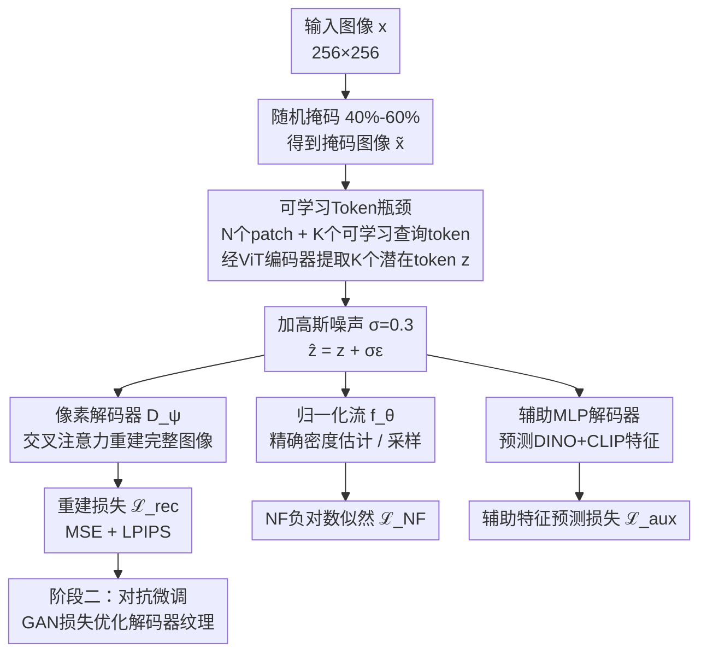

# MIMFlow: Integrating Masked Image Modeling with Normalizing Flows for End-to-End Image Generation

**会议**: ECCV 2026  
**arXiv**: [2606.26016](https://arxiv.org/abs/2606.26016)  
**代码**: [https://github.com/MCG-NJU/MIMFlow](https://github.com/MCG-NJU/MIMFlow)  
**领域**: 图像生成  
**关键词**: 归一化流, 掩码图像建模, 端到端生成, 潜在空间解耦, VAE

## 一句话总结
MIMFlow 提出一种端到端框架，通过在 VAE 编码器中对掩码图像使用可学习 Token 瓶颈提取语义潜在表示，让归一化流专注于低频语义流形建模、解码器负责高频纹理合成，在 ImageNet 256x256 上用仅 128 个 token（比标准模型少 50%）达到 FID 2.50 和 71.3% 线性探测准确率。

## 研究背景与动机

归一化流（Normalizing Flows, NFs）作为一类生成模型，具备精确密度估计和双向映射的数学优雅性，近年来 SimFlow、STARFlow 等工作证明了 NF 可以作为 VAE 的高容量先验替代标准高斯分布。然而，NF 的严格可逆性约束带来了一个根本性的容量瓶颈：模型被迫在低层像素细节上消耗大量表达能力，无法集中建模全局语义结构。换句话说，NF 的"强项"（精确似然）在图像生成中反而成了"包袱"——它在高频纹理噪声上浪费了太多容量。

与此同时，掩码图像建模（MIM, 如 MAE）在自监督表示学习领域取得了巨大成功，能够迫使编码器学会稳健的全局结构特征。但将 MIM 融入生成式框架的现有尝试（如 MAETok、DeTok）都将掩码训练视为 tokenizer 的独立预处理阶段，表示学习与生成过程是割裂的两步走，MIM 的语义提取能力并没有直接服务于生成流模型。

**核心矛盾**：NF 需要简化建模对象（少关注像素细节、多关注全局语义），但常规 VAE 提供的潜在空间充斥着高频噪声；MIM 能提取全局语义，但它与 NF 的端到端联合训练从未被探索过。核心 idea：**用掩码瓶颈强制潜在空间丢弃像素冗余、聚焦全局结构，让 NF 在一个"净化过"的低频语义流形上做密度估计，从而实现 NF 生成质量的结构性提升。**

## 方法详解

### 整体框架
MIMFlow 要解决的核心问题是：如何让归一化流在图像生成中不被像素级高频噪声淹没，而是专注于对语义结构建模。整体方案是将掩码图像建模（MIM）与归一化流（NF）端到端联合训练，通过一个"掩码瓶颈"在潜在空间中实现语义与纹理的**原则性解耦**——编码器从掩码图像中提取紧凑的全局语义潜在表示，NF 在这个简化的语义流形上做密度估计和采样，解码器则负责把语义潜在还原为包含高频细节的完整图像。

框架包含三个核心模块，外加辅助监督和对抗微调两阶段训练。输入图像经过随机掩码后送入 Transformer 编码器，编码器中的 K 个可学习查询 token（K < N，如 K=128、N=256）通过自注意力从可见 patch 中聚合全局语义，产生固定长度的潜在表示 z。z 分三路输出：一路进入归一化流做精确密度估计（训练时计算 NLL 损失，推理时从高斯采样经逆变换生成 z），一路进入像素解码器重建完整图像，一路通过轻量 MLP 预测 DINO/CLIP 高层特征作为辅助语义监督。训练分两阶段：第一阶段端到端联合优化 VAE（编码器+解码器）+ NF + 辅助损失；第二阶段固定编码器和 NF，仅用 GAN 损失对解码器做对抗微调以恢复高频纹理。

### 关键设计

**1. 可学习Token瓶颈：解决掩码图像与NF之间的潜在空间不稳定问题**

直接将 MIM 与 NF 结合面临一个工程难题：MAE 只处理可见 patch，输出序列长度随掩码位置变化，NF 无法对变长序列做一致的密度估计；SimMIM 虽然用掩码 token 保持了固定长度，但每个 token 的信息密度因是否被掩码而剧烈波动，同样让 NF 难以收敛到稳定流形。本文的解法是在编码器输入端拼接 K 个可学习查询 token（K < N，如 K=128、N=256），所有 N+K 个 token 经过双向 Transformer 编码器后，**仅提取 K 个查询 token 作为潜在表示 z**（维度 K×D=128×64），其余 patch token 全部丢弃。编码后在 z 上注入固定方差的高斯噪声 $\hat{\mathbf{z}} = \mathbf{z} + \sigma\epsilon, \epsilon \sim \mathcal{N}(0, \mathbf{I})$ 以平滑流形。

这个设计的有效性来自三重约束的协同：(1) K < N 的物理瓶颈强制模型丢弃局部像素冗余、聚焦全局结构；(2) 固定长度的 K 个 token 始终作为 NF 的稳定建模目标，与掩码位置无关；(3) 训练时的随机掩码比例（0.4-0.6）使潜在空间对不同的信息缺失模式都具有鲁棒性。消融实验证实，去掉掩码（None）时线性探测准确率从 71.3% 骤降至 56.6%，gFID 从 12.82 退化到 29.0，说明掩码瓶颈是整个框架的**第一驱动力**。

**2. 变分推断视角下的NF联合优化：用归一化流先验替换标准高斯先验**

MIMFlow 将整个框架置于变分推断（VI）框架下：编码器 $E_\phi$ 和解码器 $D_\psi$ 构成条件 VAE（条件为掩码 $\mathbf{m}$），而标准 VAE 的高斯先验被高容量 NF $f_\theta$ 替换。ELBO 目标为：

$$\log p(\mathbf{x}|\mathbf{m}) \geq \mathbb{E}_{q_\phi(\mathbf{z}|\tilde{\mathbf{x}})}[\log p_\psi(\mathbf{x}|\mathbf{z})] - D_{\text{KL}}(q_\phi(\mathbf{z}|\tilde{\mathbf{x}}) \parallel p_\theta(\mathbf{z}))$$

后验 $q_\phi$ 定义为以编码器输出为中心的固定方差高斯分布，KL 散度退化为后验在 NF 先验下的交叉熵 $-\mathbb{E}_{q_\phi}[\log p_\theta(\mathbf{z})]$。NF 先验的密度由变量替换公式精确计算：$\log p_\theta(\mathbf{z}) = \log p_\epsilon(f_\theta(\mathbf{z})) + \log|\det \frac{\partial f_\theta}{\partial \mathbf{z}}|$，即高斯基分布的密度加上 Jacobian 行列式的对数。相比标准 VAE 用固定的 $\mathcal{N}(0,I)$ 做先验（会迫使所有类别的潜在表示坍缩到同一团球形噪声），NF 学到的先验是一个**复杂的、数据自适应的语义流形**，能够捕捉 ImageNet 1000 类的多模态分布结构。联合训练总损失 $\mathcal{L}_{\text{prob}} = \mathcal{L}_{\text{rec}} + \beta\mathcal{L}_{\text{NF}}$ 保证了潜在空间同时服务于重建质量和密度估计，不做取舍。

**3. 辅助语义监督与对抗微调：两阶段训练分别提升语义质量和纹理保真度**

第一阶段（端到端联合训练 90 epochs）在 $\mathcal{L}_{\text{prob}}$ 基础上加入辅助特征预测损失。一个轻量 MLP 从潜在 z 直接预测预训练模型（DINO + CLIP）的高层特征：$\mathcal{L}_{\text{aux}} = \|D_{aux}(\mathbf{z}) - \text{sg}(\mathbf{F}_{target}(\mathbf{x}))\|_2^2$，其中 sg 表示 stop-gradient。总损失为 $\mathcal{L} = \mathcal{L}_{\text{rec}} + \beta\mathcal{L}_{\text{NF}} + \gamma\mathcal{L}_{\text{aux}}$。消融显示 DINO + CLIP 的组合最优（gFID 12.46），单独使用 HOG 等低层特征会导致训练崩溃——这反向验证了 MIMFlow 的潜在空间天然偏向高层语义抽象，与低层梯度纹理统计不兼容。

第二阶段（对抗微调 2 epochs）仅微调解码器 $D_\psi$，固定编码器和 NF。引入 patch-based 判别器，损失为 $\mathcal{L}_{\text{FT}} = \mathcal{L}_{\text{rec}} + \alpha\mathcal{L}_{\text{GAN}}$。关键细节：微调时编码器**仍接收掩码图像作为输入**，这意味着解码器看到的潜在表示始终来自掩码后验族，与 NF 训练时建模的分布一致；而推理采样时 z 来自 NF 逆变换（无需显式掩码），两者分布对齐保证了微调不会破坏概率建模的一致性。这一阶段将 rFID 从 3.81 压至 1.47、gFID 从 10.14 压至 6.15（无 CFG 下的渐进消融结果）。

### 损失函数 / 训练策略

训练分两个阶段，均使用 AdamW 优化器（$\beta_1=0.9, \beta_2=0.95$），学习率 $1\times 10^{-4}$（constant schedule），batch size 256，EMA 0.9999，8 张 A100（80GB）。

**阶段一（联合训练，90 epochs）**：同时优化编码器、NF 和解码器。重建损失为像素级 MSE 加 LPIPS 感知损失 $\mathcal{L}_{\text{rec}} = \|\mathbf{x} - D_\psi(\mathbf{z})\|_2^2 + \lambda_{\text{perc}}\mathcal{L}_{\text{LPIPS}}(\mathbf{x}, D_\psi(\mathbf{z}))$，其中 $\lambda_{\text{perc}}=1.1$。NF 损失权重 $\beta=1.0$，辅助特征损失权重 $\gamma$ 由 DINO+CLIP 目标确定。MIM 重建损失在掩码和非掩码区域等权重（均为 1），实验表明加重掩码区域权重（5x 或 10x）反而损害全局结构。

**阶段二（对抗微调，2 epochs）**：固定编码器和 NF，仅优化解码器和判别器。GAN 损失权重 $\alpha=0.05$，采用 RAE 的 patch-based 判别器架构。推理时在 NF 最深层的 Transformer block 中应用 TARFlow 风格的 Classifier-Free Guidance（CFG=2.0）。

## 实验关键数据

### 主实验

MIMFlow-L 在 ImageNet 256x256 上与各家族 SOTA 对比（10K/50K 采样，w/ CFG）：

| 方法 | 类型 | #Tokens | #Params | gFID↓ | IS↑ | Prec.↑ | Rec.↑ |
|------|------|---------|---------|-------|-----|--------|-------|
| SimFlow-L | Latent NF | 256 | 475M | 3.72 | - | - | - |
| Baseline (Ours, e2e STARFlow-L) | Latent NF | 256 | 482M | 3.70 | - | - | - |
| FAE-NF-XXL | Latent NF | 256 | 1.4B | 2.67 | - | - | - |
| STARFlow-XXL | Latent NF | 1024 | 1.4B | 2.40 | - | - | - |
| **MIMFlow-L (Ours)** | Latent NF | **128** | 482M | **2.50** | 233.5 | 0.82 | 0.57 |
| DiT-XL/2 | Latent Diffusion | 256 | 675M | 2.27 | 278.2 | 0.83 | 0.57 |
| REPA (DiT-XL/2) | Latent Diffusion | 256 | 675M | 1.29 | 306.3 | 0.79 | 0.64 |
| REPA-E | Latent Diffusion | 256 | 675M | 1.12 | 302.9 | 0.79 | 0.66 |
| MAR | Latent AR | 256 | 943M | 1.55 | 303.7 | 0.81 | 0.62 |

关键结论：(1) 相比同参数量的 SimFlow-L，MIMFlow-L 将 FID 从 3.72 降至 2.50，提升 32.8%；(2) 以 482M 参数超越了 1.4B 的 FAE-NF-XXL（FID 2.67），逼近 STARFlow-XXL（FID 2.40）；(3) 仅用 128 token（标准模型的 50%）实现这一性能，训练显存从 52.3GB 降至 37.6GB（28% 降幅），吞吐从 2.83 it/s 提升至 3.11 it/s，单张采样时间从 0.020s 减半至 0.011s。

### 消融实验

各消融均使用端到端训练 50 epochs、10K 样本评估（无 CFG）：

| 消融维度 | 配置 | rFID↓ | gFID↓ | IS↑ | Acc.↑（线性探测） |
|----------|------|-------|-------|-----|-------------------|
| 掩码策略 | None（无掩码） | 23.5 | 29.0 | 65.5 | 56.6 |
| | 0.2-0.4 | 8.66 | 24.47 | 60.1 | 54.2 |
| | **0.4-0.6** | **3.40** | **12.82** | **88.6** | **71.3** |
| | 0.6-0.8 | 5.26 | 15.92 | 79.8 | 65.9 |
| | Mix（50%无掩码+50%掩码） | 6.58 | 26.98 | 51.9 | 45.7 |
| 辅助损失目标 | DINO | 4.00 | 12.89 | 91.0 | - |
| | **DINO+CLIP** | **3.60** | **12.46** | **92.3** | - |
| | DINO+HOG | 训练崩溃 | - | - | - |
| | CLIP+HOG | 4.18 | 20.77 | 56.0 | - |
| Token数量 K | 64 | 5.61 | 12.78 | 91.8 | - |
| | **128** | **3.60** | **12.46** | **92.3** | - |
| | 192 | 24.59 | 30.42 | 68.0 | - |
| 潜在噪声 σ | 0.2 | 3.93 | 14.30 | 81.5 | - |
| | **0.3** | **3.40** | **12.82** | **88.6** | - |
| | 0.5 | 6.95 | 17.69 | 75.6 | - |

### 关键发现

- **掩码瓶颈是第一驱动力**：去掉掩码后 gFID 从 12.82 退化到 29.0（恶化 126%），线性探测准确率从 71.3% 降至 56.6%，证明没有掩码约束时潜在空间被高频噪声污染，NF 无法有效建模。渐进消融中，单独加上掩码（不加辅助损失、不加 GAN）就能让 gFID 从 18.71 降至 10.14（46% 降幅），而辅助损失仅从 19.52 降至 18.71，掩码贡献远大于辅助监督。
- **Token 数量存在最优值且与掩码率耦合**：128 token 对应 256 patch 中约 50% 可见信息的最优压缩比；扩展到 192 token 导致 gFID 急剧退化至 30.42，因为过多的潜在容量让高频噪声渗入 NF，破坏了语义-纹理解耦。
- **掩码率 0.4-0.6 是最优区间**：过低（0.2-0.4）无法提供足够的信息瓶颈，过高（0.6-0.8）损失太多结构信息；混合策略（50% 无掩码+50% 掩码）反而最差（Acc. 45.7%），说明**一致的、持续的信息瓶颈**对稳定语义流形至关重要，而非随机的难度变化。
- **NF 不做语义蒸馏**：线性探测沿 NF 深度变化显示，编码器已有高分类准确率（MIM 赋予），但经过各层 NF 后准确率不升反略有下降——NF 擅长分布扭曲（warping），但不具备层级语义抽象能力，这反过来验证了 MIMFlow 将语义建模交给编码器、NF 专注于密度估计的设计分工是正确的。

## 亮点与洞察

- **"掩码瓶颈"作为语义-纹理解耦的物理开关**：不是通过额外的损失项或正则化来约束 NF，而是通过一个简单的操作（随机丢弃 50% patch，用 K<N 个可学习 token 压缩信息）在架构层面强制实现解耦。这个设计的美感在于——它不增加任何新的训练目标，只是改变了信息流入 NF 的"口径"，却产生了结构性的质量提升。
- **Token 效率即算力效率**：128 token vs 标准 256 token 意味着注意力计算的序列长度减半（复杂度从 $O(L^2)$ 降低约 4 倍），但这是在**不牺牲生成质量**的前提下实现的——因为删掉的是冗余像素信息而非有用语义。这是一种"少即是多"的设计哲学：给 NF 喂更少但更纯的信息，反而得到更好的生成结果。
- **Jacobian 谱分析作为 NF 健康的诊断工具**：通过分析 NF 映射的 Jacobian 条件数分布，发现 MIMFlow 比 STARFlow 有更高且更稳定的 $\sigma_{\min}$（最小奇异值）和更集中的条件数——这为"解耦让流场更平滑"提供了一个定量的、可复用的验证手段，而不只是看 FID 数字。
- **可迁移设计**：将"掩码瓶颈 + 可学习 token"的范式迁移到其他生成框架（如 Diffusion Transformer 中替换 VAE 编码器）可能同样有效——因为任何生成模型都需要在潜在空间中建模，而当前 VAE 的潜在空间普遍存在语义-纹理纠缠。同样，"辅助高层特征监督（DINO+CLIP）+ 拒绝低层特征（HOG）"的信号选择策略可直接用于其他需要语义潜在空间的场景。

## 局限与展望

- **仅验证了 NF 家族**：如作者所承认，本文的掩码瓶颈设计仅在归一化流上做了系统性验证，未在扩散模型或自回归模型上实验。扩散模型的去噪范式天然对高频噪声不敏感，掩码瓶颈是否仍有同等增益是开放问题。
- **仅限于类别条件生成**：所有实验基于 ImageNet 类别到图像的生成，未扩展到文本到图像生成（T2I）。在 T2I 场景中，提示词对齐和组合语义是关键挑战，掩码瓶颈是否会影响文本条件的注入、CLIP 辅助监督是否与 T2I 的 CLIP 文本编码器产生冲突，都需要进一步研究。
- **NF 架构本身仍是瓶颈**：尽管 MIMFlow 显著提升了同类 NF 的性能，但相比扩散模型（REPA-E FID 1.12）仍有差距。NF 的可逆性约束从根本上限制了其容量扩展的方式——DINO 辅助监督和 Jacobian 谱分析都表明 NF 无法做语义蒸馏，这意味着要进一步提升 NF 生成质量，可能需要更根本的架构创新而非仅靠前处理优化。
- **评价指标局限**：仅使用 FID/IS/Precision/Recall 和线性探测，未引入 FDLoss（Representation Frechet Loss）等更新指标来评估生成图像的语义保真度。UMAP 可视化虽然直观，但仅展示了类别可分性而非生成质量。

## 相关工作与启发

- **vs SimFlow**: SimFlow 证明了 NF 可以作为 VAE 的高容量先验并在端到端训练中生效，但其 VAE 编码器接收完整图像输入，潜在空间仍是像素级重建导向的。MIMFlow 在 SimFlow 的 NF+VAE 联合训练框架上引入了掩码瓶颈，关键区别在于：SimFlow 的 NF 仍然暴露在完整图像的像素冗余中，而 MIMFlow 通过掩码让 NF 只看到"压缩过的语义骨架"。两者可以叠加——SimFlow 的 NF 架构改进同样可以装进 MIMFlow 的管线。
- **vs MAETok / DeTok**: 这些工作将 MIM 作为 tokenizer 的独立预训练阶段（先训练 tokenizer，再冻结用于下游生成），MIM 和生成模型是分离的。MIMFlow 的核心差异在于**端到端联合训练**——MIM 目标直接参与 NF 的密度估计优化，潜在空间同时服务于重建和生成，没有"预训练-冻结"带来的分布偏移。
- **vs REPA / DDT**: 这些方法通过从预训练表示模型蒸馏特征来引导扩散过程，本质是"外挂"判别性知识。MIMFlow 的辅助特征预测（DINO+CLIP）形式上类似，但机制不同：REPA 是在扩散模型的去噪过程中注入表示对齐信号，而 MIMFlow 是在 VAE 的瓶颈层直接要求潜在 z 可线性读出语义特征——前者是过程监督，后者是表示约束，两者可互补。

## 评分
- 新颖性: ⭐⭐⭐⭐ 将 MIM 与 NF 端到端联合训练是首次探索，"掩码瓶颈作为语义-纹理解耦开关"的思路简洁而有效，但核心组件（MIM、NF、VAE 联合训练）各自已有先例，组合创新大于单点突破
- 实验充分度: ⭐⭐⭐⭐⭐ 主实验覆盖像素空间/AR/扩散/NF 四大生成家族，消融覆盖掩码率/辅助目标/token数/噪声尺度四个维度，另有 Jacobian 谱分析、UMAP 可视化、渐进消融、硬件效率对比，实验设计全面且有说服力
- 写作质量: ⭐⭐⭐⭐ 动机链路清晰（NF 容量瓶颈 → MIM 语义提取 → 端到端解耦），核心设计三个点各自有公式支撑且逻辑自洽，Jacobian 谱分析一节提供了超越 FID 数字的机制洞察；附录中的渐进消融表（Table 8）其实比正文消融更能说明掩码的核心贡献，放在附录略显可惜
- 价值: ⭐⭐⭐⭐ 为 NF 家族提供了一个切实可行的性能跳板（同参数量 FID 提升 32.8%），"掩码瓶颈"的范式对扩散/AR 模型也有借鉴潜力；但 NF 本身在生成领域仍是小众赛道，影响力受限于 NF 的生态位

<!-- RELATED:START -->

## 相关论文

- [\[ECCV 2026\] UniTranslator: A Unified Multi-modal Framework for End-to-end In-Image Machine Translation](unitranslator_a_unified_multi-modal_framework_for_end-to-end_in-image_machine_tr.md)
- [\[CVPR 2026\] DeCo: Frequency-Decoupled Pixel Diffusion for End-to-End Image Generation](../../CVPR2026/image_generation/deco_frequency-decoupled_pixel_diffusion_for_end-to-end_image_generation.md)
- [\[ICML 2026\] End-to-End Autoregressive Image Generation with 1D Semantic Tokenizer](../../ICML2026/image_generation/end-to-end_autoregressive_image_generation_with_1d_semantic_tokenizer.md)
- [\[ECCV 2026\] Dual-End Consistency Model](dual-end_consistency_model.md)
- [\[CVPR 2026\] SpeeDiff: Scalable Pixel-Anchored End-to-End Latent Diffusion Model](../../CVPR2026/image_generation/speediff_scalable_pixel-anchored_end-to-end_latent_diffusion_model.md)

<!-- RELATED:END -->
