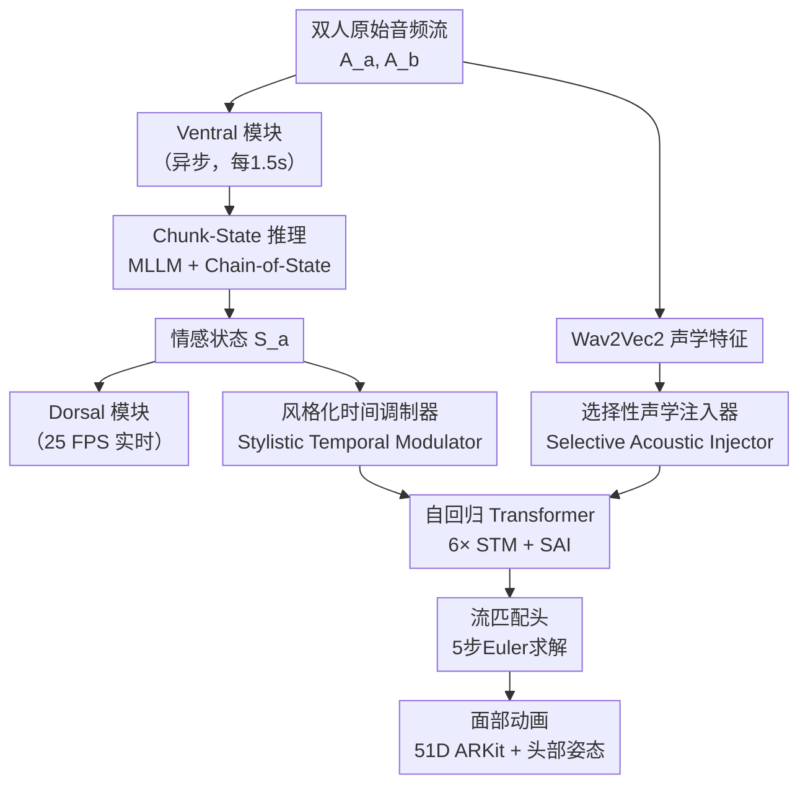

# MindFlow: Harmonizing Cognitive Semantics and Acoustic Dynamics for Facial Animation Generation in Dyadic Conversations

**会议**: ECCV2026  
**arXiv**: [2606.27779](https://arxiv.org/abs/2606.27779)  
**代码**: [https://harryxd2018.github.io/MindFlow/](https://harryxd2018.github.io/MindFlow/) (项目页)  
**领域**: 数字人 / 图像生成  
**关键词**: 面部动画, 双人对话, 腹侧-背侧双通路, 流匹配, 选择性声学注入

## 一句话总结
MindFlow 受神经科学腹侧-背侧双通路模型启发，将双人对话中的面部动画生成解耦为认知语义理解（Ventral 模块）与反射性运动生成（Dorsal 模块）两条协同通路，通过 Chunk-State 方法从音频块中提取细粒度情感状态并指导流匹配网络生成高保真面部动画。

## 研究背景与动机

生成逼真的双人对话面部动画是计算机视觉和图形学领域长期追求的目标，在虚拟教育、社交陪伴、娱乐等方向有广泛应用。然而，现有方法始终面临一个根本困境：它们生成的面部动画要么"空洞"——看着在动但表情缺乏语义支持；要么"僵硬"——时间对齐差、反应时机不对。造成这一困境的核心原因在于，对话中的面部运动本身就是一个矛盾体：一方面需要高层语义理解来保证表情"合理"（例如听到笑话应该微笑），另一方面又需要对声学信号的瞬时反射来保证同步（嘴唇和音频必须严丝合缝）。

从神经科学来看，人类大脑完美地解决了这个矛盾——著名的 Ventral-Dorsal 双通路模型指出，自然对话依赖两条并行的神经通路：一条慢而深思的 Ventral 通路负责处理复杂语义和情感信息，一条快而反射的 Dorsal 通路负责将声学信号直接映射到发音运动区。然而现有计算方法始终未能完整模拟这一功能二重性。传统纯音频驱动方法（如 Audio2Photoreal、DualTalk）只模仿了 Dorsal 通路的功能，直接从声学信号映射运动，忽略了高层语义理解，导致动画视觉上在动但语义上"空心"。而最近引入 LLM 的方法（如 CustomListener、SocialAvatars）虽然尝试用文本模态理解语义，但采用 Sentence-Action 范式——基于句子级文本推理行为——面临两个根本缺陷：一是文本转录必然丢失语调、重音等副语言信息，二是句子粒度太粗，无法捕捉话语内部的瞬时情感变化和精细时序同步。

本文的切入角度是：既然人类大脑天然通过两条独立通路并行处理这两类需求，计算模型也应该遵循这一生物设计原则——不必用单一网络同时承载语义推理和运动控制两个矛盾目标。**核心 idea：受神经科学腹侧-背侧双通路模型启发，将对话面部动画生成解耦为两个独立协同的模块——Ventral 模块负责从音频流中持续提取细粒度情感状态（认知语义理解），Dorsal 模块基于情感状态和声学线索通过条件自回归流匹配生成高保真面部运动（反射性运动控制），两者通过 Chunk-State 方法以音频块（而非句子）为基本推理单元实现精细对齐。**

## 方法详解

### 整体框架

MindFlow 的核心架构由两个异步运行的模块构成，分别对应生物 Ventral 和 Dorsal 双通路。整个系统以流式（streaming/causal）方式运行：任何时刻 t，仅基于截止到 t 的**历史**音频和运动信息生成当前帧——这与人类对话中无法预知未来的生物约束一致。输入为两个对话者 A 和 B 的连续原始音频流 $A_a^{\leq t}$ 和 $A_b^{\leq t}$，输出为对话者 A 的 51 维 ARKit blendshape 表情系数和 3D 欧拉角头部姿态。Ventral 模块以 1.5 秒音频块为粒度异步更新情感状态 $S_a$，Dorsal 模块以 25 FPS 实时生成面部运动，复用最新的情感状态直至下一状态到达。

### 关键设计

**1. Chunk-State 方法：以音频块为推理基元替代句子级文本推理**

现有 Sentence-Action 方法先将对话转写为文本，再由 LLM 基于整句内容推理具体动作。这带来两个问题：文本转录丢失语速、音调、情感等副语言线索；句子粒度太粗，无法指导精细的时序对齐。Chunk-State 方法的思路是让 Ventral 模块不必输出具体的运动指令（那本应是 Dorsal 的任务），而是直接以原始音频块为输入，输出一个高层、连续演进的情感状态链（如 neutral → slightly amused → happy）。1.5 秒的窗口刚好：足够短到能捕捉话语内部的细腻情感变化，又足够长（包含完整语调模式）以保留副语言线索。Ventral 模块只做认知层面的"场评估"，不预支空间细节——具体的表情由 Dorsal 模块在接收到情感先验后自主生成。这种认知-运动解耦的设计原则直接呼应了生物双通路模型中 Ventral 不负责精细运动的本质。

**2. 流式 Chain-of-State 机制：让 MLLM 记住自己的推理轨迹**

直接将音频块逐个喂给 MLLM 会破坏对话上下文（每个块被独立分析、忘记历史情感），而简单拼接历史音频作为输入又会让 MLLM 缺乏对先前推理状态的感知，导致相邻块的情感预测来回振荡。Chain-of-State 的核心是让 MLLM 的推理历史也参与当前推理：在第 k 步，Ventral 模块的输入不仅包含当前双人音频块，还包含历史所有音频块和此前的全部情感状态 $(A_a^{\leq wk}, A_b^{\leq wk}, S_a^{<k})$。MLLM 在完整的音频上下文和自身情感轨迹上推理当前情感，然后将新的预测追加到上下文中供下一轮使用。这种自回归式的情感状态链有效地消除了无记忆推理的振荡——相邻块的预测自然平滑过渡，而情感状态的演进轨迹也被持续发送给 Dorsal 模块作为语义先验。

**3. 选择性声学注入器：让注意力机制学习动态门控双人音频**

双人对话中存在一个天然矛盾：A 说话时系统应关注 A 自己的音频以保证唇音同步，A 倾听时应关注 B 的音频以驱动合适的倾听反应。现有方法通常将双人音频特征拼接后过 MLP 再做交叉注意力（early-mix），这会提前冲稀不同音频源的信息，让网络难以区分"说话"和"倾听"两种模式。选择性声学注入器不提前混合，而是将 A 和 B 的音频特征**时序交织**（Interleave）成一个统一的声学上下文 $A_{ctx} = \text{Interleave}(A_a, A_b)$，然后让运动历史 $H_m$ 作为**查询**在这个上下文中做交叉注意力。注意力机制天然承担了动态门控的角色：当生成 A 的运动时，注意力自发集中在 A 的音频轨迹上以保证唇音同步；轮到对方说话时，注意力自动切换到 B 的轨迹以驱动倾听反应。这种门控行为没有显式的说话人标签监督，完全由流匹配的生成目标隐式涌现——注意力热力图清晰地展示了这一无监督的说话-倾听模式切换。

**4. 条件自回归流匹配：高效的非确定性运动生成**

面部运动天然具有多样性——同一个音频可以对应多种合理的表情变化。传统确定性回归（MSE 损失）会退化成模糊的平均表情。Dorsal 模块采用流匹配作为生成式替代：MLP 参数化速度场 $v_\theta$ 学习从标准高斯分布到数据分布的传输映射，训练目标 $\mathcal{L}_{flow} = \mathbb{E}[\|v_\theta(Z_\tau, \tau|C) - (Z_1 - Z_0)\|^2]$。流匹配的关键优势是学习直线传输轨迹——推理时只需 5 步 Euler 求解即可逼近解，远小于扩散模型的迭代去噪步数。在自回归框架下，Dorsal 模块依次预测每帧的头部角速度和表情条件编码，训练时对历史运动加高斯噪声扰动（随机 $\sigma \in [0.01, 0.05]$）以防止过拟合和历史捷径。头部姿态被特意处理为角速度而非绝对角度预测，有效避免了自回归推理中的姿态漂移问题。

### 损失函数 / 训练策略

Dorsal 模块的唯一训练信号是流匹配损失 $\mathcal{L}_{flow}$，不含显式的唇音同步损失或情感分类损失。训练采用两阶段策略：先在 HDTF + VICOX 上预训练 90k 步建立基本的说话和对话行为模式，再在 MEAD + VICO 上微调 30k 步增强情感表达质量。音频编码器 Wav2Vec2 全程冻结。优化器 Adam，学习率 $1\times10^{-5}$，余弦调度加 1% warmup，batch size 64。推理时 Ventral 模块处理每块约 1.38s，Dorsal 模块实时运行于 25 FPS，系统共需 59 GB VRAM，可在 2 分钟序列上持续推理。

## 实验关键数据

### 主实验

| 状态 | 数据集 | 指标 | 本文 | 之前最佳 | 提升 |
|------|--------|------|------|----------|------|
| 说话 | HDTF | SyncD ↓ | 0.333 | 0.341 (A2P) | -2.3% |
| 说话 | HDTF | SyncC ↑ | 0.520 | 0.519 (A2P) | +0.2% |
| 说话 | HDTF | FD (Exp) ↓ | 15.76 | 17.64 (A2P) | -10.7% |
| 倾听 | VICO | FD (Exp) ↓ | 13.86 | 14.24 (A2P) | -2.7% |
| 倾听 | VICO | MSE (Exp) ↓ | 0.30 | 0.34 (A2P) | -11.8% |

### 消融实验

| 配置 | 关键指标 | 说明 |
|------|---------|------|
| Full model | FD (Exp) 13.86 | 完整模型 |
| w/ Random 情感状态 | FD (Exp) 15.21 | 去掉语义引导，FD 升 9.7% |
| Sentence-Action 替代 Chunk-State | FD (Exp) 14.39 | 句子级推理导致时序错位 |
| w/o Selective Acoustic Injector（Ours） | SyncD 0.350 | 去掉注入器后端音同步下降 |
| w/o SAI（A2P 架构） | SyncD 0.341 | 注入器跨架构通用，在其他框架上同样有效 |

### 关键发现

- 消融实验清晰佐证了双通路设计的必要性：去掉 Ventral 语义引导后表情 FD 从 13.86 升到 15.21，说明仅凭声学-运动映射不足以生成语义合理的表情。
- 选择性声学注入器在 A2P 架构上同样带来改善（SyncD 0.341 → 0.331），证明其跨架构通用性，不仅仅是 MindFlow 定制设计。
- 采样步数实验揭示了一个反直觉结果：超过 5 步后质量反而下降，归因于更长的积分轨迹累积矢量场预测误差并引入高频抖动。
- 头部姿态训练从预测绝对角度改为预测角速度，有效解决了自回归推理中模型走"复制历史姿态"捷径导致的累积漂移。

## 亮点与洞察

- **双通路解耦+粒度突破**：将生物 Ventral-Dorsal 双通路模型直接映射到计算框架，让每个模块做自己最擅长的事——Ventral 做场评估、Dorsal 做运动执行——比单一模型同时承载两个矛盾目标效果更好。而 Chunk-State 替代 Sentence-Action 是粒度上的关键突破：1.5 秒音频块既保留副语言线索又提供精细时序分辨率。
- **隐式注意力门控**：选择性声学注入器不依赖显式的说话人检测分支，而是通过流匹配目标自然涌现出"说话时看自己、倾听时看对方"的注意力切换模式，简洁且有效。
- **流匹配的实时性优势**：自回归框架下的 5 步流匹配求解保证了非确定性生成的高效率，在 25 FPS 的推理速度下兼顾了表情多样性和计算开销。

## 局限与展望

- **仅依赖音频模态**：作者明确承认当前框架只用听觉输入，忽略了对方的面部表情、眼神、肢体语言等视觉线索。未来可融合多模态感知实现更全面的情境理解。
- **VRAM 需求大**：完整推理需要 59 GB VRAM，主要瓶颈来自 Ventral 模块的 MLLM 和 Dorsal 模块并行运行，在消费级硬件上部署受限。
- **跨语言/跨文化泛化未知**：实验仅在英文数据集评估，但情感表达在不同文化和语言中存在显著差异。Chunk-State 依赖原始音频的方法理论上具有跨语言迁移潜力，但有待实验验证。
- **头部姿态仍需特殊处理**：虽然角速度预测缓解了漂移问题，但姿态未能像表情那样直接用流匹配生成，说明当前架构在长期稳定性上仍有改进空间。

## 相关工作与启发

- **vs 纯音频驱动方法（Audio2Photoreal, DualTalk）**：这些方法只模拟 Dorsal 通路，忽视语义理解。MindFlow 在倾听状态 FD 上比最佳纯音频方法低 11.8%，证明语义先验的必要性。
- **vs Sentence-Action 方法（CustomListener, SocialAvatars）**：这些方法通过 LLM 理解文本语义但丢失副语言信息且时序粒度粗。MindFlow 的 Chunk-State 方法直接在音频域推理，精度更高、反应时机更准确。
- **vs 统一对话框架（UniTalker, OmniResponse）**：这些方法多侧重说话阶段的综合响应生成，对倾听阶段的连续非语言反馈关注较少。MindFlow 的双流异步架构天然覆盖了说话和倾听两个方向的完整信息流。

## 评分
- 新颖性: ⭐⭐⭐⭐☆ 生物启发的双通路解耦和 Chunk-State 方法设计新颖，属系统性改进而非颠覆性突破。
- 实验充分度: ⭐⭐⭐⭐⭐ 包含双指标对比、多组件消融、感知实验、采样步数分析，且对消融结果有深入讨论（含跨架构的注入器验证）。
- 写作质量: ⭐⭐⭐⭐⭐ 从神经科学原理到方法设计到实验验证的逻辑链清晰完整，motivation 叙述简洁有力。
- 价值: ⭐⭐⭐⭐☆ 对话面部动画是数字人核心问题，MindFlow 提供了可复现的双通路范式，对后续研究有指导意义，但 VRAM 开销限制工业落地。

<!-- RELATED:START -->

## 相关论文

- [\[CVPR 2026\] Semantics Lead the Way: Harmonizing Semantic and Texture Modeling with Asynchronous Latent Diffusion](../../CVPR2026/image_generation/semantics_lead_the_way_harmonizing_semantic_and_texture_modeling_with_asynchrono.md)
- [\[CVPR 2026\] FaithFusion: Harmonizing Reconstruction and Generation via Pixel-wise Information Gain](../../CVPR2026/image_generation/faithfusion_harmonizing_reconstruction_and_generation_via_pixel-wise_information.md)
- [\[CVPR 2026\] Harmony: Harmonizing Audio and Video Generation through Cross-Task Synergy](../../CVPR2026/image_generation/harmony_harmonizing_audio_and_video_generation_through_cross-task_synergy.md)
- [\[CVPR 2026\] Few-shot Acoustic Synthesis with Multimodal Flow Matching](../../CVPR2026/image_generation/few-shot_acoustic_synthesis_with_multimodal_flow_matching.md)
- [\[CVPR 2026\] Mixture of States: Routing Token-Level Dynamics for Multimodal Generation](../../CVPR2026/image_generation/mixture_of_states_routing_token-level_dynamics_for_multimodal_generation.md)

<!-- RELATED:END -->
