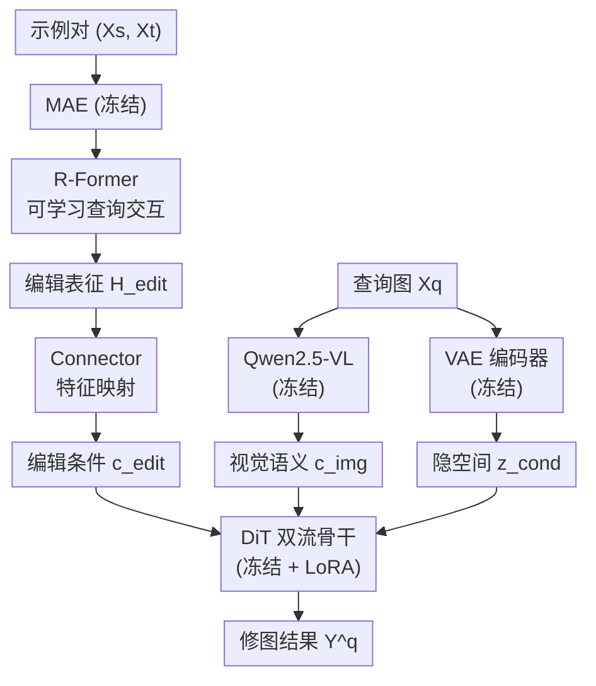

# MirrorPPR: Exemplar-Based Portrait Photo Retouching

**会议**: ECCV2026  
**arXiv**: [2606.29308](https://arxiv.org/abs/2606.29308)  
**代码**: 无（项目页 [https://sjtu-deng-lab.github.io/MirrorPPR](https://sjtu-deng-lab.github.io/MirrorPPR) 可能后续放出）  
**领域**: 图像生成  
**关键词**: 人像修图, 示例引导编辑, 扩散Transformer, LoRA微调, 数据自增强

## 一句话总结
MirrorPPR 提出示例引导的人像结构修图任务，通过专用的编辑操作提取器（MAE + R-Former）+ 连接器 + DiT 双流骨干（Qwen-Image-Edit-2511）+ LoRA 适配管线，配合自增强数据策略生成的 4700 万对数据集，首次实现了精细结构修图操作的精准跨身份迁移。

## 研究背景与动机

文本引导的图像编辑近年来取得了令人瞩目的进展，从 InstructPix2Pix 到 Qwen-Image-Edit、FLUX.2 等新一代模型都能处理多样化的编辑请求。然而，当任务落到人像结构修图时，文本描述暴露出本质局限：结构修图涉及极为精细的操作——缩窄鼻翼 2mm、抬高嘴角 3 度、轻微收窄下颌线——自然语言无法量化指定这些几何变形的精确空间尺度、方向和幅度。用户说"把眼睛放大一点"，模型不知道"一点"是 5% 还是 20%；说"瘦脸"，不知道是收下颌还是压颧骨。这种模糊性导致文本引导模型要么修不到位，要么修得面目全非，尤其在面部特征上容易产生解剖学上夸张的"过修"效果，严重破坏人像的身份特征。

示例引导编辑（exemplar-based editing）绕过文本的表达瓶颈：用户通过一张"修前—修后"示例对直观演示想要的操作，模型从中推断编辑意图后应用到另一张查询图上。这在风格迁移、物体替换等任务上已有成效，但迁移到人像结构修图遇到两个新挑战。第一，结构修图操作极度微妙——收缩嘴唇、轻微缩小鼻翼、收窄鼻梁——其视觉差异远小于风格迁移或物体编辑，现有示例引导模型（如 EditTransfer、RelationAdapter）缺乏感知这种精细差异的灵敏度，往往将操作误解为图像融合或人脸替换。第二，训练数据存在严重瓶颈：要构造跨身份的四元组（同一组操作同时作用于两张不同的人脸），由于拍摄尺度、姿态、遮挡和面部比例的差异，相同操作在不同脸上几乎不可能严格对齐，导致监督信号模糊、模型无法学到一致的"操作→迁移"映射。

本文针对上述两个瓶颈同时提出了解决方案。在建模层面，他们设计了一个专门的编辑操作提取器——利用冻结的 MAE 保留局部几何信息，再加上可学习查询的 Transformer（R-Former）从示例对中精确提取微细编辑表征，再通过连接器注入到预训练扩散 Transformer（DiT）中。在数据层面，他们提出自增强数据生成策略：只需要一个示例对，对修前和修后图像施加完全相同的一组随机空间增强（旋转、裁剪、翻转）自动合成查询对，既保证操作完全对齐又打破像素级对应关系，彻底绕过跨身份对齐难题。基于此策略构建了体量达 4700 万对的 MirrorPPR47M 数据集，并设计了从仿真变形到专业操作的渐进式课程学习方案。**核心 idea：将精细人像结构修图解耦为"操作提取"和"操作迁移"两阶段，前者用 MAE + 可学习查询 Transformer 感知微细编辑差异，后者用连接器注入冻结 DiT 进行零样本迁移；同时用同步空间自增强构造完美对齐的训练四元组，消除跨身份错位瓶颈。**

## 方法详解

### 整体框架

MirrorPPR 的整体管线分为两个串联的阶段：编辑操作提取器感知示例对（修前图 Xs、修后图 Xt）中的结构修图差异，输出编辑表征；该表征经连接器映射后作为条件注入预训练的 DiT 双流骨干（Qwen-Image-Edit-2511），配合 LoRA 进行端到端微调，最终将相同的修图操作迁移到新的查询图 Xq 上。整个框架的训练采用"先预训练提取器 → 再联合微调"的两阶段渐进流程。

### 关键设计

**1. R-Former 可学习查询：从示例对中提取微细编辑表征**

结构修图操作的视觉差异极其微妙，常规的编码器难以感知这种精细偏移。受到 Moto 的启发，本文设计了 Retouching Operation Extractor，由冻结的 MAE 和可训练的 R-Former 两部分组成。MAE 的掩码预训练使其天然保留了局部空间结构与几何信息，适合捕捉像素级精细差异——将示例对 Xs 和 Xt 分别送入冻结 MAE 得到 patch 级特征。

真正承担"提取差异"角色的是 R-Former，一个标准的 ViT 架构，但在序列维度上拼接了一组内部可学习查询 token（默认 8 个）。这些查询 token 通过自注意力的交互机制从 MAE 特征中"读出"代表修图操作的表征 H_edit。直觉上，查询 token 在多个自注意力层中反复与图像特征交互，逐渐学习到"哪些区域变化了、变化了多少方向"这些编辑意图，而对不变的身份信息不加关注。为了确保 H_edit 确实包含了准确的修图操作信息，提取器在预训练阶段通过一个辅助重建任务来监督：MLP 将 H_edit 压缩为紧凑的编辑嵌入 e_edit，加到查询图的每个 patch token 上后用一个轻量 ViT 解码器重建修图结果，损失为 MSE + LPIPS。预训练完成后辅助解码器被丢弃，留下纯语义的编辑表征 H_edit。

**2. Connector + LoRA 双流注入：将编辑条件高效适配到预训练扩散模型**

有了 H_edit 之后，需要将其注入到图像编辑扩散模型中以驱动修图操作。本文选择 Qwen-Image-Edit-2511 作为骨干，该模型采用双流 DiT 架构（Qwen2.5-VL 提取高层视觉语义 + 扩散流在 VAE 隐空间上执行去噪），接收文本指令作为条件。但本任务是示例驱动的，不需要文本，需要将视觉编辑条件融入这个双流系统。

关键设计是一个连接器（Connector），采用 Enc-Proj 结构：先用一个 Transformer 编码器将 H_edit 对齐到骨干的指令条件空间（维度 768→3584），再用线性投影层映射到 DiT 块的输入维度。连接器后的 c_edit 与 Qwen2.5-VL 提取的视觉特征 c_img、VAE 编码的图像隐空间 z_cond 一同输入 DiT 双流架构进行扩散去噪。

为了高效利用预训练 DiT 的强先验，骨干的原始参数被完全冻结，只在其注意力块中插入可训练的 LoRA 模块（rank=32）。联合微调阶段只更新 R-Former、连接器和 LoRA 模块的参数，以流匹配损失（velocity MSE）优化。这种冻结骨干 + 轻量适配的策略既保留了大模型已有的编辑能力，又避免了灾难性遗忘和大规模全参数微调的计算开销。

**3. 数据自增强与渐进式课程学习：消除跨身份对齐难题并渐进掌握专业操作**

构建示例引导修图的训练四元组（示例对 Xs→Xt + 查询对 Xq→Yq）时，最直接的方法是用跨身份数据：两张不同人脸施加同一组操作。但实际中由于姿态、遮挡、拍摄尺度的差异，同一修图操作在不同脸型上的像素级落点无法严格匹配——收窄鼻翼在正脸和 45 度侧脸上的表现完全不同，这种操作错位导致监督信号矛盾，模型无法学到稳定的操作迁移。

一个看似简单的替代方案是把示例对自身当作查询对（Self w/o Aug）：设 Xq=Xs、Yq=Xt。这虽然避免了错位，却引入了严重的捷径学习——模型只需抄写像素坐标差异，无需理解"操作语义"，导致在跨身份测试时完全失效。本文的核心数据策略是自增强：对示例对 Xs 和 Xt 施加完全相同的随机空间增强 A（旋转、水平翻转、动态裁剪），构造查询对 Xq=A(Xs)、Yq=A(Xt)。因为增强在两张图上同步，操作偏移量严格保持了一致；又因为增强打破了绝对像素坐标对应，模型无法走"抄坐标"的捷径，必须学会"从示例对提取操作语义→根据查询图的自身空间布局来施加操作"的泛化能力。自增强训练不仅效果匹敌甚至超越理想情况下的跨身份训练（后者在专业数据上因错位反而劣于自增强），收敛速度也更快。

基于自增强策略需要大量修图数据。本文构建了 MirrorPPR47M 数据集：模拟子集基于 FFHQ 的 3 万张人脸用 Landmark-Guided Local Warping（LLW）算法生成 8 类操作的 80 万对明显变形修图；专业子集基于 PPR10K 的 3,789 张 4K-8K 人像用商用修图 API 生成 27 类精细操作的 4,664 万对修图。两子集形成渐进课程——先在模拟数据上预训练提取器感知基础的结构变形，再切入专业数据适应真实世界的精修操作，最后仅用专业数据对全框架做联合微调。

### 一个完整示例

假设有一个示例对：Xs 是自然口型，Xt 是收窄嘴唇 2mm 且缩小鼻翼的修后效果。输入查询图 Xq 是一张新人脸。流程如下：Xs 和 Xt 分别经过冻结 MAE 提取 patch 特征，R-Former 的 8 个查询 token 通过自注意力交互从特征中"读出"两处操作差异，产生 H_edit（8×768 的特征）。连接器将 H_edit 映射为 DiT 的条件 c_edit（维度 3584）。同时 Xq 分别送入 Qwen2.5-VL 提取语义特征 c_img、送入 VAE 编码器提取隐空间 z_cond。这三路条件（c_edit、c_img、z_cond）输入 DiT 双流骨干，经过 40 步去噪生成最终结果 Y^q——查询图的口型变小、鼻翼收窄，而背景和皮肤纹理等不变区域保持原样。训练时，自增强会随机对 Xs 和 Xt 同步旋转 10 度并裁剪至不同区域，这样 Xq=A(Xs) 的口型和 Xs 不再像素对齐，但口型收窄的相对偏移量（像素位移方向和大小）在 Xs→Xt 和 Xq→Yq 中保持一致，迫使模型学习"收窄嘴唇"这个操作语义而非坐标抄写。

### 损失函数 / 训练策略

提取器预训练阶段使用 MSE + LPIPS 重建损失：$\mathcal{L}_{pre} = \|\hat{Y}_q - Y_q\|_2^2 + \lambda \mathcal{L}_{lpips}(\hat{Y}_q, Y_q)$，$\lambda=1.0$。联合微调阶段使用流匹配损失：$\mathcal{L}_{flow} = \mathbb{E}_{\mathbf{z}_1,\mathbf{z}_0,t}[\|\mathbf{v}_\theta([\mathbf{z}_t,\mathbf{z}_{cond}],t,\mathbf{c}_{img},\mathbf{c}_{edit}) - \mathbf{v}_t\|_2^2]$，其中 $\mathbf{z}_t = t\mathbf{z}_0 + (1-t)\mathbf{z}_1$ 为线性插值噪声隐变量，$\mathbf{v}_t = \mathbf{z}_0 - \mathbf{z}_1$ 为目标速度。预训练阶段学习率 1e-4（cosine 衰减至 5e-5），联合微调阶段学习率 1e-5（constant），AdamW 优化器。

## 实验关键数据

### 主实验

在两个跨身份测试基准上评估：SimFace-100（模拟修图，8 类操作 × 12 张人脸）、ProPortrait-500（专业修图，27 类操作 × 40 张人脸）。对比基线涵盖多参考图像编辑（Qwen-Image-Edit-2511、FLUX.2-dev、Nano Banana 2、Seedream 4.5）、示例引导编辑（ICEdit-LoRA、RelationAdapter、EditTransfer）和文本引导编辑（同组模型+文本 prompt）。

| 基准 | 指标 | MirrorPPR | 最佳基线 | 提升 |
|------|------|-----------|----------|------|
| SimFace-100 | PSNR ↑ | **32.25** | 25.80（文本 Qwen） | +6.45 |
| SimFace-100 | SSIM ↑ | **0.909** | 0.862（文本 Qwen） | +0.047 |
| SimFace-100 | LPIPS ↓ | **0.186** | 0.239（文本 Nano Banana 2） | -0.053 |
| SimFace-100 | Face Similarity ↑ | **0.937** | 0.601（文本 Nano Banana 2） | +0.336 |
| ProPortrait-500 | PSNR ↑ | **32.65** | 27.45（文本 Nano Banana 2） | +5.20 |
| ProPortrait-500 | SSIM ↑ | **0.927** | 0.904（文本 Nano Banana 2） | +0.023 |
| ProPortrait-500 | LPIPS ↓ | **0.200** | 0.183（文本 Nano Banana 2） | +0.017 |
| ProPortrait-500 | Face Similarity ↑ | **0.960** | 0.811（多参考 Nano Banana 2） | +0.149 |

值得注意的是多参考和示例引导基线几乎完全失败（PSNR 普遍低于 18），说明它们无法感知如此微细的结构编辑。文本引导基线在像素级重建上相对较好（因为保留了全局结构），但 Face Similarity 明显偏低——Nano Banana 2 在 ProPortrait-500 上 LPIPS 仅 0.183 但 Face Similarity 只有 0.667，说明严重破坏了身份特征。MirrorPPR 在所有指标上全面领先，尤其是在 Face Similarity 上拉开极大差距（0.960 vs 次优 0.811），说明它在精确迁移修图操作的同时完美保持了身份特征。

### 消融实验

| 配置 | PSNR (SimFace-100) | Face Similarity | 说明 |
|------|--------------------|-----------------|------|
| Self w/o Aug | 28.63 | 0.680 | 无空间增强，捷径学习严重 |
| Cross-Identity | 32.08 | 0.937 | 理想跨身份对齐（模拟数据可控） |
| Self-Augmentation（本文） | **32.25** | **0.937** | 无需跨身份，效果匹敌理想对齐 |
| Cross-Identity（专业数据） | 30.52 | 0.916 | 专业数据跨身份错位严重 |
| Self-Augmentation（专业数据） | **32.65** | **0.960** | 自增强在专业数据上大幅领先 |

核心消融结论：（1）无增强的 Self w/o Aug 因坐标抄写捷径显著劣化；（2）在模拟数据（操作可控）上自增强匹敌理想跨身份对齐；（3）在专业数据（操作类型多、姿态多样）上自增强大幅超越跨身份（PSNR +2.13，Face Similarity +0.044），因为跨身份在精细操作上更难对齐；（4）自增强收敛更快。

### 关键发现

- **编辑表征空间具有向量可加性**：在提取的编辑嵌入 e_edit 上进行实例级均值中心化后，不同操作的编辑方向向量可以直接相加合成复合编辑效果（如"收窄眼角方向向量 + 增厚嘴唇方向向量"→ 复合操作），且向量相加的 PSNR 达 30.85，超越所有基线（不含 MirrorPPR 本体）。这说明学习到的编辑空间是解耦的和可组合的。
- **用户偏好度 79.0%**：在 100 个样本的 ProPortrait-500 用户研究中，参与者盲选时 MirrorPPR-Pro 获 79.0% 的偏好（次优文本引导 Nano Banana 2 仅 20.6%），表明其优势被真实用户清晰感知。
- **查询 token 数不敏感**：8 / 64 / 256 个查询 token 的表现几乎一致（PSNR 差异 <0.1），说明 8 个足够；LoRA rank 32 在效果与效率间最佳平衡。

## 亮点与洞察

- **将操作提取与操作迁移解耦**是核心设计智慧：提取阶段（R-Former）专注于感知"差异"，迁移阶段（DiT + LoRA）专注于"差异的应用"，两个子问题各自用最合适的技术解决，互不干扰。这与端到端直接生成相比，引入的归纳偏置更清晰。
- **自增强策略的精妙在于"破和立"两步走**：先用同源构造保证操作对齐（破跨身份错位），再用同步空间增强消除坐标对应关系（破捷径学习）——两个"破"留下了一个纯粹的操作语义学习信号。这是数据工程层面优雅的 insight。
- **编辑嵌入的向量可加性验证了空间的解耦性**：均值中心化去掉身份特征后，剩下的编辑方向向量可以独立操作、自由组合，相当于在隐空间里建立了一套"编辑操作代数"。这个性质对未来的组合式修图（如先 A 后 B 的复合效果预测）有很强的实用价值。
- **使用冻结 MAE + R-Former 而非端到端训练的编码器**：MAE 的几何表征优势（已被 Xie et al. 2023 证明）被巧妙地复用到"差异感知"这个任务上，避免了从零训练一个大编码器。这是一个高效且数据经济的迁移思路。

## 局限与展望

- **依赖冻结 MAE 和 DiT 骨干**：框架的性能上限受限于 MAE 对极细微操作的感知能力和 Qwen-Image-Edit-2511 的编辑先验质量。如果骨干更换（如未来更强的 DiT 模型），需要重新适配连接器和 LoRA。
- **未评估 3D 形变类操作**：目前 27 类专业操作全都是 2D 形变（平面关键点引导的 MLS 变形），对于涉及深度/视角变化的 3D 结构修图（如调整鼻梁高度在 3D 空间中的投影变化）可能不够。未来可考虑引入 3D 人脸先验。
- **数据集仅包含单人像**：镜头的自增强策略依赖于单人框裁剪，多人合影场景（如集体照各自调整）的处理还未覆盖。
- **自增强的空间增强类型有限**：目前的增强（旋转、水平翻转、动态裁剪）主要是仿射类，未考虑非均匀变形（如鱼眼扭曲）或光照变化。更丰富的增强可能进一步提升泛化。

## 相关工作与启发

- **vs Moto**：Moto 提出用 MAE + 可学习查询提取运动表征，MirrorPPR 将其核心思路迁移到人像结构修图领域。区别在于 MirrorPPR 将提取出的编辑表征通过连接器注入 DiT，而非简单解码为目标图像，实现了跨身份迁移。
- **vs EditTransfer / RelationAdapter**：这两类示例引导方法在同色域、物体编辑等任务上有效，但缺乏感知极度细微差异的机制。MirrorPPR 的 MAE + R-Former 提取器在这些方法不可见的微操作尺度上依然有效。
- **vs 文本引导编辑（InstructPix2Pix、FLUX.2-dev）**：文本引导方法在处理"放大眼睛 10%"这类定量指令时天然不足。MirrorPPR 用视觉示例绕过语言模糊性，这是根本范式差异——不是改进文本理解，而是直接换了一个通信渠道。
- **vs MetaQuery**：连接器设计借鉴了 MetaQuery 的 Enc-Proj 结构来对齐不同模态的条件空间，但 MirrorPPR 的条件源不是文本而是视觉编辑表征，这是领域首次将这种设计用于修图操作注入。

## 评分
- 新颖性: ⭐⭐⭐⭐⭐ 提出了"示例引导人像结构修图"这一全新任务，并给出了从模型到数据的完整解决方案，自增强策略巧妙且可推广。
- 实验充分度: ⭐⭐⭐⭐⭐ 横跨三类基线（多参考/示例引导/文本引导）8 个模型、两个基准、消融/隐空间分析/用户研究，全方位验证。
- 写作质量: ⭐⭐⭐⭐⭐ 动机链条清晰（文本局限→示例范式→微编辑感知挑战→跨身份错位→两步解决方案），关键设计叙述流畅，没冗余。
- 价值: ⭐⭐⭐⭐⭐ 解决了真实修图场景中"要修哪、修多少"的精准控制问题，团队已同时开源模型、数据和数据集，实用价值极高。

<!-- RELATED:START -->

## 相关论文

- [\[CVPR 2026\] FG-Portrait: 3D Flow Guided Editable Portrait Animation](../../CVPR2026/image_generation/fg-portrait_3d_flow_guided_editable_portrait_animation.md)
- [\[CVPR 2026\] ExpPortrait: Expressive Portrait Generation via Personalized Representation](../../CVPR2026/image_generation/expportrait_expressive_portrait_generation_via_personalized_representation.md)
- [\[ICCV 2025\] MoFRR: Mixture of Diffusion Models for Face Retouching Restoration](../../ICCV2025/image_generation/mofrr_mixture_of_diffusion_models_for_face_retouching_restoration.md)
- [\[ECCV 2024\] EBDM: Exemplar-guided Image Translation with Brownian-bridge Diffusion Models](../../ECCV2024/image_generation/ebdm_exemplar-guided_image_translation_with_brownian-bridge_diffusion_models.md)
- [\[ICLR 2026\] OmniPortrait: Fine-Grained Personalized Portrait Synthesis via Pivotal Optimization](../../ICLR2026/image_generation/omniportrait_fine-grained_personalized_portrait_synthesis_via_pivotal_optimizati.md)

<!-- RELATED:END -->
