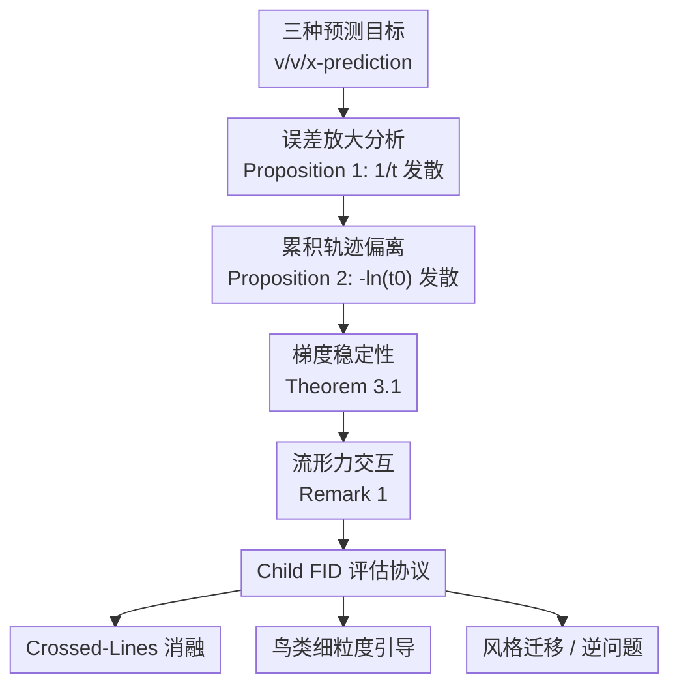

# Not All Prediction Targets Keep Training-Free Diffusion Guidance on the Manifold

**会议**: ECCV 2026  
**arXiv**: [2607.00647](https://arxiv.org/abs/2607.00647)  
**代码**: [https://github.com/ManLuML/on-manifold-tfg](https://github.com/ManLuML/on-manifold-tfg)  
**领域**: 扩散模型  
**关键词**: 训练免引导, 预测目标, 扩散模型, 流匹配, 流形保持

## 一句话总结
本文从理论上证明扩散模型的预测目标（$\epsilon$-prediction / $v$-prediction / $x$-prediction）在训练免引导（training-free guidance）下形成严格的误差放大层级，$\epsilon$-prediction 因恢复公式中 $1/t$ 因子在高噪声步发散而导致样本脱离数据流形，而 $x$-prediction 直接输出干净图像、无误差放大；实验通过 crossed-lines 控制消融、143 种鸟类细粒度基准和风格迁移三个维度验证了该层级，并引入 Child FID 作为流形感知评估指标。

## 研究背景与动机
训练免引导（TFG）[DPS, LGD, FreeDoM, TFG] 在推理时通过分类器/能量函数的梯度引导预训练扩散模型朝向期望属性，无需重新训练。现有 TFG 方法普遍依赖干净图像估计 $\hat{x}$ 来计算引导梯度 $\nabla_{z_t}\mathcal{E}(\hat{x})$：$\epsilon$-prediction（DiT）和 $v$-prediction（SiT, PixelFlow）必须从噪声状态恢复 $\hat{x}$，而 $x$-prediction（JiT）直接输出干净图像。

然而，强引导经常导致样本脱离数据流形（off-manifold），表现为坍塌、扭曲等灾难性失败。现有评估指标 Validity（top-1 准确率）无法区分"真正生成目标类样本"和"生成对抗性扰动欺骗分类器"——这一盲区在 17 篇 TFG 论文中有 15 篇未能避免。当之前的工作在强引导下最大化 Validity 时，实际上无意识地选择了欺骗分类器的离流形图像，而非目标类的多样样本。

**核心矛盾**：三种预测目标在生成质量（FID）上相当，但在流形保持上存在根本差异。问题在于，TFG 的引导质量取决于 $\hat{x}$ 的精度——$\hat{x}$ 不准时，引导梯度会推动样本离开流形。预测目标的选择是否决定了 TFG 下样本是否留在流形上？本文通过理论分析（命题 1、2 和定理 3.1）和系统性实验给出了肯定回答。

**核心 idea**：预测目标通过恢复公式造成了严格的误差放大层级——$\epsilon$-prediction 在 $t \to 0$ 时发散，$v$-prediction 有界衰减，$x$-prediction 零放大——这使 $x$-prediction 成为训练免引导最可靠的基础。

## 方法详解

### 整体框架
本文的研究框架包含三个层面：**理论分析**（三种预测目标的误差放大层级及累积效应）$\to$ **评估协议设计**（Child FID + 引导强度 Pareto 扫描 + 细粒度鸟类基准）$\to$ **系统性实验验证**（crossed-lines 控制消融 $\to$ ImageNet 细粒度引导 $\to$ 风格迁移 $\to$ 逆问题）。理论分析的输入是三种预测目标的恢复公式，输出是严格的误差放大层级和累积轨迹偏离上界；评估协议的设计动机是现有 Validity + FID 无法检测流形脱离，输出是 C-FID + 引导强度扫描曲线；实验验证则在从 2D toy 到 ImageNet 256x256 的多个尺度上检验理论预测。

### 关键设计

**1. 预测目标的误差放大层级（Proposition 1）：从恢复公式揭示 $1/t$ 发散**

在 Flow Matching 框架下，加噪过程为 $z_t = t \cdot x + (1-t) \cdot \epsilon$（$t=0$ 为纯噪声，$t=1$ 为干净数据）。三种预测目标通过不同公式恢复干净图像估计 $\hat{x}$：
- $\epsilon$-prediction：$\hat{x}^{(\epsilon)} = (z_t - (1-t)\epsilon_\theta)/t$
- $v$-prediction：$\hat{x}^{(v)} = z_t + (1-t)v_\theta$
- $x$-prediction：$\hat{x}^{(x)} = x_\theta$

设预测误差分别为 $\delta_\epsilon = \|\epsilon - \epsilon_\theta\|_2$、$\delta_v = \|v - v_\theta\|_2$、$\delta_x = \|x - x_\theta\|_2$，则干净图像估计误差为：

$$\|\hat{x}^{(\epsilon)} - x\|_2 = \frac{1-t}{t}\delta_\epsilon,\quad \|\hat{x}^{(v)} - x\|_2 = (1-t)\delta_v,\quad \|\hat{x}^{(x)} - x\|_2 = \delta_x$$

当 $t \to 0$（高噪声早期步），$\epsilon$-prediction 的误差放大因子 $(1-t)/t \to \infty$，而 $v$-prediction 的 $(1-t)$ 保持有界，$x$-prediction 则无任何放大。更关键的是，基础预测误差本身也服从维度缩放：$\delta_\epsilon \sim \sqrt{D}$（$\epsilon$-prediction 需解析全部 $D$ 维环境噪声）、$\delta_x \sim \sqrt{d}$（$x$-prediction 仅需映射到 $d \ll D$ 维流形）。对 ImageNet（$D=196,608$, $d \approx 26-43$），仅基础误差就有约 $68-87\times$ 差距，叠加 $(1-t)/t$ 放大后差距进一步扩大。

**2. 累积轨迹偏离（Proposition 2）与流形力交互（Remark 1）：为什么早期高噪声步是致命的**

Proposition 1 给出单步误差界，但引导采样是多步迭代——第 $k$ 步的误差会污染第 $k+1$ 步的状态。在 Lipschitz 引导能量 $\mathcal{E}$ 下，对 $N$ 步均匀 Euler 采样，累积扰动为：

$$C_\epsilon = \alpha L_g \int_{t_0}^{1} \frac{1-t}{t} \delta_\epsilon(t) dt,\quad C_v = \alpha L_g \int_{t_0}^{1} (1-t) \delta_v(t) dt,\quad C_x = \alpha L_g \int_{t_0}^{1} \delta_x(t) dt$$

在近似常数误差假设下：$C_\epsilon = \alpha L_g \delta_\epsilon[(t_0-1) - \ln t_0]$（当 $t_0 \to 0$ 时发散），$C_v = \alpha L_g \delta_v(1-t_0)^2/2$（二次收敛），$C_x = \alpha L_g \delta_x(1-t_0)$（线性收敛）。这三种截然不同的收敛行为直接决定了引导质量：$t_0 \to 0$ 附近的高噪声步贡献了 $\epsilon$-prediction 的绝大部分误差，但恰恰是这些早期步决定了样本的整体结构——一旦在此阶段脱离流形，后续步骤的流形恢复力也无法挽回。

Remark 1 从 Score 分解角度进一步解释了这一现象：Score $\nabla_{z_t}\log p_t(z_t)$ 可分解为去噪分量和流形恢复力，后者在 $t \approx 0$ 时最强（$\Theta(1/(1-t)^2)$ 发散）、在 $t=0$ 时最弱（$\approx 1$）。$\epsilon$-prediction 的 $\mathcal{O}(1/t)$ 误差放大恰好在流形恢复力最弱时最强，引导梯度得以压倒微弱的流形力、将样本推出流形。$x$-prediction 无此奇点，引导和流形力稳定组合。

**3. Child FID 与流形感知评估协议：区分"真正成功"和"欺骗分类器"**

现有 TFG 评估存在根本缺陷：Validity（分类器 top-1 准确率）接受任何被分类器标记为目标类的样本，包括离流形伪造品——类似对抗扰动 [Stutz et al.] 可欺骗分类器。Parent FID（P-FID，以全 ImageNet 为参考分布）同样不可靠：当引导成功地将生成分布从父类缩窄到目标子类时，P-FID 因参考分布不匹配而上升，无论样本质量如何。

本文提出 **Child FID（C-FID）**：以目标类别（鸟种数据集）而非全 ImageNet 作为 FID 参考分布。引导成功时，C-FID 下降（生成分布趋近目标类真实分布）；引导脱离流形时，C-FID 上升（生成分布虽然欺骗分类器，但在特征空间远离真实目标类）。配合引导强度 $\rho$ 的 Pareto 扫描曲线（P-FID vs. C-FID），可揭示单点对比掩藏的质量-引导完整 trade-off。

实验协议同时构建了**细粒度鸟类分类基准**：从 525 种鸟类数据集中筛选 143 种、嵌套于 30 个 ImageNet 父类下（每种 2-20 个子种、平均 4.8），形成天然的两层条件——CFG 引导至父类、DPS 引导至子种，且引导分类器与评估分类器分离以避免循环评估 [Shen et al.]。这一设计的巧妙之处在于：鸟类类别已在 ImageNet 标签空间内，预训练模型无需域迁移即可生成；物种间差异（羽毛、喙、眼部标记）需语义层面变化，使得分类器欺骗模式和流形内引导模式之间的差异最大化。

### 一个完整示例：Crossed-Lines 从 $D=2$ 到 $D=512$

以 crossed-lines 实验为例：基础流形是 $\mathbb{R}^2$ 中两条正交的 1D 直线 $b=a$（类 0）和 $b=-a$（类 1），加垂直高斯噪声，通过列正交投影嵌入到 $D \in \{2,8,32,128,512\}$ 维环境空间。对每个 $D$，训练三个仅预测目标不同的残差 MLP（相同架构、训练配置、随机种子），用 DPS（$s=10$, 100 步 Euler）引导朝向类 1，生成 10,000 个样本。

- 在 $D=2$ 时，三者均表现良好（$\epsilon$: 65.8%, $v$: 96.2%, $x$: 100% 在流形上）。
- 到 $D=32$ 时，$\epsilon$ 已显出颓势（58.5%），$v$ 和 $x$ 依然健壮。
- 到 $D=512$ 时，层级暴露无遗：$x$-prediction 保持 93.3%，$v$-prediction 降至 21.5%，$\epsilon$-prediction 仅有 0.5%——几乎全部样本崩溃为离流形噪声。这正是 Proposition 1 + 维度缩放效应（附录 0.A）的实证：$\delta_\epsilon \sim \sqrt{D}$ 和 $1/t$ 因子叠加，将高维下的引导推向灾难性失败。

### 损失函数 / 训练策略

本文不训练新模型，所有扩散模型使用官方预训练权重。理论分析的核心是对恢复公式的直接代数推导——无需网络训练或微调即可得到误差放大因子。引导实验中 DPS 使用分类器梯度 $\rho \nabla_{z_t} \log p(y|\hat{x})$，对 $x$-prediction 直接以 $x_\theta(z_t,t)$ 为 $\hat{x}$，绕过了不稳定恢复公式；潜空间模型（DiT, SiT）需每步做 VAE 解码才能获得像素空间梯度，增加了计算和重构误差开销。

## 实验关键数据

### 主实验：细粒度鸟类分类引导

表 1 展示了各模型在 DPS 引导下的关键指标（$\rho=0$ 为仅 CFG 基线）。最佳结果选取在 P-FID 不显著恶化的前提下的最佳 C-FID。

| 模型 | 预测目标 | 空间 | $\rho$ | P-FID $\downarrow$ | C-FID $\downarrow$ | Validity(%) $\uparrow$ |
|------|---------|------|-------|--------------------|--------------------|----------------------|
| DiT-XL/2 | $\epsilon$ | 潜空间 | 0 | 5.52 | 42.81 | 14.13 |
| DiT-XL/2 | $\epsilon$ | 潜空间 | 0.10 | 6.70 | 38.11 | 26.69 |
| DiT-XL/2 | $\epsilon$ | 潜空间 | 0.50 | 14.22 | 36.66 | 29.63 |
| SiT-XL/2 | $v$ | 潜空间 | 0 | 5.07 | 41.58 | 13.68 |
| SiT-XL/2 | $v$ | 潜空间 | 1.00 | 8.21 | 34.66 | 26.64 |
| SiT-XL/2 | $v$ | 潜空间 | 2.00 | 12.48 | 34.94 | 27.61 |
| PixelFlow | $v$ | 像素 | 0 | 6.29 | 44.07 | 13.55 |
| PixelFlow | $v$ | 像素 | 2.00 | 11.69 | 36.22 | 20.13 |
| PixelFlow | $v$ | 像素 | 5.00 | 28.24 | 47.71 | 18.07 |
| JiT-B/16 | $x$ | 像素 | 0 | 8.84 | 46.43 | 14.94 |
| JiT-B/16 | $x$ | 像素 | 6.00 | 12.24 | **31.30** | 26.77 |
| JiT-H/16 | $x$ | 像素 | 0 | 5.48 | 40.98 | 14.01 |
| JiT-H/16 | $x$ | 像素 | 3.00 | 6.91 | 32.85 | 26.60 |
| JiT-H/16 | $x$ | 像素 | 8.00 | 12.21 | **30.63** | 26.02 |

关键观察：(1) 在匹配 Validity $\approx 26.6\%$ 处，JiT-H C-FID 为 32.9 vs. DiT 的 38.1，差距 5.2 点——Validity 完全看不到的质量差异。(2) PixelFlow 的 C-FID 在弱引导下改善（44.1 $\to$ 36.2, $\rho=2$），但在强引导下恶化至 47.71（$\rho=5$）——C-FID 反转直接指示流形脱离。(3) JiT 系列中更大的模型（B $\to$ L $\to$ H）获得严格更优的 Pareto 前沿：存在引导缩放效应，容量既提升生成质量也提升引导响应性。

### 消融实验：Crossed-Lines 与模型规模

表 2 展示了 crossed-lines 实验中三种预测目标在不同环境维度下的流形保持率（$s=10$, 100 步）。

| 目标 | $D=2$ | $D=8$ | $D=32$ | $D=128$ | $D=512$ |
|------|-------|-------|--------|---------|---------|
| $\epsilon$-prediction | 65.8% | 76.7% | 58.5% | 9.1% | **0.5%** |
| $v$-prediction | 96.2% | 97.5% | 91.9% | 43.7% | 21.5% |
| $x$-prediction | 100% | 99.9% | 100% | 72.4% | **93.3%** |

维度缩放效应显著：$\epsilon$-prediction 从 $D=32$ 时的 58.5% 崩溃到 $D=512$ 时的 0.5%，验证了 $\delta_\epsilon \sim \sqrt{D}$ 与 $1/t$ 因子叠加的预测。$x$-prediction 的轻微下降（100% $\to$ 93.3%）主要源于高维下的分类器引导信号退化，而非流形脱离。

**模型容量反转对比**：JiT-B/16（$x$, 131M）最佳 C-FID 31.3 超越 DiT-XL/2（$\epsilon$, 675M）的 36.7 和 SiT-XL/2（$v$, 675M）的 34.4——在小 5.2 倍参数的情况下仍然胜出，排除了模型容量作为 $x$-prediction 优势的解释。

### 关键发现
- **$\epsilon$-prediction 的模式坍塌特征**：DiT 的 DINOv2 Precision 最高（0.24）但 Recall 最低（$\sim 0.49$），联合高 Precision + 低 Recall 是模式坍塌的标志——$\epsilon$-prediction 将样本集中在少数分类器友好的模板上，而非覆盖目标类的自然变化。相比之下，JiT-H 的 Recall 达 0.59、Precision 仅 0.17-0.19——牺牲单样本锐利度换取真正的多样性。
- **预测目标 > 操作空间**：PixelFlow（$v$, 像素空间）与 JiT（$x$, 像素空间）的比较直接隔离了操作空间——同为像素空间，PixelFlow 在强引导下 C-FID 反转（上升至 47.7），而 JiT-H 持续下降至 30.6。预测目标是决定引导鲁棒性的首要因素。
- **引导强度的稳定性差异**：$\epsilon$-prediction 在 $\rho=0.1$ 处达到最佳 C-FID，之后虽然 Validity 升高但 C-FID 停滞、P-FID 飙升——这是预算不当的典型信号。$x$-prediction 的引导强度范围约为 16 倍宽（$\rho=0.5 \to 8$ 均有收益），而 $\epsilon$-prediction 的可用范围极窄（$\rho=0.05 \to 0.1$）。

## 亮点与洞察
- **恢复公式作为统一解释框架**：三种预测目标的差异溯源到一个简单的代数事实——恢复公式中是否含 $1/t$ 除法。这个洞察将看似无关的观察（$\epsilon$-prediction 训练的维度缩放问题 [Karras, Jin] + 引导下的流形脱离）统一在同一个因果链下，简洁有力。
- **Child FID 作为流形感知指标的创新**：FID 本身不新，但把参考分布从全 ImageNet 换为目标子类的思路，配合引导强度 Pareto 扫描，能以极低成本（仅需换参考分布、无需额外模型）实现流形感知评估。这一协议可立即应用于任何 ImageNet 级扩散模型。
- **"优雅失败 vs. 灾难性失败"的决策视角**：低 Validity 但保留图像质量（JiT-H 强引导）优于高 Validity 但多样性坍塌（DiT 强引导），因为用户可以重试生成来命中目标类，但无法从模式坍塌或流形脱离中恢复。这一实践建议直接改变 TFG 方法的评估优先级。
- **$x$-prediction 在引导中的"免费午餐"**：$x$-prediction 无需任何额外机制（无需 MC 平滑、无需迭代校正、无需重复采样），仅凭预测目标本身的性质就能获得更稳定的引导梯度。这是对 JiT 工作的一个非平凡延伸——JiT 证明了训练时的流形优势，本文证明这一优势在推理时引导中同样存在且同样显著。

## 局限与展望
- **模型架构不可完美隔离**：$\epsilon$-prediction 和 $x$-prediction 对比中，DiT（潜空间）和 JiT（像素空间）在架构和操作空间上存在差异。作者坦诚承认这一点，并用五条独立的控制实验线（crossed-lines 完全控制 + DiT vs. SiT 潜空间配对 + JiT-B 容量反转 + PixelFlow C-FID 反转 + 四任务一致排序）收敛证明，而非依赖单一"完美"对比。不过，在 ImageNet 像素空间训练 $\epsilon$-prediction 确实不可行（FID 372 vs. 8.62 的 43 倍差距），这本身反而是本文论点的一部分证据。
- **理论假设的简化**：理论分析假设 Lipschitz 能量函数和充分训练的模型，实际中这两个条件可能不完全满足。引导强度的临界值推导（$\rho_x^*/\rho_\epsilon^* \approx 20$）与实验比值（JiT $\rho=8$ vs. DiT $\rho=0.5$, 16 倍）方向一致，但幅度有差距——部分因架构/空间差异。
- **仅评估梯度类 TFG 方法**：DPS、LGD、FreeDoM、TFG、Flow Guidance 等梯度类方法在误差放大层级的范围内，但注意力扰动类方法（SAG, PAG, NAG, SEG）不经过 $\hat{x}$ 的梯度，不在本文分析范围内。$x$-prediction 对注意力类方法的优势（如有）需要独立研究。
- **256x256 限制**：所有实验均在 256x256 分辨率下进行。更高分辨率下环境维度 $D$ 增大（$256^2 \cdot 3 = 196,608 \to 512^2 \cdot 3 = 786,432$），根据维度缩放分析，$\epsilon$-prediction 和 $x$-prediction 之间的差距应进一步扩大——但需实验验证。
- **未来方向**：推理时缩放方法（如 DAS, inference-time search）对 $\hat{x}$ 质量高度依赖，$x$-prediction 应享有显著的样本效率优势；视频和文生图场景下误差跨帧累积，预测目标层级的差距可能更大。

## 相关工作与启发
- **vs Karras et al. EDM / Hang et al. MinSNR / Jin & Wang KDiff**: 这些工作从训练角度揭示了 $\epsilon$-prediction 的误差放大和维度依赖性。本文的核心推进是将这些训练时观察扩展到推理时引导——证明预测目标对引导质量的影响是通过同一套数学机制（恢复公式），但以不同的表象（流形脱离 vs. 训练不稳定）呈现。
- **vs Pidstrigach et al. 流形力分解**: 他们的 Score 分解将 Score 拆分为去噪分量 + 流形恢复力。本文的 Remark 1 直接借用这一框架，点出 $\epsilon$-prediction 的 $1/t$ 放大恰好在流形力最弱的高噪声区最强——两个独立的理论线在此汇合，为实验观察提供了完整的因果解释。
- **vs Shen et al. TFG Understanding**: 他们首次揭示了 TFG 中对抗性梯度的存在和循环评估问题。本文在此基础上推进了两步：(1) 将对抗性梯度的根源追溯到预测目标本身（恢复公式的 Jacobian 含 $1/t$ 因子），而不仅仅是引导-评估分类器的耦合；(2) 提出 C-FID 作为可操作的解决方案。
- **vs Li & He JiT**: JiT 是 $x$-prediction 在训练时优越性的奠基工作。本文是其自然延伸——将"训练时流形保持"推广到"推理时引导中流形保持"，且证明了这一优势不是训练时的偶然副产品，而是由同一套误差放大层级直接决定的。

## 评分
- 新颖性: ⭐⭐⭐⭐⭐ 首次将预测目标与 TFG 的流形保持联系起来，理论（命题 1、2 + 定理 3.1）与系统性实验设计均为原创，Child FID 作为流形感知评估指标填补了 17 篇方法论文的通用盲区。
- 实验充分度: ⭐⭐⭐⭐⭐ 实验设计堪称范本：crossed-lines 完全控制消融 + ImageNet 六模型多强度扫描 + 风格迁移 + 逆问题（去模糊 + 超分）+ 蝴蝶第二域验证 + LGD/FreeDoM 方法泛化验证 + 模型容量反转对照，每条实验线都针对一个潜在的替代解释。
- 写作质量: ⭐⭐⭐⭐ 技术推导清晰（恢复公式的直接代数代入 $\to$ 命题 1 $\to$ 累积积分 $\to$ 定理 3.1），实验呈现逻辑严密。附录对架构差异的"confound 即证据"讨论坦诚且有说服力。略微可改进的是 3.3 节对 TFG 具体算法步骤的交代较简略。
- 价值: ⭐⭐⭐⭐⭐ 结论可直接指导实践——任何构建推理时控制管线的从业者都应优先选择 $x$-prediction 模型。对 $\epsilon$-prediction 模型，本文暗示其强引导下应配合额外的流形约束正则化（如 TFG 的 Monte Carlo 采样或迭代校正），但 $\epsilon$ 本身的 $1/t$ 放大决定了这些缓解手段的上限。

## 实验数据完整索引
- **细粒度鸟类引导**：完整 $\rho$-扫描数据见原文 Table 6，覆盖 DiT（$\rho \in \{0, 0.05, 0.1, 0.25, 0.5\}$）、SiT（$\rho \in \{0, 0.05, 0.1, 0.25, 0.5, 1, 1.5, 2\}$）、PixelFlow（$\rho \in \{0, 0.5, 2, 3, 5\}$）、JiT-B/L/H 三系列各 5-9 个 $\rho$ 值。
- **Crossed-lines 完整指标**：Table 10 给出所有维度（2/8/32/128/512）的流形保持率、Target MMD、分类准确率；半圆弧扩展实验见 Table 11 和 Table 12。
- **风格迁移完整数据**：Table 7 覆盖 DiT/SiT/PixelFlow/JiT-B/L/H 六模型，Gram Distance 和 Content Accuracy，$\rho$ 范围 0 到 50。
- **逆问题完整数据**：Table 8（高斯去模糊）和 Table 9（4x 超分）覆盖六模型的 LPIPS/PSNR/SSIM 全扫描。
- **文献评估习惯调查**：附录 0.D 三张表汇总 17 篇 TFG 方法论文在 FID 样本量、流形感知指标、引导强度扫描三轴上的完整对比。

<!-- RELATED:START -->

## 相关论文

- [\[ICLR 2026\] Stochastic Self-Guidance for Training-Free Enhancement of Diffusion Models](../../ICLR2026/image_generation/stochastic_self-guidance_for_training-free_enhancement_of_diffusion_models.md)
- [\[CVPR 2025\] Not All Parameters Matter: Masking Diffusion Models for Enhancing Generation Ability](../../CVPR2025/image_generation/not_all_parameters_matter_masking_diffusion_models_for_enhancing_generation_abil.md)
- [\[ECCV 2026\] ISAC: Training-Free Instance-to-Semantic Attention Control for Multi-Instance Generation](isac_training_free_instance_to_semantic_attention.md)
- [\[CVPR 2026\] Not All Birds Look The Same: Identity-Preserving Generation For Birds](../../CVPR2026/image_generation/not_all_birds_look_the_same_identity-preserving_generation_for_birds.md)
- [\[CVPR 2025\] Derivative-Free Diffusion Manifold-Constrained Gradient for Unified XAI](../../CVPR2025/image_generation/derivative-free_diffusion_manifold-constrained_gradient_for_unified_xai.md)

<!-- RELATED:END -->
