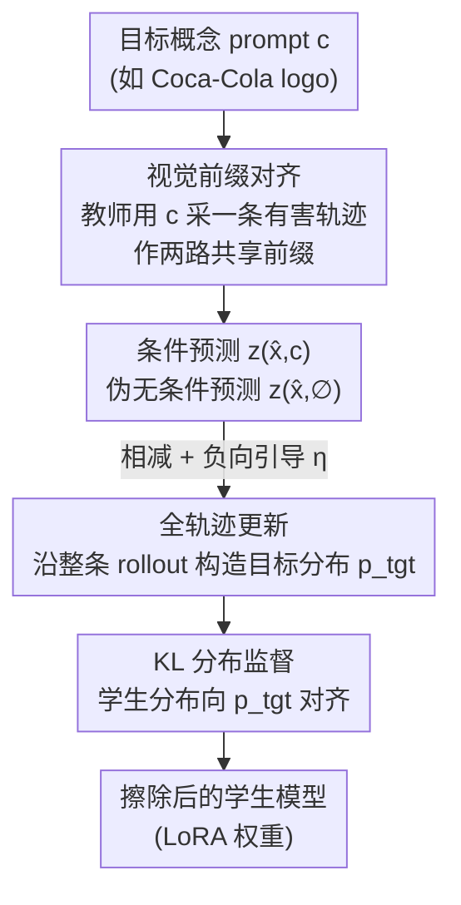

# Obliviate: Erasing Concepts from Autoregressive Image Generation Models

**会议**: ECCV 2026  
**arXiv**: [2606.28643](https://arxiv.org/abs/2606.28643)  
**代码**: 无（论文提及附录，未给出仓库链接）  
**领域**: 图像生成 / AI安全 / 概念擦除  
**关键词**: 概念擦除, 自回归图像生成, KL 分布监督, 全轨迹训练, 教师引导

## 一句话总结
把扩散模型里成熟的「负向引导概念擦除」搬到自回归图像生成模型上，通过共享视觉前缀对齐条件/伪无条件两路预测、在整条 token 轨迹上做 KL 分布监督，在几乎不损伤模型效用的前提下把裸露、血腥、品牌 logo 等概念擦干净（Liquid 上 RAB 裸露检测率从 91.58 降到 3.15）。

## 研究背景与动机
生成模型越来越逼真，也让「误用」的门槛越来越低——生成裸露、血腥、侵权品牌等有害内容的风险随之上升。业界对此的一条主流应对是概念擦除（concept erasure）：不重新训练整个模型，而是在训练后直接改写模型权重，把某个有害概念的生成能力抹掉，同时尽量保住其它正常内容的生成质量。这条路线在扩散模型上已经相当成熟，ESD、Ablating Concepts、MACE 等一系列方法奠定了「冻结教师 + 微调学生」的范式，甚至已经写进了 FLUX.2 这类前沿模型的发布里。

但文生图最近正在经历一次架构回潮：自回归（AR）路线因为「视觉-语言统一」的诉求重新火起来——Janus-Pro、Emu3、Liquid 这些模型用一个 Transformer 主干把图像合成当成 next-token 预测来做，天然继承了大语言模型的可扩展性。问题是，擦除方法几乎全长在扩散模型上，自回归这边基本是空白，而它同样脆弱、同样会被红队 prompt 攻破。更麻烦的是，扩散那套东西没法直接照搬：扩散擦除依赖的时间动量、全局去噪等性质，和自回归「逐 token 生长、token 顺序编码空间结构」的机制根本不是一回事。已有的少量尝试（如 EAR）把条件/无条件两路分别在**不同的**采样轨迹上算，两个分布一开始就发散，结果往往是概念还没擦掉、图像质量就先崩了；而且它只在互不重叠的 token 窗口上更新、还要为每个概念单独准备数据集。

本文的切入角度是：既然自回归生成本身就是一条轨迹，而「不同轨迹前缀不对齐」正是发散的根源，那就让教师先跑出一条有害轨迹，再把这条**同一条轨迹**同时喂给条件与伪无条件两路，用它们的差构造擦除目标，并在整条轨迹上做分布级监督。**本文的核心 idea 是：用共享视觉前缀对齐条件/伪无条件两路、在完整自回归 rollout 上做全轨迹 KL 分布监督，把扩散负向引导稳定地迁移到自回归图像生成的概念擦除上。**

## 方法详解

### 整体框架
Obliviate 沿用「冻结教师 + 可训练学生」的擦除框架，但把三处适配到自回归图像生成。给定要擦除的目标概念 prompt（如「Coca-Cola logo」），流程是：**①** 冻结的基座模型（如 Liquid）当教师，先用目标 prompt 采样出一条完整的有害图像 token 轨迹 $\hat{\mathbf{x}}=\{\hat{x}_1,\dots,\hat{x}_N\}$；**②** 把**同一条**轨迹当作共享前缀，让教师分别在「条件（喂目标 prompt $\mathbf{c}$）」和「伪无条件（喂空 prompt $\varnothing$）」下预测每个位置的 logits，两者相减、按负向引导构造出一个「压制该概念」的目标分布 $p_{\mathrm{tgt}}$；**③** 学生（教师的一份 LoRA 副本）在目标 prompt 下预测同样位置的分布，用 KL 散度在整条轨迹上把学生分布拉向目标分布。三处适配对应三个关键设计：视觉前缀对齐、全轨迹更新、KL 分布监督。

之所以要这三处适配，是因为「把扩散 ESD 直接翻译成自回归」会失败。扩散的负向引导目标是在某个去噪步 $t$ 上对比条件/无条件噪声预测（式 3）。照搬到自回归，最自然的做法是在位置 $k$ 上对比条件/无条件 next-token 预测——但如果两路各自独立采样、前缀互不对齐（记条件前缀 $\hat{\mathbf{x}}_{<k}$、无条件前缀 $\bar{\mathbf{x}}_{<k}$），两个 logits 分布会剧烈发散（论文 Fig.2a 红线），把模型学到的生成能力先搅坏、概念却还没擦掉。Obliviate 正是围绕「消除这种发散」来设计的。

### 关键设计

**1. 视觉前缀对齐：让条件与伪无条件两路站在同一视觉上下文里比较**

这是全篇的地基，直接针对「两路各自采样导致分布发散、图先崩」这个失败模式。已有方法（EAR）的条件前缀和无条件前缀来自两次独立的 rollout，本来就不在同一视觉语境下，两个 logits 分布从一开始就对不齐，负向引导的差信号里混进了大量「和概念无关、纯粹是两条轨迹不同」的噪声。Obliviate 的做法很直接：教师先在目标 prompt $\mathbf{c}$ 下采出一条有害轨迹 $\hat{\mathbf{x}}$，然后**复用这条轨迹**作为条件与伪无条件两路的共享前缀——所谓「伪无条件」，就是拿这条已经带有害结构的前缀、却喂空 prompt 去预测下一 token。于是位置 $k$ 的目标信号写成：

$$z_{\mathrm{tgt}}^{(k)}=z_{\theta^{\ast}}(\hat{\mathbf{x}}_{<k},\varnothing)-\eta\big(z_{\theta^{\ast}}(\hat{\mathbf{x}}_{<k},\mathbf{c})-z_{\theta^{\ast}}(\hat{\mathbf{x}}_{<k},\varnothing)\big),\qquad p_{\mathrm{tgt}}^{(k)}=\mathrm{softmax}(z_{\mathrm{tgt}}^{(k)})$$

其中 $\eta>0$ 是负向引导强度（引导尺度），$\theta^{\ast}$ 是冻结教师。对比一下就能看出关键差别：注意两路里的前缀现在都是同一个 $\hat{\mathbf{x}}_{<k}$，而不再是 $\hat{\mathbf{x}}_{<k}$ 与 $\bar{\mathbf{x}}_{<k}$ 分家。共享前缀带来两个好处：一是稳，两个预测在同一视觉语境下比较，逐 token 的分布分歧（Fig.2a 蓝线）明显低于分家的红线；二是准，当喂空 prompt 时，即便前缀里已经埋了早期有害结构，教师也倾向于往中性方向漂移，而喂 $\mathbf{c}$ 会继续强化有害延续——两者的差恰好高亮出「真正在维持这个概念」的那些 token，从而把权重更新聚焦到概念相关处、不去动 prompt 的其它语义。

**2. 全轨迹更新：一次 rollout 在每个位置都给监督，而非只盯单个 token**

扩散 ESD 每次只在一个采样到的时间步上更新（监督天然是「局部」的）。但自回归生成本身就是一条轨迹，有害概念是沿着一串相互依赖的 token 预测**逐步累积**出来的，而不是在某一个孤立位置冒出来的；加上因果掩码本来就允许一次前向在所有位置并行拿到监督信号。所以 Obliviate 把单步目标扩展成全轨迹目标，直觉上就是把式(9)里逐位置的 KL 在整条长度 $N$ 的 rollout 上平均。这样做既更贴合「概念沿生成链展开」的本质，又更省——一条采样轨迹就能在每个 token 位置提供训练信号。论文的消融很直观：只用孤立 token 更新时，前 40 步几乎不发生擦除；换成全轨迹更新，前 20 步就已经擦掉了（Fig.2b 中/下行）。

**3. KL 分布监督：匹配整个预测分布，而不是硬盯一个目标 token**

全轨迹更新有个副作用——大多数生成 token 其实并不「携带概念」，若用标准交叉熵去硬拟合每个位置的单个目标 token，会在大量无关的通用视觉 token 上做过激更新，把效用带崩（这也是先前工作不敢做全轨迹更新的原因）。这里作者利用了图像 token 和语言 token 的一个关键差异：语言里一个 token 往往强约束后续只能接什么，而图像 token 预测常是**多峰**的——存在许多「视觉近义」的 token 延续，局部语义相近但具体取值不同。因此监督「整个分布」比监督「单个 token」更合适：它会自动把概率质量摊得更均匀，弱化那些信息量低的区域，避免过分强调孤立目标 token。具体地，学生被训练去用 KL 散度匹配教师诱导的目标分布：

$$\mathcal{L}_{\textsc{Obliviate}}=\frac{1}{N}\sum_{k=1}^{N}D_{\mathrm{KL}}\big(p_{\mathrm{tgt}}^{(k)}\,\|\,p_{\theta}^{(k)}\big),\qquad p_{\theta}^{(k)}=\mathrm{softmax}\big(z_{\theta}(\hat{\mathbf{x}}_{<k},\mathbf{c})\big)$$

效果上，学生学会把概率质量从「有害概念相关的延续」挪走、重新分配到更安全的替代上。这一点在品牌擦除里尤其吃香：品牌 logo 常由稳健的局部视觉图案（简单配色、基本形状）构成，多种不同 token 组合都能画出相似标志——只压制最可能的那一个 token，旁边的近义 token 仍会漏出品牌痕迹；而 KL 作用在整个分布上、配合负向引导，能把「最可能的品牌 token + 附近会画出相似符号的替代 token」一起压下去，于是模型不是把 Coca-Cola logo 稍微扰动一下，而是整体避开红白经典设计、直接画成一个普通易拉罐。

### 损失函数 / 训练策略
最终训练目标就是上面的全轨迹 KL 损失 $\mathcal{L}_{\textsc{Obliviate}}$（式 9），它是「负向引导目标分布（式 7）+ 全轨迹平均 + KL 分布匹配」三者的合体。实现上全部用 LoRA 微调（rank 32，$\alpha=16$，5% dropout），三个模型都只在各自 LoRA 兼容层上更新（排除视觉编码/投影等模块）。负向引导强度 $\eta$ 是主要旋钮：Liquid 固定 $\eta=2$、Emu3-Gen 用 $\eta=1$，Janus-Pro 按场景调（$\eta=10$ 是较稳的默认值）。裸露/血腥场景训练约 400–1000 步，品牌场景收敛极快（Liquid 上 30 步即可），说明局部概念比弥散概念更好擦。

## 实验关键数据

在 Liquid-7B、Emu3-Gen、Janus-Pro 三个自回归文生图模型上评测，覆盖裸露、血腥、品牌(Coca-Cola)三类概念。核心指标是**概念检测率 CDR（Concept Detection Rate，↓）**：用专用分类器判断生成图里是否出现目标概念，CDR 即「检出目标概念的图像占比」——裸露用 NudeNet、血腥用 Q16、品牌用三个开源 VLM(Qwen2.5-VL/LLaVA-1.5/Phi-3.5-Vision)多数投票。效用用 FID(↓) 和 CLIP-Score(↑) 衡量。

### 主实验

裸露擦除（Table 1，节选 Liquid 与 Janus-Pro）。Obliviate 在把 CDR 压到最低的同时基本不动 FID，而对照方法要么擦不干净、要么效用崩：

| 模型 | 方法 | T2I-RP↓ | RAB↓ | MMA-Diff↓ | FID↓ | CLIP↑ |
|------|------|---------|------|-----------|------|-------|
| Liquid | Original | 45.82 | 91.58 | 20.30 | 14.24 | 13.06 |
| Liquid | Negative Prompt | 17.67 | 35.79 | 7.60 | 16.24 | 13.13 |
| Liquid | SFT | 27.26 | 45.26 | 16.20 | 14.60 | 13.05 |
| Liquid | **Obliviate** | **3.73** | **3.15** | **2.80** | 15.41 | 13.10 |
| Janus-Pro | Original | 62.08 | 55.79 | 18.70 | 12.39 | 13.16 |
| Janus-Pro | EAR | 28.33 | 11.58 | **0.80** | 31.63 | 13.16 |
| Janus-Pro | **Obliviate** | **18.11** | **1.05** | 1.00 | **12.31** | 13.35 |

品牌擦除（Table 2b）是 Obliviate 优势最悬殊的场景，CDR 几乎压到 0：Liquid 94.60→5.22、Emu3-Gen 98.74→4.14、Janus-Pro 87.77→**0.18**，且 Janus-Pro 上 FID 甚至比原模型还好(12.39→11.76)。血腥擦除(Table 2a)最难——Janus-Pro 上仅从 94.74 降到 77.83，作者也承认血腥比裸露难擦得多，但 Obliviate 仍是三模型上降幅最大的。

### 消融实验

论文做了三组消融，最能说明设计动机的是「KL vs 交叉熵」（Table 4，Liquid 裸露场景）和「引导强度 $\eta$」（Table 3a）：

| 配置 | RAB↓ | MMA↓ | FID↓ | 说明 |
|------|------|------|------|------|
| CE（交叉熵 token 监督） | 5.26 | 4.40 | 23.24 | 擦除尚可，但全轨迹训练带来严重分布漂移，FID 崩到 23.24 |
| **KL（分布监督，完整）** | **3.15** | **2.80** | **15.41** | 擦除更好且 FID 显著更低，KL 起到隐式正则 |
| $\eta=1.0$（Liquid） | 1.05 | 5.20 | 14.72 | 引导偏弱 |
| $\eta=2.0$（Liquid，选用） | 3.15 | 2.80 | 15.41 | 擦除-效用平衡点 |
| $\eta=4.0$（Liquid） | 4.21 | 3.20 | 16.48 | 过强引导，FID 抬高 |

### 关键发现
- **KL 分布监督的主要价值不在擦得更狠，而在保住效用**：Table 4 里 KL 相比 CE 只在部分基准上擦除略好，但把 FID 从 23.24 拉回 15.41——因为它在无关图像区域给了隐式正则，避免全轨迹训练时对通用 token 过激更新。这直接印证了设计 3 的动机。
- **前缀对齐是「不崩」的关键**：Fig.2b 显示不对齐前缀会在概念(Coca-Cola)擦掉之前就把生成能力搅坏；对齐 + 全轨迹更新才能「快速擦除且不崩」。EAR 在 Janus-Pro 上 FID 飙到 31.63 而 Obliviate 只有 12.31，作者归因于共享视觉前缀带来更忠实的引导信号。
- **概念的「弥散 vs 局部」决定 prompt 该怎么写**（Table 3b）：语义弥散的裸露概念用「详尽 prompt」更好（覆盖更广的相关语义邻域）；而 Coca-Cola 这种局部品牌反而用「简单精确 prompt（就叫 Coca-Cola logo）」远好于详尽描述——详尽 prompt 在品牌上 CDR 反弹到 54.50(Liquid)。
- **血腥最难擦、多概念联合擦会退化**：血腥内容因视觉多样、无固定结构而最难压制；多概念方面，擦 1–2 类 CDR 可到 0，但擦到 3/4/5 类时平均 CDR 升到 12.20/25.05/47.56，GenEval 也从 79.38 掉到约 74–75，组合生成能力有损。

## 亮点与洞察
- **「共享视觉前缀」是最巧的一刀**：把负向引导迁到自回归失败的根因，被精准定位为「两路轨迹前缀不对齐→分布发散」，而解法只是「复用同一条教师轨迹当两路前缀」——几乎零额外成本却同时解决了「稳定性」和「概念定位」两个问题，是可迁移到任何自回归擦除/编辑任务的通用 trick。
- **用「图像 token 多峰」这一性质反推出 KL 优于 CE**：作者没有泛泛地说「分布监督更平滑」，而是指出图像 token 存在大量视觉近义延续，硬盯单 token 会漏掉近义替代（品牌场景尤甚），这个观察把「为什么用 KL」讲到了机制层面。
- **对「效用不崩」的执着值得学**：很多擦除工作只报擦除率，本文反复强调 FID/CLIP，并用 EAR 的 FID=31.63 反衬——提醒「擦得干净」和「别把模型搞坏」是两个必须同时看的轴。

## 局限与展望
- **鲁棒性只测了现成红队基准**：作者承认没测自适应白盒攻击（有模型参数/梯度访问权），无法确认擦除在针对性反擦除攻击下是否可靠。
- **多概念扩展会退化**：靠 adapter 融合做联合擦除，概念数一多效果就掉（5 类时平均 CDR 47.56），且组合生成能力(GenEval)受损，还没有优雅的多概念方案。
- **血腥等弥散概念擦除仍不彻底**：Janus-Pro 血腥 CDR 仍有 77.83，离「擦干净」很远。
- **价值绑定在架构走向上**：作者坦言若未来文生图仍以扩散为主流，专门的自回归擦除方法需求会变窄——方法的现实意义系于自回归/统一多模态能否成为主流。

## 相关工作与启发
- **vs EAR（自回归擦除的最接近对手）**: EAR 把扩散引导蒸馏搬到自回归，但条件/无条件两路在**不对齐**的独立轨迹上算、只在互不重叠 token 窗口上更新、还要每概念一个数据集；Obliviate 用共享前缀对齐两路、全轨迹并行更新、无需专门数据集。实测 Obliviate 在效用保持上碾压 EAR（Janus-Pro FID 12.31 vs 31.63）。
- **vs ESD（扩散擦除范式源头）**: ESD 在单个采样去噪步上做负向引导更新，监督天然局部；Obliviate 把负向引导目标(式 7)保留，但把「单步」换成「全轨迹」、把「噪声 MSE」换成「logits KL」，以适配自回归的离散 token 与轨迹式生成。
- **vs EraseFlow（全轨迹擦除的思想来源）**: EraseFlow 在扩散上论证「沿完整去噪轨迹擦除优于逐点更新」，Obliviate 把这一 trajectory 视角迁移到自回归——而自回归本就是轨迹生成过程，因果掩码天然支持全位置并行监督，使这一迁移比在扩散上更自然、更省。
- **vs SLD/负向提示（推理期引导）**: 这类方法只在推理时改 logits、不动权重，易被绕过；Obliviate 永久改写权重，鲁棒性更强。论文还把 SLD 适配到自回归(SLD*)当基线，发现须去掉 warm-up 与 momentum(自回归是空间逐 token 生成、无时间共享状态)，且引导尺度需大幅调低。

## 评分
- 新颖性: ⭐⭐⭐⭐ 首批系统解决自回归图像生成概念擦除的工作，三处适配都针对性强，但核心思路(负向引导+全轨迹)是从扩散侧成熟范式迁移而来。
- 实验充分度: ⭐⭐⭐⭐⭐ 三模型×三概念×多红队基准，KL/CE、$\eta$、prompt、多概念、Van Gogh 风格、VLM 评估器可靠性等消融齐全。
- 写作质量: ⭐⭐⭐⭐⭐ 从「为什么朴素迁移失败」一步步推到三个设计，动机链清晰，图 2 的失败模式可视化很有说服力。
- 价值: ⭐⭐⭐⭐ 填补了自回归擦除的空白、方法即插即用(LoRA)，但价值高度依赖自回归/统一多模态架构未来能否成为主流。

<!-- RELATED:START -->

## 相关论文

- [\[ICML 2026\] SAEmnesia: Erasing Concepts in Diffusion Models with Supervised Sparse Autoencoders](../../ICML2026/image_generation/saemnesia_erasing_concepts_in_diffusion_models_with_supervised_sparse_autoencode.md)
- [\[CVPR 2026\] Erasing Thousands of Concepts: Towards Scalable and Practical Concept Erasure for Text-to-Image Diffusion Models](../../CVPR2026/image_generation/erasing_thousands_of_concepts_towards_scalable_and_practical_concept_erasure_for.md)
- [\[ECCV 2026\] Continuous Speculative Decoding for Autoregressive Image Generation](continuous_speculative_decoding_for_autoregressive_image_generation.md)
- [\[ECCV 2026\] Layout-Conditioned Autoregressive Text-to-Image Generation via Structured Masking](layout-conditioned_autoregressive_text-to-image_generation_via_structured_maskin.md)
- [\[ECCV 2026\] Revisiting Autoregressive Models for Generative Image Classification](revisiting_autoregressive_models_for_generative_image_classification.md)

<!-- RELATED:END -->
