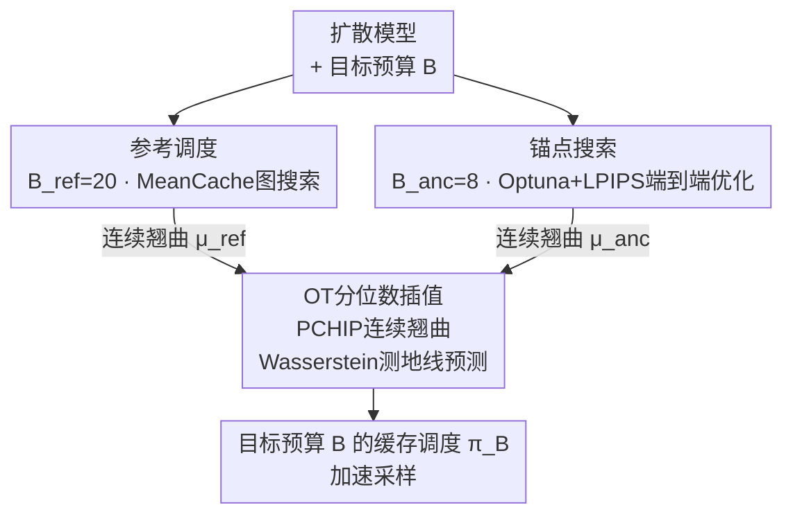

# OTCache: Optimal Transport for Geometry-Aware Caching in Diffusion Models

**会议**: ECCV 2026  
**arXiv**: [2606.31026](https://arxiv.org/abs/2606.31026)  
**代码**: [https://github.com/UnicomAI/OTCache](https://github.com/UnicomAI/OTCache)  
**领域**: 扩散模型 / 图像生成  
**关键词**: 最优传输, 扩散模型加速, 缓存调度, Flow Matching, 免训练

## 一句话总结
OTCache 提出免训练的扩散模型加速框架，通过最优传输理论将不同推理预算下的缓存调度建模为策略空间的连续演化轨迹，以高预算图搜索参考调度和低预算黑盒搜索锚点为两端点，在 Wasserstein 空间中通过分位数插值预测任意目标预算的调度方案，在 FLUX.1、Qwen-Image 和 HunyuanVideo 上分别实现 4.5x、4.7x 和 3.66x 加速，同时一致优于现有图搜索缓存基线。

## 研究背景与动机

Flow Matching 已成为现代生成式建模的核心范式，驱动 FLUX.1、HunyuanVideo 等商业级模型在图像和视频合成上取得突破。然而，基于 Transformer 的去噪器参数量巨大，50 步迭代采样的计算开销和显存占用极高，严重阻碍交互式或资源受限场景的部署。免训练的缓存技术通过重用相邻时间步的中间特征来绕过冗余计算，成为加速推理的重要方向。

代表方法 MeanCache 和 LeMiCa 将缓存调度建模为有向图上的约束最短路径问题：节点为离散时间步，边权重为缓存一步引入的局部速度场误差，最优调度即累积边权重最小的路径。这一范式的核心假设是**加性独立性**——端到端的生成质量损失可近似为各步局部误差的累加和。在高 NFE 区间（如 B=20），缓存间隔短、单步决策对后续步影响有限，该假设大致成立。然而在**低 NFE 区间（高加速比）**下，缓存间隔拉长、早期决策的误差沿去噪轨迹非线性传播并与后续决策交互，加性代理目标与真实感知质量之间的偏差急剧增大。如 Fig. 1A 所示，NFE 从 20 降至 8 时 MeanCache 与搜索最优解（Optuna）之间的 LPIPS 鸿沟显著扩大。现有方法对每个预算独立求解最短路径，忽视了不同预算下最优调度之间的结构关联，导致低 NFE 区间调度质量不足。

更关键的是，本文观察到一条被忽视的**结构规律**：不同 NFE 预算下的最优调度的 gap profile（相邻缓存步时间差的一阶序列）并非彼此无关，而是随预算平滑演化（Fig. 1B）。这暗示不同预算的调度是策略空间中同一理想轨迹在不同分辨率下的观测快照。基于这一洞察，OTCache 将预算条件化的调度演化建模为策略流形上的一条测地线，用最优传输理论中的分位数插值实现任意预算的调度预测。

**核心 idea**：不同预算下的最优缓存调度是同一理想去噪策略在不同 NFE 分辨率下的观测，它们在策略空间中沿一条光滑测地线演化——利用最优传输的分位数插值，以两个可靠端点（高预算参考 + 低预算锚点）在 Wasserstein 空间中预测任意目标预算的缓存调度，避免为每个预算独立求解有偏的加性代理目标。

## 方法详解

### 整体框架

OTCache 是一个免训练的三阶段缓存调度预测框架。输入为扩散模型和目标推理预算 B，输出为该预算下的最优缓存调度序列 π_B（即哪些时间步执行完整去噪、哪些步复用缓存特征）。三阶段协同：先在保守高预算下用图搜索获得高保真参考调度，再在极低预算下通过黑盒端到端搜索获得锚点调度，最后将两者提升为连续翘曲函数并在 Wasserstein 空间中进行分位数线性插值，预测目标预算的调度。

### 关键设计

**1. 参考调度：保守预算下的高保真图搜索**

图搜索方法（如 MeanCache）的核心假设——缓存路径的端到端损失可分解为各边局部损失的累加——在**高 NFE 区间（保守预算）**下基本成立。此时缓存间隔短，单步决策导致的误差对后续步的传播影响有限，加性代理目标与真实生成保真度之间的一致性较高。OTCache 利用这一性质，在保守预算 B_ref=20 下运行 MeanCache 搜索最短路径，获得参考调度 π_ref = C_graph(B_ref)。该调度被视作高保真参考——其 gap profile（相邻缓存步之间的时间间隔分布模式）编码了去噪 ODE 轨迹的时序结构，为后续预算条件化预测提供稳定的几何先验。若没有这一参考端点，仅凭低预算锚点无法捕捉密集采样下的精细轨迹形态。

**2. 锚点搜索：极低预算下的端到端感知优化**

在极低 NFE 区间（如 B=8），加性代理目标严重失真——缓存间隔大、误差非线性传播，最短路径的"最短"不再对应"最优"。OTCache 摒弃代理目标，直接优化端到端感知损失：以全步无缓存采样输出为参考，最小化缓存调度生成结果与参考之间的 LPIPS 距离：

$$\mathcal{J}(\pi) = \ell_{\text{LPIPS}}(x_0(\pi), x_0)$$

其中 x_0(π) 是执行调度 π 生成的图像/视频，x_0 是同 prompt+seed 下 50 步全采样的参考输出。该目标直接度量加速引入的感知保真度损失，天然规避了代理目标的系统性偏差。

搜索使用 Optuna 结合 CMA-ES 采样器，预算 200 次试验、早停 patience=50。两个实践技巧提升搜索效率：（1）**热启动**——以 MeanCache 在同预算下的调度为搜索初始点，提供强先验，若搜索未找到更优解则默认回退到 MeanCache，保证不比基线差；（2）**一阶 gap 参数化**——在相邻步时间差的 gap 空间而非绝对时间步空间中搜索。gap 空间天然保持时序单调性（gap 均为正数即保证时间步递增），且经验上搜索地形条件数更好。得到的锚点调度 π_anc 在 B=8 下平均比 MeanCache 降低 LPIPS 约 25%，为后续插值提供了可靠的极低预算端点。

**3. OT分位数插值：预算条件化的调度演化**

该设计的核心假设：不同预算下的最优调度并非无关的独立解，而是策略空间中同一理想轨迹在不同分辨率下的观测快照——预算的变化对应于沿该轨迹的连续滑动。因此，调度演化可建模为该策略流形上的一条测地线。具体步骤如下：

（1）**PCHIP 连续化**：用保形分段三次 Hermite 插值（PCHIP）将离散调度 π_ref 和 π_anc 分别提升为归一化进度 u ∈ [0,1] 上的严格单调连续翘曲函数 μ_ref(u) 和 μ_anc(u)。PCHIP 保证单调性且无多余振荡，随后以固定分辨率均匀采样获得等维表示，使两个不同长度的调度可在同一坐标系中对齐。

（2）**Wasserstein 测地线插值**：在一维情形下，两个概率分布之间的 Wasserstein 测地线等价于其分位数函数的线性组合。OTCache 将翘曲函数 μ(u) 直接视为分位数函数，目标预算 B 的调度预测为：

$$\mu_B(u) = \alpha_{\text{anc}}(B) \cdot \mu_{\text{anc}}(u) + \alpha_{\text{ref}}(B) \cdot \mu_{\text{ref}}(u)$$

权重 α_k(B) 由距离先验 w_dist = (|B_k - B| + 1)^{-1}（邻近性——靠近哪个已知预算就倾向谁）和置信度先验 w_conf = log B_k（高预算参考因密集采样更忠实地刻画 ODE 轨迹，赋予更高信任）的乘积归一化得到。这一加权设计的直觉清晰：离目标预算越近的已知调度权重越大，同时高预算参考因其更高的结构可靠性获得额外信任。

（3）**保守离散化**：从连续曲线 μ_B 恢复到离散时间步时，引入幂律扭曲 ρ ≥ 1.0 偏置 NFE 密度到 ODE 早期：t_i = P_sum(μ_B([i/(B-1)]^ρ))，其中 P_sum 为求和投影算子，将采样点取整并将残差重新分配到最大的采样间隔上，确保严格满足最大时间步 T_max 约束。ρ 偏置的动机来自经验观察：去噪早期矢量场波动大，需更密集的完整计算；而后期轨迹趋于平滑，可更激进地使用缓存。ρ 越大，早期密度越高。

### 一个完整示例

以 FLUX.1 [dev] 预测目标预算 B=10 的调度为例。Stage 1 在 B_ref=20 下用 MeanCache 搜索得到参考调度 π_ref：20 个时间步覆盖 [50, 1]，gap 分布相对均匀。Stage 2 在 B_anc=8 下用 Optuna 搜索得到锚点调度 π_anc：8 个时间步，gap 分布显著偏向前期（早期矢量场波动大，搜索自动将更多步分配给前期）。两者的 gap profile 形态相似但分辨率不同——这正是 Fig. 1B 所呈现的"同一轨迹不同分辨率快照"。

Stage 3 将 π_ref 和 π_anc 分别做 PCHIP 连续化，得到两条 monotonic 翘曲曲线 μ_ref 和 μ_anc。对目标 B=10，距离权重 w_dist 分别为 (|8-10|+1)^{-1}=1/3 和 (|20-10|+1)^{-1}=1/11，置信度权重 w_conf 分别为 log8≈2.08 和 log20≈3.00。综合后 α_ref 略高于 α_anc（B=10 虽更靠近锚点预算 8，但参考的高置信度扳回局面），插值产生的 μ_10 既保留参考的精细结构又吸收了锚点在极低预算下的激进缓存策略。最后以 ρ=1.3 对 μ_10 做幂律采样得到 10 个离散时间步，偏向前期密集分配。整个过程无任何模型调用——仅涉及闭式数学运算（插值+采样）。

### 损失函数 / 训练策略

OTCache 是完全免训练框架，无需任何模型微调或蒸馏。唯一涉及优化的环节是 Stage 2 的锚点搜索：以 LPIPS 为感知损失，通过 Optuna（CMA-ES 采样器）在 B_anc=8 下搜索最优调度，搜索预算 200 次试验、早停 patience=50，采用 MeanCache 初始化热启动和一阶 gap 参数化。Stage 3 的插值仅涉及闭式数学运算（PCHIP 拟合 + 加权线性组合 + 幂律采样 + 求和投影），无任何可学习参数。幂律扭曲参数 ρ 通过网格搜索确定：在 FLUX.1 上 ρ∈{1.00, 1.15, 1.30, 1.45}，ρ=1.30 取得最佳 PSNR/LPIPS 平衡（PSNR=26.03, LPIPS=0.126），全局固定使用。Stage 2 的离线标定成本约为每个 prompt 7.7 min（FLUX.1）、18.2 min（Qwen-Image）、50.5 min（HunyuanVideo）最坏情况，但标定后在线推理无额外开销，Stage 3 插值计算量可忽略。

## 实验关键数据

### 主实验

**Table 1: FLUX.1 [dev] (1024x1024) 各方法加速效果对比**

| 方法 | 加速比 | LPIPS ↓ | SSIM ↑ | PSNR ↑ | ImageReward ↑ | CLIP ↑ |
|------|--------|---------|--------|--------|---------------|--------|
| 原始 50 步 | 1.00x | – | – | – | 1.033 | 31.229 |
| TeaCache (l=1.5) | 3.66x | 0.504 | 0.624 | 15.01 | 0.717 | 30.696 |
| TaylorSeer (N=6,O=2) | 2.74x | 0.415 | 0.663 | 16.28 | 0.971 | 31.310 |
| LeMiCa (B=15) | 2.80x | 0.153 | 0.858 | 24.45 | 0.991 | 31.125 |
| LeMiCa (B=10) | 3.60x | 0.312 | 0.740 | 19.03 | 0.981 | 31.355 |
| MeanCache (B=15) | 2.91x | 0.142 | 0.870 | 24.83 | 1.010 | 31.244 |
| MeanCache (B=10) | 4.12x | 0.272 | 0.761 | 19.43 | 0.993 | 31.323 |
| **OTCache (B=15)** | **3.04x** | **0.126** | **0.881** | **26.03** | **1.011** | **31.167** |
| **OTCache (B=10)** | **4.50x** | **0.254** | **0.780** | **20.22** | **0.996** | **31.269** |

在 FLUX.1 上，OTCache 在 B=15 时以 3.04x 加速取得最低 LPIPS=0.126（MeanCache 2.91x 时 LPIPS=0.142）；极端加速 4.50x 下仍保持 ImageReward=0.996 和 LPIPS=0.254，而 TeaCache 在同级加速比下 LPIPS 已恶化至 0.504、CLIP 降至 30.696。定性结果显示，高加速比下基线方法出现频繁的内容不一致和物体畸变（如红山羊腿部畸形、剪刀不自然、钢琴键冗余），OTCache 在更大加速比下仍保持更好的内容一致性和视觉质量。

在 Qwen-Image (1664x928, 16:9) 上，OTCache (B=15) 以 3.20x 加速达到近乎无损的 LPIPS=0.069（MeanCache 2.85x 时 LPIPS=0.075）；极端加速 4.70x (B=10) 下保持 SSIM=0.864、PSNR=21.48，远超同预算 MeanCache（LPIPS=0.236、SSIM=0.815）。定性方面，在 16:9 海报风格生成中，OTCache 在加速前后保持显著更好的内容一致性，而 MeanCache 和 LeMiCa 出现物体相对位置变化（猫和章鱼）和主体朝向改变（长颈鹿）。

在 HunyuanVideo 视频生成上，OTCache (B=12) 以 3.21x 加速获得 VBench=80.20%、LPIPS=0.162（MeanCache 同加速比下 LPIPS=0.176）；极端加速 3.66x (B=10) 下 VBench=80.37%、LPIPS=0.252，DiCache 和 TeaCache 在同级加速比下已出现明显时序伪影和内容退化。

### 消融实验

**Table 2: 幂律参数 ρ 对重建质量的影响 (FLUX.1, B=15)**

| ρ | LPIPS ↓ | PSNR ↑ | SSIM ↑ | ImageReward ↑ |
|---|---------|--------|--------|---------------|
| 1.00（均匀采样） | 0.139 | 24.304 | 0.864 | 1.022 |
| 1.15 | 0.134 | 24.847 | 0.871 | 1.000 |
| **1.30** | **0.126** | **26.034** | **0.880** | **1.011** |
| 1.45 | 0.131 | 25.798 | 0.877 | 1.001 |

ρ=1.30 取得最优重建精度，验证了适度偏置 NFE 密度到 ODE 早期可提升稳定性；但 ρ=1.45 导致性能退化（PSNR 从 26.03 降至 25.80），说明过度偏置会牺牲后期去噪细化，使整体质量下降。

**Table 3: 锚点预算 B_anc 对 B=10 预测调度的影响 (FLUX.1)**

| B_anc | LPIPS ↓ | PSNR ↑ | SSIM ↑ | ImageReward ↑ |
|-------|---------|--------|--------|---------------|
| **8** | **0.254** | **20.22** | **0.780** | **0.996** |
| 6 | 0.301 | 18.59 | 0.752 | 0.978 |
| 4 | 0.302 | 18.29 | 0.753 | 0.970 |

B_anc=8 取得最佳重建质量。B_anc=6 或 4 时 LPIPS 从 0.254 恶化至 ~0.301-0.302，因为采样轨迹本身不稳定，无法为分位数插值提供足够的几何先验；4 和 6 表现接近说明极低预算下轨迹质量是瓶颈而非插值精度。

锚点搜索效果方面：Top-1 搜索调度平均将 MeanCache 的 LPIPS 从 0.338 降至 0.261（-25.04%），Top-3 仍保持 24.26% 提升，验证了端到端感知优化对代理目标偏差的有效修复。搜索效率上，中位数约 50 次试验收敛，绝大多数在 200 次内收敛。

### 关键发现

- **锚点搜索是质量提升的关键来源**：端到端 LPIPS 优化修复了加性代理目标在低 NFE 的系统性偏差，Top-1 调度相对 MeanCache 降低 LPIPS 约 25%，这个增益通过 OT 插值传导至所有中间预算。
- **OT 插值有效捕捉跨预算规律**：从 B_anc=8 和 B_ref=20 出发，插值预测的中间预算调度（B=15, 13, 10）在三个模型上均优于独立求解的图搜索方法，验证了调度演化的测地线假设。
- **锚点预算存在最优区间**：B_anc=8 是 50 步采样的最优锚点——搜索空间足够可处理（~5.36x10^8 候选）且轨迹质量足以支撑插值。过低（≤6）时轨迹本身不稳定，过高（接近 B_ref）则两端的差异不足以刻画演化路径。
- **初始化策略显著影响锚点搜索质量**：MeanCache 初始化的锚点平均 LPIPS=0.257，优于均匀初始化（0.293）和随机初始化（0.319）。ECDF 曲线显示 MC 初始化在更大比例的样本上获得高保真解。

## 亮点与洞察

- **核心观察优雅且令人信服**：Fig. 1B 的 gap profile 可视化直接展示了不同预算下最优调度的平滑演化——这是全文的支点，从经验观察到 OT 建模的跳跃自然且有坚实的实证支撑。
- **OT 视角巧妙规避维度灾难**：缓存调度搜索空间在 B=25 附近达到组合峰值（约 1.26x10^14 个候选路径），OTCache 仅在低搜索复杂度的锚点（B=8, ~5.36x10^8）进行一次搜索，其余所有预算通过闭式插值预测——将指数级搜索问题转化为 O(1) 插值问题。
- **一维 Wasserstein 的优雅性质**：一维情形的 Wasserstein 测地线等价于分位数函数的线性组合——OTCache 利用这一数学性质直接做 PCHIP 翘曲曲线的加权平均，避免了在概率测度空间中求解昂贵的 OT 耦合矩阵。这一技巧对任何需要在"两种策略/配置之间做平滑 morphing"的问题都具有可迁移性。
- **log 置信度加权有清晰的物理直觉**：w_conf = log B 为高预算参考赋予更高信任——密集采样更忠实地刻画 ODE 轨迹的连续结构。相比简单的"离谁近就用谁"（仅距离加权），置信度先验使参考在高加速区间仍能贡献有价值的结构信息。
- **gap 空间参数化是普适的优化技巧**：在黑盒搜索中优化 gap 而非绝对时间步，天然保证时序单调性且改善搜索地形——这一思路适用于任何需要优化有序序列的问题（如模型级联的退出点选择、视频关键帧采样等）。

## 局限与展望

- **离线标定开销在视频模型上较高**：Stage 2 锚点搜索最坏情况 HunyuanVideo 需 50.5 min/prompt，标定 50 个 prompt 需约 4.2 小时（8xH100）。虽为一次性离线过程，但对新模型或新架构的适配门槛不低。作者提出的多 GPU 数据并行（8xH100 约 42 分钟完成 50 prompt）可缓解但未深入验证。
- **测地线线性假设未受挑战**：分位数线性插值隐含策略空间中的线性测地线假设。当参考和锚点预算差距较大（如 B_ref=20 vs B_anc=4）时，是否存在非线性效应——某些中间预算的调度偏离线性插值——未在实验中验证（B_anc=4 的退化可能部分源于此）。
- **仅验证 DiT 架构**：FLUX.1、Qwen-Image、HunyuanVideo 均为 Transformer-based（DiT）架构，对 UNet 架构的适用性未知。DiT 的全局自注意力可能使缓存误差的传播模式不同，OT 插值的有效性在 UNet 上需独立验证。
- **ρ 为手工固定参数**：幂律扭曲参数通过网格搜索确定且全局不变，但去噪轨迹的早期/后期矢量场波动模式可能因 prompt 内容、图像分辨率甚至随机种子而异。学习自适应的 ρ 或 prompt-conditioned ρ 或有进一步收益。
- **与蒸馏/步数压缩方法的联用空间未探索**：OTCache 是免训练缓存框架，若与少步蒸馏模型（如 SDXL-Turbo、LCM）结合——在已被压缩至 4-8 步的轨迹上，是否仍存在可利用的缓存冗余——是一个有价值但未被触及的方向。

## 相关工作与启发

- **vs MeanCache**：MeanCache 对每个预算独立求解图最短路径、依赖加性代理目标；OTCache 建模跨预算的结构关联，将逐个求解转为"两端定标 + 插值预测"，在低 NFE 区间避免了代理目标的系统性偏差。但 MeanCache 作为 Stage 1 参考源，其在高预算区间的可靠性是 OTCache 正常运行的前提，两者实为互补而非替代。
- **vs LeMiCa**：LeMiCa 将视频去噪抽象为 DAG 进行全局缓存调度，仍基于边权重的加性聚合；OTCache 的 OT 视角可自然扩展到视频生成——将不同帧数预算下的时空调度视为测地线演化，避免对每一帧独立做时序假设。
- **vs TeaCache/ToCa/DBCache**：这些基于阈值或结构冗余的方法在每个时间步独立判断是否缓存，缺乏跨步的全局规划能力。OTCache 展示的策略空间建模思路可启发将这些启发式方法升级为"预计算调度 + 在线执行"的范式，将昂贵的全局搜索离线化。
- **vs 蒸馏方法**：LCM/PD/SDXL-Turbo 等蒸馏方法需大量训练数据和工程管线，但可将采样步数压缩至 1-4 步；OTCache 免训练且即插即用，在 50 步模型上实现 3-5x 加速。两者是正交的加速维度——蒸馏减少总步数，OTCache 在给定步数内消除冗余计算——联合使用可能产生叠加收益。

## 评分
- 新颖性: ⭐⭐⭐⭐ 将最优传输引入缓存调度建模是全新视角，核心观察（跨预算平滑演化）有充分实证支撑且是全文逻辑支点；但 Stage 1/2 的基础组件（图搜索、黑盒优化）本身非原创，贡献集中在 Stage 3 的 OT 插值框架设计上。
- 实验充分度: ⭐⭐⭐⭐⭐ 覆盖 3 个主流架构（T2Ix2 + T2V）、7 种以上基线方法、多维度指标（重建 LPIPS/SSIM/PSNR + 感知 ImageReward/CLIP/VBench + 效率 FLOPs/延迟）、消融覆盖 ρ/锚点预算/初始化/搜索效率，附录以组合搜索空间分析和质量-效率 Pareto 前沿图补充完善。
- 写作质量: ⭐⭐⭐⭐ Fig. 1 的双子图精准传达了核心矛盾（A: 代理目标失效）和核心观察（B: gap 平滑演化），三阶段框架图配合附录的搜索空间分析使论证层次清晰。偶有公式密集段落可更直观，部分消融分析可更深入（如 B_anc=6/4 退化的深层原因）。
- 价值: ⭐⭐⭐⭐ 免训练、即插即用的加速方案实用性强，OT 视角为扩散模型加速提供了可复用的方法论（"预算条件化的策略插值"范式），gap 空间参数化等工程技巧可直接迁移。离线标定成本是实际部署的主要门槛，但与蒸馏/量化等正交加速维度的联用空间广阔。

<!-- RELATED:START -->

## 相关论文

- [\[NeurIPS 2025\] On the Relation between Rectified Flows and Optimal Transport](../../NeurIPS2025/image_generation/on_the_relation_between_rectified_flows_and_optimal_transport.md)
- [\[ECCV 2026\] GeoEdit: Geometry-Aware Object Editing via Dual-Branch Denoising](geoedit_geometry-aware_object_editing_via_dual-branch_denoising.md)
- [\[ICLR 2026\] AlignFlow: Improving Flow-based Generative Models with Semi-Discrete Optimal Transport](../../ICLR2026/image_generation/alignflow_improving_flow-based_generative_models_with_semi-discrete_optimal_tran.md)
- [\[ICML 2026\] Pareto-Guided Optimal Transport for Multi-Reward Alignment](../../ICML2026/image_generation/pareto-guided_optimal_transport_for_multi-reward_alignment.md)
- [\[NeurIPS 2025\] Counterfactual Identifiability via Dynamic Optimal Transport](../../NeurIPS2025/image_generation/counterfactual_identifiability_via_dynamic_optimal_transport.md)

<!-- RELATED:END -->
