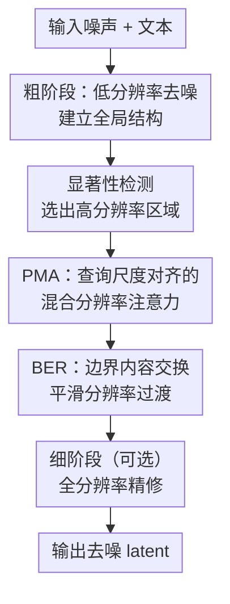

# Phase-Aligned RoPE for Mixed-Resolution Diffusion Transformer

**会议**: ECCV 2026  
**arXiv**: [2511.19778](https://arxiv.org/abs/2511.19778)  
**代码**: 无  
**领域**: 扩散模型 / 图像生成  
**关键词**: RoPE, 混合分辨率注意力, 扩散Transformer, 位置编码相位对齐, 推理加速

## 一句话总结
本文首次揭示 RoPE 在混合分辨率 DiT 中失败的根本原因——注意力分数是 token 相对距离的正弦周期函数 $\kappa(\Delta)$，不同分辨率 token 被映射到统一坐标空间后落到 $\kappa(\Delta)$ 曲线的不同相位，导致注意力分数系统性失真；据此提出训练无关的 Phase-Aligned Mixed-Resolution Attention (PMA)，对每个查询-键对在查询的原始尺度上计算位置偏移，恢复一致的相位基准，配合轻量边界精修模块 (BER)，在 Wan 视频模型和 FLUX 图像模型上以 4 倍加速实现与全分辨率可比甚至更优的生成质量。

## 研究背景与动机
扩散 Transformer (DiT) 已成为图像和视频生成的主流架构，RoPE 是其标配的位置编码方式。随着生成分辨率不断提升，注意力计算的二次复杂度成为瓶颈。一个直观的加速思路是混合分辨率处理：对显著区域分配高分辨率 token，对背景或非关键区域分配低分辨率 token，从而在不丢失细节的前提下减少总 token 数。然而，实践中直接将 LR 和 HR token 放在一起做自注意力时，即使通过线性位置插值 (PI) 将不同分辨率的 token 位置映射到统一坐标空间，输出仍会出现模糊和伪影——要么 LR 区域正常但 HR 区域崩溃，要么反过来。

本文的诊断揭示了矛盾的根源不在插值方案的选择，而在于 RoPE 本身对注意力分数施加了一个强位置尺度偏置。作者测量了预训练 DiT 中注意力分数与 token 相对距离 $\Delta$ 的关系 $\kappa(\Delta) := \mathbb{E}_{(q,k)}[\langle \hat{q}, \mathcal{R}(\Delta) \hat{k} \rangle]$，发现 $\kappa(\Delta)$ 并非平滑衰减，而是呈现明显的正弦振荡：在 $\Delta \approx 0$ 处尖锐峰值，随后在不同距离区间交替出现高值和低值。这一曲线跨层和跨时间步高度稳定，被 RoPE-dominant head 显著放大——本质上是每个注意力头学到的一个正弦相位滤波器，其频率由 RoPE 预定义频率决定。在单分辨率训练时，所有 token 共享同一距离尺度，模型自然适应这一偏置。一旦混合分辨率强行将 LR/HR token 映射到统一坐标空间，至少一组 token 的 pairwise 距离被压缩或拉伸，token pair 落入 $\kappa(\Delta)$ 的不同相位区域——有些本不相关的 pair 获得虚高注意力，有些该关注的 pair 被压制，输出呈现系统性错乱。理论分析进一步将注意力分数展开为 $\sum_i C_i(q,k) \cos(\omega_i \Delta + \phi_i)$，确认每个注意力头实现的是学习到的正弦相位滤波。

核心 insight：稳定混合分辨率注意力的关键不是找更好的全局插值方案，而是确保每个查询-键对的相对距离在预训练时的原始尺度上被评估——即一次只对齐一对，而非全员对齐到一个坐标系。

## 方法详解

### 整体框架
本文提出一个完整的混合分辨率 DiT 推理管线：在标准 DiT（Wan 视频 / FLUX 图像）的去噪过程中，用轻量显著性模型识别重要区域并分配高分辨率 token，剩余区域保持低分辨率；在自注意力计算中用 PMA 替换标准 RoPE 位置映射以确保跨分辨率注意力稳定；在 LR-HR 边界处用 BER 模块做局部内容交换以消除纹理过渡不连续。整个方法是训练无关的（PMA 零参数，BER 的 latent resizer 仅 25M 参数量），可即插即用于任意预训练 DiT，且与特征缓存、步数蒸馏等正交加速方法自然叠加。

### 关键设计

**1. PMA：逐查询-键对的原生尺度位置对齐**

PMA 的动机直接来自第 3 节的核心发现——$\kappa(\Delta)$ 是周期函数，任何全局位置重映射都会把某些 token pair 推到错误相位。因此 PMA 不做全局坐标统一，而是以每个查询为中心，将键的位置重新表达在查询的原始尺度上。

具体来说，令 $S_q$ 和 $S_k$ 分别表示查询和键的原始分辨率尺度（HR 的 $S$ 大于 LR），定义尺度比 $\alpha_{k \rightarrow q} = S_q / S_k$。对每个查询-键对，将键的位置按此比例缩放：$p_k^{(q)} = \alpha_{k \rightarrow q} p_k$，然后以缩放后的键位置计算 RoPE。实践中分两种情况：(1) HR 查询对所有键——以 HR 网格为基准，拉伸 LR 键位置（如 toy example 中 LR $[0,1,2][5,6,7,8]$ 拉伸为 $[0,2,4][10,12,14,16]$）；(2) LR 查询对所有键——以 LR 网格为基准，压缩 HR 键位置并通过 stride sampling 降采样（如 HR $[6,7,8,9]$ 压缩为 $[3,4]$，stride=2）。这一设计保证每个点积注意力中的 $\Delta$ 都在预训练尺度上计算，$\kappa(\Delta)$ 的相位始终正确——代价为零额外参数，仅修改位置索引。

**2. BER：分辨率边界的内容交换与局部平滑**

PMA 解决了位置尺度的相位错位问题，但 LR-HR 边界处仍可能出现微小的纹理密度不一致。BER 在边界处做轻量局部协调：在每步去噪中，先将 LR/HR mask 各向外扩张 $n_{\text{pad}}$（默认 2）个 token 形成重叠带，然后做双向内容交换——LR 侧用学习到的 latent upsampler 上采样当前干净估计 $x_0$ 的 LR 部分，重新加噪到 $t-1$ 步后替换重叠带中的 HR token；HR 侧对称地做下采样并替换 LR token。交换的 token 只作为注意力上下文而非最终输出，因此一个极小的 resizer 模型（Wan 用 3D CNN 25M、FLUX 用 2D CNN 6M）即足够。resizer 用成对数据训练——先在像素空间做标准缩放再 VAE 重编码得到目标 latent，损失为 latent 空间的 $\ell_1$ 加上像素空间的 $\ell_1 + \text{LPIPS}$。

**3. 显著性引导的粗-混合-细三阶段推理调度**

PMA 是注意力机制层面的贡献，本身不关心哪些区域该用高分辨率。本文展示一个具体的用例：用现成的轻量显著性模型 DeepGaze 在粗阶段低分辨率输出上预测显著区域，按 HR token 预算（视频 15%、图像 30-60%）选出最高分区域作为 HR mask，再进入混合分辨率去噪阶段。整个过程分为三阶段：(1) 粗阶段，全低分辨率若干步快速建立全局结构和运动；(2) 混合分辨率阶段，PMA + BER 稳定跨分辨率注意力，对重要区域高分辨率去噪；(3) 可选的细阶段，最后少量步全分辨率精修。显著性模型只需在粗阶段结束时做一次推理（视频仅 0.27s），对整体延迟的增加可忽略。

### 一个完整示例：PMA 在一维 toy case 上的两种查询模式

以论文第 3.2 节的 toy case 为例，原始一维序列索引 $[0,1,2,3,4,5,6,7,8]$，中间段 $[3,4]$ 被上采样为 HR 块。采用 integerized unification 后，三个区域的索引变为：LR 前段 $[0,2,4]$、HR 段 $[6,7,8,9]$、LR 后段 $[10,12,14,16]$。现在看 PMA 如何处理一个 HR 查询（位置 7）对所有键的注意力：以 HR 尺度为基准，LR 键位置按 $\alpha = S_{\text{HR}} / S_{\text{LR}}$ 拉伸——若 LR 到 HR 的尺度比为 2，则 LR 前段 $[0,2,4]$ 拉伸为 $[0,4,8]$，LR 后段 $[10,12,14,16]$ 拉伸为 $[20,24,28,32]$。这样，HR 查询 7 与其邻居 HR 键 6,8,9 的距离仍在原始训练尺度上（$\Delta = -1, 1, 2$），LR 键的距离被放大但保持了一致的线性缩放，落在 $\kappa(\Delta)$ 的正确相位区域。反过来，LR 查询（位置 0）对所有键：以 LR 尺度为基准，HR 键 $[6,7,8,9]$ 先压缩为 $[3,3.5,4,4.5]$，再 stride=2 降采样为 $[3,4]$。LR 查询只需粗粒度上下文，降采样后的 HR 键恰好提供了这种信息。

### 损失函数 / 训练策略
PMA 本身是训练无关的，修改的只是位置索引映射，不引入任何可学习参数。BER 中的 latent up/downsampler 需要单独训练：对于 Wan（3D CNN，hidden dim 384，25M），用 Pexels + Aesthetic-Train-V2 数据集，成对目标通过像素空间缩放后 VAE 重编码获得；对于 FLUX（2D CNN，hidden dim 128，6M），同理。损失函数为 latent 空间 $\ell_1$（权重 0.01）+ 像素空间 $\ell_1$（权重 1）+ LPIPS（权重 0.1），batch size 1。训练开销小——resizer 参数量远小于 DiT 本身，且只需训练一次，后续全部推理场景复用。

## 实验关键数据

### 主实验
视频生成使用 Wan2.1-1.3B 在 VBench 全量 prompt 上评估，图像生成使用 FLUX.1-dev 在 MSCOCO 2014 验证集 5K 样本上评估。

**表 1：Wan 视频混合分辨率去噪中 RoPE 插值方法对比**

| 方法 | DOVER Aesthetic ↑ | DOVER Technical ↑ | DOVER Overall ↑ | VBench Quality ↑ | VBench Semantics ↑ | VBench Total ↑ | 时间 (s) ↓ |
|------|-------------------|-------------------|-----------------|------------------|--------------------|----------------|------------|
| HR（全高分辨率） | 99.83 | 10.43 | 79.12 | 80.12 | 62.30 | 76.56 | 172.1 |
| PI-LR | 98.10 | 8.01 | 63.39 | 75.93 | 54.92 | 71.73 | — |
| PI-HR | 86.52 | 4.94 | 35.04 | 70.38 | 49.41 | 66.18 | — |
| NTK | 92.76 | 5.89 | 44.52 | 71.80 | 52.93 | 68.02 | 43.2 |
| YaRN | 98.56 | 8.96 | 66.38 | 76.39 | 56.72 | 72.46 | — |
| **PMA (Ours)** | **99.63** | **10.01** | **75.34** | **80.76** | **62.17** | **77.04** | **43.2** |

PMA 在几乎所有指标上接近甚至略超全分辨率 HR 基线，DOVER Overall 从 HR 的 79.12 略降至 75.34（仅 4.8% 下降），而最佳插值基线 YaRN 仅 66.38（16.1% 下降），同时将推理时间从 172.1s 压至 43.2s（4.0 倍加速）。PI-HR 在 Technical 和 Overall 上几乎崩溃（4.94 和 35.04），体现相位错位对注意力质量的根本性破坏。

**表 2：FLUX 图像混合分辨率去噪中 RoPE 插值方法对比**

| 方法 | ImageReward ↑ | CLIP-IQA ↑ | MUSIQ ↑ | CLIP Score ↑ | 时间 (s) ↓ |
|------|---------------|------------|---------|-------------|------------|
| HR（全高分辨率） | 1.062 | 0.621 | 70.47 | 31.12 | 3.4 |
| PI-LR | 0.659 | 0.411 | 53.96 | 31.41 | — |
| PI-HR | 0.935 | 0.523 | 70.94 | 31.41 | — |
| NTK | 0.953 | 0.542 | 70.62 | 31.37 | 2.4 |
| YaRN | 0.926 | 0.548 | 69.99 | 31.29 | — |
| **PMA (Ours)** | **0.978** | **0.623** | **71.81** | **31.31** | **2.4** |

PMA 在 ImageReward 上仅比 HR 低 7.9%，CLIP-IQA 持平甚至略高（0.623 vs 0.621），MUSIQ 反超 HR（71.81 vs 70.47）。PI-LR 在 ImageReward 上猛跌 38%（0.659 vs 1.062），再次验证位置插值的系统性失败。

### 消融实验

**表 3：BER 边界填充宽度 $n_{\text{pad}}$ 消融（Wan 视频）**

| $n_{\text{pad}}$ (LR) | $n_{\text{pad}}$ (HR) | DOVER Aesthetic ↑ | DOVER Technical ↑ | DOVER Overall ↑ | VBench Total ↑ |
|-----------------------|-----------------------|-------------------|-------------------|-----------------|----------------|
| 0 | 0 | 98.90 | 8.94 | 68.43 | 74.74 |
| 2 | 2 | 99.63 | 10.01 | 75.34 | 77.04 |
| 2 | 4 | 99.62 | 9.88 | 75.18 | 76.90 |

去掉 BER（$n_{\text{pad}} = 0$）时 DOVER Overall 从 75.34 掉至 68.43，Technical 从 10.01 掉至 8.94——边界处微小的纹理不一致确实存在且可被 BER 有效缓解。$n_{\text{pad}} = 2$ 已足够，进一步增大无益。

### 关键发现
- **PMA 是核心贡献**：仅靠 PMA（训练无关，零参数）即把 DOVER Overall 从 YaRN 的 66.38 拉升到 75.34，涨幅 13.5%，说明相位对齐而非全局插值是稳定混合分辨率注意力的关键。
- **BER 锦上添花**：去掉 BER 掉约 6.9 个 Overall 点，主要在 Technical 维度——边界平滑对技术质量指标敏感但不对整体结构产生根本性影响。
- **与正交加速方法可叠加**：PMA + TeaCache 达到 7.2 倍加速，PMA + DMD 4 步蒸馏达 30.7 倍加速，且质量保持在高水平，说明混合分辨率加速与其他加速范式互不冲突。
- **对显著性模型鲁棒**：替换不同显著性模型（DeepGazeI/UNISAL/DeepGazeIIE）甚至用固定中心方块，DOVER Overall 波动在 74.22-76.26 之间，说明 PMA 本身不依赖特定的区域选择策略。
- **自然支持多分辨率**：3-mixed-resolution（480+960+1920p 视频）在保持 77.73 VBench Total 的同时仅 288s，而直接 2K 需要 1995s（6.9 倍加速），4-mixed-resolution 同样稳定。

## 亮点与洞察
- **将 RoPE 的工程失败归因为可量化、可视化的数学结构**：$\kappa(\Delta)$ 曲线的提出和测量是本文最巧妙的地方——一个看似"不正常"的行为（正弦振荡的注意力偏置）在单分辨率训练时被模型学会利用，但在混合分辨率时成为致命缺陷。这个诊断框架可以迁移到任何涉及跨分辨率/跨尺度 RoPE attention 的场景，不仅限于混合分辨率去噪。
- **"不统一坐标系，只在点积层面保证相位一致"的逆向思维**：传统 RoPE 插值方案（PI/NTK/YaRN）都在尝试找到一个更好的全局映射 $p \mapsto \phi(p)$，本文反其道而行——承认不存在单一映射能同时满足两个尺度的相位一致性，转而放弃全局统一，在每次点积注意力中独立计算位置偏移。这个"局部对局部"的思路可能适用于其他需要跨域对齐的注意力场景（如不同模态的 token、不同帧率的时间戳）。
- **训练无关 + 即插即用使实用价值远超学术贡献**：PMA 零参数、零训练、修改仅限于位置索引行代码，可以立刻部署到任何基于 RoPE 的 DiT（Wan/FLUX/CogVideo/LTX 等），这是工业界最关心的事。本文也用与 TeaCache/MagCache/DMD 的叠加实验证明了这一点。
- **$\kappa(\Delta)$ 的模态依赖性值得深挖**：附录显示 FLUX 中文本轴的 $\kappa(\Delta)$ 比高度/宽度轴平滑得多，说明注意力头为不同模态学到了不同的相位修正——一个潜在的研究方向是显式参数化逐模态的相位偏置以替代 RoPE 的标准频率。

## 局限与展望
- **复杂纹理过渡仍是薄弱点**：作者在附录中展示了失败案例——当 LR-HR 边界穿过复杂纹理（如人脸皮肤与衣物交界）时，BER 的局部交换不足以完全消除过渡痕迹，输出仍可见拼贴感。可能的改进方向是引入语义分割 mask 替代纯显著性 mask，让 HR 边界沿语义边界走。
- **依赖显著性模型的质量和推理开销**：虽然使用的 DeepGaze 系列开销极低（0.01~0.27s），但显著区域选择的质量直接影响最终效果——如果显著性模型漏掉关键区域，HR token 就投错了地方。不适合显著性模型无法覆盖的长尾场景（如用户指定的任意不规则区域）。
- **未涉及训练阶段的混合分辨率支持**：PMA 是推理时的救火方案，但最根本的解决方法是让 DiT 在训练时就见过混合分辨率 token，学会跨尺度的相位不变表示。作者在讨论中提到这是未来的方向，但这需要重新设计位置编码乃至训练范式。
- **只验证了 Wan 和 FLUX 两个模型**：虽然这两个是目前最主流的视频/图像 DiT，但对其他 RoPE 实现变体（如 CogVideo 的分组策略、LTX 的 3D RoPE 布局）的泛化性尚待验证。

## 相关工作与启发
- **vs RoPE 插值方法 (PI / NTK / YaRN)**：这些方法来自 LLM 的 context length extrapolation 场景，统一假设存在一个最优的全局频率缩放方案，适合单一序列内的自洽外推。但混合分辨率场景的 LR/HR token 在同一层中并存，它们的 pairwise 距离需要同时满足两个尺度——这不是频率缩放参数能一刀切解决的问题。PMA 的 key insight 是放弃全局缩放，改为逐 pair 确定尺度。
- **vs RALU**：RALU 也使用了混合分辨率中间阶段的粗-混-细管线，但它在混合分辨率阶段仍使用线性位置插值，并通过额外加噪和多步去噪来补偿相位错位带来的伪影——本质上用步数换质量。PMA 从根源消除相位错位，不需要额外的补偿步数。
- **vs Token Merging (ToMe) / Token Pruning**：这些方法通过合并或丢弃 token 来减少注意力计算，是"减少 token 数"的范式。混合分辨率是"保持 token 数但降低部分 token 的分辨率"的互补范式，两者可以叠加（但本文未直接与 ToMe 组合实验，值得尝试）。

## 评分
- 新颖性: ⭐⭐⭐⭐☆ (4/5) 首次系统分析并量化 RoPE 在混合分辨率下的失败原因，$\kappa(\Delta)$ 是漂亮的诊断工具；训练无关的 PMA 方案简洁有力，但"以查询尺度为准"的思路在直觉上不算意外。
- 实验充分度: ⭐⭐⭐⭐⭐ (5/5) 视频+图像双模态，4 组主表（插值对比 ×2 + 加速对比 ×2），BER 消融 + 显著性模型鲁棒性 + 多分辨率 scaling + 与正交加速叠加 + 组件开销分解 + 详细 VBench 16 维，附录几乎可以独立成篇。
- 写作质量: ⭐⭐⭐⭐⭐ (5/5) 理论分析→实证测量→方法设计→实验验证的叙事线非常清晰，第 3 节的分析部分尤其好——从 toy example 到 $\kappa(\Delta)$ 曲线到理论展开，每一步都有"为什么"。
- 价值: ⭐⭐⭐⭐⭐ (5/5) 训练无关、零参数、即插即用的特性使其具有极强的工业落地潜力；对任何使用 RoPE 且考虑混合分辨率推理的 DiT 模型都是直接可用的加速方案；$\kappa(\Delta)$ 分析框架可推广至其他 RoPE 应用场景。

<!-- RELATED:START -->

## 相关论文

- [\[CVPR 2026\] DiT-IC: Aligned Diffusion Transformer for Efficient Image Compression](../../CVPR2026/image_generation/ditic_aligned_diffusion_transformer_for_efficient.md)
- [\[CVPR 2026\] Training-free Mixed-Resolution Latent Upsampling for Spatially Accelerated Diffusion Transformers](../../CVPR2026/image_generation/training-free_mixed-resolution_latent_upsampling_for_spatially_accelerated_diffu.md)
- [\[CVPR 2025\] Towards Transformer-Based Aligned Generation with Self-Coherence Guidance](../../CVPR2025/image_generation/towards_transformer-based_aligned_generation_with_self-coherence_guidance.md)
- [\[CVPR 2026\] From Sketch to Fresco: Efficient Diffusion Transformer with Progressive Resolution](../../CVPR2026/image_generation/from_sketch_to_fresco_efficient_diffusion_transformer_with_progressive_resolutio.md)
- [\[ICLR 2026\] MADFormer: Mixed Autoregressive and Diffusion Transformers for Continuous Image Generation](../../ICLR2026/image_generation/textitmadformer_mixed_autoregressive_and_diffusion_transformers_for_continuous_i.md)

<!-- RELATED:END -->
