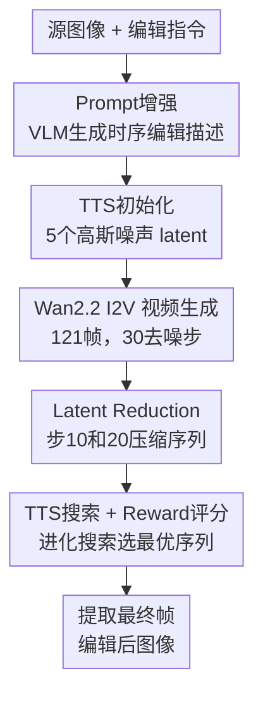

# PhyEditBench: A Real-World Multi-Stage Benchmark for Physics-Aware Image Editing

**会议**: ECCV 2026  
**arXiv**: [2606.26551](https://arxiv.org/abs/2606.26551)  
**代码**: [https://github.com/Previsior/PhyEditBench](https://github.com/Previsior/PhyEditBench) (有)  
**领域**: 图像生成  
**关键词**: 物理感知图像编辑, 基准测试, 视频生成模型, 测试时扩展, 反事实推理

## 一句话总结
PhyEditBench 是首个专门评估指令式图像编辑模型物理推理能力的基准，包含 4 大类 12 子类的真实世界物理场景和反物理实例；同时提出训练无关的 PhyWorld 方法，将视频生成模型作为物理推理引擎，配合测试时扩展与 latent 压缩策略，在 5B 参数下超越多数开源编辑模型。

## 研究背景与动机
**领域现状**。指令式图像编辑近年来随多模态生成模型快速发展，从早期的全局风格迁移、颜色调整逐步演进到需要深度认知推理的复杂编辑任务。现有推理基准（KRIS-Bench、RISEBench、UniREditBench、WiseEdit）评测维度覆盖空间关系、逻辑谜题、属性绑定等，但本质上是「高级指令遵循 + 视觉感知」，并不涉及真实物理动态。

**为什么之前没人做**。物理感知的图像编辑评测存在两个壁垒。其一，真实物理过程的数据不易获取——合成渲染引擎（Blender、MuJoCo）生成的场景纹理简化、可控但缺乏真实世界的复杂性与不可预测性；而物理视频数据集（CLEVRER、Physion、NewtonGen）面向 VQA 或视频预测设计，不适配指令式编辑任务。其二，此前的编辑模型自身缺乏物理推理能力，社区自然倾向于先评测其能做的维度（语义修改、空间布局），形成了「能力与评测互相锁定」的认知盲区。

**为什么现在才可能**。两个关键使能因素：一是大规模视频生成模型（Sora、Wan2.2 等）通过逐帧预测隐性学到了物理规律和时序因果，使「用视频生成做物理推理」成为技术上可行的编辑范式；二是 VLM 评判能力的成熟（GPT-4o 等）使得自动化评估物理合理性、指令遵循等高层语义维度成为可能，不再依赖昂贵的人工标注。

**本文的设计选择**。与其走合成数据的老路，PhyEditBench 从免版税真实视频中提取四状态轨迹（输入→中间态1→中间态2→输出），用 VLM 粗标注 + 人类精校验保证质量；同时引入反物理（Anti-Physics）实例迫使模型摒弃统计先验、真正基于指令做物理演绎。在此基准之上，提出 PhyWorld 作为训练无关基线，将静态编辑指令转化为视频生成任务，以中间帧为隐式推理过程。

**核心 idea**：真实物理世界的图像编辑评估必须考察「状态如何按物理规律演化」而非只看「改了什么」，用视频生成模型内化的时序因果作为物理推理引擎是当前性价比最高的路线。

## 方法详解

### 整体框架
本文工作分为基准构建与基线方法两层。PhyEditBench 基准从真实视频中提取物理过渡轨迹，构建四状态 + 多粒度指令 + 不变量标注的实例，覆盖变形/断裂、流体动力学、刚体交互、状态变化四大物理类别，外加反物理对比例。PhyWorld 基线将图像编辑转化为视频生成任务——输入源图像与编辑指令，经 VLM 做 Prompt 增强后送入预训练 I2V 模型生成过渡视频，以中间帧作为物理推理的隐式过程，最终帧即为编辑结果。整个流程训练无关，靠测试时扩展（TTS）进化搜索与 latent reduction 策略在推理阶段优化输出质量。

### 关键设计

**1. 分层物理分类体系与多阶段实例设计：覆盖真实世界物理动态的粒度**

现有编辑基准的标注以单张目标图像 + 一条指令为主，无法捕捉物理过程中状态的连续演化。PhyEditBench 定义了 4 个一级物理类别（变形与断裂、流体动力学、刚体与交互、状态变化与环境），下分 12 子类（如脆性断裂、塑性变形、弹性，溅射与冲击、倾倒与流动、浮力与张力等），每个子类有一套明确的物理原理和典型场景模式。

每个实例以四状态轨迹组织：输入（初始稳态）→ 中间态1 → 中间态2 → 输出（最终态），四帧从同一条真实视频中按时间顺序采样。标注含一条全局编辑指令（描述输入到输出的总体目标）、三条步骤指令（描述每对相邻状态间的过渡）、物理过程解释以及不变量（视角、背景等不应改变的元素）。这种设计天然支持两种评测模式：逐步编辑（step-wise，测试模型能否遵循物理上有意义的中间检查点）和全局编辑（global，测试模型能否从高层指令推理出合理的中间动态）。中间检查点的存在还能暴露「终点对但过程错」的隐性失败——例如物体到达了目标位置但运动方向违背物理常识，这种错误只有靠中间态才检测得到。

**2. 反物理（Anti-Physics）实例：解耦物理推理与统计先验**

常规模型在做编辑时严重依赖预训练偏见（如「刀总是切苹果」），容易忽略文本指令中的显式物理约束。Anti-Physics 实例专门为此设计：每条实例包含一张源图像、一条刻意注入反常识物理规则的编辑指令（例如违反重力或材料刚性），以及预期现象说明。源图像由生成模型合成，指令与预期现象由 VLM 草拟 + 人类审核。共 35 条反物理实例。

关键是这些实例强制模型压制从预训练数据中学到的视觉习惯，纯粹基于指令做物理演绎。一个模型如果仅靠模式匹配（如「看到刀和苹果 → 生成切开效果」），就会在反物理场景彻底失败；只有真正理解指令中的物理规则并执行推理，才能通过。这使得 PhyEditBench 不仅能评估「模型懂不懂物理」，还能区分「碰巧蒙对」和「真正推理」。

**3. PhyWorld：以视频生成作为物理推理引擎**

PhyWorld 是一种训练无关的图像编辑基线，核心思路是将静态编辑任务重新表述为时序变换过程——不是一步生成编辑结果，而是生成一段从源图像到目标状态的过渡视频，让预训练视频模型内化的物理知识在帧间演化中自然发挥作用。

具体管线分四步。（1）**Prompt 增强**：用 Qwen-3.5 Max VLM 将原始编辑指令扩展为时序编辑描述（Temporal Editing Caption），描述从输入到输出的物理过渡过程。（2）**TTS 初始化**：借鉴 EvoSearch 的进化搜索思想，但将其从 Text-to-Video 适配到 Image-to-Video，在生成末尾做单次搜索步以平衡效果与效率。随机初始化 $k_{\text{start}}=5$ 个高斯噪声 latent，并行去噪生成视频。（3）**视频生成与 Latent Reduction**：以 Wan2.2 TI2V-5B 为主干，生成 121 帧、30 去噪步的视频。121 帧经 Wan2.2-VAE 编码为 31 个 latent token，在去噪步 10 和 20 分别剪枝到 21 和 11 个 token，压缩率 4x4x16。这一步大幅降低计算量而不显著损失时序信息。（4）**TTS 搜索与选优**：用 Video Reward Model 对 5 个候选视频评分，通过 Top-K 选择、锦标赛选择和变异操作选出最优序列，取该序列最终帧作为编辑结果。

三者形成一个闭环：分层分类体系提供了结构化、可诊断的评测框架；反物理实例排除了统计先验的干扰，使物理推理能力可被单独测量；PhyWorld 证明了视频生成模型可作为有效的物理推理引擎，且训练无关路线在小参数量（5B）下即可取得竞争力。

### 一个完整示例：玻璃杯摔落的物理编辑

以「玻璃杯从桌面摔落到地面碎裂」为例说明全流程。基准侧：从真实视频中采样四帧——输入为桌面上完好的玻璃杯、中间态1 为杯子脱离桌面边缘开始下落、中间态2 为杯子触地瞬间产生裂纹、输出为地面上的玻璃碎片。标注三条步骤指令（「杯子离开桌面开始下落」「杯子撞击地面」「杯子完全碎裂」）和一条全局指令，不变量标注为「桌面、背景墙颜色、光照条件」。评测时，模型可走 TypeA/B/C 逐步编辑或 TypeE 全局编辑，GPT-4o 从一致性、指令遵循、物理合理性、图像质量四维打分。

PhyWorld 侧：接收输入帧和「杯子从桌面摔落碎裂」指令 → Qwen-3.5 Max 生成「杯子先倾斜失去平衡，然后加速下落，底部接触地面后裂纹从撞击点向外扩散，碎片飞溅……」的时序描述 → Wan2.2 以输入帧为条件生成 121 帧过渡视频，去噪步 10 和 20 做 latent 压缩 → Video Reward Model 评分 5 个候选（优选裂纹自然、碎片方向符合动量守恒的序列）→ 取最终帧输出碎裂的杯子图像。

### 损失函数 / 训练策略

PhyWorld 是训练无关方法，不涉及传统意义上的损失函数优化。其核心评分机制来自两个层面。

**TTS 进化搜索的评分目标**（来自 EvoSearch 框架）：在每个进化时间步 $t_j$，对当前 latent $\boldsymbol{x}_{t_j}$，去噪得到预测视频后由 Video Reward Model $r(\cdot)$ 打分，期望奖励为：
$$R(\boldsymbol{x}_{t_i}) = \mathbb{E}_{\boldsymbol{x}_0 \sim p_0(\boldsymbol{x}_0|\boldsymbol{x}_{t_i})} \left[r(\boldsymbol{x}_0) | \boldsymbol{x}_{t_i}\right]$$
Top-K 选择保留分数最高的 latent 子集继续去噪。PhyWorld 将 EvoSearch 的多步进化简化为生成末尾的单步搜索，在效果和效率之间取平衡。

**基准评测的 VLM 评分**：GPT-4o 对编辑结果在四个维度上打 1-10 分——一致性（Consistency，不变量与非目标内容保留）、指令遵循（Instruction Following）、物理合理性（Physical Plausibility）、图像质量（Image Quality），最终得分为四维固定权重的加权平均。人工验证显示 VLM 评分与人类判断的 Kendall $\tau$ 相关系数在物理合理性上达 0.56，指令遵循达 0.65，验证了自动化评测流水线的可靠性。

## 实验关键数据

### 主实验

下表选取代表性模型，展示在正常物理数据子集（238 实例）上的四维指标平均得分和综合平均分。评测覆盖闭源模型、开源静态编辑模型和视频生成式编辑模型三类。

| 模型 | 参数量 | 一致性 | 指令遵循 | 物理合理性 | 图像质量 | 综合均分 |
|------|--------|--------|---------|-----------|---------|---------|
| GPT-Image-1.5 (闭源) | - | 8.84 | 8.21 | 8.30 | 6.78 | 8.23 |
| Seedream4.0 (闭源) | - | 9.69 | 8.22 | 8.22 | 7.75 | 8.47 |
| Gemini-2.5 (闭源) | - | 7.21 | 6.13 | 6.64 | 5.72 | 6.51 |
| ChronoEdit-14B (视频) | 14B | 9.67 | 7.98 | 8.42 | 8.13 | 8.51 |
| UniWorld-V2 (开源) | - | 8.53 | 6.78 | 6.73 | 6.45 | 7.08 |
| **PhyWorld (视频)** | **5B** | **7.58** | **5.89** | **6.30** | **6.26** | **6.43** |
| BAGEL-Think (开源) | ~19B | 8.53 | 5.72 | 5.96 | 6.26 | 6.43 |
| Step1X-Edit (开源) | ~19B | 9.24 | 5.93 | 6.19 | 6.87 | 6.79 |
| Frame2Frame (视频) | - | 7.96 | 4.08 | 4.73 | 6.65 | 5.38 |
| InstructPix2Pix (开源) | - | 7.08 | 4.16 | 5.58 | 7.12 | 5.61 |

PhyWorld 以仅 5B 参数取得与 BAGEL-Think（~19B）同等综合均分，在物理合理性上显著优于同为视频路线的 Frame2Frame（6.30 vs 4.73），验证了 TTS 和 latent reduction 策略的有效性。ChronoEdit-14B 以相近范式但更大模型取得最高开源分（8.51），闭源模型 Seedream4.0 综合最优（8.47）。

### 消融与分析实验

物理类别难度差异显著，下表展示代表性模型在四个物理大类上的综合均分。

| 模型 | 变形与断裂 | 流体动力学 | 刚体与交互 | 状态变化 |
|------|-----------|-----------|-----------|---------|
| Seedream4.0 (闭源) | 7.43 | 9.04 | 8.65 | 8.84 |
| GPT-Image-1.5 (闭源) | 8.36 | 8.30 | 7.91 | 8.51 |
| ChronoEdit-14B (视频) | 8.38 | 8.74 | 8.32 | 8.79 |
| **PhyWorld (5B)** | **6.29** | **6.55** | **6.10** | **6.94** |
| UniWorld-V2 (开源) | 6.60 | 7.43 | 6.99 | 7.44 |
| InstructPix2Pix (开源) | 4.24 | 6.41 | 5.49 | 6.67 |

变形与断裂是开源模型最薄弱的类别——涉及拓扑变化（碎裂、弯曲），静态编辑模型难以推理材质在受力下的连续演化。流体动力学对闭源模型最友好（Seedream4.0 达 9.04），但对静态编辑模型同样是瓶颈。PhyWorld 得益于视频模型对时序因果的建模，在四个类别上表现均衡，没有出现某类严重崩坏的情况，这对实际应用中的鲁棒性很重要。

评测类型（Run Type）分析显示：所有模型在短距单步编辑（TypeA/B，相邻状态对）上表现最好，在全局编辑（TypeE，仅给高层指令一步到位）和多步联合编辑（TypeD，三条步骤指令串行执行）上显著退化。PhyWorld 在 TypeE 上的退化幅度远小于 Frame2Frame（5.17 vs 6.36），说明视频推理路线对长程物理过渡的建模有天然优势。

反物理子集上，所有模型表现大幅下降，物理合理性维度尤甚：闭源最佳 Gemini-2.5 仅 5.91，PhyWorld 以 5.29 领先所有开源模型，而 InstructPix2Pix 跌至 2.54——说明传统模型完全依赖统计先验、缺乏真正的物理推理。PhyWorld 在反物理场景的相对优势进一步印证了视频生成模型内化的物理知识比静态先验更可靠。

### 关键发现
- 当前所有图像编辑模型在物理推理上存在明显短板，即使是闭源最强模型在反物理场景也大幅退化，说明「懂物理」远未解决
- PhyWorld 以 5B 参数达到与约 19B 模型同等的综合性能，参数效率极高，训练无关路线的上限值得关注
- 视频生成模型在物理编辑任务上天然优于静态编辑模型——时序因果建模让中间过渡状态合理，而非直接跳到目标态
- 反物理实例的引入成功区分了「真正物理推理」和「统计模式匹配」，是基准设计中的亮点

## 亮点与洞察
- **Video-as-Reasoning 范式**：将图像编辑重新定义为「生成物理过渡视频」，中间帧天然成为推理过程的可视化载体，这一思路可迁移到任意需要多步推理的视觉编辑任务（如因果编辑、叙事性场景合成），不限于物理领域
- **反物理实例的设计逻辑**：不是简单地要求模型「拒绝执行」，而是要求它按反常识指令生成合理结果——这迫使模型走「指令驱动的显式推理」而非「先验驱动的模式匹配」，对评测体系设计有普适参考价值：任何推理基准都应该包含类似的「反直觉」探测集来排除 shortcut learning
- **Latent Reduction 的工程智慧**：在去噪后半程逐步丢弃中间帧的 latent token（31→21→11），利用「视频生成早期步骤建立内容、后期步骤细化细节」的特性，在几乎不损失质量的前提下大幅降低计算量——这个思路可复用到任何基于 I2V 做编辑或增强的任务中
- **TTS 单步化的权衡**：原始 EvoSearch 在多步去噪步上做进化搜索，开销极大；PhyWorld 只在生成末尾做单步搜索，虽然搜索粒度变粗但效率大幅提升，且在实际效果上损失不大——这说明对于图像编辑任务，关键帧质量比全程搜索更重要，为后续方法设计 TTS 策略提供了取舍参考

## 局限与展望
- 作者承认的局限：基准当前规模为 238+35 实例，物理类别覆盖仍有扩展空间；PhyWorld 在极端长程物理过程中可能出现误差累积，中间帧的物理一致性并非 100% 保证
- 评测依赖 GPT-4o 自动打分，虽然人工验证显示合理的一致性（Kendall $\tau$ 0.56-0.65），但图像质量维度的相关性明显偏低——VLM 对像素级伪影不敏感，未来可能需要混合传统图像质量指标（FID、LPIPS）做补充
- PhyWorld 的训练无关路线虽参数效率高，但其上限受限于预训练视频模型本身的物理理解水平——如果底层 I2V 模型在某种物理现象上存在系统性偏差，TTS 无法纠正——未来的方向可能是将物理先验（如刚体运动约束、流体 Navier-Stokes 方程）显式注入生成过程
- 基准当前以真实视频的中间帧为 ground truth，但真实视频本身可能存在拍摄噪声和视角变化，不一定构成唯一的「正确」物理轨迹——同一编辑目标可能存在多种物理上合理的中间状态，未来可引入多参考评估

## 相关工作与启发
- **vs KRIS-Bench / RISEBench / UniREditBench**：这些基准评测的是语义推理（空间关系、逻辑谜题、属性绑定），本质上仍是「知道改什么」；PhyEditBench 评测的是物理推理（「状态如何按物理规律演化」），维度完全不同。两者的区别相当于「考阅读理解」和「考物理实验设计」，不可互相替代
- **vs ChronoEdit / Frame2Frame**：同属视频编辑路线。ChronoEdit-14B 在 PhyEditBench 上取得最高开源分（8.51），但参数量是 PhyWorld 的近 3 倍；Frame2Frame 性能显著偏低（5.38），但 PhyWorld 与其共享基础的 Prompt 增强范式（Temporal Editing Caption），差距主要来自 TTS 和 latent reduction，说明推理阶段的优化策略对视频编辑路线至关重要
- **vs CLEVRER / Physion / NewtonGen**：这些物理数据集面向 VQA 或视频预测，不做指令式图像编辑；PhyEditBench 将物理推理评估引入编辑任务，并通过反物理实例和中间态评测做了方法论升级——把「预测物理状态」和「按指令编辑物理状态」区分开来

## 评分
- 新颖性: ⭐⭐⭐⭐ 首次将物理推理系统性地引入指令式图像编辑评测，反物理实例的设计尤为巧妙；但视频编辑路线和 TTS 策略并非全新，PhyWorld 的创新更多在组合与适配而非范式突破
- 实验充分度: ⭐⭐⭐⭐ 覆盖 13 个模型、4 个物理大类、5 种评测类型、正常 + 反物理两个子集，消融维度清晰；缺少 PhyWorld 内部各组件的独立消融（如去掉 TTS、去掉 latent reduction 后的单独性能），也未对比不同 I2V 主干的差异
- 写作质量: ⭐⭐⭐⭐⭐ 结构清晰，层次分明，物理分类体系的定义、数据构造流程、评测流水线、方法解析都有明确交代，图表丰富且与正文高度对应
- 价值: ⭐⭐⭐⭐ 填补了图像编辑领域物理推理评测的空白，对后续研究有明确的导向作用（把注意力从「改了什么」拉到「怎么改的」），PhyWorld 证明了小模型 + 训练无关路线在物理编辑上的可行性，为资源受限场景提供了实用基线

<!-- RELATED:START -->

## 相关论文

- [\[ECCV 2026\] VTEdit-Bench: A Comprehensive Benchmark for Multi-Reference Image Editing Models in Virtual Try-On](vtedit-bench_a_comprehensive_benchmark_for_multi-reference_image_editing_models_.md)
- [\[ICLR 2026\] WorldEdit: Towards Open-World Image Editing with a Knowledge-Informed Benchmark](../../ICLR2026/image_generation/worldedit_towards_open-world_image_editing_with_a_knowledge-informed_benchmark.md)
- [\[ECCV 2026\] C3-Bench: A Context-Aware Change Captioning Benchmark](c3-bench_a_context-aware_change_captioning_benchmark.md)
- [\[AAAI 2026\] Mixture of Ranks with Degradation-Aware Routing for One-Step Real-World Image Super-Resolution](../../AAAI2026/image_generation/mixture_of_ranks_with_degradation-aware_routing_for_one-step_real-world_image_su.md)
- [\[CVPR 2025\] UniReal: Universal Image Generation and Editing via Learning Real-world Dynamics](../../CVPR2025/image_generation/unireal_universal_image_generation_and_editing_via_learning_real-world_dynamics.md)

<!-- RELATED:END -->
