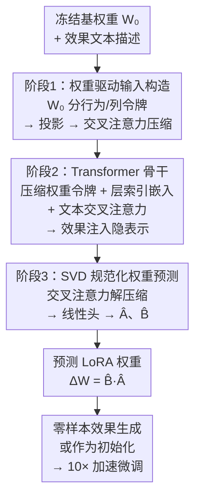

# Prompt2Effect: Training-Free Image-to-Video Model Specialization via LoRA Generation

**会议**: ECCV 2026  
**arXiv**: [2606.13971](https://arxiv.org/abs/2606.13971)  
**项目页**: https://xiaomeng-yang.github.io/Prompt2Effect/  
**代码**: 有（项目页提供）  
**领域**: 图像生成 / 视频生成 / 扩散模型  
**关键词**: 图像到视频生成, 低秩适配, 超网络, 训练无关, SVD规范化

## 一句话总结
Prompt2Effect 提出一种权重驱动的超网络，通过显式利用冻结基模型权重作为条件、并将 LoRA 参数预测空间规范化为 SVD 能量排序形式，在单次前向传播中直接合成效果专属 LoRA 权重，实现 I2V 扩散模型的零样本训练无关效果控制，推理仅需 3.3 秒而质量堪比完整 LoRA 微调。

## 研究背景与动机

近年来，图像到视频（I2V）扩散模型在从单张图片和文本指令生成高保真视频方面取得了巨大成功。然而，除了常规的语义控制外，业界对"效果级个性化"的需求日益增长——即希望将输入图像渲染为特定视觉风格或动态特效（如"北极熊从天而降"、"骷髅露出"、"鱼眼动画"等）。这类复杂动态效果往往需要从几十段无结构的参考视频中提取，在推理时作为条件直接输入计算开销极高。因此当前的标准做法是为每个效果单独训练一个低秩适配（LoRA）模块：先人工收集约 50 段效果视频并进行标注，再经历上千步梯度优化。每训练一个效果就需要 56 GPU 小时的代价，使得创作流程中的迭代和试错几乎不可行。

为绕过逐效果训练的梯度开销，超网络（hypernetwork）作为一种将适配参数摊销到一次前向传播中的方案引起了关注。在图像生成领域，HyperDreamBooth 等已展示了在身份注入上的潜力。然而，将这些技术直接扩展到 I2V 扩散模型面临两个根本困难。其一，现有超网络纯粹依赖语义条件（文本或噪声嵌入）来预测权重，完全不了解它所适配的基模型每层权重的结构几何——当模型维度增长到扩散 Transformer 的规模时，这种"盲猜"变得极度病态。其二，LoRA 矩阵的分解形式 $\Delta W = BA$ 存在天然的非可辨识性：对任意可逆矩阵 $R$，$(BR, R^{-1}A)$ 产生完全相同的 $\Delta W$。当超网络需要同时预测成百上千层的适配器时，每个层有无穷多等价解，优化在冗余空间中剧烈震荡，论文实验表明已有方法在这种规模下直接失效。

本文的核心 insight 是：LoRA 不是一个绝对参数，而是定义在基权重 $W_0$ 之上的结构化适配增量——既然预测器要生成 $\Delta W$，它理应先认识 $W_0$。**核心 idea：将超网络从纯语义驱动改为权重驱动——以冻结基权重的行/列作为结构先验输入、并预测 SVD 规范化的 LoRA 因子 $US^{1/2}$ 和 $S^{1/2}V^\top$ 以消除分解歧义，从而在单次前向传播中稳定合成高维 I2V 模型的全部 LoRA 更新，实现训练无关的零样本效果控制。**

## 方法详解

### 整体框架

Prompt2Effect 的管线分为两个阶段：一次性超网络预训练和零样本推理。预训练阶段中，一个 1.3B 参数的 Transformer 超网络学习从效果文本描述到整组 LoRA 权重的映射；推理时，对任意新效果文本只需一次前向传播即可获得全部所有层的 LoRA 更新，直接应用到冻结的 I2V 骨干上生成带特效的视频。超网络内部包含三个核心阶段，依次为权重驱动输入构造、Transformer 联合处理、SVD 规范化权重预测。

### 关键设计

**1. 权重驱动输入构造：以基权重的行/列结构锚定适配预测**

现有超网络仅从语义嵌入直接预测权重，这相当于让预测器在完全不理解每层"输入-输出坐标"的情况下生成适配。然而 LoRA 本质上是相对于 $W_0$ 的增量，若预测器不认识 $W_0$，就不得不在高维空间中隐式推断其结构几何。本文提出将 $W_0$ 本身作为条件显式输入：对每层 $l$，将 $W_0^l \in \mathbb{R}^{d_{out}\times d_{in}}$ 的行切片为 B 令牌（$d_{in}$ 维）、列切片为 A 令牌（$d_{out}$ 维），通过两个可学习投影层映射到共享 $d$ 维空间后拼接成序列 $X_W^l$。这受经典 CUR 分解启发——用 $W_0$ 的实际行和列作为令牌，让超网络直接接触到该层的本征特征坐标和跨特征相关性。

论文通过 SVD 谱分析发现一个关键现象：$W_0$ 的奇异值能量高度集中在前几个主成分，而 $\Delta W$ 的能量分布则广泛得多，散布在 $W_0$ 的许多低能量奇异方向上——存在明显的"可压缩性鸿沟"。因此必须使用 $W_0$ 的全秩行/列信息，而非 SVD 截断近似。全秩输入产生的长序列通过交叉注意力（以 $n=256$ 个可学习查询为 Q、原始令牌为 KV）压缩到固定长度 $n \ll d_{out}+d_{in}$，既保留了所有结构信息又控制了后续 Transformer 的计算量。

**2. SVD 规范化的 LoRA 预测：消除分解歧义来稳定大规模权重合成**

LoRA 的分解 $\Delta W = BA$ 存在根本性的非可辨识性：对任意可逆矩阵 $R$，$(BR, R^{-1}A)$ 与 $(B, A)$ 产生完全相同的 $\Delta W$。当超网络需要同时预测成百上千层的 $A^l, B^l$ 时，每个层都有无穷多等价解，优化极易在冗余空间中震荡。为解决这个问题，本文提出将 LoRA 更新的预测目标规范化为 SVD 规范形式。具体做法是对预提取的 ground-truth LoRA 矩阵 $\Delta W^l$ 做奇异值分解：

$$\Delta W^l = U^l S^l (V^l)^\top \quad \Rightarrow \quad B^{\star,l} = U^l (S^l)^{1/2},\quad A^{\star,l} = (S^l)^{1/2} (V^l)^\top$$

SVD 强制 $U$ 和 $V$ 正交、$S$ 对角且奇异值降序排列，这一分解在忽略符号歧义下有唯一表示。将能量均分到两个因子上后，每个 $\Delta W^l$ 的等价类被压到唯一的 $(U S^{1/2}, S^{1/2}V^\top)$，极大约束了超网络的解空间。实验显示 SVD 规范化后的训练曲线平滑收敛，而非规范化版本振荡剧烈、最终误差高出近一倍。这一思路与众不同之处在于：PiSSA 等用 SVD 做 LoRA **初始化**来改善梯度训练，而本文是将 SVD 用于**规范回归目标空间**以利于超网络优化——这是两个不同的使用层次。

**3. 联合 Transformer 超网络：全局协调各层适配**

超网络由 14 层、32 注意力头、隐宽 2048 的 Transformer 构成，同时处理所有适配层的信息。对每层 $l$，压缩后的权重令牌 $Q_W^l$ 加上可学习的层索引嵌入 $e_l$ 和模块类型嵌入 $e_M^l$，得到输入 $Z^l$。效果文本通过冻结文本编码器编码为 $T_{eff}$，注入方式不是简单的拼接，而是通过交叉注意力——权重令牌作为查询、文本令牌作为键值。这使得 Transformer 在自注意层中建模层间语义一致性（例如所有层协同生成"融化"效果的模式），在交叉注意层中吸收文本指令的语义引导。所有 $L$ 层信息联合处理后，权重预测头通过交叉注意力解压缩（以原始 $W_0^l$ 令牌为查询、隐表示 $X_\mathcal{E}^l$ 为键值）恢复到原始维度，再经由两个轻量线性头分别输出 $\hat B^l \in \mathbb{R}^{d_{out}\times r}$ 和 $\hat A^l \in \mathbb{R}^{r \times d_{in}}$。推理时一次前向即可产出全部层的 $\{(\hat A^l, \hat B^l)\}_{l=1}^L$。

### 损失函数

训练使用归一化 MSE（NMSE）损失，对每层分别计算预测因子与 SVD 规范化目标之间的相对 Frobenius 误差，再取层平均：

$$\mathcal{L}_{\text{LoRA}} = \frac{1}{2L} \sum_{l=1}^L \left( \frac{1}{N} \sum_{b=1}^N \frac{\|\hat A^l_b - A^{\star,l}_b\|_F^2}{\|A^{\star,l}_b\|_F^2 + \epsilon} + \frac{1}{N} \sum_{b=1}^N \frac{\|\hat B^l_b - B^{\star,l}_b\|_F^2}{\|B^{\star,l}_b\|_F^2 + \epsilon} \right)$$

这种相对归一化形式对不同层和不同效果之间的尺度差异不敏感，避免了大尺度层的损失主导训练，使超网络稳定收敛。

## 实验关键数据

### 主实验

在 IID 效果（70 个训练效果内）上的零样本测试显示，Prompt2Effect 在所有指标上全面超越基线模型，并与完整 LoRA 微调（每效果独立训练 1000 步）质量持平。HyperDreamBooth 基线在 I2V 规模下完全失效（VLM 各项分数为零，输出为噪声）。

| 方法 | CLIP Score | Aesthetic | VLM Effect | VLM Context | VLM Temporal | VLM Overall |
|------|-----------|-----------|------------|-------------|--------------|-------------|
| Base I2V | 24.23 | 53.36 | 15.99 | 14.21 | 12.37 | 42.57 |
| HyperDreamBooth | 22.34 | 35.30 | 0.00 | 0.00 | 0.00 | 0.00 |
| **Prompt2Effect** | **25.10** | **56.30** | **27.89** | **15.34** | **13.70** | **56.93** |
| LoRA（上界） | 25.06 | 57.60 | 27.68 | 15.82 | 14.07 | 57.57 |

在 OOD 效果（32 个未见效果）上，零样本预测略逊于完整 LoRA，但用作初始化仅微调 100 步（Init-100）即可达到 1000 步完整 LoRA 的性能水平，实现 10 倍加速。

| 方法 | CLIP Score | VLM Overall |
|------|-----------|-------------|
| Base I2V | 23.17 | 42.46 |
| Prompt2Effect（零样本）| 23.52 | 48.87 |
| Init-100 | **25.82** | **56.33** |
| LoRA-100（从头 100 步）| 25.11 | 52.28 |
| LoRA（1000 步，上界） | 25.73 | 56.70 |

论文还在开源 Wan2.1 I2V-14B 模型上复现了核心结果，证实该方法与模型架构无关：Prompt2Effect 在 CLIP Score 和 VLM Effect 两项上均超越了 LoRA 上界（CLIP 24.79 vs 24.68，VLM Effect 34.51 vs 34.16）。

### 消融实验

| 配置 | VLM Overall（IID/OOD） | 说明 |
|------|-----------------------|------|
| 完整模型 | 56.93 / 48.87 | 权重驱动 + SVD 规范化 + 全局 Transformer |
| Ensemble（分块超网络） | 51.29 / 45.11 | 每块独立预测，丢失层间协调 |
| Noise（去除权重输入） | 46.14 / 43.58 | 纯语义嵌入，无结构先验 |
| 压缩令牌 n=128 | 49.75 / 45.01 | 压缩过度丢失信息 |
| 压缩令牌 n=256 | 56.93 / 48.87 | 最佳折中 |
| 压缩令牌 n=512 | 56.22 / 48.03 | 计算量增加但收益饱和 |

补充消融还表明：去除权重输入后 NMSE 收敛到 ~0.65，截断 SVD 半秩输入改善到 ~0.35，而全秩 $W_0$ 输入达到最低 ~0.30，证实 $\Delta W$ 的预测信息确实分布在 $W_0$ 的宽谱方向上。

### 关键发现
- **权重驱动是核心贡献而非锦上添花**：去除 $W_0$ 条件后 VLM Overall 从 56.93 暴跌至 46.14，说明纯语义条件完全不足以引导高维 LoRA 合成
- **SVD 规范化解决实质性的优化瓶颈**：非规范化训练的 NMSE 曲线振荡并收敛到更高误差，规范化版本平滑收敛——"非可辨识性"是超网络大规模权重合成的根本障碍
- **全局协调优于分块**：联合处理所有层的 Transformer 显著优于每块独立预测的 Ensemble，说明层间语义一致性对效果合成至关重要
- **零样本组合控制**：预测的 LoRA 权重可直接线性插值（$0.5\Delta W_A + 0.5\Delta W_B$），产生自然融合的视频效果——说明超网络学会了一个功能完整的 LoRA 空间

## 亮点与洞察
- **权重驱动范式**：这个思路本质上是因为 LoRA 是相对于 $W_0$ 的增量——预测器理应认识 $W_0$。这看似直观，但此前工作在视频模型上一直没做。将"谁适配谁"的结构关系显式编码到超网络输入中，是解决大规模权重合成不稳定的关键
- **SVD 用在新位置**：PiSSA / Make-a-LoRA 用 SVD 改善 LoRA 训练收敛，本文则用 SVD 规范回归目标空间——把等价类压到唯一表示，这本质上是把等变对称性从解空间中显式剥离
- **成本压缩 6 万倍**：56 GPU 小时 → 3.3 秒，质量几乎无损。这意味着 LoRA 效果创作从"过夜等待"变成"实时交互"，对创意工具链的体验是实质性的突破
- **"预测即初始化"的混合模式**：零样本不够时，预测权重仅需 100 步微调就达到完整 LoRA 质量（10× 加速），这种"预测 + 轻量优化"的混合范式在满足即时预览和最终高质量之间取得了很好平衡
- **跨模型泛化**：在 Wan 2.1 开源模型上复现核心结果，表明方法论不依赖于特定的 I2V 骨干，具有较好的迁移性

## 局限与展望
- **OOD 泛化受限**：高度分布外的效果在纯零样本下可能不够精细，需要 Init-100 微调来恢复细节。论文承认这受限于超网络训练数据的规模和多样性
- **训练成本前置**：超网络本身需要在 32 张 A100 上训练 4000 轮，数据方面需要 70 个效果的 ground-truth LoRA（每个约 50 段视频+人工过滤）——这套前置投入不低，适合一次训练、长期使用的场景
- **仅支持全局效果**：当前预测的是整层全连接的 LoRA 更新，不支持空间区域化的局部编辑（如"只让左侧物体融化"）。论文提出 mask 条件扩展是未来方向
- **未验证 T2V 模型**：论文仅验证了 I2V 场景，扩展到 Text-to-Video 骨干尚未探索
- **超网络参数与骨干之比**：1.3B 超网络 / 11B 骨干 ≈ 12%——虽然不算大，但若扩展到更大骨干，超网络的参数规模如何增长需要研究

## 相关工作与启发
- **vs HyperDreamBooth**: 两者都用超网络预测适配器权重，但 HyperDreamBooth 纯语义驱动，在 I2V 规模下训练不稳定、输出噪声（VLM 分数 0.00）；Prompt2Effect 的权重驱动 + SVD 规范化使其稳定扩展到高维视频模型
- **vs LoFA**: LoFA 是最近的权重驱动 LoRA 预测先行工作，但它针对紧凑条件（风格/姿态参考图）且直接回归原始非规范化矩阵；本文在超网络解空间的正则化（SVD 规范化）上提供了更深入的分析和解决方案
- **vs PiSSA / Make-a-LoRA**: 这些方法用 SVD 改进 LoRA 的**训练收敛**，本文独特地将 SVD 用于**规范回归目标空间**以利于超网络——一个关键区别是 PiSSA 面向梯度优化，本文面向回归预测
- **vs 推理时控制方法（Tune-A-Video / StyleMaster / ControlNet 等）**: 这些方法或需要测试时优化、或依赖像素对齐条件，难以处理无结构的全局动态效果（如"从骷髅中露出"）；本文用超网络替代推理时计算，实现了真正零样本

## 评分
- 新颖性: ⭐⭐⭐⭐⭐ [将权重驱动条件和 SVD 规范化同时引入 LoRA 预测超网络，识别并解决了"非可辨识性"这一超网络大规模权重合成的根本障碍]
- 实验充分度: ⭐⭐⭐⭐⭐ [IID/OOD 全面评测含零样本和快速微调；在 Wan 开源模型上复现；多种消融含输入设计、压缩率、协同策略；训练曲线分析有说服力]
- 写作质量: ⭐⭐⭐⭐⭐ [问题动机清晰、方法论述有层次、SVD 规范化的动机论证充分、图示配合得当、实验结果呈现完整]
- 价值: ⭐⭐⭐⭐⭐ [将效果级 I2V 的 LoRA 开销从 56 小时降到 3.3 秒，对创意工具链有实质性突破；权重驱动 + SVD 规范化的范式对更大规模模型也有参考价值]

<!-- RELATED:START -->

## 相关论文

- [\[CVPR 2026\] Training-free Motion Factorization for Compositional Video Generation](../../CVPR2026/image_generation/training-free_motion_factorization_for_compositional_video_generation.md)
- [\[ECCV 2026\] ISAC: Training-Free Instance-to-Semantic Attention Control for Multi-Instance Generation](isac_training_free_instance_to_semantic_attention.md)
- [\[CVPR 2026\] CRAFT-LoRA: Content-Style Personalization via Rank-Constrained Adaptation and Training-Free Fusion](../../CVPR2026/image_generation/craft-lora_content-style_personalization_via_rank-constrained_adaptation_and_tra.md)
- [\[AAAI 2026\] T-LoRA: Single Image Diffusion Model Customization Without Overfitting](../../AAAI2026/image_generation/t-lora_single_image_diffusion_model_customization_without_overfitting.md)
- [\[CVPR 2025\] K-LoRA: Unlocking Training-Free Fusion of Any Subject and Style LoRAs](../../CVPR2025/image_generation/k-lora_unlocking_training-free_fusion_of_any_subject_and_style_loras.md)

<!-- RELATED:END -->
