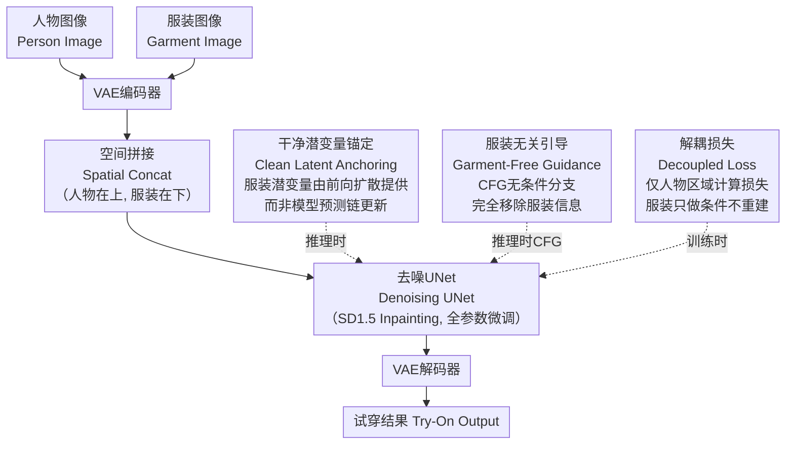

# Rethinking Garment Conditioning in Diffusion-based Virtual Try-On: Decouple, Don't Denoise

**会议**: ECCV 2026  
**arXiv**: [2511.18775](https://arxiv.org/abs/2511.18775)  
**代码**: 待确认（未见公开代码链接）  
**领域**: 图像生成（注：原始指定 image_restoration，本文实际属于虚拟试穿/条件图像生成，建议移至 image_generation）  
**关键词**: 虚拟试穿, 扩散模型, 空间拼接, 条件解耦, 全参数微调, DeCo-VTON

## 一句话总结

DeCo-VTON 通过可视化分析双 UNet 参考网络的噪声预测行为，首次揭示空间拼接式虚拟试穿中全参数微调失效的根本原因——服装条件与去噪过程耦合导致的三个功能冲突——并对应提出三个解耦设计原则（服装无关引导、解耦损失、干净潜变量锚定），在不改动网络架构的前提下，以单 UNet 860M 参数达到甚至超越双 UNet 1.8B 参数 SOTA 模型 Leffa 的试穿效果。

## 研究背景与动机

基于图像的虚拟试穿（VTON）旨在将目标服装自然地"穿到"给定人物图像上，是电商和时尚领域的关键技术。当前扩散模型已取代 GAN 成为 VTON 的主流范式，其中双 UNet 架构通过一个专门的参考 UNet 处理服装图像并将多尺度特征注入主去噪 UNet，在服装保真度上取得了最优效果。Leffa 作为当前双 UNet 的 SOTA，通过让参考网络接收与主网络相同的时间步实现了时间步对齐的服装特征（高 t 提供粗结构、低 t 提供细纹理），达到了最优的保真度。然而双 UNet 意味着参数和计算量翻倍——Leffa 达到 1.8B 参数，推理和显存开销都不小。

单网络架构省去参考 UNet，以空间拼接（spatial concatenation）最为直接：将服装图像和人物图像的潜变量在空间上拼成一个整体进行去噪，简单轻量。然而一个令人困惑的现象出现了：CatVTON（860M UNet）和 Voost（11.9B DiT）都报告全参数微调的效果不仅不如注意力层微调，有时甚至更差。两个规模相差一个数量级、架构完全不同的模型得出一致的结论，暗示问题不在 backbone 本身，而在于空间拼接这种条件注入方式。为什么全参数微调在空间拼接下失效？能解决吗？

本文通过首次可视化分析双 UNet 参考网络的噪声预测行为——将其在不同时间步的输出经 VAE 解码成图像——发现了一个关键洞察：成功的服装条件必须在结构上与去噪过程解耦。双 UNet 天然满足这一条件：参考网络始终处理干净的服装潜变量，不受去噪目标的约束。而空间拼接将服装潜变量嵌入去噪目标内部，失去了这种结构解耦，导致三个功能冲突：CFG 无条件分支因残留服装信息而抑制而非增强服装细节（Conflict 1）、训练目标同时要求服装重建和条件转移造成梯度竞争（Conflict 2）、推理时服装潜变量由模型预测链更新偏离前向扩散时序（Conflict 3）。**核心 idea：首次识别出空间拼接中全参数微调失效的三个根本冲突，并对应提出三个解耦设计原则（服装无关引导、解耦损失、干净潜变量锚定），在不改动网络架构的条件下释放全参数微调的潜力。**

## 方法详解

### 整体框架

DeCo-VTON 以 CatVTON 的架构为基线（SD1.5 Inpainting UNet, 860M），不做任何网络结构改动。输入是一张带遮罩的人物图像和一张服装图像，经 VAE 编码后沿高度方向拼接组成去噪输入。模型的全部创新在于一套训练和推理配方，包含三个分别针对上述三个冲突的设计原则。下图以推理流程为主线，展示了三个原则的介入位置：

### 关键设计

**1. 服装无关引导（Garment-Free Guidance）：消除 CFG 无条件分支中的服装泄漏**

标准 CFG 通过扩大条件预测和无条件预测的差异来增强条件信号。在 CatVTON 的空间拼接中，无条件输入虽然移除了条件通道中的干净服装潜变量，但仍然保留了被噪声污染的服装潜变量——因为它属于去噪目标的一部分，不能直接去掉。这意味着无条件分支仍然"看到"了服装信息，CFG 的差信号不再纯粹反映服装条件的贡献，增大引导系数反而抑制了服装细节。这是三个冲突中最严重的一个。DeCo-VTON 的解决方案极其直接：无条件输入中完全移除所有服装相关的潜变量（服装区域全部填零），得到一个真正不包含任何服装信息的无条件分支：

$$ \mathbf{X}^{\text{gf}}_t = \text{Concat}_{\text{ch}}\left(\mathbf{z}^p_t \oplus \mathbf{0},\; \mathbf{M} \oplus \mathbf{0},\; \mathbf{z}^p_0 \oplus \mathbf{0}\right) $$

此时 CFG 的差信号 $\epsilon_\theta(\mathbf{X}_t, t) - \epsilon_\theta(\mathbf{X}^{\text{gf}}_t, t)$ 就正确孤立出了服装条件的贡献，增大引导系数能够有效增强而非削弱服装细节。训练时以 10% 的概率随机丢弃服装条件，让模型学会处理这种服装无关的预测。消融实验表明，GFG 贡献了最大的单步收益（FID 降 0.712，KID 降 0.328），印证了 Conflict 1 是最严重的瓶颈。

**2. 解耦损失（Decoupled Loss）：移除服装重建的梯度干扰**

标准训练目标对拼接后的整个区域（人物 + 服装）计算噪声预测损失。这意味着网络同时收到两种竞争的梯度：一种要求它准确重建服装区域，另一种要求它将服装信息转移到人物区域。这两种目标并不对齐——为像素级服装重建优化的特征不一定适合调节人物生成。在双 UNet 架构中，参考 UNet 只做特征提取、不承载重建损失，因此不存在此问题。DeCo-VTON 的解法利用空间拼接的自然分界：由于人物和服装是沿高度方向拼接的（人物在上、服装在下），网络的输出也自然分解为人物部分和服装部分。解耦损失只对人物部分计算 DREAM 目标——对人物区域做目标校正和输入校正的 DREAM 损失，服装区域保持固定的前向扩散值、不参与梯度传播。这样服装区域在网络内部永远只扮演条件上下文的角色，不参与重建梯度的竞争。消融实验显示，在 512×384 分辨率下 DL 改善相对温和，但在 1024×768 高分辨率下去除 DL 会导致 Unpaired FID 升高 0.313，说明分辨率越高，梯度竞争越激烈。

**3. 干净潜变量锚定（Clean Latent Anchoring）：推理时对齐服装区域噪声时序**

Leffa 中参考 UNet 成功的关键是它接收与主网络相同的时间步 t，从而提供时序对齐的服装特征——高 t 时输出粗结构特征，低 t 时切换到细纹理特征。但在空间拼接的标准推理中，服装潜变量由模型自身的预测链逐部更新，其噪声水平逐渐偏离前向扩散的预期：高时间步时服装区域实际还很干净、低时间步时又被模型"过度去噪"了，时序对齐完全失效。DeCo-VTON 的思路是利用已知的干净原始服装潜变量来修复这一问题：在每步推理前，直接用前向扩散公式从干净服装潜变量计算出该时间步对应的正确加噪版本，替换掉模型预测链中的服装潜变量：

$$ \bar{\mathbf{z}}^g_t = \sqrt{\bar{\alpha}_t}\,\mathbf{z}^g_0 + \sqrt{1 - \bar{\alpha}_t}\,\boldsymbol{\epsilon}_{\text{init}} $$

这里 $\boldsymbol{\epsilon}_{\text{init}}$ 是一个固定的随机噪声，在整个扩散过程中保持不变以确保一致性。这样做保证了两点：一是零误差累积（服装潜变量始终来自干净原图而非预测链），二是精确的时间步对齐（服装区域的噪声水平正好匹配网络在该时间步的预期）。CLA 是纯推理阶段的修改——训练时前向扩散已经天然提供了时序对齐的加噪服装，无需额外处理。消融实验中 CLA 对 KID 的改善最显著（0.068→0.010），说明推理阶段的对齐对生成分布质量至关重要。

### 损失函数 / 训练策略

整个网络以全参数微调方式训练，学习率 1×10⁻⁵，全局批量大小 128，AdamW 优化器，梯度裁剪 1.0。损失函数为解耦后的 DREAM 目标（$\lambda=10$），仅作用于拼接输入的人物区域。训练时服装条件以 10% 概率随机 dropout，使用混合精度 BF16。VITON-HD 上训练 16K 步，DressCode 上训练 32K 步，2 张 H200 GPU 分别耗时约 10 小时和 20 小时。推理阶段使用 DDIM 调度器，引导系数 $\omega=2.5$。

## 实验关键数据

### 主实验

**表 1: VITON-HD 定量对比**

| 方法 | 架构 | Paired FID↓ | Paired KID↓ | Paired LPIPS↓ | Unpaired FID↓ | 参数量 |
|------|------|-------------|-------------|---------------|----------------|--------|
| CatVTON | 单UNet | 5.425 | 0.411 | 0.057 | 9.015 | 860M |
| Leffa | 双UNet | 4.540 | 0.050 | 0.048 | 8.520 | 1.8B |
| **DeCo-VTON** | **单UNet** | **4.438** | **0.010** | **0.047** | **8.266** | **860M** |

**表 2: DressCode 定量对比**

| 方法 | 架构 | Paired FID↓ | Paired KID↓ | Unpaired FID↓ | 参数量 |
|------|------|-------------|-------------|----------------|--------|
| CatVTON | 单UNet | 3.992 | 0.818 | 6.137 | 860M |
| Leffa | 双UNet | 2.060 | 0.070 | 4.480 | 1.8B |
| **DeCo-VTON** | **单UNet** | **2.175** | **0.062** | **4.310** | **860M** |

在两个数据集上，DeCo-VTON 以 860M 单网络达到甚至超越 Leffa（1.8B 双 UNet）的效果。效率方面，DeCo-VTON 推理速度为 1.3s（Leffa 2.7s），峰值显存 2.26GB（Leffa 3.91GB），分别是 Leffa 的 2.1 倍速度和 42% 更低显存。高分辨率（1024×768）对比中，DeCo-VTON 同样以 860M 单网络在 Paired FID 上超越 11.9B 的 Voost（4.741 vs 5.269）。

### 消融实验

**表 3: 渐进式消融（VITON-HD）**

| 配置 | Paired FID↓ | Paired KID↓ | 冲突对应 | 说明 |
|------|-------------|-------------|----------|------|
| CatVTON (Attn-only) | 5.425 | 0.411 | — | 基线，仅训练注意力层 |
| CatVTON (全参数微调) | 5.250 | 0.402 | — | 几乎无提升，印证三个冲突 |
| + GFG | 4.538 | 0.074 | Conflict 1 | 最大单步提升，CFG泄漏是最严重瓶颈 |
| + DL | 4.517 | 0.068 | Conflict 2 | 进一步改善，高分辨率效果更显著 |
| + CLA (=DeCo-VTON) | 4.438 | 0.010 | Conflict 3 | KID 降幅最大，完整配方 |

### 关键发现

- 服装无关引导（GFG）贡献了最大的单步收益（FID 降 0.712, KID 降 0.328），证明 CFG 中的服装泄漏是空间拼接下最严重的瓶颈。CatVTON 原始的全参数微调（FID 5.250）仅比注意力层训练（FID 5.425）提高 0.175，而在加入 GFG 后直接降至 4.538——说明之前全参数微调失败不是因为 full FT 本身没用，而是因为 Conflict 1 没有被解决。
- 干净潜变量锚定（CLA）在 KID 上带来了最大降幅（0.068→0.010），说明推理阶段的时序对齐对生成分布逼真度至关重要。这与 Leffa 中"时间步对齐的参考网络是成功关键"的观察完全一致。
- 解耦损失在 512×384 下的贡献相对温和，但在 1024×768 下去除 DL 会使 Unpaired FID 恶化 0.313、KID 恶化 0.149，说明高分辨率下服装重建与人物生成的梯度竞争显著加剧。
- 用户研究（25 人 × 30 样本，双盲 A/B 测试，p<0.001）中，DeCo-VTON 相比 CatVTON 以约 3.5:1 被偏好，相比 Leffa 以约 2:1 被偏好。定量指标的提升确实转化为了用户可感知的质量差异。

## 亮点与洞察

- "解耦而非去噪"的范式创新：这篇论文最精彩的洞察是首次将双 UNet 的成功归因于"条件与去噪的结构解耦"而非"更多参数"，从而用一套轻量推理/训练配方在单网络上复现了这一优势。这个分析框架适用于任何使用空间拼接的条件生成任务。
- 技术极简与优雅：三个设计原则都不改动网络结构，每一原则恰好针对一个冲突。GFG 只是修改无条件分支的构造方式，DL 只是改变损失计算区域，CLA 只是一个推理阶段的变量替换——组合起来却完成了从"全参数微调无效"到"SOTA"的跨越。这种"诊断→对症下药"的写作本身就是很好的论文叙事范本。
- 跨架构泛化的自然解释：CatVTON（UNet）和 Voost（DiT）两种完全不同的 backbone 在空间拼接下遇到相同的问题，DeCo-VTON 的分析（Conflict 2 和 3 来源于空间拼接本身而非 CFG）自然解释了这一现象。作者指出 DL 和 CLA 理论上可以直接迁移到 Flow Matching 等非 CFG 框架。

## 局限与展望

- GFG 与 CFG 机制绑定，无法直接迁移到不使用 CFG 的架构（如 Voost 的 Flow Matching）。作者推测 DL 和 CLA 独立于引导方案可直接迁移，但此推测尚需实验验证。
- 论文代码未明确开源，实验可复现性有待确认。
- 在高分辨率（1024×768）下 DeCo-VTON 的 SSIM 相比 Leffa 和 Voost 仍有差距（0.888 vs Voost 的 0.898）。论文归因于 Voost 的 VTOFF 辅助任务带来的额外监督，但也提示单纯靠解耦配方在高分辨率的结构保真度上可能存在天花板。
- 论文的分析框架在 VTON 场景下做了完整验证，但能否推广到更通用的空间拼接任务（如参考图引导的修复/外绘）尚需进一步研究——不过作者已经明确指向了这一扩展方向，论文给出的三个冲突诊断也天然适配这类任务。

## 相关工作与启发

- **vs CatVTON**: 两者共用同一网络架构（SD1.5 Inpainting, 860M）。CatVTON 报告全参数微调无效并因此采用 Attn-only 训练。DeCo-VTON 通过三个解耦原则释放了全参数微调的潜力，FID 从 5.425 降至 4.438（降幅 18.2%），KID 从 0.411 降至 0.010（降幅 97.6%）。
- **vs Leffa（双 UNet SOTA）**: Leffa 使用 1.8B 双 UNet，DeCo-VTON 仅 860M 单 UNet 就达到相当甚至更优的效果。这说明双 UNet 的额外参数并非必要——只要条件解耦做对，单网络架构也能达到同样水平。这个结论本身对 VTON 的工程部署有重大意义。
- **vs Voost（DiT 空间拼接）**: Voost 以 11.9B DiT + Flow Matching 做空间拼接，同样面临全参数微调失效（FID 6.351 vs Attn-only 5.269）。DeCo-VTON 为这一此前被归因为"过拟合"的现象提供了更结构化的解释（三个冲突）。在高分辨率对比中，DeCo-VTON（860M）以更少的参数量取得了更低的 Paired FID（4.741 vs 5.269）。
- **vs 更广泛的条件生成**: 论文将空间拼接中的条件-去噪耦合问题置于更宽泛的扩散模型条件注入框架中讨论（cross-attention、ControlNet、空间拼接），并指出后两者分别通过"结构分离"和"专用分支"天然避免此问题。这一对比有助于理解不同条件注入方式的本质差异。

## 评分

- 新颖性: ⭐⭐⭐⭐⭐ 首次系统分析空间拼接下全参数微调失效的根本原因，提出了优雅的三原则解决方案。可视化分析双 UNet 参考网络噪声预测行为的思路本身也是新的方法论贡献。
- 实验充分度: ⭐⭐⭐⭐⭐ 在两个标准数据集上与 12+ 种方法对比，包含定量、定性、渐进式消融（各原则独立验证）、效率分析、用户研究和跨架构高分辨率对比。消融实验直接依据三个冲突设计，因果链条清晰。
- 写作质量: ⭐⭐⭐⭐⭐ 问题动机层层递进、逻辑链条极其清晰：可视化发现解耦洞察 → 分析空间拼接如何违反该洞察 → 推导三个冲突 → 对应提出三个原则 → 逐步消融验证。每个设计选择都有理有据，篇幅紧凑，没有废话。
- 价值: ⭐⭐⭐⭐⭐ 不仅提出了更好的 VTON 模型，更重要的是给出了一个可迁移的分析框架——"条件与去噪必须解耦"这一原则可能适用于所有空间拼接的条件生成任务（图引导修复/外绘等），潜在影响远超出 VTON 领域。论文还统一解释了此前 CatVTON 和 Voost 各自观察到但未能解释的现象。

<!-- RELATED:START -->

## 相关论文

- [\[CVPR 2026\] High-Fidelity Virtual Try-On beyond Paired Data Scarcity via Diffusion-based Cycle-Consistent Learning](../../CVPR2026/image_generation/high-fidelity_virtual_try-on_beyond_paired_data_scarcity_via_diffusion-based_cyc.md)
- [\[CVPR 2025\] Shining Yourself: High-Fidelity Ornaments Virtual Try-on with Diffusion Model](../../CVPR2025/image_generation/shining_yourself_high-fidelity_ornaments_virtual_try-on_with_diffusion_model.md)
- [\[ICLR 2026\] Rethinking Global Text Conditioning in Diffusion Transformers](../../ICLR2026/image_generation/rethinking_global_text_conditioning_in_diffusion_transformers.md)
- [\[CVPR 2026\] PROMO: Promptable Outfitting for Efficient High-Fidelity Virtual Try-On](../../CVPR2026/image_generation/promo_promptable_virtual_tryon_efficient.md)
- [\[ICCV 2025\] OmniVTON: Training-Free Universal Virtual Try-On](../../ICCV2025/image_generation/omnivton_training-free_universal_virtual_try-on.md)

<!-- RELATED:END -->
