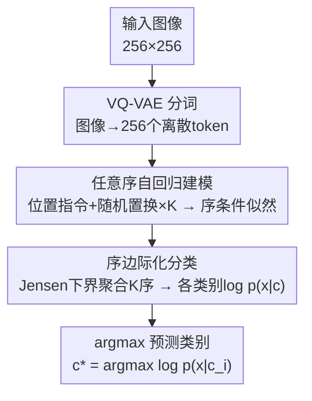

# Revisiting Autoregressive Models for Generative Image Classification

**会议**: ECCV 2026  
**arXiv**: [2603.19122](https://arxiv.org/abs/2603.19122)  
**代码**: [https://github.com/yandex-research/ar-classifier](https://github.com/yandex-research/ar-classifier)  
**领域**: 图像生成  
**关键词**: 生成式分类器, 自回归模型, 任意序建模, 序边际化, 扩散模型  

## 一句话总结
本文重新审视自回归（AR）模型在生成式图像分类中的潜力，发现固定token序是限制AR分类器性能的关键瓶颈，提出用任意序AR模型（RandAR）对多个随机token序的类别条件对数似然取Jensen下界平均（序边际化），在ImageNet及多个OOD基准上全面超越扩散分类器且推理快25倍，并首次使生成式分类器达到与DINOv2可竞争的水平。

## 研究背景与动机
生成式模型近年展现出逼近复杂视觉数据分布的强大能力，进而催生一个问题：它们能否直接在判别式任务中发挥作用？生成式分类器（Generative Classifier, GC）通过贝叶斯公式从类别条件似然 p(x|c) 推导后验 p(c|x)，具有避免捷径学习、形状偏置（shape bias）更贴近人类感知等吸引人的特性。

然而，此前GC研究几乎全部聚焦于扩散分类器（Diffusion Classifier, DC）。扩散分类器虽然精度可观，但存在一个关键缺陷：单张图像的ELBO估计需100-250次模型前向传播，推理极慢。相比之下，AR模型仅需单次前向即可计算完整序列对数似然，效率高出两个数量级——但固定序（raster-scan）AR分类器精度远逊于扩散分类器，致使其长期被忽视。

本文揭示了这一差距的根本原因：**固定token序对图像理解施加了过强的归纳偏置**。光栅序（左到右、上到下）下，AR模型逐token预测时主要依赖已观测的局部邻域token的判别线索，缺乏对图像全局结构的把握。分析实验清晰展示了这一现象——同一图像在某些token序下被正确分类而在另一些序下却分类错误；单序预测的判别性log-likelihood热力图仅高亮物体局部区域，而多序平均（K=20）后物体的完整轮廓才显现出来。

核心矛盾由此明确：单序预测依赖局部线索、不够全面，但枚举所有序不可行。本文的切入角度是借助**任意序自回归（Any-Order AR, AO-AR）模型**RandAR——它通过位置指令token显式条件化于token位置，天然支持任意序生成与似然评估。在此基础上，对K个随机序的预测取平均（序边际化），既获得多视角综合判断的增益，又将推理成本控制在K次前向（K≈20），仍比扩散分类器快一个数量级。

**核心idea**：用任意序AR模型在多个随机token序下评估类别条件对数似然，通过Jensen下界将其聚合为序边际化预测，以约20次前向达到超越扩散分类器250次前向的精度，且推理快25倍。

## 方法详解

### 整体框架
本方法的目标是给定图像x，在所有类别c上估计序边际化的类别条件对数似然 log p(x|c)，再通过贝叶斯公式取argmax得到预测类别。整个pipeline分为以下步骤：VQ-VAE将256x256图像编码为256个离散token；为每个token配上位置指令token后生成K个随机置换序列；每个序列末尾追加类别条件token（M个类别各一条，同一组K个序在各类间共享以保证公平）；RandAR对每个（序，类别）对做单次前向，输出序条件对数似然；按Jensen下界聚合K个序的似然后取argmax得到预测类别。

### 关键设计

**1. 任意序自回归建模：让AR模型摆脱固定token序的桎梏**

传统AR图像模型（如LlamaGen、VAR）将图像token按固定光栅序排列后做next-token prediction，等效于强制模型以单一方向"阅读"图像。这在分类任务中成为性能瓶颈——模型只能在已观测token的局部上下文中推断类别信息，缺乏从多个视角综合理解图像的能力。实验也佐证了这一点：光栅序模型的per-token判别性log-likelihood仅高亮物体的部分区域，远不如多序平均后完整。

本文选用RandAR作为基础模型，其核心机制是在标准图像token序列x={x_1,...,x_N}之外引入一组位置指令token P={p_1,...,p_N}，形成交错序列 [p_1, x_1, ..., p_N, x_N]。通过对token索引施加随机置换π，得到重排序列 [p_1^{π(1)}, x_1^{π(1)}, ..., p_N^{π(N)}, x_N^{π(N)}]，其中位置指令token明确告知模型当前要预测的是原图哪个空间位置的token。RandAR的序条件似然定义为：

$$p(\mathbf{x}|\pi,c) = \prod_{n=1}^{N} p(\mathbf{x}_n^{\pi(n)} | \mathbf{p}_1^{\pi(1)}, \mathbf{x}_1^{\pi(1)}, \ldots, \mathbf{x}_{n-1}^{\pi(n-1)}, \mathbf{p}_n^{\pi(n)}, c)$$

这一设计的关键在于位置指令token将"生成顺序"与"空间位置"解耦，使模型学会在任意顺序下都能合理预测下一个token。当π取恒等映射时，RandAR退化为标准光栅序AR模型；当π随机采样时，每条序提供一条不同的观察路径，为后续多序聚合奠定基础。需要注意的是，单次随机序（K=1）的精度（0.670）甚至低于光栅序（0.701），这是因为模型拟合任意序的能力略弱于拟合单一序——序边际化的增益来自多条不同序的互补信息。

**2. 序边际化分类：用Jensen下界高效聚合多序信号**

有了任意序建模能力后，核心问题变成如何利用多条序的预测来获得更稳健的分类结果。序无条件似然可写为所有可能置换下的期望 p(x|c)=E_π[p(x|π,c)]，但直接计算该期望不可行。本文发现一个决定性能的关键实践选择：**用Jensen下界估计log p(x|c)，而非直接估计p(x|c)再取log**：

$$\log p(\mathbf{x}|c) = \log \mathbb{E}_{\pi}[p(\mathbf{x}|\pi,c)] \geq \mathbb{E}_{\pi}[\log p(\mathbf{x}|\pi,c)] \approx \frac{1}{K}\sum_{k=1}^{K}\log p(\mathbf{x}|\pi_k,c)$$

这一选择并非理论上的细枝末节。实验表明，Jensen下界（平均log p）随K增大带来显著且持续的精度提升（IN-Val: K=1时0.712→K=20时0.813），而直接估计log E[p]的增益要小得多（K=20仅0.760，相差5.3个百分点）。原因在于RandAR训练时优化的就是对数似然目标，模型对log p(x|π,c)的估计天然更准，下界形式与训练目标对齐；类似地，扩散分类器中以训练目标（uniform weighting ELBO）做推理也远优于真正ELBO估计。

分类时，将M个类别的条件token分别追加到K个置换序列末尾，RandAR对每个（序，类别）组合做一次前向，得到M×K个序条件对数似然，再按类别聚合为M个log p(x|c_i)，最后取argmax。AR模型的效率优势在此充分体现：每个（序，类别）对仅需一次前向，而扩散模型每个（timestep，类别）对也需一次前向——当M=1000、K=20 vs T=250时，AR总前向次数为20K，扩散为250K，前者快了约12.5倍。此外，作者证明AO-AR的序边际化目标与Masked Diffusion的ELBO在期望上等价，但AR评估方式在相同K下始终优于MD评估（因为AR一次前向覆盖全部token似然，MD每步只估计一个前缀长度下的token）。

**3. 分词器潜在噪声增强：让小扰动不改变token序列**

VQ-VAE分词器将连续图像映射为离散token序列，但这一映射对微小扰动可能不稳定——几乎相同的图像在潜在空间中略有偏移，就可能产生不同的离散token序列。这对AR模型训练不利：模型看到本质相同的图像却面对不同的token序列，增加了不必要的建模难度。

本文系统比较了MaskGIT（码本1024）和LlamaGen（码本16384）两种分词器的噪声鲁棒性。通过对量化前的连续潜在变量施加flow-matching噪声过程 (1-t)z + tε（ε~N(0,I)），追踪"翻转token比例"与rFID的关系。结果显示，大码本LlamaGen可容忍约27% token翻转而rFID从1.68仅升至1.69，而小码本MaskGIT在约10%翻转时rFID已从1.67升至1.71——大码本提供了更大的冗余空间来吸收潜在扰动。

基于此观察，提出在RandAR训练时对LlamaGen分词器的潜在表示施加适度噪声作为数据增强——让模型学会忽略那些不改变图像语义的微小token波动。实验表明该增强弥补了LlamaGen在域内精度上相对MaskGIT的差距（IN-Val: 0.769→0.780），同时保持其在所有OOD基准上的鲁棒性优势。

### 损失函数 / 训练策略
RandAR使用标准next-token prediction交叉熵损失在ImageNet-1K上从头训练，无任何额外的判别式目标或对比学习对齐。优化器为AdamW，学习率采用40k步warm-up至峰值6×10^{-4}后cosine衰减（共500k迭代），RandAR-L批量大小512、RandAR-XL批量大小256。训练时施加随机裁剪和潜在噪声增强（仅LlamaGen分词器）。分类评估阶段使用K=20个随机序（与训练时一致的随机序采样策略），无任何微调或额外对齐步骤。

## 实验关键数据

### 主实验
在ImageNet-Val及五个OOD基准（IN-R/S/A、IN-C Gauss/JPEG）上对比RandAR与判别式、扩散、AR、联合能量模型等基线。所有模型均在ImageNet-1K 256x256上预训练，架构规模和token数对齐。评估使用2K子集（IN-Val/IN-S/IN-C）或全集（IN-R/IN-A，200类）。

| 模型规模 | 方法 | 类型 | IN-Val | IN-R | IN-S | IN-A |
|---------|------|------|--------|------|------|------|
| L/16 | ViT | 判别式 | 0.803 | 0.409 | 0.291 | 0.166 |
| L/16 | DINOv2 | 判别式SSL | **0.819** | 0.476 | 0.358 | **0.363** |
| L/16 | DiT | 扩散 | 0.771 | 0.393 | 0.361 | 0.133 |
| L/16 | LlamaGen | AR固定序 | 0.640 | 0.298 | 0.232 | 0.143 |
| L/16 | VAR | AR多尺度 | 0.656 | 0.255 | 0.177 | 0.083 |
| L/16 | A-VARC+ | AR+噪声平均 | 0.717 | 0.277 | 0.175 | 0.072 |
| L/16 | RandAR raster | AR固定序 | 0.701 | 0.351 | 0.301 | 0.174 |
| L/16 | **RandAR (Ours)** | AR任意序 | 0.780 | **0.463** | **0.406** | 0.145 |
| XL/16 | DINOv2 | 判别式SSL | **0.827** | 0.486 | 0.354 | **0.345** |
| XL/16 | DiT | 扩散 | 0.772 | 0.402 | 0.367 | 0.153 |
| XL/16 | SiT + REPA | 扩散+SSL对齐 | 0.733 | 0.296 | 0.262 | 0.169 |
| XL/16 | **RandAR (Ours)** | AR任意序 | 0.813 | **0.530** | **0.459** | 0.233 |

RandAR-L在IN-Val上领先DiT-L 0.9个百分点，在OOD基准上优势更大（IN-R +7.0%, IN-S +4.5%）。RandAR-XL将领先进一步扩大（IN-R领先DiT 12.8%, IN-S领先9.2%）。与DINOv2-XL相比，域内差1.4%但在3/5个OOD集上反超（IN-R +4.4%, IN-S +10.5%, IN-C Gauss +15.2%），IN-C JPEG持平，仅IN-A落后11.2%。固定序AR方法（LlamaGen 0.640, VAR 0.656, RandAR raster 0.701）在RandAR任意序（0.780）面前全面落后，明确说明性能增益来自序边际化而非模型架构。

### 消融实验
**似然估计策略**（RandAR-XL, IN-Val）：

| 策略 \ K | 1 | 2 | 5 | 10 | 20 |
|----------|---|---|---|----|-----|
| Jensen下界 E[log p] | 0.712 | 0.762 | 0.795 | 0.804 | **0.813** |
| 直接估计 log E[p] | 0.712 | 0.724 | 0.742 | 0.747 | 0.760 |

Jensen下界随K增大持续带来显著增益（K=1→20提升10.1个百分点），而直接估计收益明显更小（仅+4.8个百分点）。K=20时两者差距达5.3个百分点，验证了"与训练目标对齐"假说。

**分词器与噪声增强**（RandAR-L）：

| 分词器 | 噪声增强 | IN-Val | IN-R | IN-S | IN-A |
|--------|---------|--------|------|------|------|
| MaskGIT (1024) | 无 | **0.780** | 0.448 | 0.379 | 0.101 |
| LlamaGen (16384) | 无 | 0.769 | 0.469 | **0.409** | **0.146** |
| LlamaGen (16384) | 有 | **0.780** | 0.463 | 0.406 | 0.145 |

大码本LlamaGen在OOD鲁棒性上全面优于MaskGIT（IN-A领先4.5%），噪声增强弥补了其域内精度差距，最终在所有主实验中使用LlamaGen+噪声增强配置。

### 关键发现
- **序边际化是主要增益来源，且随机序自身不是免费的**：随机单序（K=1）精度0.670甚至低于光栅序0.701——模型拟合任意序的能力弱于单一序，仅当K>1时多序互补效应才开始显现并超越固定序。K=2时即达0.726，已超过光栅序的0.701。
- **中间位置的token最具判别力**：per-token精度随前缀长度先升后降，在约50-80个前缀token处达到峰值——此时模型已捕获高层语义但尚未被局部细节"填满"，被迫生成类别定义性细节；更靠后的token精度下降，因为此时模型可依赖大量近邻已观测token而非类别信息。
- **效率优势碾压式**：在accuracy-runtime曲线上，RandAR在所有运行点（不同K值）均优于DiT（不同timestep数），最优配置下推理快25倍。即使K=20（20次前向），仍比扩散分类器250次前向快10倍以上，而精度更高。
- **生成质量不等于分类精度**：RandAR-XL FID=2.34 vs DiT-XL FID=2.27，前者生成质量略差但分类精度显著更高（0.813 vs 0.772）。低FID主要反映感知保真度而非类别理解深度。
- **真实分布偏移下的强鲁棒性**：在WILDS基准（Camelyon17/CelebA/FMoW）上，RandAR在OOD集上整体优于DiT和所有判别式基线，尤其在Camelyon17 OOD上RandAR-L达0.783，远超DiT-L的0.586和最佳判别式基线的0.667。

## 亮点与洞察
- **Jensen下界而非期望估计的trick极具实用价值**：在log外面还是里面取平均，这个看似微小的实现选择在K=20时带来5.3个百分点的绝对精度差。它与扩散分类器中"训练目标（uniform weighting）优于真正ELBO"的现象形成呼应——两者共同揭示：生成式分类器在推理时应使用与训练目标一致的估计形式，而非追求严格的概率推断。
- **位置指令token使"序"从限制变为自由参数**：传统AR模型的token序是固定的实现细节，RandAR通过显式位置建模将其转化为可操控的自由度，使"多视角观察"成为可能。这一思路可迁移到需要序列建模的其他任务——如视频理解中改变帧序、3D点云中改变扫描序、甚至语言模型中改变词序来做数据增强。
- **生成式分类器的OOD鲁棒性优势得到进一步验证和扩展**：RandAR不仅在标准OOD基准（IN-R/S/A/C）上优于判别式模型，在WILDS真实分布偏移场景下同样领先，尤其在最坏子群精度上优势明显。这支持了"基于密度的分类天然规避虚假相关性"的假说，对安全关键应用（医疗、自动驾驶）有重要意义。
- **AO-AR与Masked Diffusion的形式等价性为统一理解两类模型提供了桥梁**：论文证明序边际化AO-AR目标在期望上等于MD-ELBO，但在实际评估中AR方式远优于MD方式（尤其在小K下），这揭示了两种评估范式在有限样本下的本质差异，也为设计更高效的混合推理策略提供了理论基础。

## 局限与展望
- **类别数增加时计算成本线性增长**：每增加一个类别需K次额外前向。ImageNet-1K（1000类）已需20K次前向，虽单次便宜但绝对量可观。作者提出未来可将GC蒸馏为判别式模型以兼顾效率与精度，这是一个务实且有前景的方向。
- **在IN-A上始终显著弱于DINOv2**：RandAR-XL仅0.233 vs DINOv2-XL 0.345，差距超过11个百分点。IN-A包含对抗性自然图像，可能暴露了AR模型对异常视觉模式的敏感度更高——离散token化过程中丢失的细粒度纹理信息在对抗性场景下可能成为瓶颈。可探索将任意序AR与连续表示（如diffusion tokenizer）结合来弥补这一不足。
- **仅验证了RandAR一种AO-AR架构**：虽然RAR-B的对照实验表明序边际化收益不限于RandAR，但当前只有RandAR原生支持任意序，限制了架构空间的探索。更高效的AO-AR架构（如并行解码、自适应序选择）可能进一步提升精度-效率trade-off。
- **未探索自适应序选择**：当前K个序随机均匀采样，但per-token精度分析表明不同位置token的判别力差异巨大（中心区域远高于边缘）。若能学习图像自适应的最优序或按token重要性加权聚合，有望用更少的K达到同等或更高精度。扩散分类器中自适应timestep选择的成功先例[wang2025noise]为这一方向提供了参考。
- **计算成本阻碍大规模实际部署**：尽管比扩散分类器快25倍，但对1000类问题仍需20K次前向，远高于标准判别式模型的1次前向。蒸馏为判别式模型是作者建议的出路，但蒸馏过程中生成式分类器的OOD鲁棒性能否保留是开放问题。

## 相关工作与启发
- **vs 扩散分类器（DiT/SiT）**：扩散分类器通过在数百个timestep上估计ELBO实现分类，精度可观但极慢（250次前向）。本文从方法论层面揭示了AR与扩散的核心差异——AR以token序为边际化自由度、扩散以噪声timestep为边际化自由度。AR的序边际化在K=20时接近饱和而扩散的timestep边际化需250步才收敛，根源在于单个token序已编码较丰富的图像结构信息而单个timestep的噪声样本信息量极其有限。
- **vs A-VARC+（VAR-based GC）**：A-VARC+同样基于VAR架构并通过多噪声样本平均提升分类精度，但本质上仍是固定多尺度光栅序，且OOD性能极差（IN-A 0.072 vs RandAR 0.145, IN-S 0.175 vs 0.406）。区别在于A-VARC+平均的是"同一序下的不同噪声样本"，而本文平均的是"不同序"——后者引入的观察视角多样性远大于前者，这才是性能跃升的根本原因。
- **vs Masked Diffusion（MaskGIT）**：论文证明了AO-AR的序边际化目标与MD-ELBO在期望上等价，RandAR可被评估为MD模型。但实验表明AR评估方式在所有K值下均优于MD（K=1: 0.586 vs 0.348; K=20: 0.708 vs 0.662），因AR一次前向即覆盖全部token的似然而MD每步只估计一个前缀长度下的token。这提示在实际部署中应优先使用AR评估范式。
- **vs 自监督判别式模型（DINOv2）**：DINOv2通过大规模预训练+对比学习习得强判别表示，在域内精度上仍有1.4%优势。但RandAR在多个OOD场景反超且在最坏子群精度上全面领先，暗示生成式建模和对比学习在鲁棒性上可能互补。一个值得探索的方向是将序边际化的生成式分类信号作为DINOv2训练的辅助监督或推理时的集成策略。

## 评分
- 新颖性: ⭐⭐⭐⭐ 系统揭示了token序对AR生成式分类器的关键作用，用序边际化将AR-GC推至SOTA；核心组件RandAR非本文提出，Jensen下界技巧在扩散分类器中有先例，但两者的结合方式及分析深度是新的。
- 实验充分度: ⭐⭐⭐⭐⭐ 覆盖6个ImageNet变体、3个WILDS真实偏移数据集、3种模型规模（B/L/XL）、8类基线（判别/SSL/扩散/AR/JEM/MD/ResNet/REPA变体）、多分词器消融、似然估计策略消融、效率全景分析、误差分析、与MD等价性理论验证——实验设计极为全面且消融环环相扣。
- 写作质量: ⭐⭐⭐⭐⭐ 结构清晰，动机→分析→方法→实验→扩展的逻辑链完整，图7张+主表7张+附录丰富的可视化（per-token分析、误差案例、更多消融），分析深入且每个实验结论都有明确的"为什么"。
- 价值: ⭐⭐⭐⭐ 将AR生成式分类器推至新SOTA并首次使之与DINOv2可竞争，25倍加速使GC实用化迈进一大步；序边际化思路可启发AR模型在图像分割、异常检测等更多判别式任务中的应用；但蒸馏的必要性暗示纯GC的绝对效率仍有瓶颈。

<!-- RELATED:START -->

## 相关论文

- [\[ICML 2026\] A Diffusive Classification Loss for Learning Energy-based Generative Models](../../ICML2026/image_generation/a_diffusive_classification_loss_for_learning_energy-based_generative_models.md)
- [\[ECCV 2026\] Continuous Speculative Decoding for Autoregressive Image Generation](continuous_speculative_decoding_for_autoregressive_image_generation.md)
- [\[ECCV 2026\] Obliviate: Erasing Concepts from Autoregressive Image Generation Models](obliviate_erasing_concepts_from_autoregressive_image_generation_models.md)
- [\[AAAI 2026\] Symmetrical Flow Matching: Unified Image Generation, Segmentation, and Classification with Score-Based Generative Models](../../AAAI2026/image_generation/symmetrical_flow_matching_unified_image_generation_segmentation_and_classificati.md)
- [\[CVPR 2026\] Advancing Image Classification with Discrete Diffusion Classification Modeling](../../CVPR2026/image_generation/advancing_image_classification_with_discrete_diffusion_classification_modeling.md)

<!-- RELATED:END -->
