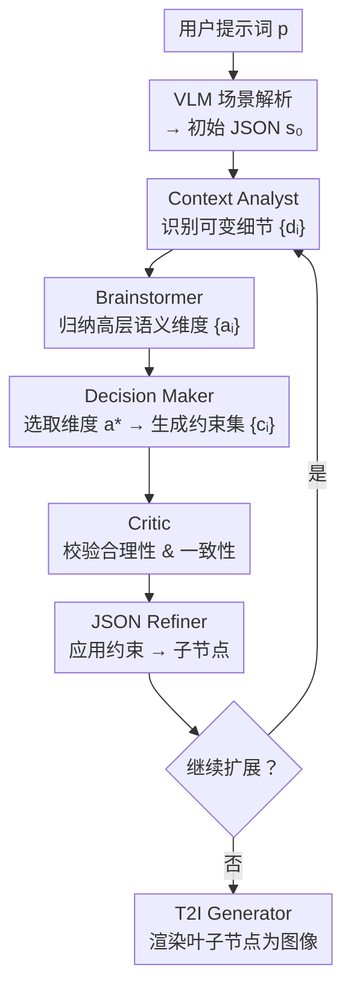

# Semantic Browsing: Controllable Diversity for Image Generation

**会议**: ECCV 2026  
**arXiv**: [2606.23679](https://arxiv.org/abs/2606.23679)  
**项目页**: [https://saradorfman1.github.io/SemanticBrowsing-webpage/](https://saradorfman1.github.io/SemanticBrowsing-webpage/)  
**代码**: 无  
**领域**: 图像生成  
**关键词**: 文本到图像生成, 语义多样性, 可控生成, 多智能体系统, 层级探索  

## 一句话总结

提出 Semantic Browsing 框架，用多智能体 VLM 流水线将用户提示词自动扩展为结构化 JSON 场景表示，再通过系统性变异语义维度生成层级多样性图像画廊，实现可导航、可解释的可控多样性生成。

## 研究背景与动机

现代文生图模型（如 FIBO、FLUX）在视觉质量和提示词对齐上已相当出色，这得益于其训练范式强调对详尽描述性文本的严格遵从。然而这种「严格」带来了一个副作用：同一提示词下不同随机种子生成的图像往往收敛到几乎相同的视觉解读——一个「一只狗、一只猫和一只鹦鹉」的提示每次生成的都是同一品种、同一姿势、同一布局的动物。这种多样性崩塌并非偶然，而是训练目标与采样机制共同作用的结果：高度对齐的训练使模型「过度承诺」于单一语义解释，而 CFG 等引导技术进一步压制了多样性。

过去的工作尝试从不同角度缓解此问题。CADS 和 Guidance Interval 在去噪过程中扰动条件信号，Particle Guidance 在潜空间施加排斥力，SGI 先生成大量候选再筛选出多样性子集。这些方法确实增加了样本间的差异，但差异来自随机效应而非有意义的语义选择——变化的是纹理细节、光源角度这类「无关痛痒」的维度，而场景的角色身份、交互方式、风格基调始终固定。用户无法告诉系统「我不想看不同角度的碗，我想看碗在厨房 vs 在野餐的两种场景」。

本文的核心洞察是：现代文生图模型的强提示词对齐本身并非限制，而是实现精细语义控制的关键使能条件——如果你能精确操控文本描述，模型就会精确反映你的修改。于是问题转化为「如何在文本层面系统性地生成有结构的语义变体」。**核心 idea：将用户提示词扩展为结构化 JSON 场景表示，用多智能体流水线自动识别可变异语义维度、生成互斥且合理的替代方案，再组织成层级树状结构——树的每个分支对应一个有意义的语义选择，各级分支保持约束继承性，最终渲染出可导航的语义多样性画廊。**

## 方法详解

### 整体框架

Semantic Browsing 的核心管线分为两个阶段。第一阶段是场景表示化：用户输入自然语言提示词 p，由一个 VLM 将其扩展为结构化的 JSON 场景 s₀，包含具体的对象列表、属性、空间布局、环境风格等，形成一个完全指定（fully-specified）的场景解释。第二阶段是层级多样性探索：以 s₀ 为根节点，四智能体流水线（Context Analyst → Brainstormer → Decision Maker → Critic）自动分析当前场景，选择某个语义维度生成若干互斥的变异指令，通过 JSON Refiner 应用到父节点产生子节点，逐步构建一棵以场景 JSON 为节点、以语义约束为边的解释树。树构建完成后，每个叶子节点由强提示词对齐的 T2I 模型渲染为图像，形成结构化的语义画廊。

### 关键设计

**1. 结构化场景 JSON 表示：将隐式语义显式化为可操作蓝图**

要实现语义变异的精准控制，首先需要语义本身是可寻址的——你不能在潜空间向量里定位「动物的品种」或「场景的情绪」。本文将每个场景表示为一个完全指定的 JSON 对象，包含对象列表（类别、属性、材质、颜色）、空间关系（位置、大小、朝向）、全局属性（风格、光照、天气、情绪）。这一表示由 VLM 从用户提示词扩展生成，自动填充提示词中未指定的细节。例如提示词「一只狗、一只猫和一只鹦鹉」可能被扩展为包含具体品种（金毛、暹罗猫、虎皮鹦鹉）、环境（客厅）、光照（自然光）的完整 JSON。关键在于，它明确区分了哪些属性是由用户提示词约束的（固定不可变）和哪些是由 VLM 填充的（开放可变）——这一区分构成了后续 Context Analyst 的操作基础。

**2. 四智能体协同推理：语义探索的精确分工**

多样性树的构建需要同时满足三个有时相互冲突的目标：变异维度在语义上统一（Semantic Structuring）、各分支真实不同（Heterogeneity）、所有变化与原始提示和已累积约束兼容（Plausibility）。本文将其分解为四个专门化的智能体：

Context Analyst 接收当前场景 JSON 和沿路径累积的约束历史 Cₛ，逐项审查哪些属性是提示词或历史约束已锁定的（如「狗、猫、鹦鹉必须存在」）、哪些是 VLM 填充的开放细节（如品种、毛色、姿态），输出可变异细节集合 {dᵢ}。它直接负责 Plausibility——保障后续变化不触碰已固定的元素。

Brainstormer 将 {dᵢ} 中的低层细节归纳为高层语义维度 {aᵢ}。例如不是单独变异「狗的品种」「猫的品种」「鸟的品种」，而是将它们聚合为「动物品种与种类」这一统一维度。它还评估每个维度的潜在视觉影响幅度（高/中/低），确保树向有实质语义变化的维度生长。它负责 Semantic Structuring——保证同一层的分支围绕同一个有意义的语义维度展开，而不是在一个维度里混入不同层的噪声。

Decision Maker 从候选维度中选定影响力最大的一个 a*，为该维度生成若干具体且互斥的约束 {cᵢ}，例如在「交互方式」维度下生成「嬉戏追逐」「安静共处」「猫主导」三种截然不同的替代方案。它主动推理「这一维度的几种合理实现是什么」，确保兄弟节点之间的差距是结构化差异而非微调。它负责 Heterogeneity——多样性树的实际语义增量由它制造。

Critic 作为最后的质量闸门，审查每条约束是否与原始提示和历史约束冲突。它修正模糊或矛盾的约束，确保最终输出是精确可执行的指令。它与 Context Analyst 从不同层面维护 Plausibility：前者从「哪些区域能动」切入，后者从「生成的指令是否冲突」切入。消融实验证明两者互补——去掉 Context Analyst 导致上下文一致性从 0.87 降为 0.82，去掉 Critic 则导致 VQAScore 从 0.90 降为 0.87。

**3. 层级解释树与约束继承：可导航的语义空间**

所有节点构成一棵以原始场景 s₀ 为根的有根树。每条从父节点到子节点的边对应一条原子语义约束——仅改变一个选定语义维度的一个具体实例化，保持其他所有已固定的属性不变。这意味着树的结构天然编码了语义距离：两节点在树图上的跳数与它们在视觉上的语义差异高度相关（实验验证了 1 hop DINO 距离 0.168 → 5 hops 0.452 的单调正相关）。树的构建遵循三个要求：(i) 同一父节点的所有子节点必须来自同一个语义维度——用户清楚这一层的所有变体都是在「交互方式」这个轴上的不同选择；(ii) 同一维度下的各约束必须给出互不相同的实例化；(iii) 每个约束必须与根提示词和沿路径的历史约束逻辑兼容。

**4. Preserve 分支：维持树的结构完整性与交互灵活性**

一个隐藏但关键的工程细节：在递归扩展时，每个节点除生成 k 个变异子节点外，还生成一个「保留当前状态」的空操作子节点（identity mapping）。这保证中间节点也被传递到叶子层，使得最终叶子集合包含沿所有路径的完整语义组合。更重要的是，用户在交互式浏览中可以选择任一中间节点继续扩展——preserve 分支确保即使在某维度上选择不变，后续仍可沿其他维度继续探索，形成一个真正可导航的语义空间而非仅预定义的特定路径集合。同时，由于树的构建是逐节点触发的，用户可以随时手动选择感兴趣的节点引导系统继续向下扩展，实现渐进式的交互式创意探索。

### 一个完整示例：狗猫鹦鹉

用户提示「一只狗、一只猫和一只鹦鹉」。第一步，VLM 将其扩展为一个初始 JSON：客厅环境、金毛蹲坐、暹罗猫趴窗台、虎皮鹦鹉站架子上、自然光。Context Analyst 识别到可变细节：品种（可替换为哈士奇/喜马拉雅猫/葵花凤头鹦鹉）、交互方式（VLM 默认填充的「各管各的」可改为「追逐/依偎」）、布局（默认客厅可改为花园/书房）。

Brainstormer 将这些低层细节抽象为两个高层维度：「动物间的交互方式」和「动物品种与种类」，评估后认为前者的视觉影响幅度更大。Decision Maker 选择「交互方式」，生成三条约束：「嬉戏追逐」「安静共处」「猫表现出支配性姿态」。Critic 检查「猫支配」是否与之前已设定的约束冲突——例如若父场景已设「共处」，则该约束需要被实现为非攻击性的支配姿态，不能自相矛盾。通过后，JSON Refiner 应用每条约束，生成三个子节点（其中一个是 preserve 节点）。

对感兴趣的子节点（如「嬉戏追逐」）递归执行下一轮。此时累积约束包含「交互=嬉戏」，Context Analyst 据此识别下一个可用维度（如「动物品种」——因为交互已固定，且品种尚未被约束）。最终生成一棵 3³ = 27 个叶子节点的树，每层沿一个不同的语义轴变异，所有分支保持历史选择的连贯性。

### 损失函数 / 训练策略

本文方法完全无训练（training-free），不修改 T2I 模型的参数或损失函数。所有智能体使用现有商用 VLM（默认 Gemini 2.5 Flash，实验验证 ChatGPT-5.5 等价），仅通过精心设计的系统提示词控制其行为。核心开销在 VLM API 调用：27 张图的完整树生成约需 10.2 秒和 15.9K tokens per result，与简单的随机种子生成（8.5 秒，3.3K tokens）和 Post-Hoc 优化生成（11.4 秒，9.7K tokens）相比处于相同的实用成本区间内。

## 实验关键数据

### 主实验

| 方法 | Vendi ↑ | DINO Sim. ↓ | Aesthetic ↑ | VQAScore ↑ |
|------|---------|-------------|-------------|------------|
| **Semantic Browsing（本文）** | **3.34** | **0.61** | 6.52 | 0.90 |
| Stochastic VLM Seeding | 2.60 | 0.76 | 6.53 | 0.93 |
| Post-Hoc Diversity Opt. | 2.79 | 0.67 | 6.51 | 0.92 |
| High-Temp. Post-Hoc Opt. | 2.85 | 0.66 | 6.56 | 0.92 |
| CADS | 3.29 | 0.67 | 6.30 | 0.89 |
| Guidance Interval | 2.96 | 0.71 | 6.42 | 0.92 |
| Power-Law CFG | 2.75 | 0.74 | 6.28 | 0.93 |

本文在所有多样性指标上全面领先（Vendi 最高 3.34、DINO Sim 最低 0.61），且 Aesthetic Score 基本持平。VQAScore 略低于最高基线（0.90 vs 0.93），但仍维持高水平——作者认为这可能是 VQA 评估器本身偏好保守构图（低方差=高置信度）而非反映真实对齐质量。

### 消融实验

| 配置 | VQAScore | Hierarchical Consistency | 关键说明 |
|------|----------|------------------------|----------|
| Full workflow | 0.90 | 0.87 | 完整流水线 |
| w/o Context Analyst | 0.90 | 0.82 | 去掉后上下文一致性下降 |
| w/o Critic | 0.87 | 0.87 | VQAScore 下降，提示词对齐开始漂移 |
| Unified (Brainstormer+DM) | — | — | 融合后 DINO 距离从 0.389 降至 0.362（-7.2%）|

### 关键发现

- **智能体分工的价值**：融合 Brainstormer 和 Decision Maker 为单一智能体后，全局 DINO 距离下降 7.2%（由 0.389 → 0.362），且在所有拓扑距离层级（1-5 hops）上均有退化，验证了「归纳语义维度」和「生成具体约束」确实需要分离的推理角色。
- **Context Analyst 与 Critic 的互补性**：两者从不同层面维护 Plausibility——前者保障「局部不越界」（不可变区域不变），后者保障「全局无矛盾」（新约束不与历史冲突）。去掉任意一个都会在 Hierarchical Consistency 或 VQAScore 上出现显著下降。
- **语义-拓扑正相关**：Pairwise DINO 距离随树图距离单调递增（1 hop: 0.168 → 5 hops: 0.452），证明树结构真实编码了语义距离——近邻节点共享大量视觉特征，远邻节点产生实质性语义差异，满足 Semantic Structuring 的设计目标。
- **模型无关性验证**：将渲染后端从 FIBO 替换为 FLUX.2 后，系统仍产出一致的结构化多样性结果，确认语义控制管线和像素渲染是完全解耦的。
- **人评全面胜出**：25 名参与者的头对头比较中，本文方法在 Diversity 维度上压倒所有基线（CADS、Guidance Interval、Power-Law CFG、Post-Hoc Opt.），且多数参与者同时将其列为 Overall Preference 首选。

## 亮点与洞察

- **善用「限制」为「使能」**：本文最巧妙的思维转换是把 T2I 模型的强提示词对齐——原本导致多样性崩塌的元凶——当作实现精准语义控制的前提条件。这种「限制变特性」的视角在深度学习方法论上很有启发。
- **文本级多样性 > 潜空间级多样性**：当你能直接在语义层面操控场景的每个元素时，潜空间的随机扰动和排斥力变得多余且笨拙。这个洞察不仅限于图像生成，对视频、3D、多模态生成同样适用。
- **Preserve 分支的工程设计精巧**：在每个节点自动保留当前状态作为分支之一，避免了用户在某维度上「被迫发散」。交互场景中用户可沿某维度探索几层后再沿其他维度继续，灵活性大幅提升而不增加系统复杂度。
- **放弃「最佳解」的范式转换**：与 Maestro、PromptSculptor 等追求单一最优对齐的多智能体系统不同，本文反向扩大不确定性来探索多种合理可能性——这是从「确认」到「发现」的视角转变，适合创意场景模糊的前期探索。

## 局限与展望

- **依赖底层 T2I 的渲染精度**：最终图像质量受限于生成模型能否精确渲染 JSON 中的每项指令。FIBO 在此方面表现优异，但对更复杂的空间关系（如精细布局、多角色交叉交互）仍可能失真——当 JSON 中要求「猫站在狗左边 30cm，前爪搭在鹦鹉笼上」时，当前模型难以精确兑现。
- **VLM 创意尚有天花板**：43.7% 的变异维度是提示词独有的，说明智能体确实会针对具体场景产生创意变体；但当提示词本身已非常具体、细节密集时，可变异空间会迅速收窄，树的多样性受限于 VLM 自身的想象边界。
- **深树约束累积退化**：附录 F 实验显示，纯深度扩展（BF=1，depth 5→20）时 VQAScore 从 0.81 降至 0.75——过长的约束链逐渐偏离原始提示意图。如何自动检测「该修剪了」或引入回溯机制是开放问题。
- **计算成本结构**：虽无训练，但每棵树需多次 VLM 串行调用（calls 数 = 节点数 × 4 智能体），对延迟敏感或预算严格的应用可能需要在分支因子和深度上做取舍。

## 相关工作与启发

- **vs CADS / Guidance Interval / Particle Guidance**：这些方法在潜空间或条件空间施加噪声/排斥力来增加多样性，变异不可控、不可解释。本文在文本层操作，每个变异有明确语义标签和可追踪的约束来源。
- **vs SGI (Scaling Group Inference)**：SGI 先生成大候选池再通过 QIP 筛选最多样性子集，仍受限于基模型的固有多样性上限。本文通过主动生成语义变体来扩展多样性边界而非从已有池子中挑选。
- **vs PAG (GFlowNet)**：PAG 需依赖特定训练数据集学习多样性采样，本文方法无训练且用树结构维护全局一致性。
- **vs Maestro / PromptSculptor / Twin-Co**：这些多智能体系统旨在消除不确定性以生成「最匹配用户意图」的单幅图像，本文反向操作——扩大且结构化不确定性以探索多种合理可能性。

## 评分
- 新颖性: ⭐⭐⭐⭐⭐ 将「可控语义多样性」定义为新任务，以文本级变异替代潜空间变异的范式转换极富创意
- 实验充分度: ⭐⭐⭐⭐⭐ 含定量、定性、消融、人评、结构验证、VLM 敏感性、规模消融，评价体系完整
- 写作质量: ⭐⭐⭐⭐⭐ 问题定义清晰，从动机到设计到验证层层递进，图表设计精美且与文字相辅相成
- 价值: ⭐⭐⭐⭐⭐ 通用方法论适配去噪扩散和自回归 T2I，交互式创意工具前景广阔，可推广至视频/3D 等多模态生成场景

<!-- RELATED:START -->

## 相关论文

- [\[CVPR 2026\] Semantic Scale Space: A Framework for Controllable Image Abstraction](../../CVPR2026/image_generation/semantic_scale_space_a_framework_for_controllable_image_abstraction.md)
- [\[ECCV 2026\] Diffusion Integrated Gradients: Controllable Path Generation for Flexible Feature Attribution](diffusion_integrated_gradients_controllable_path_generation_for_flexible_feature.md)
- [\[ECCV 2026\] Universal Image Immunization against Diffusion-based Image Editing via Semantic Injection](universal_image_immunization_against_diffusion-based_image_editing_via_semantic_.md)
- [\[ICLR 2026\] WithAnyone: Toward Controllable and ID Consistent Image Generation](../../ICLR2026/image_generation/withanyone_toward_controllable_and_id_consistent_image_generation.md)
- [\[CVPR 2026\] Semantic Derivative Flow: Graph-Guided Diffusion for Controllable Instance Interactions](../../CVPR2026/image_generation/semantic_derivative_flow_graph-guided_diffusion_for_controllable_instance_intera.md)

<!-- RELATED:END -->
