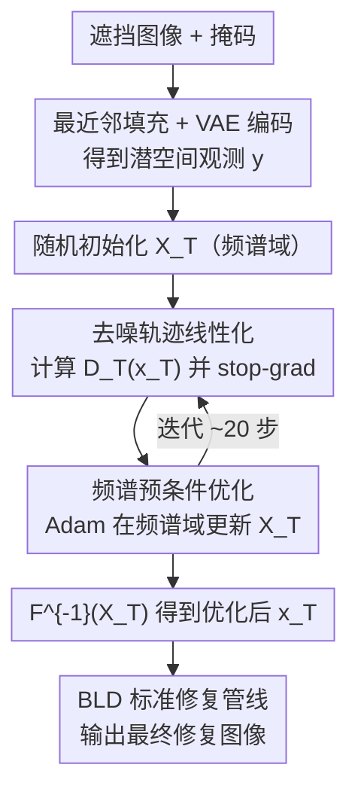

# SONIC: Spectral Optimization of Noise for Inpainting with Consistency

**会议**: ECCV 2026  
**arXiv**: [2511.19985](https://arxiv.org/abs/2511.19985)  
**代码**: [https://ubc-vision.github.io/sonic/](https://ubc-vision.github.io/sonic/) (项目页)  
**领域**: 扩散模型 / 图像生成  
**关键词**: 图像修复, 初始噪声优化, 频谱预条件, 免训练, 线性近似

## 一句话总结
SONIC 提出一种免训练的扩散模型图像修复方法，核心思想是优化初始噪声样本使其经过去噪后能忠实重建未遮挡区域，通过去噪轨迹线性化绕过昂贵的反向传播，并在频谱域中用 Adam 做预条件优化以实现稳定收敛，在三个标准修复数据集上全面超越现有方法（包括需要专门训练的 BrushNet）。

## 研究背景与动机
扩散模型和流模型已成为图像修复等逆问题的主流方案。现有方法分两派：训练专用修复模型（如 BrushNet）效果好但成本高、泛化受限；免训练方法（如 BLD、FLAIR、FlowChef）利用预训练模型的引导或后验采样，灵活但效果明显不如专用模型——修复结果常与原始图像结构不一致。

核心矛盾在于：初始噪声样本对最终生成的结构有决定性影响（已有工作证实，不同初始噪声会导出完全不同的场景布局和修复结果），但优化初始噪声需要反向传播穿过整个 T 步去噪链——这对 SD3.5 等现代大模型在计算和内存上均不可行（RTX 5090 上反向传播超过一步就会 OOM）。现有工作要么干脆忽略初始噪声的优化，要么用精心调参或额外网络来绕开，缺乏一个既实用又稳定的方案。

本文的核心 idea：通过线性化去噪轨迹使初始噪声可优化（无需反向传播穿过去噪器），配合频谱域预条件保证优化稳定，两者结合首次让"优化初始噪声做修复"在实践中可行且效果超越专用模型。

## 方法详解

### 整体框架
SONIC 的目标是在不改动去噪过程本身的前提下，找到一个最优初始噪声 x_T^*，使其经 T 步去噪 D_T(·) 后，在未遮挡区域与观测图像 y 一致。整个流程分三步：(1) 将遮挡图像用最近邻填充后经 VAE 编码到潜空间作为观测 y；(2) 在频谱域中优化初始噪声 X_T（x_T 的傅里叶变换），使用线性化损失和 Adam 优化器迭代约 20 步；(3) 将优化后的 x_T = F^{-1}(X_T) 作为初始噪声，送入标准免训练修复管线（如 BLD-SD3.5）完成修复。

### 关键设计

**1. 去噪轨迹线性化：绕过反向传播的实用优化**

优化初始噪声的朴素做法是对式 (1) 的损失 L = ||y - A D_T(x_T)||^2 做梯度下降，但这要求反向传播穿过整个 T 步去噪链——对 SD3.5 这种大模型，即使一步都不可行。本文的关键洞察是现代流模型（如 SD3.5 所用的 Rectified Flow）训练目标本就是让去噪轨迹尽可能线性。因此可以将整条轨迹近似为从 x_T 到 D_T(x_T) 的直线：

$$\hat{x}(t) = [\mathcal{D}_T(x_T) - x_T]_{\text{sg}} \cdot (1 - \frac{t}{T}) + x_T$$

其中 [·]_{sg} 是 stop-gradient 算子，意味着将 D_T(x_T) - x_T 视为常数。代入 t=0 得到最终输出的近似 x̂(0) = [D_T(x_T) - x_T]_{sg} + x_T，损失函数变为：

$$\mathcal{L}_{\text{linear}} = \| y - A([\mathcal{D}_T(x_T) - x_T]_{\text{sg}} + x_T) \|_2^2$$

由于 stop-gradient 切断了通过 D_T 的梯度流，该损失对 x_T 可微却无需反向传播穿过去噪器——本质上相当于丢掉雅可比矩阵的 Straight-Through Estimator。论文补充材料通过可视化 SD3.5 各时间步预测速度与平均速度的余弦相似度，验证了轨迹在绝大多数时间步确实接近线性（仅最后几步噪声接近零时略有偏离），为这一近似的合理性提供了实证支撑。

**2. 频谱域预条件优化：让每个频率以自己的步调收敛**

直接在空间域用式 (3) 优化会观察到区域不稳定性——去噪结果在迭代间闪烁，不同空间频率以不同速度收敛。这是因为潜空间梯度的频谱高度不均衡：低频分量梯度方差大，高频分量方差小。在空间域用一个全局学习率无法兼顾。受近期工作中"不同频率在引导时需要不同强度"的启发，本文将优化移至频谱（傅里叶）域：令 x_T = F^{-1}(X_T)，优化复频谱表示 X_T 而非 x_T。关键是用 Adam 优化器——它在频谱域中会对每个频率分量独立计算二阶矩并做逐元素除法，天然实现"每个频率自适应学习率"的预条件效果：

$$\mathcal{L}_{\text{spectral}} = \| y - A([\mathcal{D}_T(x_T) - \mathcal{F}^{-1}(X_T)]_{\text{sg}} + \mathcal{F}^{-1}(X_T)) \|_2^2$$

这里有一个重要理论保证：傅里叶变换是酉变换，对 SGD 而言空间域和频谱域数学等价（Δx = -ηg 在两边给出相同的有效更新）。但 Adam 中的 sign(·) 非线性不与 DFT 矩阵交换（F^{-1}·sgn(F·g) ≠ c·sgn(g)），因此频谱域 Adam 走出了一条空间域 Adam 永远无法通过调大学习率复现的独特优化轨迹。补充材料中的理论分析进一步指出，频谱域的单次更新对应空间域中一个全局密集的相关更新——单步即可传播全局结构信息，这解释了为什么仅 20 步优化就足够。

**3. 空间约束：防止优化偏离噪声流形**

频谱域优化虽然稳定，但还有一个陷阱：傅里叶基函数是全局的，单个频率分量的更新会影响所有空间位置的像素。对于被遮挡区域——没有观测数据约束的像素——其潜变量可能逐渐偏离 N(0,1) 高斯分布，而去噪模型正是期望初始噪声服从这一分布。偏离后去噪结果会出现明显的颜色偏移、伪影和遮挡边界痕迹。

解决方法简单而有效：对梯度更新做空间掩码，只允许未遮挡（观测到的）像素区域的梯度回传，冻结遮挡区域的潜变量（它们本身已经服从 N(0,1)，无需修改）。这将优化约束在"可接受的初始噪声流形"内。实验显示，去掉这一约束后 FID 从 12.88 骤升至 33.27（FFHQ），定性结果出现严重的边界伪影和颜色失真。

### 一个完整示例
以 FFHQ 人脸修复为例走一遍流程。输入是一张 1024x1024 的人脸照片，左侧约一半被矩形掩码遮挡。首先对被遮挡区域做最近邻颜色填充（掩码边界像素的颜色直接复制到内部），整张图经 SD3.5 的 VAE 编码到潜空间，得到观测 y。然后从 N(0,1) 随机初始化 x_T，对其做傅里叶变换得到 X_T 作为可优化参数。进入迭代：每轮将 X_T 逆变换回 x_T，跑一次完整 T=20 步去噪得到 D_T(x_T)，用式 (4) 计算只作用于未遮挡区域的 MSE 损失，Adam（lr=3.0）在频谱域更新 X_T。迭代 5 步时，去噪结果已初现人脸轮廓；10 步时五官和光照大致对齐；20 步时未遮挡区域几乎完美重建。最后将优化好的 x_T 送入 BLD-SD3.5，在去噪过程中用标准 latent blending 完成遮挡区域的修复——由于初始噪声已锁定了全局结构，修复结果与未遮挡区域的光照、色调和几何结构高度一致。

### 损失函数 / 训练策略
最终优化目标为式 (4) 的 L_spectral，本质是一个加权的 MSE：只在未遮挡像素上计算去噪输出与观测之间的 L2 距离。优化器为 Adam（β1=0.9, β2=0.999），学习率 3.0（远高于空间域 Adam 的 0.05，频谱预条件允许更大学习率）。去噪步数 T=20，分类器自由引导 scale=2.0（与 FLAIR 一致）。所有操作在 1024x1024 分辨率下进行，匹配 SD3.5 的期望输入尺寸。优化完成后，将 x_T 送入 BLD-SD3.5 做最终修复，该阶段不修改去噪过程本身。整个流程无需训练、无需微调、无需精心调节学习率，单张图约需 67 秒（RTX 5090）。

## 实验关键数据

### 主实验
在 FFHQ（1000 张人脸 + 大矩形掩码）、DIV2K（800 张自然图像 + 6 个随机矩形掩码）、BrushBench（600 张 + 人工标注分割掩码）三个数据集上评估。下表摘取最具代表性的三个指标（SSIM/LPIPS/FID），完整 8 指标数据见原文。

| 数据集 | 方法 | SSIM↑ | LPIPS↓ | FID↓ |
|--------|------|-------|--------|------|
| FFHQ | BLD-SD3.5 | 0.824 | 0.180 | 25.84 |
| FFHQ | FLAIR (400 NFE) | 0.829 | 0.292 | 19.87 |
| FFHQ | BrushNet | 0.759 | 0.237 | 17.95 |
| FFHQ | **SONIC (本文)** | **0.857** | **0.121** | **12.88** |
| DIV2K | BLD-SD3.5 | 0.789 | 0.144 | 25.33 |
| DIV2K | FLAIR (400 NFE) | 0.768 | 0.294 | 22.15 |
| DIV2K | BrushNet | 0.575 | 0.308 | 29.00 |
| DIV2K | **SONIC (本文)** | **0.803** | **0.115** | **17.70** |
| BrushBench | BLD-SD3.5 | 0.854 | 0.169 | 51.66 |
| BrushBench | FLAIR (400 NFE) | 0.855 | 0.190 | 51.54 |
| BrushBench | BrushNet | 0.740 | 0.199 | 50.08 |
| BrushBench | **SONIC (本文)** | **0.861** | **0.153** | **48.07** |

SONIC 在三个数据集的 SSIM、LPIPS、FID 上均取得最优。FID 优势尤其显著：FFHQ 上 12.88（第二名 BrushNet 17.95），DIV2K 上 17.70（第二名 FLAIR 22.15）。PSNR 和 CLIP Score 上 SONIC 并非总是最高，但论文指出 PSNR 在修复任务中不是可靠指标（模糊补丁反而得高分），CLIP Score 只衡量与文本提示的语义对齐而不考虑与未遮挡区域的结构一致性。人类偏好评分（HPS v2、IR）上 SONIC 同样领先或接近最优。

用户研究：37 人单盲 2AFC 测试（1665 组对比），SONIC 综合胜率 90.0%（95% CI [88.4, 91.4]），对 BLD-SD3.5 胜率 94.0%，对 FLAIR 胜率 80.5%，对 BrushNet 胜率 79.9%，所有对比均统计显著。

### 消融实验
在 FFHQ 上对三个核心设计做消融，结果如下。

| 变体 | SSIM↑ | LPIPS↓ | FID↓ | IR↑ |
|------|-------|--------|------|-----|
| 完整 SONIC | 0.857 | 0.121 | 12.88 | 0.280 |
| w/o 频谱预条件（空间域 Adam, lr=0.05） | 0.853 | 0.127 | 14.58 | 0.216 |
| w/o 空间约束（不冻结遮挡区域梯度） | 0.833 | 0.165 | 33.27 | -0.259 |
| 用 GT 原图替换最近邻填充（理论上界） | 0.856 | 0.121 | 12.77 | 0.280 |

三个结论：(1) 去掉空间约束是最致命的——FID 从 12.88 暴增至 33.27，IR 甚至转负，验证了保持噪声在有效流形内的重要性；(2) 去掉频谱预条件虽然指标下降幅度不如空间约束剧烈，但 IR 从 0.280 降至 0.216，反映人类感知质量受损——这也呼应了论文中"频谱预条件不开启时修复结果不稳定、可能直接失败"的定性观察；(3) 用 GT 原图替换最近邻填充几乎不带来额外收益（FID 12.77 vs 12.88），说明简单的最近邻填充已经足够，SONIC 的鲁棒性使得无需复杂的潜空间填充策略。

优化迭代次数消融（FFHQ）：10 轮（200 NFE）FID 12.78，20 轮（400 NFE）FID 12.88，30 轮（600 NFE）FID 12.84——20 轮后收益递减，论文选择 20 轮作为性价比最优。

### 关键发现
- **空间约束是性能基石**：去掉后 FID 恶化近 3 倍，远大于其他消融，说明"让优化后的噪声看起来还像噪声"比"怎么优化它"更根本。
- **频谱预条件的最大价值在稳定性而非峰值指标**：虽然 SSIM/LPIPS/FID 的绝对差距不大，但空间域 Adam 需要精心调学习率（0.05 vs 频谱域的 3.0），且在某些样本上会出现灾难性失败——修复结果完全崩溃，而频谱域优化对所有样本稳定。
- **SONIC 对非流模型同样有效**：补充材料中在 SD1.5 和 SDXL（扩散模型，非流模型，轨迹并非严格线性）上测试，SONIC 优化的初始噪声仍显著优于随机噪声，生成质量明显提升——说明线性近似虽基于流模型假设，但在实践中对扩散模型也泛化良好。
- **最近邻填充的鲁棒性令人惊讶**：这看似粗糙的策略与使用 GT 原图编码的性能几乎一致，意味着 SONIC 的损失函数对 VAE 编码阶段的误差不敏感，是一个实用价值很高的工程发现。

## 亮点与洞察
- **"优化初始噪声而非修改去噪过程"这条路线在扩散模型时代被普遍认为不可行，本文用两个简单但非平凡的技巧让它重新成立**。线性化是"工程上足够好"的近似（有轨迹线性度实证 + 流模型理论保证），频谱预条件是"数学上非平凡"的改进（得益于 Adam 的非线性与 DFT 不可交换），二者组合产生了 1+1>2 的效果。
- **频谱域优化的理论分析值得注意**：补充材料中证明了频谱 Adam 在有限步数内走出空间 Adam 永远无法复现的轨迹——因为 sign(·) 非线性与傅里叶基不交换，单步频谱更新等价于空间域全局密集更新，这在 20 步这种极短优化窗口中至关重要。
- **最近邻潜空间填充是一个可复用的工程技巧**：任何需要在潜空间做逆问题优化的方法都可能受益——与其设计复杂的编码策略处理遮挡/缺失，不如简单填充后依赖后续优化的鲁棒性。这个设计哲学（"后端优化足够强，前端可以糙"）可迁移到其他逆问题任务（超分、去模糊等）。

## 局限与展望
- 作者承认的局限：目前仅在图像修复任务上验证，线性化和频谱预条件理论上可推广到超分辨率、去模糊、视频修复等其他逆问题，但尚未实验证明。
- 计算开销仍不低：单张图约 67 秒（RTX 5090），虽然与同 NFE 的 FLAIR 相当，但远比 BLD（4 秒）和 BrushNet（5 秒）慢。对于实时/交互式应用场景不可用。
- 对掩码面积敏感性的分析缺失：论文没有系统研究不同掩码比例下 SONIC 的性能变化——当掩码面积很大（如遮挡 90%）时，未遮挡区域提供的观测信息极少，线性化损失可能信号不足。
- 线性近似的理论误差界未给出：虽然实证上足够好，但没有分析线性近似在原问题 (1) 上引入的系统偏差有多大、在什么条件下会失效。
- 具体改进思路：(1) 将频谱预条件与更高效的去噪调度结合（如 DPM-Solver 等快速采样器），减少 NFE 需求；(2) 将线性化/频谱优化推广到视频修复——补充材料中已有 Wan 视频模型的初步结果；(3) 探索是否可以用少量样本微调一个"初始噪声提议网络"，替代迭代优化以加速推理。

## 相关工作与启发
- **vs FLAIR**: FLAIR 用变分后验采样同时更新初始噪声和最终估计，是训练免费方法中最强的基线。但 FLAIR 的初始噪声优化是隐式的、嵌在后验采样公式里，没有单独对初始噪声做针对性优化，导致修复结果仍可能出现结构不一致（如 DIV2K 上的模糊补丁）。SONIC 显式地以"让去噪输出匹配未遮挡区域"为目标优化初始噪声，结构一致性显著更好。
- **vs 直接 Jacobian 丢弃的并行工作 (FlowOpt)**: 并行工作 FlowOpt 也丢弃了向量-雅可比积达到类似式 (3) 的损失，但缺少频谱预条件，优化极不稳定——需要从另一个反演方法初始化的噪声出发，且要精心调学习率。SONIC 的频谱预条件恰好解决了这个问题，使得优化可以从随机噪声直接开始，无需任何初始化技巧。
- **vs BrushNet**: BrushNet 是经典训练派方法的代表，通过将掩码图像特征与噪声潜变量分离来简化修复任务的学习。优势是推理快、无接缝，但劣势是对训练时未见过的掩码形状泛化差（DIV2K 横向条纹掩码下退化为"看图说话"式的填空）。SONIC 揭示了"训练专用模型"并非修复性能的唯一出路——做好初始噪声优化的免训练方法可以在关键指标上全面超越。

## 评分
- 新颖性: ⭐⭐⭐⭐☆ 将"优化初始噪声做修复"这条在扩散模型时代被认为不切实际的路线重新走通，线性化+频谱预条件的组合在工程和理论上都有新意，但单个技术（Straight-Through Estimator、频谱域优化）本身并非首创。
- 实验充分度: ⭐⭐⭐⭐⭐ 三个标准数据集 + 五类基线 + 八项指标 + 消融 + 用户研究 + 补充材料中包含对非流模型、视频模型、额外噪声优化基线的实验，覆盖面广且结论自洽。
- 写作质量: ⭐⭐⭐⭐☆ 方法和实验描述清晰，公式推导完整，补充材料中对线性化假设的实证验证和频谱优化的理论分析很加分。略有不足是 PSNR/CLIP 指标不如 baseline 时的辩解略显啰嗦。
- 价值: ⭐⭐⭐⭐☆ 为免训练扩散模型修复提供了一个新范式——专注于输入端的初始噪声优化而非输出端的去噪过程修改。这种"输入端优化"的思路可以迁移到其他生成式逆问题任务，有潜在的广泛影响力。

<!-- RELATED:START -->

## 相关论文

- [\[ECCV 2026\] Curvature-Adaptive Consistency Flow Matching: Autonomous Trajectory Optimization via Reinforcement Learning](curvature-adaptive_consistency_flow_matching_autonomous_trajectory_optimization_.md)
- [\[ICLR 2026\] Diverse Text-to-Image Generation via Contrastive Noise Optimization](../../ICLR2026/image_generation/diverse_text-to-image_generation_via_contrastive_noise_optimization.md)
- [\[ECCV 2026\] Dual-End Consistency Model](dual-end_consistency_model.md)
- [\[ICML 2026\] Offline Preference Optimization for Rectified Flow with Noise-Tracked Pairs](../../ICML2026/image_generation/offline_preference_optimization_for_rectified_flow_with_noise-tracked_pairs.md)
- [\[CVPR 2026\] From Inpainting to Layer Decomposition: Repurposing Generative Inpainting Models for Image Layer Decomposition](../../CVPR2026/image_generation/from_inpainting_to_layer_decomposition_repurposing_generative_inpainting_models_.md)

<!-- RELATED:END -->
