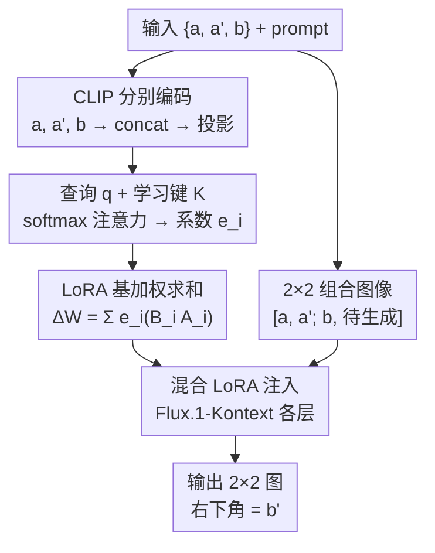

# Spanning the Visual Analogy Space with a Weight Basis of LoRAs

**会议**: ECCV 2026  
**arXiv**: [2602.15727](https://arxiv.org/abs/2602.15727)  
**代码**: 有（见项目主页）  
**领域**: 扩散模型  
**关键词**: 视觉类比, LoRA基分解, 图像编辑, 动态路由, 流匹配

## 一句话总结
LoRWeB 用一组可学习的 LoRA 基（basis）替代单 LoRA 做视觉类比编辑：一个轻量 CLIP 编码器根据输入类比样本对动态计算 attention 权重，将 N 个基 LoRA 加权组合成任务专属的混合 LoRA 注入 Flux.1-Kontext，在推理仅比单 LoRA 慢 3% 的前提下实现了对未见变换类型的显著泛化提升。

## 研究背景与动机
视觉类比学习（visual analogy learning）的核心任务是给定三元组 {a, a', b}，生成 b' 使得视觉关系 a:a'::b:b' 成立——即把 a 到 a' 的变换类似地施加到 b 上。这种方式让用户通过示例而非文字来指定复杂变换（如特定风格迁移、精确姿态复制、特定装饰品添加），弥补了文本编辑难以精确描述视觉细节的天然缺陷。

近年来主流做法是将预训练文生图模型（Flux.1-Kontext）通过单个 LoRA 适配到类比任务上：把 {a, a', b} 拼成 2x2 网格作为条件输入，用流匹配损失训练一个固定 LoRA。典型方法包括 RelationAdapter、PairEdit 等。虽然有效，但这些方法存在一个根本性限制：**所有可能的视觉变换——风格迁移、物体增减、姿态变换、背景替换——全部被压缩进同一个 LoRA 模块**。这个单一瓶颈严重限制了模型对训练时未见过的新变换类型的泛化能力。

核心矛盾在于：视觉变换空间天然多样且高维，但现有方案用一个静态参数点去覆盖整个空间。受 Dravid 等人启发——他们发现人脸个性化任务中独立训练的 LoRA 可以张成一个可插值的语义权重空间——本文探索将类似思想用于视觉类比。但 Dravid 等人的方案需要训练 65,000 个独立 LoRA 再加 PCA 降维和每个测试样本的单独优化，在类比任务上既不现实也不高效。

核心 idea：**端到端联合训练一个 LoRA 基（basis）和一个轻量编码器，编码器根据输入类比对动态预测基的线性组合系数，在单次前向传播中生成当前任务专属的混合 LoRA**——既不需要每个测试样本单独优化，也不需要一个 LoRA 覆盖所有变换。

## 方法详解

### 整体框架
LoRWeB 的核心是用「LoRA 基 + 动态路由」替代单一固定 LoRA。整个 pipeline 分两条并行的条件路径，共同服务于 Flux.1-Kontext 流匹配模型：

**LoRA 选择路径（高层语义）**：将 a、a'、b 分别通过冻结的 CLIP ViT 独立编码，拼接三个 [CLS] 表征后经一个可学习的单层全连接投影得到查询向量 q ∈ R^d。q 与 N 个可学习的 key 向量 k_i 做 scaled dot-product attention，得到 N 个系数 e_i = softmax(q·K^T / √d)_i。N 个基 LoRA（每个 rank r，含 A_i ∈ R^{r×n}、B_i ∈ R^{m×r}）按系数加权求和：ΔW = Σ e_i (B_i A_i)，得到「混合 LoRA」。

**图像条件路径（细粒度视觉）**：将 {a, a', b} 拼成 2x2 组合图像（a 左上、a' 右上、b 左下、右下角待生成），直接通过 Flux.1-Kontext 的 extended attention 机制注入全分辨率视觉细节。

两条路径互补：CLIP 路径提供「这是什么变换」的语义理解来选择 LoRA，extended attention 路径提供「变换细节长什么样」的像素级视觉信息。混合 LoRA 注入 Flux.1-Kontext 的各目标权重矩阵，文本 prompt 通过 T5 编码器输入，模型最终输出右下角为 b' 的 2x2 组合图像。

### 关键设计

**1. 联合训练的 LoRA 基：让模型自己学会可组合的变换原语**

单 LoRA 方案等价于在整个 LoRA 空间中固定一个点，泛化能力受限于这个点附近的区域。Dravid 等人的方案虽然引入了「基」的概念，但分两阶段：先独立训练海量 LoRA（65,000 个），再用 PCA 提取基，最后对每个测试样本优化组合系数——整个过程计算代价极高，且独立训练再 PCA 得到的基未必适合插值。

LoRWeB 改为**端到端联合训练**：N 个基 LoRA（每个含 A_i、B_i 矩阵和对应的可学习 key 向量 k_i）与投影层 P 一起用流匹配损失从头训练。梯度直接优化基的权重和路由参数，迫使模型将变换空间分解为一组天然适合线性组合的「变换原语」。注意单 LoRA 是 LoRWeB 的特例：当路由退化为常数输出时，混合 LoRA 等价于一个 rank = N×r 的静态 LoRA（如 N=32, r=4 等价 r=128），但 LoRWeB 的输入依赖性大幅增加了表示能力——它不再是一个点，而是整个基张成的 N×r 维子空间中的任意点。

**2. 基于注意力的动态路由：用查询-键匹配做软选择**

给定输入三元组 {a, a', b}，如何决定应该激活哪些变换原语？LoRWeB 采用查询-键注意力机制：

- 编码器 ε（冻结 CLIP ViT-L/14）分别编码 a、a'、b → 拼接 [ε(a), ε(a'), ε(b)] → 单层 FC 投影得到查询 q = P([ε(a), ε(a'), ε(b)])
- N 个可学习 key 向量排列成矩阵 K ∈ R^{d×N}（d=128）
- 系数 e_i = softmax(q·K^T / √d)_i

这个设计的巧妙之处：**key 和 LoRA 基联合训练**，key 学会代表「这个基 LoRA 擅长处理什么类型的变换」，而查询 q 学会从输入样本中提取「这里需要什么类型的变换」。softmax 的 [0,1] 约束确保混合 LoRA 的范数不会爆炸——消融实验中用 Tanh 替换 softmax 后编辑准确性从 5.94 骤降到 4.49，推测是 Tanh 的 [-1,1] 范围允许负系数导致混合 LoRA 范数失控、权重偏离预训练分布。

**3. 逐图分编码而非网格编码：保护细节 + 显式分离角色**

一个直觉做法是把 2x2 组合图直接喂给 CLIP。但 CLIP 强制 resize 到 224×224，每个象限只能分到约 112×112 像素，严重损失纹理和形状细节。更关键的是，网格编码让 CLIP 难以区分哪个区域对应 a、哪个是 a'、哪个是 b，削弱了对类比结构（谁对谁做变换、谁不变）的推理能力。

LoRWeB 改为分别编码三张图再拼接表征——保留了每张图在 224×224 下的完整分辨率，同时通过拼接顺序 a→a'→b 显式编码了三张图的不同角色。消融实验证实，换成 2x2 网格作为 CLIP 输入后，编辑准确性指标（VLM Acc）从 5.94 降到 5.75，Pairwise VLM vs RelationAdapter 从 58.5% 降到 53.9%。

**4. CLIP 选 LoRA + Extended Attention 传细节：语义-细节双路径分工**

这是一个关键的架构决策：**CLIP 只用于 LoRA 选择，不负责传递视觉细节**。CLIP 的 224×224 输入和全局池化天然适合高层语义理解（「这是什么类型的变换」）但会丢失精确的纹理、形状、位置信息。这些视觉细节由 Flux.1-Kontext 自带的 extended attention 机制承载——它将全分辨率的 2x2 组合图直接注入扩散模型各层，模型可以从像素级精确复制参考图的纹理和结构。

这种分工在消融中得到间接验证：使用 SigLIP2 替换 CLIP 对性能影响不大（Acc 5.82 vs 5.94），说明路由对不同视觉编码器鲁棒；但 2x2 网格编码导致 Acc 下降，说明输入布局很重要——因为它决定了哪些信息能进入 LoRA 选择路径。两个 prompt 敏感性实验也支持这一分工：减少 prompt 细节后，LoRWeB 仍然比基线好（vs EditTransfer 70.4%、vs VisualCloze 66.8%、vs RelationAdapter 59.4%），证明模型确实从类比图像中学到了变换，而非仅仅依赖文本。

### 损失函数 / 训练策略

使用标准 rectified flow-matching 损失，目标是从噪声恢复目标图像的 velocity field：

$$L = \mathbb{E}_{t \sim p(t), \mathbf{x}_0, \mathbf{x}_1, \mathbf{y}, c} \left[ \| v_\theta(\mathbf{z}_t, t, \mathbf{y}, c) - (\mathbf{x}_1 - \mathbf{x}_0) \|_2^2 \right]$$

其中 y 是 2x2 组合条件图像 [a, a'; b, b]，c 是文本 prompt，z_t = (1-t)x_0 + t x_1。所有可训练参数（N 个基 LoRA 的 {A_i, B_i}、N 个 key 向量 k_i、投影层 P）通过该损失端到端联合优化。训练 10K 步，1 张 H100 GPU，8-bit AdamW（lr=1e-3, β1=0.9, β2=0.99, weight decay=0.05），bfloat16 混合精度，梯度检查点，batch size 6（r=16/N=32 大容量配置用 batch size 4）。训练时最大分辨率 512×512，沿长边 resize。

## 实验关键数据

### 主实验

**设置**：训练数据 Relation252k（16K 类比图像对，208 种任务）；评估集为自定义扩展集 540 个三元组（90 种未见任务 + 3 个概念类别：动物/物体/人物）+ Relation252k 未见测试集，共 100 种任务 840 个三元组。基 LoRA 配置 N=32, r=4, d=128。CLIP ViT-L/14 作为编码器。基线包括单 LoRA (r=128)、RelationAdapter、VisualCloze、EditTransfer、DIA、PairEdit。评估指标含 VLM 一致性评分（Preservation）、VLM 编辑准确性评分（Edit Accuracy）、LPIPS、CLIP 方向相似度、Pairwise VLM 胜率、人类偏好用户调研（33 人/45 组）。

| 方法 | Pres. VLM ↑ | Acc. VLM ↑ | LPIPS ↓ | CLIP Dir. ↑ | 用户偏好 (vs LoRWeB) |
|------|------------|-----------|---------|------------|---------------------|
| **LoRWeB (r=4, N=32)** | **7.87** | **5.94** | 0.31 | 0.21 | — |
| LoRA r=128 (单LoRA同容量) | 7.99 | 5.70 | 0.27 | 0.20 | LoRWeB 胜 |
| RelationAdapter | 7.01 | 5.93 | 0.43 | 0.22 | LoRWeB 胜 |
| VisualCloze | 5.24 | 4.93 | 0.53 | 0.21 | LoRWeB 胜 |
| EditTransfer | 7.38 | 4.79 | 0.31 | 0.04 | LoRWeB 胜 |
| DIA (SD1.4, 每样本优化) | 3.56 | 3.44 | 0.59 | 0.12 | 86.5% Pairwise 胜 |
| DIA-Kontext (Flux适配版) | 4.78 | 3.56 | 0.63 | 0.17 | 68.6% Pairwise 胜 |
| PairEdit s=0.6 (每样本3LoRA) | 6.68 | 4.55 | 0.24 | 0.11 | 75.6% Pairwise 胜 |

LoRWeB 在编辑准确性和内容保留之间推进了 Pareto 前沿：Acc 超过所有基线（含同容量单 LoRA），Pres 仅次于单 LoRA（差距仅 0.12），综合表现最优。定性比较中，RelationAdapter 和 VisualCloze 常丢失主体身份（如猫变形），EditTransfer 对变换细节还原不准确（如皇冠样式），LoRWeB 则同时保持了主体一致性和变换精确性。推理速度仅 33.4 秒/张 vs 单 LoRA 32.4 秒（+3.1%），且重算混合 LoRA 的逻辑可以缓存进一步加速。

### 消融实验

| 配置 | Pres. VLM ↑ | Acc. VLM ↑ | LPIPS ↓ | Pairwise vs RA (%) | 关键发现 |
|------|------------|-----------|---------|--------------------|---------|
| LoRWeB full (r=4, N=32) | 7.87 | 5.94 | 0.31 | 58.5 | 完整模型基线 |
| r=16 (大rank，同基) | 8.13 | 4.92 | 0.20 | 49.6 | Acc 骤降 1.02，大 rank 反而过拟合 |
| r=16, N=8 (同参数量缩基) | 7.82 | 5.49 | 0.29 | 56.7 | Acc 降 0.45，基尺寸对泛化至关关键 |
| r=4, N=16 (半基) | 7.74 | 5.95 | 0.31 | 56.6 | 基缩小导致 Pres 下降 |
| r=4, N=64 (双倍基) | 7.80 | 5.48 | 0.27 | 52.6 | 盲目加参数不保证提升，过拟合 |
| Tanh 替代 softmax | 7.94 | 4.49 | 0.18 | 42.1 | 大幅退化，负系数致 LoRA 范数失控 |
| 2×2 网格 CLIP 输入 | 7.90 | 5.75 | 0.28 | 53.9 | 编辑准确性下降，细节和角色区分丢失 |
| SigLIP2 替换 CLIP | 7.83 | 5.82 | 0.31 | 55.5 | 路由对编码器选择较鲁棒 |
| LoRA r=256 (单LoRA更大) | 7.88 | 5.48 | 0.26 | — | 大容量单 LoRA 仍不如 LoRWeB |

### 关键发现
- **基的大小比参数总量更关键**：r=4, N=32 的 LoRWeB 在 Acc 上超过 r=128 单 LoRA（5.94 vs 5.70），说明可组合性比总参数量重要；同参数量下 N=32/r=4 优于 N=8/r=16（Acc 5.94 vs 5.49）
- **softmax 归一化不可替换**：Tanh 在 Acc 上掉 1.45 分，Pairwise vs RA 从 58.5% 跌到 42.1%，是消融中影响最大的单一因素——验证了 [0,1] 约束对保持 LoRA 范数稳定的关键作用
- **逐图分开编码优于网格编码**：Acc 从 5.94 降到 5.75，虽不剧烈但一致性显著，说明这是一个「细节型」设计选择而非「颠覆型」
- **prompt 和类比图像双重依赖**：减少 prompt 细节后，LoRWeB 的 Pairwise VLM 胜率 vs EditTransfer 为 70.4%、vs VisualCloze 为 66.8%、vs RelationAdapter 为 59.4%，证明模型确实从类比图像而非仅从文本中提取变换信息
- **对非 Flux 生成图不敏感**：用 Imagic 编辑的 TEdBench 图作为参考对，LoRWeB 仍正常工作，排除对 Flux 生成图的分布偏见

## 亮点与洞察
- **LoRA 基分解是通用且低成本的泛化增强策略**：把单 LoRA 拆成可组合的基 + 动态路由，几乎不增加推理成本（+3.1%），却让模型能处理训练时未见过的变换类型。这个思路可以直接搬到任何用 LoRA 做任务适配的场景——个性化生成、风格迁移、多任务学习——只需把「学一个 LoRA」替换为「学一组基+路由」
- **查询-键注意力做路由兼顾可微和可解释**：key 向量学到的是「这个基擅长什么变换类型」的隐式编码，softmax 组合天然可微。这比 Dravid 等人的 PCA+后验优化方案优雅得多——联合训练让基和路由互相适应，而不是分阶段各自为政
- **CLIP 做路由 + extended attention 做细节的职责分离**：CLIP 的 224×224 分辨率瓶颈不再拖累生成质量，因为视觉细节走了另一条不需要压缩的路径。这个「不同信息走不同路径」的设计思路在扩散模型条件注入中具有普遍适用性
- **误对齐 prompt 和类比图时产生有趣的混合编辑**：模型有时会同时应用 prompt 描述的变换和类比图暗示的变换，产生创意性的组合效果——这虽是「非预期行为」，但暗示了未来可以显式建模多源条件的解耦和加权控制

## 局限与展望
- **训练分布外任务泛化仍然有限**：如立体主义风格（Cubist）这类训练集中完全没有的风格变换，所有方法（含 LoRWeB）均失败。基的覆盖范围受训练数据多样性的硬约束
- **假设 a 和 a' 除目标变换外完全相同**：这在现实中很难满足。LoRWeB 对非完全相同参考对有一定容忍度（附录展示），但如果参考图背景或主体身份差异过大（如换了一只不同的狗），输出会出现身份丢失和背景失真
- **CLIP 224×224 分辨率限制了对微小变化的感知**：「闭眼」这种小幅度变化 CLIP 下采样后几乎不可见，导致路由无法正确激活相关基。升级到更高分辨率的编码器（如 SigLIP2 的高分辨率变体）可能缓解
- **多组件变换可能只被部分应用**：「黑项圈 + 大铃铛」这种双组件变换，模型有时只加铃铛漏了项圈——说明线性基组合可能难以捕捉需要「合取」（AND）关系的复合变换
- **未来方向**：(1) 将 LoRWeB 推广到其他需要泛化的 LoRA 任务（如个性化、风格迁移、机器人技能学习）；(2) 显式解耦变换的不同分量（如姿态 vs 背景），让用户交互式选择应用哪些分量；(3) 探索非 softmax 的激活函数（如 Differential Activation），在保持稳定性的同时提供更灵活的组合方式

## 相关工作与启发
- **vs RelationAdapter**：同样用 LoRA 做视觉类比适配，但 RelationAdapter 是单 LoRA 方案且在特征空间操作。LoRWeB 的 LoRA 基 + 动态组合在不增加推理成本的前提下显著提升了泛化——这是架构层面的根本差异，而非调参优化
- **vs VisualCloze / EditTransfer**：属于 in-context learning 路线，将类比样本作为上下文直接条件注入，但不使用专门的适配模块。在编辑准确性和内容保留的平衡上明显劣于 LoRWeB
- **vs DIA (Diffusion Image Analogies)**：每个样本需要反向传播通过整个扩散过程（SD1.4 上单样本 >10 分钟），且依赖 CLIP 嵌入空间使得难以迁移到新架构（如 Flux 不用 CLIP）。LoRWeB 无需任何测试时优化
- **vs PairEdit**：每个三元组训练 3 个独立 LoRA（语义/内容/反转），单样本 >25 分钟。LoRWeB 单次前向 33 秒，且编辑质量在所有指标上均优于 PairEdit
- **vs Dravid et al. (LoRA Weight Space)**：启发了基的思想，但他们需要 65,000 独立 LoRA + PCA + 每样本测试时优化，LoRWeB 的贡献在于将基和路由联合训练，使整个框架成为可端到端学习的单一系统
- **启发**：LoRA 基 + 动态路由的范式可以迁移到「从少量示例推断并执行操作」的任何场景——机器人技能学习（从两次演示推断动作映射）、视频编辑（从前后帧推断时域变换）、3D 编辑（从两个视角推断几何变换）等

## 评分
- 新颖性: ⭐⭐⭐⭐ 将 LoRA 权重基从分析工具升级为可端到端训练的架构组件，动态路由 + 联合训练的配方干净漂亮，虽不是全新的范式但组合方式确有新意
- 实验充分度: ⭐⭐⭐⭐⭐ 消融覆盖容量/激活函数/编码布局/编码器选择/VLM+人类双评估/prompt 敏感性/非对齐输入/非 Flux 图/失败案例，附录 30+ 页，几乎是 ECCV 顶配
- 写作质量: ⭐⭐⭐⭐ 逻辑清晰，图表丰富，method 部分的动机-方案-分析链条完整，附录详实但定性图偏多
- 价值: ⭐⭐⭐⭐ LoRA 基分解是低成本、高收益的泛化增强策略，可直接嵌入任何用 LoRA 做任务适配的扩散模型管线，实用性强；方法本身也为理解 LoRA 权重空间的结构提供了新的经验证据

<!-- RELATED:START -->

## 相关论文

- [\[ICLR 2026\] BAR: Refactor the Basis of Autoregressive Visual Generation](../../ICLR2026/image_generation/bar_refactor_the_basis_of_autoregressive_visual_generation.md)
- [\[ICML 2026\] DynaDiff: Generative Adaptation of Dynamics to Environmental Shifts via Weight-space Diffusion](../../ICML2026/image_generation/generative_adaptation_of_dynamics_to_environmental_shifts_via_weight-space_diffu.md)
- [\[ECCV 2026\] Learn Once, Edit Anywhere: Visual Direction Transfer for Diffusion Models](learn_once_edit_anywhere_visual_direction_transfer_for_diffusion_models.md)
- [\[ICLR 2026\] Exploring the Design Space of Transition Matching](../../ICLR2026/image_generation/exploring_the_design_space_of_transition_matching.md)
- [\[ECCV 2026\] MEPA: Multi-Scale Representation Alignment for Visual Autoregressive Modeling with Mixture of Experts](mepa_multi-scale_representation_alignment_for_visual_autoregressive_modeling_wit.md)

<!-- RELATED:END -->
