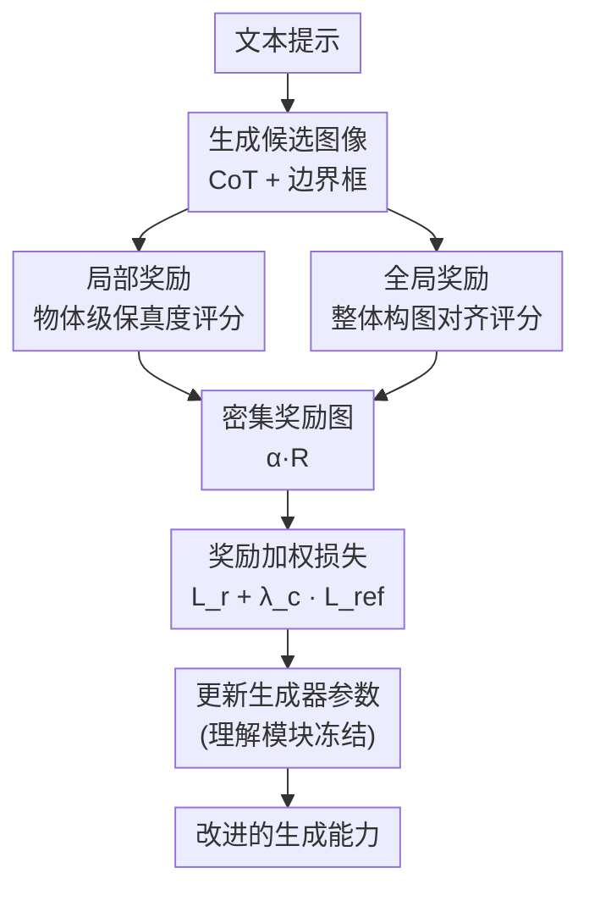

# SRUM: Fine-Grained Self-Rewarding for Unified Multimodal Models

**会议**: ECCV2026  
**arXiv**: [2510.12784](https://arxiv.org/abs/2510.12784)  
**代码**: 待确认  
**领域**: 图像生成  
**关键词**: 统一多模态模型, 自奖励, 文本到图像生成, 全局-局部奖励, 后训练对齐  

## 一句话总结
SRUM 提出一种自奖励后训练框架，让统一多模态模型（UMM）的理解模块扮演内部评估器，通过全局-局部双奖励系统为生成模块提供细粒度纠正信号，显著提升复杂文本到图像生成的质量。

## 研究背景与动机

统一多模态模型（UMM）试图在单一框架内融合视觉理解与视觉生成能力，近年涌现了 Janus、Show-O、Bagel、BLIP3o 等代表性架构。然而一个悖论始终困扰着这类模型：它们的理解能力与生成能力之间存在严重的不对称——同样的模型可以准确判断一段文本描述与图像是否匹配，却往往无法根据这段文本生成一幅忠实可信的图像。这种「能评判、不能做到」的差距在需要复杂空间关系、精确属性绑定、数量推理等精细推理的场景中尤为突出，本质上是 UMM 内部理解模块与生成模块的能力鸿沟。

现有缩小这一鸿沟的思路主要有三类：一是引入外部奖励模型或人工偏好数据做 RLHF/DPO，但构造高质量偏好对成本高昂且外部奖励模型本身有偏差；二是通过链式思维（CoT）或测时验证让模型在推理阶段做多轮修正，但这并不从根本上提升模型的原生生成能力；三是对不同任务手工设计规则级别的奖励，缺乏通用性。这些方法的共同瓶颈在于，它们都假设指导生成的信息必须来自模型之外，而忽略了 UMM 内部已经存在的「更强大的理解模块」本身就是一个天然评估器。

本文的关键洞见是：既然 UMM 的理解能力已经超越了它的生成能力，那为什么不让理解模块直接「教」生成模块？**核心 idea：将 UMM 自己的理解模块冻结作为内部评估器，为自生成图像候选打分产出一套全局-局部双奖励信号，再通过奖励加权的训练目标将评估信号反向传播到生成模块的参数中，形成无需外部数据或奖励模型的自我提升闭环。**

## 方法详解

### 整体框架

SRUM 是一个两阶段的离线后训练框架。第一阶段是自奖励数据生成（Self-Rewarding Data Generation）：模型利用自身的生成能力（搭配 CoT 思考模式）产出候选图像，同时借助外部分割模型（如 SAM，针对 Bagel）或原生定位能力（针对 BLIP3o）为图中的物体生成对应的边界框，再由 UMM 的理解模块对这些框做验证和区域匹配。第二阶段是奖励加权训练（Reward-Weighted Training）：将理解模块冻结，对每张候选图像做局部+全局双重评估，生成密集奖励图；然后用这个奖励信号加权训练生成模块（flow matching 的 velocity prediction），使生成器学会从奖励高的区域保留特征、从奖励低的区域调整输出。整个过程中理解模块不参与梯度更新，奖励数据在训练前一次性缓存好，因此是离线 pipeline，计算效率高。

### 关键设计

**1. 自数据生成管线：模型为自己造训练样本**

SRUM 的第一个设计是把训练数据的生产过程完全内化。模型从 T2I-CompBench 等已有的文本指令出发，先用它的「think mode」（一种 CoT 推理模式）生成语义更丰富的图像候选。然后，对于 Bagel 这类不自带细粒度定位能力的模型，借助外部 SAM 分割模型提出初步的物体边界框候选；对于 BLIP3o 这类有原生 grounding 能力的模型，则直接用自身的定位模块。关键一步是：无论框的来源是什么，最终都要由 UMM 的理解模块（冻结的评估器）亲自验证这些框是否正确、是否匹配提示词中的相关物体，并分配语义奖励分数。这样，外部组件（SAM）只是定位辅助工具而非奖励模型，整个评分过程的语义判断全部来自 UMM 自身，确保了自包含性。这种方法彻底消除了对外部图像数据集和人工标注的依赖。

**2. 全局-局部双奖励系统：多尺度自我评判**

这是 SRUM 的核心机制。它设计了两个互补的评估维度来克服单一整体评分的信息不足问题。局部评估（Local Judgment）为每个物体边界框内的区域独立打分，范围严格限定在 [-1.0, 1.0]；对于严重失真（如物体缺失或幻觉）通过非线性映射施加高惩罚（-0.9 到 -0.5），模拟人类视觉对明显缺陷的高敏感度。更重要的是，每次评分前强制输出一段「Reason」字段——以 CoT 形式给出可解释的打分理由——这不仅让评分过程更可靠，也间接迫使理解模块做更细致的判断。全局评估（Global Judgment）则关注整幅图的构图合理性、空间布局是否符合提示意图；对于本身没有精细构图要求的提示（如「一棵树的照片」），全局奖励会自动落入一个中性区间（-0.4 到 0.4），避免不公平的惩罚。

两个评估结果最终融合为一个密集奖励图：局部奖励构成区域级的热力图 $R \in [-1, 1]$，全局奖励缩放到 $[0, 1]$ 作为标量乘子 $\alpha$（避免两个负数相乘产生虚假正信号），乘积 $\alpha \cdot R$ 即为每个空间位置的训练权重。这套设计使得模型既不会因为局部缺陷被泛化惩罚整张图，也不会因为整体构图好就放过局部物体的错误。

**3. 奖励加权训练与参考约束：精确优化防过偏**

训练阶段的目标是将评估信号转化为生成模块的参数更新。SRUM 的损失函数由两项构成。第一项是奖励加权损失 $\mathcal{L}_r$，直接对 flow matching 框架中的 velocity prediction $\mathbf{v}_\theta$ 做加权 MSE：

$$\mathcal{L}_r = \mathbb{E}\left[\alpha \cdot R \odot \left(\mathbf{v}_\theta - (\epsilon - \mathbf{x}_0^{gt})\right)^2\right]$$

其中 $\odot$ 表示逐元素相乘。当 $\alpha \cdot R > 0$ 时（该区域生成质量好），损失鼓励模型保持当前预测；当 $\alpha \cdot R < 0$ 时（质量差），损失则推动模型改变预测方向。这个加权机制让优化信号精准作用于需要改进的空间区域，而非对整个图像统一施加修正。

第二项是参考约束项 $\mathcal{L}_{ref} = \mathbb{E}\left[\|\mathbf{v}_\theta - (\epsilon - \mathbf{x}_0^{gt})\|^2\right]$，它是一个不加权的标准 MSE 约束，作用类似于 DPO 中的 KL 散度约束——防止奖励加权导致策略剧烈偏离原始预训练分布，抑制 reward hacking。总损失为 $\mathcal{L}_{Total} = \mathcal{L}_r + \lambda_c \cdot \mathcal{L}_{ref}$，实验表明 $\lambda_c = 0.5$ 是最优选择。整个训练过程不更新理解模块的任何参数，奖励信号一次性缓存后重复使用，单次 6K 候选图像的评分仅需不到 4 个 H100 GPU 小时。

## 实验关键数据

### 主实验

SRUM 在 Bagel 和 BLIP3o 两个主流 UMM 架构上做了全面验证。在 T2I-CompBench（8 个细粒度维度的组合生成评测）上，Bagel+SRUM（CoT 模式）以 **88.37** 的整体得分超越所有竞品，相比基线 Bagel 的 82.18 提升 6.19 分。特别在空间推理（Spatial: 93.88）、3D 空间（3D Spatial: 88.60）和复杂组合（Complex: 91.31）上取得了新的 SOTA。

| 模型 | 3D空间 | 颜色 | 复杂组合 | 非空间 | 数量 | 形状 | 空间 | 纹理 | 总体 |
|------|--------|------|----------|--------|------|------|------|------|------|
| Bagel | 77.98 | 89.30 | 83.32 | 85.03 | 70.40 | 81.94 | 81.52 | 87.93 | 82.18 |
| Bagel+SRUM (CoT) | **88.60** | **92.90** | **91.31** | **90.48** | **80.12** | 84.47 | **89.93** | 89.15 | **88.37** |

在 T2I-ReasonBench（跨领域推理生成基准）上，SRUM 同样表现优异，Bagel+SRUM 取得 **46.75** 的总体分，领先基线 Bagel 的 43.82 近 3 分，尤其在需要实体知识和成语理解的复杂提示上优势明显。

### 消融实验

| 配置 | CompBench 总体分 | 说明 |
|------|---------|------|
| Full SRUM | 88.37 | 完整模型 |
| w/o 局部奖励 | -0.76 (CoT) / -1.04 (标准) | 去掉物体级细粒度反馈后掉点显著 |
| w/o 全局奖励 | 明显下降 | 缺少整体构图对齐引导 |
| w/o 参考约束 | 明显下降 | 模型偏离预设分布，reward hacking |
| 0-1 稀疏奖励 | 大幅退化 | 替代连续密集奖励后效果极差 |

### 关键发现

- **局部奖励 vs 全局奖励的分工明确且互补**：通过分析推理过程的逐步骤得分发现，「think mode」主要提升早期构图布局，全局奖励在此阶段进一步细化布局，而局部奖励在推理后期才发挥作用——说明先建立整体结构、再细化局部细节是一条两阶段优化路径，单一奖励无法同时覆盖。
- **内部评估器强于外部大模型**：将 UMM 自身 7B 的理解模块替换为 QwenVL-2.5-32B 做评分器后，性能反而下降。自奖励的校准相关性（$\rho = 0.58$ vs 外部 0.43）和正负样本分离度（0.67 vs -0.31）均优于更大的外部 VLM，说明有效性来自内在的多尺度设计而非参数规模。
- **对理解能力几乎无损**：在 MME、MMBench、MM-Vet、MMMU、MathVista 等标准理解评测上，SRUM 训练前后的理解得分波动极小（< 1%），甚至在 MMVP（幻觉评测）上还有提升。此现象说明生成能力的提升并未以牺牲理解为代价。
- **激活分析揭示不同范式**：SFT 训练会压制不相关功能簇（窄化效应），而 SRUM 则增强主要任务相关簇的同时保持辅助簇的适度激活（增强调度效应），这或许是 SRUM 泛化性更好的内在原因。

## 亮点与洞察

- **「自己教自己」的完整闭环**：SRUM 最巧妙的地方在于不引入任何外部信息源——数据、评分、训练全部由模型自身完成。这种自包含的自我提升范式证明了「理解强于生成」这一缺陷本身就是可资利用的优化信号。
- **密集奖励而非稀疏奖励**：与 Dance-GRPO 等仅给出整图单一分数的稀疏奖励不同，SRUM 对每个空间位置都分配一个连续奖励值。消融实验表明这种密集设计是性能的关键，因为它提供了更丰富的梯度信息，让模型知道「哪里做对了、哪里做错了」。
- **reward hacking 的双重防线**：一方面用参考约束项 $\mathcal{L}_{ref}$ 阻止策略过度偏移，另一方面通过离线缓存的奖励信号（而非在线迭代更新奖励模型）消除奖励模型与生成策略之间的对抗演化。这种双层机制使得训练稳定且可复现。
- **不同训练范式对内部分工的影响**：通过定义并计算「理解簇」和「生成簇」的平均激活强度，发现 SFT 使生成簇过度专精而压制理解簇，SRUM 则实现了更平衡的激活模式——这一洞察可能对理解模型对齐的底层机制有普遍意义。

## 局限与展望

- **评分提示仍有改进空间**：当前理解模块的评分 prompt 使用标准化模板，对不同类型提示的适应性有限。让理解模块自我博弈式地生成问题和答案、构建更闭环的训练系统是自然的下一步。
- **依赖外部定位辅助**：对于 Bagel 等不自带细粒度 grounding 的 UMM，仍然需要 SAM 等外部模型提供边界框候选，虽然框的验证由 UMM 自身完成，但整体管线增加了系统复杂度。更理想的方向是让 UMM 通过 self-play 学会端到端定位。
- **美学质量非本工作重点**：SRUM 聚焦于推理、知识和组合能力，生成图像的美学质量未做针对性优化（这也是当前大多数 UMM 的共同短板）。
- **因果多图生成等长尾场景仍不足**：如论文分析中展示的「工业革命前后对比图」等需要单图中呈现因果链的长尾任务，由于训练数据中缺乏此类样本，UMM 难以成功。

## 相关工作与启发

- **vs 外部奖励模型（UnifiedReward / QwenVL 评分器）**：这些方法引入外部 VLM 为生成图像打分。SRUM 证明了自身体内的理解模块由于与生成模块共享底层表示，反而比更大的外部模型提供更校准的奖励信号。
- **vs Reconstruction Alignment（ReCA）**：ReCA 用重构损失做后训练，改进了语义理解但直接指导生成的效果有限。SRUM 的奖励加权机制更精准地将语义理解转化为生成质量提升。
- **vs 链式思维 / 测时验证（CoT / Got）**：这些方法在推理阶段做多轮优化，不提升生成器本身的容量。SRUM 是训练阶段优化，两者互补——事实上 SRUM 在 CoT 推理模式下效果最好。
- **vs 自奖励语言模型（CSR / SRPO）**：自奖励在语言模型（MLLM 的理解侧）已有探索，但 SRUM 是首次将该范式成功应用于统一多模态模型的生成侧，并引入了多尺度的视觉评估。

## 评分
- 新颖性: ⭐⭐⭐⭐⭐ 首次将自奖励范式引入 UMM 生成侧改进，全局-局部双奖励的密集设计思路极具启发性
- 实验充分度: ⭐⭐⭐⭐⭐ 在 2 个架构、3 个 benchmark 上做了详尽验证，包含消融、泛化性、激活分析等多角度分析
- 写作质量: ⭐⭐⭐⭐⭐ 逻辑清晰，问题动机明确，方法讲解循序渐进，实验分析深入（特别是推理步骤分析部分很有说服力）
- 价值: ⭐⭐⭐⭐⭐ 提供了一种几乎零成本的生成能力提升方案，且理念上打开了「UMM 自我提升」的研究方向

<!-- RELATED:START -->

## 相关论文

- [\[CVPR 2026\] Learning to Generate via Understanding: Understanding-Driven Intrinsic Rewarding for Unified Multimodal Models](../../CVPR2026/image_generation/learning_to_generate_via_understanding_understanding-driven_intrinsic_rewarding_.md)
- [\[CVPR 2026\] Fine-Grained GRPO for Precise Preference Alignment in Flow Models](../../CVPR2026/image_generation/fine-grained_grpo_for_precise_preference_alignment_in_flow_models.md)
- [\[CVPR 2026\] SketchRevive: Fine-Grained Pixel-to-Vector Sketch Completion with Diffusion-Prior-Guided Multimodal LLMs](../../CVPR2026/image_generation/sketchrevive_fine-grained_pixel-to-vector_sketch_completion_with_diffusion-prior.md)
- [\[AAAI 2026\] Talk, Snap, Complain: Validation-Aware Multimodal Expert Framework for Fine-Grained Customer Grievances](../../AAAI2026/image_generation/talk_snap_complain_validation-aware_multimodal_expert_framework_for_fine-grained.md)
- [\[ICLR 2026\] Uni-X: Mitigating Modality Conflict with a Two-End-Separated Architecture for Unified Multimodal Models](../../ICLR2026/image_generation/uni-x_mitigating_modality_conflict_with_a_two-end-separated_architecture_for_uni.md)

<!-- RELATED:END -->
