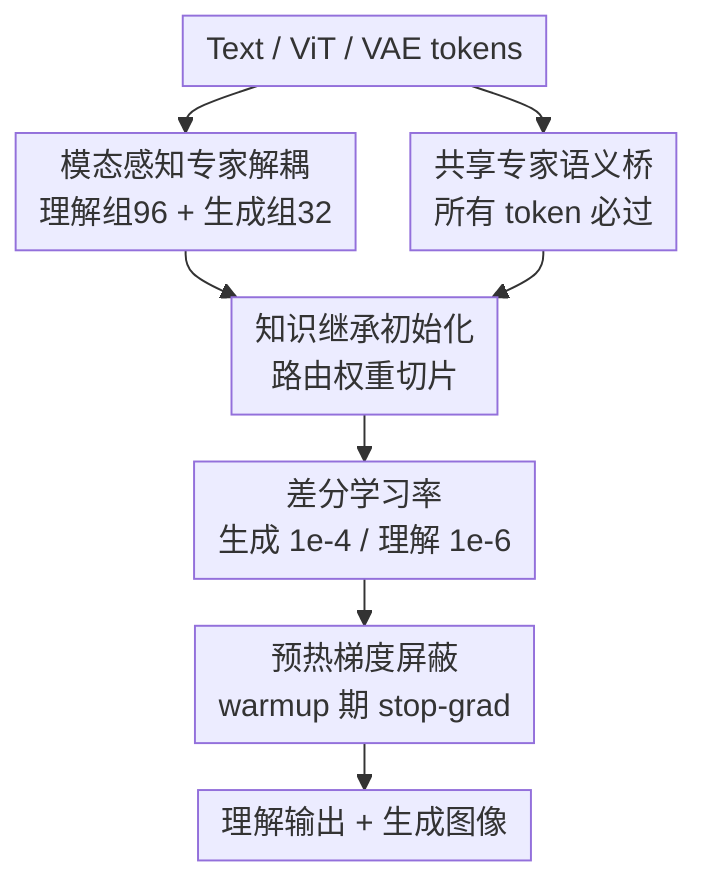

# Symbiotic-MoE: Unlocking the Synergy between Generation and Understanding

**会议**: ECCV 2026  
**arXiv**: [2604.07753](https://arxiv.org/abs/2604.07753)  
**代码**: 待确认  
**领域**: 图像生成  
**关键词**: 混合专家模型、多模态统一、灾难性遗忘、生成与理解协同、路由坍塌

## 一句话总结

Symbiotic-MoE 在原生 MoE Transformer 架构内通过模态感知专家解耦与渐进式训练策略，在零参数开销下解决了生成与理解任务的梯度冲突，实现两类能力协同提升——生成质量优于 MoT/Bagel，而理解能力（MMLU +20.1%、OCRBench +13.8%）甚至超过了仅做理解任务的基线。

## 研究背景与动机

大型多模态模型（LMMs）正朝着"任意到任意"的全模态基座演进：既能理解图像，又能生成图像。然而，当一个预训练好的视觉理解模型被赋予图像生成能力时，几乎无一例外地会出现灾难性遗忘——理解任务的精度大幅下滑。这一现象的根源在于生成与理解任务在优化目标上的本质矛盾：理解是"多对一"的收敛映射（需要对同一语义空间的变体给出一致的精准表征），而生成是"一对多"的发散映射（同一文本提示对应无数可行图像）。当两者被混合训练时，生成目标产生的高方差、大幅度梯度会淹没理解任务已收敛的优化景观，将专家权重不可逆地拉向生成分布。

面对这一挑战，现有方法主流选择了结构性隔离，最典型的代表是 Mixture-of-Transformers（MoT）：将 Transformer 的 FFN 专家物理分割为理解侧和生成侧两套参数，互不相扰。这种"分裂大脑"方案确实能抑制遗忘，但代价高昂——两套专家之间的语义连通性被彻底切断，生成任务学到的细粒度视觉特征无法反哺理解表征，理解能力只能停留在孤立微调的水平，而非真正从生成中获益。与此同时，结构隔离往往引入参数开销或推理延迟，并导致容量碎片化。

这让人不禁追问：隔离真的是唯一出路吗？Symbiotic-MoE 给出了否定答案。该工作的核心洞察是，任务冲突并非统一架构的内在缺陷，而是路由动态的失败——标准 MoE 训练会出现路由坍塌，生成 token 垄断专家资源，理解任务被饿死。**核心 idea：在原生稀疏 MoE Transformer 中引入模态感知专家解耦（把专家逻辑分组为理解组和生成组）与共享专家语义桥（让所有 token 都经过共享专家，实现跨模态对齐），再配合渐进式训练策略（差分学习率 + 预热梯度屏蔽），在零参数开销下将生成信号从破坏者转变为理解能力的正向正则化器。**

## 方法详解

### 整体框架

Symbiotic-MoE 以 Hunyuan-VL-30B-A3B（30B 总参数，实际激活 3B）为骨干，将 Transformer 中每个 MoE 层的 FFN 部分重新架构。输入侧同时接收三类 token：文本（Text）、视觉编码器输出（ViT）和 VAE 连续视觉潜变量；输出分别服务于理解任务（语言建模+多模态问答）和生成任务（flow matching 在 VAE 潜空间）。整个改造分为两个核心部分：（1）Symbiotic-MoE 架构，负责在不增加参数的前提下在 MoE 层内完成专家的逻辑分组与共享桥接；（2）渐进式训练策略，通过差分学习率和预热梯度屏蔽协调两类任务的优化节奏。

### 关键设计

**1. 模态感知专家解耦：从路由坍塌到专家专职化**

标准 MoE 训练时生成 token 产生的梯度幅度远大于理解 token，会系统性地劫持专家资源——这就是路由坍塌现象，可视化为训练 30k 步后文本 token 的路由概率图从清晰离散的斑点退化为模糊的均匀分布。Symbiotic-MoE 的解决方式不是物理分离参数，而是做数据驱动的逻辑分组：先在预训练 VLM 上分别推理 MMLU（文本 token）和 OCRBench（ViT token），统计 128 个专家在 47 个 MoE 层上的累计激活频率，发现 Text 和 ViT token 高度共享同一批"核心专家"（如 Layer 16 中 Expert 9、18、92 同时是两类 token 的 top 选择），而存在另一批利用率偏低的专家。基于此，每层将激活频率排名靠前的 96 个专家划为理解组（Text+ViT 共用，保稳定性），激活较少的 32 个专家重新分配为生成组（VAE token 专用，保可塑性）。强行把 Text 和 ViT 分开会导致灾难性崩溃（MMLU 从 0.69 跌至 0.24），正是因为两者在预训练 VLM 中深度耦合，Bimodal Split 是唯一保住预训练结构的方案。

**2. 共享专家语义桥：让生成反哺理解**

仅有解耦还不够——若两组专家完全孤立，生成学到的细粒度视觉语义将被浪费，退化为"分裂大脑"。Symbiotic-MoE 的关键差异在于保留并激活每层原本已有的共享专家（shared experts）：这些专家接收所有 token（Text、ViT、VAE）的输入，强制跨模态语义对齐。消融实验揭示了共享专家的不可或缺性：从原始 VLM 中移除共享专家后，MMLU 立即从 0.69 跌至 0.46。生成任务通过共享专家向理解侧传递的究竟是什么？实验通过"遮蔽所有模态专用路由专家、仅靠共享专家做零样本推理"的探针验证：只做理解训练的对照组共享专家性能随训练退化，而 Symbiotic-MoE 的共享专家性能显著提升——生成目标作为稠密语义压缩器，迫使共享参数编码像素级空间关系，反向约束了表征空间、防止对文本模式的过拟合、锐化了视觉感知。

**3. 知识继承初始化与路由权重切片：零冷启动过渡**

从统一 MoE 切换到解耦架构时，如果新模块随机初始化，性能会立即崩溃。理解组和生成组的专家权重直接从原始 VLM 对应索引的专家权重拷贝（无需修改），保住了预训练语义结构。更关键的是两个新路由器的初始化：原路由器权重矩阵 $\mathbf{W}_r \in \mathbb{R}^{d \times N}$ 按专家索引子集 $\mathcal{I}_g$ 直接列切片，得到各组子路由器 $\mathbf{W}_r^g = \mathbf{W}_r[:, \mathcal{I}_g]$。这样原本对专家 $i$ 打高分的 token，在新的子路由器里仍然对专家 $i$ 打高分，路由先验完整保留，实现了零迭代下的近原始理解性能（如 Table 2 所示：96/32 Bimodal Split 下迭代 0 时 MMLU 即达 0.60、OCRBench 达 807）。

**4. 渐进式训练策略：差分学习率 + 预热梯度屏蔽**

即便有了完善的架构解耦，同时优化一个已收敛的 VLM 和一个从头学习的生成模块仍极不稳定。两者的最优学习率截然不同：对理解组以 $10^{-4}$ 更新会立即引发崩溃（甚至不接入生成任务、单独以 $10^{-4}$ 只训 LM+MMU 也会立即崩溃），而生成组随机初始化的专家需要 $10^{-4}$ 才能快速逃离初始状态。因此对生成专家和路由器施加大学习率 $10^{-4}$，对理解专家、路由器和共享专家施加保守学习率 $10^{-6}$。然而问题还未结束：warmup 阶段生成模块处于高度不稳定期，产生的高方差梯度会通过共享专家污染理解表征。解决方案是在 warmup 阶段对共享专家执行 stop-gradient 操作：VAE token 可以前向传播经过共享专家（利用预训练特征），但反向传播时梯度不会更新共享专家权重——共享专家只接受来自 Text 和 ViT 的稳定梯度。warmup 结束后移除屏蔽，恢复全双向梯度流，此时生成模块的优化轨迹已趋于稳定。同时对进入共享专家的生成 token 梯度施加 0.1 缩放系数，防止大学习率下的生成信号垄断共享专家。

### 损失函数 / 训练策略

总损失由三项构成：

$$\mathcal{L}_{total} = \lambda_{disc} \cdot \mathcal{L}_{discrete} + \lambda_{aux} \cdot \mathcal{L}_{aux} + \lambda_{img} \cdot \mathcal{L}_{img}$$

其中 $\lambda_{disc} = 1.0$、$\lambda_{aux} = 0.01$、$\lambda_{img} = 1.0$。$\mathcal{L}_{discrete}$ 是标准下一 token 预测的交叉熵损失，覆盖纯语言建模、多模态理解和生成的文本条件；$\mathcal{L}_{aux}$ 是专家负载均衡损失，按理解组和生成组分别独立计算（而非强制全局均衡，否则会稀释模态专化）；$\mathcal{L}_{img}$ 是在 VAE 潜变量上的 flow matching 损失，负责视觉特征与生成流形的对齐。

## 实验关键数据

### 主实验

所有实验在相同数据配比（T2I:T2I-Long:LM:MMU = 3:3:2:2）和相同训练步数下对比，基底模型均为 Hunyuan-VL-30B-A3B。

| 方法 | T2I-Comp↑ | FID↓ | CLIP↑ | HPSv2↑ | MMLU↑ | OCRBench↑ |
|------|-----------|------|-------|--------|-------|-----------|
| Only_LM_MMU（无生成） | — | — | — | — | 0.405 | 662 |
| Standard MoE | 0.36 | 26.27 | 0.27 | 0.19 | 0.308 | 571 |
| MoT | 0.43 | 19.87 | 0.28 | 0.21 | 0.392 | 583 |
| Bagel | 0.45 | 18.42 | 0.29 | 0.21 | 0.396 | 590 |
| **Symbiotic-MoE（本文）** | **0.49** | **13.65** | **0.31** | **0.23** | **0.507** | **768** |

Symbiotic-MoE 不仅在所有生成指标上超越对比方法，更将 MMLU 从 Only_LM_MMU 基线的 0.405 提升到 0.507（+20.1%），OCRBench 从 662 提升到 768（+13.8%），首次实证了图像生成训练可以正向增强理解能力。

### 消融实验

| 分组策略 | 理解组/生成组 | 共享专家 | MMLU（iter 0） | OCRBench（iter 0） |
|----------|-------------|----------|----------------|-------------------|
| 原始 VLM | 128（纠缠） | ✓ | 0.697 | 845 |
| 原始 VLM，去共享专家 | 128 | ✗ | 0.460 | 498 |
| 三分法 Tripartite | 32/32/64 | ✓ | 0.244 | 109 |
| Bimodal 32/96 | 32/96 | ✓ | 0.285 | 532 |
| Bimodal 64/64 | 64/64 | ✓ | 0.453 | 742 |
| Bimodal 86/42 | 86/42 | ✓ | 0.561 | 786 |
| **Bimodal 96/32（本文）** | **96/32** | **✓** | **0.601** | **807** |

### 关键发现

- 共享专家是最关键的组件：移除共享专家后 MMLU 从 0.697 跌至 0.460，是单一因素中影响最大的。
- Text 与 ViT 不能分开：三分法（Text/ViT/VAE 各一组）导致 MMLU 崩溃到 0.244，原因是两者在预训练 VLM 中共享核心专家路径。
- 96/32 的理解/生成专家比例是最优平衡点：保留足够的预训练容量（96 个理解专家）同时给生成任务足够的可塑性（32 个生成专家）。
- 路由坍塌可视化验证：标准 MoE 经 30k 步 T2I 联合训练后，文本 token 的路由概率图从清晰稀疏退化为均匀模糊——Symbiotic-MoE 始终维持 ~0.95 的专家利用率。
- 渐进式训练策略中，去掉预热梯度屏蔽（Ours_wo_wgs）会导致前 500 步内 MMLU 和 OCRBench 急剧下滑，确认 warmup 期的早期稳定性对最终性能至关重要。

## 亮点与洞察

- **路由坍塌是问题的本质**：论文把"生成破坏理解"这一经验现象精确诊断为路由动态失效，并以可视化和容量率曲线给出了清晰的机制证据。这一诊断让后续的修复方案（解耦分组而非物理隔离）有了坚实的根基，思路上比"加隔离层"更深一层。
- **共享专家作为双向语义导管**：通过"只用共享专家做推理"的探针实验，直接证明了生成信号通过共享专家以稠密正则化的方式强化了理解表征——这是生成和理解协同效应的首个机制级证据，颠覆了"两者必然此消彼长"的直觉。
- **路由权重切片实现零冷启动**：用原路由矩阵的列切片初始化子路由器，在不增加任何参数的前提下保住了预训练路由先验，可以直接被其他 MoE 架构拆分场景复用。

## 局限与展望

- 实验仅在 PT 阶段（256×256 分辨率）进行，CT 和 SFT 阶段的协同效果尚未验证，高分辨率下的行为存在不确定性。
- 所有实验均基于 Hunyuan-VL-30B-A3B 一个骨干，结论在其他 MoE 架构（如 DeepSeek-MoE、Qwen3-MoE）上的可迁移性需要进一步验证。
- 生成质量评估聚焦于早期训练阶段，缺乏 aesthetic alignment 全流程下的系统评估；96/32 的专家分组比例对于不同规模或不同专家总数的 MoE 模型是否仍最优，有待探索。
- 预热梯度屏蔽的持续轮次（warmup steps）选取敏感性分析较少，实际工程部署中需要额外调参。

## 相关工作与启发

- **vs MoT/Bagel**：MoT 系方法通过物理分割专家参数实现模态隔离，成功避免遗忘但割裂了跨模态信息流；本文的逻辑分组 + 共享桥接在同等结构基础上额外打通了语义通道，MoT 只能"保住"理解能力，而 Symbiotic-MoE 能"提升"理解能力，是根本性差异。
- **vs Adapter/LoRA 类方法（如 Janus）**：冻结骨干 + 旁路适配器的方式通过参数隔离避免遗忘，但旁路结构天然限制了深度跨模态融合；本文零参数开销的逻辑解耦提供了更紧凑且协同的替代路径。
- **vs 纯离散化统一（Chameleon、Emu3）**：将图像 token 化后与文本混合建模，虽然形式统一，但图像 token 离散量化带来的信息损失以及同等架构下的梯度冲突仍然存在；Symbiotic-MoE 保持连续 VAE 潜变量并专门处理路由冲突，在精度和稳定性上各有优势。

## 评分

- 新颖性: ⭐⭐⭐⭐⭐ 将路由坍塌精准诊断为生成-理解冲突的根因，并给出无参数开销的机制级解决方案，思路新颖
- 实验充分度: ⭐⭐⭐⭐ 消融设计完整、探针实验有说服力，但仅在单一骨干和 PT 阶段验证
- 写作质量: ⭐⭐⭐⭐⭐ 行文逻辑清晰，诊断→设计→验证闭环严谨，图表与文字高度互补
- 价值: ⭐⭐⭐⭐⭐ 首次实证生成训练可正向提升理解能力，为全模态基座模型设计提供了具体可行的新范式

<!-- RELATED:START -->

## 相关论文

- [\[ECCV 2026\] Focusing on What Matters: Saliency-Harnessing Accurate Routing for Diffusion MoE](focusing_on_what_matters_saliency-harnessing_accurate_routing_for_diffusion_moe.md)
- [\[CVPR 2026\] Harmony: Harmonizing Audio and Video Generation through Cross-Task Synergy](../../CVPR2026/image_generation/harmony_harmonizing_audio_and_video_generation_through_cross-task_synergy.md)
- [\[CVPR 2026\] Group Diffusion: Enhancing Image Generation by Unlocking Cross-Sample Collaboration](../../CVPR2026/image_generation/group_diffusion_enhancing_image_generation_by_unlocking_cross-sample_collaborati.md)
- [\[CVPR 2026\] PosterReward: Unlocking Accurate Evaluation for High-Quality Graphic Design Generation](../../CVPR2026/image_generation/posterreward_unlocking_accurate_evaluation_for_high-quality_graphic_design_gener.md)
- [\[CVPR 2025\] Dual Diffusion for Unified Image Generation and Understanding](../../CVPR2025/image_generation/dual_diffusion_for_unified_image_generation_and_understanding.md)

<!-- RELATED:END -->
