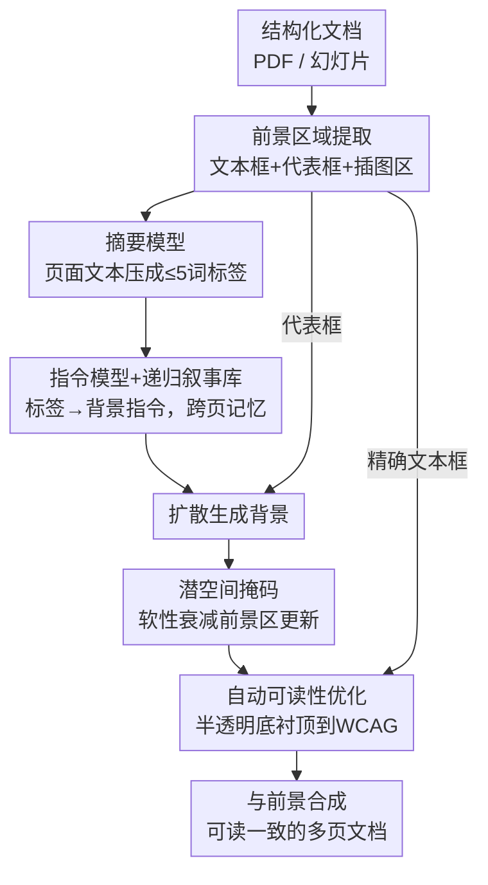

# Text-Conditioned Background Generation for Editable Multi-Layer Documents

**会议**: ECCV 2026  
**arXiv**: [2512.17151](https://arxiv.org/abs/2512.17151)  
**代码**: 未公开  
**领域**: 扩散模型 / 图像生成  
**关键词**: 文档背景生成、潜空间掩码、可读性优化、多页一致性、图层化编辑

## 一句话总结
把一份多页文档当成「文本 / 图 / 背景」三层可分离的结构，用一个免训练的框架只重新生成背景层：在扩散潜空间对前景区域做软性衰减以护住文字，用一套对比度驱动的算法自动给文字加半透明底衬保证可读性，再用递归摘要-指令记忆把主题风格贯穿全篇，最终在可读性（WCAG 99.75% / OCR 0.97）和用户偏好（83.57%）上大幅甩开 BAGEL 和 GPT-5。

## 研究背景与动机
扩散模型在文生图和风格迁移上已经很成熟，但它们几乎都是为「生成一张独立的图」而优化的，一旦拿来处理学术报告、教学讲义、演示幻灯片这类**文本与图交织的文档**，就会水土不服。文档编辑真正在意的是三件事：背景要好看、文字要能读、多页之间风格要连贯——而这三件恰恰是标准扩散管线不擅长的。现有系统里，背景生成往往被轻描淡写地处理掉，结果就是纹理糊住正文、跨页风格各画各的、甚至连分辨率和版式都被改掉。论文开篇的对比图很直白地展示了这种失败：通用扩散模型会抹掉标题和插图、篡改语义内容、改变分辨率，把一份能读的文档「改」成一张不能读的画。

这背后其实是设计目标的根本错位。海报生成类工作（POSTA、CreatiPoster）虽然能产出漂亮的多层可编辑版面，但它们的输入是用户给的文字和素材、允许自由重排结构，本质是「从零拼一张海报」；而像 GPT-4o / GPT-5 这样的通用多模态模型，一旦拿去改文档背景，会连文字内容本身一起改写，直接违背了「前景不许动」的编辑约束。文档背景编辑真正的场景是：一份已经排好版的多页文档摆在这里，文字、插图、布局全部是**不可变**的硬约束，用户只想换换背景。这类约束下的编辑，学界几乎没有专门的方案——绝大多数扩散研究都在往「更锐、更细、生成更多」的方向卷，而文档编辑要的偏偏是反过来：为了守住文字保真，模型有时候得**少做一点，而不是多做一点**。

本文的切入角度就是顺着这个「少做」的哲学走：不把文档当一张扁平的图去重绘，而是当成文本、图、背景可独立保留或再生的**多层结构**，只对背景层动手，并在生成过程里主动「削弱」前景区域的更新来护住内容。**核心 idea 是：把背景生成建模成扩散潜空间里一个平滑衰减场——像物理里的软势垒那样温和地压制文字区域的扩散更新，配合一套 WCAG 对比度驱动的自动底衬算法和递归记忆的多页指令，用一个完全免训练的框架实现可读、连贯、可交互编辑的文档背景生成。**

## 方法详解

### 整体框架
系统的输入是一份结构化的多页文档（PDF 或幻灯片），输出是每页只换了背景层、前景文字与插图纹丝不动的成品文档。整条管线是串行的多阶段流水：先做**前景区域提取**，从每页解析出文字行、段落框和插图区，得到全页文本 $T_i$、精确文本框集合 $\mathcal{L}_i$ 以及供掩码用的代表性区域框 $\mathcal{B}_i$；接着**摘要模型**把冗长的页面文本压成一个不超过五个词的语义标签 $s_i$，**指令模型**再把标签（可选叠加用户 prompt）转成一句背景设计指令 $u_i$，其中跨页风格连贯由**递归叙事库 RNB** 维持；然后文生图扩散模型据此合成背景，同时受两个模块约束——**潜空间掩码 LM** 用 $\mathcal{B}_i$ 压住前景区域的更新，**自动可读性优化 ARO** 给所有文字框 $\mathcal{L}_i$ 铺半透明圆角底衬把对比度顶到 WCAG 标准；最后把背景与原前景合成，得到连贯可读的多页文档。整套东西不需要训练，LM 直接嵌在 BAGEL 这个基座里，摘要/指令的 LLM 是可替换组件。

### 关键设计

**1. 前景区域提取：给「不许动的地方」画出精确边界**

一切护文字的操作都得先知道文字在哪，所以第一步是把每页拆成可用的几何信息。系统检测出每一行文字及其边界框，再按「左边距一致 + 竖直间隙有界」把相邻行归并成段落，段落框取其所有行框的并集；为了不让归并跨过大图，检测出的插图区会把页面纵向切成上/侧/下三组，组内段落只有当水平重叠率 $\mathrm{overlap}_x$ 超过阈值、竖直间隙也在容差内时才合并成列状区域。最后用一个类 NMS 的抑制去掉冗余：如果候选区域 $p$ 基本被更大的区域 $q$ 包住（包含比或 IoU 超过阈值）就丢弃它。这一步同时产出两套东西——精确的文本框集合 $\mathcal{L}_i$（后面喂给 ARO，要求像素级准确才能保证对比度）和代表性框集合 $\mathcal{B}_i$（喂给潜空间掩码，因为它只需大致圈住文字区、目的是压制而非逐像素判读）。两套框精度要求不同，是因为下游两个模块对「准」的需求本就不同，这个区分很务实。

**2. 前景感知的潜空间掩码：用软势垒温和地压住文字区，而不是硬抠**

这是全文的核心。显著的背景物体如果放任生成，很容易糊到文字上让文档没法读；最朴素的做法是拿二值掩码把前景区域直接抹掉，但硬删会带来尖锐边界、产生视觉上很突兀的割裂感。本文的做法是从「有意地削弱前景区的背景生成」这个想法出发，在潜空间里施加一个**平滑衰减场**——类比物理里的扩散势垒或数值优化里的加权函数，让背景在受保护区域周围自然演化、边界不留伪影。具体地，在 2D 潜格上定义掩码：中心覆盖分数 $\rho$ 的窗口内取衰减因子 $\lambda\in(0,1)$，窗口外取 1；并且只在扩散调度的**较晚时间步**才启动掩码（实现里从 0.29 处开始、强度 0.2）。把掩码 $\mathbf{m}$ 作用到模型预测的速度上，有效速度为

$$v_t' = \mathbf{m}\odot v_t^{\mathrm{raw}} + (1-\mathbf{m})\odot \mathrm{stopgrad}(v_t^{\mathrm{raw}})$$

再按 $x_{t-\Delta t}=x_t - v_t'\,\Delta t$ 更新。直观说，就是在文字区把速度衰减（乘 $\lambda$）、并对被压制的部分做梯度截断，让那里的扩散更新变弱变稳，而背景区域照常丰富演化。和常见的扩散 inpainting 相比，本文是**时间门控 + 衰减式**的抑制，且方向上刻意「压制前景更新」而非「放大」，从而在守住文字的同时让背景围着它自然长出来。作者也点明这只是软抑制而非禁止，所以密集不规则版式下文字边界仍可能有残留伪影——是一种「优雅降级」而非「前景损坏」的取舍。

**3. 自动可读性优化 ARO：算出恰好达标的最小不透明度，把底衬做到既可读又不碍眼**

光靠潜空间掩码还不能保证每处文字都够清晰，尤其背景本身较亮时对比度可能不足。以往系统的做法是给文字统一铺一块不透明色块，简单粗暴但难看。ARO 的思路是给每个文字框铺一块**半透明圆角底衬**，并自动求出「刚好满足 WCAG 2.2 对比度标准的最小不透明度」，既保证可读又尽量透出背景保持美感。它先把 sRGB 转成线性 RGB 算出相对亮度 $L$，再用 WCAG 的对比度公式 $CR(L_1,L_2)=\frac{\max+0.05}{\min+0.05}$。给定底衬颜色亮度 $L_o$ 和背景像素亮度 $L_{\mathrm{bg}}$，混合后亮度是 $L_{\mathrm{blend}}(\alpha)=\alpha L_o+(1-\alpha)L_{\mathrm{bg}}$，然后在覆盖分数约束下搜最小 $\alpha$：

$$\alpha^{*}=\min\Big\{\alpha \;\Big|\; \tfrac{1}{N}\sum_{i=1}^{N}\mathbf{1}\big[CR(L_{\mathrm{blend}}^{(i)}(\alpha),L_t)\ge\tau\big]\ge\rho\Big\}$$

即要求文字区内至少 $\rho$ 比例的像素达到目标对比度 $\tau$（实验里 $\tau$=7.0、覆盖 0.98），再夹一个下限得到最终 $\alpha$。这样每个底衬的透明度都是按它下方局部背景亮度**自适应**算出来的，而不是一刀切的固定值，因此能贴着背景走、既满足无障碍要求又不显得突兀。它是纯图像空间的后处理，几乎不增加显存，也只多花约 1.26 秒。

**4. 基于 LLM 的多页一致性：用递归叙事库让风格「记得住」而不逐页漂移**

文档背景不像视频或对话，它既要跨页视觉连贯、又要各页贴合本页内容；如果每页独立无状态地生成指令，风格必然各画各的、越走越散。本文分两步解决：摘要模型 $f_{\text{sum}}$ 先把每页冗长噪杂的文本压成一个不超过五词的语义标签 $s_i$，抓住该页主视觉主题（比如「AI 伦理里的公平」「生命科学里的分子结构」），既降噪又能在用户没给 prompt 时驱动「内容驱动、无需逐页写指令」的自动生成；指令模型 $f_{\text{inst}}$ 再据 $s_i$（可叠加用户 prompt $p$）和历史生成一句设计指令。关键的连贯性来自把「递归叙事库 RNB」搬到文档场景——维护一个大小为 $N$ 的记忆窗口 $H_{i}=\{u_i^{(1)},\dots,u_i^{(N)}\}$ 存放此前各页的指令，下一句指令 $u_i=f_{\text{inst}}(s_i,p,H_{i-1})$ 条件在这段记忆上，于是色调、纹理等风格线索能沿文档累积传递，做到全局风格复用、又允许随 $s_i$ 局部变化。这一步的 LLM 是可替换组件，去掉它（w/o MPC）只影响一致性（CLIP MP 掉 0.06、LLM Voting 掉 0.07），可读性指标不动，说明多页一致性和可读性是解耦的两条线。

### 一个例子：把一份三页 AI 伦理讲义换背景
以一份三页的 AI 伦理文档为例走一遍。第一页文本一大段，前景提取先切出所有文字行、归并成段落框、避开插图切成列状区域、NMS 去冗余，得到精确文本框 $\mathcal{L}_1$ 和代表框 $\mathcal{B}_1$；摘要模型把整页压成「AI 公平与偏见」这类五词内标签 $s_1$，指令模型据此（这轮记忆为空）生成一句背景指令，比如「淡雅的抽象几何背景」。扩散生成时，潜空间掩码在较晚时间步用 $\mathcal{B}_1$ 把文字区的速度衰减，背景纹理只在文字外围铺展；生成完 ARO 逐个文字框算出刚好满足对比度的最小 $\alpha$、铺上半透明圆角底衬。到第二页，指令模型条件在含第一页指令的记忆 $H_1$ 上，于是第二页沿用同一套色调纹理、只随本页主题微调，第三页同理——三页看下来风格一脉相承，文字始终清晰、插图分毫未动。如果用户事后说「背景再淡一点」，系统只需重算 $u_i$ 重生成背景，文字和图完全不碰；只有当文字内容本身被改，才会重算布局框、整条管线连掩码带 ARO 重跑一遍。

## 实验关键数据

### 主实验
在自建的学术文档 + 幻灯片基准（每份恰好三页、含长文本/要点/至少一张插图）上，对比 BAGEL 和 GPT-5，用九项指标覆盖设计质量、可读性、多页一致性。

| 方法 | Layout | WCAG(%) | OCR | CLIP 一致性 | LLM Voting |
|------|--------|---------|-----|-------------|-----------|
| BAGEL | 4.10 | 66.98 | 0.55 | 0.557 | 4.23 |
| GPT-5 | 3.88 | 55.02 | 0.52 | 0.687 | 4.02 |
| 本文 (Prompt+Text) | 4.20 | 99.75 | 0.97 | 0.696 | 4.33 |
| 本文 (Prompt only) | 4.36 | 99.38 | 0.96 | 0.626 | 4.51 |

最抢眼的是可读性：本文把 WCAG 对比度覆盖率顶到近乎满分的 99.75%、OCR 字符准确率做到 0.97，而两个基线都在 0.5x / 5x-6x% 的水平——差距不是几个点，而是量级。用户研究里 30 名参与者在四个设计维度上给本文全场最高分（4.669–4.80，基线仅 1.17–1.65），总体偏好投票 83.57% 选本文，GPT-5 占 15.24%、BAGEL 仅 1.43%。

### 消融实验
默认 Prompt+Text 模式下逐一移除三个模块（LM / ARO / MPC）：

| 配置 | WCAG(%) | OCR | CLIP 一致性 | LLM Voting | 说明 |
|------|---------|-----|-------------|-----------|------|
| Full model | 99.75 | 0.97 | 0.696 | 4.33 | 完整模型 |
| w/o LM | 99.67 | 0.91 | 0.691 | 4.49 | 去潜空间掩码，OCR 掉 0.06、背景侵入文字 |
| w/o ARO | 97.35 | 0.90 | 0.689 | 4.32 | 去可读性优化，WCAG 掉到 97.35 |
| w/o MPC | 99.69 | 0.96 | 0.642 | 4.26 | 去多页一致性，CLIP 一致性掉 0.06 |

### 关键发现
- LM 和 ARO 是可读性的两条腿：去掉 LM 时背景纹理会侵入文字区、OCR 从 0.97 跌到 0.91；去掉 ARO 时 WCAG 从 99.75% 更明显地跌到 97.35%——两者一个防侵入、一个保对比，缺一不可。
- 有个耐人寻味的反常：去掉 LM 后 CLIP Prompt Score 反而略升（0.25 vs 0.24），说明放任更强的背景更新有时能提升图文对齐，但代价是文字可读性——正好印证了「文档编辑要少做而非多做」的核心论点。
- MPC 只管一致性、不碰可读性：去掉它 WCAG/OCR 几乎不动，但 CLIP 跨页一致性从 0.70 掉到 0.64，证明多页连贯和文字保真是解耦的。
- 开销极低：ARO 只加约 1.26 秒（0.5%），MPC 加 7.30 秒（约 3%），显存全程不变（31.35GB），因为三个模块要么是潜空间原地操作、要么是纯后处理，都不引入额外前向。

## 亮点与洞察
- 把「护文字」建模成潜空间的**软性衰减场**而非二值抠图，是很漂亮的一招：借物理软势垒的直觉，用 stop-gradient + 时间门控让文字区的扩散更新变弱变稳，边界不留硬伤，这个 trick 可迁移到任何「想局部保留、又不想硬 mask 出割裂感」的扩散编辑任务。
- ARO 把无障碍标准 WCAG 直接写进生成管线，用「搜最小不透明度」把可读性从「事后凑」变成「按公式算」，让文字底衬自适应局部背景亮度——这种「把外部合规标准数学化进优化目标」的思路很值得借鉴。
- 精确框给 ARO、代表框给 LM 的**双精度设计**很务实：认清两个下游模块对「准」的真实需求不同，就不必为掩码也做像素级检测，省事又稳。
- 全套免训练、LLM 可插拔，几乎零额外显存和 3.5% 时间开销就把可读性做到近饱和——工程落地性很强，作者也明说是给 Canva、Microsoft Designer 这类已部署工具补上「文本密集文档可读性」这块短板。

## 局限与展望
- 作者承认潜空间掩码只是软抑制而非禁止，密集或不规则版式下文字边界仍可能残留伪影，ARO 在不规则透明图叠加上也会失灵。
- 前景提取依赖 PyMuPDF/OpenCV，密集数学公式或嵌套表格会漏检区域——虽然表现为可读性优雅降级而非前景损坏，但终究是脆弱环节。
- 递归叙事库虽然每页 O(1) 记忆、长度无关，但固定窗口大约超过十页就会饱和，长文档的有效性仍是未来工作；基准也刻意固定在三页以便人评。
- 没有报告 SD-Inpainting 基线，作者理由是文档分辨率（A4、16:9）下公平配置很难——降采样会毁掉正在评测的文字清晰度、分块又引入接缝，这个 caveat 值得留意。
- 更细粒度的控制（按节主题、自适应调色）仍是开放问题。

## 相关工作与启发
- **vs BAGEL**: BAGEL 擅长海报式交互编辑、局部改动能稳住其余版面，但面对多页密集文本文档时背景合成会干扰内容保真、也保不住跨页连贯；本文直接嵌在 BAGEL 基座上，补的正是「可读性 + 多页一致」这两块。
- **vs POSTA / CreatiPoster**: 它们是海报生成，输入是用户给的文字/素材、允许自由重排结构，本质从零拼图；本文是**约束编辑**——前景文字、插图、布局全部不可变，只改背景层，任务定义就不同。
- **vs GPT-4o / GPT-5 / Nano Banana 2**: 通用多模态模型改文档背景时会连文字内容一起改写、或把输入当成「拍到的文档照片」去重绘扭曲文字，违背前景保留约束，因此不适合当编辑器——排除它们是任务定义问题而非能力问题。
- **vs TextDiffuser / SAWNA**: 前者用位置条件生成可读文字、后者保留空白负空间，但都假设可控文本渲染或空白区域，不保护复杂版式里**已存在**的前景内容；本文正是针对「已排好版、前景不可动」这一空白。

## 评分
- 新颖性: ⭐⭐⭐⭐ 把文档背景编辑定义成图层化约束编辑、用潜空间软衰减+WCAG 可读性优化+递归记忆三件套解决，问题设定和潜空间掩码都很新，但各组件多为已有思路的巧妙组合。
- 实验充分度: ⭐⭐⭐⭐ 九项指标+消融+30 人用户研究+算力分析都齐，可读性提升是量级的；扣分在基准是自建三页合成数据、缺 SD-Inpainting 等基线。
- 写作质量: ⭐⭐⭐⭐ 动机清晰、「少做而非多做」的论点贯穿全文，公式和讨论都到位。
- 价值: ⭐⭐⭐⭐ 免训练、可插拔、近零开销把文档可读性做到近饱和，对已部署的自动设计工具有直接落地价值。

<!-- RELATED:START -->

## 相关论文

- [\[ECCV 2026\] Layout-Conditioned Autoregressive Text-to-Image Generation via Structured Masking](layout-conditioned_autoregressive_text-to-image_generation_via_structured_maskin.md)
- [\[CVPR 2026\] 3D Space as a Scratchpad for Editable Text-to-Image Generation](../../CVPR2026/image_generation/3d_space_as_a_scratchpad_for_editable_text-to-image_generation.md)
- [\[CVPR 2026\] StyleTextGen: Style-Conditioned Multilingual Scene Text Generation](../../CVPR2026/image_generation/styletextgen_style-conditioned_multilingual_scene_text_generation.md)
- [\[ICLR 2026\] Pareto-Conditioned Diffusion Models for Offline Multi-Objective Optimization](../../ICLR2026/image_generation/pareto-conditioned_diffusion_models_for_offline_multi-objective_optimization.md)
- [\[CVPR 2026\] A Self-Conditioned Representation Guided Diffusion Model for Realistic Text-to-LiDAR Scene Generation](../../CVPR2026/image_generation/a_self-conditioned_representation_guided_diffusion_model_for_realistic_text-to-l.md)

<!-- RELATED:END -->
