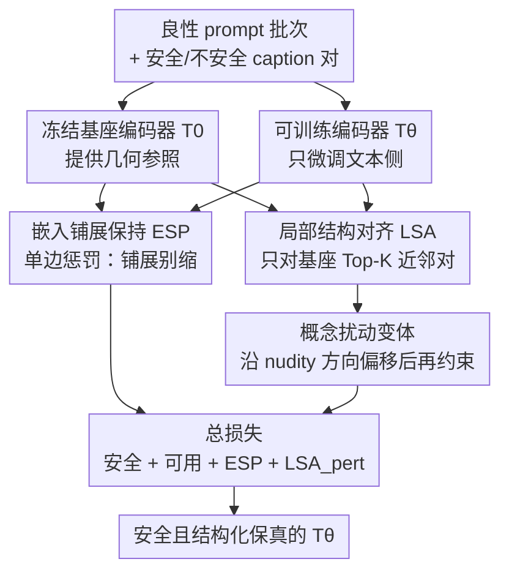

# The Illusion of High Utility in Safety Alignment of Text-to-Image Diffusion Models

**会议**: ECCV 2026  
**arXiv**: [2607.00402](https://arxiv.org/abs/2607.00402)  
**代码**: [https://adeelyousaf.github.io/SAGE_ECCV26_Project_Page/](https://adeelyousaf.github.io/SAGE_ECCV26_Project_Page/)  
**领域**: 扩散模型 / 图像生成 / 安全对齐  
**关键词**: T2I 安全对齐, 语义坍缩, 嵌入几何, 结构化保真度, TIFA

## 一句话总结
这篇论文揭穿了「T2I 安全对齐既安全又不掉能力」的假象——粗粒度指标（FID / CLIPScore）看不出的细粒度指令遵循能力其实大幅退化，根因是文本编码器嵌入空间发生「语义坍缩」，并提出 SAGE 用两个几何正则项（保住嵌入铺展 + 保住局部相似结构）在几乎不牺牲安全的前提下把结构化保真度追回来。

## 研究背景与动机
文本到图像扩散模型（Stable Diffusion、DALL-E 等）在海量网络数据上训练，天然继承了生成 NSFW 内容的能力，因此「安全对齐」——压制有害生成、同时保住良性 prompt 上的可用性——成了负责任部署的硬要求。早期方法确实存在明显的安全-可用性权衡：安全上去了，生成质量就下来了。但近年像 DES 这类方法看起来打破了这个魔咒：在标准评测下，它们的 FID 甚至比基座模型还好、CLIPScore 几乎不掉，于是学界逐渐相信「安全-可用性权衡问题基本已经解决」。

本文对这个乐观结论提出了直接质疑。作者指出，几乎所有先前安全工作汇报可用性时用的都是 FID 和 CLIPScore 这两个全局粗粒度指标——FID 只衡量生成图与真实图的分布距离、根本不看 prompt，CLIPScore 衡量图文全局相似度、却继承了 CLIP 在物体计数和组合推理上的已知短板。这就导致一个尴尬的现象：一个安全对齐后的模型明明画错了物体的颜色、数量、属性，CLIPScore 反而可能给错误的图打出更高的分。当作者换用 TIFA（把每个 prompt 拆成一堆视觉问答对、逐条核验物体/属性/计数/关系是否被正确画出）这类结构化评测时，画风突变：那些在 FID/CLIPScore 下看着「毫发无损」的 SOTA 安全方法，在组合与语义保真度上普遍显著落后于基座模型，DES 整体掉 6.2%、在食物类 prompt 上更是掉 13.0%。作者把这种「粗指标上高可用、结构化语义上已退化」的系统性落差命名为**高可用性假象（illusion of high utility）**。

顺着这个落差往里挖，作者去分析了安全微调到底把文本编码器的嵌入空间改成了什么样，发现了两个一致的结构性副作用：一是**嵌入收缩**，所有 prompt 的嵌入朝一个更紧的区域挤、整体铺展变小；二是**邻域扭曲**，prompt 之间谁离谁近的局部相似结构被打乱，原本不相关的概念（比如「猫」）挤进了参考 prompt 的近邻里。这两者合起来被命名为**语义坍缩（semantic collapse）**，且与结构化可用性的下降强相关（category 级别 Pearson 相关系数 −0.86 到 −0.90）。**核心 idea：既然细粒度可用性退化的根源是嵌入空间的几何被破坏，那就在安全对齐时显式地把「嵌入整体铺展」和「局部相似结构」这两块几何护住——用一个只惩罚收缩的单边铺展正则、加一个只在基座近邻对上对齐的局部结构正则，在不松动安全的前提下把结构化保真度追回来。**

## 方法详解

### 整体框架
问题设定沿用现有文本侧安全工作：把 T2I 扩散模型拆成文本编码器 $T_\theta$ 和被冻结的 UNet 去噪网络 $U_\psi$，安全对齐只微调 $T_\theta$、UNet 不动。训练数据是成对的 caption $\{(p_u, p_s)\}$——不安全 prompt $p_u$ 及其对应的安全/中性版本 $p_s$，目标是让 $T_\theta(p_u)$ 靠向基座编码器给出的安全嵌入 $T_0(p_s)$，从而压制不安全生成。

本文方法 SAGE（Structure-Aware Geometric Regularization）不是另起炉灶，而是**在 DES 这个强安全基线之上加两个几何正则项**：先诊断出安全微调会造成「嵌入铺展收缩 + 局部邻域扭曲」的语义坍缩，再针对这两个失效模式分别下一味药——ESP 损失护住整体铺展、LSA 损失护住局部相似结构。整条 pipeline 是「先测出病灶（诊断）→ 对症开正则（方法）」的两段式，最终训练目标把原有的安全损失、点对点可用性损失、加上这两个新正则线性组合起来一起优化。

### 关键设计

**1. 语义坍缩诊断：把「可用性掉在哪」量化成两个几何指标**

这是全文的立论基石，也是方法的动机来源。作者要解决的痛点是：大家都知道安全对齐后能力掉了，但说不清掉在哪、为什么掉。本文的做法是把 TIFA 上的可用性损失和文本嵌入空间的几何变化对应起来，定义两个可测量的指标。第一个是**嵌入铺展比** $\mathcal{R}_s$：先把嵌入铺展定义为一批良性 prompt 的 $\ell_2$ 归一化嵌入到批均值的平均平方距离

$$\mathcal{S}=\frac{1}{B}\sum_{i=1}^{B}\big\|\mathbf{z}^{(i)}-\bar{\mathbf{z}}\big\|_2^2,$$

再取安全模型与基座模型铺展之比 $\mathcal{R}_s=\mathcal{S}_\theta/\mathcal{S}_0$，$\mathcal{R}_s<1$ 就意味着嵌入被压缩了。第二个是**邻域扭曲**，用 Jaccard 相似度衡量：对每个 prompt，比较它在基座嵌入下的 Top-$K$ 近邻集合 $\mathcal{N}_i^{(0)}$ 与安全对齐后近邻集合 $\mathcal{N}_i^{(\theta)}$ 的交并比，Jaccard 高说明「谁和谁语义相近」这套关系逻辑被保住了。作者实测发现，铺展越缩、Jaccard 越低的 category，TIFA 掉得越狠（DES 上 Food 类铺展比只有 0.68、TIFA 掉 13.0%），两个指标与可用性损失的负相关都在 −0.86 以上——这就把「假象」坐实成了可归因的「病灶」，也直接指明了要护住的两样东西。

**2. 嵌入铺展保持 ESP：只拦收缩、不拦扩张的单边正则**

针对第一个失效模式（嵌入收缩会降低判别能力、伤组合可用性），作者引入 Embedding Spread Preservation 损失，思路很直接——给可训练编码器的嵌入铺展设一个下界，不许它掉到基座之下：

$$\mathcal{L}_{\text{ESP}}=\max\big(0,\ \operatorname{sg}(\mathcal{S}_0)-\mathcal{S}_\theta\big),$$

其中 $\operatorname{sg}(\cdot)$ 是 stop-gradient、防止梯度回流到冻结的基座。这里的巧妙之处在于**单边**：它只在 $\mathcal{S}_\theta<\mathcal{S}_0$（真的缩了）时才激活惩罚，而允许模型在安全对齐过程中自由扩张或重组语义空间。作者做了消融对比——如果换成对称惩罚 $\lambda(\mathcal{S}_\theta-\operatorname{sg}(\mathcal{S}_0))^2$（既拦缩又拦扩），会把嵌入死死钉在基座附近，反而限制了模型为了安全而重新分配语义空间的灵活性，结果平均 ASR 从 1.1% 恶化到 2.4%、生成质量也更差。这说明「给自由度、但守住底线」比「一味贴近基座」更适合安全对齐这个需要主动挪动不安全区域的任务。

**3. 局部结构对齐 LSA：只在基座近邻对上保住相对相似关系**

针对第二个失效模式（邻域扭曲），作者指出：现有方法用的点对点可用性损失只是让每个良性 prompt 各自贴近它在基座里的位置，但各自独立的微小偏移会累积成相似结构的扭曲，破坏局部组织。LSA 的做法是不再逐点对齐，而是对齐 prompt 之间的两两余弦相似度。关键是**只在局部生效**：对每个 prompt，先在基座相似度下找出它的 Top-$K$ 近邻，只在这些近邻对集合 $\mathcal{K}$ 上约束

$$\mathcal{L}_{\text{LSA}}=1-\frac{1}{|\mathcal{K}|}\sum_{(i,j)\in\mathcal{K}} S_\theta(i,j)\,\operatorname{sg}\big(S_0(i,j)\big),$$

其中相似度在 $\mathcal{K}$ 内做零均值单位方差标准化。这样只保住「本来就该相近的那些 prompt 之间的相对关系」，而不是强行让所有 prompt 对都保持一致。

但作者发现一个隐患：直接在安全嵌入上做 LSA 虽然能提可用性，却会削弱安全——因为保住基座的局部几何，很可能连带着把与「nudity」等不安全概念相关的几何模式也一起恢复出来（先前工作显示即便良性 prompt 也可能与 nudity 方向存在非平凡相关）。为此作者引入**概念扰动变体**：把适配后的嵌入先沿不安全概念方向偏移 $\tilde{T}_\theta(p_i)=T_\theta(p_i)+\alpha\,T_0(\text{"nudity"})$（$\alpha=1$），再在偏移后的嵌入上施加局部结构约束。这等于要求「即便把嵌入朝不安全方向推一把，基座认定的局部近邻关系仍要保持」，从而在护住局部几何的同时不给对抗绕过留口子。消融显示，去掉这个扰动会让平均 ASR 从 1.1% 飙到 4.3%（Ring-A-Bell 攻击上更是涨到 14.0%），证明它对鲁棒安全至关重要。

### 损失函数 / 训练策略
总训练目标把四项线性组合：

$$\mathcal{L}_{\text{total}}=\mathcal{L}_{\text{safe}}+\lambda_u\mathcal{L}_{\text{util}}+\lambda_s\mathcal{L}_{\text{ESP}}+\lambda_l\mathcal{L}_{\text{LSA}}^{\text{pert}},$$

其中 $\mathcal{L}_{\text{safe}}$ 和 $\mathcal{L}_{\text{util}}$ 沿用 DES 的公式（安全损失把不安全 prompt 推向安全目标向量并中和 nudity 方向，可用损失维持良性 prompt 逐点贴近基座）。实现上以 Stable Diffusion v1.4 为骨干、只微调文本编码器，用 CoPro 数据集 sexual 类别的 6,911 对安全-不安全 prompt，AdamW、学习率 $1\times10^{-5}$、2 个 epoch、batch size 128，LSA 取 $K=15$（消融验证这是安全-可用最佳权衡点）。

## 实验关键数据

### 主实验
TIFA 结构化保真度（Stable Diffusion v1.4，基座 TIFA 76.3）：SAGE 几乎追平基座，同时安全性与最强基线持平，且 FID 反而最好。

| 方法 | TIFA Avg ↑ | 相对基座 | CLIPScore ↑ | FID ↓ | 平均 ASR ↓ |
|------|-----------|---------|-------------|-------|-----------|
| Base (SD v1.4) | 76.3 | — | 26.5 | 17.23 | 67.6 |
| DES | 71.6 | ↓6.2% | 25.5 | 16.23 | 1.0 |
| STEREO | 69.9 | ↓8.4% | 24.6 | 21.69 | 2.5 |
| Adv-Unlearn | 63.1 | ↓17.3% | 23.9 | 20.67 | 0.4 |
| SafeCLIP | 60.1 | ↓21.2% | 22.3 | 33.40 | 38.1 |
| **SAGE (Ours)** | **75.4** | **↓1.2%** | **26.4** | **15.93** | **1.2** |

关键对比：SAGE 相对 DES 在 TIFA 上 +5.0%、相对 STEREO +7.3%；在食物类 prompt 上得 83.5，几乎恢复基座的 84.1（比 DES 高约 12 个点）。安全侧（Tab.3）平均 ASR 1.2% 与最强基线 DES（1.0%）持平，但 Adv-Unlearn 虽然把 ASR 压到 0.4% 却付出 TIFA 掉 17.3% 的代价，说明「一味压低 ASR」往往伴随严重可用性退化。GenEval 上 SAGE 得 59.8、仅比基座掉 1.6%，而 DES/RECE 掉 6.8%/7.6%、MACE/SafeRCLIP 掉 40.5%/35.0%，结论跨 benchmark 一致。

### 消融实验
在 DES 基线上逐个叠加正则项（安全/可用指标）：

| $\mathcal{L}_{ESP}$ | $\mathcal{L}_{LSA}^{pert}$ | 平均 ASR ↓ | CLIPScore ↑ | FID ↓ | TIFA ↑ |
|:---:|:---:|:---:|:---:|:---:|:---:|
| ✗ | ✗ | 1.0 | 25.5 | 16.23 | 71.6 |
| ✓ | ✗ | 1.1 | 26.2 | 15.74 | 74.5 |
| ✗ | ✓ | 1.7 | 26.2 | 15.99 | 76.0 |
| ✓ | ✓ | 1.2 | 26.4 | 15.93 | 75.4 |

### 关键发现
- **两个正则各司其职、互补**：只加 ESP，主要提升分布质量（CLIPScore 25.5→26.2、FID 降）、TIFA 也涨到 74.5，安全几乎不动；只加 LSA，局部语义关系保住、TIFA 冲到 76.0，但 ASR 略升到 1.7。两者合起来取得最佳权衡（TIFA 75.4、ASR 1.2、CLIPScore 26.4 全场最高），印证 ESP 稳住整体几何、LSA 保住局部关系。
- **概念扰动是安全的关键闸门**：LSA 去掉概念扰动后可用性反而略好（CLIPScore 26.4→26.5），但平均 ASR 从 1.1% 跳到 4.3%、Ring-A-Bell 攻击涨到 14.0%——保住局部结构的同时必须沿不安全方向扰动，才不会把与不安全概念相关的几何模式一并恢复。
- **单边 ESP 优于对称惩罚**：只拦收缩（ASR 1.1%、CLIPScore 26.4）明显好过既拦缩又拦扩的对称版本（ASR 2.4%、CLIPScore 25.9），给模型主动重组语义空间的自由度很重要。
- **$K=15$ 是甜点**：$K$ 太小捕捉不到足够邻域、太大混入弱相关 prompt 削弱约束，$K=15$ 平均 ASR 最低（1.1%）。
- **泛化性**：换到 SD v2.1、扩展到暴力/仇恨等其他 NSFW 概念、在 T2I-CompBench++ / DPG-Bench 长 prompt、以及自适应白盒 U3-Attack 下，SAGE 都保持更优的安全-可用权衡（如 SD v2.1 上 ASR 12.2% vs AlignGuard 36.5%）。

## 亮点与洞察
- **「假象」这个 framing 本身就是最大贡献**：它没有发明新攻击或新架构，而是指出整个子领域用错了尺子——粗指标掩盖了细粒度退化。这种「揭穿评测盲区」的工作往往比单纯刷点更有影响力，因为它改变了大家评估安全方法的方式。
- **把可用性退化归因到可测量的嵌入几何**，而不是停留在「能力掉了」的定性判断。铺展比和 Jaccard 两个指标与 TIFA 的强负相关（−0.86 / −0.90）让「语义坍缩」从假说变成了可诊断、可监控的量。
- **单边 stop-gradient 正则的设计哲学可迁移**：「守住底线但给足自由度」这个思路——只惩罚有害方向的变化、不约束无害方向——在任何「微调时要保住某种基座性质、又不能钉死模型」的场景（持续学习、领域适配、其他对齐任务）都值得借鉴。
- **概念扰动下做结构对齐**是个精巧的攻防平衡 trick：既想保住局部几何提可用性、又怕连带恢复不安全模式，就在「假想已被推向不安全方向」的嵌入上施加约束，等于给安全上了一道保险。

## 局限与展望
- 作者承认方法**假设安全对齐是通过修改文本编码器/文本嵌入空间实现的**，因此对不改文本嵌入的方法、以及主要在潜在生成空间操作的 UNet 微调类方法不直接适用（这些与本文处理的嵌入空间扭曲正交）。
- 方法**需要在训练/推理时显式指定目标不安全概念**（如 nudity、violence），无法自动发现和定位更广的不安全概念集合；当多个概念存在冲突（压制一个可能放大另一个）时如何处理也留给未来。
- 自己观察到的：所有主实验都建在 DES 这一个强基线之上（SAGE = DES + 两正则），方法的增益是否依赖 DES 特有的安全损失形式、换到别的安全基线上两个正则是否同样有效，正文未充分探讨。
- TIFA 评测换用了 Qwen-3-32B 当 judge（原始 TIFA 用 BLIP-2），MLLM judge 本身的偏差可能影响绝对分数，虽然横向对比仍公平，但跨论文比较需注意 judge 不一致的 caveat。

## 相关工作与启发
- **vs DES**: DES 把不安全表示推向远处的安全锚点并移除概念方向，用点对点对齐保可用性——但正是这种逐点独立约束导致了嵌入收缩与邻域扭曲。SAGE 直接在 DES 上补两个几何正则，把 DES 掉的 6.2% TIFA 追回到只掉 1.2%，可看作对 DES 可用性缺陷的针对性修补。
- **vs Adv-Unlearn**: 它用对抗训练把不安全 prompt 引向中性方向、能把 ASR 压到全场最低（0.4%），但代价是 TIFA 掉 17.3%、嵌入铺展比只有 0.71——典型的「过度压制换来的假安全」，恰是本文批判的反例。
- **vs Safe-CLIP / SafeR-CLIP**: 同属文本编码器侧对齐（分别对齐外部安全副本、映射到潜空间近邻安全点），但在多种 jailbreak 攻击下 ASR 仍高（38.1% / 35.1%），且 TIFA 掉 20% 以上，安全和可用两头都不如 SAGE。
- **vs 结构化评测 benchmark（TIFA / GenEval / T2I-CompBench++）**: 本文不是提出新 benchmark，而是把这些已有的结构化协议**当作诊断工具**去照出安全方法的隐藏退化，并进一步把退化归因到嵌入几何——这层「用评测反推机理」的用法是它区别于单纯 benchmark 论文的地方。

## 评分
- 新颖性: ⭐⭐⭐⭐⭐ 「高可用性假象 + 语义坍缩诊断」重新定义了安全对齐的评估视角，几何归因扎实
- 实验充分度: ⭐⭐⭐⭐⭐ 8 个安全方法横向对比 + TIFA/GenEval/T2I-CompBench++/DPG-Bench 多 benchmark + 跨 SD 版本 + 自适应白盒攻击 + 完整消融
- 写作质量: ⭐⭐⭐⭐ 「假象→病灶→开方」逻辑链清晰，图 1/图 2 直观；公式定义完整但正文对 DES 依赖性讨论偏少
- 价值: ⭐⭐⭐⭐⭐ 直接冲击「安全-可用权衡已解决」的乐观共识，两个正则简单可复用，对负责任部署有实际意义

<!-- RELATED:START -->

## 相关论文

- [\[CVPR 2026\] When Safety Collides: Resolving Multi-Category Harmful Conflicts in Text-to-Image Diffusion via Adaptive Safety Guidance](../../CVPR2026/image_generation/when_safety_collides_resolving_multi-category_harmful_conflicts_in_text-to-image.md)
- [\[ICML 2026\] Alignment-Guided Score Matching for Text-to-Image Alignment in Diffusion Models](../../ICML2026/image_generation/alignment-guided_score_matching_for_text-to-image_alignment_in_diffusion_models.md)
- [\[ICML 2026\] ForceForget: Reinforcement Concept Removal for Enhancing Safety in Text-to-Image Models](../../ICML2026/image_generation/forceforget_reinforcement_concept_removal_for_enhancing_safety_in_text-to-image_.md)
- [\[ECCV 2026\] Intermediate Text Representation Guided Text-to-Image Generation for Enhancing One-and-Only Alignment](intermediate_text_representation_guided_text-to-image_generation_for_enhancing_o.md)
- [\[NeurIPS 2025\] Prompt-Based Safety Guidance Is Ineffective for Unlearned Text-to-Image Diffusion Models](../../NeurIPS2025/image_generation/prompt-based_safety_guidance_is_ineffective_for_unlearned_text-to-image_diffusio.md)

<!-- RELATED:END -->
