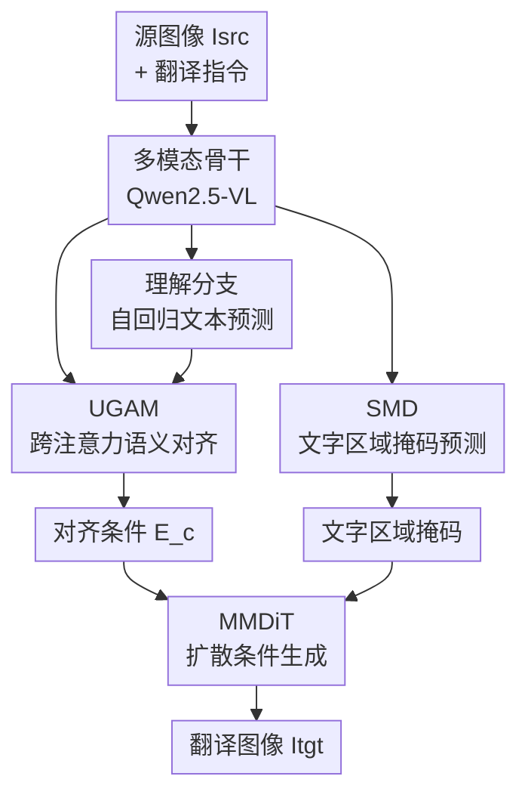

# UniTranslator: A Unified Multi-modal Framework for End-to-end In-Image Machine Translation

**会议**: ECCV 2026  
**arXiv**: [2606.24333](https://arxiv.org/abs/2606.24333)  
**代码**: 待确认（论文摘要声称开源）  
**领域**: 图像生成 / 多模态翻译  
**关键词**: 图像内机器翻译, 统一多模态模型, 理解-生成对齐, 空间掩码解码, 场景文字编辑

## 一句话总结
UniTranslator 提出统一多模态框架解决图像内机器翻译（IIMT），用理解-生成对齐模块（UGAM）在表示层面缓解翻意预测与视觉渲染之间的监督冲突，并用空间掩码解码器（SMD）提供像素级文字区域定位，在 Translatotron-V、IIMT30k、PRIM 三个基准上均取得 SOTA。

## 研究背景与动机

图像内机器翻译（In-Image Machine Translation, IIMT）的目标是将图片中的场景文字翻译为目标语言，并将翻译结果写回原文字区域，同时保持周围视觉外观不变。这项能力在多语言视觉沟通中有广泛应用，从旅游导览、增强现实到跨境电商，都需要语义准确且视觉自然的文字替换。目前多数 IIMT 系统采用级联管线（OCR 检测→机器翻译→图像编辑），这类方法虽然各环节单独可控，但误差会逐级累积——OCR 漏检导致翻译内容缺失，翻译输出与文字区域几何不匹配导致渲染错位，最终整体效果被最弱环节拖累。

近年来统一多模态模型（Unified Multimodal Models, UMMs）的发展为 IIMT 提供了新范式：将视觉-文字理解和图像生成整合在单一预训练框架中，理论上比专用管线更具跨语言、跨场景的泛化能力。GPT-Image-1 等闭源模型在 IIMT 上的强势表现也证实了这一范式的能力上限。然而，如图 1(a) 所示，将现有开源 UMM（如 Nano-Banana、Qwen-Image）直接迁移到 IIMT 上的效果远不能满足实际需求，暴露出两个关键瓶颈。第一是**理解-生成冲突**（Understanding-Generation Conflict）：理解分支自回归预测翻译文本时，同一个源表达可以对应多个合理译法（如"火锅烧烤"可以是 "Hot Pot & Barbecue" 或 "Hotpot Barbecue"），但生成分支看到的 Ground-Truth 只对应于其中一种具体渲染——于是理解分支学到的是"语义正确"，生成分支接到的却是"像素匹配"，训练信号冲突导致两方面都不够好。第二是**空间位置错位**：扩散模型天然偏向全局一致性，缺乏对文字区域边界的显式感知，即使翻译内容大体正确，渲染出的文字也可能被放到错误的相对位置甚至偏移出原始文字区域。

本文的核心洞察是：IIMT 的两个困难——语义一致性（"翻什么"）和空间精确性（"写在哪"）——可以在统一框架内分别设计专用模块来协同解决，而不是依赖纯数据驱动让模型自己摸索。**核心 idea：UniTranslator 在统一多模态框架中引入两个互补模块——理解-生成对齐模块（UGAM）用 cross-attention 将理解分支的语义表示软对齐到生成分支的条件空间，避免硬性的监督冲突；空间掩码解码器（SMD）以像素级的 BCE+Dice 损失监督文字区域掩码预测，为扩散生成提供精确的定位引导——两模块联合训练时翻译理解与图像生成形成双向增强，显著超越级联管线和其他统一模型。**

## 方法详解

### 整体框架

UniTranslator 以 Qwen2.5-VL 为多模态骨干、MMDiT 为扩散生成器，构建端到端 IIMT 框架。输入为源图像和翻译指令 prompt（如 "Translate all texts from Chinese to English"），经多模态骨干编码后产生共享的视觉-语言表示，然后分流到三条支路：理解分支做自回归解码输出翻译文本序列；UGAM 将理解分支的表示跨注意力对齐为生成兼容的条件嵌入；SMD 预测文字区域掩码。生成分支以对齐条件嵌入和文本条件为引导，在 Diffusion Transformer 中逐步去噪合成翻译后的目标图像。整体损失由三项加权求和组成：文本预测交叉熵损失、扩散生成损失、掩码 BCE+Dice 损失。

### 关键设计

**1. 理解-生成对齐模块（UGAM）：用软对齐消解语义-像素监督冲突**

UGAM 要解决的核心矛盾在于：理解分支的优化目标是语义准确的文本预测（交叉熵损失），生成分支的优化目标是像素匹配的去噪重建（扩散损失）——同一个源句子可以有多个正确的翻译变体，但生成分支看到的 GT 只有一种具体渲染，于是两条分支在优化方向上打架。这种冲突的本质是：理解表示是离散语义空间中的分布，而生成条件需要连续视觉空间中的嵌入，二者之间缺乏桥梁。

UGAM 的做法是将理解表示 E_und 作为 query、多模态表示 E_VL 作为 key 和 value，经过 cross-attention 和 MLP 变换，产出一个对齐后的条件嵌入 E_c = MLP(CrossAttn(E_und, E_VL, E_VL))。这个 E_c 不是硬性指示"必须生成某个特定词"，而是告诉生成分支"理解分支感知到的这段语义在视觉空间里应该对应怎样的条件分布"——相当于在表示层面做了软性的语义到视觉投影，让扩散过程的梯度不再因推理期生成的词与训练期 GT 词不一致而矛盾。实验证明，加上 UGAM 后 Structure-BLEU 从 9.00 跃升至 14.28（提升 59%），验证了软对齐策略的有效性。

**2. 空间掩码解码器（SMD）：像素级文字区域监督保障空间精确性**

即使语义对齐了，通用图像编辑模型仍可能在错误的相对位置渲染文字，如图 1(c) 所示。扩散模型在去噪过程中天然倾向于全局视觉连贯，如果不对文字区域的边界做显式约束，渲染结果往往会出现文字偏移、背景纹理被无意修改等问题。

SMD 的输入设计是以理解表示 E_und 为 query、视觉表示 E_V 为 key/value 做 cross-attention，将翻译感知的语义注入空间视觉特征，再通过反卷积解码出目标文字区域的二值掩码。损失函数采用 BCE 和 Dice 损失的加权组合，对该掩码做像素级的严格监督。这样一来，生成分支在扩散过程中同时看到两路信号：UGAM 提供的"要写什么语义"和 SMD 提供的"要在哪里写"，二者互补使模型既能准确切换背景与文字区域，又能保持非文字区域的视觉完整性。消融实验中单独启用 SMD 即把 Structure-BLEU 从 9.00 提升到 16.02，并改善了 SSIM，说明显式的空间监督对 IIMT 至关重要。

**3. 两阶段训练策略：渐进式适应避免预训练知识退化**

直接让预训练 UMM 从头端到端学习 IIMT 很容易破坏骨干模型的先验能力。UniTranslator 采用两阶段训练策略解决这一适应问题。Stage 1（模块预热）冻结 Qwen2.5-VL 和 MMDiT 骨干，只优化新引入的 UGAM 和 SMD，让这两个模块先学会稳定的跨模态桥接和掩码预测——相当于先在固定的特征空间里"搭桥"。Stage 2（联合微调）引入 LoRA 适配器（rank=64），联合微调 Qwen2.5-VL、UGAM、SMD 和 MMDiT 的注意力投影层，同时训练数据从 teacher-forcing（GT 翻译文本作为 UGAM 输入）切换到自回归解码预测——这一设计缩小了训练与推理之间的分布差异。

消融实验（表 6）清晰展示了分阶段训练的必要性：只用 Stage 1 的 BLEU 仅 12.53（完整模型 25.03），说明光有对齐模块没有端到端适应远远不够；只用 Stage 2 的 SSIM 接近完整模型但 BLEU 仅 15.08，说明跳过预热阶段的联合微调不能充分建立稳定的理解-生成接口。两个阶段结合才能同时获得翻译质量和图像保真度的最优结果。

### 一个完整示例：中文店招的多语言翻译

输入图像是一张中文餐饮店招，上面有手写艺术字"火锅烧烤"，翻译指令是"Translate all texts from Chinese to English"。首先 Qwen2.5-VL 编码器将图像和指令融合为多模态表示，理解分支自回归预测出英文翻译 "Hot Pot & Barbecue"。与此同时，UGAM 将理解分支的隐层表示与多模态表示做 cross-attention 对齐，生成一个包含了"这段语义在视觉空间里的对应"的条件嵌入 E_c。SMD 则根据理解表示和视觉表示预测出原文字区域的二值掩码（准确覆盖"火锅烧烤"这四个字的像素位置）。最后 MMDiT 扩散生成器以 E_c 和掩码为条件，逐去噪步生成最终图像：店招上"火锅烧烤"被替换为风格匹配的 "Hot Pot & Barbecue"，位置与原文字基本对齐，背景的墙体纹理和照明色调保持原样。

### 损失函数 / 训练策略

整体损失 ℒ_total = λ_und ℒ_und + λ_gen ℒ_gen + λ_mask ℒ_mask，其中 λ_und=0.1、λ_gen=1、λ_mask=0.1。ℒ_und 为翻译文本的自回归交叉熵损失；ℒ_gen 为 MMDiT 的速度参数化扩散损失；ℒ_mask = ℒ_BCE + ℒ_Dice。优化器 AdamW（weight decay 1e-4），bf16 混合精度，gradient checkpointing + 8 步梯度累积。Stage 1 学习率 1e-4，图像尺寸 256×256，batch size 32，训练 70 epoch。Stage 2 学习率 cosine schedule（峰值 1e-5，100 step warm-up），batch size 8，LoRA rank=64，训练 30 epoch。全部实验在 NVIDIA H800 上进行。

## 实验关键数据

### 主实验

**Translatotron-V 基准（De↔En）**

| 方向 | 模型 | BLEU | Structure-BLEU | SSIM |
|------|------|------|---------------|------|
| De→En | Translatotron-V（前SOTA） | 15.39 | 15.26 | 0.7832 |
| De→En | GPT-Image-1（闭源） | 20.75 | 16.01 | 0.7369 |
| De→En | **UniTranslator** | **25.03** | **24.86** | **0.8184** |
| En→De | Translatotron-V（前SOTA） | 13.23 | 12.92 | 0.7629 |
| En→De | GPT-Image-1（闭源） | 19.61 | 17.44 | 0.7528 |
| En→De | **UniTranslator** | **13.41** | **13.36** | **0.7887** |

> De→En 方向 UniTranslator 超越闭源 GPT-Image-1 和所有开源/专用模型；En→De 方向 BLEU 略低于 GPT-Image-1，但 SSIM 明显更高，表明图像保真度更好。在 Fr→En 和 Ro→En 方向上 UniTranslator 同样取得最优或接近最优结果。

**IIMT30k 基准（De↔En，真实场景）**

| 方向 | 评测集 | 模型 | BLEU | COMET(%) | FID |
|------|--------|------|------|-----------|-----|
| De→En | Valid | DebackX（前SOTA） | 14.9 | 51.2 | 20.4 |
| De→En | Valid | **UniTranslator** | **16.3** | **59.9** | **18.6** |
| De→En | Test | DebackX（前SOTA） | 12.8 | 50.0 | 9.0 |
| De→En | Test | **UniTranslator** | **14.7** | **59.8** | **8.9** |
| En→De | Valid | DebackX（前SOTA） | 14.6 | 42.2 | 19.5 |
| En→De | Valid | **UniTranslator** | **13.1** | **45.0** | **19.2** |

> UniTranslator 在四个子设置中的三个取得最佳 BLEU/COMET，FID 则全部最低（即生成图像质量最高）。COMET 分数的巨大提升（如 De→En Test 从 50.0 到 59.8）说明翻译的自然度和忠实度显著优于前 SOTA。

### 消融实验

| 配置 | Structure-BLEU | SSIM | 分析 |
|------|---------------|------|------|
| Baseline（去 UGAM 和 SMD） | 9.00 | 0.8081 | 直接统一训练效果差 |
| + UGAM | 14.28 | 0.8036 | 语义对齐提升翻译质量 |
| + SMD | 16.02 | 0.8138 | 空间监督提升结构与保真度 |
| **Full（UGAM+SMD）** | **24.86** | **0.8184** | 两者互补，效果大幅超越单独使用之和 |

| 训练策略 | BLEU | SSIM |
|----------|------|------|
| 仅 Stage 1（预热） | 12.53 | 0.7782 |
| 仅 Stage 2（联合微调） | 15.08 | 0.8148 |
| **完整两阶段** | **25.03** | **0.8184** |

### 关键发现

- UGAM 和 SMD 的角色高度互补：UGAM 主要提升语义一致性（Structure-BLEU 从 9.00 到 14.28），SMD 则同时提升结构和保真度（从 9.00 到 16.02），二者合用时出现超加法增益（24.86）。原因可能是 UGAM 对齐后的语义条件使 SMD 的掩码预测更容易学到"理解分支认为哪些区域有语义"的对应关系。
- 两阶段训练中 Stage 1 对 BLEU 的贡献高达近 10 个点，Stage 2 对 SSIM 略有改进但对 BLEU 贡献相对较小——说明"先搭桥"是翻译质量的基石。
- 理解与生成之间存在双向协同增强：在生成任务中加入理解损失，Structure-BLEU 从 16.57 升到 25.03；在理解任务中加入生成损失，BLEU 从 25.70 升到 34.71。这是本文最有趣的发现之一——IIMT 的翻译理解和图像生成不是零和竞争，而是在统一优化下互相促进。

## 亮点与洞察

- **UGAM 的"软对齐"思路巧妙**：不是强行让理解分支的输出与某个具体渲染字符串对齐，而是在表示层面做投影，让生成分支"感知语义分布"——这种软约束避免了硬性监督冲突，且对翻译的多义性天然鲁棒。
- **结构-BLEU 指标值得关注**：通过 OCR 框的 IoU 匹配再算 BLEU，同时考核了翻译内容和空间定位——比单独报 BLEU 更有 IIMT 任务针对性。论文在附录中给出了该指标的完整算法。
- **发现了理解与生成的互相增强效应**：这不是普通的多任务学习，而是两条分支在统一框架下确实从彼此受益——这对其他涉及理解+生成的统一模型（如视觉问答、文生图编辑）有启发意义。
- **两阶段训练的分工设计实用**：Stage 1 免费对齐 + Stage 2 联合适应 + 推理期预测与训练期 GT 的分布差距缩小，这种设计思路可以迁移到其他对预训练 UMM 做任务微调的场景。

## 局限与展望

- **显存开销大（50G）**：远高于级联管线的 1.8G，虽然每张图推理速度（9.51 秒）比 Translatotron-V（17.25 秒）快，但显存需求限制了部署场景。作者归因于大尺寸多模态骨干和生成模块，留待未来优化。
- **高度风格化字体效果不佳**：对于涂鸦侵蚀、霓虹发光手写体、复杂背景等极端情况，模型能基本定位文字区域并生成语义正确的翻译，但难以保持精细的字体属性（笔画侵蚀程度、发光强度、手写变形等）。
- **低资源语言方向仍有差距**：从 PRIM 基准的结果看，捷克语（CS）、俄语（RU）等低资源语种上 UniTranslator 并非最优，可能受限于 Qwen2.5-VL 对这些语言的预训练支持不足。
- **UGAM 对推理期预测质量的依赖**：Stage 2 联合微调后 UGAM 使用自回归预测代替 GT 文本，这意味着理解分支的预测质量直接决定生成质量——翻译一旦错译，生成阶段无法纠偏。与级联管线相比，这反而是端到端模型的一个天然局限。

## 相关工作与启发

- **vs Translatotron-V**：前者是专门为 IIMT 设计的端到端模型（引入目标文本解码器和图像 tokenizer），但未解决理解-生成冲突。UniTranslator 在其基础上增加了 UGAM 和 SMD，用显式对齐和空间监督替代了纯数据驱动的隐式学习，在 De→En 上 BLEU 从 15.39 提升到 25.03。
- **vs DebackX**：DebackX 将源图像显式分解为背景和文字图像两部分，分别处理后再融合。UniTranslator 不做显式分解而是通过 SMD 做隐式区域定位，无需中间背景重建步骤，在 IIMT30k 上 COMET 从 51.2 提升到 59.9。
- **vs GPT-Image-1 / Nano-Banana 等闭源 UMM**：这些模型在 IIMT 上已有一定能力，但 UniTranslator 通过引入任务特化模块（UGAM+SMD）显著超越了它们的 S-BLEU 和 SSIM，说明通用的理解和生成能力经有针对性的对齐设计后可以更好地服务 IIMT。
- **启发**：UGAM 的跨模态对齐思路可以自然迁移到其他"理解→生成"类的任务（论文已验证了在通用场景文字编辑 TextEditBench 上的可迁移性）。SMD 的像素级区域监督本质上是一种空间引导注入方法，对于扩散模型的局部可控编辑任务（如目标移除、风格迁移中的区域保留）有参考价值。

## 评分

- 新颖性: ⭐⭐⭐⭐ UGAM 的"软对齐"思路和发现理解-生成互相增强效应是亮点，但两个模块本身是 cross-attention + mask decoder 的组合，不算颠覆性创新
- 实验充分度: ⭐⭐⭐⭐⭐ 在三个基准（合成、真实、多语言）上做了详尽的定量实验，消融充分（逐模块 + 逐阶段），还验证了双向协同和零样本泛化，附录含效率对比和失败案例分析
- 写作质量: ⭐⭐⭐⭐ 动机清晰，问题刻画到位（图 1 的冲突示意图帮助很大），但方法描述偏公式化，部分实验结果散布在多表中不易快速对比
- 价值: ⭐⭐⭐⭐ IIMT 是一个实用价值明确但被低估的任务，UniTranslator 为 UMM 做 IIMT 提供了一个有效的通用框架设计，且验证了理解与生成的可协同性，对领域有实际推动

<!-- RELATED:START -->

## 相关论文

- [\[ECCV 2026\] MIMFlow: Integrating Masked Image Modeling with Normalizing Flows for End-to-End Image Generation](mimflow_integrating_masked_image_modeling_with_normalizing_flows_for_end-to-end_.md)
- [\[ICCV 2025\] End-to-End Multi-Modal Diffusion Mamba](../../ICCV2025/image_generation/end-to-end_multi-modal_diffusion_mamba.md)
- [\[ECCV 2026\] Dual-End Consistency Model](dual-end_consistency_model.md)
- [\[ICML 2026\] End-to-End Autoregressive Image Generation with 1D Semantic Tokenizer](../../ICML2026/image_generation/end-to-end_autoregressive_image_generation_with_1d_semantic_tokenizer.md)
- [\[CVPR 2026\] DeCo: Frequency-Decoupled Pixel Diffusion for End-to-End Image Generation](../../CVPR2026/image_generation/deco_frequency-decoupled_pixel_diffusion_for_end-to-end_image_generation.md)

<!-- RELATED:END -->
