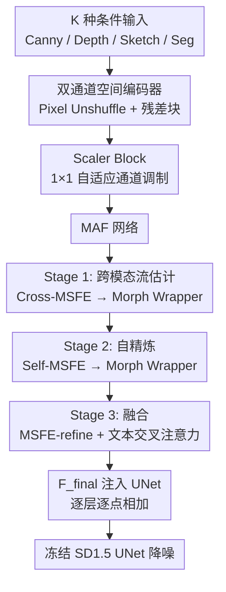

# UNITY: Attention Flow Networks for Adaptive Conditioning in Diffusion

**会议**: ECCV 2026  
**arXiv**: [2606.20971](https://arxiv.org/abs/2606.20971)  
**代码**: [https://github.com/arya-domain/UNITY](https://github.com/arya-domain/UNITY)  
**领域**: 扩散模型 / 图像生成  
**关键词**: 可控图像生成, 复合条件, 注意力流, 特征对齐, 扩散模型适配器

## 一句话总结
UNITY 提出一种 Universal-to-Specialized 两阶段训练范式和 Morphable Attention Flow 网络，用一个固定参数量的适配器同时支持多模态复合条件控制，训练成本降低 37.5%，FID/CLIP 全面超越 ControlNet、Uni-ControlNet 等方法。

## 研究背景与动机

基于扩散模型的文本到图像生成已经能够通过各类适配器（ControlNet、T2I-Adapter、CtrLoRA 等）实现基于边缘图、深度图、草图、分割图等多种信号的精细控制。然而现实应用场景往往同时需要多个条件信号协同约束生成结果——例如既要深度图保证几何结构、又要分割图明确物体位置、还要文本描述指定风格——这种复合条件控制（composite conditioning）正在从选项变为刚需。现有方法针对每种条件独立训练一个适配器，随着条件模态数量的增加，训练代价和参数量呈线性增长；即使是目前最接近统一的 Uni-ControlNet，其参数量也达到 1271.42M，是单条件 ControlNet 的 3.5 倍，GPU 内存需求高达 8 倍。

这种线性扩展的核心矛盾在于：现有的适配器架构缺乏跨模态共享语义的机制，每个条件从头学习自己的特征空间，既导致冗余，又无法利用多模态之间的互补信息。更深层的问题在于，即使对单个条件，ControlNet 系列的并行降噪路径（parallel denoising path）也会显著增加推理延迟，而注意力机制本身对细粒度的空间对应关系建模不够，无法精确地将外部条件信号的几何结构对齐到潜空间表示中。

本文的核心 idea 是**把多条件适配器的训练分解为「通用表征学习 + 个性化精调」两个阶段，用可学习的流场（learnable flow fields）替代注意力对齐来实现精确的空间对应——Universal Stage 让模型在所有条件上联合学习共享语义，Specialization Stage 再用一半的训练步数逐条件精调；配套的 Morphable Attention Flow 网络通过可微位移场和注意力加权的可变形采样，在不对骨干网络做任何复制的前提下实现通道感知且空间自适应的特征对齐。**

## 方法详解

### 整体框架

UNITY 是一个即插即用的适配器模块，附着在冻结的 Stable Diffusion 1.5 UNet 骨干上工作。其核心设计包括两个耦合部分：**两阶段训练范式**和 **Morphable Attention Flow (MAF) 网络**。

两阶段训练范式的核心是颠覆「每种条件独立训练」的传统。给定 K 种条件模态，将总计 N 步训练分成两半：前半 N/2 步为 Universal Stage，模型同时接收所有 K 种条件的输入，在共享参数中学习跨模态的联合表示；后半 N/2 步为 Specialization Stage，模型轮流用每种条件单独精调 K 次（仍然只用 N/2 步的总步数）。总训练代价为 N/2 + K × (N/2) / K = N 步等价，而传统独立训练需要 K × N 步——当 K=4 时恰好节省 37.5%。

MAF 网络则是支撑这套范式的架构创新，它由双通道空间编码器（Dual Spatial Encoders）、多尺度流估计器（Multi-Scale Flow Estimator, MSFE）和形态封装器（Morph Wrapper）三级组成，负责把各类条件信号转化为与 UNet 多尺度特征兼容的结构化引导信息。

### 关键设计

**1. 双阶段训练范式：通用化再专门化**

这是 UNITY 最根本的策略性创新。传统做法的隐含假设是每种条件必须独占一套参数才能达到最优效果，但 UNITY 通过实验证明：条件信号之间存在大量的共享结构信息（如边缘轮廓、深度边界、分割区域都描述了场景的空间布局），这些信息完全可以在一个统一空间中学习。Universal Stage 把 K 种条件的图像堆叠成通道数为 3K 的大张量输入（例如 4 种条件就是 12 通道），强制模型找到它们之间的共同表征；Specialization Stage 则让模型在这个共享基础上微调各条件的特异性细节。关键巧妙之处在于这两个阶段没有用先后连接、也没有级联的重训练——Universal 结束后，直接在它的检查点上轮流做 K 次精调，每次精调只用 N/2K 步，最后将 K 个精调版本融合。这种设计使得总训练代价与 K 无关恒定为 N 步，且推理时只需一次适配器前向，不需要每条条件走一条独立的降噪路径。

**2. Morphable Attention Flow (MAF) 网络：可学习的流场对齐**

MAF 是 UNITY 实现精确空间对齐的架构引擎，解决的是「注意力机制无法建模精细几何对应」这个深层问题。传统做法用交叉注意力做特征融合，但交叉注意力的权重是全局软对齐，对于需要亚像素级位置精度的条件信号（如边缘图必须恰好落在对应轮廓位置）来说不够细粒度。MAF 的思路是引入可变形特征对齐中的「位移场」概念——但它不是在图像空间做 warp，而是在 UNet 每一级的特征空间做 warp。具体流程分三步：首先 Cross-MSFE 把双通道编码器的两组特征金字塔拼接后估计出一个跨模态位移场 ∆cross 和对应的注意力权重 Across，Morph Wrapper 据此做可微双线性采样把第一路的特征 warp 到第二路的空间坐标系中；然后 Self-MSFE 在跨模态对齐后的特征上再做一次自我精炼，产生自精炼位移场 ∆self，让特征内部的结构关系更一致；最后 refinement MSFE 融合跨模态和自精炼两路特征，经过文本嵌入的交叉注意力注入语义信息后，输出最终的引导特征。

**3. Morph Wrapper：可变形注意力采样**

Morph Wrapper 是 MAF 中的实际操作单元，它不像标准可变形注意力那样用固定的偏移模式，而是让 MSFE 为每个空间位置生成 M 个采样点的偏移量 ∆ 和对应的注意力权重 A。给定源特征 P 和 MSFE 输出的 Z（包含 ∆ 和 A），首先用 GridSample 按每个采样点的偏移量在 P 上做双线性采样得到 M 组 warp 后的特征 P'_m，然后通过 softmax 归一化的注意力权重做加权求和得到最终的 warp 特征。这个机制在数学上等价于一个可微的空间变换网络——梯度可以直接流过偏移量回传到 MSFE 中，让 MSFE 学会根据条件信号的几何特征自适应地调整采样位置。相比纯注意力，Morph Wrapper 的优势在于它显式编码了「从哪里取、怎么融合」的空间变换信息，而注意力只能回答「和谁的相关性高」。

### 损失函数 / 训练策略

UNITY 没有引入新的损失项，直接采用 Stable Diffusion 的标准噪声预测损失（noise prediction objective）。优化器使用 AdamW，学习率恒定为 5×10⁻⁶，β₁=0.9，β₂=0.999，权重衰减 1×10⁻²，前 500 步线性预热后转恒定。训练 100k 步（Universal 50k + Specialization 50k），在 MS-COCO 2017 和 MultiGen-20M 上训练。推理时适配器不引入任何并行降噪路径，特征以逐点相加方式注入冻结 UNet 的各级编码器。

## 实验关键数据

### 主实验

| 条件 | 指标 | ControlNet | Uni-ControlNet | UNITYPre | 提升 |
|------|------|-----------|---------------|-------------------|------|
| Canny | FID↓ / CLIP↑ | 22.84 / 27.41 | 23.11 / 27.21 | **21.48 / 28.52** | -6.0% FID / +4.0% CLIP vs CN |
| Depth | FID↓ / CLIP↑ | 25.68 / 27.51 | 24.92 / 27.43 | **22.44 / 28.18** | -12.6% FID vs Uni-CN |
| Sketch | FID↓ / CLIP↑ | 24.93 / 27.38 | 24.56 / 27.54 | **23.21 / 28.54** | -5.5% FID vs Uni-CN |
| Segmentation | FID↓ / CLIP↑ | 27.06 / 27.04 | 25.33 / 27.49 | **23.91 / 27.91** | -11.6% FID vs Uni-CN |

SD1.5 上 UNITYPre 以 365.25M 参数、24×1 显存消耗，在全部 4 个条件上取得最优 FID/CLIP，平均 FID 22.76、CLIP 28.29，比次优的 Uni-ControlNet（24.48 FID、27.42 CLIP）分别提升 7.03% 和 3.17%。对比 Uni-ControlNet 的 1271.42M 参数和 24×8 显存，UNITY 的参数效率高出 4.72 倍。SDXL 骨干上趋势一致，Canny FID 从 ControlNet 的 23.75 降至 20.35（-14.32%），CLIP 从 31.71 提升至 32.18。

### 消融实验

| 配置 | Sketch FID | Seg FID | 说明 |
|------|-----------|--------|------|
| Full model (UNITYPre) | **23.21** | **23.91** | 完整模型 |
| Cross-modal Flow w/ Cross-Attention | 25.35 | 26.29 | 流估计换成标准交叉注意力，FID 升 9.2% |
| Self-refinement w/ Self-Attention | 25.88 | 26.75 | 自精炼换成自注意力 |
| w/o Text Cross-Attention | 24.73 | 25.65 | 去掉最终文本交叉注意力，CLIP 降 6.6% |
| Single Spatial Encoder | 26.40 | 27.38 | 单通道编码器替代双通道 |
| w/o Universal Stage (UNITYInd) | 24.38 | 25.18 | 跳过 Universal，直接独立训练 |

### 关键发现

- **流对齐显著优于注意力对齐**：将 MAF 的流估计替换为标准交叉注意力后，Sketch 的 FID 从 23.21 升至 25.35（+9.2%），说明显式建模空间对应关系的优越性；Self-warp 换成 Self-attention 也同样掉点。
- **Universal Stage 是关键**：跳过 Universal Stage 的 UNITYInd 在 4 个条件上的平均 FID 比 UNITYPre 高 5.22%，且两条件预训练 < 三条件 < 全四条件，模态多样性越丰富预训练效果越好。
- **无文本提示的极端设定下鲁棒性突出**：当完全移除文本提示（即仅靠条件信号生成图片），UNITY 的 FID 仅升至 28.83 / 30.08，而 ControlNet 飙升至 38+，说明 Universal Stage 让模型学到了内化的结构先验。

## 亮点与洞察

- **两阶段训练范式是一个可以广泛复用的设计模式**：不只针对扩散适配器，凡是存在「先学通用再学专用」场景的任务（如多任务学习、多语言模型），都可以考虑这种先联合训练再逐任务精调的廉价策略——关键约束是 Universal Stage 能找到有意义的共享表征空间。
- **用可微流场做跨模态特征对齐**：这个思路将光流网络中「像素级的位移估计」搬到了 UNet 潜空间的多尺度特征金字塔上，结合注意力加权的可变形采样，比标准交叉注意力更准确地保留了条件信号的几何结构。这一设计可以迁移到任何需要将外部结构信息注入生成/理解骨干的场景。
- **双通道编码器设计的价值**：消融实验显示 Single Spatial Encoder 掉点最多（FID +3.19），说明双路并行处理能捕获互补的结构语义，而非简单的参数量翻倍能解释。

## 局限与展望

- 实验仅在 SD1.5 和 SDXL 两个骨干上验证，未测试在 DiT 架构（如 PixArt-α、FLUX）上的兼容性——MAF 的流对齐机制是否可以无缝迁移到纯 Transformer 骨干有待验证。
- 条件模态的复合效果缺乏系统研究：论文测试了单条件性能，但没有深入分析当多个条件同时输入且存在冲突时（如深度图和分割图给出不一致的物体边界）模型如何权衡。
- 两阶段训练中的 Specialization Stage 轮流精调 K 次再融合的做法比较粗放，是否有比简单融合更优雅的方式（如通过知识蒸馏或 MoE 层动态选择精调权重）值得探索。

## 相关工作与启发

- **vs ControlNet / T2I-Adapter**：它们为每个条件独立训练完整适配器，参数量和训练成本按条件数线性增长；UNITY 用两阶段训练和 MAF 网络实现了常数复杂度，且 FID/CLIP 全面超越。
- **vs Uni-ControlNet**：目前最接近的统一适配器方案，但参数量 1271.42M、显存需求 24×8，且没有跨模态共享学习机制；UNITY 在 365.25M 参数、24×1 显存下做到更好效果。
- **vs Composer / UniCombine**：这些方法通过 Product-of-Experts 或条件 token 拼接实现多条件融合，但要么需要重新设计骨干，要么不支持高效训练；UNITY 作为即插即用适配器，与骨干解耦。

## 评分
- 新颖性: ⭐⭐⭐⭐☆ 两阶段训练范式简洁有力，MAF 用流场做特征对齐的设计有启发意义，但整体思路在可控生成的框架内属于增量创新。
- 实验充分度: ⭐⭐⭐⭐⭐ 在 SD1.5 和 SDXL 两个骨干上做了 4 种条件的完整消融，额外补充了 4 种条件的泛化实验和无文本提示的极端设定分析，实验设计全面扎实。
- 写作质量: ⭐⭐⭐⭐☆ 方法论描述清楚，算法流程和公式完备。但正文引用的「Fig. 1/2/3/4」在 arXiv 预印本中因渲染问题部分不可见，影响阅读体验。
- 价值: ⭐⭐⭐⭐⭐ 对于需要多条件控制的生成应用场景（如设计工具、游戏资产制作），训练成本降低 37.5% 且参数量不随条件增长是实质性的工程收益。

<!-- RELATED:START -->

## 相关论文

- [\[ECCV 2026\] Rethinking Garment Conditioning in Diffusion-based Virtual Try-On: Decouple, Don't Denoise](rethinking_garment_conditioning_in_diffusion-based_virtual_try-on_decouple_dont_.md)
- [\[ECCV 2026\] Curvature-Adaptive Consistency Flow Matching: Autonomous Trajectory Optimization via Reinforcement Learning](curvature-adaptive_consistency_flow_matching_autonomous_trajectory_optimization_.md)
- [\[CVPR 2026\] Precise Object and Effect Removal with Adaptive Target-Aware Attention](../../CVPR2026/image_generation/precise_object_and_effect_removal_with_adaptive_target-aware_attention.md)
- [\[ICML 2026\] AdaEraser: Training-Free Object Removal via Adaptive Attention Suppression](../../ICML2026/image_generation/adaeraser_training-free_object_removal_via_adaptive_attention_suppression.md)
- [\[ICLR 2026\] Rethinking Global Text Conditioning in Diffusion Transformers](../../ICLR2026/image_generation/rethinking_global_text_conditioning_in_diffusion_transformers.md)

<!-- RELATED:END -->
