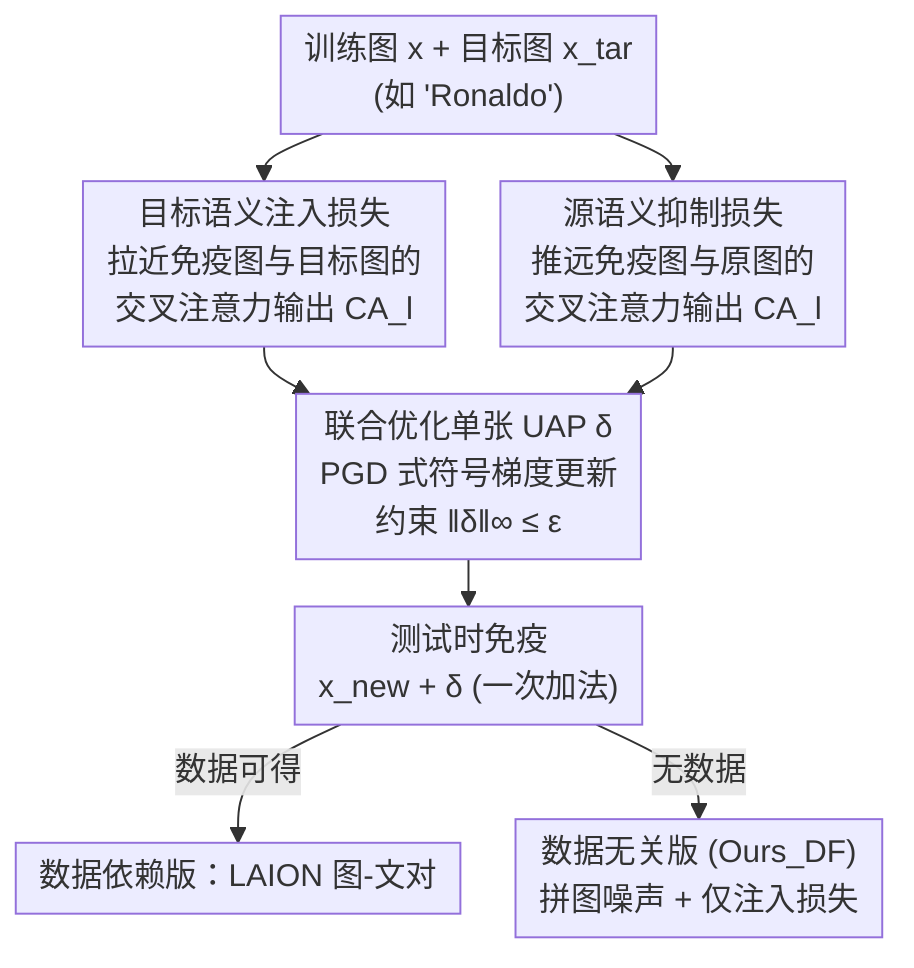

# Universal Image Immunization against Diffusion-based Image Editing via Semantic Injection

**会议**: ECCV 2026  
**arXiv**: [2602.14679](https://arxiv.org/abs/2602.14679)  
**代码**: [https://ChanhuiLee1111.github.io/Universal-Immunization](https://ChanhuiLee1111.github.io/Universal-Immunization)  
**领域**: 扩散模型 / 图像生成安全  
**关键词**: 图像免疫, 通用对抗扰动, 扩散编辑防御, 语义注入, 交叉注意力

## 一句话总结
针对扩散模型恶意编辑，本文训练**一张与图像无关的通用对抗扰动（UAP）**，通过「注入目标语义 + 抑制源语义」两个损失让扩散模型把被保护图误认成某个目标概念（如把狗看成「Ronaldo」），从而在测试时只需一次加法就能阻断非法编辑，推理开销近乎为零。

## 研究背景与动机
扩散模型让文本引导的图像编辑变得又快又强，但也顺手打开了 deepfake、身份伪造、盗用版权内容的大门。学界的主流防御思路是「图像免疫」——往原图里嵌入人眼几乎不可见的对抗扰动，破坏潜在的编辑过程，让恶意用户即使拿到图也编不出可用结果。从 PhotoGuard 的 encoder/diffusion 级攻击，到 Semantic Attack、AdvPaint 这类操纵交叉注意力或中间表示的方法，防御强度确实在提升。但它们几乎清一色是 **image-specific** 的：每来一张图都要在推理时跑一遍昂贵的逐图优化，动辄几百上千秒、还得占用大显存的 GPU。这个「部署瓶颈」直接把免疫技术挡在了真实世界的延迟与算力约束之外。

有人试图用 optimization-free 的路子（如 FastProtect、DiffVax）绕开逐图优化，改用预训练的扰动生成器或融合模块一次前向出扰动。计算是省了，但仍旧依赖额外的神经网络和 GPU 加速，内存开销不小，在资源受限场景下依然难以规模化，而且对强 image-specific 方法往往还有性能差距。另一条在分类领域被验证有效的路子是**通用对抗扰动（UAP）**——一张扰动打天下、把成本摊薄到所有输入上。可 UAP 在扩散编辑防御里几乎无人问津，通行的直觉是「通用必然弱」：一张扰动要同时骗过千差万别的所有图，保护强度势必打折扣。

本文的切入角度是把分类领域里的**定向 UAP（targeted UAP）**迁移到扩散编辑防御上。定向 UAP 的思路是「让所有输入都被推向同一个目标标签」，本文把它翻译成扩散语境：与其笨拙地「破坏」原图语义，不如主动往图里**注入一个目标概念**，让扩散模型在编辑时误以为这张图本来就是那个目标（例如狗被当成「Ronaldo」），于是编辑结果彻底偏离原内容、失去可用性。**核心 idea：训练一张与图像无关的定向 UAP，用「目标语义注入损失」把目标概念写进交叉注意力输出、同时用「源语义抑制损失」抹掉原内容，测试时只做一次加法 $x+\delta$ 就完成免疫，实现近零成本、跨模型可迁移的可规模化防御。**

## 方法详解

### 整体框架
输入是任意待保护图像 $x$，输出是免疫图 $x+\delta$，其中 $\delta$ 是**一次性训练、全数据集共享**的通用扰动。方法的核心是想让扩散模型「看走眼」：把被保护图理解成某个预设的目标概念（target），而不是它真正的内容。为此训练阶段用一个代理扩散模型（Stable Diffusion V1.5）和一张目标图 $x_{tar}$（如用「a photo of Ronaldo」生成），在交叉注意力这个「文本语义写进图像」的关键通道上做文章：一边把免疫图的注意力响应拉向目标图（注入），一边把它推离原图自身（抑制）。两个损失联合优化出 $\delta$ 后，测试时对任何新图直接相加即可，无需任何逐图优化或额外网络。

作者刻意把优化落点选在**交叉注意力输出 $\text{CA}_l = A_l V_l$** 而非注意力图 $A_l$ 上：因为在 U-Net 的残差更新里，条件信号只通过 $W_l^{CA}\text{CA}_l$ 这一项影响潜变量，真正「写进」隐状态的语义内容由 $V_l$ 承载并经 $\text{CA}_l$ 传播；而 $A_l$ 只决定「注意力落在哪些 token」，不编码被注入的语义内容，单动它只能改变 token 选择却控制不住注入的语义。整条 pipeline 是「训练一次 → 到处加」，测试端是纯加法。

### 关键设计

**1. 目标语义注入损失：让扩散模型把源图误认成目标概念**

传统免疫是「破坏」原图语义，本文反其道而行——主动往图里**塞进**一个目标概念，让扩散模型在编辑时以这个目标为条件生成，结果自然与真实源内容无关。具体做法是：让被 UAP 扰动、并以目标 prompt 为条件的免疫图，其交叉注意力响应去逼近「真·目标图」在同一 prompt 下的响应。为了在多个空间尺度上都对齐，作者聚合了 U-Net 所有中间块的交叉注意力输出。损失定义为

$$\mathcal{L}_{\text{inj}} = \sum_{\ell=1}^{L} \left\| \text{CA}_l\big(\Phi^\ell(\mathcal{E}(x+\delta)),\ t_{tar}\big) - \text{CA}_l\big(\Phi^\ell(\mathcal{E}(x_{tar})),\ t_{tar}\big) \right\|_2^2$$

其中 $\Phi^\ell$ 是 U-Net 第 $\ell$ 个中间块后的特征图，$\mathcal{E}$ 是 VAE 编码器，$t_{tar}$ 是目标 prompt 的 CLIP 文本嵌入。这么做的巧妙之处在于：它不要求编辑结果「长得像」目标（那太难也没必要），只要原图语义被搅乱到无法忠实保留，就足以让恶意的图到图编辑失败。作者用交叉注意力可视化佐证了这一点——免疫图的注意力图不再落在自身内容（如「cow」「people」），而是尖锐地聚焦到目标「Ronaldo」上，几乎复刻了目标图的注意力模式。

**2. 源语义抑制损失：把原内容从注意力里主动抹掉**

只注入目标还不够：如果原图语义太顽固，注入的目标可能被「稀释」。作者借鉴对抗攻击里「最小化目标标签交叉熵、同时最大化非目标标签」的经验，设计了一个方向相反的损失，去**最大化**免疫图与原图在交叉注意力输出上的差异：

$$\mathcal{L}_{\text{sup}} = -\sum_{\ell=1}^{L} \left\| \text{CA}_l\big(\Phi^\ell(\mathcal{E}(x+\delta)),\ t\big) - \text{CA}_l\big(\Phi^\ell(\mathcal{E}(x)),\ t\big) \right\|_2^2$$

注意这里条件用的是原图自己的 prompt $t$（而非目标 prompt），负号让优化去「拉开」两者距离，等于把原图语义在扩散模型眼里的痕迹主动擦淡。它和注入损失是一对拮抗：$\mathcal{L}_{\text{inj}}$ 把免疫图朝目标语义拽，$\mathcal{L}_{\text{sup}}$ 把它从源语义推开，两者联合优化 $\delta^* = \arg\min_\delta \mathbb{E}_{(x,t)\sim\mathcal{D}_p}[\mathcal{L}_{\text{inj}}+\mathcal{L}_{\text{sup}}]$（约束 $\|\delta\|_\infty\le\epsilon$），从而在「注入更强的目标 + 擦除残留的源」两头同时发力，得到更彻底的定向攻击。消融显示，加上抑制损失后黑盒迁移与鲁棒性都进一步提升。

**3. 数据无关（data-free）扩展：一张目标图也能训出可用 UAP**

现实里未必拿得到真实训练图或目标域先验。作者指出注入损失的设计本身就与「输入是什么」无关——它只关心把任意图的注意力拉向目标——所以天然适合无数据场景。做法是仿照 TRM-UAP 等数据无关攻击，用**随机拼图（jigsaw puzzle）噪声**当合成训练样本（并加均值滤波平滑拼接边、配合从简到繁的课程学习逐步增加复杂度），此时**只用目标语义注入损失** $\mathcal{L}_{\text{inj}}$ 优化 $\delta$（丢掉需要原图 prompt 的抑制损失）。这样仅凭一张目标图、不碰任何真实数据，就能训出一张能防住多样输入恶意编辑的定向 UAP。实验里这个 data-free 变体（$\text{Ours}_{DF}$）在多数指标上仍排到第二好，逼近甚至超过部分 image-specific 方法，凸显了方法在极端受限条件下的实用性。

### 损失函数 / 训练策略
训练用 PGD 式的符号梯度上升：初始化 $\delta\sim U(-\epsilon,\epsilon)$，对每个 (图, prompt) 在时间步集合 $K=\{5,10,15,20,25\}$ 上给干净图、免疫图、目标图分别加前向噪声，累加 $\mathcal{L}_{\text{inj}}+\mathcal{L}_{\text{sup}}$ 的梯度，再 $\delta \leftarrow \delta - s\cdot\text{sign}(\text{grad})$ 并裁剪回预算内。关键超参：攻击步长 $s=1/255$，扰动预算 $\epsilon=10/255$（比 image-specific 方法常用的 $16/255$ 更小，因为一张扰动要泛化到所有图、必须更克制以控可见伪影），训练 20 epoch，推理步数 50、guidance scale 7.5。本质上是把 Semantic Attack 的逐图优化策略**扩展成数据集级的单扰动学习**——从「每张测试图各优化一个扰动」改成「全数据集共训一个 $\delta$」。

## 实验关键数据

### 主实验
代理模型为 SD V1.5，评测在自建的 500 张图（10 类 × 50 张）编辑数据集 $D_E$ 与真实图 ImageNet-Edit 上；指标含 PSNR / SSIM / VIFp / FSIM（越低越好，说明编辑结果偏离越大）、LPIPS（越高越好）、以及 CLIP 特征相似度 Feat. Sim.(C)（越低越好，说明编辑结果越不依赖源图）。

白盒下与「通用化基线」（把 image-specific 方法搬到 UAP 设定）对比（Table 1）：

| 方法 | PSNR↓ | SSIM↓ | VIFp↓ | LPIPS↑ | Feat.Sim.(C)↓ |
|------|------|------|------|------|------|
| Encoder（通用化）| 16.55 | 0.482 | 0.154 | 0.452 | 0.708 |
| Embedding（通用化）| 15.80 | 0.378 | 0.117 | 0.548 | 0.696 |
| Map（通用化）| 16.16 | 0.468 | 0.152 | 0.465 | 0.704 |
| $\text{Ours}_{DF}$（无数据）| 14.68 | 0.378 | 0.106 | 0.557 | 0.685 |
| **Ours（完整）** | **14.19** | **0.332** | **0.082** | **0.606** | **0.673** |

与 image-specific / optimization-free 方法比效率与效果（Table 4，白盒 SD V1.5）：本文在多数免疫指标上**反超**需要逐图优化的 EA/DA/SA 和 opt-free 的 FP，且不可感知性（DISTS/LPIPS）相当或更好——尽管本文处在「通用 + 更小预算」的更难设定下。测试成本对比是最直观的杀伤：

| 方法 | 输入自适应 | 单图延迟 CPU/GPU (秒) | GPU 显存 (GB) |
|------|:---:|------|------|
| EA [42] | ✓ | 315.71 / 8.01 | 6.51 |
| DA [42] | ✓ | 2706.84 / 212.46 | 30.84 |
| SA [27] | ✓ | 2216.13 / 55.66 | 9.08 |
| FP [2]（opt-free）| ✓ | 2.76 / 0.04 | 0.77 |
| **Ours** | ✗ | **≈0 / ≈0** | **0** |

黑盒可迁移性（Table 2/5）：以 SD V1.5 为代理，直接迁移到 SD V1.4 / V2.0 / InstructPix2Pix，本文在多数指标上仍稳定优于通用化基线与 image-specific 方法，说明语义注入带来的扰动跨模型泛化强。

### 消融实验
逐损失消融（Table 9，跨 4 个模型的黑盒/白盒；以 SD V1.5* 白盒为例）：

| 配置 | PSNR↓ | LPIPS↑ | Feat.Sim.(C)↓ | 说明 |
|------|------|------|------|------|
| $\text{Inj}_{DF}$ | 14.68 | 0.557 | 0.685 | 仅注入损失 + 无数据 |
| Inj | 14.41 | 0.585 | 0.680 | 注入损失 + 真实数据 |
| Inj+Sup | **14.19** | **0.606** | **0.673** | 完整（加源语义抑制）|

目标无关性（Table 10）：换 Ronaldo / Tiger / Sunflower / Peacock / Mandala 五个差异极大的目标，各指标标准差都很小（如 SSIM 均值 0.332、std 0.029），证明方法对目标概念的选择不敏感。鲁棒性（Table 3）：面对 JPEG 压缩、GrIDPure、Conditional DiffPure、Noisy Upscaling 四种净化（后两者是「知晓本文机制」的自适应防御），本文仍稳定压过通用化基线。

### 关键发现
- **抑制损失是「锦上添花」而非「雪中送炭」**：从 $\text{Inj}_{DF}$ 到 Inj 的提升来自真实数据；再到 Inj+Sup 的提升来自抹除残留源语义，主要改善黑盒迁移与抗净化鲁棒性。三者（注入 / 真实数据 / 语义解耦）作用互补。
- **优化落点选 $\text{CA}_l$ 而非 $A_l$ 是理论驱动的**：只有交叉注意力输出承载被注入的语义内容，实测在 $\text{CA}_l$ 上操纵比在 $A_l$ 上语义效果显著更强。
- **通用不等于弱**：即便一张扰动打所有图、预算还更小（$10/255$ vs $16/255$），性能仍能反超逐图优化方法，颠覆了「universal 必然掉点」的常识。

## 亮点与洞察
- **把「破坏」换成「注入」是最妙的一招**：以往免疫都在想办法搅乱原图，本文换个思路主动写进一个假身份，让模型自愿编错——攻击目标从「让它失败」变成「让它成功地编错东西」，反而更稳定、更好迁移。
- **测试端只有一次加法**，把免疫的边际成本压到近乎零、零显存、无需 GPU，这对「给海量用户图批量加保护」的真实部署是质变。
- **定向 UAP 从分类迁移到生成的桥搭得很实**：不是硬套，而是精确定位到「交叉注意力输出才是语义写入点」这一扩散模型特性，理论与消融都自洽。
- 数据无关变体只靠拼图噪声 + 一张目标图就能训出可用扰动，这套「合成先验 + 单损失」的配方可迁移到其它「无法拿到目标域数据」的对抗生成防御任务。

## 局限与展望
- **依赖代理模型 + 交叉注意力可及**：训练需要一个可访问内部交叉注意力的扩散模型（SD 系列 U-Net）。对结构不同的 DiT 类模型，跨架构迁移能力如何、注入损失是否还成立，正文只在附录略有涉及，仍是开放问题。
- **注入的是「静态目标」**：一张 UAP 绑定一个（或一组）目标概念。虽然作者证明目标可任意选、且同一 prompt 能生成多样 UAP 以抵抗逆向工程，但面对「自适应对手明知目标概念」的更强攻防博弈，防御边界仍待厘清。
- **抗净化非全胜**：面对 Conditional DiffPure / Noisy Upscaling 这类假设知晓机制的自适应净化，指标虽仍领先基线，但绝对免疫强度会被削弱——扰动净化与免疫之间的军备竞赛并未终结。
- 更小预算 $10/255$ 是把双刃剑：换来了不可感知性和泛化，但也意味着单张扰动的「语义覆盖能力」有上限，极端复杂/高分辨率图上的表现值得进一步压测。

## 相关工作与启发
- **vs PhotoGuard（EA/DA）[42]**：PhotoGuard 是 image-specific 的 encoder/diffusion 级攻击，逐图优化、慢且吃显存；本文把同类思想做成通用扰动，测试端零成本，且在多数指标上反超。
- **vs Semantic Attack（SA）[27]**：SA 靠操纵注意力图做逐图免疫，本文直接复用它的优化策略但**从逐图升级为数据集级单扰动**，并把落点从注意力图 $A_l$ 移到交叉注意力输出 $\text{CA}_l$，把「破坏」升级为「注入」。
- **vs FastProtect（FP）/ DiffVax [2,32]**：它们用 opt-free 的预训练生成器/免疫器降本，但仍需额外网络与 GPU；本文测试端只是一次加法，无网络、无显存，且性能常常更好。
- **vs 分类里的定向 UAP [59]**：本文把「单扰动驱动所有输入朝目标标签」的思想迁到扩散编辑防御，关键创新在于识别出交叉注意力输出这一语义注入点，并配以源语义抑制损失。

## 评分
- 新颖性: ⭐⭐⭐⭐⭐ 首个用定向 UAP 做扩散编辑免疫的工作，「破坏→注入」的视角转换很干净。
- 实验充分度: ⭐⭐⭐⭐⭐ 白/黑盒、真实图、多目标、抗净化、逐损失消融、成本对比全覆盖，附录还补了复杂 prompt / DiT / inpainting。
- 写作质量: ⭐⭐⭐⭐ 动机-方法-理论论证-实验闭环清晰，交叉注意力可视化很有说服力；公式偶有排版噪声但不影响理解。
- 价值: ⭐⭐⭐⭐⭐ 把免疫的测试成本压到近零、无需 GPU，对大规模真实部署有直接落地价值。

<!-- RELATED:START -->

## 相关论文

- [\[CVPR 2025\] Implicit Bias Injection Attacks against Text-to-Image Diffusion Models](../../CVPR2025/image_generation/implicit_bias_injection_attacks_against_text-to-image_diffusion_models.md)
- [\[ECCV 2026\] Semantic Browsing: Controllable Diversity for Image Generation](semantic_browsing_controllable_diversity_for_image_generation.md)
- [\[ICML 2026\] Semantic Granularity Navigation in Image Editing](../../ICML2026/image_generation/semantic_granularity_navigation_in_image_editing.md)
- [\[ICML 2026\] OmniAID: Decoupling Semantic and Artifacts for Universal AI-Generated Image Detection in the Wild](../../ICML2026/image_generation/omniaid_decoupling_semantic_and_artifacts_for_universal_ai-generated_image_detec.md)
- [\[ICCV 2025\] DCT-Shield: A Robust Frequency Domain Defense against Malicious Image Editing](../../ICCV2025/image_generation/dct-shield_a_robust_frequency_domain_defense_against_malicious_image_editing.md)

<!-- RELATED:END -->
