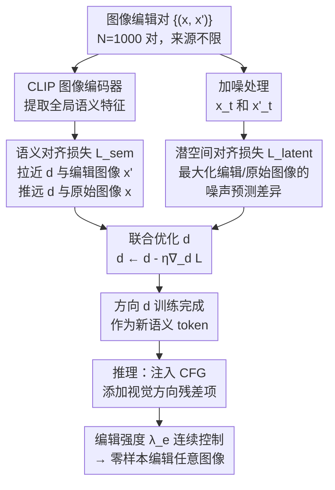

# ViDiT：从图像编辑对中学习可迁移的连续视觉方向

**会议**: ECCV 2026  
**arXiv**: [2403.19645](https://arxiv.org/abs/2403.19645)  
**代码**: 有（项目页 [http://vidit-edit.github.io](http://vidit-edit.github.io)）  
**领域**: 图像生成 / 扩散模型  
**关键词**: 扩散模型编辑、方向迁移、连续编辑方向、零样本编辑、解耦属性控制

## 一句话总结

ViDiT 提出从少量"编辑前-编辑后"图像对中学习一个全局连续的编辑方向向量，将其注入预训练扩散模型的 CFG 条件空间，实现零样本、解耦、强度可控的图像属性编辑，无需微调基础模型或逐样本优化。

## 研究背景与动机

扩散模型在文本驱动图像生成上取得了巨大成功，但在精确的属性编辑上仍存在根本瓶颈：文本描述是一种极其粗粒度的控制信号。一个"戴眼镜的人"这样的 prompt 只能捕捉模糊的语义先验，无法表达"让下巴轮廓变宽但保留原有肤色和发型"这种精细的视觉差异。而一对"编辑前-编辑后"图像却能无歧义地编码这种视觉增量——问题是，如何让扩散模型理解这种视觉层面而非文本层面的编辑意图？

GAN 在这个问题上走得更远：StyleGAN 的潜空间具有紧凑的线性结构，研究者已经发现了大量可解释的解耦编辑方向（年纪、性别、表情等均可沿单一方向连续调节）。但扩散模型的潜空间分布复杂、受多步递归去噪过程影响，目前只能发现少数分离方向，远远无法覆盖 GAN 可编辑的语义范围。造成这种差距的根本原因在于扩散模型的噪声递归估计和多时间步变量管理使其潜空间缺乏 GAN 那种紧凑线性结构。

针对这一差距，本文提出 ViDiT（Visual Direction Transfer for Diffusion），核心观察是：可以将 GAN 或其他编辑方法产生的"前后对比"图像对中的视觉增量，直接迁移为扩散模型条件空间中的一个连续方向向量。**核心 idea：从少量图像编辑对中优化一个全局连续的编辑方向 d，将其注入 CFG 公式替代文本条件残差——以"一次学习、随处编辑"（Learn Once, Edit Anywhere）的方式实现零样本、解耦、强度可控的图像编辑。**

## 方法详解

### 整体框架

ViDiT 的核心是学习一个连续方向向量 d，使其编码从原始图像 x 到编辑图像 x' 的视觉增量 Δx。d 被初始化为文本嵌入空间的随机向量（约 768 维），通过两个互补的损失函数联合优化，而扩散网络的去噪网络 ε_θ 和 CLIP 图像编码器全程冻结。训练完成后，d 成为可复用的语义 token，在推理时修改 CFG 公式注入任意图像的去噪过程。整个过程仅优化 d，确保它真正捕捉目标变换而不干扰模型生成先验。

### 关键设计

**1. 语义对齐损失：在 CLIP 特征空间定位语义概念**

方向 d 首先要"知道"它要表达什么语义。ViDiT 使用冻结的 CLIP 图像编码器提供全局语义锚点：d 应该在特征空间中靠近编辑后图像 x'、远离原始图像 x。损失是对比式的：$\mathcal{L}_{\text{sem}} = 1 - \text{cossim}(E_I(x'), \mathbf{d}) + \text{cossim}(E_I(x), \mathbf{d})$。

这个损失将 d 放置在目标概念的语义邻域——比如"加胡子"方向被拉向所有带胡子图像的特征附近。但 CLIP 特征本质上是全局池化的高层语义，对精细空间结构完全不敏感。只靠这个损失会出现"方向对了但整张脸的几何结构都变形了"的问题——加胡子时连下颌骨和肤色一起被改，因为在 CLIP 全局池化空间里这些属性本来就相互关联。这引出了第二个损失的必要性。

**2. 潜空间对齐损失：在去噪网络的预测空间锁定精细结构**

为了弥补 CLIP 全局特征缺乏空间分辨率的缺陷，ViDiT 利用扩散模型本身的去噪预测空间做精细约束。关键洞察是：扩散模型的噪声预测图是空间对齐的高维张量，编码了密集的逐像素信息，天然能在像素级做对比。对加噪后的编辑图像 $x'_t$ 和原始图像 $x_t$ 用同一方向 d 做条件去噪，让它们的预测差异最大化：$\mathcal{L}_{\text{latent}} = -\mathbb{E}_{x_0,\epsilon,t}[||\epsilon_\theta(x'_t, \mathbf{d}) - \epsilon_\theta(x_t, \mathbf{d})||_2^2]$。

这个损失迫使 d 在去噪网络的内部特征空间中区分编辑样本和原始样本。实验效果很直观：去掉 $\mathcal{L}_{\text{latent}}$ 后，"白头发"编辑会无意识改变肤色，"秃头"编辑会过度平滑整个头部——都是 CLIP 全局特征无法区分精细空间信号的表现。加上 $\mathcal{L}_{\text{latent}}$ 后，发丝纹理、眼镜反光、皮肤质感这些依赖像素级对应的高频身份信息得以保留。两个损失互补：$\mathcal{L}_{\text{sem}}$ 把 d 推向正确的语义概念邻域，$\mathcal{L}_{\text{latent}}$ 在像素级精修 d 的空间锚定。

**3. 方向注入推理：修改 CFG 公式实现零样本编辑**

训练得到一个 d 后，推理时不需任何逐样本优化或网络微调。ViDiT 修改标准 CFG 公式，在文本条件残差之外额外加上一个由 d 驱动的视觉方向残差：$\bar{\epsilon}_\theta(x_t, c, \mathbf{d}) = \tilde{\epsilon}_\theta(x_t, c) + \lambda_e(\epsilon_\theta(x_t, \mathbf{d}) - \epsilon_\theta(x_t, \phi))$。

这里 $\lambda_e \in \mathbb{R}$ 是编辑强度标量：$\lambda_e = 0$ 恢复未编辑输出，增大 $\lambda_e$ 则编辑效果连续增强，实现了从无到有的线性插值控制。这个加法形式还有两个重要性质：一是多方向天然可组合——多个独立学习的 d 只需叠加各自的残差项即可同时应用加胡子、微笑、变老等复合编辑，每个方向保持解耦因为它们是独立优化的；二是适用于真实图像编辑——先用 DDPM Inversion 将输入图像映射到扩散模型的潜轨迹，再执行方向注入去噪，在保持内容结构的同时完成指定编辑。

### 损失函数 / 训练策略

总损失 $\mathcal{L} = \mathcal{L}_{\text{sem}} + \mathcal{L}_{\text{latent}}$，最简单直接的加法组合。N=1000 对图像对，1000 次迭代，AdamW 优化。所有预训练模型冻结。训练一个方向约 5 秒（单张 NVIDIA L40）。推理时不需反向传播，零样本适用。

## 实验关键数据

### 主实验

**对比文本驱动编辑方法**（200 对输入-编辑样本）：

| 方法 | LPIPS↓ | DINO↑ | CLIP-T↑ | DreamSim↑ |
|------|--------|-------|---------|-----------|
| SEGA | 0.179 | 0.714 | 0.388 | 0.757 |
| Prompt2Prompt | 0.074 | 0.867 | 0.408 | 0.869 |
| InstructPix2Pix | 0.059 | 0.851 | 0.403 | 0.877 |
| Concept Sliders | 0.121 | 0.842 | 0.325 | 0.844 |
| **ViDiT (Ours)** | **0.030** | **0.929** | 0.407 | **0.905** |

ViDiT 在身份保持指标（LPIPS、DINO、DreamSim）上显著领先所有文本驱动方法，因为文本 prompt 无法精确控制视觉增量，总是引入不必要的全局偏移。语义对齐（CLIP-T）与 Prompt2Prompt 相当，但身份保真度高出数个点。

**对比视觉条件编辑方法**（100 个生成样本）：

| 方法 | CLIP-I↑ | DINO↑ | SigLIP-I↑ |
|------|---------|-------|-----------|
| Text Prompt | 0.775 | 0.822 | 0.875 |
| IP-Adapter | 0.816 | 0.767 | 0.890 |
| Attribute-Control | 0.829 | 0.881 | 0.911 |
| **ViDiT (Ours)** | **0.831** | **0.886** | **0.913** |

ViDiT 在身份保持指标上优于所有视觉条件基线，说明从视觉对学习的连续方向比从文本或权重空间发现的更解耦。

### 消融实验

| 配置 | LPIPS↓ | DINO↑ | DreamSim↑ | 说明 |
|------|--------|-------|-----------|------|
| N=10 对 | 0.098 | 0.869 | 0.872 | 极少量样本即可捕捉语义 |
| N=100 对 | 0.136 | 0.842 | 0.771 | CLIP-T 在 N=100 达峰值 |
| w/o L_latent | 0.121 | 0.832 | 0.860 | 编辑耦合严重，肤色/脸型被无关修改 |
| **ViDiT (N=1000)** | **0.093** | **0.891** | **0.861** | 身份保持最佳 |

### 关键发现

- $\mathcal{L}_{\text{latent}}$ 移除后 DINO 从 0.891 降至 0.832，身份保持显著下降——白胡子会同步变肤色，秃头会过度平滑全脸，验证了潜空间对齐是维持身份的关键机制。
- 只需 10 对图像即可学习有意义的编辑方向；100 对时语义对齐（CLIP-T）饱和，更多样本主要提升身份保持。
- 推理时间步 T 控制编辑强度与身份保持的权衡：全程 T（默认）温和保守；0.4T（较晚注入）编辑更强但身份漂移明显。
- DDPM Inversion 优于 DDIM Inversion，在高频身份信息（发丝纹理、眼镜框、肤质）上保留更完整。
- 用户感知测试（40 人，1-5 分）：ViDiT 3.36 > Concept Sliders 3.25 > P2P 2.74 > IP2P 2.06 > SEGA 1.96。
- 解耦重新评分分析：对角线条目大幅变化（如"变女性"使性别属性 +94.7%），非对角条目变化极小，量化证实解耦能力。

## 亮点与洞察

- **范式转变**：不是用文本"告诉你改什么"，而是用视觉对"展示给你看怎么改"——绕过文本描述的信息瓶颈，能编码"鼻型微调"这种语言很难精确描述的视觉增量。
- **双损失互补设计精巧**：CLIP 全局语义损失定位概念、去噪网络局部潜损失精修像素级身份，两者互补而非竞争——这是最值得借鉴的技术点。
- **轻量+零样本的实用优势**：训练仅优化 768 维向量、单方向 5 秒，推理不需要 LoRA 或适配器——这在实用性和可扩展性上远超 Concept Sliders（每个概念需训练独立 LoRA）和 W+ Adapter（需要额外架构模块）。
- **来源无关性**：方向可以从 GAN、领域适应模型、扩散编辑器等任何能产生"前后对比对"的方法学习，这意味着 ViDiT 会随编辑方法生态的提升而自然受益。

## 局限与展望

- **受监督源质量限制**：ViDiT 的方向解耦性上限就是监督源本身的解耦度——如果 GAN 的"变老"方向自动加了白发，学习到的方向也会继承这种耦合。本质上没有引入额外的解耦正则化。
- **全局单方向缺乏空间异质性**：每个概念一个全局方向，对于需要"只改左脸不改右脸"这种局部异质编辑的场景表达力不足。未来可探索空间条件化的方向（如对不同区域应用不同 λ_e）。
- **微小编码力有限**：当训练对的视觉增量极微妙时（如极浅的微笑），d 难以捕获足够信号在新图像上复现——说明 768 维的连续向量表征容量面对极端微妙变换存在上限。
- **固有偏见继承**：模型继承了 CLIP 和 Stable Diffusion 的既有偏见（如变老方向自动出现眼镜），作者用非语义数值标签匿名化种族属性是好的实践，但实际部署中仍需注意。

## 相关工作与启发

- **vs Concept Sliders**: 两者都用方向做语义编辑，但 CS 每个概念需训练独立 LoRA（~MB）、且受初始文本 prompt 边界限制；ViDiT 用视觉对学习方向 d（仅 768 维），推理时零样本注入 CFG，不修改架构。
- **vs W+ Adapter**: 同样从 StyleGAN 迁移语义到扩散模型，但 W+ Adapter 需训练一个适配器模块将 StyleGAN 的 W+ 空间映射到扩散条件空间；ViDiT 直接优化 d，不需引入任何额外的架构参数。
- **vs InstructPix2Pix / Prompt2Prompt**: 这些方法依赖文本指令或交叉注意力操作，本质上限在文本描述的信息密度；ViDiT 用视觉增量绕过文本瓶颈，而且训练/推理都更轻量。

## 评分
- 新颖性: ⭐⭐⭐⭐ 把 GAN 的"方向发现"迁移到扩散模型条件空间，双损失互补公式简洁有效，来源无关的性质使框架具有生态扩展潜力。
- 实验充分度: ⭐⭐⭐⭐⭐ 在多个监督源、多种数据集、多指标上做了系统对比，包含消融、用户感知研究、解耦重新评分分析，覆盖面广。
- 写作质量: ⭐⭐⭐⭐ 动机清晰，方法条理分明，图与文字配合良好；结论和伦理讨论也到位。
- 价值: ⭐⭐⭐⭐ 零样本、不做 LoRA/不修改架构、天然支持多方向组合——对扩散模型编辑的实际应用有直接助力。

<!-- RELATED:START -->

## 相关论文

- [\[ECCV 2026\] Learn Once, Edit Anywhere: Visual Direction Transfer for Diffusion Models](learn_once_edit_anywhere_visual_direction_transfer_for_diffusion_models.md)
- [\[ECCV 2026\] MEPA: Multi-Scale Representation Alignment for Visual Autoregressive Modeling with Mixture of Experts](mepa_multi-scale_representation_alignment_for_visual_autoregressive_modeling_wit.md)
- [\[ECCV 2026\] Curvature-Adaptive Consistency Flow Matching: Autonomous Trajectory Optimization via Reinforcement Learning](curvature-adaptive_consistency_flow_matching_autonomous_trajectory_optimization_.md)
- [\[ECCV 2026\] Don't Settle at the Mode! Mitigating Diversity Collapse in Pretrained Flow Models via Feature Self-Guidance](dont_settle_at_the_mode_mitigating_diversity_collapse_in_pretrained_flow_models_.md)
- [\[ECCV 2026\] Prompt2Effect: Training-Free Image-to-Video Model Specialization via LoRA Generation](prompt2effect_training-free_image-to-video_model_specialization_via_lora_generat.md)

<!-- RELATED:END -->
