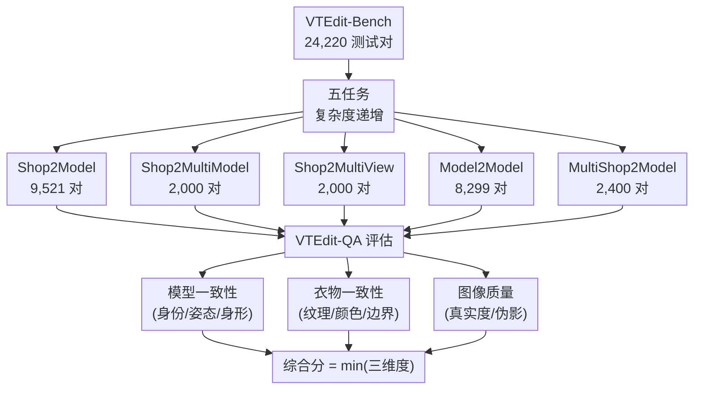

# VTEdit-Bench: A Comprehensive Benchmark for Multi-Reference Image Editing Models in Virtual Try-On

**会议**: ECCV2026  
**arXiv**: [2603.11734](https://arxiv.org/abs/2603.11734)  
**代码**: [https://github.com/Hiuyee124/VTEdit-Bench](https://github.com/Hiuyee124/VTEdit-Bench)  
**领域**: 图像生成 / 虚拟试衣  
**关键词**: 虚拟试衣, 多参考图像编辑, 基准测试, VLM评估, 跨任务泛化

## 一句话总结

VTEdit-Bench 提出了首个系统评估通用多参考图像编辑模型在虚拟试衣场景中表现的基准，包含 24,220 个测试对、5 个复杂度递增的任务，并配套 VTEdit-QA（基于 GPT-4o 的参考感知评估器）实现细粒度自动评价，实验表明通用编辑模型在经典试衣任务上与专用模型持平，在复杂场景下泛化更稳定，但在多衣物组合控制上仍有明显差距。

## 研究背景与动机

虚拟试衣技术在电商领域日益重要，它让消费者直观地在自身或虚拟模特身上预览服装效果，对提升购买决策、降低退货率有显著作用。近年来，专用 VTON 模型（如 IDM-VTON、CatVTON、OOTD-Diffusion 等）通过基于掩码的生成或修补技术在经典 Shop2Model（商店图→模特图）任务上取得了出色结果。然而，真实场景远比这一设定复杂：用户可能要求多角度展示（Shop2MultiView）、多人同穿一件衣服（Shop2MultiModel）、从某人的穿搭照中提取服装换到另一个人身上（Model2Model），甚至将上衣、下装、包、鞋等多项商品组合到同一模特上（MultiShop2Model）。专用 VTON 模型因为依赖固定的输入假设（如单人正面姿态、单一服装源）和特定的辅助条件（如 OpenPose、人体解析图），难以灵活扩展到这些更复杂的场景。

与此同时，通用多参考图像编辑模型（如 Qwen-Image-Edit-2511、Flux.2、DreamOmni2 等）近年来快速发展。它们遵循「文本条件+图像条件」的图像到图像编辑范式，天然支持多参考条件输入，管路远比专用 VTON 模型简洁灵活。这让研究者看到了一个潜在的范式转变——通用多参考编辑器或许能成为统一的 VTON 解决方案，减少对专用管线的依赖。然而，这类通用模型在 VTON 任务上到底有多强、在哪些场景下仍有瓶颈，缺乏系统性评估。现有 VTON 基准（如 OpenVTON、VTBench）大多只覆盖最简单的 Shop2Model 场景，不足以揭示通用编辑器的优势和短板。同时，传统 VTON 评估严重依赖 FID/KID 这类粗粒度分布指标，它们无法区分「模特身份是否保留」「衣物纹理是否正确迁移」等语义层面的失败模式。

针对这些空白，本文的 **核心 idea** 是：设计一个复杂度递增的五任务基准 VTEdit-Bench，配套一个基于 VL M 的参考感知自动评价器 VTEdit-QA（沿模型一致性、衣物一致性、图像质量三个维度打分），首次系统对比了 8 个通用多参考编辑模型和 7 个专用 VTON 模型，从而在统一框架下揭示两者的能力边界和演进方向。

## 方法详解

### 整体框架

VTEdit-Bench 是一个纯评估基准，而非方法。它的核心结构由三部分组成：**五任务数据集**、**统一评估指标**、以及**自动化 VLM 评价器 VTEdit-QA**。

五任务从简单到复杂依次为：Shop2Model（最经典的商店图→模特）、Shop2MultiModel（同件衣服穿到多人身上）、Shop2MultiView（非正面视角下的试衣）、Model2Model（从某人穿搭提取服装给另一人）、MultiShop2Model（将上衣、下装、包、鞋等多件商品组合到同一模特）。每个任务都提供统一的辅助条件（OpenPose、人体解析、DensePose、无衣掩码等），确保专用模型和通用模型能在同等输入条件下比较。

统一评估指标体系沿三个维度定义：模型一致性（被拍摄者的身份和身形是否保留）、衣物一致性（服装纹理、颜色和边界是否准确迁移）、图像质量（生成结果的整体真实度、是否有伪影）。VTEdit-QA 将这三者封装到 GPT-4o 的提示中，输出 0–5 分的细粒度打分，并以三者中的最小值作为综合分（保守策略，任一维度失败即拉低总分）。

### 关键设计

**1. 五任务复杂度递增设计：覆盖从经典到极端的全谱 VTON 场景**

基准按「参考条件复杂度」递进排列五个任务。Shop2Model 是起点：一张商店服装图 + 一个单人正面模特。Shop2MultiView 将模态从单人正面扩展到多视角（非正面、侧面、背面），考验模型对视角变化的鲁棒性。Shop2MultiModel 从单人扩展到多人图像（2 人及以上的合照），要求模型同时对每个个体都实现一致的服装迁移。Model2Model 则彻底去掉商店图的约束——服装源变为另一人的穿搭照，模型必须先从源图中准确地「提取」服装语义、再「迁移」到目标人身上。最难的 MultiShop2Model 要求将上衣、下装、鞋子、包等多件商品组合到同一个人身上，考验多物品间遮挡关系、全局协调和纹理一致性的控制能力。每个任务的数据来源和规模不同：Shop2Model 最大（9,521 对，来自 DressCode + VITON-HD + StreetVTON），其余任务都在 2,000–8,299 对之间，保证了数据量充足的同时控制了标注成本。这种递进设计使得每增加一个任务都暴露模型在某一维度的新瓶颈，而非简单重复。

**2. VTEdit-QA：参考感知的 VLM 三轴评价器**

针对 FID/KID 这类分布指标无法识别语义层面失败（如身份漂移）的缺陷，VTEdit-QA 利用 GPT-4o 的视觉理解能力对生成结果沿三个维度分别打分。对模型一致性，提供源模特图与生成图，GPT-4o 判断面部身份、体形、姿态是否保留。对衣物一致性，提供源服装图与生成图，判断纹理细节、颜色准确度、服装边界与身体的对齐度。对图像质量，仅提供生成图本身，判断是否有畸变、伪影、亮度不协调等问题。每个维度输出 0–5 分，综合分取三者最小值（保守聚合）。论文通过人类标注者与 GPT-4o 打分排名的 Spearman 相关系数（SRCC）验证了 VTEdit-QA 的可靠性：人工间一致性 0.75，GPT-4o 与人工的 SRCC 达 0.72，接近人工水平。这意味着 VTEdit-QA 在大部分场景下可以取代人工评估进行大规模自动评测。

**3. 统一辅助条件协议：解决专用模型与通用模型的输入差异**

专用 VTON 模型普遍需要额外的辅助条件（如 OpenPose 骨架、人体解析图、DensePose、无衣掩码），而通用多参考编辑器只需要原始图像和文本指令。直接比较两者会因输入差异而产生偏差。VTEdit-Bench 的做法是：对所有测试数据**预先计算并统一提供**全套辅助条件——对每个模特图提供 OpenPose、人体解析、DensePose、无衣掩码，对每个服装图提供衣物掩码。同时，在数据筛选阶段将「能否稳定提取这些辅助信号」作为保留标准，确保进入基准的数据在统一条件下对所有模型公平。这使得专用模型可以直接使用自己的标准管线，通用模型则零样本运行（只用统一文本指令），对比结果时归因于模型本身的差异而非输入预处理差异。

### 损失函数 / 训练策略

无（基准论文，不涉及模型训练）。

## 实验关键数据

### 主实验

| 任务 | 指标 | 最佳专用模型 | 最佳通用模型 | 说明 |
|------|------|-------|-------|------|
| Shop2Model | FID ↓ | IDM-VTON (7.40) | Flux.2 (10.88) | 通用模型已接近顶尖专用模型 |
| Shop2MultiView | FID ↓ | IDM-VTON (42.90) | **Flux.2 (36.51)** | 通用模型反超，专用模型退化严重 |
| Shop2MultiModel | FID ↓ | IDM-VTON (73.90) | **Flux.2 (65.81)** | 通用模型更稳定 |
| Model2Model | FID ↓ | CatVTON (14.98) | Qwen-Edit (13.36) | 通用模型略优，但差距微小 |
| MultiShop2Model | FID ↓ | **FastFit (11.11)** | Flux.2 (15.85) | 专用模型在多物组合上明显领先 |
| Avg. Rank | — | FastFit (4.8) | **Flux.2 (2.2)** | 通用模型跨任务综合排名更优 |

**VTEdit-QA 综合分对比**（Shop-based，越高越好）：

| 模型 | Shop2Model | Shop2MultiView | Shop2MultiModel |
|------|-----------|----------------|-----------------|
| IDM (专用) | 3.60 | 2.73 | 1.65 |
| CatVTON (专用) | 3.39 | 2.14 | 1.26 |
| FastFit (专用) | 3.08 | 1.74 | 1.18 |
| Flux.2 (通用) | 3.36 | **3.38** | 3.02 |
| **Flux.2-klein (通用)** | **3.96** | **3.99** | **3.56** |

### 关键发现

- **通用模型在难度递增的 Shop 类任务上表现更稳定**。随着 Shop2Model → Shop2MultiView → Shop2MultiModel 复杂度增加，专用模型（如 ITA-MDT）的 FID 从 12.23 暴涨到 143.61，而 Flux.2 仅从 10.88 升至 65.81。VTEdit-QA 的综合分也印证了这一点：IDM 的综合分从 3.60 持续下降到 1.65，而 Flux.2-klein 始终在 3.5–4.0 的高水平。
- **FID/KID 掩盖语义层面的失败**。IDM-VTON 在 Shop2Model 上 FID 最低（7.40），但 VTEdit-QA 综合分仅 3.60——低于 Flux.2-klein 的 3.96。这是因为 IDM 在某些样本上虽然分布接近真实数据，但存在身份漂移或衣物纹理丢失的问题，FID 无法捕捉这些语义失误。
- **MultiShop2Model 仍是所有模型的共同瓶颈**。多件衣物组合涉及复杂的遮挡推理和风格协调，即使是顶尖通用模型 Flux.2（综合分 2.25）也与最佳专用模型 FastFit（综合分 2.90）有明显差距。DreamO 甚至在这个任务上完全崩溃（综合分 0.01）。
- **模型一致性是通用模型最大的短板**。在 Model2Model 任务上，Qwen-Image-Edit-2511 的模型一致性仅 1.60（5 分制），大幅低于专用模型 CatVTON 的 4.44。这说明通用模型在处理「从他人穿搭中提取服装」时容易混淆人物身份，将源人物的面部特征等带进生成结果。

## 亮点与洞察

- **通用编辑器 vs 专用模型的范式对照**：本文将两类完全不同的技术路线放在统一基准下比较，结果显示通用模型在可扩展性上显著占优（一个模型跑所有 5 个任务），而专用模型在特定场景下仍有精度优势（如 MultiShop2Model）。这为产业界选择技术路线提供了清晰的数据支撑。
- **VTEdit-QA 的三轴评价思路具有通用性**：将生成质量拆解为「源A一致性」「源B一致性」「整体质量」并按采样最小值聚合，这个框架可迁移到任何涉及多参考条件的生成任务（如换脸、风格迁移、多模态组合生成），不限于试衣场景。
- **复杂度递增的基准设计方法论**：五个任务不是随机选取的，而是每个新增任务都引入了一个新的约束维度（多视角、多人、多物品），形成了一个严格的「压力测试」序列。这种渐进式设计能更精细地定位模型的哪个环节出了问题——而不是简单地给一个综合分数。

## 局限与展望

- 基准目前只覆盖了静态图像输入，未包含视频试衣、动态姿态下服装跟随等更复杂的动态场景。未来可引入视频级评估。
- VTEdit-QA 目前依赖 GPT-4o，存在 API 成本和输出随机性问题。论文虽验证了与人工评分的高度一致（SRCC 0.72），但 GPT-4o 对不同体型/肤色群体的公平性有待进一步检验。
- 通用编辑模型仅基于零样本评估（统一文本指令），没有测试提示优化或任务微调后的表现。实际上，如果对每个任务精心设计提示模板，通用模型的表现可能进一步提升。
- MultiShop2Model 任务中衣物种类组合的标注粒度可以更细——目前只区分了上衣/下装/裙/鞋/包五大类，对同一类别下的风格组合（如不同颜色、花纹的搭配合理性）未做专门分析。
- 论文未包含对生成结果的用户满意度调研（如 A/B 测试），纯自动指标（即使 VTEdit-QA 很接近人类偏好）仍不能完全替代对真实消费者体验的评估。

## 相关工作与启发

- **vs VTON 专用模型（IDM-VTON / CatVTON / FastFit 等）**: 这些方法在经典 Shop2Model 场景上精雕细琢，但受限于固定输入假设和任务特定设计，难以扩展到非正面视角、多人、多物等场景。本文系统量化了这一差距。
- **vs 通用多参考编辑模型（Flux.2 / Qwen-Edit / DreamO 等）**: 通用模型在一个框架内处理所有任务，显著降低了运维复杂度，但在模型一致性（尤其是身份保留）和多物组合控制上与专用模型仍有差距。这些瓶颈为下一阶段方法改进指明了方向。
- **vs 现有 VTON 基准（OpenVTON / VTBench / StreetVTON）**: 现有基准仅覆盖单一场景（如 StreetVTON 只做户外场景），或仅覆盖经典 Shop2Model。VTEdit-Bench 是首个系统性覆盖 5 个代表性场景的基准，复杂度递进设计也是创新点。
- **vs 其他 VLM 评价器（LLM-as-Judge 类方法）**: VTEdit-QA 借鉴了 VLM 做评估的思路，但创新性地拆成三个独立维度和保守聚合策略（取 min 而非平均），这比单维度打分更能揭示模型的真实弱点。

## 评分

- 新颖性: ⭐⭐⭐⭐ 首个覆盖通用多参考编辑器的 VTON 基准，复杂度递增和 VLM 三轴评价是新颖设计，但整体仍属 benchmark 类工作
- 实验充分度: ⭐⭐⭐⭐⭐ 8 个通用模型 + 7 个专用模型在 5 个任务上全面对比，含 FID/KID 和 VTEdit-QA 双体系评价，额外做了人类偏好校准验证
- 写作质量: ⭐⭐⭐⭐⭐ 动机清晰、任务定义图表直观、实验分析有条理（先定量后定性再 insight），可读性很好
- 价值: ⭐⭐⭐⭐⭐ 填补了 VTON 领域系统评测的空白，对产业界选择技术路线和学界改进通用模型的薄弱环节都有实际参考价值

<!-- RELATED:START -->

## 相关论文

- [\[ECCV 2026\] C3-Bench: A Context-Aware Change Captioning Benchmark](c3-bench_a_context-aware_change_captioning_benchmark.md)
- [\[CVPR 2026\] Garments2Look: A Multi-Reference Dataset for High-Fidelity Outfit-Level Virtual Try-On with Clothing and Accessories](../../CVPR2026/image_generation/garments2look_a_multi-reference_dataset_for_high-fidelity_outfit-level_virtual_t.md)
- [\[CVPR 2026\] PG-VTON: Single-Pass Training-Free Virtual Try-On via Patch-Guided Reference Alignment](../../CVPR2026/image_generation/pg-vton_single-pass_training-free_virtual_try-on_via_patch-guided_reference_alig.md)
- [\[ECCV 2026\] PhyEditBench: A Real-World Multi-Stage Benchmark for Physics-Aware Image Editing](phyeditbench_a_real-world_multi-stage_benchmark_for_physics-aware_image_editing.md)
- [\[CVPR 2026\] MultiBanana: A Challenging Benchmark for Multi-Reference Text-to-Image Generation](../../CVPR2026/image_generation/multibanana_a_challenging_benchmark_for_multi_reference_text_to_image_generation.md)

<!-- RELATED:END -->
