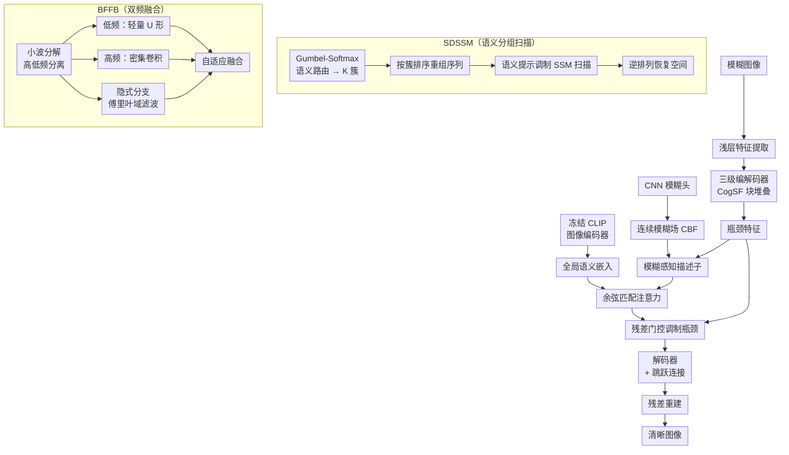

# CogSENet: Blind Image Deblurring with Blur-Conditioned Semantic Routing and Explicit Frequency Fusion

**会议**: ECCV2026  
**arXiv**: [2606.30030](https://arxiv.org/abs/2606.30030)  
**代码**: 待确认  
**领域**: 图像恢复  
**关键词**: 盲图像去模糊，状态空间模型，语义路由，频率分解，CLIP先验，连续模糊场

## 一句话总结

CogSENet 将盲图像去模糊从被动的像素回归重塑为主动的语义对齐重建过程，通过模拟鹰眼视觉系统的主动扫查扫描、视网膜功能分化和焦距适应，提出语义驱动的状态空间模块（SDSSM）、双频融合块（BFFB）和连续模糊场+CLIP语义联合调制三大核心设计，以仅 8.9M 参数在 GoPro、HIDE、RealBlur 上超越 EVSSM、FFTformer 等 SOTA 方法。

## 研究背景与动机

盲图像去模糊的目标是从未知且空间不均匀的模糊中恢复清晰图像。这个领域经历了从 CNN（NAFNet）到 Vision Transformer（Restormer）再到状态空间模型（MambaIR、VMamba）的演进：CNN 侧重局部提取但缺全局上下文，Transformer 能捕获长程依赖但计算成本是二次的，SSM 以线性复杂度实现了有效的全局建模。然而，一个根本缺陷延续至今：大多数现有方法把图像恢复看作静态的像素映射回归，处理特征时不加区分，缺少对语义边界和结构频率的显式建模。真实世界的模糊在空间上高度非均匀——运动模糊的强度、方向和区域在一张图中处处不同——但当前方法用统一的扫描策略处理所有区域，既无法区分语义边界，也无法解耦纹理和结构频率。

这种困境的核心矛盾在于：恢复一个被模糊破坏的区域，网络需要知道它在恢复什么（语义识别）才能决定怎么恢复（策略选择）。静态回归没有这种「理解」能力。本文从一个独特的生物视角出发——鹰的视觉系统在复杂环境中始终保持极高清晰度，依靠四种自适应机制主动扫查目标、视网膜功能区分化处理高低频、晶状体连续调焦适应不同焦距。作者将这一套生物机制搬进神经网络，把去模糊从「一切像素一视同仁」的被动回归，转变为「语义驱动的主动重建」。

**核心 idea：受鹰眼视觉启发，将盲去模糊分解为三个生物映射的核心挑战——语义分组的主动扫查（SDSSM）、高低频显式解耦的双路融合（BFFB）、以及物理模糊场与高层语义先验的联合调制（CBF+CLIP）——在一个 U 形编解码器中协同工作，实现语义感知、频率可解释的去模糊。**

## 方法详解

### 整体框架

CogSENet 是一个三级对称的 U 形编解码器。输入模糊图像先经 3×3 卷积提取浅层特征，然后送入由堆叠 CogSF 块构建的三级骨干网络。每个 CogSF 块包含两个互补模块：SDSSM 负责语义上下文聚合，BFFB 负责显式的双频精炼。编解码器之间的跨尺度过渡使用双线性缩放 + 3×3 卷积，纵向有跳跃连接保留空间细节。

区别于标准 U-Net，CogSENet 在瓶颈处引入了两层引导：一是从输入图像用轻量 CNN 预测一个连续模糊场（CBF），与瓶颈特征融合得到模糊感知描述子；二是用冻结的 CLIP 图像编码器提取全局语义嵌入，通过余弦匹配计算空间注意力图，对瓶颈特征做残差门控调制。最终的瓶颈表示（同时含物理模糊感知和高层语义引导）经解码器和跳跃连接逐步恢复到原分辨率，最后由 3×3 卷积输出残差图像，与输入相加得到清晰结果。

### 关键设计

**1. SDSSM：语义分组的主动扫查代替均匀扫描**

现有 SSM 在二维图像上按固定空间顺序（逐行/逐列）做因果扫描，相邻区域即使语义无关也会被绑定到同一扫描序列中。SDSSM 的核心动机是让 SSM 的扫描顺序服从语义而非空间：先用一个可微分的语义路由器（Gumbel-Softmax）将特征 token 分配到 K 个语义簇中，分配概率由可学习的线性投影 $w_{\theta,k}$ 决定。每个 token 的语义提示 $\mathbf{z}_i$ 通过取所属簇的码本期望得到。然后，按照 token 所属的主簇 ID 排序，重组 token 序列，使同一语义区域的 token 在扫描序列中连续排列。扫描时，语义提示 $\mathbf{z}_i$ 被加到 SSM 的输出矩阵 $\mathbf{C}_j$ 上，使状态跳转受语义信息调制（式 2）。最后通过逆排列恢复空间顺序。整个过程端到端可微：Gumbel-Softmax 保持前向可微，而 argmax 排序的梯度通过直通估计绕过，只经连续的提示 $\mathbf{Z}$ 传播。这让 SSM 的因果扫描在语义重排序列上实现了**非因果的全局感知**——远处的语义相关 token 可以通过重排被安排到相邻位置进行交互，而无关 token 不会被混入。

**2. BFFB：小波高低频显式分离 + 傅里叶隐式调制的双路融合**

盲去模糊的一个内在矛盾是：恢复清晰纹理需要增强高频细节，但同时可能放大高频噪声或伪影。BFFB 将该矛盾转化为显式的频率分离处理。它分两条路径并行处理：① 用 Haar 小波将输入特征显式分解为低频近似系数 $\mathbf{X}_{LL}$ 和高频细节系数 $\mathbf{X}_H$，低频分支用轻量 U 形模块建模全局结构，高频分支用密集卷积增强局部细节，再经逆小波变换重组；② 隐式的傅里叶域精炼分支，将信号映射到频域、通过可学习的谱滤波器 $\mathbf{M}$ 自适应加权后反变换回空间域。两条路径的输出通过可学习标量 $\beta$ 自适应融合（式 4），赋予网络按内容需要选择偏高频（纹理区域）或偏低频（平坦区域）的能力。这个设计的关键洞察在于：小波变换提供了物理可解释的频率解耦，而傅里叶分支提供了灵活的谱调制——两者互补，一个保结构、一个调频谱。

**3. 连续模糊场 + CLIP 语义联合调制**

真实模糊在空间上是非均匀连续的（如运动模糊从图像顶部到底部渐变），但现有方法通常用离散的核预测或全局分类来处理，无法捕获连续变化。CogSENet 在瓶颈处做了两层注入：先由一个轻量 CNN 从输入图像直接预测一个稠密的二维位移场 $\mathbf{u} \in \mathbb{R}^{2 \times H \times W}$（式 5），用 $\tanh$ 约束幅度后和瓶颈特征融合得到模糊感知描述子；再用冻结的 CLIP 图像编码器提取全局语义 token，和模糊感知描述子做逐像素余弦相似度（式 6），经 spatial softmax 得到注意力图。这个注意力图通过可学习标量 $\gamma$（初始化为 0）做残差门控（式 7）——训练初期保持恒等映射，训练中逐步引入语义-物理联合指导。这种方法模拟了眼睛的焦距适应机制：注意力图自动将高的响应分配给严重模糊的语义区域（如文字、人脸轮廓），而对平坦区域（如天空、墙壁）抑制响应，避免过度增强噪声。实验显示单独使用 CBF 或单独使用 CLIP 提升有限，联合调制则带来显著增益。

### 损失函数 / 训练策略

模型使用 Charbonnier 损失函数进行监督训练。训练采用三阶段渐进式策略：Stage 1 用 128×128 块+批大小 32 训练 30 万步（学习率 $10^{-3}$ 降至 $10^{-7}$，余弦退火），Stage 2 将块放大到 256×256+批大小 8 再训 30 万步，Stage 3 放大到 320×320+批大小 4 训 15 万步。优化器为 AdamW。在非去模糊任务（去雨、去雾、去噪）上，模糊场分支被关闭以避免引入任务不匹配的先验。

## 实验关键数据

### 主实验

| 数据集 | 指标 | CogSENet (Ours) | 之前 SOTA | 参数量 |
|--------|------|----------------|-----------|--------|
| GoPro | PSNR / SSIM | **34.72** / **0.9744** | 34.51 / 0.9713 (EVSSM) | **8.9M** vs 17.1M |
| HIDE | PSNR / SSIM | **32.18** / **0.9514** | 31.99 / 0.9503 (EVSSM) | 8.9M |
| RealBlur-R | PSNR / SSIM | **41.83** / **0.9799** | 41.27 / 0.9776 (EVSSM) | 8.9M |
| RealBlur-J | PSNR / SSIM | **34.54** / **0.9473** | 34.34 / 0.9456 (EVSSM) | 8.9M |
| Rain100H (去雨) | PSNR / SSIM | **32.15** / **0.9099** | 32.17 / 0.9080 (IDT) | — |
| SOTS (去雾) | PSNR / SSIM | **28.72** / **0.9692** | 28.21 / 0.9672 (MPRNet) | — |

CogSENet 在四个去模糊基准上全面超越 EVSSM、FFTformer 等 SOTA 方法，且参数量仅为 EVSSM 的一半（8.9M vs 17.1M）。加强版 Our+（瓶颈处引入 FullBFFB）以 19.4M 参数进一步提升，GoPro 上达 34.91 dB。跨任务泛化表现同样出色：去雨在 Rain100H 上 SSIM 最高，去雾在 SOTS 上 PSNR/SSIM 双第一。

### 消融实验

| 配置 | GoPro PSNR/SSIM | 说明 |
|------|----------------|------|
| 完整模型 | **34.31 / 0.9719** | 基线 |
| w/o SDSSM | 33.95 / 0.9677 | 去掉语义分组扫描，性能下降最明显 |
| w/o 语义提示 | 34.15 / 0.9685 | 去掉提示调制，SSM 失去上下文感知 |
| w/o 语义重排 | 34.21 / 0.9691 | 回归固定空间扫描，丢失语义关联 |
| w/o 高低频分离 | 34.01 / 0.9680 | BFFB 中去掉显式小波分解 |
| w/o 隐式频率分支 | 34.15 / 0.9689 | BFFB 中去掉傅里叶域调制 |
| w/o BFFB | 33.92 / 0.9677 | 去掉整个双频融合块 |
| 仅 CBF | 33.80 / 0.9668 | 只用模糊场、不用 CLIP |
| 仅 CLIP | 33.78 / 0.9667 | 只用语义、不用模糊场 |
| CBF+CLIP (未联合) | 33.88 / 0.9673 | 分开加但没有联合调制 |

SDSSM 中去掉语义重排和提示导致 PSNR 分别下降 0.10 和 0.16 dB，说明语义分组和提示调制互为补充。BFFB 中去掉高频分离影响最大（-0.30 dB），验证了频率解耦对去模糊的关键作用。CBF 和 CLIP 单独使用提升甚微，联合调制则带来 0.4 dB 以上的增益，证明了物理先验和高层语义的互补性。

### 关键发现

- SDSSM 的路由可视化显示语义分组与模糊掩膜高度一致：大面积平滑/运动主导区域被分配到少数主簇，纹理丰富区域（灌木、结构边缘）激活多种 token ID——说明 SDSSM 学会了内容自适应的表示容量分配。
- BFFB 中高频分离的贡献大于隐式频率分支——小波分解带来的物理可解释性比单纯频域滤波更关键。
- 失败案例分析：在极端运动模糊破坏语义线索时，CLIP 提取不到有效语义，注意力退化为均匀分布，模糊场也丢失局部细节——说明当前系统高度依赖 CLIP 的语义鲁棒性。

## 亮点与洞察

- **生物启发与网络架构的深度对齐**：这不是装饰性的生物隐喻，而是把鹰眼的三项具体机制分别映射到 SSM 的路由策略（主动扫查）、频率分解策略（视网膜分化）和特征调制策略（焦距适应），三种设计在消融中都确认了独立贡献。
- **Gumbel-Softmax 语义路由 + 直通梯度**：将离散的 token 排序问题松弛为可微分路由，排序的梯度经连续提示传播而非直接通过 argmax，是一个优雅的处理离散采样与端到端训练矛盾的工程 trick。
- **可学习的双频融合系数 $\beta$**：让网络按区域内容自适应权衡小波显式路径和傅里叶隐式路径的输出，避免了手工设定固定的融合权重。
- **可学习标量 $\gamma$ 初始化为 0 的残差门控**：联合调制中 $\gamma=0$ 的初始化确保了训练早期保持恒等映射，语义引导在训练过程中逐渐引入，稳定了优化。

## 局限与展望

- 极端运动模糊会破坏 CLIP 的语义提取能力，导致联合调制退化为均匀注意力，残留模糊和垂直伪影——这是当前方案最直接的短板。
- 三阶段渐进式训练策略（128→256→320 块大小）虽然有效，但训练总步数达到 75 万步，训练成本和调参复杂度偏高。
- 模糊场仅在编解码器瓶颈处注入，能否在多个尺度分层注入以捕捉多尺度模糊模式值得探索。
- 作者明确将视频去模糊列为未来方向——将 SDSSM 的语义路由扩展到时空域是一个自然延伸。

## 相关工作与启发

- **vs EVSSM (ECCV2024)**：EVSSM 首次将 SSM 引入图像去模糊但使用均匀扫描，CogSENet 通过语义重排使 SSM 扫描顺序服从语义而非空间，且参数减半。
- **vs FFTformer**：FFTformer 在 Transformer 中引入傅里叶注意力，CogSENet 的 BFFB 更进一步——小波显式分离 + 傅里叶隐式调制的双路融合，既有物理可解释性又有灵活调制能力。
- **vs AdaRevD**：AdaRevD 使用反向蒸馏策略做去模糊（152.4M 参数），CogSENet 以不到 1/15 的参数（8.9M）实现了更高 PSNR（34.72 vs 34.50），展示了语义+频率先验的效率优势。

## 评分

- 新颖性: ⭐⭐⭐⭐⭐ 将鹰眼视觉系统的三种生物机制与 SSM/小波/CLIP 三元技术进行深度映射并统一入一个框架，思路有趣且消融验证充分
- 实验充分度: ⭐⭐⭐⭐⭐ 在 4 个去模糊 + 3 个去雨/去雾/去噪基准上实验，含充分消融、可视化分析和失败案例
- 写作质量: ⭐⭐⭐⭐⭐ 结构清晰、生物动机与机制解释前后呼应，公式和图表安排得当
- 价值: ⭐⭐⭐⭐ 将语义感知引入低级视觉任务是一个有意义的范式转移方向，8.9M 的高效参数亦具有部署价值

<!-- RELATED:START -->

## 相关论文

- [\[ECCV 2024\] Blind Image Deblurring with Noise-Robust Kernel Estimation](../../ECCV2024/image_restoration/blind_image_deblurring_with_noise-robust_kernel_estimation.md)
- [\[ICCV 2025\] Blind Noisy Image Deblurring Using Residual Guidance Strategy](../../ICCV2025/image_restoration/blind_noisy_image_deblurring_using_residual_guidance_strateg.md)
- [\[CVPR 2026\] OMoBlur: An Object Motion Blur Dataset and Benchmark for Real-World Local Motion Deblurring](../../CVPR2026/image_restoration/omoblur_an_object_motion_blur_dataset_and_benchmark_for_real-world_local_motion_.md)
- [\[CVPR 2026\] DPGF-Net: Dual-Prior Guided Fusion Network for Joint Assessment of Perceptual Quality and Semantic Consistency in AI-Generated Images](../../CVPR2026/image_restoration/dpgf-net_dual-prior_guided_fusion_network_for_joint_assessment_of_perceptual_qua.md)
- [\[ECCV 2026\] UHD-MFF: Shattering Barriers in Multi-Focus Ultra-High-Definition Image Fusion via Learnable Lookup Tables](uhd-mff_shattering_barriers_in_uhd_multi-focus_image_fusion.md)

<!-- RELATED:END -->
