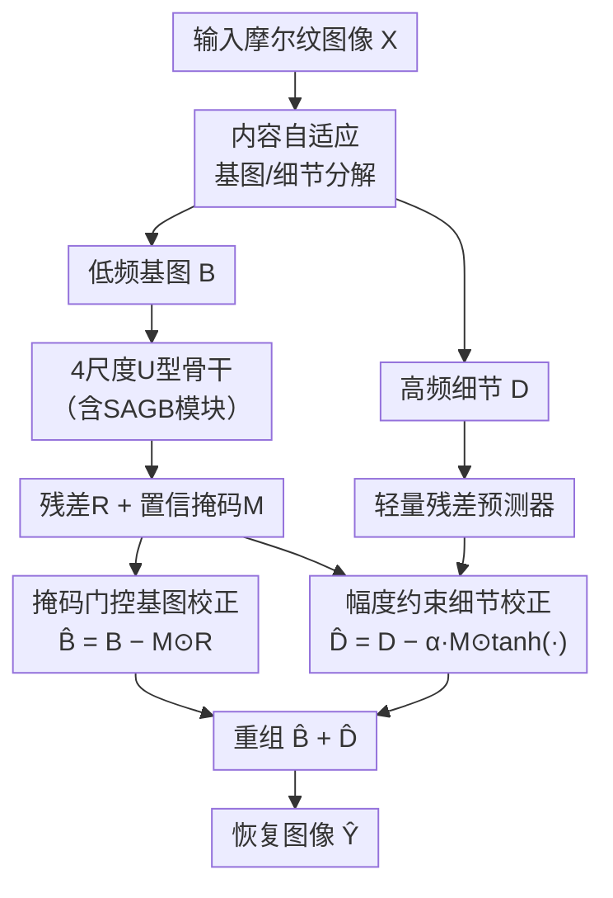

# Fabric Image Demoiréing Benchmark from Synthesis to Restoration

**会议**: ECCV 2026  
**arXiv**: [2606.24072](https://arxiv.org/abs/2606.24072)  
**项目页**: https://weipengchao.top/PRISM-page  
**代码**: 待确认  
**领域**: 图像恢复  
**关键词**: 织物去摩尔纹, 基准数据集, 物理仿真, 保守恢复, 各向异性滤波  

## 一句话总结

本文首次系统研究织物图像去摩尔纹问题，提出基于物理成像链仿真的残差注入合成框架 PRISM（含 16,050 对数据的首个织物摩尔纹基准）与专为织物频谱纠缠特性设计的保守式恢复网络 FaDeNet，在 PSNR/SSIM/LPIPS 上大幅超越现有屏幕去摩尔纹方法。

## 研究背景与动机

摩尔纹（moiré）是相机传感器对超出奈奎斯特极限的高频场景内容欠采样时产生的频谱折叠伪影，表现为周期性条纹、波纹和彩色畸变。过去十年，屏幕-相机场景的去摩尔纹研究取得了显著进展——从多尺度分解的 DMCNN、频域带通滤波的 MBCNN，到面向 4K 分辨率的 ESDNet 和 P-BiC——这些方法主要建立在一个隐含假设之上：图像内容与摩尔纹伪影在频谱上可分离。然而，织物摩尔纹的情况截然不同。面料的编织结构包含密集、各向异性且仅具半周期性的微图案（条纹、格纹、人字纹等），其频谱是宽带的，能量分布广泛且与面料本身的纹理高度重叠。当这样复杂的频谱被传感器采样折叠后，摩尔纹与原始纹理在频域上完全纠缠，使得逆向恢复问题变得本质上更加不适定。直接迁移屏幕去摩尔纹模型到织物场景，结果只能是两种失败：或者残留大量摩尔纹伪影，或者过度平滑抹除面料本身的纹理细节。这两种失败指向同一个根本矛盾——屏幕摩尔纹的频谱离散可分离，织物摩尔纹的频谱连续不可分。

做织物去摩尔纹面临两个实质性的工程障碍。第一，获取像素级对齐的真实配对数据极其困难。屏幕去摩尔纹可以轻松用「互联网图片显示→重新拍摄」来构造配对数据；但织物是柔性非刚性表面，存在褶皱、拉伸和姿态变化，全局单应性对准几乎不可能，甚至在物理上不可行。最相关的已有工作（Liu et al. 的聚焦/散焦双视角方法）需要专门硬件设备，无法大规模应用。第二，缺乏专门的基准数据集意味着研究者无法系统比较不同方法，严重阻碍了该方向的推进——屏幕去摩尔纹已有 TIP2018、UHDM、FHDMi 等多个成熟基准，而织物去摩尔纹仍是一片空白。

本文从数据和算法两个层面同时填补了这一空白。在数据层面，它们提出 PRISM（Physics-based Residual Injection for Synthetic Moiré）合成框架，通过往返对齐策略从物理成像链仿真中分离出纯摩尔纹残差场，再叠加回原始干净图像，在保证像素级完美对齐的同时完整保留面料纹理。在算法层面，它们设计了 FaDeNet 网络，采用基图/细节分解加掩码门控保守恢复的策略，专门针对织物摩尔纹的频谱纠缠特性进行优化。**核心 idea：将去摩尔纹从「全局统一修正」转变为「掩码门控的保守恢复」——让网络通过空间置信掩码自动识别摩尔纹主导区域，仅在必要时施加修正，从而在去除伪影和保护天然纹理之间达成精细平衡。**

## 方法详解

### 整体框架

本文的方案以一条「合成数据 + 恢复网络」的双轨流水线为核心。PRISM 合成管线对每张干净面料图像执行物理成像链模拟——视角投影、离散欠采样、Bayer 马赛克加噪声、去马赛克 ISP——生成带有合成摩尔纹的传感器输出，再通过往返对齐提取纯摩尔纹残差并注入回原始图像，得到像素级对齐的训练对。FaDeNet 恢复网络对输入摩尔纹图像首先做内容自适应的基图/细节分解，将低频色彩/光照变化与高频纹理结构分开处理；分解后的基图送入 4 尺度 U 型骨干网络（由 SAGB 模块堆叠），预测基图残差和空间置信掩码；该掩码同时控制基图残差修正和细节分支的幅度约束精化；最后重组得到最终恢复结果。

### 关键设计

**1. 内容自适应基图/细节分解：根据局部纹理密度自适应分离频率成分**

现有去摩尔纹方法通常使用固定参数的低通滤波器（如高斯模糊）将图像分为基图和细节，但织物面料不同区域的纹理密度差异极大——条纹密集区与纯色背景的频谱特性完全不同。本文提出可学习的自适应分解：通过一个极轻量的卷积门控子网络（两层 Conv-GELU-Conv 栈，共 372 个参数）对每个像素位置预测一个融合权重 W ∈ (0,1)，然后以该权重对深度可分离高斯模糊结果和原始输入做逐像素线性插值。这等价于让网络学会判断「该不该平滑当前像素」：结构清晰的纹理区域权重接近 0（保留原图细节），纯色均匀区域权重接近 1（允许基图平滑）。这种设计使得分解本身具备了内容感知能力，而不是一刀切的简单滤波，为后续分治处理提供了更好的起点。值得一提的是，整个模块使用深度可分离卷积实现参数极度精简——372 个参数对于整网而言几乎可以忽略不计。

**2. 掩码门控保守恢复：只在摩尔纹占主导的区域施加修正**

常规去摩尔纹网络对整张图像施加统一的残差预测，在织物场景中极为危险——因为面料纹理本身含有大量高频信息，无差别修正极易抹除天然纹理。本文的核心保护机制是一个空间置信掩码 M ∈ (0,1)^(H×W×1)，由 U 型骨干网络的输出经 sigmoid 生成，表示每个位置「需要修正的置信度」。

该掩码同时控制两条分支的修正强度。在低频基图分支上，U 型网络预测基图残差 R，掩码将最终修正限制为 B̂ = B − M⊙R：掩码值接近 1 的区域（摩尔纹占主导）充分修正，接近 0 的区域（纹理干净）几乎不变。在高频细节分支上，修正同样受掩码门控，但额外通过 tanh 函数将单次修正幅度的绝对值约束在 α=0.35 以内——这是一个关键设计选择，因为细节分支直接处理的是纹理本身的高频成分，单步修正幅度过大有可能彻底破坏纹理结构。这种双重保守机制确保了网络「只修该修的、不碰不该碰的」。消融实验证明，移除掩码门控（将 M 强制设为全 1）导致 PSNR 下降约 0.56 dB，且视觉上出现明显的纹理过抹。

**3. 频谱-各向异性门控块（SAGB）：联合建模空间方向纹理和频域周期性信号**

织物摩尔纹呈现两大可区分特征：空间上表现为沿特定方向延伸的条纹结构，频域上表现为窄带周期性峰值。SAGB 并行处理这两种表征，各由一个专门分支捕获。

空间各向异性分支：对输入特征做 4 倍通道扩展后拆分为 4 份，分别送入 3×3 标准深度卷积、空洞率 2 的 3×3 深度卷积、1×5 和 5×1 的条形深度卷积。这四个分支分别捕获不同尺度和长宽比的空间方向模式，融合后通过 1×1 卷积投影回原始通道数。全部使用深度卷积的设计使得参数效率极高，同时保持了明确的方向选择性——1×5 捕获水平条纹、5×1 捕获垂直条纹、3×3 捕获各向同性模式。

频谱门控分支：对输入特征图计算 2D 实 FFT 的幅值谱，在空间维度取全局均值后过一个 MLP 产生通道级门控权重 W_f，以该权重逐通道调制原始特征。这个轻量设计巧妙之处在于：全局幅值均值提取的是整张特征图的频域能量分布概况，MLP 据此判断哪些通道「当前包含周期性干扰成分」，加权抑制或增强对应通道。频谱门控仅在 1/4 和 1/8 粗尺度上启用（此时有效感受野足够大，能捕获低频周期性模式），细尺度跳过以保护高频纹理细节。

两个分支的输出拼接后，通过一个门控残差更新（gated residual update）产生最终输出：同时预测门控 G 和残差 ΔF，输出 O = F + G⊙ΔF。这允许在摩尔纹占主导的区域做更强修正，同时在干净纹理区域抑制非必要更新。消融实验表明，移除频谱门控或空间分支各造成约 0.6 dB 的 PSNR 下降，将 SAGB 替换为等参数量的普通 ConvBlock 则下降 0.81 dB，验证了联合设计的必要性。

### 损失函数 / 训练策略

训练目标由像素级 ℓ1 损失和拉普拉斯高频约束损失组成：ℒ = ‖Ŷ − Y‖₁ + λ_hp · ‖Lap(Ŷ) − Lap(Y)‖₁，其中 λ_hp=0.3。Laplacian 算子充当高通滤波器，迫使网络保留边缘和纹理的高频细节，防止 ℓ1 损失平滑掉精细结构。优化器使用 Adam（β1=0.9, β2=0.999），初始学习率 2×10⁻⁴ 配合循环余弦退火调度，在单张 RTX 4090 上训练 200 epoch，批大小 4，随机裁剪 384×384 patch。

## 实验关键数据

### 主实验

在 PRISM 测试集上与 9 种主流屏幕去摩尔纹方法的定量对比：

| 方法 | PSNR↑ | SSIM↑ | LPIPS↓ | 参数量 | FPS |
|------|-------|-------|--------|--------|-----|
| Input（含摩尔纹） | 16.998 | 0.7268 | 0.3495 | — | — |
| DMCNN (TIP 2018) | 24.659 | 0.9307 | 0.0772 | 1.43M | 164.9 |
| MDDM (ICCVW 2019) | 24.916 | 0.9260 | 0.0755 | 8.01M | 17.7 |
| WDNet (ECCV 2020) | 26.141 | 0.9444 | 0.0524 | 3.92M | 65.0 |
| MBCNN (CVPR 2020) | 27.911 | 0.9617 | 0.0405 | 14.19M | 68.4 |
| MopNet (ICCV 2019) | 28.190 | 0.9648 | 0.0362 | 60.23M | 10.1 |
| FHDe2Net (ECCV 2020) | 28.243 | 0.9654 | 0.0343 | 13.60M | 55.3 |
| P-BiC (ACM MM 2024) | 28.590 | 0.9689 | 0.0334 | 4.92M | 38.2 |
| ESDNet-L (ECCV 2022) | 28.809 | 0.9711 | 0.0268 | 10.62M | 19.2 |
| **FaDeNet（本文）** | **32.159** | **0.9859** | **0.0169** | **7.05M** | **38.1** |

FaDeNet 在全部三个质量指标上显著领先：PSNR 比第二名 ESDNet-L 高出 3.35 dB，LPIPS 降低 37%，同时参数量更少、推理速度接近 ESDNet-L 的两倍。这充分说明屏幕去摩尔纹方法在织物场景下性能严重受限，专为织物设计的 FaDeNet 优势巨大。

### 消融实验

| 配置 | PSNR↑ | SSIM↑ | LPIPS↓ | 说明 |
|------|-------|-------|--------|------|
| (A) w/o 分解 | 31.560 | 0.9837 | 0.0186 | 移除基图/细节分解和细节分支 |
| (B) w/o 掩码门控 | 31.599 | 0.9840 | 0.0185 | 掩码 M 强制设为全 1 |
| (C) w/o SAGB | 31.349 | 0.9831 | 0.0191 | SAGB 替换为等参数量普通 ConvBlock |
| (D) SAGB w/o 频谱门控 | 31.541 | 0.9837 | 0.0189 | 仅保留空间各向异性分支 |
| (E) SAGB w/o 空间分支 | 31.355 | 0.9829 | 0.0194 | 仅保留频谱门控分支 |
| (F) ℓ1 loss only | 31.777 | 0.9843 | 0.0183 | 去掉 Laplacian 高频约束 |
| **Full (FaDeNet)** | **32.159** | **0.9859** | **0.0169** | 完整模型 |

### 关键发现

- **SAGB 贡献最突出**：将其替换为等参数量普通 ConvBlock（配置 C）导致 PSNR 下降 0.81 dB，是所有设置中掉点最多的，说明专门为摩尔纹定制的各向异性+频谱联合建模远胜通用卷积。
- **三个关键设计正交互补**：移除分解（A）、移除掩码（B）、移除 SAGB（C）各自掉落约 0.6-0.8 dB，每个都对最终性能有贡献，不存在冗余组件。
- **Laplacian 损失主要提升感知质量**：去掉高频约束（F）后 PSNR 下降约 0.38 dB，但 LPIPS 从 0.0169 上升到 0.0183（涨幅 8.3%），说明 ℓ1 仅靠像素级监督不足以保持高频纹理保真度，高频约束对感知质量至关重要。
- **零样本泛化具有统计显著性**：在真实无配对织物图像上的盲 MOS 用户研究中，FaDeNet 获 3.39/5 的 MOS 和 1.97 的平均排名，显著优于对比方法（经 Holm-Bonferroni 校正后 p < 0.01）。
- **失败案例提示边界**：当精细重复纺织结构与摩尔纹高度纠缠，或彩色摩尔纹与真实服装图案重叠时，模型可能出现局部纹理过抹，表面该问题仍留有提升空间。

## 亮点与洞察

- **PRISM 的往返对齐残差注入是数据合成的精巧设计**：传统合成方式如果模拟完整成像链，欠采样步骤不可逆地丢失了高频纹理细节，导致清洁纹理无法作为 GT 使用。PRISM 的巧妙之处在于不走「从零生成退化图像」的路，而是走「模拟成像链→往返对齐提取纯残差→叠加回原始图像」——既保证了像素级对齐，又完美保留了原始干净纹理。这个思路可以迁移到其他需要真实配对数据的图像降质任务（如散焦去模糊、扫描线去除）。

- **「保守恢复」的哲学适配问题本质**：织物去摩尔纹的特殊挑战在于「去除伪影」和「保护纹理」之间只有一线之隔。FaDeNet 的置信掩码 + 幅度约束构成了一个天然的安全边界：不强的就不修，要修的也悠着修。空间置信掩码的可视化（附录 Fig.4）揭示掩码响应不仅集中在面料区域，且与摩尔纹严重程度正相关，说明网络确实学会了「什么才是该修的东西」。

- **SAGB 的空间方向性+频域周期性的双分支设计概念清晰**：两个分支各自对应摩尔纹的一个物理特性（空间条纹和周期性），互不重叠又互为补充。频谱门控仅在粗尺度启用的设计避免了细尺度上的纹理损伤，这种尺度选择性具有普适借鉴意义。

- **实验体系完整度高**：除合成基准的主实验外，还包括真实无配对场景的零样本迁移、无参考 IQA 指标（ARNIQA、CLIP-IQA+）、20 人盲 MOS 用户研究、配对 Wilcoxon 符号秩检验和 Holm-Bonferroni 多重比较校正，以及单独的失败案例可视化——实验深度远超通常的 benchmark 论文。

## 局限与展望

- 作者承认的局限：当摩尔纹与面料纹理高度纠缠（如精细人字纹）或彩色摩尔纹与真实印刷图案重叠时，模型仍可能过度抑制纹理细节。这一局限本质上是频谱分离问题不适定性的体现，未来可能需要更强的纹理感知先验（如基于扩散模型的生成式先验）。
- 合成数据与真实数据的域差距虽然通过零样本实验做了验证，但缺乏真实配对数据使得定量差距难以精确度量。一种可能的改进方向是引入少量真实配对数据做微调或基于对抗学习的域适应。
- 掩码的安全性依赖于 U 型骨干是否能够准确识别摩尔纹区域——如果掩码本身出错（如把细密格纹误判为摩尔纹），保守策略反而会阻碍正确恢复。引入掩码的不确定性估计或集成多尺度的掩码预测可能是值得探索的方向。

## 相关工作与启发

- **vs 屏幕去摩尔纹方法（DMCNN / MBCNN / WDNet / ESDNet）**：这些方法假设内容与伪影频谱可分离，使用全局统一修正策略。FaDeNet 的核心差异在于识别到织物场景的频谱不可分性，改用掩码门控的保守策略做空间自适应修正，且在 PRISM 上展现 3.35 dB 的 PSNR 绝对领先优势。
- **vs PRISM 与现有摩尔纹合成方法（UniDemoiré / CycleMoiré）**：现有合成方法主要针对屏幕场景，假设摩尔纹是独立于内容的前景层；PRISM 的残差注入和往返对齐策略从物理上保证了织物纹理不丢失，生成的摩尔纹与纹理天然纠缠，更贴近物理过程。
- **vs Liu et al.（聚焦/散焦去摩尔纹）**：目前唯一专门针对织物去摩尔纹的已有工作，但需要特殊硬件设备采集聚焦/散焦图像对；PRISM 的合成策略无需特殊硬件，可在常规数据上实现大规模扩展。

## 评分

- 新颖性: ⭐⭐⭐⭐☆ 首次系统定义织物去摩尔纹问题并构建专用基准数据集；PRISM 的残差注入合成策略有清晰的方法论创新；FaDeNet 各组件（自适应分解、掩码门控、频域模块）在单个要素层面非全新，但组合方式和对齐问题需求的适配具有创新性。
- 实验充分度: ⭐⭐⭐⭐⭐ 合成基准主实验 + 完整消融 + 真实场景零样本测试 + 无参考 IQA + 盲 MOS 用户研究 + 统计显著性检验 + 失败案例分析 + 附录详尽实现细节，实验覆盖极其全面。
- 写作质量: ⭐⭐⭐⭐⭐ 从采样定理的物理原理讲起，逐步收敛到织物摩尔纹的频谱纠缠本质，动机扎实；方法部分图文对照、公式适度、实验数据呈现清晰；附录提供了超参数细节、频谱熵分析和掩码可视化，便于复现。
- 价值: ⭐⭐⭐⭐☆ 填补了织物去摩尔纹这一重要但被忽视的研究领域空白，PRISM 基准提供标准化测试平台，FaDeNet 提供强基线；现实应用场景（电商服装摄影、纺织品质检、虚拟试衣）价值明确。

<!-- RELATED:START -->

## 相关论文

- [\[ECCV 2024\] Image Demoiréing in RAW and sRGB Domains](../../ECCV2024/image_restoration/image_demoiréing_in_raw_and_srgb_domains.md)
- [\[ECCV 2026\] LogicIR: Logic Gate Networks for Image Restoration](logicir_logic_gate_networks_for_image_restoration.md)
- [\[ECCV 2026\] TaskTok: Delving into Task Tokens for Task-driven Image Restoration](tasktok_delving_into_task_tokens_for_task-driven_image_restoration.md)
- [\[ICLR 2026\] A Statistical Benchmark for Diffusion-Posterior-Sampling Algorithms](../../ICLR2026/image_restoration/a_statistical_benchmark_for_diffusion-posterior-sampling_algorithms.md)
- [\[ECCV 2026\] FreqOrtho-SR: Frequency-Guided Orthogonal Expert Learning for Real-World Image Super-Resolution](freqortho-sr_frequency-guided_orthogonal_expert_learning_for_real-world_image_su.md)

<!-- RELATED:END -->
