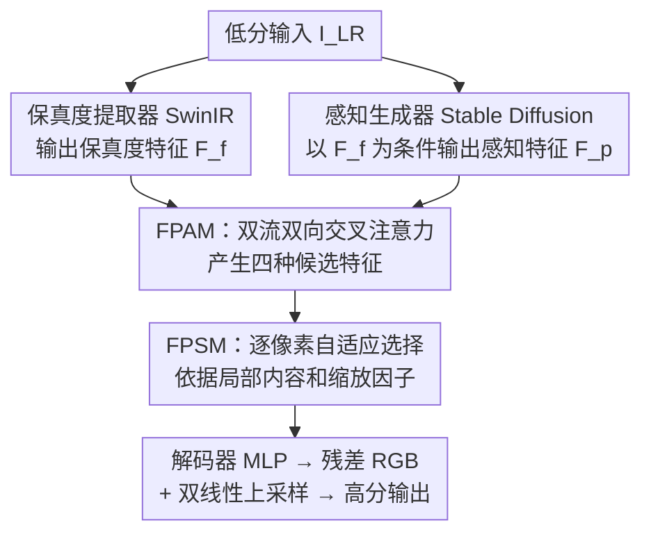

# Fidelity- and Perception-Aware Local Implicit Attention for Arbitrary-Scale Image Super-Resolution

**会议**: ECCV2026  
**arXiv**: [2606.21910](https://arxiv.org/abs/2606.21910)  
**代码**: [https://github.com/XUSean0118/FPLIA](https://github.com/XUSean0118/FPLIA)  
**领域**: 图像恢复  
**关键词**: 任意尺度超分辨率, 扩散模型, 局部隐式函数, 保真度-感知权衡, 自适应特征选择

## 一句话总结

FPLIA 提出一个双流框架，将回归骨干的保真度特征与扩散模型的感知特征通过非对称双向交叉注意力（FPAM）和逐像素自适应选择（FPSM）融合，在 ASISR 上同时实现了高保真度和高感知质量。

## 研究背景与动机

任意尺度图像超分辨率（ASISR）的目标是用单一模型在连续缩放因子范围内重建高分辨率图像。当前主流范式是将深度特征提取器与局部隐式图像函数结合——以坐标条件化的 MLP 将 2D 查询位置及其邻域特征映射为 RGB 像素值。这一范式面临一个根本张力：特征来源决定了最终质量的上限。基于回归骨干（SwinIR、EDSR 等）配合 L1/L2 损失训练的方法（如 LIIF、LTE、CiaoSR、HIIF）能得到极高的像素级保真度（高 PSNR），但重建结果天然地压制高频纹理，视觉上偏模糊。相反，基于扩散模型的方法（如 IDM、Kim et al.）能生成感知上锐利逼真的纹理，却在结构上存在幻觉风险——在重复纹理区域甚至可能凭空生成不存在的字符。两类方法站在同一张图的不同评估指标上表现截然不同，但难以兼得。

这种保真度与感知质量之间的对立并非简单的"取中间值"就能解决。关键在于两个特征流的信息差异是**不对称的**：保真度特征提供一个结构锚定的脚手架，能够约束感知特征使其回归真实结构；感知特征注入高频多样性，给平滑的保真度表示补充细节。这意味着两者的交互方向应该建模为独立的非对称通路，而非简单的拼接或加权平均。同时，两类特征的相对重要性随空间位置和缩放因子动态变化——平坦区域保真度特征已经足够，而纹理丰富区域急需感知线索；放大倍数越高，保真度特征的可用信息越少，对感知特征的依赖越大。因此，一个好的融合框架需要两个能力：通过交互生成覆盖不同保真度-感知配比的多样化候选表示，以及在每个查询位置自适应地选择最可靠的候选。

本文的核心 idea 是**提出 FPLIA 框架，通过非对称双向跨特征注意力（FPAM）在每个查询坐标生成 4 种保真度-感知配比不同的候选特征，再通过逐像素自适应选择模块（FPSM）依据局部内容和缩放因子选出最合适的候选来预测 RGB 值，从而同时达到高保真度与高感知质量。**

## 方法详解

### 整体框架

FPLIA 的整体流程分为五个组件：一个保真度特征提取器（SwinIR）从低分输入提取保真度特征图 $\mathcal{F}_f$；一个以 $\mathcal{F}_f$ 为条件的感知特征生成器（Stable Diffusion v1.5）产生感知特征图 $\mathcal{F}_p$；两个特征图输入 FPAM，在每一个查询坐标上施加自注意力和双向交叉注意力，产生四种候选表示；FPSM 为每个候选估计置信度，选择置信度最高的候选；最后解码器 MLP 将所选特征映射为残差 RGB 值，加到双线性上采样后的低分图像上得到最终输出。保真度提取器和感知生成器在微调阶段冻结，只更新 FPAM、FPSM 和解码器，因此计算开销增加不大（相较 Kim et al. 基线增加不到 5% 延迟和 2% 显存）。

### 关键设计

**1. FPAM：非对称双向跨特征注意力产生多样化候选**

FPAM 的核心洞察是保真度和感知特征之间的交互方向具有不对称性，因此需要独立的通路而非单一的对称操作。它将单流的跨尺度局部注意力（CSLA）扩展为双流架构：对低分特征图上每个查询坐标 $x_q$，分别从两个特征图插值出查询嵌入 $q_f, q_p$，并从局部邻域网格采样键值嵌入。将标准的 CSLA 函数在四种组合下独立执行——(i) 保真度自注意力 $\tilde{f}_f$、(ii) 感知自注意力 $\tilde{f}_p$、(iii) 感知查询 × 保真度键值 $\tilde{f}_{pf}$、(iv) 保真度查询 × 感知键值 $\tilde{f}_{fp}$。$\tilde{f}_{fp}$ 在保真度锚定的基础上补充感知细节，$\tilde{f}_{pf}$ 在感知驱动的表示中约束结构保真度，两者占据保真度-感知谱系的不同区域，构成相互不可替代的候选池。消融实验证明，仅用两个自注意力输出（$\tilde{f}_f + \tilde{f}_p$）的 LPIPS 远不如加入两个交叉注意力后的完整配置，说明跨流交互产生的混合特征是性能跃升的关键。

**2. FPSM：依赖局部内容和缩放因子的逐像素硬选择**

FPSM 的设计动机是：四种候选特征的最优选择随空间位置和缩放因子变化，而软混合（如加权平均/特征调制）会在不同统计流形的特征间产生退化输出。FPSM 首先从保真度特征图和感知特征图通过卷积层预测各自的全局置信图 $Conf_f$ 和 $Conf_p$，然后在 $x_q$ 邻域采样局部置信值。每个候选的最终置信度由其对应的注意力图与局部置信值的逐元素乘积再拼接 cell size（编码目标缩放因子）后经全连接层得到。训练时用 Gumbel-Softmax 实现可微的离散选择（温度从 1 退火到 0.001），推理时直接取 argmax。可视化分析证明：FPSM 在平坦区域优先选择保真度特征 $\tilde{f}_f$，在纹理丰富区域选择感知特征 $\tilde{f}_p$，而 $\tilde{f}_{fp}$（保真度锚定+感知细节）在高放大倍数下被选中的比例显著上升——这恰好与"放大倍数越高越需要感知补充"的需求一致。

**3. 五路监督策略确保每个候选独立有用**

为了保证 FPSM 的置信度分数真正反映候选重建质量的差异而非训练不均衡的假象，FPLIA 对所有五种输出（选择输出 + 四个独立候选）施加独立的监督损失。选择输出用标准 MSE，保真度自注意力输出同样用 MSE，而感知流相关的三个输出（$\tilde{f}_p, \tilde{f}_{pf}, \tilde{f}_{fp}$）的损失使用 $\mu/\sigma$ 加权——借鉴 Kim et al. 的一步扩散近似策略，根据扩散过程的信噪比动态调整误差权重。五个损失不加权直接求和。这种设计确保即使在训练初期 FPSM 的软选择不准确时，每个候选支路仍能独立学到有意义的表示，为后续的置信度估计提供可靠的基础。

### 损失函数 / 训练策略

训练损失由五支路 MSE 组成：选择输出 $L_{select}$、保真度输出 $L_f$ 均为标准 MSE；感知相关输出 $L_p, L_{pf}, L_{fp}$ 采用 $\mu/\sigma$ 加权 MSE（$\frac{\mu}{\sigma}(I^{HR_i} - I^{GT})$，$\mu/\sigma$ 反映扩散过程的信噪比）。五个损失不加权求和。训练时 FPAM、FPSM 和解码器更新，SwinIR 和 Stable Diffusion v1.5 冻结。Gumbel-Softmax 温度从 1 退火至 0.001，实现从训练时软选择到推理时硬选择的平滑过渡。

## 实验关键数据

### 主实验

在 Set5 / Set14 / B100 / Urban100 上测试 ×4~×16 的整数放大因子和非整数放大因子，同时报告 PSNR（保真度）和 LPIPS（感知质量）。

| 数据集 | 指标 | 最优回归方法 | 最优扩散方法 | FPLIA | 提升（vs 回归） | 提升（vs 扩散） |
|--------|------|-------------|-------------|-------|----------------|----------------|
| Set14 ×4 | PSNR↑ | 29.10 (HIIF) | 27.77 (Kim) | **28.48** | -2.13% | +2.56% |
| Set14 ×4 | LPIPS↓ | 0.267 (HIIF) | 0.201 (Kim) | **0.188** | +29.59% | +6.47% |
| B100 ×8 | PSNR↑ | 25.09 (HIIF) | 24.18 (Kim) | **24.70** | -1.55% | +2.15% |
| B100 ×8 | LPIPS↓ | 0.532 (CiaoSR) | 0.466 (Kim) | **0.431** | +18.98% | -0.23% |
| Urban100 ×4 | PSNR↑ | 27.44 (HIIF) | 26.42 (Kim) | **26.87** | -2.08% | +1.70% |
| Urban100 ×4 | LPIPS↓ | 0.187 (CiaoSR) | 0.170 (Kim) | **0.160** | +14.44% | +5.88% |

FPLIA 在几乎所有设置下同时优于扩散方法（PSNR 和 LPIPS 双指标提升），对回归方法则是以约 2-3% 的 PSNR 代价换来 15-30% 的 LPIPS 改善，处于保真度-感知的 Pareto 前沿。推理时相比 Kim et al. 基线仅增加 <5% 延迟和 <2% 显存。

### 消融实验

| 配置 | ×4 PSNR↑ | ×4 LPIPS↓ | ×8 PSNR↑ | ×8 LPIPS↓ | 说明 |
|------|---------|-----------|---------|-----------|------|
| 无 FPAM + 无 FPSM | 28.40 | 0.231 | 25.15 | 0.383 | 基线（直接融合） |
| +FPAM 但无 FPSM | 28.53 | 0.188 | 25.28 | 0.371 | 加交互但不加选择 |
| 无 FPAM +FPSM | 28.60 | 0.211 | 25.24 | 0.366 | 加选择但不加交互 |
| **Full model** | **28.91** | **0.183** | **25.44** | **0.338** | 两者协同增益超单项之和 |
| 仅 $\tilde{f}_f$ | 29.51 | 0.258 | 25.84 | 0.414 | 最高 PSNR、最差 LPIPS |
| 仅 $\tilde{f}_{fp}$ | 28.28 | 0.186 | 25.03 | 0.352 | 保真度锚定+感知细节表现最均衡 |
| $\tilde{f}_f + \tilde{f}_p$ | 28.71 | 0.206 | 25.31 | 0.361 | 两个自注意力输出加起来远不如全配置 |
| 逐像素选择 vs 拼接 | 28.91 vs 28.53 | 0.183 vs 0.188 | 25.44 vs 25.28 | 0.338 vs 0.371 | 硬选择明显优于软混合 |

### 关键发现
- FPAM 与 FPSM 的协同增益超过各自贡献之和：交叉注意力生成多样化候选，选择机制从中挑最优——缺一不可。
- 两个交叉注意力特征中，$\tilde{f}_{fp}$（保真度查询 × 感知键值）的独立性能远超 $\tilde{f}_{pf}$（感知查询 × 保真度键值），说明在保真度锚定上补充感知细节比反过来更有效。
- FPSM 的选择模式随放大倍数变化：×2 时 $\tilde{f}_f$ 占 47%，×16 时降到 33%，而 $\tilde{f}_{fp}$ 从 23% 升至 45%——定量验证了"放大倍数越高越依赖感知补充"。
- 逐像素选择优于逐通道选择：保真度-感知权衡是空间维度的，不沿通道维变化。

## 亮点与洞察
- 将保真度-感知权衡从"选一边站队"重构为"双流并行+逐像素选优"，框架设计精准对应问题结构——特征的多样性来自不对称交互，选择的依据来自局部内容和缩放因子。
- 非对称双向交叉注意力（FPAM）巧妙解决了"直接拼接会退化"的问题：每个方向的注意力产生一种独立有用、但又不可互相替代的混合特征，为后续选择提供了有意义的不连续选项。
- FPSM 的 Gumbel-Softmax 离散选择策略耦合置信度估计，在训练时用退火温度实现从软到硬的平滑过渡——避免了软混合导致的不同统计流形退化。
- 框架对骨干架构无关（backbone-agnostic），可在不同保真度提取器和感知生成器之间切换，有较好的可迁移性。

## 局限与展望
- 感知生成器目前使用 Stable Diffusion v1.5，计算量仍远大于纯回归方案——虽然增量开销仅 5%，但总延迟约 98 秒（A6000 上 128→512）。在实时场景下仍不实用。
- FPSM 的置信度估计依赖全局置信图，对于极不均匀的长尾纹理区域可能存在选择不稳定的情况。
- 本文主要聚焦于超分辨率，该方法的思想（双流特征交互+逐像素选择）能否推广到其他低级视觉任务（去噪、去模糊、修复）值得探索。
- Gumbel-Softmax 的温度退火调度（1→0.001）需要调参，不同数据集或不同任务可能需要重新调整退火速度。

## 相关工作与启发
- **vs LIIF / LTE / CiaoSR / HIIF**: 这些回归方法只用单流保真度特征配合局部隐式函数，FPLIA 首次将扩散模型的感知特征系统性地引入 ASISR 的深度学习器。
- **vs Kim et al. (2024)**: 这是最接近的工作，将回归特征作为扩散管线的条件输入但两条流松散耦合。FPLIA 设计了显式的双向交互注意力（FPAM）和逐像素选优（FPSM），不是简单条件控制。
- **vs IDM**: IDM 完全用扩散模型替代回归骨干，生成纹理好但缺乏结构约束；FPLIA 保留保真度流作为结构锚定，通过 FPAM 的交叉注意力在生成纹理时注入结构约束。
- **可迁移思路**: "双流异步交互 + 逐像素硬选择"的设计范式可适用于其他需要融合异构特征的低级视觉任务，如不同感受野的特征融合、不同模态的特征对齐等。

## 评分
- 新颖性: ⭐⭐⭐⭐⭐ 将保真度-感知权衡从"站队"转化为"生成候选+择优录取"的范式，FPAM 的非对称双向交互动机分析扎实、实现自然，不是简单堆模块。
- 实验充分度: ⭐⭐⭐⭐⭐ 在 5 个数据集、×4~×16 整数+非整数因子、7 个基线方法上全面对比，消融覆盖了每个模块、每个分支、每种选择策略，还有可视化分析 FPSM 的选择分布，证据链条完整。
- 写作质量: ⭐⭐⭐⭐ 动机推演和设计分析（Remark 1 + spatial/scale 双轴分析）讲得很清楚，但实验部分表格稍显冗长（~5 张大表），可以对非核心表做浓缩。
- 价值: ⭐⭐⭐⭐⭐ 解决了 ASISR 中长期存在的保真度-感知二选一问题，提供了一个可行且高效的双流融合框架，对后续 ASISR 和更广泛的双流特征融合设计都有参考价值。

<!-- RELATED:START -->

## 相关论文

- [\[CVPR 2026\] Bridging the Perception Gap in Image Super-Resolution Evaluation](../../CVPR2026/image_restoration/bridging_the_perception_gap_in_image_super-resolution_evaluation.md)
- [\[CVPR 2026\] CASR: A Robust Cyclic Framework for Arbitrary Large-Scale Super-Resolution with Distribution Alignment and Self-Similarity Awareness](../../CVPR2026/image_restoration/casr_a_robust_cyclic_framework_for_arbitrary_large-scale_super-resolution_with_d.md)
- [\[ICLR 2026\] SuperF: Neural Implicit Fields for Multi-Image Super-Resolution](../../ICLR2026/image_restoration/superf_neural_implicit_fields_for_multi-image_super-resolution.md)
- [\[CVPR 2026\] Task-Aware Image Signal Processor for Advanced Visual Perception](../../CVPR2026/image_restoration/task-aware_image_signal_processor_for_advanced_visual_perception.md)
- [\[NeurIPS 2025\] Implicit Augmentation from Distributional Symmetry in Turbulence Super-Resolution](../../NeurIPS2025/image_restoration/implicit_augmentation_from_distributional_symmetry_in_turbulence_super-resolutio.md)

<!-- RELATED:END -->
