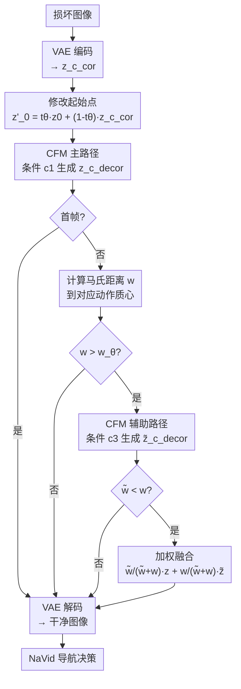

# FlowDec: Temporal Conditional Flow Decorruptor for Robust Continuous Vision-Language Navigation

**会议**: ECCV 2026  
**arXiv**: [2606.22424](https://arxiv.org/abs/2606.22424)  
**代码**: 无  
**领域**: 具身智能 / 图像恢复  
**关键词**: 视觉语言导航, 图像去损坏, 条件流匹配, 时序一致性, 具身智能

## 一句话总结
FlowDec 提出一种基于条件流匹配的图像去损坏框架，通过混合时序条件策略和动作质心引导过滤，在不修改 VLN 导航骨架的前提下增强其对多种视觉损坏的鲁棒性，在 R2R-CE 和 RxR-CE 上相对导航成功率分别提升 25.33% 和 9.38%，推理速度比扩散类 TTA 方法快 3-8 倍。

## 研究背景与动机
视觉语言导航在连续环境中（VLN-CE）是具身智能的核心问题，要求智能体根据自然语言指令在未见过的 3D 场景中完成目标导向导航。近年来，大型模型（LM）驱动的 VLN-CE 智能体（如 NaVid、NaVILA）凭借强大的推理和跨模态对齐能力，在长程规划和指令理解上取得了显著进展。然而，这些方法隐含地假设视觉输入是干净稳定的——在真实部署中这一假设几乎不成立。机器人不可避免地暴露于运动模糊、低光照/过曝、雨雪雾、镜头污染和传感器噪声等多样视觉损坏中，这些损坏会扭曲空间线索（物体边界、地面纹理、深度不连续），直接破坏航点预测和动作选择。实验表明，给 NaVid 施加合成散粒噪声后，其导航成功率近乎腰斩，尽管该模型经过了大规模预训练。

这一问题的核心矛盾在于：LM 的推理能力虽强，但其感知层的鲁棒性极弱，且这种脆弱性在 VLN-CE 领域尚未被系统研究。现有方案各有短板——盲图像去噪（BID）追求感知质量而非导航一致性；测试时适应（TTA）需在线更新模型参数，对大型冻结 LM 不可行且存在灾难性遗忘风险；扩散式 TTA 虽在输入空间操作避免了参数更新，但逐帧独立处理，忽视导航所需的帧间时序一致性和动作级物理连贯性，且多步扩散采样延迟过高无法满足在线部署的实时性要求。

本文首次将图像去损坏引入 VLN-CE 场景，核心 idea 是：将导航感知的去损坏建模为实时条件流匹配问题，用历史帧信息和原子动作先验来对齐生成流路径并动态评估输出质量，在保持帧间一致性的同时实现快速推理。

## 方法详解

### 整体框架
FlowDec 是一个即插即用的视觉去损坏模块，位于 VLN 智能体的感知层与决策层之间。输入为损坏的 RGB 图像和 VLN 模型预测的原子动作标签（FORWARD / TURN-LEFT / TURN-RIGHT 等），输出为去损坏后的干净图像，直接送入下游导航模型。方法分训练和推理两阶段，均在 VAE 隐空间中进行条件流匹配（CFM），以 20 步 Euler 求解器从噪声隐变量沿学习到的速度场积分为干净隐变量。训练阶段的核心是三条混合时序条件（$\mathbf{c}_1$/$\mathbf{c}_2$/$\mathbf{c}_3$）与动态权重调度，以及从连续帧对中统计每类原子动作的隐变量差分分布（动作质心）。推理阶段以 $\mathbf{c}_1$ 为主路径，仅在帧间不一致程度超过阈值时触发 $\mathbf{c}_3$ 辅助路径，经马氏距离加权融合后输出。

### 关键设计

**1. 混合时序条件策略：让流匹配路径"看见"历史帧**

单帧 CFM 去损坏忽略了连续导航中帧间的时序关系，而朴素的数据增强容易过拟合且无法促进空间理解。FlowDec 引入三条条件来对齐生成流路径与历史上下文。条件 $\mathbf{c}_1 = [\mathbf{z}_{\text{c\_aug},1}, \emptyset, 0]$ 仅使用当前增强帧的隐变量，是标准单帧去噪模式。条件 $\mathbf{c}_2 = [\mathbf{z}_{\text{c\_aug},1}, \mathbf{z}_{\text{p\_aug},1} - \mathbf{z}_{\text{p\_gt},1}, a_p]$ 加入前一帧增强与真值的隐变量差分（近似损坏特征），用于训练阶段让模型学习损坏建模。条件 $\mathbf{c}_3 = [\mathbf{z}_{\text{c\_aug},1}, \mathbf{z}_{\text{p\_aug},1} - \mathbf{z}_{\text{p\_denoise}}, a_p]$ 用前一帧的去噪结果替代真值差分，桥接合成损坏与真实损坏之间的域差异，是唯一可在推理时使用的时序条件。训练时采用动态权重调度：$\mathbf{c}_1$ 权重固定为 0.3；$\mathbf{c}_2$ 在早期占主导（初始 0.7，随 epoch 线性衰减），建立稳定的损坏建模；$\mathbf{c}_3$ 权重逐步增加，使模型渐进适应自身输出的域差异。由于所有条件的 CFM 优化目标一致（均回归 $v_\theta$ 到 $\mathbf{z}_{\text{c\_gt},1} - \mathbf{z}_0$），时序条件的训练信号会使主路径 $\mathbf{c}_1$ 的流路径天然对齐，即使推理时不使用时序输入也能受益。

**2. 动作质心引导过滤：用导航动力学校准帧间一致性**

时序条件 $\mathbf{c}_3$ 虽然提供了历史上下文，但在迭代推理中会累积生成误差——前一帧的去噪误差被喂入下一帧的条件，形成致命的滚雪球效应。FlowDec 的核心洞察是：帧间一致性天然与原子动作耦合。训练时，从 2,440,814 对连续帧中统计每类原子动作的隐变量差分 $\mathbf{z}_{\text{p\_gt},1} - \mathbf{z}_{\text{c\_gt},1}$ 的均值 $\mu_{\text{gt},a}$ 和方差 $\sigma_{\text{gt},a}$，建立动作质心 $A_{\text{gt},a} = \mathcal{N}(\mu_{\text{gt},a}, \sigma_{\text{gt},a})$。这本质上是 VLN 任务"免费赠送"的一致性先验——同一动作（如前进 25cm）在不同场景下引起的视觉变化在隐空间中应服从相似分布。推理时，对当前帧与前帧去损坏隐变量的差分 $\mathbf{z}_{\text{p\_decor}} - \mathbf{z}_{\text{c\_decor}}$ 计算到对应动作质心的马氏距离 $w = \sqrt{\sum_{k=1}^{d} \frac{(z_{\text{p\_decor},k} - z_{\text{c\_decor},k} - \mu_{\text{gt},a_p,k})^2}{d \sigma_{\text{gt},a_p,k}^2}}$。当 $w > w_\theta$（0.25）时，判定帧间不一致，触发 $\mathbf{c}_3$ 生成备选隐变量 $\tilde{\mathbf{z}}_{\text{c\_decor}}$ 并计算其马氏距离 $\tilde{w}$；若 $\tilde{w} < w$（时序条件确有改善），则按 $\frac{\tilde{w}}{\tilde{w}+w} : \frac{w}{\tilde{w}+w}$ 的比例加权融合；否则直接采纳 $\mathbf{c}_1$ 结果。实验中大多数帧的 $w$ 落在 0.15-0.45 区间，阈值 0.25 在时序引导和主路径稳定之间取得最优平衡。

**3. 修改流匹配起始点：用少量损坏信号换速度和一致性**

标准流匹配从纯随机噪声 $\mathbf{z}_0 \sim \mathcal{N}(0, I)$ 出发，沿完整积分路径 $t:0 \to 1$ 生成图像。FlowDec 将起始点修改为 $\mathbf{z}'_0 = t_\theta \mathbf{z}_0 + (1 - t_\theta) \mathbf{z}_{\text{c\_cor},1}$，其中 $t_\theta = 0.95$，即从损坏图像的 5% 隐变量 + 随机噪声的 95% 混合态出发。这一设计牺牲了少量去噪能力（积分路径变短），但换来了两个关键收益：推理步数减少，且输出与输入图像的结构一致性增强——因为起始点本身就保有原始图像的弱信号。消融显示，$t_\theta = 1$（纯噪声起步）在散粒噪声和雾条件下的 SPL 均低于 $t_\theta = 0.95$，而进一步减小 $t_\theta$（例如混入过多损坏信号）则会削弱去损坏能力，导致性能逐渐下降。

### 一个完整示例
假设机器人在雾天室内执行导航，VLN 模型预测当前动作为 FORWARD（前进 25cm）。当前帧图像受严重雾损坏，墙壁和地板纹理几乎不可辨。VAE 编码损坏图像得 $\mathbf{z}_{\text{c\_cor},1}$，从 $\mathbf{z}'_0 = 0.95\mathbf{z}_0 + 0.05\mathbf{z}_{\text{c\_cor},1}$ 出发，用 20 步 Euler 求解 ODE，以 $\mathbf{c}_1 = [\mathbf{z}_{\text{c\_aug},1}, \emptyset, 0]$ 为条件生成去损坏隐变量 $\mathbf{z}_{\text{c\_decor}}$。接着计算前帧去损坏结果与当前帧结果之差 $\mathbf{z}_{\text{p\_decor}} - \mathbf{z}_{\text{c\_decor}}$ 到 FORWARD 动作质心（$\mu_{\text{gt,forward}}, \sigma_{\text{gt,forward}}$，来自 162 万对前进帧的统计）的马氏距离，得到 $w = 0.32$。由于 $w > 0.25$，判定帧间不一致（可能是雾导致地板颜色剧变），触发 $\mathbf{c}_3$ 条件 $[\mathbf{z}_{\text{c\_aug},1}, \mathbf{z}_{\text{p\_aug},1} - \mathbf{z}_{\text{p\_denoise}}, \text{forward}]$ 生成备选隐变量 $\tilde{\mathbf{z}}_{\text{c\_decor}}$，其马氏距离 $\tilde{w} = 0.18$。因为 $\tilde{w} < w$，最终输出为加权融合：$0.36 \cdot \mathbf{z}_{\text{c\_decor}} + 0.64 \cdot \tilde{\mathbf{z}}_{\text{c\_decor}}$，VAE 解码后送入 NaVid 做导航决策。整个过程附加延迟约 173ms（若触发 c3 则略高），远低于扩散类方法的 588-1411ms。

### 损失函数 / 训练策略
FlowDec 的优化目标为条件流匹配损失：$\mathcal{L}_{\text{CFM}}(\theta) = \mathbb{E}_{\mathbf{z}_{\text{c\_gt},t},t} \left[ \|\mathbf{z}_{\text{c\_gt},1} - \mathbf{z}_0 - v_\theta(\mathbf{z}_{\text{c\_gt},t}, \mathbf{c}_i, t)\|_2^2 \right]$，其中 $\mathbf{z}_{\text{c\_gt},t} = t\mathbf{z}_{\text{c\_gt},1} + (1-t)\mathbf{z}_0$ 为线性插值的中间隐变量，速度场 $v_\theta$ 由 U-Net 参数化。训练数据来自 R2R-CE 和 RxR-CE 训练集中 70+ 场景、244 万对连续 RGB 帧，增强策略采用 PIXMIX + SimSiam（与 Decorruptor 一致）。条件权重动态调度为 $w(\mathbf{c}_1) = 0.3$，$w(\mathbf{c}_2) = 0.7 \times (1 - 0.8 \times \text{epoch}/20)$，$w(\mathbf{c}_3) = 0.7 \times 0.8 \times \text{epoch}/20$。初始学习率 $1 \times 10^{-5}$，训练 20 epochs，单卡 NVIDIA RTX 4090。推理使用 20 步 Euler 求解器，关键超参 $w_\theta = 0.25$（过滤阈值），$t_\theta = 0.95$（起始点混合系数）。

## 实验关键数据

### 主实验
在 R2R-CE（1,839 条轨迹）和 RxR-CE（3,669 条轨迹）上，对 6 种最具破坏性的损坏类型（高斯噪声、散粒噪声、雪、雾、JPEG 压缩、对比度变化）评估导航成功率（SR）和路径加权成功率（SPL）。FlowDec 在所有聚合指标上均超越基线方法，且推理延迟优势显著。

| 方法 | R2R-CE SR | R2R-CE SPL | RxR-CE SR | RxR-CE SPL | 单步去损坏延迟 |
|------|-----------|------------|-----------|------------|---------------|
| NaVid（无去损坏） | 21.58 | 19.11 | 30.75 | 24.88 | 370 ms |
| SCUNet（盲去噪） | 14.68 | 13.54 | 22.94 | 18.53 | - |
| Dec-DPM（扩散TTA, 5 NFE） | 23.94 | 19.46 | 25.01 | 18.10 | 370 + 1411 ms |
| Dec-CM（一致性模型, 2 NFE） | 24.29 | 21.52 | 29.12 | 22.90 | 370 + 588 ms |
| **FlowDec（本文）** | **27.04** | **23.62** | **33.63** | **26.31** | **370 + 173 ms** |

注：表中 SR/SPL 为 6 种损坏类型下的平均值（%）。FlowDec 在 R2R-CE 和 RxR-CE 上的相对 SR 提升分别为 25.33% 和 9.37%。Dec-DPM 和 Dec-CM 的初始化权重继承自 Instruct-Pix2Pix（4500 万图文对预训练），而 FlowDec 仅使用 VLN-CE 训练数据。

### 消融实验

| 消融维度 | 配置 | R2R-CE SPL（散粒噪声）| R2R-CE SPL（雾）| 说明 |
|---------|------|---------------------|-----------------|------|
| 训练策略 | 仅 $\mathbf{c}_1$ 训练 | ~19.5 | ~14.5 | 无时序条件，流路径未对齐 |
| 训练策略 | $\mathbf{c}_1$+$\mathbf{c}_2$+$\mathbf{c}_3$ 完整训练 | **23.76** | **22.26** | 时序条件即使推理不用也提升 $\mathbf{c}_1$ 一致性 |
| 起始点 $t_\theta$ | $t_\theta = 1.0$（纯噪声） | ~21.0 | ~18.0 | 完全随机起步掉点明显 |
| 起始点 $t_\theta$ | $t_\theta = 0.95$（本文） | **23.76** | **22.26** | 最优平衡：保留输入信号但不削弱去损坏 |
| 过滤阈值 $w_\theta$ | $w_\theta = 0.15$（频繁触发 $\mathbf{c}_3$） | ~22.5 | ~20.0 | 过度依赖时序条件导致误差累积 |
| 过滤阈值 $w_\theta$ | $w_\theta = 0.25$（本文） | **23.76** | **22.26** | 适度触发，平衡时序引导与主路径稳定性 |
| 求解步数 | FlowDec-5（5 步） | 22.88 | 21.32 | 5 步已接近 20 步性能，速度-质量可灵活折中 |
| 求解步数 | FlowDec-20（20 步） | **23.76** | 22.26 | 20 步为默认，部分损坏 5 步甚至更好 |

### 关键发现
- **时序一致性比单帧重建质量更重要**：Dec-DPM 在 JPEG 压缩下生成视觉可接受的单帧，但 warp error 高达 0.36（FlowDec 仅 0.10），导航成功率反而不如预期——因为 LM 驱动 VLN 模型依赖图像历史推断自定位，帧间不一致比单帧略模糊更致命。
- **雾和雪是破坏性最强的损坏**：这两种天气效果完全不在训练数据域内，NaVid 的 SPL 分别降至 14.33 和 18.43；FlowDec 在雾条件下 SPL 回升至 22.26（R2R-CE），在所有损坏中增益最大。
- **干净图像上几乎无损**：FlowDec 在原始干净 R2R-CE 上的 SR 为 40.89（NaVid 为 41.40），SPL 为 35.96（NaVid 为 35.85），统计上不显著，证明即插即用不会破坏原有能力。
- **跨 backbone 泛化**：在 Uni-NaVid 上复现实验，FlowDec 同样带来一致的 SR/SPL 提升（R2R-CE 平均 SR 从 30.71 到 32.49），确认了模型无关的即插即用特性。
- **真实机器人验证**：在 Unitree GO2 四足机器人上部署，4 个室内外任务各测 20 次，FlowDec 在全部任务上超越 NaVid 基线（例如室内 Task 1 成功率从 0.20 到 0.35，室外 Task 3 从 0.10 到 0.30）。

## 亮点与洞察
- **解耦鲁棒性与导航能力**：FlowDec 不修改 VLN 骨架的一行代码或一个权重，完全作为视觉预处理模块运行。这种"插件式鲁棒性"设计意味着任何 LM-based VLN 模型都可以直接受益，思路可迁移到其他具身感知任务（如物体操纵的视觉去损坏）。
- **用导航动力学作免费一致性先验**：动作质心的设计极其巧妙——在 VLN 任务中，帧间应有的视觉变化由原子动作唯一决定，论文将这一任务内置的结构先验转化为可计算的统计分布（高斯质心），无需任何额外标注，是"让任务约束为你工作"的典范。
- **选择正确的生成范式比调参更重要**：FlowDec 用 flow matching（确定性 ODE 求解）替代扩散模型的多步随机采样，单步 173ms 的速度让实时去损坏首次可行。反观 Dec-DPM 即使蒸馏到 5 NFE 仍需 1411ms，70 步的典型导航轨迹累计延迟接近 100 秒——在真实机器人上完全不可接受。这提醒我们，在具身场景下 generative model 的选择必须将延迟作为一等设计约束。

## 局限与展望
- **作者承认的局限**：合成训练损坏与真实损坏之间存在域差异，干净场景下有轻微掉点（归因于合成损坏训练与干净图像的域不匹配）；当前仅使用 VLN-CE 训练数据训练，而未利用大规模预训练先验（如 Instruct-Pix2Pix 的 4500 万图文对）。
- **自己发现的局限**：(1) 动作质心依赖 VLN 模型的动作空间定义（如 NaVid 的 FORWARD 25cm / TURN 15° 等），换用不同动作粒度或连续控制的 VLN 模型时需重新统计质心；(2) 仅恢复 RGB 图像，未考虑深度、语义分割等对其他导航模块同样关键的模态；(3) 20 步 Euler 求解在极端实时场景（<50ms 延迟预算）仍可进一步压缩，5 步虽接近但平均 SPL 仍有 0.74 的差距。
- **改进思路**：(1) 引入在线自适应动作质心更新，使模型在部署中逐步适应特定环境和机器人的运动特性；(2) 多模态联合去损坏（RGB + 深度 + 语义），利用模态间的互补信息提升恢复质量；(3) 将 20 步模型蒸馏为 1-2 步学生模型，或采用 consistency model 风格的训练策略进一步压缩推理步数。

## 相关工作与启发
- **vs Decorruptor（Dec-DPM / Dec-CM）**：最直接的对比基线。同属输入空间 TTA，均采用 PIXMIX + SimSiam 增强策略，Diffusion Probabilistic Model 或 Consistency Model 做去损坏。核心差异在于 Decorruptor 逐帧独立处理，完全忽视时序一致性，且扩散采样延迟高（5 NFE 需 1411ms）。FlowDec 引入时序条件 + 动作质心过滤强制帧间连贯，且 flow matching 天然比扩散更高效——warp error 从 0.31-0.33 降至 0.11，证明"时序一致性 > 单帧重建质量"在导航场景中的优先级更高。
- **vs SCUNet（盲图像去噪）**：数据驱动 BID 的典型代表，用合成退化 + pixel/对抗损失训练。在训练分布内的损坏（高斯、散粒噪声）上尚可工作，但一遇到域外损坏（雾、对比度变化）立即崩溃（R2R-CE 对比度 SR 仅 0.05）。FlowDec 的增强训练策略（PIXMIX 的混合损坏模拟）使其泛化范围更广。
- **vs Tent / TTA（参数空间适应）**：经典 TTA 通过测试时更新 BatchNorm 或轻量适配器来适应分布偏移。对于大型冻结 LM（如 Vicuna-7B），在线更新参数不可行且存在灾难性遗忘风险。FlowDec 完全在输入空间操作，避开了参数空间的难题，这种"输入空间 TTA"的思路可推广到其他使用冻结大模型的具身感知任务。

## 评分
- 新颖性: ⭐⭐⭐⭐ 首次将图像去损坏系统引入 VLN-CE 领域并定义了导航感知去损坏问题，动作质心+时序条件的设计有新意；但 flow matching 和 CFM 框架本身非原创，训练增强策略沿袭 Decorruptor
- 实验充分度: ⭐⭐⭐⭐⭐ 6 种损坏类型 x 2 个数据集 x 2 种 backbone + 消融（训练策略/起始点/阈值/步数）+ warp error + 推理延迟 + 干净图像对照 + 真实机器人部署，实验链路极其完整
- 写作质量: ⭐⭐⭐⭐ 动机充分，方法描述清晰，消融分析有理有据；部分公式推导段落可精简，图表编号在正文中偶有跳跃（Table 6 被正文两处引用分别指代推理延迟和真机结果）
- 价值: ⭐⭐⭐⭐ 对 VLN 系统的真实部署有直接工程价值，即插即用设计降低了集成门槛；方法对损坏类型的泛化边界（是否对所有未见损坏都有效）和动作空间变化的鲁棒性还需进一步验证

<!-- RELATED:START -->

## 相关论文

- [\[CVPR 2026\] Spatio-Temporal Difference Guided Motion Deblurring with the Complementary Vision Sensor](../../CVPR2026/image_restoration/spatio-temporal_difference_guided_motion_deblurring_with_the_complementary_visio.md)
- [\[CVPR 2026\] EVLF: Early Vision-Language Fusion for Generative Dataset Distillation](../../CVPR2026/image_restoration/evlf_early_vision-language_fusion_for_generative_dataset_distillation.md)
- [\[ICML 2026\] Coevolutionary Continuous Discrete Diffusion: Make Your Diffusion Language Model a Latent Reasoner](../../ICML2026/image_restoration/coevolutionary_continuous_discrete_diffusion_make_your_diffusion_language_model_.md)
- [\[CVPR 2026\] White-Balance First, Adjust Later: Cross-Camera Color Constancy via Vision-Language Evaluation](../../CVPR2026/image_restoration/white-balance_first_adjust_later_cross-camera_color_constancy_via_vision-languag.md)
- [\[CVPR 2025\] Vision-Language Gradient Descent-driven All-in-One Deep Unfolding Networks](../../CVPR2025/image_restoration/vision-language_gradient_descent-driven_all-in-one_deep_unfolding_networks.md)

<!-- RELATED:END -->
