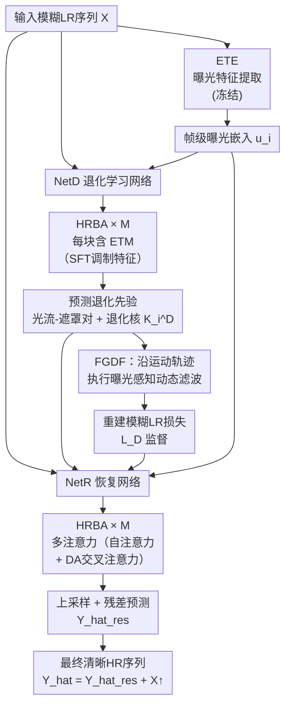

# FMA-Net++: Motion- and Exposure-Aware Joint Video Super-Resolution and Deblurring

**会议**: ECCV 2026  
**arXiv**: [2512.04390](https://arxiv.org/abs/2512.04390)  
**代码**: 未开源  
**领域**: 图像恢复  
**关键词**: 视频超分辨率, 视频去模糊, 曝光感知, 时序建模, 层次化精炼

## 一句话总结
FMA-Net++ 提出基于 HRBA 层次化双向聚合块的非循环序列级框架，通过曝光时间感知调控模块（ETM）将帧级曝光信息注入特征，配合曝光感知的流引导动态滤波（FGDF）联合建模运动与曝光时变退化，在 VSRDB 任务上达到 SOTA 精度和推理速度。

## 研究背景与动机

联合视频超分辨率与去模糊（VSRDB）试图从模糊的低分辨率视频中恢复清晰的超分辨率视频。在实际拍摄中，模糊低分辨率视频是普遍存在的：相机抖动、物体运动加上有限曝光时间导致运动模糊，而低分辨率又丢失了高频细节。单任务方法各自为政——超分辨无法移除模糊，去模糊又无法恢复高频——因此联合建模是必然选择。更深层的问题是，模糊的形成由两个耦合因素共同决定：运动场决定模糊的空间模式，曝光时间则控制模糊的时间范围和强度。更棘手的是，现代相机的自动曝光机制会逐帧动态调整曝光时长，导致同一段视频里不同帧的模糊程度剧烈变化——这是时空联合变化的复杂退化，现有固定曝光假设的模型根本无法捕捉。

现有方法在时序建模上也各有限制。滑动窗口架构（如 FMA-Net）每帧只看局部邻域，时序感受野有限，无法利用远处的信息来补全严重模糊区域。循环架构虽然能跨帧传播信息，但存在顺序处理瓶颈——无法并行加速，且在长序列上容易出现梯度消失。近期基于 Transformer 的方法（如 VRT）虽然支持并行，但计算和显存开销巨大。更本质的问题是，几乎所有已有方法都默认所有帧的曝光时间是固定的，一旦曝光变化，退化模式的估计就全面失准。FMA-Net 虽然通过流引导动态滤波处理了与运动相关的退化，但受限于滑动窗口设计和固定曝光假设。

本文从两个维度同时突破：时序建模上，提出 HRBA 层次化块来替代滑动窗口和循环结构，实现序列级并行并对层次化地扩展时序感受野；退化建模上，引入曝光时间感知调控层（ETM）显式地将每帧的曝光信息注入特征，让后续的退化估计网络输出既感知运动又感知曝光的退化核。**核心 idea：将 VSRDB 拆解为显式退化学习（NetD，预测运动-曝光联合退化核）和退化引导恢复（NetR，利用退化先验做高质量的清晰超分）两部分，由 HRBA 提供高效长程时序建模、ETM+ETE 注入帧级曝光条件，整体构成一个非循环、可并行的完整 pipeline。**

## 方法详解

### 整体框架

FMA-Net++ 的完整框架由两大子网络构成：退化学习网络（NetD）和恢复网络（NetR），两者都由多层 HRBA 块堆叠而成。整个 pipeline 基于一个关键观察（公式化表达见论文 Eq. 1-3）：模糊 LR 帧的退化核 $\mathcal{K}_i$ 在空间位置 $\boldsymbol{p}$ 上由该帧曝光时间 $\Delta t_{e,i}$ 和邻域内的连续运动场 $\boldsymbol{M}$ 联合决定。直接逆推这个连续物理过程不可行，因此 FMA-Net++ 用可学习的离散框架近似：NetD 从输入模糊 LR 序列中预测逐帧的退化核 $\mathcal{K}_i^D$ 和光流先验；NetR 接收这些退化先验，配合 HRBA 中的退化感知注意力（DA attention），逐帧恢复清晰 HR 帧。

具体流程为：输入模糊 LR 序列 $\boldsymbol{X}$ 同时送入预训练的曝光时间感知特征提取器（ETE）和 NetD。ETE 是一个基于 ResNet-18 的轻量网络，经监督对比学习预训练后冻结，输出帧级曝光嵌入 $\boldsymbol{u}_i$。NetD 由 $M$ 个 HRBA 块堆叠而成，每个 HRBA 块内都包含 ETM 层——它将 $\boldsymbol{u}_i$ 通过 SFT 调制 HRBA 输出的特征，确保所有尺度的特征都带上曝光信息。经过多层 HRBA 的层次化精炼后，NetD 预测两组关键先验：图像光流-遮罩对（描述清晰 HR 帧之间的运动）和曝光感知的退化核 $\mathcal{K}_i^D$。NetR 同样由 $M$ 个 HRBA 块组成，它的初始化特征融合了输入 LR 帧和 NetD 输出的上下文特征，多流-遮罩对也继承自 NetD。每个 NetR 的 HRBA 块中，多注意力模块包含自注意力和退化感知交叉注意力（DA attention），其中 query 来自 NetD 预测的退化核 $\mathcal{K}_i^D$，让恢复过程主动关注退化区域。最后，NetR 输出高频残差 $\hat{\boldsymbol{Y}}_i^{\text{res}}$，与双线性上采样的 LR 帧相加得到最终清晰 HR 输出。

### 关键设计

**1. HRBA：层次化双向聚合与多流-遮罩对的协同精炼**

已有的时序建模面临两难：滑动窗口受限于固定邻域、循环结构无法并行且易梯度消失。HRBA 块的核心思路是将时序建模拆成"层次化精炼"——每经过一个 HRBA 块，当前帧的特征从越来越远的过去和未来帧聚合信息，从而逐层扩展时序感受野，同时所有帧可以在序列级并行处理，不受顺序约束。

具体机制上，HRBA 块维护两个核心状态：当前帧 $i$ 的特征图 $\boldsymbol{F}_i^j$ 和一组多流-遮罩对 $\mathbf{f}_i^j$（由 $n$ 对光流 $\boldsymbol{f}$ 和遮挡掩码 $\boldsymbol{o}$ 组成，分别指向 $i\pm1$ 的邻帧）。之所以需要多组（$n>1$）流-遮罩对，是因为严重模糊下单一光流估计极不可靠，多组流提供了"一对多"的候选对应关系，让模型能从多个运动假设中选择最合理的来配准邻帧特征。在每个精炼步骤中：先用当前流-遮罩对做遮挡感知的 warp 聚合邻帧特征得到 $\tilde{\boldsymbol{F}}_i^j$，再基于 $\tilde{\boldsymbol{F}}_i^j$ 和当前 $\mathbf{f}_i^j$ 预测残差更新流-遮罩对（$\mathbf{f}_i^{j+1} = \mathbf{f}_i^j + \Delta\mathbf{f}_i^j$）。$\tilde{\boldsymbol{F}}_i^j$ 再经过多注意力模块（自注意力捕捉空间依赖，NetR 中再叠加上退化感知交叉注意力）、ETM 层（注入曝光信息）后，输出精炼后的 $\boldsymbol{F}_i^{j+1}$。随着 HRBA 块数 $M$ 增加（论文用 $M=4$），特征逐层更清晰、结构更对齐（可视化见论文 Fig. S3），时序感受野也逐步扩展。相比滑动窗口仅限于 3 帧邻域（如 FMA-Net），4 层 HRBA 可以聚合更远帧的信息用于补全严重模糊区域。

**2. ETE + ETM：曝光时间感知的特征提取与调控管线**

帧间曝光变化是 VSRDB 中被长期忽略的关键因素。同一段视频中，较短曝光的帧模糊轻、细节相对多，较长曝光的帧则模糊严重、空间信息严重丢失。如果网络不知道每帧的曝光条件，它就无法区分"这帧模糊是因为曝光长"还是"这帧本来就没有细节"，从而导致退化估计混乱。

ETE 是一个 ResNet-18，经监督对比学习在 5 个离散曝光等级上预训练（把 REDS-ME 合成的 5:1 到 5:5 五种 duty cycle 作为伪标签）。训练后冻结 ETE，以防止后续联合训练时曝光嵌入空间发生漂移。t-SNE 可视化显示（论文 Fig. 7a），ETE 输出的 5 类曝光嵌入在特征空间里形成清晰的分簇结构——最短曝光（5:1）分离度 100%，最长曝光之间稍有混淆（5:4 与 5:5 相邻易混），这符合极端模糊下视觉区分度自然的模糊边界。

ETM 层是一个轻量级 SFT（Spatial Feature Transform）模块，嵌入在每个 HRBA 块内部。它将帧级曝光嵌入 $\boldsymbol{u}_i$ 通过一个浅层网络 $\mathcal{M}$ 预测仿射参数 $(\boldsymbol{\alpha}, \boldsymbol{\beta})$，然后对注意力输出 $\hat{\boldsymbol{F}}_i^j$ 做逐通道调制：$\boldsymbol{F}_i^{j+1} = (1 + \boldsymbol{\alpha}) \odot \hat{\boldsymbol{F}}_i^j + \boldsymbol{\beta}$。这意味着每个 HRBA 块的所有精炼步骤都显式地知道当前帧的曝光条件——退化学习也因此可以在正确的时间尺度上预测退化核。控制实验很说明问题（论文 Table 6）：当在 REDS-RE 上故意把逐帧曝光引导 $\boldsymbol{u}_i$ 打乱或用固定假设替代时，PSNR 和 tOF 一致恶化，在曝光变化的过渡帧上尤其明显；随机错误曝光甚至比不用引导还差——证明 $\boldsymbol{u}_i$ 被积极利用，而非忽略。

**3. Exposure-aware FGDF：沿运动轨迹做曝光感知的动态滤波与架构级解耦**

从物理上看，模糊 LR 帧 $\boldsymbol{X}_i$ 是连续清晰信号在曝光时长内沿运动轨迹积分后下采样的结果。经典的卷积建模假设空间不变核，无法表达"不同区域因为运动不同而模糊形态不同"：一个快速移动的物体和静止的背景，在相同曝光时间下模糊程度完全不同。FGDF 的思路是让滤波操作沿着光流轨迹进行——不再在固定的 $k_d \times k_d$ 网格上采样，而是根据估计的连续帧间运动偏移，在对应的运动轨迹点上采样像素值来做滤波。这本质上是在学习一个隐式的时序积分近似。

FMA-Net++ 的关键升级在于曝光条件耦合：FGDF 使用的退化核 $\mathcal{K}_i^D$ 由 NetD 从已经过 ETM 调制的特征中预测，因此自然成为曝光感知的 FGDF。$\mathcal{K}_i^D$ 的形状为 $\mathbb{R}^{3 \times H \times W \times k_d^2}$，对每个像素位置、三个连续帧（$t = i-1, i, i+1$）分别预测一组动态滤波权重。NetD 的监督来源于一个自重建约束（论文 Eq. 5-6）：用预测的 $\mathcal{K}_i^D$ 对真实清晰 HR 帧做流引导动态滤波，应该能重建出原始的模糊 LR 帧 $\boldsymbol{X}_i$。这个精巧的自监督设计——退化核的"正确性"由能否合成输入模糊图来验证——避免了需要真实退化核标注。

架构层面，解耦为 NetD + NetR 有两个好处：一是 NetR 可以专注于恢复，参数量更精简；二是 NetR 中的 DA 注意力以 $\mathcal{K}_i^D$ 作为 query 做交叉注意力，让恢复过程有选择地关注与退化模式相关的时空区域。消融实验显示（论文 Table 8），用普通 SFT 替换 DA 注意力后性能显著下降，证实了退化引导的交叉注意力对精细恢复的不可或缺。

### 一个完整示例：REDS-RE 动态曝光场景下的全程走通

考虑 REDS-RE 中的一个 10 帧测试序列，帧级曝光标签按随机游走生成：帧 1-5 为 5:1（最短曝光，模糊极轻），帧 6-7 跳变到 5:3（中度模糊），帧 8-10 跳变到 5:5（最长曝光，严重模糊）。这样的序列在现实中很常见——相机在暗处自动延长曝光时，帧间模糊程度突然加剧。

第一步，ETE 为每帧提取曝光嵌入：帧 1-5 输出集中在短曝光簇，帧 6-7 落在中间，帧 8-10 落在长曝光簇（t-SNE 上不相邻的帧特征距离很远）。NetD 接收这些嵌入和输入 LR 序列，第一层 HRBA 首先做局部邻域配准：帧 7（5:3）的 HRBA 块接收曝光嵌入 5:3 的 $(\boldsymbol{\alpha}, \boldsymbol{\beta})$，SFT 调制使其特征尺度更匹配 5:3 的模糊程度；同时多流-遮罩对 $n=9$ 提供 9 组运动候选，在模糊严重的帧 8-10（5:5）上，多组流中的不同候选捕获了快速运动的不同可能对应点。经过 4 层 HRBA 逐步扩展时序感受野后，帧 7 的特征已经聚合了来自帧 1-5（清晰参考）和帧 8-10（模糊参考）的信息。

NetD 之后为每帧预测出暴露感知退化核 $\mathcal{K}_i^D$：在帧 1-5 上核趋于紧凑（模糊轻，核集中在中心区域），帧 8-10 上核明显扩散，且核的形状由该帧光流估计的运动方向引导（运动方向上的核权重更大）。NetR 利用这些核做 DA 交叉注意力：帧 8 的 query 来自它的扩散退化核，与自注意力后的 key/value 做交叉注意力，使恢复过程更关注该帧中严重模糊的区域；同时 ETM 持续注入 5:5 的曝光条件。最后一层 HRBA 精炼后，上采样叠加残差，帧 7-8 的过渡区域（曝光变化导致退化模式突变）仍能恢复出清晰的边缘和纹理。

### 损失函数 / 训练策略

FMA-Net++ 采用三阶段训练策略。第一阶段，用监督对比损失在 5 个曝光等级的合成数据上预训练 ETE 并冻结。第二阶段，单独训练 NetD，损失为 $\mathcal{L}_D = \sum_i \ell_1(\hat{\boldsymbol{X}}_i, \boldsymbol{X}_i) + \lambda_1 \sum_i \ell_1(\boldsymbol{Y}_{i\pm1 \to i}, \boldsymbol{Y}_i) + \lambda_2 \ell_1(\boldsymbol{f}^{\boldsymbol{Y}}, \boldsymbol{f}^{\boldsymbol{Y}}_{\text{RAFT}})$，其中第一项是模糊 LR 重建损失（用预测核作用在真实 HR 上重建模糊 LR），第二项是 warp 损失（对齐光流引导的 warped HR 帧与原帧），第三项是 RAFT 伪监督的光流损失（RAFT 仅在训练时用，推理不需要）。第三阶段联合微调 NetD 和 NetR，总损失 $\mathcal{L}_{\text{total}} = \ell_1(\hat{\boldsymbol{Y}}, \boldsymbol{Y}) + \lambda_3 \mathcal{L}_D$。超参设置为 $\lambda_1 = \lambda_2 = 10^{-4}, \lambda_3 = 0.1$。输入序列长度为 10 帧，patch size $64 \times 64$，上采样因子 $s=4$，HRBA 块数 $M=4$，多流-遮罩对数 $n=9$，退化核尺寸 $k_d=20$。

## 实验关键数据

### 主实验

| 数据集 | 指标 | FMA-Net++ | 之前SOTA | 提升 |
|--------|------|-----------|----------|------|
| REDS4-ME-5:4 | PSNR / SSIM / tOF | **29.66** / **0.8546** / **1.688** | 29.04 / 0.8275 / 1.891 (FMA-Net*) | +0.62dB / +0.027 / -0.203 |
| REDS4-ME-5:5 | PSNR / SSIM / tOF | **29.24** / **0.8453** / **1.956** | 28.51 / 0.8136 / 2.269 (FMA-Net*) | +0.73dB / +0.032 / -0.313 |
| REDS-RE（动态曝光） | PSNR / SSIM / tOF | **30.13** / **0.8643** / **1.360** | 29.33 / 0.8427 / 1.602 (BSSTNet*) | +0.80dB / +0.022 / -0.242 |
| GoPro（跨域泛化） | PSNR / SSIM / tOF | **30.49** / **0.9018** / **2.091** | 28.83 / 0.8655 / 2.727 (FMA-Net*) | +1.66dB / +0.036 / -0.636 |

注：*标注表示在 REDS-ME 训练集上重训后的基线。FMA-Net++ 在 REDS-RE（动态曝光）上的优势比 REDS-ME（固定曝光）更明显，说明 ETM 曝光感知建模在曝光变化场景下贡献最大。GoPro 上 +1.66dB 的巨大提升验证了强泛化能力。

### 消融实验

| 配置 | 关键指标 (REDS4-ME-5:5) | 说明 |
|------|------------------------|------|
| 完整 FMA-Net++ | 29.24 PSNR / 1.956 tOF | M=4 层 HRBA |
| 滑动窗口变体 | 28.57 PSNR / 2.231 tOF | 固定 3 帧邻域，感受野受限 |
| 循环传播变体 | 29.11 PSNR / 1.989 tOF | 顺序传播，不可并行，梯度传播弱 |
| w/o ETE (无曝光嵌入) | 29.12 PSNR / 2.054 tOF | 用更大容量补偿（13.1M vs 12.8M）后 in-distribution PSNR 接近，但 REDS-RE PS NR 仍差 0.25dB、GoPro 差 0.64dB |
| 自注意力 + SFT（无DA注意力） | 28.86 PSNR / 2.132 tOF | 用 SFT 替换 DA 交叉注意力后大幅下降 |
| 对比学习 ETE vs 帧差特征 | REDS-RE: 30.13 vs 29.75 PSNR | 对比学习 ETE 显著优于简单帧差/分类 ETE 等替代 |

### 关键发现

- **HRBA 的核心优势来自层次化长程时序聚合**：滑动窗口变体受限最严重（PSNR 低 0.67dB），循环变体好一些但不够（低 0.13dB）。4 层 HRBA 逐步扩展感受野的模式既避免了窗口限制、又避免了循环的梯度消失。
- **ETM 贡献在动态曝光场景下最显著**：在 REDS-RE（帧间曝光变化）上，ETE 的暴露感知建模贡献了 0.25dB PSNR 提升（与容量匹配的无 ETE 基线比），而在固定曝光的 REDS-ME 上建树有限——这恰好验证了设计的针对性强、不是无脑加容量。
- **曝光引导 $\boldsymbol{u}_i$ 被积极利用而非忽略**：打乱或替换 $\boldsymbol{u}_i$（Table 6）后性能一致下降，在曝光变化帧上尤其严重（PSNR 从 29.98 降至 29.05）；随机错误曝光比完全不用引导更差，证明网络"信了"这个引导。
- **强跨域泛化**：仅在 REDS 合成数据上训练，不经过任何 GoPro 数据就能达到 30.49 PSNR，远超经过全量训练的第二名 FMA-Net*（28.83），说明解耦退化学习+曝光感知的退化估计学到了更本质的退化机制。
- **效率优势显著**：仅 12.8M 参数，每帧推理仅 0.074 秒（180×320 分辨率），比参数量相近的 SOTA 方法 RVRT 快 5.2 倍，比 VRT 快 9.2 倍且显存仅 6.2GB（VRT 需 20.5GB）。

## 亮点与洞察

- **解耦退化学习与恢复的架构洞见**：不直接学端到端的 LR→HR 映射，而是先学一个退化合成器（NetD 预测退化核），然后让恢复网络在退化核的引导下工作。这个"教会网络理解退化是什么，再去修复它"的思路比盲恢复更鲁棒，且 NetD 的任务可受现有物理模型监督（用真实 HR 合成模糊 LR 来验证核的正确性），数据效率更高。
- **用对比学习做曝光嵌入**：ETE 不直接回归曝光时长数值，而是在特征空间里用对比学习把不同曝光的帧推开。这自然地保留了曝光之间的序关系（5:1 到 5:5 的特征空间是连续的），T-SNE 可视化清晰地展示了这个结构——这也是模型能在未见的连续曝光条件下泛化的关键（因为新曝光落在锚点之间时可以插值）。
- **多流-遮罩对的实用设计**：严重模糊下单个光流估计极不可靠，但同时维护 9 组运动假设——让模型从候选里选择最合理的对应来 warp 特征——这比强制只做一个光流估计稳定得多。每额外增加一组流的计算开销几乎为零（1200 万参数下，$n=1$ 到 $n=9$ 仅增 0.001 秒），收益却很显著（28.52 → 29.24 PSNR）。
- **SFT 微调的轻量级曝光注入**：ETM 层仅是一个轻量 SFT 模块（学习仿射参数缩放/平移输出特征），嵌入到每个 HRBA 块内几乎不增加参数和推理时间，却为全流程的每层特征注入了曝光感知能力——这种"轻干预，全渗透"的设计思路值得在其他条件化任务中借鉴。

## 局限与展望

- **仅限于曝光时长变化，未建模更完整的退化空间**：作者明确指出 REDS-ME/RE 只模拟了时序积分引起的模糊变化，未考虑 ISO 增益变化、白平衡偏移、动态范围压缩、传感器噪声等真实相机中同时发生的退化因素。扩展到联合建模多种退化是重要的未来方向。
- **依赖离散曝光锚点**：ETE 的对比学习预训练需要离散曝光标签（5 个等级），虽然曝光嵌入空间中可插值处理中间值，但"每帧曝光已知（可通过合成获得）"这个假设在实际应用中不成立——推理时 ETE 从输入帧提取曝光嵌入而无需真值标签，但训练时需要合成数据提供的伪标签。如果真实相机的曝光策略与合成假设不一致，泛化可能受影响。
- **合成到真实的泛化仍有差距**：尽管在 GoPro 和真实手机视频上表现优异，但评估数据集（REDS）的模糊模式仍是基于时序积分合成的。真实相机的模糊可能还包含卷帘快门效应、非线性感光响应等复杂因素，这些未被建模。
- **序列长度固定**：训练采用 10 帧输入，更长的视频可能需要分窗处理，这会再次引入窗口边界效应。理论上 HRBA 可以处理任意长度，但受显存限制。

## 相关工作与启发

- **vs FMA-Net（本文团队前作，CVPR 2024）**：FMA-Net 首次提出 FGDF 处理运动依赖的退化，但受限于滑动窗口（T=3）和固定曝光假设。FMA-Net++ 用 HRBA 替换滑动窗口（序列级并行、层次化感受野）并增加 ETM 曝光感知建模——在 5:5 严重模糊上 PSNR 提升 0.73dB，且速度快 4.3 倍（0.318s → 0.074s）。
- **vs BasicVSR++（循环 VSR）**：BasicVSR++ 是循环传播的代表，可通过时序传播部分缓解信息不足，但顺序处理限制了训练并行性、梯度在长序列中衰减。FMA-Net++ 的 HRBA 循环变体比 BasicVSR++ 的表现好（因为同样用 ETM + DA 注意力），但 HRBA 完整版又显著超过循环变体——说明结构层面的并行层次化优于顺序传播。
- **vs VRT / RVRT（Transformer 视频恢复）**：VRT 虽然也是序列级并行（shifted window），但 Transformer 架构对长序列计算量和显存消耗巨大（20.5GB vs 6.2GB）。RVRT 通过循环方式降低了复杂度（12.9M 参数），但循环的本质限制仍存在。FMA-Net++ 的 HRBA 在效率上具有明显优势（0.074s vs 0.385s（RVRT））。这暗示了 CNN 式层次化精炼 + 轻量注意力可能是比全栈 Transformer 更适配视频恢复的架构选择。
- **vs Ev-DeblurVSR（事件辅助 VSRDB）**：Ev-DeblurVSR 利用事件相机辅助去模糊，在 VSRDB 任务上不需要额外数据即可取得不错的时序信息。但其需要非标准事件数据（在常规 RGB 视频中无法使用），且未建模曝光变化。FMA-Net++ 仅用标准 RGB 输入就在所有指标上大幅超越它，实用性和泛化性更强。

## 评分
- 新颖性: ⭐⭐⭐⭐ 将曝光感知引入 VSRDB 的物理动机扎实，HRBA 对滑动窗口/循环两种主流结构的替代有清晰的理论分析和实验支撑。曝光感知的 FGDF + ETE 对比学习预训练的组合设计有原创性。
- 实验充分度: ⭐⭐⭐⭐⭐ 自建 2 个基准、横向对比 10+ 方法、5 组消融实验（时序策略/ETE/DA注意力/多流对数/损失函数），加上 t-SNE 可视化和引导替换分析覆盖了所有设计点。REDS-RE 的动态曝光设计特别好，直接暴露了固定曝光假设的薄弱。
- 写作质量: ⭐⭐⭐⭐ 物理模型推导（Eq. 1-3）与网络设计对应清晰，方法部分逻辑连贯。但篇幅较长，冗余细节多放附录略影响阅读节奏。
- 价值: ⭐⭐⭐⭐⭐ 曝光感知联合 VSRDB 是实际应用中的真实痛点（手机/安防相机），FMA-Net++ 速度快、效果好、泛化强，实用价值高。HRBA 作为通用的高效时序建模模块也有迁移潜力。代码未开源稍减可复现性。

<!-- RELATED:START -->

## 相关论文

- [\[CVPR 2026\] Gyro-based Deep Video Deblurring](../../CVPR2026/image_restoration/gyro-based_deep_video_deblurring.md)
- [\[ICLR 2026\] Trajectory-aware Shifted State Space Models for Online Video Super-Resolution](../../ICLR2026/image_restoration/trajectory-aware_shifted_state_space_models_for_online_video_super-resolution.md)
- [\[CVPR 2026\] SelfHVD: Self-Supervised Handheld Video Deblurring](../../CVPR2026/image_restoration/selfhvd_self-supervised_handheld_video_deblurring.md)
- [\[CVPR 2026\] OMoBlur: An Object Motion Blur Dataset and Benchmark for Real-World Local Motion Deblurring](../../CVPR2026/image_restoration/omoblur_an_object_motion_blur_dataset_and_benchmark_for_real-world_local_motion_.md)
- [\[CVPR 2026\] ExpoCM: Exposure-Aware One-Step Generative Single-Image HDR Reconstruction](../../CVPR2026/image_restoration/expocm_exposure-aware_one-step_generative_single-image_hdr_reconstruction.md)

<!-- RELATED:END -->
