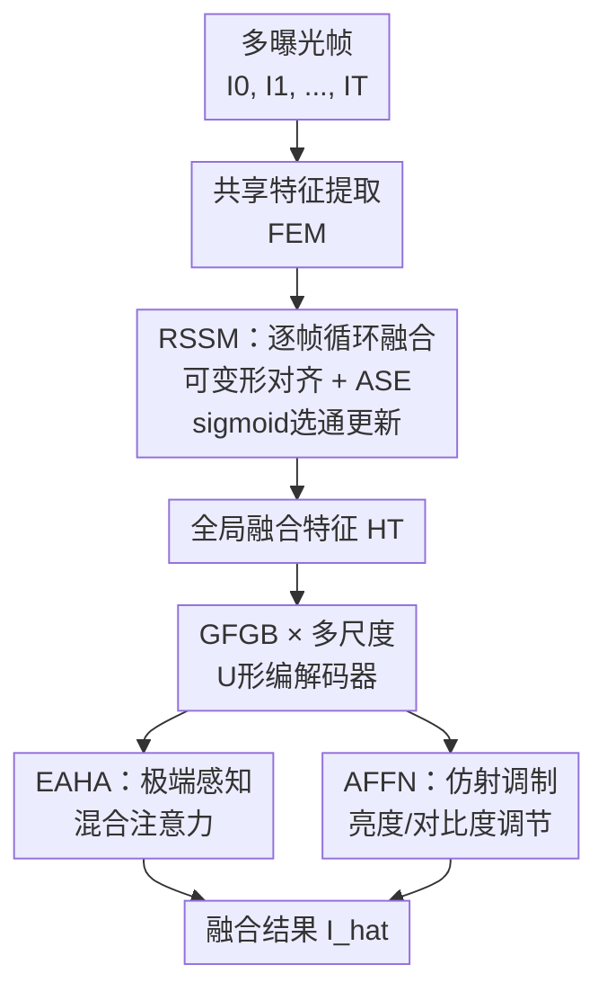

# FreeMEF: 可灵活处理任意帧数的多曝光融合Transformer

**会议**: ECCV2026  
**arXiv**: [2606.27905](https://arxiv.org/abs/2606.27905)  
**代码**: [https://github.com/qulishen/FreeMEF](https://github.com/qulishen/FreeMEF)  
**领域**: 图像恢复  
**关键词**: 多曝光融合, HDR成像, 状态空间模型, 注意力机制, 可变帧数

## 一句话总结

FreeMEF 提出"先去后回"（There and Back Again）的双阶段范式——先用循环状态空间模块将任意帧数的多曝光特征渐进聚合为全局表征，再以极端感知混合注意力引导基准帧恢复——在支持 2/3/5 帧灵活推理的同时显著抑制鬼影、提升动态范围。

## 研究背景与动机

多曝光融合（MEF）通过融合同一场景在不同曝光值下拍摄的多张 LDR 图像来重建 HDR 图像，是克服传感器有限动态范围的经典策略。近年来基于深度学习的 MEF 方法取得了显著进展，但这些方法普遍存在一个根本性限制：它们假设相机使用固定的曝光策略——模型架构专为固定帧数（如 2、3 或 5 帧）设计。实际部署中，不同设备乃至同一设备的不同拍摄模式会使用不同的曝光帧数，这意味着维护方必须为每一种帧数单独训练和部署模型，严重制约了实用效率。

更深层的矛盾出现在注意力机制的运作方式上。现有方法无论是先融合再自注意力，还是用基准帧与参考帧做交叉注意力，本质上都基于相似度匹配：查询向量来自基准帧特征，键值向量来自参考帧特征。但 HDR 成像的核心目标恰恰是恢复基准帧中过曝或欠曝区域的细节——这些区域的像素值已被截断或饱和，与参考帧中正常曝光区域的相似度极低。这就导致一个**相似度悖论**：注意力机制给最需要恢复的区域分配了最低的权重。此外，现有并行融合策略容易将不同帧之间因运动导致的错位信息一并融合进特征，在后序处理中难以彻底消除鬼影。

本文的核心 idea 是**将多曝光融合拆成「先聚合后引导」两步：先以循环方式渐进聚合任意帧数的信息为全局表征，再让全局表征以极端感知的方式引导基准帧恢复**。这个"先去后回"的范式既天然解耦了输入帧数对架构的约束，又通过显式学习极端区域图来绕过相似度悖论，让注意力在饱和区域自动切换为自关联搜索。

## 方法详解

### 整体框架

FreeMEF 的整体流程分为两大阶段。给定一组曝光帧 $\{\mathbf{I}_t\}_{t=0}^T$（$\mathbf{I}_0$ 为基准帧，其余为辅助帧），第一阶段由**循环状态空间模块（RSSM）** 按任意顺序逐帧处理，通过可变形对齐与状态空间递推将全局信息渐进汇聚成一个紧凑的全局融合特征 $\mathbf{H}_T$。第二阶段以基准帧 $\mathbf{I}_0$ 和全局特征 $\mathbf{H}_T$ 为输入，送入 U 形 Transformer 编码器-解码器架构，在每一级分辨率上部署**全局特征引导模块（GFGB）** 来选择性利用全局上下文修复基准帧。GFGB 内部由**极端感知混合注意力（EAHA）** 和**仿射注入前馈网络（AFFN）** 两个子模块组成，前者解决相似度悖论，后者负责亮度和对比度的显式调节。

### 关键设计

**1. RSSM：基于状态空间的循环融合机制**

RSSM 是 FreeMEF 支持任意帧数的核心。每个输入帧 $\mathbf{I}_t$ 先经共享的轻量特征提取模块得到浅层特征 $\mathbf{F}_t$，随后进入循环单元。循环单元有两步关键操作：首先，用可变形卷积（DCN）根据历史状态 $\mathbf{H}_{t-1}$ 和当前特征 $\mathbf{F}_t$ 预测偏移量，将对齐后的当前特征 $\bar{\mathbf{F}}_t$ 配准到历史状态的坐标系——这解决了不同曝光帧之间因手持或场景运动产生的空间错位。第二步，将对齐后的特征送入**注意力状态空间方程（ASE）**。标准 SSM 的固定输出矩阵 $\mathbf{C}$ 限制了感受野为因果扫描方向，ASE 通过一个可学习的 prompt 池为每个像素动态选取语义原型，将输出矩阵扩展为 $\mathbf{C}+\mathbf{P}$，从而在保持线性复杂度的同时引入非因果的全局上下文。ASE 的输出经门控激活后，通过一个 sigmoid 选通门 $\mathbf{G}_t$ 与历史状态做加权融合 $\mathbf{H}_t = \mathbf{H}_{t-1} + \mathbf{G}_t \odot (\text{更新候选} - \mathbf{H}_{t-1})$。这种循环结构天然适配任意帧数——训练时用 3 帧，推理时可以无缝切换到 2 帧或 5 帧，架构完全不变。

**2. EAHA：极端感知混合注意力破解相似度悖论**

这是整篇论文最巧妙的点。基准帧在过曝/欠曝区域的数值极端、结构退化，直接用基准帧特征生成查询向量 $\mathbf{Q}_{base}$ 去匹配全局特征的 $\mathbf{K}$ 时，相似度天然低——注意力权重恰好落在最不需要恢复的区域。EAHA 的解法是引入第二路查询 $\mathbf{Q}_{ref}$，它直接由全局融合特征 $\mathbf{H}_T$ 生成，是在全局表征内部做"自关联"的备用搜索向量。关键是一个**极端区域图** $\mathbf{E}=\sigma(\text{深度可分离卷积}(\mathbf{F}_0))$ 来逐像素控制两者的混合比例：$\mathbf{Q}_{hybrid} = (1-\mathbf{E})\odot\mathbf{Q}_{base} + \mathbf{E}\odot\mathbf{Q}_{ref}$。在正常曝光区域（$\mathbf{E}\approx 0$），模型用基准帧内容查询；在饱和区域（$\mathbf{E}\approx 1$），自动切换为全局特征内部的关联搜索——这个"软切换"让注意力在所有区域都能找到有意义的匹配，而且沿通道维度做注意力计算时，$\mathbf{K}^\top\mathbf{Q}_{hybrid}$ 等价于自注意力和交叉注意力的加权和，不引入额外开销。

**3. AFFN：仿射注入前馈网络实现亮度显式调节**

标准的 FFN 缺乏对全局曝光变化的感知能力。AFFN 的直觉是：LDR 到 HDR 的恢复不仅仅是特征的简单加法，还需要显式修正亮度统计量（尺度和偏移）。它从全局融合特征 $\mathbf{H}_T$ 中提取一个全局描述子——先做全局平均池化、过一个卷积、再分裂为缩放参数 $\gamma$ 和偏移参数 $\beta$——对输入特征做仿射变换 $\mathbf{X} \odot (1+\gamma) + \beta$，然后再送入门控线性单元。这个机制让模型能根据全局高动态范围信息显式调节局部特征的对比度和色彩偏移，在视觉结果上表现为更自然的亮度和更少的色偏。

### 损失函数

网络使用标准的 $L_1$ 损失进行训练。优化器为 Adam（$\beta_1=0.9,\beta_2=0.999$），初始学习率 $2\times 10^{-4}$，采用余弦退火重启调度，总共 300k 迭代。

## 实验关键数据

### 主实验

| 数据集 | 指标 | FreeMEF | 之前SOTA (AFUNet) | 提升 |
|--------|------|---------|-------------------|------|
| Kalantari et al. | PSNR↑ / SSIM↑ / LPIPS↓ | **28.418** / **0.948** / **0.081** | 27.226 / 0.925 / 0.091 | +1.19dB PSNR |
| Real-HDRV | PSNR↑ / SSIM↑ / LPIPS↓ | **26.077** / **0.940** / **0.074** | 25.562 / 0.924 / 0.089 (Restormer) | +0.52dB PSNR |

跨数据集泛化（SICE 数据集，训练于 Kalantari，直接测试不同帧数）：

| 测试帧数 | 指标 | FreeMEF | 之前SOTA | 提升 |
|---------|------|---------|----------|------|
| 2帧 | PSNR↑ / SSIM↑ | **17.087** / **0.731** | 15.339 / 0.690 | +1.75dB |
| 3帧 | PSNR↑ / SSIM↑ | **19.326** / **0.774** | 18.724 / 0.768 | +0.60dB |
| 5帧 | PSNR↑ / SSIM↑ | **22.269** / **0.851** | 21.153 / 0.842 | +1.12dB |

FreeMEF 参数量 8.9M，FLOPs 41.5G，比 HDR-Transformer 节省 56% 计算量。

### 消融实验

| 配置 | PSNR | SSIM | 说明 |
|------|------|------|------|
| Full FreeMEF | 28.418 | 0.948 | 完整模型 |
| RSSM → CNN嵌入层 | 27.082 | 0.920 | 去掉RSSM后掉1.34dB，足见循环融合的价值 |
| EAHA → MDTA | 27.565 | 0.937 | 去掉EAHA掉0.85dB，极端感知混合注意力至关重要 |
| AFFN → GDFN | 27.982 | 0.937 | 去掉AFFN掉0.44dB，仿射调制贡献显著 |

### 关键发现

- RSSM 贡献最大（+1.34dB），说明循环渐进融合显著优于简单的 CNN 嵌入后并行处理
- 融合顺序实验发现：把暗帧（长时间曝光）放在融合流程的末尾有助于优化最终画质；把亮帧放末尾会引入更多噪声
- 方法在跨数据集泛化中展现了独特优势：2 帧场景提升 1.75dB——因为训练时见过的多帧先验在推理时被循环结构自然利用了
- 在过曝背景中有运动主体的场景中，FreeMEF 有效避免了鬼影，这是并行融合方法普遍失败的情况

## 亮点与洞察

- **相似度悖论的发现和针对破解**是最大的亮点。在 HDR 这类注意力度量与恢复目标正相反的领域中，用极端区域图做查询混合是一个优雅且通用的思路，可迁移到其他图像复原任务（如去雨、去雾中的重退化区域）。
- **循环融合替换并行融合**的"先去后回"范式：把参差不齐的多帧信息先聚合成统一表征再做引导式修复，比逐个交叉注意力或简单拼接更自然，且天然适配任意帧数——这是架构级的改变，不是一个技巧。
- ASE（注意力状态空间方程）在 MambaIRv2 的基础上被引入循环单元作为 backbone，验证了 SSM+注意力混合在低层视觉循环建模中的有效性。

## 局限与展望

- 作者承认在曝光级差过大的场景下存在轻微色偏，原因是巨大曝光差异导致颜色偏离真实场景（如 Fig.11 所示）。
- 当前框架要求所有输入帧已按曝光时间对齐到基准帧坐标系（通过可变形卷积），在剧烈运动的动态场景中配准仍可能失败。
- 融合顺序对质量有影响——在实际部署中需要选择合适的帧输入顺序（最佳是将暗帧放最后），这增加了一道预处理逻辑。

## 相关工作与启发

- **vs SAFNet / AFUNet**: 这些方法专为 3 帧输入设计，先拼接/融合所有特征再做注意力，无法泛化到其他帧数。FreeMEF 用循环架构从根本上打破了帧数限制。
- **vs MambaIRv2 / Restormer**: 这些通用图像复原方法也支持变长输入，但需要在融合层（通道维度）做调整并重新训练。FreeMEF 不做任何架构修改即可推理不同帧数。
- **vs HDR-Transformer / SCTNet**: 使用交叉注意力做参考帧-基准帧交互，面临相似度悖论。FreeMEF 的 EAHA 通过极端区域图显式弥补了这一缺陷。

## 评分
- 新颖性: ⭐⭐⭐⭐⭐ 首创可变帧数 MEF 架构，相似度悖论的发现和 EAHA 的破解方案都很巧妙
- 实验充分度: ⭐⭐⭐⭐⭐ 涵盖 3 个数据集、跨数据集泛化、帧数泛化、融合顺序分析、充分的消融实验
- 写作质量: ⭐⭐⭐⭐⭐ 问题动机清晰，"相似度悖论"和"先去后回"的叙述很有故事感
- 价值: ⭐⭐⭐⭐⭐ 解决了 MEF 部署中的实际痛点，设计简洁可推广

<!-- RELATED:START -->

## 相关论文

- [\[ECCV 2026\] Spectral and Trajectory Regularization for Diffusion Transformer Super-Resolution](spectral_and_trajectory_regularization_for_diffusion_transformer_super-resolutio.md)
- [\[ECCV 2024\] Restoring Images in Adverse Weather Conditions via Histogram Transformer](../../ECCV2024/image_restoration/restoring_images_in_adverse_weather_conditions_via_histogram_transformer.md)
- [\[ICCV 2025\] Devil is in the Uniformity: Exploring Diverse Learners within Transformer for Image Restoration](../../ICCV2025/image_restoration/devil_is_in_the_uniformity_exploring_diverse_learners_within_transformer_for_ima.md)
- [\[ICCV 2025\] Enhancing Image Restoration Transformer via Adaptive Translation Equivariance](../../ICCV2025/image_restoration/enhancing_image_restoration_transformer_via_adaptive_translation_equivariance.md)
- [\[CVPR 2025\] Progressive Focused Transformer for Single Image Super-Resolution](../../CVPR2025/image_restoration/progressive_focused_transformer_for_single_image_super-resolution.md)

<!-- RELATED:END -->
