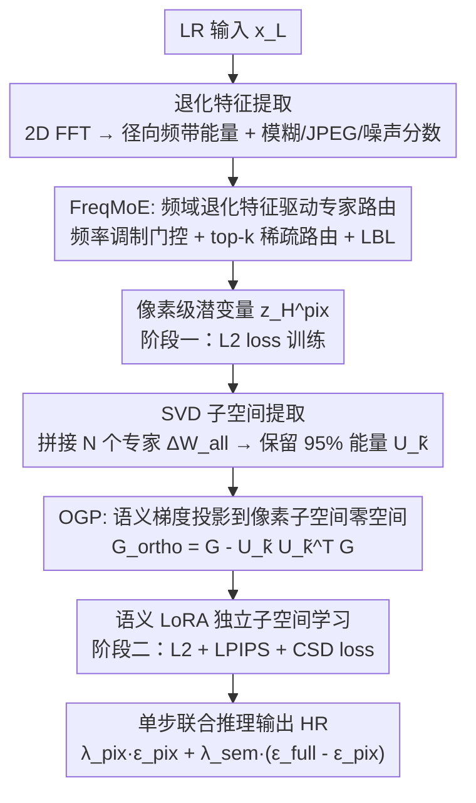

# FreqOrtho-SR: Frequency-Guided Orthogonal Expert Learning for Real-World Image Super-Resolution

**会议**: ECCV 2026  
**arXiv**: [2606.28745](https://arxiv.org/abs/2606.28745)  
**代码**: [https://github.com/sonhm3029/FreqOrtho-SR](https://github.com/sonhm3029/FreqOrtho-SR)  
**领域**: 图像恢复  
**关键词**: 图像超分辨率, 频域引导, 正交梯度投影, LoRA专家混合, 扩散模型先验

## 一句话总结
FreqOrtho-SR 提出频域引导的 LoRA 专家混合（FreqMoE）和正交梯度投影（OGP）两个核心模块，通过 FFT 退化特征驱动的自适应专家路由和像素-语义子空间正交约束，在单步扩散模型框架下实现退化自适应的真实世界图像超分辨率，在多个基准上取得最优或次优的保真度-感知质量平衡。

## 研究背景与动机
真实世界图像超分辨率（ISR）面临两大核心挑战：一是像素级保真度（PSNR/SSIM）与语义感知质量（LPIPS/FID）之间的固有 trade-off；二是真实场景中退化类型多样（模糊、噪声、JPEG 压缩、下采样混叠及其组合），单一静态模型难以自适应处理。扩散模型先验（Stable Diffusion + LoRA）的出现极大提升了感知质量，但现有单步扩散方法仍存在两个关键缺陷。

第一个缺陷是退化处理同质化。OSEDiff、PiSA-SR 等方法对所有退化类型使用同一个像素级 LoRA，相当于用一把钥匙开所有锁——模糊图像需要恢复高频、噪声图像需要抑制高频、JPEG 图像需要去除块效应，这三种需求彼此冲突，单个 LoRA 的容量不足以同时满足。MoR-DASR 尝试用 CLIP 编码器做路由，但依赖外部预训练模型和手工设计的 prompt 对，缺乏可解释的退化特征提取。

第二个缺陷是像素-语义子空间重叠。PiSA-SR 提出双 LoRA 解耦范式——先训像素级 LoRA（L2 loss），冻结后再训语义级 LoRA（L2 + LPIPS + CSD loss）。但作者指出这种"被动解耦"并不充分：即使像素分支权重冻结，语义分支的梯度更新仍可能落在像素分支已覆盖的子空间方向上，导致语义 LoRA 浪费有限的秩容量去重复学习已有的结构信息（如边缘、平滑区域），而非捕获真正的感知纹理。这种子空间冗余使模型无法触及保真度-感知 trade-off 的最优边界。

核心 idea：用 FFT 频域退化特征作为可解释的路由信号，驱动多个 LoRA 专家按退化类型自适应分工（FreqMoE）；并从连续学习引入正交梯度投影（OGP），将语义梯度显式投影到像素子空间的零空间，从数学上保证两个目标子空间严格正交，实现真正的互补学习。

## 方法详解

### 整体框架
FreqOrtho-SR 在 PiSA-SR 的双 LoRA 范式上做两个关键扩展。整体流程分两阶段训练、单步推理：输入低分辨率图像 x_L，先通过 SD 的 VAE 编码器得到潜变量 z_L；阶段一用 FreqMoE（多个 LoRA 专家 + 频域门控）做像素级去退化，输出 z_H^pix；阶段二冻结 FreqMoE，新增语义 LoRA，并通过 OGP 将语义梯度投影到像素子空间零空间进行训练，输出 z_H^sem；推理时两个模块共同作用，单步前向得到最终 HR 图像。两阶段之间通过 SVD 从 FreqMoE 全部专家权重中提取像素子空间基向量 U_k̃，供阶段二的 OGP 使用。

### 关键设计

**1. FreqMoE：频域退化特征驱动专家路由，实现退化自适应恢复**

真实世界 LR 图像的退化类型在频域有鲜明指纹：模糊抑制高频能量（频谱外环暗淡）、噪声均匀抬升全频带能量（外环明亮）、JPEG 压缩在 8x8 块边界引入周期性伪影（频谱出现网格状亮点）、下采样产生混叠导致径向能量分布偏移。这些特征可通过 2D FFT 无参提取，无需额外训练或预训练模型。

FreqMoE 将单一块素级 LoRA 替换为 N 个并行 LoRA 专家对 {(A_i, B_i)}，UNet 每层的线性/卷积层都有独立专家集合（rank=4, N=4）。路由由门控网络 G 的 logits 决定：l = W_g x + φ(f)，其中 W_g x 基于层输入的局部空间特征，φ(f) 是小型 MLP（两层线性 + ReLU）将全局退化特征向量 f 映射为退化相关偏置，叠加到空间路由 logits 上。f ∈ R^{d_f}（默认 K=4, d_f=7）由两部分组成：(1) K 个径向频带的归一化能量分布 e——将 FFT 幅度谱沿半径径向切分为 K 个同心环带，逐带做面积归一化均值后概率归一化；(2) 三个标量退化指标——模糊分数 s_blur = e_1/(e_K + ε)（低频/高频能量比，高值表示低频占优即模糊）、JPEG 块效应分数 s_jpeg = ḡ_block/(ḡ_all + ε)（8x8 块边界梯度与全局梯度比，高值表示块效应）、噪声分数 s_noise = mean(|L * x_L|)（3x3 Laplacian 核卷积响应均值，高值表示高频噪声）。

路由采用 top-k 稀疏激活（默认 top-2），对选中专家做 softmax 归一化得权重 g_i，MoE 层输出为 Δh_pix = Σ_{i ∈ Top-k} g_i(x, f) · B_i A_i x。为防止专家坍塌（某几个专家垄断路由），引入负载均衡损失 L_lbl = α·N·Σ_{i=1}^N f_i·P_i，其中 f_i 是分配给专家 i 的 token 比例，P_i 是其平均路由概率，鼓励均匀利用。训练初期 W_g 以小随机值初始化（σ=0.01）、φ 的输出层置零，保证从近似均匀路由起步，端到端逐渐学习退化相关的专家分工——模糊图像自动路由到擅长高频恢复的专家，噪声图像路由到去噪专家，混合退化则 top-k 激活多专家协作。

**2. OGP：将语义梯度投影到像素子空间零空间，消除子空间重叠**

PiSA-SR 冻结像素分支的做法是被动的——它不控制语义梯度更新时的几何方向，语义分支仍可能在像素子空间内"偷懒"，学习像素分支已覆盖的方向。OGP 从连续学习中的 GPM（Gradient Projection Memory）获得启发，将像素保真和语义增强视为两个顺序任务，要求任务二的梯度与任务一子空间严格正交。

OGP 分两步。第一步，SVD 子空间提取：阶段一结束后，对每层 FreqMoE 的 N 个专家，将各自权重变化量 ΔW_i = B_i A_i ∈ R^{d_out × d_in} 沿列拼接为 ΔW_all ∈ R^{d_out × (N·d_in)}，做截断 SVD（ΔW_all = U Σ V^T），保留前 k̃ 个奇异向量使其累积能量达 95%（k̃ = arg min{Σ_{i=1}^{k̃} σ_i^2 / Σ_j σ_j^2 ≥ 0.95}），得截断左奇异矩阵 U_k̃ ∈ R^{d_out × k̃}，它定义了像素保真子空间的核心方向。整个 SVD 提取在所有层上一次性完成（离线），耗时 < 5 秒。

第二步，梯度投影：阶段二训练语义 LoRA 时，对每个语义 LoRA 的 B 矩阵梯度 G ∈ R^{d_out × r} 注册 backward hook，执行正交投影：G_ortho = G - U_k̃(U_k̃^T G)。由于 U_k̃ 列正交（U_k̃^T U_k̃ = I），有 U_k̃^T G_ortho = 0，即投影后梯度在像素子空间任意方向的分量为零。这意味着语义 LoRA 的每次权重更新都严格在像素子空间的零空间内，与像素分支学到的方向完全正交，强制语义分支在全新方向探索，将有限的秩容量集中用于真正的纹理合成和细节增强。实验中的子空间重叠分析（Fig.5）直观验证：无 OGP 时某些层语义权重在像素子空间的投影能量高达 87%，OGP 将其压制到接近零。

### 一个完整示例
以一张被高斯模糊（σ=2.0）+ 中等高斯噪声（σ=15）污染的 128×128 LR 图像为例，走一遍完整流程。

图像经 VAE 编码为潜变量 z_L（32×32×4）。FFT 退化提取器计算灰度图的 2D FFT 幅度谱，沿径向切 4 频带，得归一化能量分布 e = [0.52, 0.28, 0.14, 0.06]（低频占优，符合模糊特征）；三个标量分数：s_blur = 8.7（高模糊）、s_noise = 18.3（有噪声）、s_jpeg = 1.02（无 JPEG）。拼接得 f ∈ R^7。

阶段一：f 输入各层 φ(f) 生成退化偏置。UNet 某中间层 4096 个 token，门控选出 top-2 专家（Expert 0 和 Expert 2），softmax 归一化后路由权重分别为 0.63 和 0.37——Expert 0 在训练中已学会处理模糊主导退化（恢复高频），Expert 2 擅长去噪，两者加权恰好满足混合退化需求。输出 z_H^pix 以 L2 loss 与 GT 潜变量 z_H 对齐。

SVD 阶段：某线性层 d_out=640, d_in=640, N=4，拼接后 ΔW_all 为 640×2560，SVD 后取前 47 个奇异向量达 95% 能量。

阶段二：语义 LoRA 前向计算 z_H^sem，与 GT 比较计算复合 loss。反向传播时，对语义 LoRA B 矩阵梯度做 OGP——假设某层原始梯度 G 有 32% 能量在像素子空间方向，投影后该分量为零，仅保留正交方向的 68% 能量。最终语义 LoRA 学会了在不破坏像素保真度的前提下补充纹理细节。

推理单步前向：z_H = z_L - ε_θ_full(z_L)，耗时约 0.30s（A100, 128×128 输入）。

### 损失函数 / 训练策略
训练分两阶段，SD 2.1-base 权重始终冻结，两阶段间做一次离线 SVD 子空间提取。

**阶段一（FreqMoE 训练，4K iterations）**：仅优化 FreqMoE 参数 Δθ_pix，损失为 L = L2(z_H^pix, z_H) + α·L_lbl。其中 L_lbl 鼓励 N=4 个专家均匀利用，α 为负载均衡权重。使用 AdamW 优化器（lr=5e-5），batch size 16，patch size 512×512。训练数据为 LSDIR + FFHQ（前 10K 张），用 RealESRGAN 的二阶退化管线（两轮串联的模糊+缩放+噪声+JPEG）生成配对 LR-HR 数据。

**阶段二（语义 LoRA 训练 + OGP，26K iterations）**：冻结 SD 基权重和 FreqMoE，仅优化语义 LoRA 参数 Δθ_sem（rank=4）。损失为 L = L2 + λ_lpips·L_lpips + λ_csd·L_csd，其中 LPIPS 用预训练 VGG 提取高层特征对齐（感知质量），CSD 利用预训练 SD 的语义先验做特征蒸馏（细节增强）。关键操作：所有语义 LoRA B 矩阵的梯度在更新前经 OGP 投影（G_ortho = G - U_k̃(U_k̃^T G)），移除像素子空间分量后再执行优化步。

**推理**：默认模式（λ_pix=λ_sem=1）下单步前向输出。可调模式允许调整两个 guidance scale：ε_θ = λ_pix·ε_θpix + λ_sem·(ε_θfull - ε_θpix)，其中第二项隔离语义分支的净贡献，用户可在保真度和感知质量之间无重训滑动调节，两个前向即可实现任意配比。

## 实验关键数据

### 主实验
与 AddSR、SinSR、OSEDiff、MoR-DASR、PiSA-SR、TVT 共 6 个单步扩散方法在三个数据集（RealSR、DRealSR 真实世界 + DIV2K 合成）上对比。下表摘录 RealSR 上的核心指标：

| 方法 | PSNR↑ | SSIM↑ | LPIPS↓ | DISTS↓ | FID↓ | NIQE↓ | MANIQA↑ |
|------|-------|-------|--------|--------|------|-------|---------|
| AddSR | 23.12 | 0.6550 | 0.3090 | 0.2703 | 154.14 | 6.66 | 0.4880 |
| SinSR | 26.30 | 0.7354 | 0.3212 | 0.2346 | 137.05 | 6.31 | 0.5389 |
| OSEDiff | 25.15 | 0.7341 | 0.2921 | 0.2128 | 123.50 | 5.65 | 0.6339 |
| PiSA-SR | 25.50 | 0.7417 | 0.2672 | 0.2044 | 124.09 | 5.50 | 0.6560 |
| TVT | 25.81 | 0.7596 | 0.2587 | 0.2061 | 109.93 | 5.92 | 0.6228 |
| **FreqOrtho-SR** | **26.27** | 0.7481 | **0.2537** | **0.1951** | 108.91 | **5.32** | **0.6586** |

FreqOrtho-SR 在 PSNR、LPIPS、DISTS、FID、NIQE、MANIQA 六项指标上取得第一或第二，综合平衡性突出。值得注意的是没有单一方法在所有指标上全面领先——TVT 在 SSIM 和 MUSIQ 上占优，PiSA-SR 在 CLIPIQA 上略高——但 FreqOrtho-SR 的优势指标数量最多。

复杂度方面，参数量 1.30B（与 PiSA-SR 持平，低于 OSEDiff 1.77B 和 TVT 1.72B），FLOPs 2.25T，峰值显存 3.03GB（远低于 TVT 的 7.31GB）。推理时间 0.30s（A100, 128×128 输入），虽高于 PiSA-SR 的 0.09s（因 MoE 需逐 token top-k 路由无法像单 LoRA 一样合并到基权重），但与 TVT 持平且 LPIPS/FID 最优。OOD 泛化上，在无 GT 的 RealLR200 真实世界基准上四项无参考指标（NIQE 3.90 / CLIPIQA 0.6912 / MUSIQ 70.60 / MANIQA 0.6321）均优于 PiSA-SR 和 TVT。

### 消融实验

| MoE | Freq | OGP | PSNR↑ | SSIM↑ | LPIPS↓ | DISTS↓ | FID↓ | NIQE↓ | MANIQA↑ |
|-----|------|-----|-------|-------|--------|--------|------|-------|---------|
| ✓ | ✗ | ✗ | 26.37 | 0.7571 | 0.2584 | 0.2017 | 118.35 | 5.68 | 0.6560 |
| ✓ | ✓ | ✗ | 26.31 | 0.7520 | 0.2517 | 0.1968 | 111.45 | 5.48 | 0.6510 |
| ✗ | ✗ | ✓ | 26.20 | 0.7432 | 0.2651 | 0.2021 | 113.39 | 5.44 | 0.6557 |
| ✓ | ✓ | ✓ | 26.27 | 0.7481 | 0.2537 | 0.1951 | 108.91 | 5.32 | 0.6586 |

关键发现：(1) 仅用 MoE（第一行，无频域路由）相比单 LoRA 基线已带来 PSNR +0.87dB、SSIM +0.015 的提升，验证多专家容量的价值；(2) 加入频域路由后（第二行 vs 第一行）LPIPS 从 0.2584 降至 0.2517、FID 从 118.35 降至 111.45，说明 FFT 退化特征比纯空间特征提供更强的路由判别力；(3) 单独加 OGP（第三行）即使不用 MoE 也已将 FID 从约 118 降至 113.39，验证子空间正交的独立有效；(4) 完整的 FreqMoE + OGP 组合取得最优的 DISTS（0.1951）、FID（108.91）、NIQE（5.32）和 MANIQA（0.6586），FID 相比纯 MoE 大幅改善 9.44 点，PSNR 有轻微下降（26.31→26.27，因 OGP 约束语义分支不能走像素子空间方向的"捷径"），但感知质量收益远超代价。

子空间正交分析表明：在 UNet 的 258 层上测量语义 LoRA 权重在像素子空间上的投影能量占比，无 OGP 时输出层高达 87%、部分 encoder attention 层达 32%，即这些层的语义容量几乎被冗余的结构信息占满；OGP 将所有层的重叠压制到接近零，证实语义 LoRA 在真正独立的子空间学习。

### 关键发现
- FreqMoE 和 OGP 各自独立有效且联合互补：FreqMoE 解决退化自适应（不同退化路由到不同专家），OGP 解决子空间重叠（语义分支不走像素分支的老路），两个维度互不冲突。
- FFT 退化特征提取完全无参数、不计入训练图，计算开销可忽略（每张图做一次 2D FFT），但提供了强结构性路由先验，是 MoE 路由稳定性的关键。
- OGP 带来的 FID 大幅改善说明子空间正交牺牲了少量冗余的像素级学习，换来了真正的感知增量——这直接验证了作者的核心论点：PiSA-SR 的被动解耦确实不够。

## 亮点与洞察
- FFT 频域退化特征作为 MoE 路由信号的设计非常巧妙——利用信号处理的基本工具（2D FFT）无参提取退化指纹，比 CLIP 编码器路由（MoR-DASR）更轻量、更可解释，且天然与退化类型对齐（模糊=高频衰减、噪声=高频抬升、JPEG=8x8 周期），无需手工设计 prompt。三个标量退化指标（s_blur, s_jpeg, s_noise）是信号处理经典公式的直接应用，稳定可靠。
- 将连续学习中的 GPM 正交投影引入 ISR 的子空间解耦是跨领域迁移的范例——像素保真和语义增强确实是两个"顺序任务"，GPM 的 SVD+投影框架恰好适用。更精妙的是 SVD 只在阶段间做一次（<5s），训练中仅增加 backward hook 的投影运算，几乎零额外开销，这使 OGP 的实用价值远超其理论优雅性。
- 可调推理模式使单模型覆盖不同的保真度-感知质量偏好，无需重训即可在两个 guidance scale 之间连续滑动，这是一个对用户友好的实用设计。
- 子空间重叠的可视化分析（逐层投影能量占比）是强有力的诊断手段，直观展示了 OGP 的必要性和效果。这种分析方式可迁移到任何多分支、多目标优化模型中，用于诊断特征冗余。

## 局限与展望
- MoE 推理开销是最大瓶颈：单 LoRA 可合并到基权重实现零额外推理成本，MoE 的 top-k 路由需逐 token 计算门控并激活多专家前向，推理时间是 PiSA-SR 的 3 倍以上（0.30s vs 0.09s）。作者提出专家剪枝或结构化稀疏作为未来方向，但未给出具体方案或初步实验结果。如果专家能像单 LoRA 一样在推理时合并，其实用性将大幅提升。
- 频域退化特征目前仅覆盖模糊、噪声、JPEG 三种类型的显式标量指标，对于去雾、去雨、运动模糊、传感器噪声等更多样化的真实退化未做适配。K=4 个频带的粗粒度划分可能不足以区分细粒度退化差异（例如不同核大小的模糊在低频带内难以区分）。
- OGP 仅投影语义 LoRA 的 B 矩阵梯度（A 矩阵未投影），虽在补充材料中有消融，但正文未讨论这种不对称投影的理论依据。SVD 的 95% 能量阈值是经验选择，不同层的最优阈值可能不同，缺乏自适应机制。
- 实验仅在 4x 超分上验证，未探索其他放大倍数或单任务恢复（去模糊、去噪）。训练数据仅用 LSDIR + FFHQ（前 10K），规模远小于 SD 原始训练集，在监控、医疗、遥感等领域的泛化能力未知。也缺少用户主观研究（MOS）来佐证感知质量的真实提升。

## 相关工作与启发
- **vs PiSA-SR**: PiSA-SR 提出双 LoRA 解耦范式，但仅通过冻结像素分支被动隔离；本文从数学上指出这种被动解耦的不足——语义分支仍会在像素子空间方向上产生冗余更新。OGP 用 SVD + 投影提供显式正交保证，是双 LoRA 范式的理论升级版，通用性更强。
- **vs MoR-DASR**: 同样使用 MoE 做退化自适应路由，但 MoR-DASR 依赖冻结的 CLIP 编码器 + 预定义 prompt 对做语义路由，本文的 FFT 频域特征无参、无外部模型依赖、可解释性强，且天然捕捉退化类型而非语义内容。
- **vs GPM (Saha et al., 2021)**: GPM 在连续学习分类任务中顺序累积多任务子空间，本文将其适配到 ISR 的两阶段 LoRA 训练——仅提取一次像素子空间并持续投影语义梯度，避免了多任务 SVD 的累积开销，适配更高效。
- **vs 频域 SR 方法**: 既有方法（如 SwinFSR、Focal Frequency Loss）主要在损失函数层面引入频域信息，本文首次将频域特征用于 MoE 路由（架构层面），开辟了频域分析在模型设计中除损失函数外的新用途。

## 评分
- 新颖性: ⭐⭐⭐⭐ FreqMoE 的 FFT 频域路由在 SR 领域首次提出，OGP 将连续学习中的梯度投影引入多目标 SR 是新的跨领域迁移，但 MoE 路由和梯度投影本身是已知技术，创新在于组合和适配方式
- 实验充分度: ⭐⭐⭐⭐ 覆盖 4 个数据集（含 OOD）、6 个对比方法、消融 + 复杂度 + 子空间分析 + 补充材料，实验设计全面；但缺少 MOS 用户主观研究和多放大倍数验证
- 写作质量: ⭐⭐⭐⭐ 问题表述清晰（明确指出子空间重叠缺陷并用 Fig.5 直观验证）、方法动机链条完整（频域指纹 → 频域路由 → 子空间正交 → OGP）、图示质量高；部分实验细节推到补充材料，消融表缺少完整的空白对照基线
- 价值: ⭐⭐⭐⭐ 为单步扩散 SR 提供了退化自适应 + 子空间解耦的完整方案，FreqMoE 和 OGP 可分别迁移到其他恢复任务（去模糊、去雨、JPEG 去伪影）或任何多 LoRA 协同训练场景，实用性强且方法复用门槛低

<!-- RELATED:START -->

## 相关论文

- [\[CVPR 2026\] HDW-SR: High-Frequency Guided Diffusion Model based on Wavelet Decomposition for Image Super-Resolution](../../CVPR2026/image_restoration/hdw-sr_high-frequency_guided_diffusion_model_based_on_wavelet_decomposition_for_.md)
- [\[NeurIPS 2025\] DP²O-SR: Direct Perceptual Preference Optimization for Real-World Image Super-Resolution](../../NeurIPS2025/image_restoration/dp2o-sr_direct_perceptual_preference_optimization_for_real-world_image_super-res.md)
- [\[ICLR 2026\] Learning Heterogeneous Degradation Representation for Real-World Super-Resolution](../../ICLR2026/image_restoration/learning_heterogeneous_degradation_representation_for_real-world_super-resolutio.md)
- [\[CVPR 2026\] TextOVSR: Text-Guided Real-World Opera Video Super-Resolution](../../CVPR2026/image_restoration/textovsr_text-guided_real-world_opera_video_super-resolution.md)
- [\[CVPR 2026\] DNF-SR: Dual-Input and Negative-Aware Feature Fine-Tuning for Real-World Image Super-Resolution](../../CVPR2026/image_restoration/dnf-sr_dual-input_and_negative-aware_feature_fine-tuning_for_real-world_image_su.md)

<!-- RELATED:END -->
