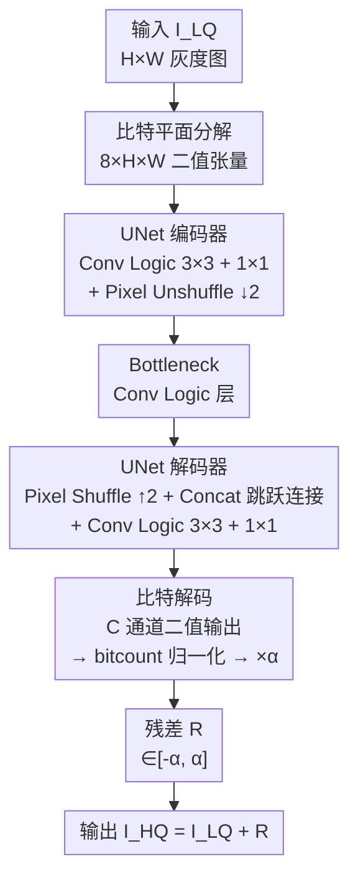

# LogicIR: Logic Gate Networks for Image Restoration

**会议**: ECCV2026  
**arXiv**: [2606.26609](https://arxiv.org/abs/2606.26609)  
**代码**: [https://github.com/jimmy9704/LogicIR](https://github.com/jimmy9704/LogicIR)  
**领域**: 图像恢复 / 模型压缩  
**关键词**: 逻辑门网络, 图像恢复, 二值神经网络, 轻量化推理, 比特解码  

## 一句话总结
LogicIR 是首个专为图像恢复设计的逻辑门网络（LGN），通过全逻辑门 UNet 架构、可微比特解码层和 Index Shuffling 跨组通信机制，在去噪、去块、去雨任务上以远低于 BNN 和 LUT 方法的运算量（BOPs）达到竞争性恢复质量，证明了纯逻辑门计算在图像恢复中的可行性。

## 研究背景与动机

图像恢复（去噪、去块、去模糊、去雨）是底层视觉的核心任务，深度学习方法（DnCNN、SwinIR、Restormer）已将恢复质量推至很高水平，但其浮点乘加运算带来的计算开销极大——SwinIR 处理一张 1280x720 图像需要约 21 Tera 次浮点运算，难以部署到手机、可穿戴设备、嵌入式系统等资源受限场景。

现有轻量化路线主要有两条，各有根本性局限。二值神经网络（BNN）路线（BBCU、Bi-Real、ReActNet）将权重和激活二值化以替代乘法，但输入/输出层和残差连接中的加法仍依赖全精度运算，且仍需存储大量可训练权重参数——全二值化的 BBCU-lite-fully 掉点严重（BSD68 去噪从 27.62 dB 降到 25.23 dB）。查找表（LUT）路线（SR-LUT、HKLUT、TinyLUT）将小感受野网络的输入-输出映射预存为查找表以加速推理，但表大小随感受野指数增长，实际感受野被限制在 5x5 左右，无法捕获长程依赖和全局结构。

核心矛盾：现有轻量化方法在"纯逻辑可部署性"和"恢复质量"之间无法兼得——BNN 降了乘法但保留了加法和权重存储，LUT 快了但感受野受到根本性制约，二者都未能实现"零算术运算、零可训练权重"的终极轻量目标。

逻辑门网络（LGN）是近年兴起的新范式：推理完全由 AND、NAND、XOR 等 16 种离散逻辑门完成，无需可训练权重和浮点运算，在 FPGA/ASIC 上可实现极低功耗和极高吞吐。DiffLogic 引入可微松弛使 LGN 可端到端训练，Convolutional LGN（CLGN）进一步引入卷积逻辑层来捕获空间结构。然而 LGN 此前仅用于分类任务，缺乏图像恢复所需的层次化表示、像素值重建和长程空间建模能力——直接堆叠卷积逻辑层（StackedCLGN）做去噪仅 17.19 dB PSNR，远低于最轻量的 CNN。

本文切入角度：将 LGN 范式首次引入图像恢复，核心挑战在于如何用纯逻辑门实现 UNet 式的层次化编码器-解码器，以及如何从二值逻辑输出重建连续像素值。

核心 idea：全逻辑门 UNet 提供层次化特征提取，可微比特解码将多通道二值输出映射为连续残差，Index Shuffling 打破分组逻辑层的通道隔离，三者协同使纯逻辑门计算在图像恢复上首次达到实用水平。

## 方法详解

### 整体框架

LogicIR 要解决的核心问题是：如何让一个完全由离散逻辑门构成的网络，既能像 CNN UNet 一样做层次化特征提取和多尺度融合，又能从天然二值的输出端重建出连续的像素值残差。整体 pipeline 分三个阶段：输入图像先通过比特平面分解转为 8 通道二值表示；然后经过一个由卷积逻辑层构成的 UNet 风格编码器-解码器提取层次化特征，其中下采样用 pixel unshuffle、上采样用 pixel shuffle、跳跃连接用通道拼接（避免加法操作）；最后通过比特解码模块将多通道二值输出映射为 [-1, 1] 范围的连续残差，乘以可学习缩放因子后与退化输入相加得到恢复结果。

### 关键设计

**1. 可微比特解码：从二值激活到连续像素值的桥梁**

LGN 的每一层输出天然是 {0, 1} 二值，但图像恢复需要连续的像素值残差。最直接的做法是让网络输出恰好 8 个通道对应 8 个比特平面，直接拼回 0-255 像素值——但这在实践中完全行不通：低位比特平面（如第 0-3 位）噪声极强且缺乏语义一致性，梯度回传时信号被噪声淹没，网络无法有效学习。LogicIR 的做法是让 UNet 解码器输出远多于 8 的二值通道（记为 C，例如 C=2048），然后通过一个简单的 bitcount 归一化操作转换为连续残差：

$$\mathbf{\bar{R}}(i,j) = \frac{\sum_{c=0}^{C-1} \mathbf{A}(c,i,j) - 0.5C}{0.5C}$$

其中 $\mathbf{A} \in \{0,1\}^{C \times H \times W}$ 是解码器最终输出的二值激活图。这个公式将 C 个通道的"投票"结果映射到 $[-1, 1]$：全 0 时输出 -1，全 1 时输出 +1，一半 1 时输出 0。相比直接学习 8 个比特平面，这种"多数投票"机制对个别通道的噪声鲁棒得多——即使某些通道出错了，只要多数通道正确，梯度仍然有意义。

为进一步增大表示范围，引入可学习缩放因子 $\alpha$，最终残差 $\mathbf{R} = \alpha \mathbf{\bar{R}}$。$\alpha$ 在 STE 微调阶段与网络一同优化，让输出范围自适应任务需求。这一设计的巧妙之处在于：bitcount 本身是纯整数运算（数 1 的个数），在硬件上极其廉价；而 $\alpha$ 只是一个标量乘法，不会在推理时引入实质性开销。

**2. UNet 风格的全逻辑门架构：避免加法、保留空间信息**

直接串行堆叠卷积逻辑层（StackedCLGN）做图像恢复效果极差（PSNR 仅 17.19 dB），因为它缺乏三个关键能力：层次化特征表示、跨尺度信息保留和像素重建。LogicIR 设计了完整的 UNet 风格编码器-解码器，全部由卷积逻辑层构成，每个逻辑树核深度 d=3，并在设计上刻意规避了传统 CNN UNet 中的加法操作：

- **跳跃连接用通道拼接而非加法**：传统残差块用加法融合跳跃连接和主路径特征，但加法在纯逻辑门硬件上需要额外的全加器电路。LogicIR 改用通道维度拼接（concat），实现零算术运算的特征融合，同时保留了高频细节的传播路径。
- **下采样用 pixel unshuffle、上采样用 pixel shuffle**：传统 UNet 用 max pooling（需要比较器）和转置卷积（需要乘加），LogicIR 改用 pixel unshuffle（$C \times H \times W \rightarrow Cr^2 \times H/r \times W/r$，r=2）和 pixel shuffle，这两个操作本质上是张量重排，可在逻辑门层面零成本实现，且比 pooling 更好地保留空间信息。
- **残差学习**：遵循 DnCNN 等工作的惯例，LogicIR 学习的是残差图像 $\mathbf{R}$ 而非直接重建干净图像，最终输出 $\mathbf{\hat{I}}_{HQ} = \mathbf{I}_{LQ} + \mathbf{R}$。注意这里的加法发生在浮点像素域（输入和残差都已转回连续值），不影响逻辑门部分的纯逻辑特性。

**3. Index Shuffling：打破分组逻辑层的通道隔离**

卷积逻辑层的工作原理是：每个输出通道对应一个逻辑树核，核的输入从输入激活图的局部感受野中随机采样。CLGN 引入分组约束——将输入通道均分为 G 组，每个逻辑树核只从自己组内采样——来引入结构化随机性。但这带来了新问题：组与组之间完全隔离，每组退化为一个独立的子网络，跨组信息无法流通。实验证明固定分组随着层数加深迅速饱和，堆更多层几乎不再带来增益。

LogicIR 受 ShuffleNet 启发，提出 Index Shuffling：输入通道仍被分为 G 组（$G = C_{in} / 2^d$，d 为逻辑树深度），但每个输出通道不再固定绑定到某一组，而是按循环轮转的方式选择输入组：

$$\mathbf{A}_{out}(n,:,:) = \mathcal{F}^{(n)}(\mathbf{A}_{in}^{g_{cyc}}), \quad g_{cyc} = n \bmod G$$

其中 $\mathcal{F}^{(n)}$ 是第 n 个输出通道的逻辑树核。这意味着相邻的输出通道会依次从不同输入组取特征，经过多层累积后，任意两个组的信息都能间接交互。实验显示（图 11-13），加入 Index Shuffling 后特征图明显更丰富，组间不再出现"信息孤岛"；从 PSNR 看，StackedCLGN 基础上叠加 Index Shuffling 可从 27.15 dB 提升至 27.58 dB（+0.43 dB）。这一设计的优雅之处在于完全不增加运算量——只是在连线阶段改变了输入索引的分配规则。

**4. MSB 辅助监督 + STE 微调 + 旋转集成：三项互补的训练策略**

这三项训练技巧各自解决了 LGN 做图像恢复的不同困难：

**MSB 辅助损失**针对比特平面的信息不对称性。8 位图像的像素值信息高度集中在高 4 位（MSB），低 4 位（LSB）主要是噪声级细节。MSB 损失用仅保留真值图像高 4 位比特平面重建的参考图像 $\mathbf{\tilde{I}}_{HQ}$ 与预测输出的 L2 距离作为辅助监督：$\mathcal{L}_{\text{MSB}} = \|\mathbf{\tilde{I}}_{HQ} - \mathbf{\hat{I}}_{HQ}\|_2$。总损失 $\mathcal{L}_{\text{total}} = \mathcal{L}_2 + \lambda \mathcal{L}_{\text{MSB}}$。这让网络在训练早期优先学会恢复结构轮廓，再去精调纹理细节，避免了 LSB 噪声对梯度的干扰。消融实验中 MSB 损失带来 +0.14 dB 增益。

**STE 微调**解决训练-推理不一致问题。DiffLogic 训练时每个逻辑门对 16 种逻辑操作做软加权（softmax 概率加权和），推理时则硬选概率最大的操作（argmax）。这种 mismatch 会造成性能下降。LogicIR 在主训练结束后增加一个 STE 微调阶段：前向用硬选择的离散门，反向传播时梯度仍按软加权计算，让网络在保持可微训练的同时逐步适应离散推理行为。同时可学习缩放因子 $\alpha$ 也在此阶段优化。

**旋转集成**缓解随机连接的感受野覆盖不足。由于逻辑树核的输入连接是随机初始化且训练期间固定不变的，每个核对感受野内模式的暴露有限。旋转集成在推理时对输入图像做多角度旋转（使用 2 或 4 个角度，即 2RT/4RT），分别推理后将输出逆旋转并平均。相应的，训练时也增加旋转增强的微调阶段。4RT 相比单次推理提升约 0.3 dB PSNR，代价是运算量乘以旋转次数。

### 一个完整示例：48x48 噪声块的前向过程

以一个 BSD68 数据集中的 48x48 灰度噪声块（$\sigma=25$）为例，走一遍 LogicIR-S 的推理流程：

1. **比特平面分解**：48x48 的 8 位灰度图被展开为 8 个 48x48 的二值平面 $\mathbf{B}_{LQ} \in \{0,1\}^{8 \times 48 \times 48}$，每个平面对应一个比特位（bit7 到 bit0）。

2. **编码器阶段**：首层是一个 1x1 卷积逻辑层（捕捉通道间依赖），接着是一组 3x3 + 1x1 卷积逻辑层提取空间特征，然后 pixel unshuffle 将特征图从 $C \times 48 \times 48$ 重排为 $4C \times 24 \times 24$（空间分辨率减半，通道数乘 4）。此过程重复若干次，空间分辨率逐级降至 12x12、6x6，通道数相应增长。

3. **Bottleneck 与解码器阶段**：在最底层经若干卷积逻辑层处理后，解码器通过 pixel shuffle 逐步恢复空间分辨率：$C \times 6 \times 6 \rightarrow C/4 \times 12 \times 12$，并与编码器对应层的特征图做通道拼接（skip connection），再经 3x3 + 1x1 卷积逻辑层融合。逐级恢复至 48x48。

4. **比特解码**：解码器最终输出 $\mathbf{A} \in \{0,1\}^{2048 \times 48 \times 48}$ 的二值激活图。bitcount 操作在每个空间位置统计 2048 个通道中值为 1 的比例，归一化到 [-1, 1]，得到 $\mathbf{\bar{R}} \in [-1, 1]^{48 \times 48}$。乘以可学习 $\alpha$（训练后约 40-50）得到残差 $\mathbf{R} \in [-50, 50]^{48 \times 48}$。

5. **输出**：$\mathbf{\hat{I}}_{HQ} = \mathbf{I}_{LQ} + \mathbf{R}$ 即为去噪结果。整条链路中，步骤 1-4 完全不需要浮点乘加——只有在最后的残差加法（步骤 5）中涉及一次浮点加法，但这是在像素域而非网络内部。

### 损失函数 / 训练策略

总损失为 $\mathcal{L}_{\text{total}} = \mathcal{L}_2 + \lambda \mathcal{L}_{\text{MSB}}$，其中 $\mathcal{L}_2 = \|\mathbf{I}_{HQ} - \mathbf{\hat{I}}_{HQ}\|_2$ 为主重建损失，$\mathcal{L}_{\text{MSB}} = \|\mathbf{\tilde{I}}_{HQ} - \mathbf{\hat{I}}_{HQ}\|_2$ 为 MSB 辅助损失（$\mathbf{\tilde{I}}_{HQ}$ 仅用真值高 4 位比特平面重建）。训练分两阶段：主阶段使用标准可微松弛（软逻辑门选择），Adam 优化器，学习率 $10^{-2}$，共 $8 \times 10^4$ 次迭代；STE 微调阶段使用硬逻辑门前向 + 软梯度反向，同时优化缩放因子 $\alpha$。旋转集成变体在此基础上额外进行旋转增强训练。去噪模型在 BSD 400 张灰度图上训练；去块和去雨模型从去噪预训练权重初始化。

## 实验关键数据

### 主实验

下表汇总灰度图像去噪（$\sigma=25$）和 JPEG 去块（$q=10$）的核心对比。BOPs 在 1280x720 输入上测量。LogicIR-S 以 41.4 G BOPs 达到 27.40 dB 去噪 PSNR，仅用 HKLUT 8.3% 的运算量；4RT 旋转集成版本以 169.3 G BOPs 达到 27.71 dB，超越 BBCU-lite（27.62 dB）且运算量仅为其 15.4%。

| 方法 | 类型 | BOPs (去噪) | BSD68 | Set12 | Urban100 | BOPs (去块) | LIVE1 | Classic5 |
|------|------|------------|-------|-------|-----------|------------|-------|----------|
| DnCNN-lite | FP | 36.6 T | 28.24 | 29.05 | 27.73 | 36.6 T | 28.78 | 28.89 |
| BBCU-lite | BNN | 1097.2 G | 27.62 | 28.22 | 26.84 | 1097.2 G | 28.43 | 28.57 |
| BBCU-lite-fully | BNN | 700.6 G | 25.23 | 25.39 | 24.81 | 700.6 G | 28.13 | 28.27 |
| HKLUT | LUT | 499.4 G | 27.34 | 27.94 | 26.30 | 502.7 G | 28.54 | 28.65 |
| TinyLUT | LUT | 729.8 G | 27.48 | 28.26 | 26.42 | 715.4 G | 28.52 | 28.63 |
| **LogicIR-S** | Logic | **41.4 G** | 27.40 | 27.83 | 26.57 | **45.2 G** | 28.48 | 28.52 |
| **LogicIR-S-4RT** | Logic | **169.3 G** | **27.71** | **28.22** | **26.85** | **184.6 G** | **28.62** | **28.66** |

去雨任务（Test100）上，LogicIR-S 以 92.7 G BOPs 达到 22.75 dB PSNR，与 HKLUT（1151.2 G BOPs, 22.71 dB）持平而运算量仅为其 8.1%；LogicIR-S-4RT 以 381.9 G BOPs 达到 22.95 dB，超越所有 BNN 基线。

### 消融实验

逐组件叠加实验（BSD68 去噪，无旋转集成）清晰展示了各模块的贡献。StackedCLGN 作为起点仅 17.19 dB；比特解码带来最大单次提升（+9.64 dB），证明二值到连续的正确转换是 LGN 做图像恢复的第一瓶颈；UNet 骨干和 Index Shuffling 各自带来约 0.3-0.4 dB 增量，且两者互补——前者提供层次化表示，后者打通跨组信息流；MSB 损失和 STE 微调提供最后约 0.25 dB 的精调收益。

| 配置 | PSNR (dB) | 比特解码 | UNet | Index Shuffling | MSB Loss | STE 微调 |
|------|----------|---------|------|----------------|----------|---------|
| StackedCLGN | 17.19 | | | | | |
| + Bit decoding | 26.83 | Y | | | | |
| + UNet backbone | 27.15 | Y | Y | | | |
| + Index shuffling | 27.58 | Y | Y | Y | | |
| + MSB loss | 27.72 | Y | Y | Y | Y | |
| LogicIR-S (full) | **27.83** | Y | Y | Y | Y | Y |

### 关键发现

- **比特解码是最大瓶颈突破点**：从 StackedCLGN 加入比特解码后 PSNR 跳升 9.64 dB，远超其他任何单一模块的增益。这说明对 LGN 而言，"如何从二值世界回到连续像素"是比"如何提取好特征"更根本的挑战。
- **Index Shuffling 的增益随层数加深而放大**：固定分组在浅层时与 Index Shuffling 差距不大，但层数增多后差距迅速拉大（如图 12 所示），因为固定分组随深度增加信息隔离效应累积，而 Index Shuffling 保证了跨组信息持续流通。
- **全二值化 vs 部分二值化的代价差异巨大**：BBCU-lite 保留首尾全精度层时 PSNR 27.62 dB，全部二值化后骤降至 25.23 dB（-2.39 dB）。LogicIR 天生全二值化，不存在这个落差，更适合纯逻辑硬件部署。
- **硬件实测验证了真实加速**：在 Intel Cyclone V C9 FPGA 上，LogicIR-S 仅需 28.2 ms 完成推理，比 BBCU-lite（571.6 ms）快 20.3 倍，比 HKLUT（71.2 ms）快 2.5 倍；能耗 0.03 mJ vs BBCU-lite 的 0.69 mJ；芯片面积 0.09 mm^2（TSMC N5 工艺）vs HKLUT 的 1.11 mm^2。

## 亮点与洞察

- **bitcount 归一化的设计非常精妙**：用"统计 C 个二值通道中 1 的比例"来替代直接学习 8 个比特平面，本质上是将"精确比特赋值"放松为"多数投票"，配合可学习缩放因子 $\alpha$，在保持全二值推理的同时大幅降低了学习难度。这个思路（用冗余二值通道的统计量逼近连续值）可以迁移到任何需要从二值网络输出连续值的任务，如深度估计、光流预测等。
- **刻意回避加法操作的系统性设计**：整个 UNet 架构中的每一个选择——跳跃连接用 concat 不用加法、上下采样用 pixel shuffle/unshuffle 不用 pooling/转置卷积——都是为了让网络内部零算术运算。这种"从第一性原理出发，每一处都问能不能不用加法"的设计哲学值得学习。
- **Index Shuffling 的"零成本信息交换"**：只改变连线索引不增加任何运算，却有效打破了分组隔离。类似思路可推广到任何带随机连接且分组受限的网络结构（如随机连接图网络、稀疏 MoE 的 expert 分配等）。
- **旋转集成作为弥补随机连接覆盖不足的廉价手段**：随机固定的感受野连接导致每个核对模式的暴露有限，旋转集成用多角度输入变相扩大了等效感受野覆盖，在不改变网络结构的前提下稳定提点 0.3 dB 左右。这对任何具有随机固定连接结构的网络都适用。

## 局限与展望

- **只支持同分辨率任务**：LogicIR 目前仅能处理输入输出分辨率相同的恢复任务（去噪、去块、去雨），无法直接用于超分辨率等需要显式上采样的任务。作者也明确指出在纯逻辑门框架内设计高质量上采样机制是开放的挑战。
- **旋转集成的计算代价**：4RT 将运算量乘以 4（41.4 G 到 169.3 G BOPs），虽然仍远低于 BNN/LUT 基线，但这一线性缩放对实时应用仍有压力。是否可以通过训练时引入旋转不变性约束来减少推理时的旋转次数，值得探索。
- **训练成本未充分讨论**：LGN 的软选择训练需要维护每个逻辑门的 16 维概率分布，内存和训练时间相比同规模 CNN 的开销未量化。此外，训练分两阶段（主训练 + STE 微调 + 旋转微调），pipeline 复杂度较高。
- **仅限于固定比特深度的灰度/独立通道处理**：LogicIR 假设 8 位输入，对 HDR（10/12/16 位）图像的扩展不直接。彩色图像采用 R/G/B 独立通道并行处理，未利用通道间相关性，可能损失一定的色彩一致性。
- **可扩展性验证不足**：FPGA 实验只在 Intel Cyclone V C9（低端 FPGA）上测试了 64-256 通道宽度变体，更大规模（如 L 变体的 4096 通道）在高端 FPGA/ASIC 上的资源利用率和时序收敛情况未验证。

## 相关工作与启发

- **vs DiffLogic / CLGN**：DiffLogic 解决了 LGN 的可微训练问题，CLGN 引入了卷积逻辑层来捕获空间结构，但两者都只面向分类任务。LogicIR 的核心增量在于：首次将 LGN 范式适配到像素级稠密预测任务，关键在于比特解码（解决二值输出到连续像素的映射）和 UNet 架构（解决层次化表示和跨尺度融合）。这表明 LGN 从分类到稠密预测的迁移，瓶颈不在特征提取而在输出重建。
- **vs BBCU / Bi-Real（BNN 路线）**：BNN 方法始终需要保留部分全精度层（首层和末层）以及残差连接中的全精度加法器，本质上仍是不完全的离散化。LogicIR 的"纯逻辑"路线在硬件亲和性上有质的区别——它证明了完全去掉权重存储和算术运算后仍然可以恢复出高质量的图像。对 BNN 研究的启发是：与其逐步二值化更多层，不如直接切换到纯逻辑门范式。
- **vs HKLUT / MuLUT（LUT 路线）**：LUT 方法的根本矛盾在于感受野与存储的指数权衡。LogicIR 本质上可视为"可学习的自适应 LUT"——逻辑树核的树形结构天然编码了小范围输入-输出映射（类似 LUT），但通过层次化堆叠和多层组合突破了个体 LUT 的感受野上限。这提示 LUT 和 LGN 两个方向可能存在更深层的统一视角。
- **vs ShuffleNet**：Index Shuffling 的通道轮转机制直接借鉴了 ShuffleNet 的 channel shuffle 思想，但应用场景不同——ShuffleNet 中 shuffle 是为了在分组卷积后混合通道信息，LogicIR 中是为了打破随机固定连接的分组隔离。这种跨领域迁移（从 CNN 架构设计到逻辑门网络连接模式设计）说明好的 design pattern 可以穿越计算范式。

## 评分
- 新颖性: 4/5 — 首次将 LGN 引入图像恢复，比特解码和 Index Shuffling 的设计有新意，但 UNet 架构本身是成熟方案，整体属于"打开新应用领域"型贡献而非全新范式
- 实验充分度: 4/5 — 覆盖去噪、去块、去雨三个任务，消融实验逐组件叠加、分组策略对比、颜色处理策略对比齐全，硬件实测（FPGA runtime/能耗/面积）加分；但与其他轻量化方法（如知识蒸馏、剪枝）的直接对比不足
- 写作质量: 4/5 — 动机清晰（对比 BNN 和 LUT 的局限性引出 LGN 的必要性），方法描述结构清楚，图表（BOPs-PSNR 气泡图、特征图可视化）有说服力；但训练细节（STE 微调的超参、旋转增强的具体设置）需查补充材料
- 价值: 4/5 — 为"纯离散逻辑计算做稠密像素预测"提供了完整的技术范本，对边缘设备上的图像恢复有实际部署价值；FPGA 实测数据有力支撑了硬件亲和性主张，但超分辨率等上采样任务的扩展性是影响其长期影响力的关键瓶颈

<!-- RELATED:START -->

## 相关论文

- [\[ICLR 2026\] Divergence-Free Neural Networks with Application to Image Denoising](../../ICLR2026/image_restoration/divergence-free_neural_networks_with_application_to_image_denoising.md)
- [\[ECCV 2024\] Overcoming Distribution Mismatch in Quantizing Image Super-Resolution Networks](../../ECCV2024/image_restoration/overcoming_distribution_mismatch_in_quantizing_image_super-resolution_networks.md)
- [\[ECCV 2026\] TaskTok: Delving into Task Tokens for Task-driven Image Restoration](tasktok_delving_into_task_tokens_for_task-driven_image_restoration.md)
- [\[ECCV 2024\] Accelerating Image Super-Resolution Networks with Pixel-Level Classification](../../ECCV2024/image_restoration/accelerating_image_super-resolution_networks_with_pixel-level_classification.md)
- [\[ICCV 2025\] IDF: Iterative Dynamic Filtering Networks for Generalizable Image Denoising](../../ICCV2025/image_restoration/idf_iterative_dynamic_filtering_networks_for_generalizable_image_denoising.md)

<!-- RELATED:END -->
