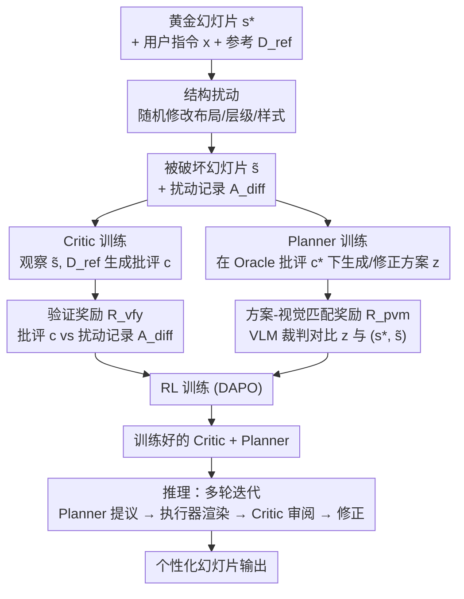

# Personalization as Inverse Planning: Learning Latent Design Intents for Agentic Slide Generation via Structural Denoising

**会议**: ECCV 2026  
**arXiv**: [2607.00407](https://arxiv.org/abs/2607.00407)  
**代码**: 无  
**领域**: Agent / 幻灯片生成  
**关键词**: 幻灯片个性化, 逆规划, 结构去噪, 强化学习, 多智能体

## 一句话总结
Spire 将页面级幻灯片个性化（PSP）建模为逆规划问题，通过对黄金幻灯片施加离散结构扰动构建自监督"去噪"信号，训练 Critic 和 Planner 两个 7B 级智能体在 RL 下协同迭代修正设计方案，无需依赖特定执行器即可推断用户的隐式设计意图，在视觉相似度和 VLM-as-Judge 评分上均显著优于基于 GPT 的强基线。

## 研究背景与动机

**领域现状**：现代幻灯片生成系统普遍采用多模态大语言模型（MLLM）驱动的智能体管线，将任务分解为内容提纲、素材提取、布局编排、迭代修正等模块化阶段，通过模板选择、视觉反馈和多智能体协调来提升整份幻灯片的整体一致性。

**现有痛点**：这些系统在页面级设计上力不从心。一旦内容确定，页面布局和样式就被动地交由系统默认模板或冗长的用户显式指令决定，无法主动推断用户的隐式设计偏好。PPTAgent 面对缺乏完美模板的真实参考集时忠实度极低（仅 0.1036），AutoPresent 的粗粒度文字提示又无法准确传达精细的视觉意图。

**核心矛盾**：页面级设计意图（如元素对齐、间距、配色、视觉层级）天然是隐式的、上下文依赖的——同一用户在不同场景下会偏好不同风格，但这些意图极少以结构化标注的形式存在于现实语料中。直接监督训练不可行，而让用户每次都显式撰写详尽指令既不现实也违背了个性化的初衷。

**本文目标**：给定用户的高层内容指令和少量参考幻灯片，自动推断出包含完整页面规格（布局坐标、元素样式、视觉层级）的可执行设计方案，使得一个不具备个性化能力的通用执行器也能忠实地还原出符合用户偏好的幻灯片。

**切入角度**：作者观察到人类教人做幻灯片的模式——给出详细的逐步计划，任何称职的设计师都能照做。由此将 PSP 形式化为一个概率逆规划问题：设计意图作为隐变量 z，目标是在给定参考幻灯片的条件下最大化黄金幻灯片 s* 的边际似然。但该目标存在两个计算障碍——渲染似然 p(s*|z) 无显式形式且执行器 E 不可微分。

**核心 idea**：用离散结构空间的"加噪-去噪"替代像素空间优化——有意破坏黄金幻灯片的布局、层级和样式结构，将难以优化的 PSP 目标转化为可验证的结构重建代理任务，让两个智能体在 RL 下学习协同去噪。

## 方法详解

### 整体框架

Spire 的核心思路是"以退为进"：不直接优化那个难以处理的 PSP 目标，而是构造一个可控的结构扰动-重建过程，从中提取可验证的自监督信号来分别训练 Critic 和 Planner 两个智能体。训练完成后，两者与黑盒执行器（如 python-pptx 编码智能体）协作，进行多轮迭代式的幻灯片生成。

整个流程分为训练和推理两个阶段。训练阶段，给定黄金幻灯片 s*，先对其施加独立的结构扰动（随机修改元素位置、尺寸、颜色等），得到被破坏的幻灯片 s̃，并记录扰动操作列表 A_diff 作为 ground-truth。随后 Critic 观察 s̃ 和用户参考幻灯片 D_ref，产出一份结构化的批评意见 c，其质量通过与 A_diff 对比来验证。Planner 则从用户指令 x 和参考 D_ref 出发，在 Oracle 级批评 c* 的引导下，学习生成或修正设计方案 z，方案质量由一个强 VLM 裁判通过对比 z 与 (s*, s̃) 的匹配度来评估。两个智能体均用 DAPO 强化学习算法独立训练。推理阶段，Planner 先生成初始方案，执行器渲染出幻灯片，Critic 审阅后给出修改建议，Planner 据此修正方案并再次执行，如此迭代多轮直至收敛。

### 关键设计

**1. 结构扰动：将难以优化的 PSP 目标转化为可验证的"去噪"代理任务**

PSP 的原始目标需要最大化 p(s*|z)，即执行器根据方案 z 生成 s* 的似然，但这一似然既无显式形式也无法通过执行器回传梯度。Spire 的关键破局思路是利用幻灯片独有的离散结构特性——每张幻灯片可表示为若干视觉元素（文本框、图像、图形）的集合，每个元素具有位置、尺寸、颜色等结构化属性。

与其在像素空间加噪（这已被证明无法捕捉幻灯片的逻辑结构 [10, 39, 44]），Spire 在离散属性空间施加扰动。具体做法：对 s* 中的每个元素 e_i，按元素类型 T(e_i) 独立采样扰动动作 a_i，扰动发生在三个维度——空间布局（平移坐标）、视觉层级（缩放尺寸）和风格一致性（修改配色）。每个扰动类别以 0.5 概率独立激活，扰动幅度在预定义范围内均匀采样。形式化地，扰动动作列表 A = {a_i} 的采样遵循独立的逐元素分布：

$$q(\mathcal{A} \mid s^*) = \prod_{i=1}^{N} q_{\mathcal{T}(e_i)}(a_i \mid e_i)$$

对 s* 施加 A 后得到 s̃，而扰动逆操作构成差异列表 A_diff = {a_i^{-1} | a_i ≠ ∅}。这产生了海量的自监督三元组 (s̃, s*, A_diff)，其中"哪些地方需要修正"由构造已知，从而为 Critic 和 Planner 提供了可验证的训练信号。设计要点：每种扰动类型独立随机激活，使得"总是报错"或"从不报错"的平凡策略无法持续获得高分，有效抑制了奖励作弊。

**2. Critic：从结构扰动中学习可验证的细粒度设计判别**

Critic 的角色是充当渲染似然 p(s*|z) 的代理——它观察被破坏的幻灯片 s̃、用户指令 x 和参考幻灯片 D_ref，输出一份结构化的批评意见 c，逐项指出 s̃ 中的设计缺陷并给出具体修正建议。c 覆盖八类预定义的结构化方面：文本颜色/位置/尺寸、图形颜色/位置/尺寸、图像位置/尺寸。

Critic 的训练以可验证性为核心。其输出 c 由一个强 LLM 裁判（GPT-4o-mini）逐元素与 ground-truth 扰动 A 比对。对每个元素 e_i，裁判判断批评是否正确处理了扰动：

$$y_i = J(c, e_i, a_i) \in \{0, 1\}$$

y_i = 1 表示 c 在 a_i ≠ ∅ 时正确识别并提出修正，或在 a_i = ∅ 时正确闭嘴。元素级验证奖励为平均正确率 R_vfy(c, A) = (1/N) ∑ y_i。最终 Critic 用 DAPO 最大化期望 R_vfy，并辅以格式奖励来确保输出遵循三段式结构（分析-评估-反馈）。格式奖励中反馈部分权重占 0.85，突出结构化逐项建议的核心地位。

这个设计的精妙之处在于：Critic 不需要被告知"这张幻灯片哪里不对"——它必须自己从视觉比较中找出问题，而 ground-truth A_diff 仅用于验证。这迫使 Critic 真正学会理解用户的参考风格与当前幻灯片之间的差异，而非死记硬背扰动模式。

**3. Planner：从粗到精的迭代式设计方案生成与修正**

Planner 同时承担两项任务：(i) 从零开始生成高质量设计方案 z，以及 (ii) 在给定批评 c 的情况下修正一份次优方案 z̃，实现"迭代精炼"。两者被统一为一个条件生成框架——Planner 根据 (x, D_ref, 可选的 c, 可选的 z̃) 输出方案 z。

方案 z 的质量由方案-视觉匹配奖励 R_pvm 衡量。一个强 VLM 裁判（Claude Opus 4.5）同时看到方案 z 和一对幻灯片 (s*, s̃)，被要求判断哪张幻灯片更忠实地体现了方案 z 中描述的设计。裁判被明确指示仅基于对 z 的忠实度做判断，而非自身审美偏好。为消除位置偏差，裁判以两种呈现顺序各判一次，取平均：

$$R_{\text{pvm}}(z, s^*, \tilde{s}) = \frac{1}{2}\left(\mathbb{I}[\hat{o}_{\rightarrow} = 1] + \mathbb{I}[\hat{o}_{\leftarrow} = 1]\right)$$

注意 s̃ 是通过结构扰动产生的，它改变了设计风格（如配色）而非简单地让幻灯片"难看"。在不看 x 和 D_ref 的情况下，s̃ 本身可能还不错——因此裁判要正确判断，必须依赖一份高质量、有区分力的方案 z。这确保了 R_pvm 衡量的不是方案是否"好看"，而是方案是否准确描述了目标设计的独特特征。

训练中为获得高质量的训练对 (z̃, c*)，使用 Oracle VLM（GPT-5）以 hint 形式输入 A_diff，分别将 s̃ 描述为次优方案 z̃、将 A_diff 转译为黄金批评 c*。两个合成结果均经过拒绝采样过滤（z̃ 需在 R_pvm 下被判定更匹配 s̃ 而非 s*），确保训练数据自洽。

### 损失函数 / 训练策略

Critic 和 Planner 均采用 DAPO（一种强 RL 算法）独立训练，骨干模型为 Qwen2.5-VL-7B-Instruct，学习率 1e-6，batch size 4，rollout 数量 4，上下裁剪比分别为 0.2 和 0.28。两者训练相互独立——Critic 的奖励来自与 A_diff 的逐元素匹配，Planner 的奖励来自 VLM 裁判的方案-视觉匹配判断，两者均不需要通过黑盒执行器回传梯度。

这一双智能体解耦设计有严格的理论支撑。**定理 2.1**（代理有效性）证明：在正则条件下，优化 Spire 代理目标得到的梯度与原始 PSP 目标梯度之间的差距存在显式上界 ε_tot，该上界由经验优化误差、Critic 校准误差、结构代理误差和变分间隙四项组成。关键项（Critic 校准误差）因在可验证的结构扰动上训练而得到有效控制——未经训练或仅在像素空间去噪的 Critic 无法满足这一界限。**定理 2.2**（方差分解）进一步证明：双智能体分解消去了执行器引入的噪声，使得策略梯度估计的方差严格小于端到端训练：Var(ĝ_2a) = Var(ĝ_e2e) − Δ_{exec|c}，其中 Δ_{exec|c} ≥ 0，当执行器引入非零噪声时严格大于零。

## 实验关键数据

### 主实验

Spire 在 Zenodo10k 数据集上评估，训练/测试按 80%/20% 按幻灯片时间顺序划分。SlideBench 用作分布外（OOD）测试。比较对象包括 AutoPresent（从零设计）、PPTAgent（模板编辑）、Stable Diffusion 3.5 + IP-Adapter（图像生成）、PSP (o4-mini) 和 PSP (Base) 两种训练自由基线。

| 方法 | 规模 | 测试集 SSIM↑ | 测试集 CLIP↑ | 测试集 Judge AVG↑ | OOD SSIM↑ | OOD CLIP↑ | OOD Judge AVG↑ |
|------|------|-------------|-------------|-------------------|-----------|-----------|-----------------|
| AutoPresent | GPT | 0.6062 | 0.4431 | 0.5069 | 0.5976 | 0.5892 | 0.6461 |
| PPTAgent | GPT | 0.5126 | 0.5491 | 0.3758 | 0.4836 | 0.6371 | 0.3722 |
| SD 3.5 | 7B-level | 0.3372 | 0.4496 | 0.2569 | 0.3177 | 0.5753 | 0.3016 |
| PSP (o4-mini) | GPT | **0.8440** | **0.7683** | 0.4784 | **0.7233** | **0.7633** | 0.5338 |
| PSP (Base) | 7B | 0.3578 | 0.3317 | 0.3230 | 0.3910 | 0.3864 | 0.1937 |
| **Spire (Ours)** | 7B×2 | 0.8134 | 0.7018 | **0.5415** | 0.6785 | 0.6954 | **0.7333** |

Spire 以两个 7B 模型的规模，在 Judge 综合评分上超越所有 GPT 级基线（测试集 0.5415 vs PSP o4-mini 0.4784），在 OOD 场景下优势更加显著（0.7333 vs AutoPresent 0.6461）。PPTAgent 忠实度仅 0.1036，说明真实参考集中极少有可直接套用的完美模板。值得注意的是 PSP (o4-mini) 视觉相似度最高但其 Judge 评分偏低，印证了像素级相似度无法捕捉幻灯片离散结构质量的论断。

### 消融实验

| 配置 | SSIM↑ | CLIP↑ | Judge AVG↑ | 说明 |
|------|-------|-------|------------|------|
| Spire (完整) | 0.8134 | 0.7018 | 0.5415 | Critic + Planner 均经 RL 训练，多轮迭代修正 |
| w/o Revision | 0.7299 | 0.6096 | 0.4038 | 仅保留 RL 训练，去掉多轮迭代修正 |
| w/o FT | 0.3578 | 0.3317 | 0.3230 | 直接使用 Qwen2.5-VL-7B 基座模型，不经任何训练 |

| Critic 替换 | SSIM↑ | CLIP↑ | Judge AVG↑ | 说明 |
|-------------|-------|-------|------------|------|
| w/ o4-mini Critic | 0.8440 | 0.7683 | 0.4784 | Planner 保持相同，Critic 换成未训练的 o4-mini |
| w/ Spire Critic (7B) | **0.9367** | **0.8633** | **0.5035** | 使用 7B 的 Spire 训练 Critic，Judge 全面提升 |

消融结果揭示三个关键事实：(1) 偏好对齐的 RL 训练是必要条件——未经训练的基座模型完全无法推断隐式设计意图（Judge 0.3230 vs Spire 0.5415）；(2) 迭代修正机制带来显著增益（Judge 从 0.4038 提升至 0.5415），多轮修正使视觉相似度和 Judge 评分均稳定爬升；(3) 一个 7B 但经过 Spire 训练的 Critic，其引导效果优于未经训练的 o4-mini（Judge 0.5035 vs 0.4784），且视觉相似度反而更高——这是因为训练后的 Critic 真正学会了从参考幻灯片中提取用户偏好，而非依赖自身通用审美。

### 关键发现
- **RL 训练是不可或缺的**：消融中"w/o FT"的断崖式下降说明，即使是 7B 模型，不经过针对性的结构去噪优化，完全无法完成页面级设计意图推断。这一差距不是因为多智能体循环本身，而是源于 RL 训练让智能体学会了"用户想要什么"而非"我觉得什么好看"。
- **视觉相似度和 Judge 评分存在本质性脱节**：PSP (o4-mini) 在两个数据集上视觉相似度均为最高，但 Judge 评分显著低于 Spire。这验证了论文核心论点——像素级重建无法捕捉幻灯片的离散逻辑结构，仅优化标准化指标会误导 PSP 系统。
- **OOD 泛化能力突出**：在从未见过的 SlideBench 幻灯片上，Spire 的 Judge 综合评分（0.7333）远超所有基线，说明模型学到的是"如何从参考幻灯片中推断设计意图"这一通用能力，而非记忆训练集的特定样式。

## 亮点与洞察
- **"结构去噪"替代"像素去噪"**：这是论文最巧妙的设计。幻灯片天然具有离散结构（元素的坐标、尺寸、颜色都是结构化属性），在这些属性空间而非像素空间做扰动-重建，既保证了自监督信号的可验证性（修改了什么是确切知道的），又避免了像素级重建无法捕捉幻灯片逻辑结构的老问题。
- **用 VLM 裁判解决非可微黑盒问题**：Spire 完全绕开了执行器不可微分的困境——Planner 不直接优化"生成出来的幻灯片像不像 s*"，而是优化"方案 z 是否比 s̃ 更准确地描述了 s* 的设计"，这是一个纯语言/视觉推理任务，可以用强 VLM 可靠裁判。这个"把执行器的锅甩给 VLM 裁判"的思路非常普适。
- **双智能体解耦的方差降低有理论保证**：定理 2.2 严格证明了解耦训练消去了执行器噪声对策略梯度方差的贡献，这不是直觉而是数学。这种将工程设计与理论分析紧密结合的做法值得学习——理论不仅验证了设计，还解释了为什么端到端训练（必须通过黑盒执行器 rollout）会不稳定。
- **可迁移的设计范式**：将个性化定义为"学习一个隐变量，使得通用执行器在给定该变量时能复现个性化输出"，这一逆规划框架不限于幻灯片生成。任何涉及"从少量示例推断用户隐式偏好，然后生成符合偏好输出"的任务（如个性化 UI 设计、文档排版、代码风格适配）都可以套用这个范式。

## 局限与展望
- **参考幻灯片数量的限制**：论文实验中仅使用单张参考幻灯片（K=1），虽然刻意营造了最具挑战性的设定，但实际企业场景中用户可能有多张风格一致的参考（如整个品牌模板库），多参考条件下的意图推断是否更稳定、是否需要不同的聚合机制有待探索。
- **结构扰动空间的完备性**：当前仅扰动三类元素（文本/图形/图像）的三种属性（颜色/位置/尺寸），但真实幻灯片设计还涉及字体选择、透明度、旋转、动画、层级遮挡等更丰富的属性。扰动空间能否覆盖所有实际重要的设计维度，直接影响自监督信号的质量。
- **执行器依赖性**：虽然训练阶段完全绕过执行器，但推理阶段仍依赖一个称职的编码执行器（如 python-pptx）。若执行器能力有限（例如无法精确实现方案中的坐标），迭代修正可能会陷入"Critic 指出问题但 Planner 修了也没用"的恶性循环。论文未系统研究执行器质量对最终性能的影响。
- **Oracle 数据合成的成本**：训练中的 Oracle 批评 c* 和次优方案 z̃ 均由 GPT-5 合成并经拒绝采样过滤，这一步骤的计算和 API 成本不低，可能限制了方法向更大规模数据扩展的可行性。未来可探索用训练中的 Critic 自身替代 Oracle 进行数据合成，形成自举（bootstrapping）训练。

## 相关工作与启发
- **vs AutoPresent [10]**：AutoPresent 让单一智能体从零设计幻灯片，依赖冗长的显式指令来指定布局和样式。其本质是"用户把设计意图写出来"，而 Spire 是"从参考幻灯片中推断设计意图"。前者的性能上限受限于指令的精细度，后者则在用户给不出精确指令（这是常态）时具有压倒性优势。但 AutoPresent 不依赖参考幻灯片，在无参考可用的场景下仍有价值。
- **vs PPTAgent [53]**：PPTAgent 从参考幻灯片中提取模板再套用到目标内容，是一个"找模板-替换"的流程。这种做法的根本缺陷在于：真实世界中极少有"换个内容就能直接用"的完美模板。Spire 不提取模板，而是学习从参考中推断抽象的设计原则（如"标题用深蓝色、左对齐"），再将这些原则应用到新内容的布局中，本质上更灵活。
- **vs 通用文本到图像生成（SD 3.5 + IP-Adapter）**：将幻灯片当普通图像生成，虽然在开放域视觉合成中取得了巨大成功，但在幻灯片场景下暴露出两个致命问题：(i) 无法保证文本内容的准确性和可读性；(ii) 无法精确控制元素的离散位置和尺寸。Spire 在方案层面操作，方案随后由编码执行器精确实现，天然避免了这两个问题。
- **vs 通用 RLHF / DPO 管线**：Spire 的 RL 训练与标准 RLHF 的关键区别在于奖励信号的来源——RLHF 依赖人类偏好标注，而 Spire 的奖励来自自监督结构扰动的可验证重建。这为"在没有人类反馈的情况下做偏好对齐"提供了一条新路径，尤其适用于那些可以通过结构扰动构造 ground-truth 的领域。

## 评分
- 新颖性: ⭐⭐⭐⭐⭐ 将幻灯片个性化形式化为逆规划并用结构去噪构造代理目标，这一视角在幻灯片生成领域是全新的，理论与实验兼备。
- 实验充分度: ⭐⭐⭐⭐ 主实验覆盖 5 个基线、两种测试场景、两类评估指标，消融覆盖训练、迭代、Critic 三个维度。缺少对扰动强度、参考数量的敏感性分析。
- 写作质量: ⭐⭐⭐⭐⭐ 问题形式化清晰、方法动机充分、理论分析严格、实验解读到位。结构扰动和双智能体训练的描述环环相扣，逻辑链完整。
- 价值: ⭐⭐⭐⭐⭐ 提出的"逆规划 + 结构去噪"范式具有跨任务迁移潜力，双智能体解耦训练的方差降低理论为类似黑盒优化场景提供了可复用的分析框架。

<!-- RELATED:START -->

## 相关论文

- [\[CVPR 2026\] Zero-Shot Image Denoising via Hybrid Prior-Guided Pseudo Sample Generation](../../CVPR2026/image_restoration/zero-shot_image_denoising_via_hybrid_prior-guided_pseudo_sample_generation.md)
- [\[ICML 2026\] Measurement-Consistent Langevin Corrector for Stabilizing Latent Diffusion Inverse Problem Solvers](../../ICML2026/image_restoration/measurement-consistent_langevin_corrector_for_stabilizing_latent_diffusion_inver.md)
- [\[ICML 2026\] Learning Normalized Energy Models for Linear Inverse Problems](../../ICML2026/image_restoration/learning_normalized_energy_models_for_linear_inverse_problems.md)
- [\[CVPR 2026\] PNG: Diffusion-Based sRGB Real Noise Generation via Prompt-Driven Noise Representation Learning](../../CVPR2026/image_restoration/diffusion-based_srgb_real_noise_generation_via_prompt-driven_noise_representatio.md)
- [\[CVPR 2026\] FastGaMer: Efficient GainMap Learning for Practical Inverse Tone Mapping](../../CVPR2026/image_restoration/fastgamer_efficient_gainmap_learning_for_practical_inverse_tone_mapping.md)

<!-- RELATED:END -->
