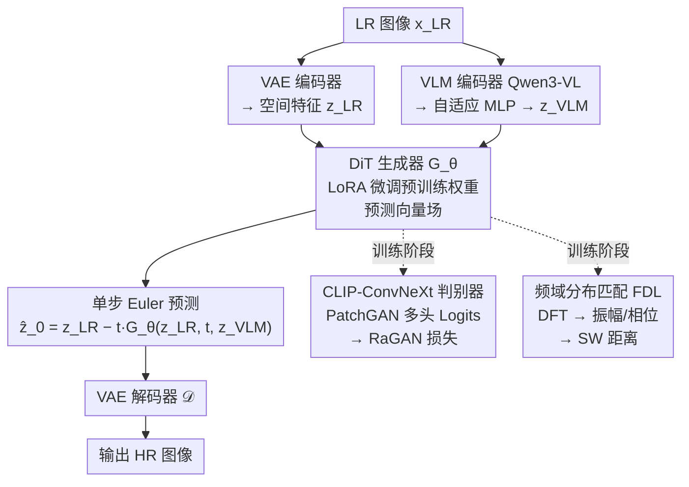

# Spectral and Trajectory Regularization for Diffusion Transformer Super-Resolution

**会议**: ECCV2026  
**arXiv**: [2603.06275](https://arxiv.org/abs/2603.06275)  
**代码**: [https://github.com/jkwang28/StrSR](https://github.com/jkwang28/StrSR)  
**领域**: 图像恢复  
**关键词**: 图像超分辨率, 扩散Transformer, 单步蒸馏, 频域正则化, 判别蒸馏  

## 一句话总结

StrSR 提出非对称判别蒸馏 + 频域分布匹配的联合框架，以 CLIP-ConvNeXt 判别器替代 DiT 判别器避免模型坍塌，并用频域分布损失（FDL）抑制 DiT 特有的网格状周期伪影，首次在 DiT 架构上实现高质量单步真实图像超分辨率。

## 研究背景与动机

真实图像超分辨率（Real-ISR）的目标是将低分辨率输入放大为高分辨率输出，但实际场景中的退化远比双三次下采样复杂且未知。扩散模型凭借强大的生成能力和可扩展性在这一领域取得了显著进展，尤其是扩散 Transformer（DiT）架构在大规模数据和参数量下展现出远超传统 UNet 的 scaling law 优势。然而，扩散模型的迭代采样（通常需要数十到上百步）计算开销巨大，因此单步蒸馏成为关键的加速手段。现有方法尝试将预训练的文本到图像 DiT 蒸馏为单步超分模型，却面临两个核心问题：预训练的噪声→清晰图像轨迹与 LR→HR 轨迹之间存在严重的分布偏移，当输入 LR 图像的退化程度较重时，模型被迫从一个远离训练分布的起点出发执行单大步预测，导致输出质量急剧下降；同时，DiT 架构特有的 patchification 操作将图像分为固定大小的图块，在单步强制推理时相邻图块间的 token 相似度激增，引发电网状的周期伪影——这是 UNet 架构中不存在的独特问题。

本文从空域对抗和频域约束两个维度同时应对上述挑战。**核心 idea：采用 CLIP-ConvNeXt 作为轻量纹理敏感判别器实现非对称判别蒸馏以规避 DiT 判别器引发的模型坍塌，并引入频域分布匹配（对傅里叶变换后的振幅与相位分量计算切片 Wasserstein 距离）从根本上抑制 DiT 的谱泄漏周期性伪影，首次在 DiT 单步超分上实现无伪影的真实感生成。**

## 方法详解

### 整体框架

StrSR 的整体流程如下：输入 LR 图像经过双编码器提取特征——VAE 编码器提取低层空间结构特征 z_LR，VLM 编码器（Qwen3-VL-4B）提取高层语义特征后通过自适应 MLP 映射为 z_VLM。两者作为条件注入 LoRA 微调的 DiT 生成器，在 rectified flow 框架下单步预测向量场并通过 Euler 步直接得到潜在表示，最终经 VAE 解码器输出 HR 图像。训练阶段两个额外的监督信号协同作用：CLIP-ConvNeXt 判别器在空域施加对抗约束，频域分布损失在特征频谱空间施加分布匹配约束。

### 关键设计

**1. 非对称判别蒸馏：轻量纹理敏感判别器替代 DiT 判别器**

使用 DiT 同时作为生成器和判别器进行分布匹配蒸馏时，由于缺少渐进式蒸馏的过渡，训练极易出现模型坍塌。StrSR 的核心洞察是放弃 DiT 判别器，改用预训练的 CLIP-ConvNeXt 作为判别器骨干。ConvNeXt 的大核卷积保留了丰富的多尺度空间信息，对高频纹理和网格伪影具有天然的敏感性——这与 DiT 的 patchification 操作正好相反，后者将图块内部边缘纹理信息压缩整合、丢失了局部细节的判别能力。判别器采用 PatchGAN 架构，从 CLIP-ConvNeXt 的不同阶段提取多级特征并经过可训练卷积头输出逐块 logits。训练采用相对平均 GAN（RaGAN）而非标准非饱和 GAN：RaGAN 计算真实样本相对假样本的真假概率（而非独立概率），为生成器提供更稳定的梯度流。此外引入近似 R1 正则化——在真实数据上添加小方差高斯噪声并迫使判别器对噪声版本和原始版本输出一致——以类似标准 R1 罚项的效果稳定训练，但无需计算昂贵的梯度范数。

**2. 频域分布匹配：以切片 Wasserstein 距离约束频谱分布**

仅靠空域对抗训练无法完全消除 DiT 特有的周期伪影。论文深入分析了其根本原因：DiT 的 patchification 将图像划分为离散图块，在进行单大步预测时相邻图块在特征空间中产生高频谱泄漏，这些泄漏的能量在解码后表现为像素空间规则的网格状周期纹理，其周期恰好等于 DiT 图块大小与 VAE 缩放因子的乘积。StrSR 引入频域分布损失（FDL）来直接约束频谱分布。具体而言，将预测图像和目标图像分别送入一个预训练特征提取器，对所得特征图施加离散傅里叶变换分解为振幅分量和相位分量，然后分别在两个分量上计算切片 Wasserstein 距离。振幅约束确保生成图像的整体频段能量分布逼近真实图像，相位约束确保高频结构的空间位置正确。两者联合作用有效切断了谱泄漏到周期伪影的传导链条。消融实验显示加入 FDL 后特征图中相邻 token 的相似度明显降低，高频纹理区域（如砖墙、篮子边缘）的重复点状伪影显著消退。

**3. 双编码器架构：语义理解引导纹理恢复**

超分任务同时依赖低层结构恢复和高层语义理解。单用 VAE 编码器可以保留像素级空间信息，但对于严重退化的输入（如模糊到无法辨认纹理类别的图像），缺乏语义引导会导致模型随意猜测纹理。StrSR 采用 Qwen3-VL-4B 作为第二编码器，其视觉语言预训练赋予了模型丰富的语义理解能力——例如区分砖墙纹理和鱼鳞纹理、理解水滴的语义含义。由于 DiT 骨干（Z-Image-Turbo 或 FLUX.2）本身就基于 Qwen3 文本编码器，Qwen3-VL 的 tokenization 和隐表示天然兼容，因此只需冻结 VLM 权重、学习一个轻量自适应投影层即可对齐特征空间。实验表明移除 VLM 后 MUSIQ 指标从 65.1 降至 62.1，视觉上模型在复杂结构区域（人物衣物边缘、密集纹理区域）出现严重失真。

### 损失函数 / 训练策略

生成器总损失为 L1 重建损失、LPIPS 感知损失、RaGAN 对抗损失和 FDL 频域分布损失的加权组合。采用两阶段训练策略：第一阶段（40k 步）使用空域损失 + 对抗损失让模型收敛到合理的感知质量，第二阶段（20k 步）加入 FDL 进行频谱微调以消除残留网格伪影。判别器损失为 RaGAN 损失与近似 R1 正则化的加权和。生成器和判别器以 1:1 比率交替更新，采用 AdamW 优化器，生成器学习率 5e-6、判别器学习率 1e-6。DiT 骨干使用 LoRA（rank=256）进行参数高效微调，在 4 张 A800 GPU 上以 bf16 精度训练。

## 实验关键数据

### 主实验

| 数据集 | 指标 | StrSR-FLUX | 最佳同等方法 | 对比 |
|--------|------|------------|------------|------|
| DIV2K-val ×4 | LPIPS↓ | **0.299** | TSD-SR 0.345 / HYPIR 0.355 | 大幅领先感知质量 |
| DIV2K-val ×4 | DISTS↓ | **0.129** | TSD-SR 0.153 / HYPIR 0.146 | 结构相似性最优 |
| RealSR ×4 | LPIPS↓ | **0.260** | TSD-SR 0.287 / PiSA-SR 0.274 | 真实场景感知最优 |
| RealSR ×4 | PSNR↑ | **23.77** | TSD-SR 23.76 / CTMSR 26.18 | 与方法学基线持平 |
| RealLQ250 ×4 | NIQE↓ | **3.469** | TSD-SR 3.488 / PiSA-SR 3.915 | 无参考质量最优 |
| RealLQ250 ×4 | MANIQA↑ | **0.614** | PiSA-SR 0.605 / HYPIR 0.605 | 美观度最优 |

### 消融实验

| 配置 | MANIQA↑ | MUSIQ↑ | QAlign↑ | 说明 |
|------|---------|--------|---------|------|
| Full model (w/ All) | 0.575 | 65.106 | 4.478 | 完整模型 |
| w/o GAN | 0.472 | 54.086 | 4.163 | 去掉对抗后所有指标大幅下降 |
| w/o Ra (用非饱和GAN) | 0.493 | 61.820 | 4.457 | RaGAN 优于普通 GAN |
| w/o VLM (只用文本编码器) | 0.530 | 62.093 | 4.344 | VLM 优于纯文本编码器 |
| w/o emb (无任何嵌入) | 0.504 | 58.868 | 4.129 | 无语义引导退步最大 |

### 关键发现
- FDL 对网格伪影的消除效果显著：特征可视化显示加入 FDL 后 token 间 PCA 聚类分布更加均匀，不再出现规则的格子状聚集
- VLM 编码器在语义理解任务上不可替代：对于需要识别物体类型才能正确恢复纹理的图像（如水滴、砖墙、衣物图案），移除 VLM 后模型出现大量结构失真
- 两阶段训练策略合理：先让对抗训练稳定收敛再施加频谱约束，比从头联合训练收敛更快、质量更高

## 亮点与洞察
- **非对称判别器的设计智慧**：看似「降级」使用更小的 CLIP-ConvNeXt 替代参数更庞大的 DiT 判别器，反而解决了模型坍塌问题——揭示了不同架构参数体量之外的归纳偏置差异对训练稳定性的关键影响
- **频域分析诊断伪影根源**：将网格伪影追溯到 DiT patchification 的谱泄漏机制，这种从频域诊断空域伪影的思路可迁移到其他 Diffusion Transformer 的低层视觉任务
- **双编码器解耦设计便于迭代**：VLM 提供语义先验、VAE 保留空间细节的分离设计清晰解耦了「知道是什么」和「知道在哪」两个问题，未来可轻松替换更强的 VLM 或更优的 VAE

## 局限与展望
- 模型参数量过大：Z-Image-Turbo（6B）和 FLUX.2 klein（4B）远超常用的 Stable Diffusion（<1B），难以部署到边缘设备
- PSNR/SSIM 像素级指标仍有提升空间——感知质量优先带来的失真与像素精度之间的权衡在 GAN 类方法中天然存在
- 对含文本的区域处理效果不佳：当前流程未显式将文本作为输入，未来可引入 OCR 模块增强文字区域还原

## 相关工作与启发
- **vs TSD-SR**: TSD-SR 用目标分数蒸馏处理 DiT 单步推理但未根本解决网格伪影；StrSR 从频域谱泄漏角度定位并消除了这一伪影
- **vs HYPIR**: HYPIR 在 UNet 架构上使用对抗扩散蒸馏无法直接迁移到 DiT；StrSR 的非对称判别蒸馏正是为 DiT 量身设计的替代方案
- **vs FluxSR**: FluxSR 从现象层面观察到 DiT 的 token 相似度问题，StrSR 将其分析推进到频域谱泄漏层面并引入 FDL 直接约束

## 评分
- 新颖性: ⭐⭐⭐⭐ 非对称判别蒸馏的设计选择出人意料但合理，频域分析伪影根源的视角新颖
- 实验充分度: ⭐⭐⭐⭐⭐ 三个数据集（合成+真实+低质）、两个骨干模型、详尽的消融和可视化均到位
- 写作质量: ⭐⭐⭐⭐ 问题诊断和分析过程清晰，Motivation 和贡献的对应关系明确
- 价值: ⭐⭐⭐⭐ 首次实现 DiT 单步超分的无伪影真实感生成，对 DiT 应用于低层视觉有开创意义

<!-- RELATED:START -->

## 相关论文

- [\[CVPR 2026\] Spectral Super-Resolution via Adversarial Unfolding and Data-Driven Spectrum Regularization](../../CVPR2026/image_restoration/spectral_super-resolution_via_adversarial_unfolding_and_data-driven_spectrum_reg.md)
- [\[CVPR 2026\] One-Step Diffusion Transformer for Controllable Real-World Image Super-Resolution](../../CVPR2026/image_restoration/one-step_diffusion_transformer_for_controllable_real-world_image_super-resolutio.md)
- [\[CVPR 2026\] DreamSR: Towards Ultra-High-Resolution Image Super-Resolution via a Receptive-Field Enhanced Diffusion Transformer](../../CVPR2026/image_restoration/dreamsr_towards_ultra-high-resolution_image_super-resolution_via_a_receptive-fie.md)
- [\[ICLR 2026\] Taming Hierarchical Image Coding Optimization: A Spectral Regularization Perspective](../../ICLR2026/image_restoration/taming_hierarchical_image_coding_optimization_a_spectral_regularization_perspect.md)
- [\[ECCV 2026\] FreeMEF: 可灵活处理任意帧数的多曝光融合Transformer](freemef_flexible_frame_mef.md)

<!-- RELATED:END -->
