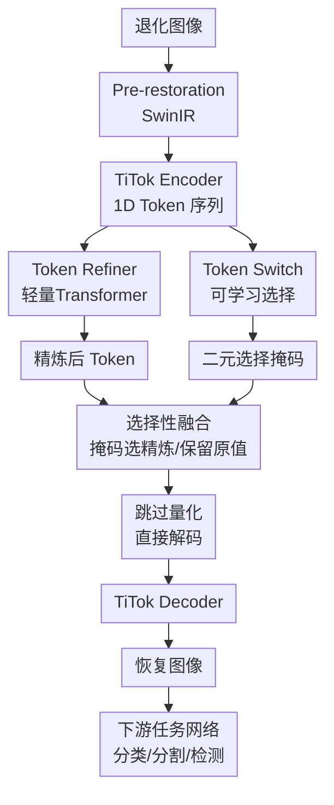

# TaskTok: Delving into Task Tokens for Task-driven Image Restoration

**会议**: ECCV2026  
**arXiv**: [2606.26615](https://arxiv.org/abs/2606.26615)  
**代码**: [https://github.com/jimmy9704/TaskTok](https://github.com/jimmy9704/TaskTok)  
**领域**: 图像恢复  
**关键词**: 任务驱动图像恢复, 1D Token, Token选择, 选择性恢复, 下游视觉任务

## 一句话总结
TaskTok 提出了任务驱动图像恢复 (TDIR) 框架，利用 1D tokenizer 中 token 按索引位置专业化编码不同视觉属性的特性，通过可学习 token 开关和轻量级 token 精炼模块，选择性地只恢复与下游任务（分类/分割/检测）最相关的 token 子集，在显著提升下游任务性能的同时大幅降低计算开销。

## 研究背景与动机

真实场景中的图像经常因传输损耗、传感器限制或拍摄条件不佳而退化，丢失必要的高频细节，导致分类、检测、分割等高层视觉任务性能显著下降。传统的图像恢复方法（如 SwinIR、DiffBIR）以像素保真度或感知质量为优化目标，但提升像素质量并不等价于提升机器可识别性。为此，任务驱动图像恢复（TDIR）应运而生，其目标不是生成人眼看着更舒服的图像，而是最大限度恢复下游模型所需的任务相关语义线索。

现有 TDIR 方法中，扩散生成先验（如 EDTR、UNIRESTORE）借助扩散模型强大的生成能力来处理复杂退化，展现出不错的潜力。这些方法的典型流程是：用 tokenizer（如 VAE）将退化图像编码到 2D 潜空间，然后让扩散模型更新所有潜变量（token），最后解码出恢复图像。但这种"无差别更新所有 token"的策略有两个固有缺陷：第一，退化图像中其实保留了不少可靠的线索——生成本文中的首句写错了，重写——其实保留了很多可靠的语义线索，盲目更新所有 token 反而可能破坏这些保留信息，导致语义漂移；第二，大量 token 对下游任务贡献很小，更新它们浪费了大量计算。

本文的关键洞察来自对 1D tokenizer（TiTok）的分析。与 2D 网格 tokenizer 不同，1D tokenizer 将图像压缩为一维定长 token 序列，且不同索引位置的 token 表现出对特定视觉属性的"专业化"倾向——比如 token 14 主要编码毛发的精细纹理，token 20 编码全局色调。更重要的是，哪些 token 对下游任务重要是任务相关的：分类对材质类 token 更敏感，分割对背景模糊类 token 更敏感。通过贪婪搜索分析发现，仅恢复排序最靠前的少量 token 就能使分类准确率迅速饱和，再恢复更多 token 收益极为有限。

**核心 idea：将 1D tokenizer 中 token 按索引位置专业化编码视觉属性的特性与 TDIR 结合，通过一个可学习的 token 开关为每个下游任务选出最关键的 token 子集，搭配轻量级 refiner 进行选择性精炼，只恢复与任务最相关的 token 而保留其余 token 的原始信息。**

## 方法详解

### 整体框架

TaskTok 的流程分为三个阶段：编码前的预处理、token 空间的选择性精炼、解码恢复。输入退化图像首先经过一个轻量 SwinIR 预恢复模块抑制伪影，再由冻结的 TiTok Encoder 编码为 K 个 1D 潜 token。随后，两个核心模块在 token 空间协作：Token Refiner 对退化 token 进行全面精炼，Token Switch 根据任务输出二元选择掩码，将精炼后的 token 与原始退化 token 按掩码融合——只有被选中的 token 才使用精炼后的表示，其余 token 保持退化状态。最后，融合后的 token 序列跳过 codebook 量化（避免语义漂移），直接送入 TiTok Decoder 恢复出图像，供后续下游任务网络使用。

### 关键设计

**1. Token Refiner：轻量级 token 全局恢复模块**

精炼模块的核心是用 token 之间的全局上下文来修复退化带来的语义损失。它由少量 Transformer 层（默认 6 层）构成，以整个 1D token 序列 Z^LQ 为输入，输出精炼后的序列 Z̃。设计轻量化的原因是：精炼模块只需要为被选中的少数 token 提供高质量精炼表示，不必具备全覆盖的恢复能力——实际上消融实验也证实了，让 refiner 强行恢复所有 token 反而会损害下游任务性能，因为一些退化 token 中本已保留的信息可能在精炼中被错误改写。

**2. Token Switch：可学习的任务感知 token 选择器**

Token Switch 的核心是一个任务相关的可学习概率向量 p^(t) ∈ [0,1]^K，通过阈值二值化（如 >0.5 选 1，否则 0）得到二元掩码 m^(t)，控制每个 token 使用精炼版本 Z̃ 还是保留原始退化版本 Z^LQ。由于二值化操作不可导，训练时使用 straight-through estimator 传递梯度。

关键的设计选择是使用贪婪排序（Greedy Order）初始化开关概率。具体做法是：在训练前，通过逐 token 替换实验（从 HQ 逐个替换为 LQ，观察准确率下降速度）得到每个 token 对任务的贡献排序 π^(t)；然后将排序名次 r_k 线性映射到 [0,1] 概率作为 p_k^(t) 的初值（排名第 1 的 token 概率为 1，最后一名为 0）。这样做的动机是：将先验知识嵌入初始参数，帮助开关在训练早期就指向合理的 token 子集，避免冷启动阶段随机搜索。

此外，训练时引入掩码正则化项 L_mask，鼓励开关尽可能少地选择 token，从而集中计算资源到真正必要的 token 上。两项机制协同让 Token Switch 为每个任务学到紧凑且有效的 token 子集。

**3. 跳过量化的直接解码**

标准的 TiTok pipeline 在将 token 送入 decoder 前需要进行 codebook 向量量化（VQ），即把连续 token 映射到最近邻的码本向量。但在 TDIR 场景下，硬量化会引入不可忽略的量化误差，导致语义偏移——尤其是在经过选择性精炼后，那些被选中的 token 的表示与码本中任何条目都不完全对齐，强制量化反而丢失了精炼获得的精细信息。因此，TaskTok 直接跳过 VQ 步骤，将选择性融合后的连续特征 Z^(t) 直接输入 decoder，显著提升了下游任务性能。

### 损失函数 / 训练策略

采用 EDTR 的两阶段训练协议，将恢复网络和任务网络的优化解耦：

**Stage 1 — 训练 TaskTok（冻结下游任务网络）**：
- 高维特征蒸馏损失 L_HLF：缩小恢复输出与 clean 图像在任务网络特征空间中的差异
- Token 级监督 L_tok：仅对掩码选中的 token 施加 L1 距离，约束精炼后的 token 接近其 HQ 版本
- 掩码正则化 L_mask：最小化平均选择概率，鼓励开关紧凑选择
- 总损失：L_stage1 = L_HLF + λ_tok * L_tok + λ_mask * L_mask

**Stage 2 — 训练下游任务网络（冻结 TaskTok）**：
- 标准任务损失 L_task + 特征匹配 Loss L_FM（从 HQ 预训练教师网络蒸馏知识）

## 实验关键数据

### 主实验

在 ImageNet（分类）、PASCAL VOC2012（分割/检测）上评估，两种复合退化设置（Mix-A：降采样+JPEG；Mix-B：降采样+模糊+噪声+JPEG）。

| 任务 | 退化 | 指标 | No restoration | TiTok-256 | EDTR | TaskTok-256 (Ours) | 提升 |
|------|------|------|---------------|----------|------|-------------------|------|
| CLS (ResNet) | Mix-A | Acc↑ | 45.9 | 56.6 | 55.7 | **59.9** | +4.2 vs EDTR |
| CLS (ResNet) | Mix-B | Acc↑ | 42.9 | 52.5 | 51.6 | **56.2** | +4.6 vs EDTR |
| Seg (DeepLabV3) | Mix-A | mIoU↑ | 42.9 | 62.1 | 62.2 | **63.9** | +1.7 vs EDTR |
| Seg (DeepLabV3) | Mix-B | mIoU↑ | 40.2 | 60.4 | 60.9 | **62.7** | +1.8 vs EDTR |
| Det (Faster-RCNN) | Mix-A | mAP↑ | 18.0 | 26.5 | 29.2 | **30.1** | +0.9 vs EDTR |
| Det (Faster-RCNN) | Mix-B | mAP↑ | 16.7 | 25.7 | 28.1 | **28.6** | +0.5 vs EDTR |

在效率方面，TaskTok-64 仅恢复 12-23 个 token（远少于 EDTR 的 4096 个），吞吐量达 75.4 img/s，是 EDTR（7.2 img/s）的 **10 倍以上**。

### 跨数据集 / 跨架构泛化

| 设置 | 条件 | TiTok-256 | EDTR | TaskTok-256 |
|------|------|----------|------|------------|
| CUB200（未见数据集） | Acc↑ | 48.7 | 50.3 | **54.5** |
| Oxford-IIIT Pet | Acc↑ | 74.0 | 73.7 | **79.6** |
| ViT-B/16（未见骨干） | Acc↑ | 55.8 | 55.3 | **58.4** |
| ConvNeXt-B（未见骨干） | Acc↑ | 60.3 | 62.6 | **66.5** |

### 消融实验

| 配置 | CLS Acc↑ | #Tok(CLS) | Seg mIoU↑ | #Tok(Seg) | Det mAP↑ | #Tok(Det) |
|------|---------|----------|----------|----------|---------|----------|
| TiTok-64 基线 | 47.4 | 64 | 55.5 | 64 | 22.3 | 64 |
| + Pre-restoration | 48.5 | 64 | 56.9 | 64 | 23.1 | 64 |
| + Token Refiner | 46.3 | 64 | 56.0 | 64 | 21.8 | 64 |
| + L_tok | 46.7 | 64 | 56.2 | 64 | 22.2 | 64 |
| + Token Switch | 46.9 | 31 | 57.1 | 33 | 22.1 | 35 |
| + L_mask | 50.9 | 14 | 58.3 | 26 | 22.7 | 25 |
| + π 初始化 | 53.0 | 10 | 60.4 | 24 | 24.3 | 22 |
| **TaskTok-64（最终）** | **55.3** | **12** | **61.9** | **22** | **25.9** | **23** |

消融实验的关键发现：仅加入 Token Refiner（且强制恢复所有 token）反而使性能下降，表明均匀恢复所有 token 对下游任务有害；Token Switch 是最关键的组件，而 π 初始化进一步压缩了 token 数量并提升性能。

### 关键发现

- Token Refiner 如果强制恢复所有 token 会损害任务性能——验证了选择性恢复的必要性
- 跳过量化的直接解码是 TaskTok-64 相比 full-VQ 版本提升约 2% 准确率的关键
- 跨任务迁移实验表明：分类与分割/检测选择的 token 差异显著（Seg 切 Det 迁移损失较小，但 CLS 切换到其他任务的 token 损失较大），验证了 token 选择确实是任务特定的
- Token 属性分析发现：普遍被选择的 token 编码精细纹理和形态锐度，普遍被丢弃的 token 编码全局色调和光照——这表明颜色/光照等全局属性在退化图像中通常保留较好，不需要额外恢复

## 亮点与洞察

- **选择性恢复而非全面恢复**是核心突破：将图像恢复从"恢复一切"转向"只恢复下游任务需要的"，思路简洁但效果显著，可以启发其他任务感知的视觉处理管线
- **用 1D tokenizer 的索引专业化性质做任务感知选择**很巧妙：相比 2D grid tokenizer 中 token 与空间位置绑定、难以做属性级选择，1D tokenizer 天然提供了按视觉属性粒度操作的机会
- **贪婪排序初始化开关**的工程巧思：将先验知识注入可学习参数，比纯随机初始化减少早期训练的不稳定性，类似 warm-start 的思路可迁移到其他需要通过可学习掩码做选择的场景
- **跳过 VQ 直接解码**：量化的语义偏移在逐像素恢复场景中不可忽视，这一看似简单的改动带来了显著提升——提醒我们在处理潜空间特征时要仔细评估量化引入的损失

## 局限与展望

- 当前仅使用 TiTok 一种 1D tokenizer，这是否是最优选择尚未验证；其他 1D tokenizer（如 FlowTok、DiT-Tok）可能会有不同的索引专业化模式
- 实验仅在三类退化（降采样+模糊+噪声+JPEG）上进行，未覆盖雨雾、低光等自然退化，泛化性有待验证
- Pre-restoration 模块使用 SwinIR，这一选择的核心开销依然存在；虽然 token 空间的计算大幅减少，但整个管线的端到端效率受制于预恢复模块
- Token Switch 的学习依赖于训练集中任务的分布，在开放世界/长尾场景下，任务退化的模式可能与训练不符

## 相关工作与启发

- **vs EDTR**: EDTR 使用扩散模型在 2D 潜空间统一更新所有 token，计算开销大且可能破坏可靠线索；TaskTok 基于 1D tokenizer 的索引专业化特性，选择性恢复少量 token，以不到 1/10 的计算量获得了更好的下游性能
- **vs SR4IR**: SR4IR 通过任务网络特征空间的感知 loss 引导全局恢复，本质上仍是全图恢复；TaskTok 从 token 粒度出发做选择，粒度更细、针对性更强
- **vs TiTok**: TiTok 主要是图像压缩生成工具，TaskTok 在其基础上发现了 token 索引专业化对 TDIR 的价值，并由此构建了选择机制，拓展了 1D tokenizer 的应用边界

## 评分
- 新颖性: ⭐⭐⭐⭐⭐ 将 1D token 索引专业化特性引入 TDIR 的选择性恢复，思路新颖，反直觉但验证充分
- 实验充分度: ⭐⭐⭐⭐⭐ 3 个任务 + 2 种退化 + 跨数据集 + 跨架构 + 详尽消融 + token 属性分析，覆盖全面
- 写作质量: ⭐⭐⭐⭐⭐ 动机清晰、观察验证充分、消融逐步回答"为什么"、伪代码和归因分析完整
- 价值: ⭐⭐⭐⭐⭐ 为 TDIR 提供了一个新的轻量化范式，效率提升近 10x 同时性能更强，实用价值高

<!-- RELATED:START -->

## 相关论文

- [\[ICCV 2025\] Exploiting Diffusion Prior for Task-driven Image Restoration](../../ICCV2025/image_restoration/exploiting_diffusion_prior_for_task-driven_image_restoration.md)
- [\[ICLR 2026\] Learning Domain-Aware Task Prompt Representations for Multi-Domain All-in-One Image Restoration](../../ICLR2026/image_restoration/learning_domain-aware_task_prompt_representations_for_multi-domain_all-in-one_im.md)
- [\[CVPR 2026\] Task-Aware Image Signal Processor for Advanced Visual Perception](../../CVPR2026/image_restoration/task-aware_image_signal_processor_for_advanced_visual_perception.md)
- [\[CVPR 2025\] Complexity Experts are Task-Discriminative Learners for Any Image Restoration](../../CVPR2025/image_restoration/complexity_experts_are_task-discriminative_learners_for_any_image_restoration.md)
- [\[ICLR 2026\] Mechanism of Task-oriented Information Removal in In-context Learning](../../ICLR2026/image_restoration/mechanism_of_task-oriented_information_removal_in_in-context_learning.md)

<!-- RELATED:END -->
