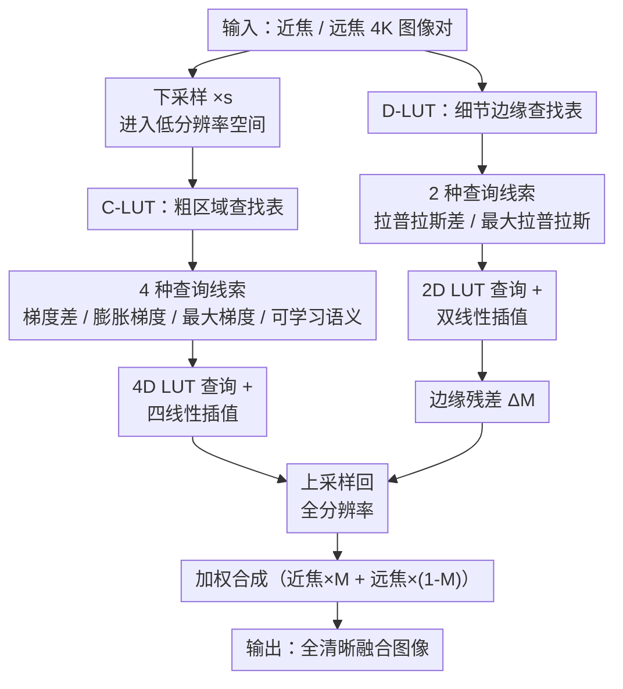

# UHD-MFF: Shattering Barriers in Multi-Focus Ultra-High-Definition Image Fusion via Learnable Lookup Tables

**会议**: ECCV2026  
**arXiv**: [2606.31242](https://arxiv.org/abs/2606.31242)  
**代码**: [https://github.com/zyb5/UHD-MFF](https://github.com/zyb5/UHD-MFF)  
**领域**: 图像恢复  
**关键词**: 多焦点图像融合, 超高清, 可学习查找表, 尺度解耦, 移动端部署

## 一句话总结

本文提出首个面向 4K 超高清的多焦点图像融合数据集 UHD-MFF（1,950 对 3840×2160 图像），并设计尺度解耦的可学习查找表框架 UMF-LUT——用低分辨率 C-LUT 做区域级粗决策、高分辨率 D-LUT 做边缘级精修——在 SOTA 融合质量下仅 0.008M 参数就能以 90fps 实时推理 4K 图像并部署到手机。

## 研究背景与动机

多焦点图像融合（Multi-Focus Image Fusion, MFIF）旨在将同一场景下不同焦点的多张图像融合为一张全清晰图像，在手机摄影、显微成像等领域有广泛应用。过去十年，从传统方法（DSIFT、GFDF）到深度学习（MFF-GAN、MSFIN-Fusion）再到统一框架（U2Fusion、TC-MoA），MFIF 技术在低分辨率（通常低于 1080P）数据集上取得了长足进步。然而，随着成像设备进入 4K/8K 时代，现有方法在超高清场景下面临三重壁垒。

首先是 **数据可用性壁垒**：主流数据集 Lytro（520×520）、Real-MFF（625×433）、MFI-WHU（600×400）分辨率极低，缺乏大规模 4K 训练/测试基准。模型在低分辨率数据上训练后泛化到超高清场景时质量严重退化。其次是 **模型适配性壁垒**：现有方法直接沿用标准卷积或注意力机制处理 4K 图像——全分辨率下特征图的内存开销远超 GPU 显存上限，而简单下采样又会丢失聚焦边界处的精细结构。最后是 **部署可行性壁垒**：移动端对 MFIF 的需求很大，但当前方法大多依赖计算密集型服务器（如 TC-MoA 需 5.7 秒/张、参数量 340M），无法在手机上运行，严重限制了实际应用。

本文的核心 idea 是**通过尺度解耦的 LUT 策略将超高清融合拆分为低分辨率区域级粗决策和高分辨率边缘级精修，以可学习查找表替代全分辨率卷积，一举击穿数据、适配和部署三重壁垒。**

## 方法详解

### 整体框架

UMF-LUT 的核心思路是：不在全分辨率下做繁重计算，而是在低分辨率空间做稳健的区域级焦点判断，再在高分辨率下用轻量 LUT 补偿边缘细节。框架由 C-LUT（Coarse-Region Lookup Table）和 D-LUT（Detail-Edge Lookup Table）两条分支构成，输出融合后再加权合成最终图像。

### 关键设计

**1. C-LUT：四维粗区域查找表做低分辨率焦点决策**

C-LUT 在低分辨率（对 4K 输入做 s 倍下采样）空间运作，将"哪个区域聚焦"的决策问题转化为对四个互补线索的联合查询。

四个线索各司其职：梯度差异线索（取近/远焦 Sobel 梯度图之差，反映局部清晰度差异）和膨胀梯度线索（取梯度图在邻域窗口内的平均能量之差，抑制噪声）聚焦于两张图直接的锐度对比；最大梯度线索（取两张图各自梯度强度的逐像素最大值，表征纹理丰富度）帮助在低纹理区消除歧义；可学习区域语义线索（用一个轻量 CNN 从拼接的低分辨率图像提取上下文特征）补充梯度线索难以捕捉的场景级语义信息。四个线索各自经统一空间归一化映射到 `[0, S_C-1]` 的离散索引范围后，组成四维坐标 `(c1, c2, c3, c4)`，索引一个提前初始化、可端到端训练的 4D LUT。

查询时，由于坐标是连续值而 LUT 网格是离散点，采用 **四线性插值**（Quadrilinear Interpolation）——对每个坐标拆成整数索引和小数残差，取周围 2^4 = 16 个格点的加权平均作为输出。这种设计既保证整个流程可微可分训练，又使权重过渡平滑。

**2. D-LUT：二维细节边缘查找表做高分辨率边界精修**

C-LUT 在低分辨率下虽能做出正确的区域级判断，但下采样过程天然丢失了聚焦边界的精确位置。D-LUT 作为补充分支，直接在原生全分辨率下运行，专注于边界处的高频残差补偿。

与 C-LUT 用一阶 Sobel 算子不同，D-LUT 选用 **二阶拉普拉斯算子**——二阶响应强调剧烈强度变化和零交叉结构，天然适合边界定位，而一阶梯度在边界处容易过平滑。对全分辨率近/远焦图像施加拉普拉斯核后，提取两个线索：拉普拉斯差异线索（两张图的拉普拉斯响应之差，直接捕获高频焦点过渡）和最大拉普拉斯线索（两张图拉普拉斯响应的逐像素最大值，评估局部结构强度、抑制平坦区的不稳定响应）。

这两个线索经归一化后组成二维坐标，查询一个 2D LUT（双线性插值，取周围 4 个格点）得到边缘残差 `ΔM`。通过稀疏性正则化（L1 范数约束），D-LUT 被训练成仅在真正的聚焦边界处激活，在平坦区域保持近似零输出——这使得 D-LUT 的贡献高度聚焦、计算几乎可忽略。

**3. 跨尺度决策融合与非监督训练策略**

C-LUT 输出粗决策图 `M_main` 后，经双线性上采回全分辨率，与 D-LUT 的边缘残差 `ΔM` 逐像素相加（截断到 `[0,1]` 范围），得到最终融合决策图 `M_final`。最终图像即为 `M_final · I_near + (1 - M_final) · I_far`——一张平滑的、在聚焦区域偏向近焦、离焦区域偏向远焦的融合图。

训练方面，C-LUT 和 D-LUT 在统一框架中联合优化。损失函数由三部分构成：**重建损失**（强度 L1 + 梯度 L1 + SSIM 的加权和）衡量融合图与清晰参考图的非监督保真度；**二值化损失** `E[M_coarse · (1 - M_coarse)]` 迫使 C-LUT 在平坦区域输出果断的 0/1 决策、抑制鬼影伪影；**稀疏性损失** `||ΔM||_1` 确保 D-LUT 仅在聚焦边界处激活、不在平坦区虚构纹理。

有意思的是，尽管有合成数据提供的真值，作者刻意采用**非监督训练策略**——不直接用全清晰图像做监督。实验对比显示非监督策略的数值指标与有监督版本相当，但产生更自然的亮度和更柔和的过渡，避免有监督版本偶尔出现的对比度人工伪影。

### 一个完整示例

以对 3840×2160 分辨率的"近焦-瓶子清晰"和"远焦-背景清晰"两张图像做融合为例。输入对先经 8 倍下采样到 480×270，送入 C-LUT——在低分辨率下，四个线索分别编码近/远焦之间的梯度差异、区域能量差异、纹理强度和语义上下文，经 4D LUT 输出 480×270 的粗决策图（前景近焦值接近 1、背景远焦值接近 0）。与此同时，D-LUT 在全分辨率（3840×2160）下用拉普拉斯算子提取边缘处的焦点过渡信号，输出仅在瓶盖与背景的边界附近有非零值的残差 `ΔM`（此处约 0.05-0.15）。将粗决策图上采样回 3840×2160 后叠加上 `ΔM`，边界区域的过渡权重从突然跳变变为平滑渐变。最终合成时，瓶身处近焦图像占比 >95%，背景处 <5%，而边界区域约 40-60% 的平滑过渡消除了生硬边线。

### 损失函数 / 训练策略

C-LUT 和 D-LUT 联合优化，采用 AdamW 优化器，batch size 8，初始学习率 1e-5。损失函数为：

$$ \mathcal{L}_{\text{C-LUT}} = \mathcal{L}_{rec} + \lambda_1 \mathcal{L}_{bin}, \quad \mathcal{L}_{\text{D-LUT}} = \mathcal{L}_{rec} + \lambda_2 \mathcal{L}_{sparse} $$

其中重建损失 $\mathcal{L}_{rec} = \lambda_3 \mathcal{L}_{int} + \lambda_4 \mathcal{L}_{grad} + \lambda_5 \mathcal{L}_{ssim}$，超参数 $\lambda_1=50,\ \lambda_2=0.05,\ \lambda_3=20,\ \lambda_4=0.7,\ \lambda_5=0.8$。

## 实验关键数据

### 主实验

| 数据集 | 指标 | 本文 | 之前最佳 | 说明 |
|--------|------|------|----------|------|
| UHD-MFF-Real (150对 4K真实) | MI ↑ | **4.8029** | 4.7667 (MSFIN) | 互信息最佳 |
| UHD-MFF-Real | VIF ↑ | **1.3814** | 1.3628 (SESF) | 视觉保真度最佳 |
| UHD-MFF-Real | Q_AB/F ↑ | **0.7290** | 0.7145 (MSFIN) | 梯度融合质量最佳 |
| UHD-MFF-Syn (300对) | SD ↑ | **49.9062** | 49.8757 (CCSR-Net) | 标准差领先 |
| UHD-MFF-Syn | VIF ↑ | **1.4335** | 1.4186 (CCSR-Net) | 视觉保真度领先 |

| 效率指标 | 本文 | 之前最佳 (SESF) | 说明 |
|----------|------|----------------|------|
| 推理时间 (ms) | **11.03** | 150.35 (SESF) | 实时 90fps |
| 参数量 (M) | **0.0081** | 0.014 (SESF) | 最小模型 |
| 峰值显存 (MB) | **1133.15** | 2109.36 (SESF) | 最低显存 |
| 能耗 (mJ) | **67.45** | 84.07 (SESF) | 最低功耗 |
| 手机推理时间 (s) | **0.97** | 55.68 (SESF, 唯一可比) | 华为 P60 Pro |

### 消融实验

| 配置 | MI ↑ | VIF ↑ | Q_AB/F ↑ | 说明 |
|------|------|-------|----------|------|
| Full model | **6.3999** | **1.4335** | **0.7498** | 完整模型 |
| w/o C_GD (梯度差线索) | 6.1312 | 1.4028 | 0.7449 | 丢失近/远焦对比信号 |
| w/o C_DG (膨胀梯度线索) | 5.9196 | 1.2564 | 0.6601 | **掉点最大**——区域能量抑制噪声关键 |
| w/o C_MG (最大梯度线索) | 6.0500 | 1.3948 | 0.7436 | 低纹理区易混淆 |
| w/o C_RS (语义线索) | 5.9962 | 1.3833 | 0.7417 | 缺少场景级上下文 |
| w/o D-LUT (边缘精修) | 6.3538 | 1.4210 | 0.7501 | 边界清晰度下降但数值影响有限 |

### 关键发现

- **膨胀梯度线索贡献最大**：去掉它后所有指标下滑最严重（VIF 从 1.4335 降至 1.2564），说明在噪声环境中聚合邻域信息建立空间一致性，比单纯逐像素梯度差更稳健。
- **训练数据规模至关重要**：从 15 对扩到 1500 对，AG 从 1.479 升至 1.942（+31%），Q_AB/F 从 0.5367 升至 0.7498（+40%）——说明 UHD 场景下的融合确实需要大规模高保真数据支撑。
- **高分辨率训练不可替代**：在低分辨率数据上训练后直接推理 4K 图像，所有指标大幅退化（VIF 从 1.4335 降至 1.2237），验证了 UHD-MFF 数据集的存在必要性。
- **非监督 vs 有监督**：数值指标接近，但非监督生成更自然的亮度和更柔和的过渡，避免有监督版本偶尔出现的对比度扭曲和光谱偏移。
- **效率质的飞跃**：本文模型 11ms/张（90fps）的 4K 实测速度比最接近的 SESF 快 13.6 倍，比慢的 TC-MoA 快 518 倍——这种效率差异直接决定了能否落地到手机端。

## 亮点与洞察

- **用 LUT 替代全分辨率卷积，将超高清融合的计算成本从 O(HW·K²) 降到 O(1)**：C-LUT 在缩小 8 倍的空间做推理、D-LUT 只需查 2D 表做边界微调——这一设计选择使得 4K 融合的参数量压缩到仅 8,100 个（比大部分神经网络少 4-5 个数量级），是模型能在手机上实时运行的根本原因。
- **尺度解耦的理念具有通用性**：将"大分辨率任务"拆成"低分辨率粗决策 + 高分辨率边界微调"的双尺度 LUT 架构，可以推广到其他超高清图像处理任务（去噪、超分、HDR 融合等），对资源受限设备尤其友好。
- **二值化损失与稀疏性损失的分工干净利落**：前者让 C-LUT 在平缓区域做果断二值选择、消除鬼影，后者让 D-LUT 专注边界、不在平坦区虚构纹理——两个正则项从不同维度保障了决策图的质量，设计意图明确、效果可解释。
- **非监督训练策略的有趣发现**：尽管有合成真值可用，作者刻意不用；实验结果证明非监督版本在数值指标接近的前提下产生了更自然的视觉效果——对图像融合类任务的训练范式有一定启发。

## 局限与展望

- **C-LUT 的下采样倍率 s 是硬编码**：论文未对 s 的选择做详细消融，不同分辨率和场景可能需要自适应倍率；未来工作可以考虑可学习的自适应下采样策略。
- **数据集以静态场景为主**：UHD-MFF 目前只包含静态图像对，缺乏动态场景（运动物体、光照变化）下的多焦点融合数据。视频多焦点融合是一个天然拓展方向。
- **拉普拉斯算子在平坦区域退化**：当图像中存在大面积无纹理区域（白墙、天空）时，D-LUT 的两个拉普拉斯线索均趋近零，其边缘精修能力在此类区域几近失效——但此场景下 C-LUT 的粗决策已足够，因此对最终结果影响有限。
- **与其他图像增强任务（超分、HDR）的联合优化未探索**：实际手机摄影管线中多焦点融合往往与超分辨率、HDR 等先后执行，UMF-LUT 是否能与其他模块联合调优值得进一步研究。

## 相关工作与启发

- **vs TC-MoA (CVPR 2024)**：TC-MoA 用任务定制化的 MoE Adapter 做通用图像融合，性能好但参数量 340M、推理 4K 图像需 5.7 秒；本文用 LUT 特化为 UHD 场景设计，以 8.1K 参数达到同等甚至更优的融合质量，效率有质的飞跃。
- **vs CCSR-Net**：CCSR-Net 将耦合卷积稀疏表示展开为可学习网络，有一定解释性但推理仍需近 3 秒/张 4K 图像；本文的 LUT 策略在数值指标上与之接近（甚至领先），但效率高两个数量级。
- **vs SESF**：SESF 是唯一能够在手机上运行的方法，但推理一张 4K 图像需 55.68 秒；本文将这一时间压缩到 1 秒以内，使得多焦点融合的移动端实时体验成为可能。

## 评分

- 新颖性: ⭐⭐⭐⭐⭐ 首个面向 4K 的多焦点融合数据集 + LUT 双尺度解耦架构设计，思路新颖且工程落地意义明确
- 实验充分度: ⭐⭐⭐⭐⭐ 在多方面做了系统消融（各线索贡献、数据规模、训练策略、分辨率对比），效率对比尤其详细
- 写作质量: ⭐⭐⭐⭐⭐ 三个壁垒的叙事结构清晰，方法叙述流程完整，实验对比和组织专业
- 价值: ⭐⭐⭐⭐⭐ 不仅推动了学术指标的 SOTA，更提供了可手机部署的工程方案，对工业界有直接价值

<!-- RELATED:START -->

## 相关论文

- [\[ICLR 2026\] FreeAdapt: Unleashing Diffusion Priors for Ultra-High-Definition Image Restoration](../../ICLR2026/image_restoration/freeadapt_unleashing_diffusion_priors_for_ultra-high-definition_image_restoratio.md)
- [\[CVPR 2025\] DnLUT: Ultra-Efficient Color Image Denoising via Channel-Aware Lookup Tables](../../CVPR2025/image_restoration/dnlut_ultra-efficient_color_image_denoising_via_channel-aware_lookup_tables.md)
- [\[CVPR 2026\] Scan Clusters, Not Pixels: A Cluster-Centric Paradigm for Efficient Ultra-high-definition Image Restoration](../../CVPR2026/image_restoration/scan_clusters_not_pixels_a_cluster-centric_paradigm_for_efficient_ultra-high-def.md)
- [\[ICCV 2025\] Decouple to Reconstruct: High Quality UHD Restoration via Active Feature Disentanglement and Reversible Fusion](../../ICCV2025/image_restoration/decouple_to_reconstruct_high_quality_uhd_restoration_via_active_feature_disentan.md)
- [\[ECCV 2026\] CogSENet: Blind Image Deblurring with Blur-Conditioned Semantic Routing and Explicit Frequency Fusion](cogsenet_blind_image_deblurring_with_blur-conditioned_semantic_routing_and_expli.md)

<!-- RELATED:END -->
