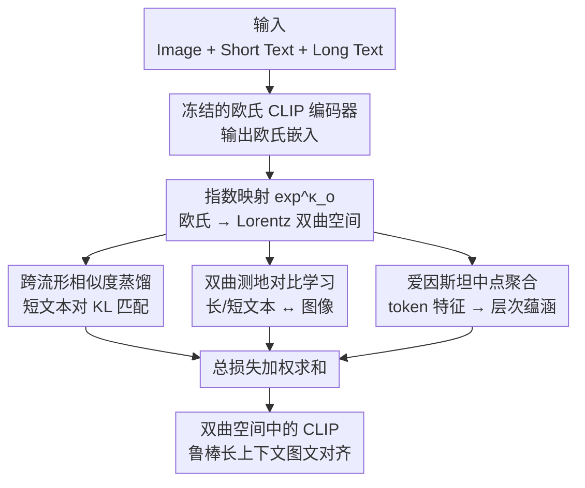

# HyFL-CLIP: Hyperbolic Fine-Tuning of CLIP for Robust Long-Context Understanding

**会议**: ECCV 2026  
**arXiv**: [2607.00428](https://arxiv.org/abs/2607.00428)  
**项目页**: [https://janeyeon.github.io/hyflclip](https://janeyeon.github.io/hyflclip)  
**代码**: 无  
**领域**: 多模态VLM  
**关键词**: 双曲空间微调, 长上下文图文对齐, CLIP微调, 层次蕴涵关系, 跨流形蒸馏

## 一句话总结
HyFL-CLIP 将预训练 CLIP 的欧氏图文对齐蒸馏到双曲空间（Lorentz 模型），通过爱因斯坦中点聚合建模"全局描述--局部成分"的层次蕴涵关系，使模型在长文本被扰动（重排、删除、丢词）时仍能稳定检索正确图像，在扰动词下比最强基线提升最高 19.5%。

## 研究背景与动机

**领域现状**：CLIP 已成为图文对齐的事实标准，但其训练数据以短标题为主、绝对位置编码仅支持 77 token。为支持长上下文，现有工作（Long-CLIP、HiMo-CLIP、FineLIP、TULIP、Fix-CLIP、LongD-CLIP）普遍采用插值扩展位置编码 + 粗细粒度特征对齐的策略，取得了可观的长图文检索效果。

**现有痛点**：作者发现，上述方法尽管在正常长文本检索上表现不错，但对语义保持的文本扰动极其敏感——仅仅是打乱句子顺序、删除首句、随机丢一半词或替换几个词，检索性能就会大幅下降（HiMo-CLIP 在随机丢词 p=0.5 下掉 27.82%，在随机抽 2 句下掉 83.58%）。这说明现有方法学到的是脆弱的点对点匹配，而非对语义结构的真正理解。

**核心矛盾**：问题的根本原因在于欧氏对比学习的目标——它强制严格的一对一匹配，缺乏对"全局描述"与其"构成成分"之间层次包含关系（part-whole / entailment）的显式建模。当长文本中某些句子或词被移除/重排时，全局语义并未改变，但欧氏空间中对应的嵌入点却发生偏移，导致匹配失败。

**本文目标**：(1) 在保持 CLIP 已有的短图文对齐能力的前提下，将模型适应到长上下文场景；(2) 显式建模长文本中全局描述与局部成分之间的层次蕴涵关系；(3) 使模型面对文本扰动时具有几何上的容错裕量，而非脆弱的点对点匹配。

**切入角度**：双曲空间（hyperbolic space）天然具有负曲率和树状几何结构，非常适合表达层次包含关系。在双曲空间中，可以用蕴涵锥（entailment cone）定义一个几何容错区域——只要子节点嵌入落在父节点锥内，即认为语义上被包含。这种"区域包含"比欧氏空间的"点重合"宽容得多，恰好对应作者想要的鲁棒性。然而，现有双曲 VLM 大多从头训练，无法利用 CLIP 强大的预训练表示。作者提出的切入点是：不做从头训练，而是将 CLIP 的欧氏表示"蒸馏迁移"到双曲空间，并在双曲空间中用蕴涵关系重新组织长文本的语义结构。

**核心 idea**：通过跨流形相似度蒸馏将 CLIP 的欧氏图文对齐迁移到 Lorentz 双曲空间，再用爱因斯坦中点聚合 + 层次蕴涵损失显式建模长文本中"token 级特征 → 全局描述 → 图像"的 part-whole 层次关系，使模型在面对文本扰动时拥有几何容错裕量。

## 方法详解

### 整体框架

HyFL-CLIP 从一个预训练好的 Open-CLIP 模型出发，目标是将其欧氏图文对齐能力"迁移"到 Lorentz 双曲空间中，并在迁移过程中引入层次蕴涵建模，使得长文本的全局表示与其 token 级成分之间形成稳定的几何包含关系。整个框架的训练包含四个目标：短文本引导的跨流形相似度蒸馏、双曲测地对比损失、基于爱因斯坦中点聚合的层次蕴涵损失、以及半径熵正则化。

框架的输入端是图像 $I$、短文本 $T^s$（对应同一图像）、长文本 $T^l$（对应同一图像）三元组。图像和文本分别经过冻结的欧氏 CLIP 编码器得到欧氏嵌入 $\tilde{\mathbf{v}}, \tilde{\mathbf{t}}^s, \tilde{\mathbf{t}}^l$，然后通过 Lorentz 模型的指数映射 $\exp_{\mathbf{o}}^{\kappa}$ 投影到双曲空间，得到对应的双曲嵌入 $\mathbf{v}, \mathbf{t}^s, \mathbf{t}^l \in \mathbb{L}^n$。训练时，短文本对用于跨流形蒸馏（保持 CLIP 原有的短图文对齐质量），长文本对用于测地对比学习和层次蕴涵建模。最终输出一个在双曲空间中同时完成短图文匹配和长文本鲁棒理解的 CLIP 模型。

### 关键设计

**1. 短文本引导的跨流形相似度蒸馏：将 CLIP 的欧氏图文相似度几何"搬运"进双曲空间**

CLIP 在短图文对上已经学到了很好的相似度结构，直接丢弃这些知识从头在双曲空间训练会丢失预训练的优势。作者的做法是：用冻结的欧氏 CLIP（teacher）计算短文本 $\tilde{\mathbf{t}}_i^s$ 与图像 $\tilde{\mathbf{v}}_j$ 之间的余弦相似度 $S^{\mathrm{E}}(\tilde{\mathbf{t}}_i^s, \tilde{\mathbf{v}}_j) = \frac{\langle\tilde{\mathbf{t}}_i^s, \tilde{\mathbf{v}}_j\rangle}{\|\tilde{\mathbf{t}}_i^s\| \|\tilde{\mathbf{v}}_j\|}$，同时在双曲空间（student）中计算负测地距离 $S^{\mathrm{H}}(\mathbf{t}_i^s, \mathbf{v}_j) = -d_{\mathbb{L}}(\mathbf{t}_i^s, \mathbf{v}_j)$。两者分别通过 softmax + 温度系数转化为概率分布 $P^{\mathrm{E}}$ 和 $P^{\mathrm{H}}$，用 KL 散度迫使双曲学生模仿欧氏教师的相似度分布：$\mathcal{L}_{\text{distill}} = \frac{1}{B}\sum_i \text{KL}(P^{\mathrm{E}}_{i\cdot} \| P^{\mathrm{H}}_{i\cdot})$。

这个设计的巧妙之处在于"跨流形"——teacher 和 student 不在同一个几何空间中，但通过概率分布匹配绕过了直接对齐两个空间的困难。消融实验证实，去掉该损失后，短文本检索（COCO/Flickr30k）性能明显下降，说明蒸馏确实保留了 CLIP 原有的短图文对齐。同时该损失只用了短文本对，因为 CLIP 的短文本对齐最可靠。

**2. 基于爱因斯坦中点聚合的层次蕴涵损失：用锥包含代替点重合，获得扰动容错裕量**

这是全文最核心的设计。直觉上，一个长描述是由多个语义成分（token、短语、句子）组合而成的，全局语义应该是这些成分的"父节点"。作者用爱因斯坦中点（Einstein midpoint）将 token 级特征聚合为一个摘要表示 $\bar{\mathbf{t}}_i^{\ell}$，然后要求全局文本嵌入 $\mathbf{t}_i^{\ell}$ 落在以 $\bar{\mathbf{t}}_i^{\ell}$ 为中心的蕴涵锥内。

具体地，对每个 token 嵌入 $\mathbf{t}_{i,k}^{\ell}$，先用它与对应图像嵌入 $\mathbf{v}_i$ 的测地距离计算注意力权重 $\alpha_{i,k} = \frac{\exp(-d_{\mathbb{L}}(\mathbf{t}_{i,k}^{\ell}, \mathbf{v}_i)/\tau_{\text{ent}})}{\sum_m \exp(-d_{\mathbb{L}}(\mathbf{t}_{i,m}^{\ell}, \mathbf{v}_i)/\tau_{\text{ent}})}$——与图像越相关的 token 权重越大。然后在 Klein 模型中对 token 嵌入做加权爱因斯坦平均，再映射回 Lorentz 模型，得到摘要嵌入 $\bar{\mathbf{t}}_i^{\ell}$。蕴涵锥的半孔径定义为 $\omega(\bar{\mathbf{t}}_i^{\ell}) = \arcsin\left(\frac{2K}{\sqrt{\kappa} \|\bar{\mathbf{t}}_i^{\ell}\|_{\mathbb{L}}}\right)$，越靠近原点的嵌入锥越宽（包含关系越宽松），越远离原点的嵌入锥越窄（包含关系越严格）。损失函数惩罚全局嵌入超出锥边界的角度：$\mathcal{L}_{\text{ent}}^{\mathbf{t}^{\ell}} = \frac{1}{B}\sum_i \max(0, \phi(\bar{\mathbf{t}}_i^{\ell}, \mathbf{t}_i^{\ell}) - \eta \cdot \omega(\bar{\mathbf{t}}_i^{\ell}))$。图像侧对称执行同样的操作。

为什么这个设计带来鲁棒性？关键在于"锥"是一个区域，不是点。当文本被扰动（丢词、重排）时，token 集合发生变化，爱因斯坦中点也会移动，但只要移动后的新中点与全局嵌入 $\mathbf{t}_i^{\ell}$ 的角度仍在锥的半孔径 $\omega$ 内，匹配关系就保持不变。这为语义保持的扰动提供了一个几何上的"容错裕量"，而欧氏对比学习要求精确点对点匹配，没有这样的裕量。实验验证了这一直觉：去掉 $\mathcal{L}_{\text{ent}}$ 后，模型在扰动下的性能下降幅度显著增大（从 32.38% 上升到 35.64%）。

**3. 双曲测地对比损失：在 Lorentz 流形上同时优化长文本和短文本的图文对齐**

在完成欧氏到双曲的蒸馏后，模型还需要在双曲空间中用长文本进一步优化。作者使用双曲 InfoNCE 损失，将欧氏内积替换为负测地距离：$L_{\text{info}}(\mathbf{v}, \mathbf{t}; \tau_c) = -\sum_i \log \frac{\exp(-d_{\mathbb{L}}(\mathbf{v}_i, \mathbf{t}_i)/\tau_c)}{\sum_{k\neq i} \exp(-d_{\mathbb{L}}(\mathbf{v}_i, \mathbf{t}_k)/\tau_c)}$。该损失双向应用于长文本对和短文本对，最终形式为 $\mathcal{L}_{\text{itc}} = \mathcal{L}_{v\leftrightarrow t}^{\ell} + \lambda_1 \mathcal{L}_{v\leftrightarrow t}^{s}$，其中 $\lambda_1=0.1$ 控制短文本损失权重。这个设计的必要性在于：蒸馏损失只保证分布的相对排序正确，而对比损失直接拉近正样本对、推远负样本对，在双曲空间中建立新的决策边界。

**4. 半径熵正则化：防止双曲嵌入退化到原点附近**

双曲空间中有一个已知问题：嵌入可能坍塌到原点附近的小区域，导致空间利用率低、蕴涵锥孔径过大而失去判别力。作者引入半径熵正则化 $\mathcal{L}_{\text{reg}} = -H(\mathbf{p})$，其中 $p_i = \frac{\exp(d_{\mathbb{L}}(\mathbf{t}_i^{\ell}, \mathbf{o}))}{\sum_j \exp(d_{\mathbb{L}}(\mathbf{t}_j^{\ell}, \mathbf{o}))}$ 是 batch 内各样本的归一化超球半径分布。最大化该熵鼓励嵌入均匀分布在不同的半径上，防止全部挤在原点。这是一个轻量但有效的稳定性技巧，源自半监督学习中的熵正则化思想。

### 损失函数 / 训练策略

总损失为四个目标的加权和：$\mathcal{L} = \lambda_2 \mathcal{L}_{\text{distill}} + \mathcal{L}_{\text{itc}} + \lambda_3 \mathcal{L}_{\text{ent}} + \lambda_4 \mathcal{L}_{\text{reg}}$，其中 $\lambda_2 = 0.05$、$\lambda_3 = 0.1$、$\lambda_4 = 0.1$。训练在 ShareGPT4V（120 万图像-长标题对，平均 143.6 词）上进行 2 个 epoch，batch size 1024，使用 AdamW（lr=$10^{-5}$，weight decay=$2.5\times10^{-2}$），4 张 A100 GPU。曲率 $\kappa$ 从 1.0 初始化、可学习，训练后收敛到 0.9994。蒸馏温度 $\tau_E = \tau_H = 0.005$，对比温度 $\tau_c = 0.07$，蕴涵锥 $K=1$、$\eta=1.2$。位置编码保留前 20 个 token 的原始编码，剩余部分通过线性插值从 77 扩展到 248 token。超参数敏感性分析表明，所有 $\lambda$ 在广泛取值范围内性能稳定。

## 实验关键数据

### 主实验

**长文本零样本跨模态检索**（Table 1，Top-1 Accuracy %）。HyFL-CLIP 在 ViT-B/16 和 ViT-L/14 两种架构上、四个长文本数据集（DOCCI / DCI / Long-DCI / Urban-1k）上全面超越所有欧氏基线。

| 模型 (ViT-L/14) | DOCCI I2T | DOCCI T2I | DCI I2T | DCI T2I | Long-DCI I2T | Long-DCI T2I | Urban-1k I2T | Urban-1k T2I |
|---|---|---|---|---|---|---|---|---|
| Long-CLIP | 66.78 | 78.61 | 64.13 | 67.83 | 46.55 | 54.25 | 82.40 | 86.20 |
| HiMo-CLIP | 82.35 | 84.59 | 74.59 | 74.54 | 62.06 | 61.94 | 93.00 | 93.20 |
| FineLIP | 82.20 | 83.10 | — | — | 60.80 | 60.70 | 93.20 | 93.00 |
| **HyFL-CLIP** | **82.12** | **85.39** | **74.74** | **76.19** | **61.92** | **63.93** | **94.60** | **94.30** |

**扰动下的长文本跨模态检索**（Table 2，平均 Top-1 Accuracy，括号内为相对原始性能的变化百分比）。这是本文最关键的实验，直接验证了核心动机。

| 模型 | 丢词 p=0.5 | 删首句 | 顺序打乱 | 抽2句 | 抽3句 |
|---|---|---|---|---|---|
| Long-CLIP | 48.88 (↓35.81%) | 55.41 (↓19.45%) | 61.79 (↓3.46%) | 26.50 (↓91.89%) | 31.29 (↓79.89%) |
| HiMo-CLIP | 58.75 (↓27.82%) | 64.44 (↓17.42%) | 72.94 (↓1.88%) | 28.24 (↓83.58%) | 34.84 (↓71.52%) |
| FineLIP | 58.70 (↓26.59%) | 64.18 (↓16.25%) | 73.41 (↑1.17%) | 27.20 (↓86.05%) | 33.41 (↓74.32%) |
| **HyFL-CLIP** | **70.20 (↓9.21%)** | **68.22 (↓12.69%)** | **76.16 (↑1.27%)** | **32.55 (↓75.36%)** | **39.05 (↓63.94%)** |

在所有五种扰动类型下，HyFL-CLIP 的绝对性能最高、相对下降幅度最小。尤其在丢词场景（p=0.5），HyFL-CLIP 仅下降 9.21%，而 HiMo-CLIP 下降 27.82%。在顺序打乱上，HyFL-CLIP 甚至比原始性能略有提升（+1.27%）。

**短文本零样本跨模态检索**（Table 3）。HyFL-CLIP 在 COCO 和 Flickr30k 上的短文本检索性能与欧氏基线持平或略优，证明蒸馏成功保留了 CLIP 原有的短图文对齐。

### 消融实验

| 配置（ViT-L/14，六数据集平均） | I2T+T2I 平均性能 | 说明 |
|---|---|---|
| Full model | 69.8% | 完整模型 |
| w/o $\mathcal{L}_{\text{ent}}$ | 69.3% | 去掉层次蕴涵损失，长文本检索略降 |
| w/o $\mathcal{L}_{\text{ent}}$ + w/o $\mathcal{L}_{\text{distill}}$ | 68.3% | 同时去掉两个核心损失，短文本检索大幅下降 |

层次蕴涵损失（$\mathcal{L}_{\text{ent}}$）的贡献在扰动鲁棒性上远比在无扰动检索上显著——去掉 $\mathcal{L}_{\text{ent}}$ 后，扰动下的平均性能退化从 32.38% 恶化到 35.64%，验证了蕴涵锥机制的容错作用。蒸馏损失（$\mathcal{L}_{\text{distill}}$）的贡献主要体现在短文本检索——去掉后 COCO/Flickr30k 性能显著下降，同时嵌入可视化显示图像簇偏离文本簇。

### 关键发现
- **蕴涵损失是鲁棒性的主要来源**：去掉 $\mathcal{L}_{\text{ent}}$ 后扰动退化最大，而去掉 $\mathcal{L}_{\text{distill}}$ 对鲁棒性影响较小。这与设计直觉一致——蕴涵锥提供"区域包含"裕量，而蒸馏只保证排序正确性。
- **双曲空间中扰动文本的排序集中度远优于欧氏空间**：t-SNE/HoroPCA 可视化显示，欧氏空间中扰动文本嵌入离散分布，而双曲空间中它们紧密聚集在原始文本嵌入周围；基于蕴涵关系的排序将扰动文本的 mean rank 从 184.94（欧氏距离）降至 78.50（蕴涵），rank variance 从 42250 降至 12666。
- **所有超参数不敏感**：$\lambda_1$ 到 $\lambda_4$ 在 0.01-0.20 范围内变化时，性能波动极小（<1%），说明方法无需精细调参。
- **LLM 生成的 hard-negative 扰动下也显著优于基线**：Urban-1k 上用 LLaMA-30B 替换单个内容词生成 hard negative，HyFL-CLIP 的正确区分率达 62.07%，而 Long-CLIP / HiMo-CLIP / FineLIP 仅 52-54%（接近随机）。
- **训练效率高**：仅训练 2 epoch、总计算量 $5.34 \times 10^{17}$ FLOPs，低于 HiMo-CLIP（$1.96 \times 10^{18}$）和 FineLIP（$1.19 \times 10^{18}$）。

## 亮点与洞察
- **"用锥代替点"——几何容错裕量的设计直觉非常优雅**：欧氏对比学习要求 $\mathbf{t}_i$ 精确等于某个最优方向，而蕴涵锥说"只要在锥内就算对"。这个从"点匹配"到"区域包含"的视角转换是全文最漂亮的 insight，本质上是将单点监督松弛为集合监督。
- **跨流形蒸馏是一种通用的迁移范式**：不修改欧氏 CLIP 的权重，只把它的相似度分布当作 teacher signal 来训练双曲 student。这种"不侵入原模型、只取知识"的方式可以推广到任何想把欧氏预训练模型迁移到双曲/球面/其他流形的场景。
- **爱因斯坦中点聚合 + 图像引导的注意力权重是一个简洁的"摘要"机制**：不需要额外的摘要网络或 LLM，直接用 token-图像相似度作为加权系数做爱因斯坦平均，就能得到一个语义上有意义的"父节点"表示，且这个表示天然位于双曲流形上。
- **扰动鲁棒性实验设计非常全面**：不仅做了丢词、删句、打乱等语法级扰动，还做了 LLM 生成的语义级 hard negative 扰动（替换单个词改变语义），以及用 BLIP-VQA 验证检索结果与扰动文本的语义一致性。这种多层验证使"鲁棒性"的结论非常扎实。

## 局限与展望
- **仅验证了 CLIP，未涉及其他 VLM 架构**：方法的核心——跨流形蒸馏 + 层次蕴涵——理论上适用于任何对比学习 VLM（如 SigLIP、ALIGN），但论文只在 Open-CLIP（ViT-B/16 和 ViT-L/14）上做了实验。不同架构的编码器结构差异可能影响蒸馏效果，需要进一步验证。
- **长文本长度上限仍为 248 token**：位置编码插值方法本质上是"修补"而非根本解决，对于更长的多段落/多页文档仍然力不从心。一个可能的方向是结合递归或分块编码策略，让模型处理任意长度文本。
- **文本到文本的 intra-modality 检索提升有限**：虽然全面优于基线，但相对增益不如跨模态检索显著，说明层次蕴涵对单一模态内的语义抽象建模还有优化空间（目前的 token 聚合方式较简单）。
- **双曲空间带来的额外计算开销未被深入讨论**：指数/对数映射和爱因斯坦中点计算虽然在总 FLOPs 上可控（2 epoch 训练比 HiMo-CLIP 10 epoch 还低），但推理时的延迟增加和内存开销没有详细报告。
- **ShareGPT4V 数据的质量和偏差未被分析**：训练数据由 GPT-4V 生成，可能存在幻觉或描述风格偏差，这些对双曲嵌入质量的影响未讨论。

## 相关工作与启发
- **vs Long-CLIP / HiMo-CLIP / FineLIP**：这些工作都在欧氏空间中通过扩展位置编码 + 粗细粒度对齐来支持长上下文，核心范式仍是欧氏对比学习的一对一匹配。HyFL-CLIP 将整个问题搬到了双曲空间，用层次蕴涵代替点对点对比，本质上改变了匹配的几何约束——从精确匹配变成区域包含。这是范式级差异而非增量改进。
- **vs MERU / HyCoCLIP / UNCHA（双曲 VLM）**：现有双曲 VLM 大多从头训练，数据规模远小于 CLIP（约 20.5M vs 2.3B 图文对），因此性能上限受限。HyFL-CLIP 的跨流形蒸馏思路使得可以利用 CLIP 的强大预训练，再在双曲空间做领域适配。论文中将这些双曲 VLM 也用 HyFL-CLIP 框架微调后性能显著提升，验证了这种"欧氏预训练 + 双曲微调"范式的通用性。
- **vs 一般的相似度蒸馏（TinyCLIP 等）**：传统蒸馏都在同一空间内进行（欧氏到欧氏）。跨流形蒸馏的挑战在于两个空间的距离度量不同（余弦相似度 vs 测地距离），直接对齐嵌入不可行，所以作者对齐的是 softmax 概率分布而非嵌入本身。这种"分布级蒸馏、流形无关"的思路对其他跨几何空间的迁移任务有参考价值。

## 评分
- 新颖性: ⭐⭐⭐⭐⭐ 首次将欧氏 CLIP 微调到双曲空间做长上下文理解，"跨流形蒸馏 + 层次蕴涵容错"的视角非常新鲜，不是现有工作的简单组合
- 实验充分度: ⭐⭐⭐⭐⭐ 四个任务场景、六种扰动类型、两种架构、两类消融、VQA 验证、SDXL 生成实验，且与 7+ 个同期基线全面对比，实验极其扎实
- 写作质量: ⭐⭐⭐⭐ 核心动机和机制表述清晰，但部分公式推导衔接略跳（如爱因斯坦中点的 Klein 坐标转换对不熟悉微分几何的读者不够友好）
- 价值: ⭐⭐⭐⭐⭐ 解决的问题（长文本鲁棒性）是 CLIP 实际部署中的真实痛点，提出的"锥包含代替点匹配"思路可能启发后续工作在更多场景中使用双曲几何

<!-- RELATED:START -->

## 相关论文

- [\[NeurIPS 2025\] SuperCLIP: CLIP with Simple Classification Supervision](../../NeurIPS2025/information_retrieval/superclip_clip_with_simple_classification_supervision.md)
- [\[ICML 2026\] ParisKV: Fast and Drift-Robust KV-Cache Retrieval for Long-Context LLMs](../../ICML2026/information_retrieval/pariskv_fast_and_drift-robust_kv-cache_retrieval_for_long-context_llms.md)
- [\[ICCV 2025\] External Knowledge Injection for CLIP-Based Class-Incremental Learning](../../ICCV2025/information_retrieval/external_knowledge_injection_for_clip-based_class-incremental_learning.md)
- [\[ICLR 2026\] Supervised Fine-Tuning or Contrastive Learning? Towards Better Multimodal LLM Reranking](../../ICLR2026/information_retrieval/supervised_fine-tuning_or_contrastive_learning_towards_better_multimodal_llm_rer.md)
- [\[ICML 2025\] FedRAG: A Framework for Fine-Tuning Retrieval-Augmented Generation Systems](../../ICML2025/information_retrieval/fedrag_a_framework_for_fine-tuning_retrieval-augmented_generation_systems.md)

<!-- RELATED:END -->
