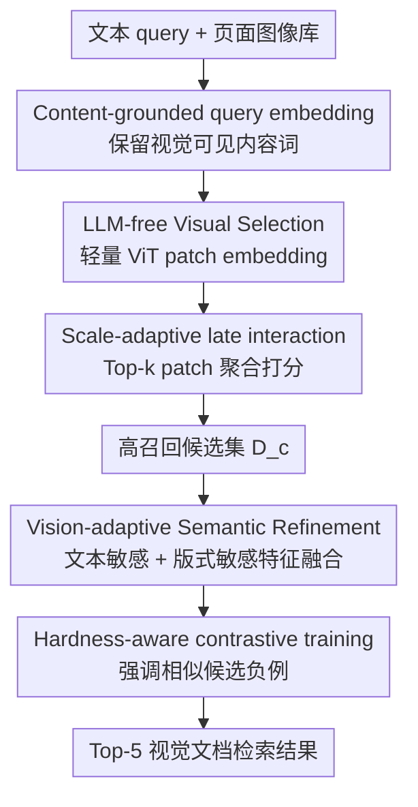

# LightSTAR: Efficient Visual Document Retrieval via Lightweight Selection with Vision-Adaptive Refinement

**会议**: ECCV 2026  
**arXiv**: [2606.23539](https://arxiv.org/abs/2606.23539)  
**代码**: [https://github.com/bokufa/LightSTAR](https://github.com/bokufa/LightSTAR)  
**领域**: 信息检索/RAG  
**关键词**: 视觉文档检索, 多模态RAG, 候选筛选, 视觉重排序, 高效检索

## 一句话总结
LightSTAR 针对视觉文档检索中 MLLM 全量编码页面太慢的问题，先用 LLM-free 轻量视觉选择模块高召回筛出候选，再只对候选做视觉自适应语义精排，在 ViDoRe 上达到 89.1 NDCG@5，同时把 5000 页端到端延迟降到 123.9s。

## 研究背景与动机

**领域现状**：企业搜索、技术文档问答、科研助理和多模态 RAG 越来越需要在长 PDF / 扫描件 / 表格报告中找相关页面。视觉文档检索（visual document retrieval）直接把页面当图像处理，能保留版式、图表、表格和字体等 OCR 容易丢失的信息。ColPali、ColQwen、VisRAG-Ret 这类方法已经证明 MLLM + late interaction 可以显著提升检索质量。

**现有痛点**：强检索质量的代价是昂贵的全量 MLLM 编码。长文档或大语料库里可能有几千到几万页，但某个 query 真正相关的只有极少数页面；如果每页都走重型视觉语言模型，索引、在线检索和频繁更新都会被延迟和显存拖住。

**核心矛盾**：视觉文档检索同时需要「粗筛足够快」和「精排足够懂视觉结构」。只用 OCR/BM25 或 CLIP 类轻模型，速度快但漏掉 layout、表格、视觉语义；全量 MLLM 精排，质量高但算力浪费在大量明显无关页面上。

**本文目标**：找到一个 practical trade-off：让轻量模型在全库范围内做高召回候选选择，把昂贵 MLLM 计算限制在 top candidates 内，同时最终排序质量接近全量 refinement。

**切入角度**：作者观察到真实文档检索 query 往往 keyword-anchored，也就是包含实体、术语、属性等会直接出现在相关页面可见文字中的内容词；这些词足以用便宜的视觉文本信号排除大批无关页面。

**核心 idea**：LightSTAR 把检索拆成两个阶段：LLM-free Visual Selection 负责用内容词和轻量视觉 patch embedding 高召回缩小候选集；Vision-adaptive Semantic Refinement 再对候选页用 MLLM 做细粒度语义匹配，并用区域自适应特征融合和 hard negative 训练提升精排辨别力。

## 方法详解

### 整体框架
给定查询 $q$ 和文档页面图像集合 $D={d_1,...,d_N}$，LightSTAR 不直接对所有页面跑 MLLM，而是先用一个轻量 text-aware visual encoder 对全库打分，得到候选集合 $D_c$，其中 $|D_c|\ll N$；然后只对 $D_c$ 调用视觉语言精排模型。复杂度从近似 $O(N·C_{MLLM})$ 变成 $O(N·C_{VE}+|D_c|·C_{MLLM})$，其中轻量视觉编码成本 $C_{VE}$ 远小于 MLLM 成本。

### 关键设计

**1. Content-grounded query embedding：先把 query 变成视觉可见的检索线索**

视觉文档页面上最容易被快速匹配的是实体名、术语、数字、动作和关键属性，而不是 the、of、and 这类功能词。LightSTAR 用 POS tagger 过滤掉连词、介词、冠词、be 动词和标点，只保留语义内容词得到 $q'$，再映射到与视觉 encoder 对齐的 token embedding。这个步骤很朴素，但它解决的是 late interaction 的噪声源：功能词在所有页面上都可能找到类似 patch，会稀释真正内容词的贡献。

这里的重点不是做语言理解，而是做视觉可检索性约束。比如 query「What is the amortization schedule of the loan?」中，真正能在页面图像上帮助定位的是 amortization、schedule、loan；去掉功能词后，轻量视觉选择模块更容易把打分集中到相关文本区域，而不是被高频版式词和背景噪声干扰。附录统计也支持这个假设：ViDoRe 各子集里绝大多数 query 至少有一个关键词出现在 ground-truth 页面中。

**2. Scale-adaptive late interaction：用 top-k 平均替代单 patch 最大值，稳住粗筛召回**

轻量视觉选择模块把每页图像切成 patch，经 InternViT-300M 和投影层得到文档 patch embedding $D=[d_1,...,d_{n_d}]$，query 内容词得到 $Q=[q_1,...,q_{n_q}]$。标准 late interaction 常用每个 query token 对所有 document token 的最大相似度，但文档图像里有表格线、页眉、相似数字和噪声 patch，单个偶然高分 patch 很容易把无关页面顶上来。

LightSTAR 改成 scale-adaptive top-k 聚合：每个 query token 不取单个最大值，而取最相似的 $k$ 个 patch 的平均相似度，且 $k=max(1, floor(γ·n_d))$ 随页面 patch 数变化。直觉上，复杂高分辨率页面需要多个局部证据共同支持；简单页面则保留较小 $k$，避免过度平滑。训练上使用 in-batch contrastive objective，只让正页得分高于 batch 内最强负页，并对最后一层 ViT 和 projector 做 LoRA 微调，因此粗筛模块仍然是 LLM-free 的。

**3. Vision-adaptive feature fusion：候选精排时把文字敏感和版式敏感特征分区域合并**

粗筛得到候选后，任务变难了：候选页往往主题接近、可见词相似，真正区别可能在表格结构、图中位置或布局关系。LightSTAR 的 refinement 以 InternVL3 为骨架，但复用 selection 阶段的视觉 encoder，避免完全另起一套视觉前端。它在最后一层 ViT 上做双分支：一支继承 text-aware features，擅长匹配文本密集区域；另一支保留 layout-aware features，擅长背景、表格、图形和空白结构。

融合策略也很有工程味：作者用 text-aware feature 与预定义 whitespace token 的相似度估计哪些 patch 更像背景/空白，归一化后阈值得到 mask $m$。最终特征是

$$F_{fused}=(1-m)·F_{text}+m·F_{layout}.$$

也就是说，文本区域保留粗筛学到的文字对齐能力，背景/版式区域注入原 MLLM 的视觉结构能力。这个设计避免了「全用 text-aware 会忽略版式」和「全用 layout-aware 会丢内容词对齐」两个极端。

**4. Hardness-aware objective：让精排模型重点学会区分相似候选**

经过 LLM-free Visual Selection 后，候选集已经不是随机负例，而是一堆看起来都相关的 hard negatives。普通 InfoNCE 把所有负例权重看得差不多，会把训练预算浪费在很容易区分的页面上。LightSTAR 给负例加 hardness weight：负例与 query 当前相似度越高，权重越大，并用 stop-gradient 防止权重本身被模型钻空子。这样 refinement 训练会集中在最容易混淆的页面对上，学到更细粒度的区分边界。

### 一个完整示例
假设用户在一堆年度报告页面里检索「renewable energy revenue table」。第一阶段先保留 renewable、energy、revenue、table 等内容词，在所有页面上做轻量 patch 匹配，把明显没有这些词或视觉区域的页面排除，得到 top-100 候选。候选里可能有多页都包含 energy 和 revenue，但只有一页是表格、某页是正文段落、某页是图例。第二阶段 refinement 会在候选内检查文字语义和 layout：表格区域走 layout-aware 特征，单元格文字走 text-aware 特征，再用 hard negative 训练学到的边界把真正的表格页排到前 5。

### 损失函数 / 训练策略
Visual Selection 使用 InternViT-300M，batch size 32，训练 10 epochs，学习率 $5e^{-4}$，对最后一层 ViT 和 projector 做 LoRA（rank 32、alpha 32）。Semantic Refinement 基于 InternVL3，batch size 80，同样训练 10 epochs，并冻结共享 ViT 层，只更新新增 layout branch、MLP connector、LLM/投影层的 LoRA 参数。实验在 4 张 A800 80GB 上完成。

## 实验关键数据

### 主实验
主结果在 ViDoRe benchmark 上报告 NDCG@5，并在 5000 页语料上报告端到端检索延迟。

| 方法 | 参数量 | Avg. NDCG@5 | 5000页延迟 | 说明 |
|------|--------|-------------|------------|------|
| BM25 | - | 69.3 | - | 传统 OCR/text baseline |
| SigLIP | 883M | 59.8 | - | 视觉语言对比模型 |
| VisRAG-Ret | 3B | 78.0 | 1219.9s | MLLM 检索，成本高 |
| ColPali | 3B | 81.9 | 257.3s | 强 multi-vector baseline |
| ColQwen2.5 | 2B | 88.8 | 466.6s | 之前最强 MLLM baseline |
| LightSTAR | 2B | 89.1 | 123.9s | 最高平均精度且显著更快 |

### 消融实验
两阶段结构和模块组件都有清晰消融。

| 配置 | ViDoRe 指标 | 延迟 | 说明 |
|------|-------------|------|------|
| Selection only | 80.8 NDCG@5 | 86.8s | 快但精排不足 |
| Refinement only | 89.3 NDCG@5 | 465.1s | 最高但全量 MLLM 太慢 |
| Selection + Refinement | 89.1 NDCG@5 | 123.9s | 几乎不掉点，延迟大降 |
| 去掉 CG-Embed | 97.0 Recall@100 | - | 粗筛召回低于 97.8 |
| 去掉 SA-LateInt | 96.8 Recall@100 | - | 单点 max 更易被噪声 patch 干扰 |
| 去掉 Feat-Fusion | 88.3 NDCG@5 | - | 版式/背景补充不足 |
| 去掉 HA-Obj | 87.9 NDCG@5 | - | hard negatives 区分力下降 |

### 关键发现
- LLM-free Visual Selection 的平均 Recall@100 达到 97.8，比 BM25、BGE-M3、CLIP/SigLIP 等轻量方案都高，说明粗筛阶段能保住绝大多数相关页。
- 在 7000 页规模上，LightSTAR 延迟从 500 页的 31.1s 增至 161.1s，增长斜率明显低于 MLLM baseline；相对 VisRAG-Ret、ColQwen2.5、ColPali 分别快 10.4×、4.1×、2.3×。
- 完整 pipeline 只比 refinement-only 低 0.2 NDCG@5，却把 5000 页延迟从 465.1s 降到 123.9s，这是本文最核心的 accuracy-efficiency 证据。

## 亮点与洞察
- **先验非常贴近真实检索场景**：很多 query 确实 keyword-anchored，因此先用便宜视觉文字线索粗筛是一个高 ROI 的系统设计。
- **不是简单 cascade**：selection encoder 被 refinement 复用，且 adaptive feature fusion 让两个阶段的表示有协同，而不是两个独立模型硬串。
- **粗筛目标选得对**：第一阶段不追求最终 NDCG，而追求 Recall@100；只要相关页不被筛掉，第二阶段就能补语义细节。
- **hard negative 设计与候选分布匹配**：候选集天然是相似页面，hardness-aware objective 比普通 in-batch negative 更符合精排阶段的数据难度。

## 局限与展望
- Content-grounded query 假设依赖「相关页面可见文本包含 query 内容词」，对纯图像线索、跨语言同义表达、OCR 不可见图表语义会弱一些。
- 延迟虽然比 MLLM baseline 低很多，但 5000 页 123.9s 仍不是毫秒级在线搜索；真实部署还需要预索引、批处理、缓存和更小候选集。
- Refinement 仍然依赖 MLLM，对频繁更新的大规模企业库，候选精排成本可能仍是瓶颈。
- POS-based filtering 对英语友好，多语言文档需要语言特定的功能词过滤或可学习 query token selection。
- 当前主要在 ViDoRe 子集验证，面对跨页证据、多页组合答案和真实 RAG 下游生成质量，还需要端到端评估。

## 相关工作与启发
- **vs ColPali / ColQwen**：这些方法直接用 MLLM 多向量表示取得强精度；LightSTAR 保留精排能力，但把重计算限制在候选集内。
- **vs VisRAG-Ret**：VisRAG-Ret 强依赖重型视觉语言编码，LightSTAR 的系统价值在于显著降低全库遍历成本。
- **vs OCR + BM25/BGE**：传统文本检索速度快但丢布局和图像；LightSTAR 第一阶段仍直接看页面图像，因此比纯 OCR pipeline 更稳。
- **启发**：视觉 RAG 系统可以按「低成本高召回 selector + 高成本精排/阅读器」分层设计，未来甚至能把 selector 训练成可动态决定候选数量的 controller。

## 评分
- 新颖性: ★★★★☆ 两阶段检索思想不新，但把 query 内容词、视觉 patch 粗筛、区域自适应 MLLM 精排组合得很扎实。
- 实验充分度: ★★★★☆ 主结果、延迟曲线、召回和消融完整；还缺真实端到端 RAG 任务验证。
- 写作质量: ★★★★☆ 动机清楚，表格直接；方法公式略密，但系统逻辑很好跟。
- 价值: ★★★★★ 对视觉文档检索部署价值很高，尤其适合大规模文档库和多模态 RAG。

<!-- RELATED:START -->

## 相关论文

- [\[ACL 2025\] Hierarchical Document Refinement for Long-context Retrieval-augmented Generation](../../ACL2025/information_retrieval/hierarchical_document_refinement_for_long-context_retrieval-augmented_generation.md)
- [\[ICLR 2026\] SmartChunk Retrieval: Query-Aware Chunk Compression with Planning for Efficient Document RAG](../../ICLR2026/information_retrieval/smartchunk_retrieval_query-aware_chunk_compression_with_planning_for_efficient_d.md)
- [\[ICLR 2026\] AdaCache: Adaptive Caching and Context Augmentation for Efficient LLM Serving](../../ICLR2026/information_retrieval/adacache_adaptive_caching_and_context_augmentation_for_efficient_llm_serving.md)
- [\[ICLR 2026\] ELViS: Efficient Visual Similarity from Local Descriptors that Generalizes Across Domains](../../ICLR2026/information_retrieval/elvis_efficient_visual_similarity_from_local_descriptors_that_generalizes_across.md)
- [\[ACL 2026\] A Picture is Worth a Thousand Words? An Empirical Study of Aggregation Strategies for Visual Financial Document Retrieval](../../ACL2026/information_retrieval/a_picture_is_worth_a_thousand_words_an_empirical_study_of_aggregation_strategies.md)

<!-- RELATED:END -->
