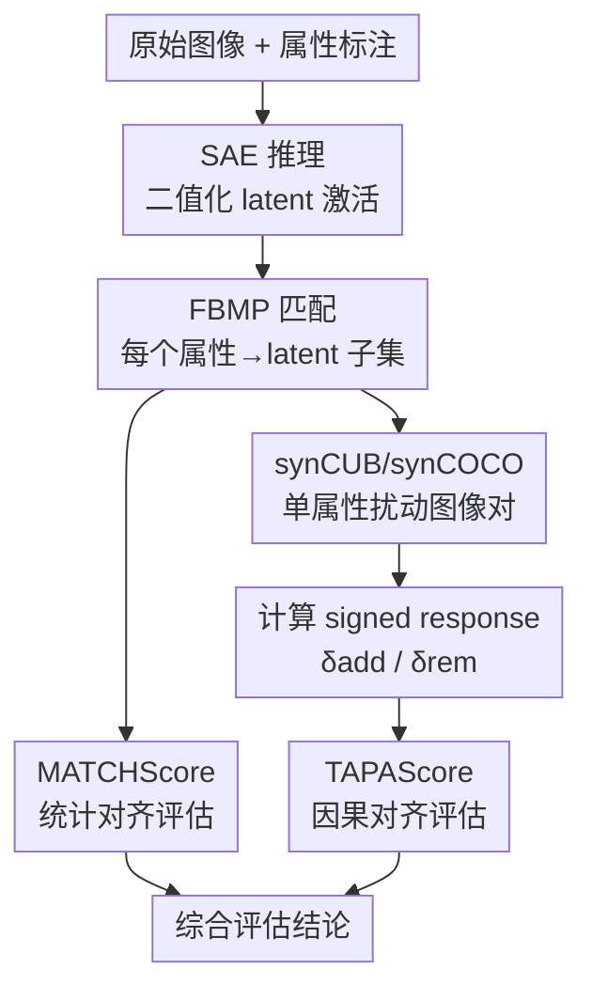

# Evaluating the Interpretability of Sparse Autoencoders with Concept Annotations

**会议**: ECCV 2026  
**arXiv**: [2606.24716](https://arxiv.org/abs/2606.24716)  
**代码**: [https://github.com/JonasKlotz/sae-concept-eval](https://github.com/JonasKlotz/sae-concept-eval) (有)  
**领域**: 可解释性 / 自监督表示学习  
**关键词**: 稀疏自编码器, 可解释性评估, 概念匹配, 因果验证, 特征解耦

## 一句话总结
本文提出一套基于人类概念标注的 SAE 可解释性评估框架，包含支持多对一匹配的 FBMP 算法和基于目标属性扰动的 TAPAScore 因果验证指标，并构建了 synCUB/synCOCO 两个合成扰动数据集；实验表明现有自动评估指标（FMS、MS、CKNNA）无法通过健全性检验，而本文的匹配指标和 TAPAScore 能可靠区分训练/未训练 SAE，且过完备度增加反而会降低扰动对齐质量。

## 研究背景与动机

**领域现状**：稀疏自编码器（SAE）近年来从语言模型可解释性领域迁移到视觉模型中，用于从 CLIP、DINOv2 等视觉编码器的高维表征中提取可解释的稀疏潜在特征，对应物体部件、纹理、属性等概念。目前视觉 SAE 的评估主要依赖结构指标（如重建误差、稀疏度）或定性展示，缺乏对「SAE 学到的特征是否真的对应人类可理解概念」的系统衡量。

**现有痛点**：SAE 已知存在三种系统性的失效模式——特征分裂（单个概念被碎片化到多个 latent）、特征吸收（通用特征被专用 latent 覆盖而产生盲区）、特征组合（共现概念被合并到同一 latent）。这些模式意味着，仅凭架构设计或重建质量并不能保证 SAE 特征与人类认知概念对齐。更关键的是，现有评估指标要么是结构性的（不直接衡量语义对应），要么需要人工定性检查（不可规模化）。语言模型领域的功能评估依赖可控干预实验，但在视觉中，隔离单一属性变化的 counterfactual 数据极其稀缺。

**核心矛盾**：评估 SAE 可解释性的金标准是人类判断，但大规模人类实验不可行；替代方案需要「人类概念标注 + 可控干预」的双重验证，而视觉领域既缺乏带密集属性标注的干预基准，也缺乏能处理特征分裂的多对一匹配方法。

**本文目标**：(1) 设计能处理多对一映射的 latent-概念匹配指标；(2) 构建隔离单一属性变化的合成图像数据集以支持干预式评估；(3) 提出因果验证指标，测试匹配到的 latent 在属性扰动下是否按预期方向响应。

**切入角度**：作者从「可解释性 = SAE 特征与人类标注概念的语义对齐程度」这一操作性定义出发，认为评估框架必须同时具备统计对齐（latent 激活模式与标注一致）和因果对齐（改变属性时 latent 按预期响应）两个维度，且两者不可互相替代。

**核心 idea**：用二值化匹配追踪（FBMP）实现多对一 latent-概念对齐，用合成图像对的定向属性扰动（TAPAScore）验证对齐的因果性，构成统计+因果双维度评估框架。

## 方法详解

### 整体框架

本文提出的评估框架包含三个组件，形成「统计匹配 → 因果验证」的评估管线。给定一个在冻结视觉编码器（CLIP 或 DINOv2）特征上训练好的 SAE，首先将 SAE 的 latent 激活二值化（激活 >0 置 1，否则 0），然后使用 FBMP 算法为每个人工标注属性匹配一个 latent 子集（联盟），计算 MATCHScore 衡量统计对齐质量；接着在 synCUB 或 synCOCO 合成数据集上，对仅改变一个属性的图像对计算 TAPAScore，检验匹配到的 latent 是否对目标属性扰动做出选择性和方向正确的响应。整个框架不依赖用户研究，所有指标均可自动计算。

### 关键设计

**1. 全二值匹配追踪 (FBMP)：支持多对一的 latent-概念匹配**

针对特征分裂导致单一属性被多个 latent 共同编码的问题，FBMP 将匹配问题建模为二值信号的稀疏重构：以属性的二值标注向量为目标信号，以所有 latent 的二值激活向量为候选原子，通过贪心序列选择逐步构建一个互补的 latent 子集。与标准匹配追踪不同，FBMP 全程在二值域操作——用 $F_\beta$ score（而非内积）选择最匹配当前残差的 latent，用逻辑或（$\lor$）累积已选 latent 的贡献，用逻辑与和非（$\land \lnot$）更新残差（即从目标中移除已覆盖的正例）。每步选择后检查联合 $F_1$ 是否提升，若不再提升则提前终止，避免引入冗余 latent。

为什么二值化？作者刻意舍弃激活幅值信息：如果一个 latent 通过幅值大小编码多个不同概念，这在作者的定义中属于「解耦不充分」，应当被惩罚而非奖励。实验也验证了 FBMP 在同等稀疏度下优于保留幅值的非负正交匹配追踪（NN-OMP）。整体 MATCHScore 定义为所有属性上联合 $F_1$ 的均值，并减去未训练 SAE 的基线分数得到 $\Delta$MATCHScore，以消除字典大小对匹配分数的虚假膨胀效应（更大的字典提供更多候选 latent，随机相关性也会增加）。

**2. TAPAScore：基于目标属性扰动的因果对齐验证**

统计对齐（高 MATCHScore）不等于因果编码：一个 latent 可能因为混淆因素、共现模式或背景线索而与属性标注相关，但并不真正编码该语义属性。TAPAScore 通过干预实验来区分相关与因果：在仅改变一个属性的图像对 $(\mathbf{x}, \hat{\mathbf{x}})$ 上，检查匹配到该属性的 latent 子集是否按正确方向响应。对于被添加的属性，其匹配的 latent 应在扰动后激活增强（$\delta_{\text{add}} = \max_{i \in I_{\text{add}}} \hat{\mathbf{z}}^i_{\text{bin}} - \max_{i \in I_{\text{add}}} \mathbf{z}^i_{\text{bin}}$，期望为正）；对于被移除的属性，对应 latent 应激活减弱（$\delta_{\text{rem}}$，期望为负）。最终 TAPAScore 定义为：

$$\text{TAPAScore} = \Delta_{\text{add}} - \Delta_{\text{rem}} = \frac{1}{P}\sum_p \delta_{\text{add}}^{(p)} - \frac{1}{P}\sum_p \delta_{\text{rem}}^{(p)}$$

TAPAScore 为正说明匹配到的 latent 在属性扰动下做出了方向正确的选择性响应。作者额外计算了 $\Delta$stay 指标（未扰动属性的 latent 漂移量），验证 TAPAScore 的高值并非来自 latent 的无差别漂移（synCUB 上 $\Delta$stay = 0.21，synCOCO 上 0.12，均很低）。

**3. 合成扰动数据集 synCUB 和 synCOCO：仅改变单一属性的图像对**

TAPAScore 的前提是存在仅改变一个语义属性、其他因素完全不变的图像对，这在自然图像中几乎不存在。作者用 Flux2 图像编辑模型生成了两个合成基准：synCUB 针对细粒度属性扰动，从 CUB-200-2011 的 33 类子集和 45 个属性概念出发，对每张基图用一张参考图引导目标属性的编辑（如将腹部花纹从纯色改为条纹），且保持身份、姿态、背景不变；synCOCO 针对物体移除，从 MS-COCO 中选取目标物体（优先选择实例数最少的物体，同等时选面积最大的），用固定提示词指示 Flux2 移除该物体而保留其余场景。生成后经 ResNet-50 分类器自动验证和人工逐张审核筛选，最终 synCUB 保留 2933 对（来自 3063 对生成），synCOCO 保留 2534 对（来自 9000 对生成），覆盖 79/80 个 COCO 类别和 43 个 CUB 属性。

### 一个完整示例

以 CUB 属性 "has breast pattern: striped"（胸部花纹：条纹）为例走通完整评估管线。首先，在 CUB 训练集的 312 个属性标注矩阵和 SAE 二值激活矩阵上运行 FBMP：首轮在所有 latent 中选出 $F_{0.5}$ 与目标属性最匹配的 latent A（可能对应「条纹纹理」），在残差上第二轮选出 latent B（可能对应「胸部区域」），两轮后联合 $F_1$ 不再提升，终止，得到 coalition $\mathcal{S} = \{A, B\}$，匹配 $F_1$ 为 0.72。然后在 synCUB 中取一对基图/编辑图（基图中鸟的胸部为纯色，编辑后改为条纹且其余属性不变），计算 $\delta_{\text{add}}$：基图中 latent A 激活 0、B 激活 0，编辑图中 A 激活 1、B 激活 1，$\delta_{\text{add}} = 1 - 0 = 1$；同时该属性并非从某属性移除而来，$\delta_{\text{rem}}$ 不存在。对所有这类图像对取平均，该属性的 TAPAScore 贡献为正。最终全属性平均的 TAPAScore 越高，说明 SAE 的特征不仅统计上与标注对齐，而且在因果意义上确实编码了对应语义。

### 损失函数 / 训练策略

SAE 在冻结的 CLIP ViT-L/14 和 DINOv2 ViT-S/14 特征上训练，使用 CUB 和 COCO 训练集的全量数据。比较了四种 SAE 变体：TopK、BatchTopK、Matryoshka 和 JumpReLU，字典大小覆盖 {128, 256, 512, 1024, 2048, 4096}。TopK 类变体固定 K=32（约等于 CUB 属性的平均出现频率），使用 L2 重建损失 + L1 稀疏惩罚 + 辅助损失（激活死 latent 来建模残差）；JumpReLU 使用可学习的逐 latent 阈值 + L0 稀疏惩罚（$\lambda=0.001$）；Matryoshka 对嵌套中间重建取平均作为重建损失。所有 SAE 用 Adam 优化器训练 50 epoch，学习率 $5\times10^{-4}$。

## 实验关键数据

### 主实验

**健全性检验（Sanity Check）** 是本文实验的基础环节，测试各指标能否区分训练好的 SAE、未训练 SAE 和随机激活。结果汇总如下（CUB + CLIP，聚合所有字典大小和 SAE 变体）：

| 评估指标 | 训练好的 SAE | 未训练 SAE | 随机激活 | 通过检验？ |
|----------|-------------|-----------|---------|-----------|
| MATCHScore (FBMP F1, k=3) | 高（~0.35-0.50） | 明显下降 | 明显下降 | 是 |
| MATCHScore (F1, k=1) | 中 | 明显下降 | 明显下降 | 是 |
| TAPAScore | 正（~0.10-0.25） | 接近零 | 接近零 | 是 |
| FMS | 中等 | 无明显变化 | 无明显变化 | 否（CUB 上） |
| MS | 中等 | 无明显变化 | 无明显变化 | 否 |
| CKNNA | 中等 | 反而升高 | 下降 | 否 |

只有本文提出的匹配指标和 TAPAScore 能可靠区分三种条件，FMS 仅在 COCO 上通过，MS 和 CKNNA 完全失败。CKNNA 在未训练 SAE 上甚至出现反直觉的上升，说明结构保持类指标无法衡量语义对齐。

**CUB 和 COCO 上的匹配与扰动对齐结果**（CLIP 骨干，取各 SAE 变体的最佳字典大小）：

| 数据集 | SAE 变体 | $\Delta$MATCHScore (FBMP F0.5) | TAPAScore (FBMP F0.5) | 最佳字典大小 |
|--------|---------|-------------------------------|----------------------|-------------|
| CUB | BatchTopK | 最高（~0.45） | 与匹配趋势一致 | 512 |
| CUB | Matryoshka | 次高（~0.40） | 与匹配趋势一致 | 256 |
| CUB | TopK | ~0.50（最大字典时） | 大字典时急剧下降 | 匹配 2048 / 扰动 128-256 |
| CUB | JumpReLU | 稳定上升至 4096 | 除 one-to-one 外稳定 | 4096 |
| COCO | BatchTopK | ~0.65 | 大字典时下降 | 512-1024 |
| COCO | TopK | ~0.70（大字典） | 大字典时下降 | 匹配 2048 / 扰动 256-512 |
| COCO | JumpReLU | ~0.55（2048+） | 仅 4096 时下降 | 2048 |
| COCO | Matryoshka | 整体较低 | 2048 时达峰值 | 2048 |

核心发现：匹配分数和 TAPAScore 在中等字典大小时总体正相关，但 TopK 在 CUB 上出现了明显的分离——大字典下匹配分数继续上升而 TAPAScore 急剧下降，说明过完备度可以提高统计匹配但不能保证因果有效性。线性探针上界（灰虚线）在所有设置下都远高于 SAE 匹配分数，说明 SAE 仅恢复了嵌入中属性信息的一部分。

### 消融实验

**匹配策略对比**（FBMP 变体 vs. 一对一，聚合所有字典大小和 SAE 变体，CLIP 骨干）：

| 匹配策略 | CUB $\Delta$MATCHScore | synCUB TAPAScore | COCO $\Delta$MATCHScore | synCOCO TAPAScore | 推荐？ |
|---------|----------------------|-------------------|------------------------|--------------------|-------|
| F1 one-to-one (k=1) | 最低 | 大字典时下降明显 | 最低 | 负相关 | 否 |
| FBMP F1 (k=3) | 中 | 中 | 中 | 弱正相关 | 可 |
| FBMP F0.5 (k=3) | 最高 | 最高 | 最高 | 最高 | 是 |
| FBMP F0.25 (k=3) | 中高 | 中高 | 中高 | 中高 | 可 |

FBMP F0.5 在所有设置下均取得最优或接近最优的匹配分数和 TAPAScore，被推荐为默认匹配策略。$F_{0.5}$ 偏向精确率而非召回率，这与多 latent 联盟的设计逻辑一致——单一 latent 不需要高召回率，因为联盟会组合多个 latent 来覆盖完整属性。

**稀疏度 K 的影响**（TopK SAE, CLIP, d=1024）：

| K 值 | CUB $\Delta$MATCHScore | synCUB TAPAScore | COCO $\Delta$MATCHScore | synCOCO TAPAScore |
|------|----------------------|-------------------|------------------------|--------------------|
| 8 | 中 | FBMP F0.25 最高 | 中 | 中 |
| 16 | 最高 | 最高 | 高 | 高 |
| 32 | 最高 | 高 | 高 | 最高 |
| 64 | 下降明显 | 下降 | 稳定 | 下降 |
| 128 | 大幅下降 | 低且波动 | 下降 | 大幅下降 |

中等稀疏度（K=16 或 32）在统计和因果对齐之间取得最佳平衡，验证了全文默认 K=32 的合理性。过度活跃的 latent 集合（K 过大）同样会损害概念对齐质量。

### 关键发现
- FBMP 对匹配质量的提升在字典较小时尤为显著，因为候选 latent 有限时更需要互补联盟而非单一 latent 来完整覆盖属性。
- TopK SAE 在 CUB 上呈现出最明显的「匹配-TAPAScore 背离」：统计匹配随字典增大而改善，但因果对齐在大字典时崩溃，说明大字典的 TopK SAE 学到了更多「虚假相关」而非真正的语义编码。JumpReLU 和 Matryoshka 的这种背离较轻。
- CUB 上的匹配分数整体低于 COCO，原因是 CUB 的属性更细粒度（312 个 vs COCO 的 80 个物体类别），细粒度属性（如区分上体/下体颜色）对 SAE 构成更大挑战。
- 作者验证了 TAPAScore 不受 latent 无差别漂移的影响：未扰动属性的 $\Delta$stay 在所有 SAE 变体上均保持低位（synCUB 上 0.21，synCOCO 上 0.12）。

## 亮点与洞察
- **FBMP 的二值化设计是一个有理论自觉的选择**：作者明确论证了舍弃幅值信息的理由——如果一个 latent 通过幅值大小来编码多个概念（即 polysemanticity 的一种形式），这本身就是解耦不充分的证据，评估指标应当惩罚而非奖励这种行为。这种从「什么算好的可解释性」的定义出发反推指标设计的思路值得借鉴。
- **统计+因果双维度评估的设计范式**：单独看 MATCHScore 容易高估可解释性（TopK 大字典时匹配分数高但 TAPAScore 低），单独看 TAPAScore 又依赖良好的匹配质量。两者结合才能全面地暴露 SAE 在不同配置下的真实表现，这比单一指标评估更为可靠。
- **Flux2 做可控属性编辑构建评估基准**：相比之前用拼贴合成简单场景的做法（如 Fel et al. 的 Soft Identifiability Benchmark），用扩散模型做细粒度编辑能生成更自然、更接近真实分布的测试样本，且保留了背景、姿态、身份等全部混杂因素不变。这个思路可以迁移到其他需要 counterfactual 评估的视觉任务。

## 局限与展望
- **框架受限于标注质量和粒度**：MATCHScore 和 TAPAScore 都依赖人工属性标注，标注中不存在的概念无法被匹配，标注噪声会降低评估可靠性（如 CUB 中上体/下体颜色的空间精细标注与 SAE 学到的全局颜色表征不匹配）。作者提出的未来方向是用 VLM 自动生成属性词汇表来减少对人工标注的依赖。
- **synCUB/synCOCO 的规模和多样性有限**：synCUB 仅覆盖 33 类鸟和 43 个属性，synCOCO 虽覆盖 79 个类别但每类平均只有约 32 对，且仅支持移除操作（添加物体在复杂场景中导致不真实图像）。扩展到更多类别和属性类型（如材质、光照、视角）是自然的改进方向。
- **TAPAScore 只检验方向正确性，不检验程度合理性**：目前只检查 latent 是否在正确方向上有响应（激活/抑制），但不检验响应的大小是否与属性变化的程度成比例。引入连续值版本的 TAPAScore 可能提供更细粒度的因果评估。
- **DINOv2 骨干上的结果模式与 CLIP 不同**：DINOv2 下过完备度对 TAPAScore 的负面影响比 CLIP 更轻，说明骨干模型的选择对 SAE 可解释性有显著影响，这一因素在本文中未被深入分析。

## 相关工作与启发
- **vs Bricken et al. (Towards Monosemanticity)**：LLM 领域 SAE 的开创性工作，提出了用 SAE 解耦叠加表征的基本框架，但评估主要靠人工检查 latent 激活的 top 图像/文本。本文将其评估方法论从定性推进到定量，且专门解决了视觉领域缺乏干预基准的瓶颈。
- **vs Fel et al. (Archetypal SAE)**：提出用拼贴合成图像做 SAE 可辨识性评估（Soft Identifiability Benchmark），是视觉 SAE 评估的先行工作。但其合成场景缺乏视觉丰富性，且使用离散物体拼贴而非连续属性编辑，限制了评估的真实性。本文的 synCUB/synCOCO 用扩散模型生成更自然的 counterfactual 样本。
- **vs Pach et al. (MS Score)**：提出 MS（MonoSemanticity）分数衡量 latent 的语义一致性，计算方式为激活加权图像相似度。本文的健全性检验显示 MS 无法区分训练/未训练 SAE，说明激活一致性不等于概念可解释性——一个未训练的随机 latent 也可能对语义相似的输入产生一致的激活。
- **vs SUB Benchmark (Bader et al.)**：SUB 从 CUB 中构造概念替换样本但跨类实例配对，不适合图像级别的干预实验。本文的 synCUB 在同一只鸟上做属性编辑，更适用于 paired input 的干预评估。
- **vs Härle et al. (FMS)**：FMS 训练预测器将 latent 关联到语义属性，在 COCO 上通过健全性检验但在 CUB 上失败，说明其有效性依赖于概念集的粒度和复杂度。

## 评分
- 新颖性: ⭐⭐⭐⭐ 将 LLM 领域 SAE 评估中「统计对齐+因果验证」的双维度范式系统性地移植到视觉领域，FBMP 的二值化匹配追踪和 TAPAScore 的扰动对齐设计均有原创性，合成数据集填补了视觉 SAE 干预评估的空白。
- 实验充分度: ⭐⭐⭐⭐⭐ 比较了 4 种 SAE 变体、6 个字典大小、4 种匹配策略、2 个骨干模型、2 个数据集及其合成版本，加上健全性检验、$\Delta$stay 泄漏验证、稀疏度敏感性分析和 NN-OMP 对比，实验设计全面且结论扎实。
- 写作质量: ⭐⭐⭐⭐ 问题动机阐述清晰，「特征分裂/吸收/组合」三种失效模式的命名和分类有助于读者建立直觉；Figure 1 的全景图对理解三个组件的关系很有帮助。附录提供了匹配过程的完整伪代码和可视化。
- 价值: ⭐⭐⭐⭐ 为视觉 SAE 社区提供了一套可复用的标准化评估协议（推荐 FBMP F0.5 + TAPAScore 作为默认配置），实践指导明确（中等字典大小+中等稀疏度是最佳平衡点），且 synCUB/synCOCO 作为公开数据集可供后续工作直接使用。

<!-- RELATED:START -->

## 相关论文

- [\[ICLR 2026\] Temporal Sparse Autoencoders: Leveraging the Sequential Nature of Language for Interpretability](../../ICLR2026/interpretability/temporal_sparse_autoencoders_leveraging_the_sequential_nature_of_language_for_in.md)
- [\[ICML 2026\] Ensembling Sparse Autoencoders](../../ICML2026/interpretability/ensembling_sparse_autoencoders.md)
- [\[ICML 2026\] Sparse Autoencoders are Topic Models](../../ICML2026/interpretability/sparse_autoencoders_are_topic_models.md)
- [\[ICLR 2026\] Evaluating SAE Interpretability Without Generating Explanations](../../ICLR2026/interpretability/evaluating_sae_interpretability_without_generating_explanations.md)
- [\[ICLR 2026\] The Price of Amortized inference in Sparse Autoencoders](../../ICLR2026/interpretability/the_price_of_amortized_inference_in_sparse_autoencoders.md)

<!-- RELATED:END -->
