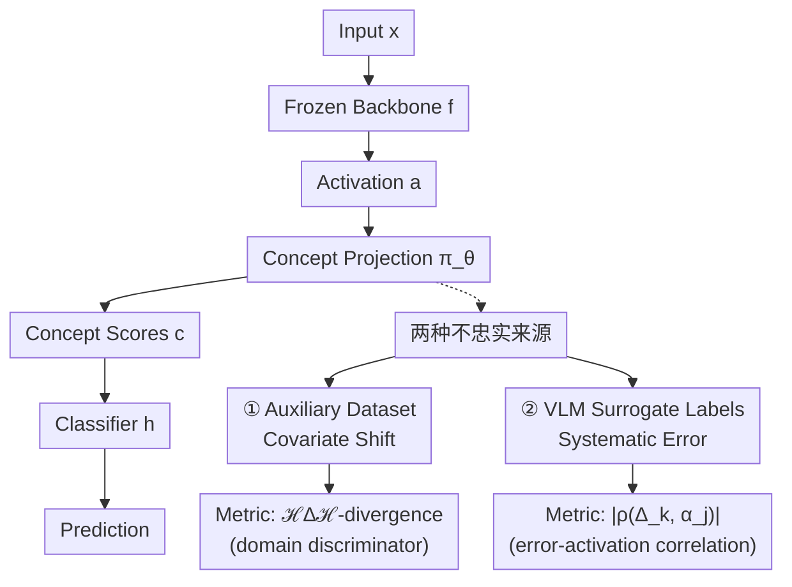

# On the Faithfulness of Post-Hoc Concept Bottleneck Models

**会议**: ECCV 2026  
**arXiv**: [2606.30498](https://arxiv.org/abs/2606.30498)  
**项目页**: [https://posthoc-cbm-faithfulness.github.io/](https://posthoc-cbm-faithfulness.github.io/)  
**领域**: 可解释性 / 概念瓶颈模型  
**关键词**: 事后概念瓶颈模型, 概念忠实性, 协变量偏移, 代理标签噪声, 可解释AI

## 一句话总结
这篇论文系统分析了 post-hoc CBM 中概念投影（concept projection）的忠实性（faithfulness）问题，证明了分类器准确率不能作为瓶颈层质量的代理指标（随机投影也能达到竞争性能），识别出两个导致不忠实的根本原因——辅助数据集的协变量偏移和 VLM 代理标签的系统性错误——并提出了对应的诊断指标（$\mathcal{H}\Delta\mathcal{H}$-散度 和 误差-激活相关性）。

## 研究背景与动机

**领域现状**：Post-hoc CBM 冻结预训练骨干，在特征空间插入概念瓶颈层来实现可解释分类。为回避目标域概念标注的缺失，两类主流方案是：(1) 在辅助概念数据集（如 Broden）上训练概念投影 $\pi_\theta$；(2) 用 VLM（CLIP/DINO/Grounding DINO）生成代理概念标签。

**现有痛点**：领域内普遍用下游分类准确率来评估 post-hoc CBM 的好坏。但已有工作（Midavaine et al., Makonnen et al.）发现随机概念投影也能达到高准确率——这暗示准确率不反映概念瓶颈是否真正学到了有意义的语义概念。

**核心矛盾**：如果分类器 $h$ 足够复杂（如 MLP），它可以学会从随机投影中重构原始特征再分类——本质上是信息泄漏的一种形式，但发生在上游的 $\pi_\theta$ 不忠实时。这意味着"高准确率 = 好概念"的假设可能是完全错误的，但缺乏系统的忠实性分析框架。

**本文目标**：(1) 证明随机投影可达到竞争性能的理论基础（流形 JL 引理 + 线性重构构造）；(2) 识别并形式化 post-hoc CBM 中两种不忠实来源；(3) 提出不依赖真值概念标注的忠实性诊断指标。

**切入角度**：将"忠实性"形式化为 $\pi_\theta$ 能否最小化真实任务分布上的期望风险 $\mathbb{E}_{P_{\text{task}}}[\mathcal{L}(\pi_\theta(f(x)), c)]$，然后分析两种分布失配如何违反该定义。

**核心 idea**：辅助数据集的 covariate shift 通过 $\mathcal{H}\Delta\mathcal{H}$-散度上界可量化；VLM 代理标签的不忠实并非来自噪声大小，而是来自噪声与骨干特征的系统性相关性。

## 方法详解

### 整体框架

论文的分析框架分三步：首先通过随机投影实验 + 线性重构构造（基于 Moore-Penrose 伪逆）证明下游准确率不反映概念忠实性；然后分析训练 $\pi_\theta$ 时的两种分布失配；最后提出对应的诊断指标。

### 关键设计

**1. 随机投影能达到竞争性能的构造性证明**

在三个假设下（激活位于 $m$ 维线性子空间 $\mathcal{S}$、骨干分类器 $g$ 为线性、$\pi_\theta$ 为随机高斯投影），论文构造了一个分类器 $h(c) = g(U(PU)^\dagger \sigma^{-1}(c))$，利用 Moore-Penrose 伪逆 $(PU)^\dagger$ 从随机投影 $c$ 中精确重构原始激活 $a$，再喂给原分类器 $g$。在更一般的流形假设下，流形 JL 引理保证 $K$ 不需要接近 $d$ 即可保持几何结构。这意味着只要 $h$ 有足够容量，它就能"看穿"随机投影——准确率不反映概念质量。

**2. 辅助数据集的 Covariate Shift：$\mathcal{H}\Delta\mathcal{H}$-散度上界**

当 $\pi_\theta$ 在辅助分布 $P_{\text{aux}}$ 上训练而在目标分布 $P_{\text{task}}$ 上应用时，从域适应理论（Ben-David et al.）可导出上界：

$$J_{\text{task}}(\theta; L_1) \leq J_{\text{aux}}(\theta; L_1) + \frac{1}{2}\hat{d}_{\mathcal{H}\Delta\mathcal{H}}(\mathbb{X}_{\text{task}}, \mathbb{X}_{\text{aux}}) + \Omega + \lambda_{\text{ideal}}$$

在 covariate shift 假设下（概念语义跨域不变，仅输入边缘分布变化），$\lambda_{\text{ideal}}$ 可忽略。$\hat{d}_{\mathcal{H}\Delta\mathcal{H}}$ 可由域判别器的分类误差近似估计——**无需目标域真值概念标注**即可计算。

**3. VLM 代理标签的系统性错误：误差-激活正交条件**

将 $\pi_\theta$ 建模为多变量 GLM，推导出在代理标签最优参数 $\tilde{\theta}$ 处的真实目标梯度正比于：

$$\nabla J^*_{\text{task}}(\tilde{\theta}; \mathcal{L}) \propto \mathbb{E}_{P_{\text{task}}}[(\tilde{c}(x) - c^*(x)) \otimes f(x)]$$

这意味着即使代理标签有误差，只要误差 $\delta(x) = \tilde{c}(x) - c^*(x)$ 与骨干激活 $f(x)$ 在期望上**正交**（即随机噪声），梯度仍为零——模型仍是忠实的。但系统性错误（如 VLM 总在检测到"水"纹理时预测"船"概念）会产生非正交误差分量，导致不忠实。提出的指标是代理误差 $\mathbf{\Delta}_k$ 与激活 $\boldsymbol{\alpha}_j$ 之间的绝对 Pearson 相关系数 $|\rho_{k,j}|$。

## 实验关键数据

### Elements 数据集上的忠实性 vs. 性能对比

| 方法 | 训练域 | sim∢↑ | Acc Paux↑ | Acc Ptask↑ | Acc h↑ | Acc h*↑ |
|------|--------|--------|-----------|-----------|--------|---------|
| PCBM | Ptask | 0.96 | 1.00 | 1.00 | 1.00 | 1.00 |
| PCBM | Pnear∀ | 0.97 | 1.00 | 0.70 | 1.00 | 0.99 |
| PCBM | Pnear∃ | 0.57 | 0.82 | 0.89 | 1.00 | 0.85 |
| PCBM | **POOD** | **0.47** | **0.98** | **0.77** | **1.00** | **0.21** |
| LFCBM | 25%随机噪声 | 0.02 | 0.75 | 0.98 | 1.00 | 0.98 |
| LFCBM | CLIP | 0.05 | 0.79 | 0.56 | 0.99 | 0.54 |
| VLG-CBM | Grounding DINO | 0.02 | 0.74 | 0.85 | 1.00 | 0.04 |

**关键发现**：
- $h$（可学习分类器）对所有方法都接近完美——**准确率完全不反映概念忠实性**。
- $h^*$（使用真值概念→类别的 oracle 规则）揭示了真实差距：POOD 下降到 21%，VLG-CBM 仅略高于随机（1/36≈0.028）。
- 25% 随机标签噪声几乎不影响忠实性（$h^*$=0.98）——验证了"随机噪声正交、系统性错误才致命"的理论预测。

### Covariate Shift 的 $\hat{d}_{\mathcal{H}\Delta\mathcal{H}}$ 诊断

$\hat{d}_{\mathcal{H}\Delta\mathcal{H}}$ 估计值与实际跨域泛化误差的相关系数 >0.9。OOD 域产生最大的散度和最高的泛化误差；近域（Pnear）的散度显著更低。这证明了 $\hat{d}_{\mathcal{H}\Delta\mathcal{H}}$ 是一个有效的、无需真值概念标注的忠实性代理指标。

### 代理标签误差的系统性分析

随机噪声的误差-激活相关性接近于零（$|\rho| \approx 0$），而 CLIP/DINO/Grounding DINO 代理标签产生了显著的非零相关性。这直接将系统性错误与不忠实的 $\pi_\theta$ 联系起来。

## 亮点与洞察

- **随机投影+伪逆重构的构造性证明极其有力**：它用一个具体的、可操作的构造（不依赖渐进分析）证明了"准确率 ≠ 忠实性"——这比仅展示经验结果有更强的说服力。
- **误差正交条件是一个优雅的理论洞察**：它揭示了代理标签噪声的"结构"比"大小"更重要——25% 随机噪声比 15% 系统性噪声危害更小。这对选择 VLM 做代理标注有直接指导意义。
- **$\hat{d}_{\mathcal{H}\Delta\mathcal{H}}$ 是实践者友好指标**：无需目标域真值概念标注即可计算——只需训练一个小域判别器。这解决了"没有 ground truth 概念怎么评估忠实性"的鸡生蛋问题。
- **Oracle classifier $h^*$ 是评估 post-hoc CBM 的必要组件**：本文明确展示了 $h$ 和 $h^*$ 之间的巨大差距，建议后续 post-hoc CBM 工作应同时报告两者。

## 局限与展望

- 线性子空间和线性骨干的假设在真实深度网络中仅近似成立；非线性情况下的重构结论更强但更难证明。
- $\hat{d}_{\mathcal{H}\Delta\mathcal{H}}$ 估计依赖域判别器的质量，高维激活空间中的判别器训练本身有挑战。
- 误差-激活相关性指标需要真值概念标签——不适用于无标注场景。
- 仅分析了两类 post-hoc CBM（PCBM + LFCBM + VLG-CBM），其他变体（如概念嵌入模型 CEM）未被覆盖。

## 相关工作与启发

- **vs Makonnen et al. (2025)**：他们用经典 JL 引理说明随机投影保持距离，本文用流形 JL 引理将结论从有限集推广到整个激活流形，并给出线性重构的构造性证明。
- **vs Schoen et al. (2025)**：他们连接 JL 与信息泄漏，本文进一步证明即使无泄漏，概念投影本身也可能不忠实。
- **vs Huang et al. (2024)**：他们通过匹配输入区域与概念来评估忠实性，本文的误差-激活相关性提供了一种更直接的数学度量。

## 评分
- 新颖性: ⭐⭐⭐⭐⭐ (首次系统性地形式化 post-hoc CBM 的忠实性问题，理论深度令人印象深刻)
- 实验充分度: ⭐⭐⭐⭐ (Elements+CUB+CIFAR 三维度验证，但真值概念仅在 Elements 上可用)
- 写作质量: ⭐⭐⭐⭐⭐ (论证链条清晰，从"准确率不够" → "为什么不够"→"两种不忠实机制"→"诊断指标"一气呵成)
- 价值: ⭐⭐⭐⭐⭐ (对 post-hoc CBM 领域的评估实践有直接指导意义，提出的诊断指标可立即被社区采用)

<!-- RELATED:START -->

## 相关论文

- [\[AAAI 2026\] Concepts from Representations: Post-hoc Concept Bottleneck Models via Sparse Decomposition of Visual Representations](../../AAAI2026/interpretability/concepts_from_representations_post-hoc_concept_bottleneck_models_via_sparse_deco.md)
- [\[ICLR 2026\] There Was Never a Bottleneck in Concept Bottleneck Models](../../ICLR2026/interpretability/there_was_never_a_bottleneck_in_concept_bottleneck_models.md)
- [\[AAAI 2026\] Partially Shared Concept Bottleneck Models](../../AAAI2026/interpretability/partially_shared_concept_bottleneck_models.md)
- [\[CVPR 2026\] Measuring the (Un)Faithfulness of Concept-Based Explanations](../../CVPR2026/interpretability/measuring_the_unfaithfulness_of_concept-based_explanations.md)
- [\[CVPR 2026\] Rethinking Concept Bottleneck Models: From Pitfalls to Solutions](../../CVPR2026/interpretability/rethinking_concept_bottleneck_models_from_pitfalls_to_solutions.md)

<!-- RELATED:END -->
