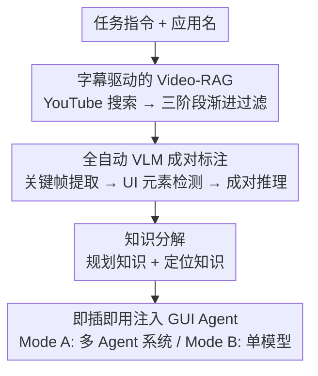

# GUIDE: Resolving Domain Bias in GUI Agents through Real-Time Web Video Retrieval and Plug-and-Play Annotation

**会议**: ECCV 2026  
**arXiv**: [2603.26266](https://arxiv.org/abs/2603.26266)  
**论文**: [Project Page](https://sharryXR.github.io/GUIDE/)  
**代码**: [https://github.com/sharryXR/GUIDE](https://github.com/sharryXR/GUIDE) (有)  
**领域**: LLM Agent / 多模态VLM  
**关键词**: GUI Agent, 领域偏置, Video-RAG, 即插即用, 网络视频检索

## 一句话总结
GUIDE 是一个免训练、即插即用的框架，通过从 YouTube 教程视频中自动检索并提取领域专用的规划知识（Planning）和定位知识（Grounding），注入 GUI Agent 的对应模块来消除领域偏置（domain bias），在 OSWorld 上为三种不同架构的 agent 带来 +4.47 到 +7.48 个百分点的提升。

## 研究背景与动机

**领域现状**：当前主流 GUI Agent 基于大规模视觉语言模型（VLM），能通过截图感知和自然语言推理自主操作桌面、网页和移动应用，在通用界面理解和指令跟随上表现出色。

**现有痛点**：面对特定软件的真实任务时，这些 agent 暴露出的核心问题是领域偏置（domain bias），具体表现为两个层面：（1）规划级偏置——agent 不熟悉特定应用的操作流程，不知道正确的操作步骤、先后顺序、该进哪个菜单和面板；（2）定位级偏置——agent 不熟悉特定应用的 UI 布局和控件风格，找不到任务相关的可交互元素。例如，agent 知道"调整图片亮度"这个语义，但不知道在 GIMP 中应该走 Colors -> Brightness-Contrast 而非 Image -> Adjustments 菜单，也不知道亮度滑块在对话框里的具体位置。

**核心矛盾**：这个偏置的本质不是模型能力不足，而是通用能力与领域任务需求之间的对齐鸿沟（alignment gap）——模型不缺能力，缺的是领域知识。传统解决方案如人工标注数据集、写专家规则或领域微调，成本高、覆盖窄，且无法跟上软件界面持续迭代的节奏。

**本文目标**：让 GUI Agent 具备自主从互联网上海量 GUI 教程视频中学习领域知识的能力，弥合通用模型能力与领域任务熟练度之间的差距，且整个过程无需人工标注或模型微调。

**切入角度**：作者观察到 YouTube 上存在大量 GUI 操作教程视频，其字幕（含自动生成字幕）天然包含叙述性的操作步骤、UI 元素名称和任务目的解释，构成视频内容与任务需求之间的文本语义桥梁。基于此，可以用字幕驱动的检索-增强生成（Video-RAG）管线精确定位相关视频，再用 VLM 成对关键帧标注提取可迁移的领域知识。

**核心 idea**：用字幕驱动的 Video-RAG + VLM 成对视频标注，从网络教程视频中自动提取结构化的规划和定位知识，以自然语言形式即插即用地注入任意 GUI Agent，消除领域偏置。

## 方法详解

### 整体框架

GUIDE 是一个多 agent 协作系统，核心目标是对给定任务指令和软件名，从网络视频中自动提取可迁移的领域知识并注入下游 GUI Agent。系统包含三个专职 agent：（1）Retrieval Agent——通过字幕驱动的三阶段渐进式 Video-RAG 管线筛选任务相关教程视频；（2）Annotation Agent——通过全自动 VLM 成对视频标注管线将视频转换为结构化知识；（3）下游 GUI Agent——以即插即用方式接收注入的知识，无需修改模型参数或架构。整个流程是实时在线检索（每个任务实时搜索 YouTube），而非从预构建离线语料库中查找。

### 关键设计

**1. 字幕驱动的 Video-RAG 管线：用字幕内容语义替代标题关键词匹配，实现三阶段渐进式视频检索**

传统 RAG 扩展到视频领域面临三个挑战：视频标题噪声大、候选视频类型混杂（授课 vs 实操）、帧内操作知识语义不透明。GUIDE 的解法是利用字幕（包括 YouTube 自动生成字幕）作为文本语义桥梁——字幕天然包含叙述的操作步骤、UI 元素名称和任务目的说明。

具体流程：给定任务指令，LLM 首先生成搜索友好 query 并去填充词生成简化变体，通过 yt-dlp 搜索 YouTube 获取 50+ 候选 URL，经元数据预过滤（时长 < 3000s、有效标题字符）后，进入三阶段字幕驱动筛选：（1）**字幕辅助领域分类**——下载字幕清洗（去 VTT/SRT 标记、时间戳、HTML、去重、句边界重分段，截断至 10000 字符），联合标题输入 LLM 判断是否为真实 GUI 操作演示（过滤掉理论讲解、评测、娱乐内容）；（2）**字幕驱动主题提取**——对确认的 GUI 教程，LLM 联合标题+字幕提炼 12-30 词的精确主题描述（软件+任务+关键操作），字幕能纠正标题误导（如标题写"Excel Tutorial"但字幕实际演示 LibreOffice Calc）；（3）**主题-标题联合相关性匹配**——以字幕提取的主题为主锚点，构造 "TOPIC (higher priority): {topic}. TITLE: {title}. TOPIC: {topic}" 的双锚定注意力提示，主题在上下文窗口首尾重复出现确保 LLM 优先基于内容语义而非标题噪声打分（0.0-1.0）。最终自适应 Top-K 策略保留得分最高视频，后续候选需 relevance >= 0.5，最多 K=2 个。

该设计的核心价值在于：字幕提供了标题无法提供的内容证据（如"click on the Format menu"明确指示实操），三阶段渐进过滤从 50+ 候选精准缩小至 K<=2 个相关视频，人工评估显示主题提取平均分 0.867、96% 可接受率，远优于标题关键词匹配。

**2. 全自动 VLM 成对视频标注管线：以逆动力学范式从关键帧对中推理操作意图，产出可迁移的自然语言知识**

该管线将检索到的教程视频转换为结构化、跨环境可迁移的知识，遵循逆动力学（inverse dynamics）风格的成对标注范式：给定两个连续界面状态（关键帧），VLM 推断其间可能发生的动作和意图，而无需训练单独的动力学模型。

流程分三个阶段：（a）**感知前端**——Whisper（base 模型）转录音频生成带词级时间戳的 VTT 字幕，MOG2 背景减除算法在字幕时间区间内检测前景像素 >10000 的关键帧，提取每段界面变化的起止帧作为"状态对"；（b）**VLM 成对视频标注**——形式化定义为 $a_t = f_{VPA}(s_t, E_t, s_{t+1}, E_{t+1}, T_{topic}, C_{sub})$，其中 $s_t$/$s_{t+1}$ 是连续关键帧图像，$E_t$/$E_{t+1}$ 是 OmniParser 检测的 UI 元素图（含边界框、类型、文本标签），$T_{topic}$ 是检索阶段提取的视频主题，$C_{sub}$ 是当前时间戳前后的字幕上下文；OmniParser 提供的元素级结构化先验显著增强 VLM 对 UI 的理解，超越纯视觉感知；（c）**知识分解**——每帧标注经 Meaningful 标志过滤（联合 VLM + OmniParser 语义判断剔除 >91% 非 GUI 帧和空闲无操作帧），保留的"Thought & Action NLP"字段以第一人称执行者视角，融合逐步执行推理（不仅"做了什么"还有"为什么"、决策逻辑和上下文判断）、UI 元素视觉描述（颜色、形状、位置、文字标签）和功能推断，以及自然语言形式的接地动作（click、type、scroll 等）。LLM 随后将轨迹分解为两种知识：规划知识（执行流程与规划、关键注意事项、坐标无关抽象）和定位知识（最多 15 个关键交互元素的图标/控件名、外观位置、预测功能）。

该设计的精妙之处在于"可迁移性"：所有标注以自然语言表达，刻意排除绝对坐标，使知识在不同分辨率、布局版本甚至不同操作系统（Linux/Windows）间可迁移——WAA 跨平台实验验证了这一点——同时 Thought & Action 中的战略推理（"为什么这样做"）比单纯的动作序列更有迁移价值。

**3. 即插即用的 Agent 集成：以自然语言参考材料而非指令的形式注入知识，支持多 Agent 和单模型两种架构**

GUIDE 的关键设计原则是 agent 无关性（agent-agnostic）：提取的规划和定位知识完全是自然语言形式，不依赖任何特定 agent 架构。知识被定位为"参考材料"而非"指令"——agent 会对照当前截图验证建议，当教程与目标环境出现偏差（如软件版本差异或 UI 布局不同）时优先信任自身观察，从而提供对领域偏移的鲁棒性。当 K>1 个视频被检索到时，各视频知识独立标注并拼接，提供多视角参考。

Mode A（多 Agent 系统，如 AgentS3）：利用系统原生的分工——规划知识追加到 Worker 的系统提示中作为"Video Planning Reference"章节，与截图和交互历史并列，引导任务分解；定位知识提供给 Grounding Agent 作为每次动作查询的补充上下文，辅助坐标预测。

Mode B（单模型 Agent，如 Qwen3-VL/Seed-1.8）：两种知识统一注入单个系统提示的"External Knowledge"章节。引入结构化的 Thought 模板作为引导式 Chain-of-Thought：模型先评估当前任务与检索到的演示的相似性，再定位自身在工作流中的当前阶段，从规划知识推导下一步子任务，最后将定位知识的元素描述与当前截图匹配后选择动作。当只有单一知识通道可用时，模板能优雅降级为部分 CoT。

### 一个完整示例：GIMP 对比度调整任务

假设任务是在 GIMP 中调整图片对比度。GUIDE 首先用 LLM 生成搜索 query "How to adjust contrast in GIMP"，经 yt-dlp 获取 50+ YouTube 候选，字幕分类过滤掉理论讲解视频，主题提取确认某视频实际演示"调整 GIMP 中亮度-对比度"，相关性匹配得分 0.92。Annotation Agent 提取该视频 30 个关键帧、15 个状态对，VLM 逐对推理标注——例如关键帧对 5→6 显示用户点击 Colors 菜单并选择 Brightness-Contrast，对应的 Thought & Action 描述为"目标是将图片调亮并增加对比度，GIMP 中对比度控制位于 Colors 菜单下而非 Image 菜单……"。知识分解后，规划知识写入执行流程"Colors → Brightness-Contrast → 拖动 Contrast 滑块"，定位知识描述"Contrast 滑块：水平长条，位于 Brightness 滑块下方，标签为 'Contrast'"。注入后，agent 在执行时不再走错 Image 菜单，且能在对话框中精准定位 Contrast 滑块而非误操作 Brightness 滑块——规划解决"做什么"，定位解决"在哪里做"。

## 实验关键数据

### 主实验

OSWorld 基准（361 个任务，10 个应用领域）上，GUIDE 作为即插即用组件在三种 agent 架构上均取得一致且显著的提升。

| Agent | 配置 | 总得分 (%) | 提升 |
|-------|------|-----------|------|
| Seed-1.8 | 无标注 | 37.14 | - |
| Seed-1.8 | +Planning | 43.93 | +6.79 |
| Seed-1.8 | +Plan. & Gnd. | 44.62 | +7.48 |
| Qwen3-VL-8B | 无标注 | 33.90 | - |
| Qwen3-VL-8B | +Planning | 38.93 | +5.03 |
| Qwen3-VL-8B | +Plan. & Gnd. | 39.73 | +5.83 |
| AgentS3 (GPT-5.2+Seed-1.8) | 无标注 | 50.18 | - |
| AgentS3 (GPT-5.2+Seed-1.8) | +Plan. & Gnd. | 54.65 | +4.47 |

跨基准迁移实验（WindowsAgentArena，154 个任务，原生 Windows 环境）：Agents3+GPT-5.2 从 49.00% 提升至 59.21%（+10.21pp），Qwen3-VL-32B 从 31.70% 提升至 44.16%（+12.46pp），证明 GUIDE 的坐标无关知识格式在 Linux → Windows 之间可迁移，并非 OSWorld 特化产物。

双通道分析：Planning 知识单独贡献了主导份额（Seed-1.8 上 +6.79pp，Qwen3-VL-8B 上 +5.03pp，占总提升的 86-91%），确认规划级偏置是主要瓶颈；Grounding 知识提供额外的补充增益（+0.69-0.80pp），在 UI 布局复杂的领域（GIMP +7.69pp，Calc +6.39pp）最强。Grounding 知识在成功任务上减少探索步数（VLC -5.0 步，Calc -3.7 步）。

### 消融实验

**同骨架消融（Qwen3-VL-8B-thinking，361 任务）**：

| 配置 | 总得分 (%) | Δ |
|------|-----------|---|
| 无标注 | 33.90 | +0.00 |
| Watch & Learn 风格原始轨迹 ICL | 31.96 | -1.94 |
| Grounding-only (k=7) | 34.31 | +0.41 |
| +Planning | 38.93 | +5.03 |
| +Plan. & Gnd. (Full GUIDE) | 39.73 | +5.83 |

关键发现：Planning-only 贡献了 86.3% 的完整增益；Grounding-only 仅 +0.41pp，但在已有正确工作流规划之上叠加时能额外贡献 +0.80pp；Watch & Learn 风格的原始轨迹 ICL（使用相同检索视频、相同 GPT-5.1 轨迹源、K=2 demo、每 demo 12 步、24K 字符上限）得分为 31.96，低于无标注基线，说明原始教程轨迹本身不能解释 GUIDE 的增益，有用信号来自结构化的 Planning 和 Grounding 知识转换。

**标注管线组件消融（120 任务均衡子集，Qwen3-VL-8B-thinking，三随机种子平均）**：

| 配置 | 得分 (%) | Δ |
|------|---------|---|
| 无标注 | 40.00 | +0.00 |
| 仅字幕 (Subtitle-only) | 42.32 | +2.32 |
| 无 OmniParser (w/o OP) | 47.52 | +7.52 |
| Full GUIDE | 49.11 | +9.11 |

仅字幕已经能提升 +2.32pp，验证了 ASR 转录文本包含有用的过程性线索；恢复视觉成对标注（无 OmniParser）将增益提升至 +7.52pp，说明相邻帧视觉推理贡献远超纯转录文本；OmniParser 额外贡献 +1.59pp，在 GPT-5.2 强标注器下增益温和，但当标注器较弱时 UI 元素图提供的结构化先验对生成可靠的坐标无关元素描述至关重要。

### 关键发现
- 规划知识是主要驱动力（占总增益 86%+），说明领域偏置的主导瓶颈在规划层面而非定位层面；但定位知识在复杂 UI 领域（GIMP、Calc）有不可替代的补充作用
- 检索视频数 K=2 为最佳精度/上下文权衡：K=1 得分 41.81%，K=2 提升 +2.23pp 至 44.04%，K=3 仅再增加 +0.06pp；更多视频可能引入替代工作流或 UI 变体，对特定任务无益
- 端到端 API 成本约 $0.019/任务（检索）+ $0.252/视频（标注），OSWorld 全基准总共约 $114.6，远低于人工标注和微调管线的成本
- 检索覆盖率 82.8%（361 个任务中 299 个检索到至少一个相关视频），字幕驱动的领域分类精度 100%、召回 90.96%、F1=95.27%
- 在领域偏置最严重的软件上增益最大（Writer +21.74pp，Calc +19.15pp on Seed-1.8）

## 亮点与洞察
- **字幕作为视频语义检索的桥梁**：这个洞察简洁而有效——YouTube 自动字幕天然包含操作叙事的文本模态，将其作为检索锚点替代标题关键词，是 VIDEO-RAG 方向一个可复用的设计思路，解决了视频内容检索中"标题噪声 vs 内容语义"的核心矛盾
- **成对标注 + 逆动力学范式的可迁移知识提取**：不直接预测坐标（这在跨环境场景下不可迁移），而是让 VLM 从相邻帧的变化中推理操作意图并以自然语言描述——"战略推理 + 视觉描述 + 坐标无关动作"的三合一格式，是处理 GUI Agent 跨平台泛化的优雅解法
- **知识作为参考材料而非指令的设计哲学**：允许 agent 在教程与实际环境不一致时优先信任自身观察，提供了对 domain shift 的内建鲁棒性，比强行让 agent 模仿教程更务实
- **Meaningful 过滤器的巧妙之处**：联合 VLM 语义判断和 OmniParser 结构化感知，解决了传统像素级关键帧提取无法区分"界面真正发生变化"和"鼠标移动/窗口闪烁"的问题，有效过滤 >91% 无效帧，显著降低了后续标注噪声
- **可迁移的设计思路**：字幕驱动的视频检索和成对标注管线不仅可以用于 GUI Agent，任何需要从视频中提取过程性知识的领域（如软件操作教学、工业设备操作、医学手术流程）都可以借鉴这个范式

## 局限与展望
- 检索质量是系统的单点故障源：当检索到的视频流程与目标任务不匹配时（如任务要求像素级画质增强，但检索到的视频讲的是打印分辨率 ppi 调节），注入的知识会直接误导 agent 走向死胡同；当检索到的视频格式并非软件实操录屏（而是动画幻灯片或浏览器内操作）时，定位知识描述的 UI 元素在任务环境中完全不存在
- 82.8% 的检索覆盖率意味着仍有 17.2% 的任务无法获得知识注入，对长尾/小众软件或罕见任务，YouTube 上可能缺乏相关教程
- Grounding 知识的增益相对有限（+0.41-0.80pp），在已有强 planner 的场景下边际贡献不大；idle no-action 帧的过滤召回率仅 53.6%，仍有相当比例的无效帧进入标注管线
- 跨软件版本的 UI 布局变化可能导致定位知识失效——论文通过"参考材料而非指令"的策略部分缓解，但未做定量消融
- 改进方向：（1）引入更严格的过程一致性过滤，在语义检索阶段排除工作流与任务目标不一致的视频；（2）增加视频格式分类器，在标注前筛除非实操录屏来源；（3）将单视频标注扩展为多视频交叉验证，减少单一错误视频的误导风险；（4）探索轻量级的在线知识更新机制，在 agent 执行过程中根据实际反馈动态调整注入的知识

## 相关工作与启发
- **vs Watch and Learn [Song et al., 2025]**：两者都从视频中提取 GUI 操作知识，但 W&L 使用离线预构建语料库检索 + 轻量级逆动力学模型（IDM）对每对帧贴标 + 生成 LLM 推理轨迹用于微调或 ICL，GUIDE 则是实时 YouTube 搜索 + VLM 成对标注产出结构化自然语言知识 + 免训练即插即用注入。W&L 风格原始轨迹 ICL 在 OSWorld 上甚至低于无标注基线（-1.94pp），说明 GUIDE 的结构化知识转换是关键区分因素
- **vs RAG-GUI [Xu et al., 2025]**：RAG-GUI 检索网页教程提取生成式指南，GUIDE 则检索视频并通过成对标注提取规划和定位双通道知识，视频中蕴含的视觉操作信息远比纯文本网页丰富
- **vs OS-Symphony [Yang et al., 2026]**：OS-Symphony 按需合成视觉接地教程，GUIDE 则检索真实人工录制的教程视频——后者保留了操作者的真实决策逻辑和领域经验，但也引入了检索噪声的风险
- **vs TongUI [Zhang et al., 2026] / VideoAgentTrek [Lu et al., 2025]**：两者是利用 YouTube 教程大规模合成 GUI 轨迹用于模型微调，GUIDE 是不同的路线——不做微调，而是将视频知识以自然语言形式即插即用注入推理过程，更轻量且能实时适应新任务

## 评分
- 新颖性: ⭐⭐⭐⭐ 用字幕驱动 Video-RAG + VLM 成对标注解决 GUI Agent 领域偏置，问题定义清晰，技术路线"检索-标注-注入"三步走有整体性创新；但单个组件（Video-RAG、逆动力学标注）的思路本身并非全新
- 实验充分度: ⭐⭐⭐⭐⭐ 三种 agent 架构（单模型两个 + 多 Agent 一个）、两个基准（OSWorld + WAA 跨 OS 迁移）、丰富的消融（知识通道分解、标注管线组件、检索视频数、检索方式对比、标注器对比、同骨架 Watch & Learn 对照）、人工评估（检索/标注质量 300 视频三人标注）、完整成本分析，实验设计严密
- 写作质量: ⭐⭐⭐⭐⭐ 问题动机阐述透彻（两个偏置层面的具体例子清晰），方法描述层次分明，实验呈现规范，补充材料详尽（提示模板、失败案例、成本分析、Meaningful 过滤人工评估）
- 价值: ⭐⭐⭐⭐ 提供了一个实用的免训练 GUI Agent 增强方案，检索-标注-注入的框架可迁移到其他需要过程性知识的领域；但检索覆盖率和检索噪声问题在长尾场景下是实际部署的显著障碍

<!-- RELATED:START -->

## 相关论文

- [\[ICLR 2026\] Real-Time Reasoning Agents in Evolving Environments](../../ICLR2026/llm_agent/real-time_reasoning_agents_in_evolving_environments.md)
- [\[CVPR 2026\] BAMI: Training-Free Bias Mitigation in GUI Grounding](../../CVPR2026/llm_agent/bami_training-free_bias_mitigation_in_gui_grounding.md)
- [\[ICLR 2026\] GUI-Shift: Enhancing VLM-Based GUI Agents through Self-supervised Reinforcement Learning](../../ICLR2026/llm_agent/gui-shift_enhancing_vlm-based_gui_agents_through_self-supervised_reinforcement_l.md)
- [\[ICLR 2026\] GTA1: GUI Test-time Scaling Agent](../../ICLR2026/llm_agent/gta1_gui_test-time_scaling_agent.md)
- [\[ACL 2026\] IntrAgent: An LLM Agent for Content-Grounded Information Retrieval through Literature Review](../../ACL2026/llm_agent/intragent_an_llm_agent_for_content-grounded_information_retrieval_through_litera.md)

<!-- RELATED:END -->
