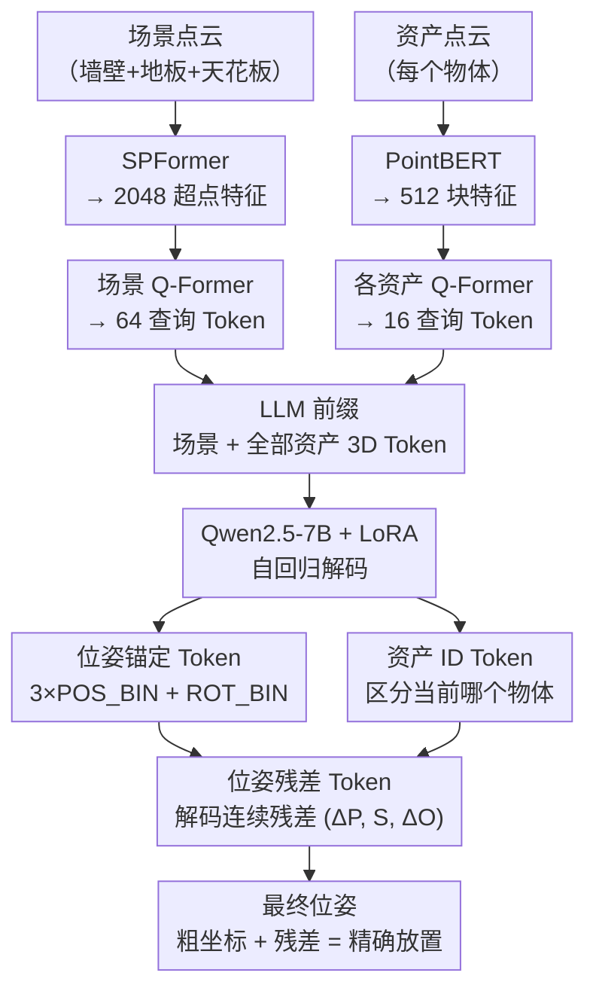

# NaLA: A 3D Native LLM Layout Agent for High-quality 3D Scene Generation

**会议**: ECCV2026  
**arXiv**: [2606.29395](https://arxiv.org/abs/2606.29395)  
**项目页**: https://adamcwan.github.io/NaLA/  
**代码**: 无  
**领域**: LLM Agent  
**关键词**: 3D场景生成, 布局规划, 大语言模型, 点云编码, 粗到细预测

## 一句话总结
NaLA 提出了一种直接编码 3D 点云的大语言模型布局智能体，通过粗到细的位姿预测机制实现高质量、高效率的 3D 场景生成，在物理合理性、语义一致性和美观度上全面超越现有方法。

## 研究背景与动机

3D 场景生成在室内设计、游戏开发和具身智能中有着广泛应用。近年来，LLM 展现出强大的高层推理能力，被用作场景布局智能体——它们能理解复杂指令并生成合理的物体排列。然而，现有 LLM 布局智能体在输入和输出两端都严重依赖文本或图像作为中间媒介：输入侧将 3D 场景边界和资产翻译成文字描述或渲染 2D 图像；输出侧要么把连续坐标拆成离散文本符号（如 "(0,1,0)"），要么推断成对空间关系再由下游优化器求解位姿。

这种"翻译"过程造成了严重的模态差距。输入侧，精细几何细节——凹陷结构、精确支撑面、不规则房间边界——在简化中丢失，LLM 对空间可容纳性的理解不完整。输出侧，把连续坐标表示为离散文本符号破坏了数值完整性，LLM 无法有效推理距离和连续性，产生了大量物理上不合理的放置：物体碰撞、悬浮或超出边界。这种"数值失明"在多物体场景中尤为突出，因为每个物体的位姿都要经过文本化的编码-解码链条。

本文的核心 insight 是：既然问题的根源在于 3D 信息被中间媒介过滤损失，最直接的办法就是让 LLM "原生地"理解 3D 数据。**核心 idea：NaLA 将场景边界和资产物体的点云直接编码为 3D Token 注入 LLM，使模型原生感知精细几何；同时设计粗到细的位姿预测机制，先通过离散锚定 Token 定位粗略区域、再通过连续回归 Token 精修，在避免"数值失明"的同时保持多物体摆放的区分度。**

## 方法详解

### 整体框架

NaLA 是一个端到端的自回归布局生成框架。输入是空旷场景（含墙壁、地板、天花板）的点云和各资产物体的点云，输出是每个物体的位置、缩放和朝向。整个流程分为点云编码、LLM 自回归推理和粗到细位姿解码三个阶段。

### 关键设计

**1. 3D Token 编码：让 LLM 直接"看见"精细几何**

此前的布局智能体将 3D 资产简化为包围盒或文本描述，导致模型无法感知凹陷结构（如能否把物体放进架子内部）或不对称物体的朝向。NaLA 在输入端直接保留精细几何：对于每个资产物体，采样其点云并用 PointBERT 编码为 512 个块特征，每个块特征与对应的绝对 3D 坐标拼接以保留空间位置；对于空旷场景，采样 4096 个点并用 SPFormer 编码为 2048 个超点特征，同样拼接绝对坐标和场景尺度信息。随后使用两个独立的轻量 Q-Former，将场景密集特征压缩为 64 个查询 Token、每个资产压缩为 16 个查询 Token，经 MLP 投影到 LLM 的嵌入空间作为前缀。这使得 LLM 在不丢失几何细节的前提下"看见"完整空间信息，且点云编码器和 LLM 骨干均可冻结，仅训练 Q-Former 和投影适配器——既保留了 3D 感知能力，又不破坏 LLM 的通用语言能力。

**2. 粗到细位姿预测：锚定防混淆、残差保精度**

直接使用 LLM 输出连续位姿面临一个关键矛盾：若像 LISA 那样引入单一特殊 Token 并解码其隐藏状态为连续值，当多个物体共享同一个特殊 Token 时，LLM 会混淆已放置物体和待放置物体的位姿信息，导致严重碰撞。NaLA 用两步走解决该问题。首先，将场景三维空间各维等分为 B 个区间（默认 B=20），注册 3×B 个位姿区间 Token（POS_BIN_1...POS_BIN_B）和 4 个朝向区间 Token（ROT_BIN_1...ROT_BIN_4，对应 x/z 轴正负四个方向）。模型先自回归生成四个 Token——三个位置区间索引和一个朝向区间索引——确定物体的粗粒度空间区域和大致朝向。然后，生成一个特殊的 `⟨POS_TOKEN⟩`，取其最后 4 层 LLM 的隐藏状态经两层 Transformer + MLP 解码出连续残差向量（位置残差 ΔP、缩放 S、朝向残差 ΔO）。最终位姿由粗粒度锚定中心与连续残差相加得到：

$$(\hat{\boldsymbol{P}}_i^* + \Delta\hat{\boldsymbol{P}}_i,\; \hat{\boldsymbol{S}}_i,\; \hat{O}_i^* + \Delta\hat{O}_i)$$

锚定 Token 提供了独一无二的空间上下文，使模型能区分不同物体的位姿；残差 Token 提供了连续精度。消融实验证实二者缺一不可：去掉锚定 Token 后碰撞率从 0.86% 飙升至 19.19%，去掉残差 Token 后 OOB 和浮动率显著上升。此外，NaLA 还注册了特殊 ID Token（最多 K 个，与输入中每个资产一一对应），在输出位姿前先发射对应 ID Token 以明确当前预测属于哪个物体，进一步避免多物体混淆。

**3. 体积优先排序与两阶段训练：学会"先放大件再放小件"的摆放逻辑**

在自回归放置中，摆放顺序至关重要。NaLA 在训练时将每个场景的答案序列按物体体积降序排列，迫使模型学习"先放大件（桌子、床）、再放小件（花瓶、杯子）"的自然顺序——大件的位姿决定了小件的摆放空间，先确定大件位置更符合因果逻辑。在数据层面，NaLA 采用两阶段训练：先在 3D-FRONT（约 17,000 个资产、约 300 个类别）上预训练 200 个 epoch，学习宏观家具布局规则（如床不撞墙、桌椅搭配）；再在 Imaginarium 上微调 50 个 epoch（混入 50% 3D-FRONT 数据防止遗忘），专攻精细放置与风格化细节。两阶段顺序迁移比联合训练在各项指标上更优。此外，NaLA 使用 4 种数据增强：输入资产顺序随机打乱（前缀乱序、答案固定，迫使模型关注几何而非顺序位置）、场景整体旋转 0°/90°/180°/270°、同类资产随机替换（防过拟合特定 ID）、随机丢弃文本描述（迫使模型依赖点云几何而非文字捷径）。

### 损失函数 / 训练策略

总损失包含四项：自回归 Token 生成的交叉熵损失，加上位置残差 L1 损失、缩放 L1 损失和朝向余弦损失，超参数 λ₁=λ₂=λ₃=1。训练中保持 LLM 骨干（Qwen2.5-7B-Instruct）和点云编码器冻结，仅训练 LoRA 模块、位姿解码器和 Q-Former 适配器。使用 AdamW 优化器、余弦学习率调度、权重衰减 0.01，在 8×H20 GPU 上训练。第一段训练 batch size 24、lr 3×10⁻⁴；第二段 batch size 16、lr 1×10⁻⁴。

## 实验关键数据

### 主实验

| 评价维度 | 指标 | NaLA | LayoutGPT | Holodeck† | LayoutVLM† |
|---------|------|------|-----------|-----------|------------|
| 物理合理性 | Collision (%) ↓ | 0.86 | 2.29 | **0.10** | 1.18 |
| | OOB (%) ↓ | **1.16** | 18.19 | 10.14 | 5.19 |
| | Floating (%) ↓ | 3.36 | 15.12 | **0.00** | 1.43 |
| AI 综合 | Overall ↑ | **3.53** | 2.72 | 3.13 | 3.24 |
| 人类评分 | Semantics ↑ | **3.48** | 2.17 | 3.03 | 3.37 |
| | Aesthetics ↑ | **3.42** | 2.49 | 2.94 | 3.10 |
| | Overall ↑ | **3.69** | 2.36 | 3.30 | 3.47 |

†Holodeck 和 LayoutVLM 使用迭代优化后处理，NaLA 为单次前向推理。NaLA 在 OOB 上大幅领先（1.16% vs 5.19%~18.19%），语义和美学评分全部最优。虽然 Holodeck 在碰撞和浮动率上略优，但这是因为它通过迭代显式优化了这些物理指标。

### 消融实验

| 配置 | Collision ↓ | OOB ↓ | Float ↓ | Avg AI ↑ |
|------|-------------|-------|---------|----------|
| Full model (B=20) | 0.86 | 1.16 | 3.36 | **3.53** |
| 仅锚定（无残差） | 1.15 | 3.49 | 3.75 | 3.30 |
| 仅残差（无锚定） | 19.19 | 8.24 | 13.10 | 1.95 |
| 文本坐标输出 | 1.00 | 9.25 | 7.14 | 3.12 |
| 无点云（纯文本训练） | — | — | — | 2.82 |

### 关键发现

- 锚定 Token 是避免多物体混淆的核心：无锚定时碰撞率飙升至 19.19%，说明没有粗粒度空间上下文时模型完全失去区分能力。
- 点云输入的价值巨大：纯文本训练模型在所有测试条件下均不如完整模型，即使推理时加入点云也因训练未见过而表现不佳。
- 两阶段训练优于联合训练：先学宏观布局再精修细节的顺序迁移效果更优（3.53 vs 3.31）。
- 数据增强中，资产序列打乱和资产替换影响最大，去掉后 AI 综合分分别降至 2.46 和 2.60；场景旋转影响相对较小。
- 在不规则场景（L 型/Z 型房间）上，NaLA 的 OOB 率远低于 LayoutGPT，归因于点云编码器对实际边界的直接感知。
- NaLA 的骨干可替换为 Qwen3-4B（Avg AI 3.09 vs 3.53），框架对基础模型不敏感。
- 与更强的 DirectLayout 相比，NaLA 虽然采用更简单的单次推理范式，但表现相当（碰撞 0.86 vs 0.69，OOB 1.16 vs 1.64，浮空 3.36 vs 8.42，美学 3.05 vs 2.86）。

## 亮点与洞察

- **直接编码点云的设计从根本上解除了"翻译"瓶颈**：此前方法无论如何改进 prompt 或优化器，都绕不开 3D→文本的信息损失。NaLA 直接用点云编码器将几何注入 LLM，且点云编码器可冻结、不破坏 LLM 通用能力，设计优雅而实用。
- **粗到细位姿预测是对"数值失明"问题的针对性解答**：离散锚定 Token 提供可解释的粗粒度定位，连续残差 Token 补充精度。两类 Token 各司其职、互相弥补，在同时放置 20 个物体的复杂场景中仍然稳定工作。
- **体积排序训练策略简单有效**：利用"大件先放"的现实世界规律创建自然的因果依赖，使自回归生成顺序与物理常识一致。
- **两阶段训练体现了"由粗到精"思想在不同层面的复用**：输出机制是粗到细的，训练策略也是先宏观后微观，层次化设计贯穿系统。

## 局限与展望

- **稀有资产表现不佳**：训练集中低频物体（电脑设备、医疗器材）难以学好转置规律，说明数据覆盖仍是瓶颈。未来可通过合成数据增强或 few-shot 学习缓解。
- **受限于 LLM 骨干能力**：偶发推理错误（如物体膨胀、轻微悬浮）随基础模型升级有望缓解。作者已证明骨干可替换，未来更强模型可自然迁移。
- **数据规模和多样性不足**：高质量布局数据集稀缺，限制了 NaLA 的泛化能力。从附录可见模型在计算机房、诊所等特殊场景中仍会失败。
- **仅处理刚性物体、y-up 旋转假设**：当前框架假设绕 y 轴旋转且物体均为刚性。更复杂的场景（可变形物体、多自由度关节物体）尚未支持。
- 未来可探索结合多视角图像与点云编码，以及扩展到可交互/动态场景的布局规划。

## 相关工作与启发

- **vs LayoutGPT**：LayoutGPT 用 text-to-text 方式生成位姿文本，NaLA 用点云编码+粗到细预测避免了"翻译"损失，语义合理性（3.48 vs 2.17）和美观度（3.42 vs 2.49）大幅领先。
- **vs Holodeck**：Holodeck 输出空间约束图再经下游优化器求解位姿，NaLA 是端到端的单次前向推理，效率高 1-2 个数量级且无需调优。
- **vs LayoutVLM**：类似 Holodeck 使用 VLM+优化器，NaLA 在保持物理合理性接近的同时显著提升了美学和语义指标（人类综合评分 3.69 vs 3.47）。
- **vs DirectLayout**：DirectLayout 使用 CoT+迭代精化，NaLA 虽然更简单（单次推理）但性能相当（碰撞 0.86 vs 0.69，OOB 1.16 vs 1.64，浮空 3.36 vs 8.42，美学 3.05 vs 2.86），说明原生 3D 理解的潜力巨大。
- **核心设计可迁移**："直接编码原始数据到 LLM + 粗到细输出"的范式可推广到 3D 姿态估计、机器人操控放置、3D 检测等需要 LLM 理解三维空间的任务。

## 评分

- 新颖性: ⭐⭐⭐⭐⭐ 首次让 LLM 以原生 3D 编码+粗到细预测处理场景布局，直接解除了"翻译"瓶颈，设计巧妙且有效
- 实验充分度: ⭐⭐⭐⭐⭐ 在 20 个场景类别上系统对比 4 个基线，物理/语义/美学三维度+AI/人类双评委，不规则场景和效率测试全面，消融覆盖输入/输出/训练三方面
- 写作质量: ⭐⭐⭐⭐ 方法叙述清晰、图例丰富，但附录包含大量长 prompt 略显冗余
- 价值: ⭐⭐⭐⭐⭐ 为 LLM 驱动的 3D 场景生成提供了明确方向——让模型真正"理解"几何而非用文字逼近几何，框架通用且可迁移

<!-- RELATED:START -->

## 相关论文

- [\[CVPR 2025\] SceneAssistant: A Visual Feedback Agent for Open-Vocabulary 3D Scene Generation](../../CVPR2025/llm_agent/sceneassistant_a_visual_feedback_agent_for_open-vocabulary_3d_scene_generation.md)
- [\[ECCV 2026\] Think While You Map: Asynchronous Vision-Language Agents for Incremental 3D Scene Graphs](think_while_you_map_asynchronous_vision-language_agents_for_incremental_3d_scene.md)
- [\[ICLR 2026\] OmniActor: A Generalist GUI and Embodied Agent for 2D&3D Worlds](../../ICLR2026/llm_agent/omniactor_a_generalist_gui_and_embodied_agent_for_2d3d_worlds.md)
- [\[ECCV 2024\] Agent3D-Zero: An Agent for Zero-shot 3D Understanding](../../ECCV2024/llm_agent/agent3d-zero_an_agent_for_zero-shot_3d_understanding.md)
- [\[CVPR 2026\] REALM: An MLLM-Agent Framework for Open World 3D Reasoning Segmentation and Editing on Gaussian Splatting](../../CVPR2026/llm_agent/realm_mllm_agent_3d_reasoning_gaussian.md)

<!-- RELATED:END -->
