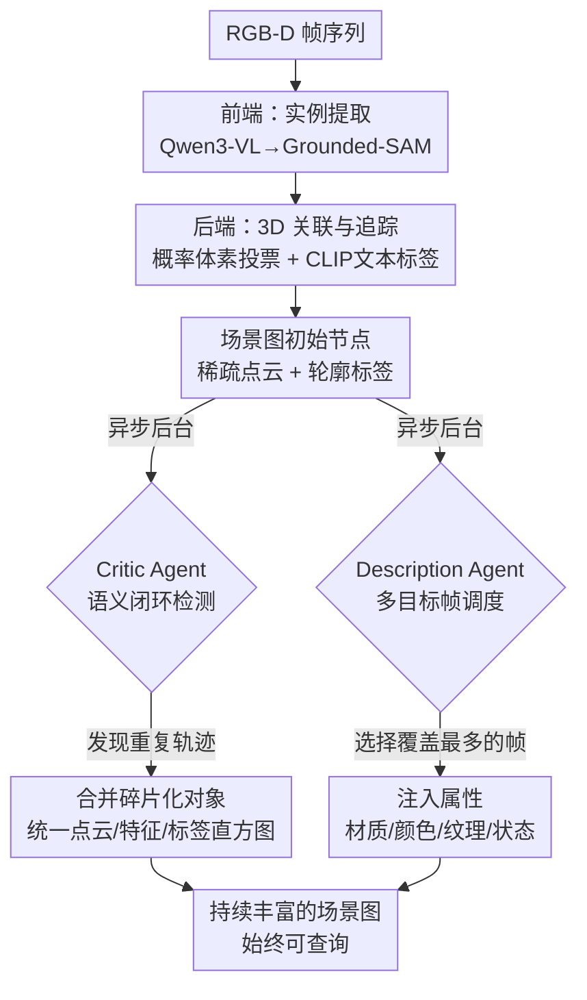

# Think While You Map: Asynchronous Vision-Language Agents for Incremental 3D Scene Graphs

**会议**: ECCV2026  
**arXiv**: [2606.31471](https://arxiv.org/abs/2606.31471)  
**项目页**: https://denizbickici.github.io/thinkgraphs/  
**代码**: 有（项目页）  
**领域**: LLM Agent / 3D视觉  
**关键词**: 3D场景图, 异步推理, VLM Agent, 增量映射, 语义闭环检测

## 一句话总结
ThinkGraphs 提出异步架构，将轻量增量3D映射与重型VLM推理解耦，通过后台运行的 Critic Agent（语义闭环检测合并碎片化轨迹）和 Description Agent（多目标帧调度注入细粒度属性）在不阻塞在线映射的同时持续丰富场景图语义，在 Sr3D+/Nr3D/ScanRefer 三个视觉定位基准上超越此前最优 15.3-18.8 A@0.25。

## 研究背景与动机

3D场景图是具身AI、机器人和增强现实的核心表征——它以节点表示物体、以边表示空间关系，使智能体能够回答"冰箱左边的不锈钢冰箱是什么"这类组合式语言查询。近年来的研究沿着两条互补但彼此隔离的路线发展：一类是离线开放词汇系统（如ConceptGraphs、BBQ），优先保证语义丰富度——依赖CLIP嵌入和VLM推理输出细粒度标签、属性、描述和功能关系——但要求先完成完整的实例级重建再进行语义增强，这意味着在探索过程中场景图不可查询。另一类是在线实时映射系统（如Kimera、Hydra），以增量方式更新物体图但局限于闭合词集或浅层特征匹配，牺牲了VLM的语义深度来换取响应速度。

这两条路线之间的核心矛盾在于增量追踪的不稳定性。在部分视角和遮挡下，物体经常被碎片化或错误合并，如果直接在探索过程中查VLM，不仅会因重复分析不稳定轨迹而浪费大量计算资源，还会阻塞在线映射线程。因此现有系统只能等待完整重建后再做VLM推理。作者的关键观察是：语义推理不必等图稳定后再做——它反而可以主动帮助稳定图。这一观察成立有两个支撑条件：第一，用概率体素投票替代贪心逐对关联，已经大幅减少了轨迹碎片化这个迫使语义后置的根源问题；第二，不必对所有物体每帧都调用VLM，而是把VLM推理当作选择性的异步后台进程——它既可以通过语义闭环检测修复碎片的轨迹，又可以用多目标帧调度大幅摊薄开销。

本文的核心 idea 是**将轻量在线3D映射与重型VLM推理显式解耦，设计异步双Agent架构——Critic Agent负责检测和合并碎片化对象轨迹（类似SLAM中的闭环检测），Description Agent通过多目标帧调度以极少的VLM调用注入细粒度属性——使场景图在探索过程中始终可查询且语义随探索持续增长**。

## 方法详解

### 整体框架

ThinkGraphs 接收连续的 RGB-D 帧序列（含相机位姿），逐步构建开放词汇3D场景图。整个管线分为三层：前端从前置摄像头图中提取带标签的实例分割掩码；后端将跨帧的实例观测关联到持久3D对象轨迹中，并确定性推导空间关系；两个异步VLM Agent在后台线程中持续运行，在不阻塞映射主循环的前提下丰富和修复场景图。场景图在整个探索过程中始终可查询，且随着Agent处理完更多帧，节点标签更准确、属性更丰富、轨迹更完整。

### 关键设计

**1. 概率体素关联后端：用累积投票代替贪心匹配获得稳定身份**

增量3D映射中最根本的挑战是跨帧对象关联的一致性。现有方法（如ConceptGraphs、BBQ）几乎都采用贪心逐对匹配——在新观测与已有轨迹之间算CLIP特征相似度加3D交并比，取最高分完成匹配。这种策略的问题在于，每个匹配决策都基于当前帧的有限局部证据（单次观测），早期错误会沿着时间累积，导致假阴性不断累积、同一个物体被分裂成多个碎片轨迹。ThinkGraphs 改用概率体素一致性投票（借鉴OpenVox的思路）。核心机制是维护一个稀疏体素地图，每个体素记录各轨迹在此体素被观察的次数。对于一个新观测O，它与轨迹T_i的几何分数定义为该观测所占体素中轨迹T_i投票比例的平均值：$S_{\text{geo}}(T_i,O)=\frac{1}{|V(O)|}\sum_{v\in V(O)}\frac{c_{v,i}}{c_v}$，其中$c_{v,i}$是轨迹i在体素v中被观察的次数，$c_v$是所有轨迹在体素v的总观察次数。几何分数与CLIP文本标签嵌入的余弦相似度加权组合（$\lambda_{\text{geo}}=0.8,\lambda_{\text{feat}}=0.2$），高于阈值$\tau_{\text{assoc}}=0.4$则合并入该轨迹。体素级投票的关键优势在于累积了多条观测的证据——单次误检测在整体投票中被自然压低，而贪心匹配的"一票定终身"则没有纠错空间。每个轨迹还维护一个按检测置信度加权的标签直方图，高质量检测自然压制噪声预测。同时轨迹需积累至少$N_{\text{conf}}=6$次成功关联才能确认为正式节点，进一步过滤瞬态噪声。

**2. 文本引导视觉嵌入选择：用语义锚点从多视角中挑出最干净的特征**

每个轨迹积累了大量跨帧的2D裁剪图及其CLIP视觉嵌入，但并非所有视角都适合做下游检索和定位的代表特征。直观上，选择面积最大的裁剪图不一定好——大视角可能包含大量前景遮挡物（比如桌子上的东西比桌子本身更显眼），导致CLIP特征被干扰物主导。ThinkGraphs 提出了一个简洁而高效的选择策略：用轨迹当前的共识标签通过CLIP文本编码器获得一个语义锚点$\mathbf{f}_{\ell_i^\star}^{\text{text}}$，然后从该轨迹的视觉嵌入库中检索与该锚点最语义对齐的那一个：$\mathbf{f}_i^\star = \mathbf{f}_{s^*}^{\text{vis}},\; s^*=\arg\max_n\,{\mathbf{f}_n^{\text{vis}}}^\top\mathbf{f}_{\ell_i^\star}^{\text{text}}$。这确保了代表特征是语义上最匹配共识标签的视图，而不是面积最大但被遮挡污染的视图。此外还引入自适应面积门控——维护轨迹历史中的最大可见面积，只接受当前面积不低于该最大值50%的新特征更新——远处或严重遮挡的低质量视角被自动过滤。消融实验显示，仅这一项选择策略就带来+0.09 mIoU的提升。

**3. Critic Agent：VLM作为语义闭环检测器修复碎片化轨迹**

即使有了概率体素后端，增量追踪在长序列中仍然会因为视角剧变、遮挡恢复和重复观测等因素累积关联漂移，导致同一物体分裂成多个碎片化轨迹。这类碎片对CLIP/SBERT嵌入几乎不可见——同类物体的嵌入相似度本就很高，无法区分是同一实例还是同类的不同实例。ThinkGraphs 类比SLAM中的几何闭环检测，提出Critic Agent：一个异步VLM验证器，专门做合并操作（不出创建/删除）。处理分两阶段：候选调度阶段和视觉验证阶段。候选调度首先用几何门（IoU3D > 0.01且双方观测计数≥2）和语义门（SBERT标签嵌入余弦相似度≥0.8）两级过滤，保留可疑的轨迹对，同时追踪每对的峰值相似度$\hat{s}_{ij}$。缓冲区每50帧刷新一次，按峰值相似度排序取前20对送VLM验证。验证时，用Set-of-Mark（SoM）在图片上叠加高对比度掩码边界和唯一编号，配合几何上下文元组（标签、相似度、深度线索）一起送给GPT-5-mini，返回Merge/Keep决策。如果VLM判定为合并，则统一两条轨迹的点云、特征和标签直方图。这相当于用VLM的细粒度视觉+场景上下文推理能力做了一次"语义层面的一致性检查"——CLIP/SBERT看不出的碎片，VLM通过观察"这两个图中的掩码区域是不是同一个物体"可以准确判断。消融实验显示Critic Agent在easy/view-independent子集上的提升最明显，因为这些场景的定位失败主因就是碎片化。

**4. Description Agent + 多目标帧调度器：用极少的VLM调用覆盖全部节点**

即使单次VLM调用开销不大，"逐物体逐帧"查询仍会达到约9300次/场景的天文数字。ThinkGraphs的设计思路是：一帧通常包含多个物体，选出少量信息量最大的帧，用一次多图VLM调用就能覆盖大量未描述节点。具体实现是：在一个30帧的滑动窗口内，维护缺少详细描述的对象列表；对每帧，计算该帧可覆盖的目标集（目标在该帧的归一化面积达到其最佳视角的$\tau_{\text{view}}$倍以内才算"可覆盖"），然后贪心地选出分数最高的帧：$U(f)=\sum_{T\in\mathcal{T}_f}w_T\cdot\ln(1+\gamma\hat{A}_{T,f})$，其中$\mathcal{T}_f$是帧f可覆盖的目标集，$w_T$是类别权重（降低背景类权重），$\gamma$控制面积敏感度。每窗口最多选3帧。被选中的帧同样用SoM叠加标注后，在一个多图VLM调用中同时为多个对象输出细粒度属性（材质、颜色、纹理、状态、精炼类别标签如"翼背扶手椅"而非"椅子"）。属性结果按置信度投票累计到各节点的直方图中，反复观测增强一致的证据。这一调度大幅降低了VLM调用次数——平均每场景仅约26次VLM调用，比逐物体逐帧减少2个数量级。

### 损失函数 / 训练策略

ThinkGraphs 无需端到端训练，所有组件均为现成预训练模型（Qwen3-VL-2B-Instruct、Grounded-SAM v2、CLIP EVA02、GPT-5-mini）通过推理和提示工程组合。唯一的"训练"是数据关联中的超参数（$\lambda_{\text{geo}}=0.8,\lambda_{\text{feat}}=0.2,\tau_{\text{assoc}}=0.4,N_{\text{conf}}=6$等）在验证集上手动调定。体素分辨率为4cm，自适应面积比$\rho_{\text{area}}=0.5$，语义门$\tau_{\text{sem}}=0.8$，IoU门$\tau_{\text{iou}}=0.01$。所有实验在单工作站（AMD Ryzen 7 9700X, NVIDIA RTX 5090, 64GB RAM）上运行。

## 实验关键数据

### 主实验

**3D语义分割**：在 Replica（8场景）和 ScanNet（8场景）上与现有开放词汇方法对比：

| 数据集 | 指标 | ThinkGraphs | 此前最优（Octree-Graph/OpenVox） | 提升 |
|--------|------|-------------|-------------------------------|------|
| Replica | mAcc | 0.58 | 0.51（Octree-Graph） | +0.07 |
| Replica | mIoU | 0.37 | 0.34（Octree-Graph） | +0.03 |
| Replica | f-mIoU | 0.61 | 0.48（BBQ-CLIP） | +0.13 |
| ScanNet | mAcc | 0.75 | 0.76（OpenVox） | -0.01（竞争性） |
| ScanNet | mIoU | 0.44 | 0.43（OpenVox） | +0.01 |
| ScanNet | f-mIoU | 0.46 | 0.39（OpenVox） | +0.07 |

**3D视觉定位**：在三个基准上与全部现有方法对比：

| 数据集 | 指标 | ThinkGraphs | 此前最优（Open3DSG/BBQ） | 提升 |
|--------|------|-------------|------------------------|------|
| Sr3D+ | A@0.25 | 43.0 | 27.7（Open3DSG） | +15.3 |
| Nr3D | A@0.25 | 41.8 | 23.0（Open3DSG） | +18.8 |
| ScanRefer | A@0.25 | 52.9 | 34.6（Open3DSG） | +18.3 |
| ScanRefer | A@0.5 | 37.6 | 31.0（Open3DSG） | +6.6 |

### 消融实验

**后端管线消融（Replica mAcc/mIoU）**：

| 配置 | mAcc | mIoU | f-mIoU |
|------|------|------|--------|
| RAM++（基线前端） | 0.37 | 0.20 | 0.34 |
| + Qwen3-VL（前端替换） | 0.46 | 0.25 | 0.43 |
| + CLIP 文本标签嵌入 | 0.47 | 0.26 | 0.44 |
| + 文本引导特征选择 | 0.52 | 0.35 | 0.55 |
| + 自适应面积门控 | 0.58 | 0.37 | 0.61 |

**Agent 贡献（Nr3D A@0.25）**：

| 配置 | Overall | Easy | Hard | View Dep. | View Indep. |
|------|---------|------|------|-----------|-------------|
| Base（无VLM Agent） | 38.5 | 46.2 | 18.8 | 37.6 | 38.8 |
| + Critic Agent | 39.3 | 47.4 | 18.8 | 38.2 | 39.7 |
| + Description Agent | 40.5 | 47.6 | 22.3 | 40.6 | 40.4 |
| + Critic + Description | 41.8 | 48.0 | 25.9 | 43.0 | 41.4 |

### 关键发现

- **文本引导特征选择是最大单项贡献**：从平均面积最大的裁剪改为与语义锚点最对齐的视图，mIoU提升0.09——说明跨帧累积的视角中，「最清晰呈现该物体语义」的视角比「面积最大但可能被遮挡」的视角更适合做代表特征
- **Qwen3-VL的上下文感知提示是关键**：用Qwen3-VL生成名词提示替代RAM++的标签预测，效果提升最显著（+0.09 mAcc），因为上下文感知提示减少了漏检——它知道画面里有什么场景结构，不会把应检测的物体漏掉
- **Description Agent在hard子集上效果最大**：对困难查询（需要区分同类不同实例）提升3.5 A@0.25，而Critic Agent在easy子集上提升多（碎片化是简单查询失败的主要瓶颈）。两个Agent互补
- **VLM调用极其经济**：平均每场景仅约26次VLM调用，比逐物体逐帧暴力调用的~9300次少2个数量级，同时保持了空间关系确定性地从3D几何推导（不依赖VLM）

## 亮点与洞察

- **将SLAM中的闭环检测思想类比到语义层面**：几何SLAM有pose drift后用闭环检测修正全局位姿，ThinkGraphs 发现物体关联也有"association drift"，用VLM做语义层面的闭环检测——这个类比既自然又能拆解出独立可验证的模块
- **异步Agent架构打破了"探索期间图不可查"的固有 tradeoff**：之前所有开放词汇3D场景图都默认需要完整重建后才可查询。异步化后，初期查询可依赖轮廓标签和几何空间关系，后台Agent注入细粒度属性后查询结果自动变好。这个"先有草图，持续refine"的设计模式对其他在线建图任务有启发
- **多目标帧调度器的本质是信息论选择**：不是随机采样也不是均匀采样，而是用覆盖度驱动的贪心选帧——选取一帧中"未描述的目标最多且看得最清楚"的组合。这种思路可以迁移到任何涉及高成本感知模块的在线系统中（如多视角重建中选最优视角、主动SLAM中选信息增益最大的路径）
- **空间关系不靠VLM是务实的工程决策**：左右/上下/里外等空间谓词完全用3D包围盒的确定性几何关系推导，不消耗VLM配额，且结果零幻觉。这说明All-VLM架构未必优于"该用规则用规则，该用VLM用VLM"的混合设计

## 局限与展望

- **前端模型（Qwen3-VL + Grounded-SAM）是瓶颈**：当前每关键帧约1.45秒，主要花在前端而非Agent。更换更高效的检测器/分割模型是直接提速路径
- **异步Agent必然落后于映射前沿**：快速探索中新发现的物体可能在若干帧内缺乏详细属性描述，限制了序列早期的定位质量。引入更激进的调度策略（如新鲜度优先）或在线预计算可能是改进方向
- **仅支持合并操作**：Critic Agent只能检测和合并碎片化轨迹，不能纠正错误合并（将不同物体误认为同一物体）。引入删除或分裂操作值得探索
- **目前认为空间关系可确定性地从3D几何推导**，但更细粒度的功能关系（如"坐在上面""支持"）需要VLM参与——可以在Future Work中扩展为更多专门Agent

## 相关工作与启发

- **vs ConceptGraphs**: ConceptGraphs 也构建开放词汇3D场景图，但采用离线批处理——先完成完整重建再调用VLM给每个节点加描述。ThinkGraphs 是增量构建，图在探索过程中即可查询且语义随时间持续改善
- **vs BBQ**: BBQ 同样用场景图做3D视觉定位，但关联策略为贪心逐对匹配，轨迹碎片化后用定期的特征相似度合并来修正。ThinkGraphs 用概率体素投票从源头减少碎片化，再用VLM（Critic Agent）做更准确的合并决策
- **vs Open3DSG**: Open3DSG 将2D视觉语言特征蒸馏到GNN中学习端到端节点和边嵌入，是前馈学习范式。ThinkGraphs 走的是模块化解耦路线：追踪系统提供身份、Agent提供语义、几何规则提供空间关系——不依赖训练数据，因此更容易推广到新场景和新类别
- **vs OpenVox**: OpenVox 提出概率体素一致性做增量实例关联，但使用SBERT标题流水线。ThinkGraphs 在此基础上替换为CLIP文本标签嵌入、增加文本引导特征选择和自适应面积门控，并首次将VLM Agent引入循环做语义层级的后处理

## 评分
- 新颖性: ⭐⭐⭐⭐⭐ [将异步Agent设计引入3D场景图，VLM-in-the-loop的语义闭环检测类比新颖，架构级别的贡献而非增量改模块]
- 实验充分度: ⭐⭐⭐⭐⭐ [在语义分割（2个数据集）和视觉定位（3个基准、7个指标）上全面对比，三个消融实验覆盖后端管线、Agent贡献和架构隔离分析，定量有说服力]
- 写作质量: ⭐⭐⭐⭐ [动机清晰、方法部分图文配合好、关键直觉（异步化+类比SLAM闭环）讲得透，但超参部分有些散]
- 价值: ⭐⭐⭐⭐⭐ [解决了开放词汇3D场景图中"可查询性vs语义丰富度"的核心矛盾，异步Agent+调度器的设计模式可以推广到其他在线感知系统，且开源项目页便于复现和扩展]

<!-- RELATED:START -->

## 相关论文

- [\[ECCV 2026\] NaLA: A 3D Native LLM Layout Agent for High-quality 3D Scene Generation](nala_a_3d_native_llm_layout_agent_for_high-quality_3d_scene_generation.md)
- [\[ICML 2026\] Think Twice Before You Act: Enhancing Agent Behavioral Safety with Thought Correction](../../ICML2026/llm_agent/think_twice_before_you_act_enhancing_agent_behavioral_safety_with_thought_correc.md)
- [\[CVPR 2025\] SceneAssistant: A Visual Feedback Agent for Open-Vocabulary 3D Scene Generation](../../CVPR2025/llm_agent/sceneassistant_a_visual_feedback_agent_for_open-vocabulary_3d_scene_generation.md)
- [\[ICML 2026\] Scaling, Benchmarking, and Reasoning of Vision-Language Agents for Mobile GUI Navigation](../../ICML2026/llm_agent/scaling_benchmarking_and_reasoning_of_vision-language_agents_for_mobile_gui_navi.md)
- [\[CVPR 2026\] Towards GUI Agents: Vision-Language Diffusion Models for GUI Grounding](../../CVPR2026/llm_agent/towards_gui_agents_vision-language_diffusion_models_for_gui_grounding.md)

<!-- RELATED:END -->
