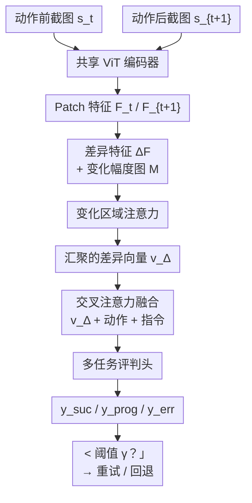

# VisCritic: Visual State Comparison as Process Reward for GUI Agents

**会议**: ECCV2026  
**arXiv**: [2606.24525](https://arxiv.org/abs/2606.24525)  
**代码**: 未开源  
**领域**: GUI Agent / 过程奖励模型  
**关键词**: GUI智能体, 过程奖励, 视觉状态对比, 动作验证, 弱监督

## 一句话总结

VisCritic 提出基于视觉状态对比的 GUI 智能体过程奖励框架，通过孪生 ViT 比较动作前后截图在语义特征空间中的差异，融合动作上下文联合预测动作成功概率、任务进度与错误类型，作为即插即用的推理时验证模块，在五个基准上普遍提升各类 GUI 智能体的任务成功率。

## 研究背景与动机

GUI 智能体（如 SeeClick、ShowUI、Qwen2.5-VL Agent）通过解读截图执行点击、输入、滚动等操作来自动化数字任务，在多模态大模型加持下取得了长足进步。然而在长程任务中，单个操作的错误会级联放大最终导致任务失败——因为智能体在执行每个操作后缺乏可靠的步骤级验证机制：它无法确认刚才那一下操作是否真的产生了预期的效果。现有工作尝试通过过程奖励模型（PRM）来填补这一空白，如 GUI-PRA、BacktrackAgent、GUI-Critic-R1 等，但它们有一个共同的局限：验证信号几乎完全依赖文本推理、工具调用或结构化检查清单。GUI 交互的本质是视觉的——点击后按钮变色、弹窗弹出、页面滚动到新内容，这些状态变化在像素级发生，却要通过文本描述来验证，模态上的错位从根本上制约了验证的可靠性。

这种验证范式与信号模态之间的错位正是本文要解决的核心矛盾。文本验证难以捕捉"按钮高亮""图标状态切换""页面跳转"这类纯视觉变化，当需要描述"点上了但系统无响应"与"点错了位置弹出了不同窗口"之间的细微差异时，文本描述更是力不从心。本文的切入角度是：既然动作的结果天然表现为视觉状态变化，那么验证就应当在视觉空间中直接进行。**核心 idea：提出 VisCritic，通过孪生 ViT 编码器比较动作前后截图对在语义特征空间的差异，融合动作与任务指令后联合预测动作成功概率、任务进度和错误类型，作为即插即用的视觉过程奖励信号。**

## 方法详解

### 整体框架

VisCritic 是一个以截图对为输入的视觉评判器：给定动作前截图 $s_t$ 和动作后截图 $s_{t+1}$，它输出三个预测——动作成功概率 $\hat{y}_{suc} \in [0,1]$、任务进度 $\hat{y}_{prog} \in [-1,1]$ 和错误类型 $\hat{y}_{err} \in \{\text{success}, \text{no-op}, \text{wrong-target}, \text{page-error}, \text{timeout}\}$。整体流程分为三个阶段：首先视觉差异编码器（VDE）通过共享权重的孪生 ViT 提取两张截图的 patch 级特征并逐点计算差异，再通过可学习温度参数的变化区域注意力汇聚出语义级差异向量；然后动作感知评判头将该差异向量与编码后的动作描述和任务指令做交叉注意力融合，由三个轻量 MLP 头分别输出预测；最后，当成功概率低于阈值 $\gamma$ 时，下游智能体根据评判结果执行重试或回退。

### 关键设计

**1. 视觉差异编码器（VDE）+ 变化区域注意力：在语义空间中比较视觉状态**

VDE 的核心思想是：用同样的编码器看动作前后的两张截图，然后逐 patch 比较差异。具体来说，共享权重的 ViT 编码器 $\mathcal{E}_\theta$ 分别提取 $s_t$ 和 $s_{t+1}$ 的 patch 级特征 $F_t, F_{t+1} \in \mathbb{R}^{P \times d}$（$P$ 为 patch 数，$d$ 为特征维度），然后逐 patch 计算差值 $\Delta F = F_{t+1} - F_t$。这种在 ViT 语义空间中的差分对渲染噪声、动画伪影和微小布局偏移具有天然的鲁棒性——左上角像素从 #FFFFFF 变成 #F0F0F0 在 RGB 空间算大变化，但在 ViT 语义空间可能几乎没变，而一个按钮从"未选中"变成"选中"在语义空间中则会留下清晰的差异信号。VDE 同时计算每个 patch 的变化幅度 $M_i = \|\Delta F_i\|_2$，构成一张变化幅度热力图。

并非所有视觉变化都值得关注——无关的广告轮播、异步加载动画会对简单差分造成严重干扰。变化区域注意力通过一个可学习的温度参数 $\beta$，在变化幅度图上施加 softmax 得到注意力权重 $\alpha_i = \exp(M_i/\beta) / \sum_j \exp(M_j/\beta)$，然后对 $\Delta F$ 做加权求和得到紧凑的全局差异向量 $\mathbf{v}_\Delta = \sum_i \alpha_i \cdot \Delta F_i$。经过学习后，$\beta$ 会自动调节注意力的集中程度，让模型屏蔽大范围但无关的视觉动效。这个机制不仅贡献了约 1.4 个点的成功率提升，还提供了天然的可解释性：成功点击时注意力集中在点击元素及其视觉响应上，误操作时集中在非预期的变化区域，无操作时注意力均匀弥散。

**2. 动作感知评判头（Critic Head）：融合视觉差异与动作上下文的联合预测**

仅凭截图差异无法判断一个变化是"好"是"坏"——同一段差异在不同动作和任务语境下含义截然不同（页面弹出"加载中"在等待场景下正常，在点击购买时可能是错误）。评判头将 VDE 输出的 patch 级差异特征 $\Delta F$ 作为查询（query），将文本编码器编码的动作 $a_t$ 和任务指令 $l$ 作为键值（key/value），通过交叉注意力让每个 patch 的差异特征"知道"当前是什么动作和什么任务目标。同时，$\Delta F$ 自身还经过空间自注意力来捕捉 patch 间的空间关系。两个分支分别经变化幅度加权的池化后相加，得到融合表征 $\mathbf{z}$。三组 MLP 头从 $\mathbf{z}$ 分别输出：sigmoid 激活的动作成功概率 $\hat{y}_{suc}$、tanh 激活的任务进度 $\hat{y}_{prog}$（正值为向目标前进、负值为偏离目标）和 softmax 激活的错误类型 $\hat{y}_{err}$。多任务设计让三者共享底层的视觉差异理解，而错误类型又为成功数值提供了可解释的细粒度分类。

**3. 无标注评判训练数据构建：从已有轨迹自动生成弱监督样本**

训练评判器通常需要昂贵的逐步骤标注——每个动作的后果是成功还是失败、什么类型的错误，都得人工标。VisCritic 巧妙地利用 GUI 智能体训练和评估中已经存在的轨迹数据来自动构建训练样本。它定义了五类样本：正样本来自成功轨迹中的连续三元组 $(s_t, a_t, s_{t+1})$ 并被赋予弱标签 $y_{suc}=1$；负样本通过四种扰动策略自动生成——（a）动作错配：替换 $a_t$ 为同轨迹中的随机动作而截图不变；（b）状态错配：替换 $s_{t+1}$ 为其他轨迹的截图；（c）无操作检测：选取 SSIM > 0.98 的相邻截图对；（d）失败轨迹采样：从失败轨迹中提取分歧点后的步骤并赋予弱标签 $y_{suc}=0$。错误类型的标签也直接从扰动策略类型派生（经手工校验 500 个样本，一致率 81.4%），进度分数则通过轨迹中的相对位置启发式推导。这种方法在 Mind2Web、AITW、AndroidWorld 三个公开数据集上以 ~1:1.6 的正负比构建了约 20 万条训练样本，训练后的模型对 OSWorld 和 WebArena（训练中完全未见过的平台）仍展现零样本泛化能力。

### 损失函数 / 训练策略

VisCritic 采用两阶段训练。第一阶段是**对比预训练**，仅训练 VDE：以 InfoNCE 损失让差异向量 $\mathbf{v}_\Delta$ 趋近于对应正确动作的文本特征 $\mathbf{h}_a^+$、远离负样本动作特征；当样本有从点击坐标派生的可靠动作区域掩码时，额外用 KL 散度约束注意力权重集中在动作影响的 UI 元素上（无可靠掩码的样本跳过此项）。第二阶段是**多任务微调**，端到端训练整个模型：三个任务分别使用二分类交叉熵、均方误差和交叉熵损失，权重 $\lambda_1=1.0, \lambda_2=0.5, \lambda_3=0.5$。消融实验表明对比预训练是训练环节中最重要的组件（移除后下降 2.8 个点），它让 VDE 在进入多任务微调前就学会了判别性的视觉差异表征。

## 实验关键数据

### 主实验

VisCritic 在四个基座智能体上做即插即用评测（交互式平均 = Mind2Web/AndroidWorld/OSWorld/WebArena 四者的均值）：

| 基座智能体 | 配置 | Mind2Web (Step SR) | AndroidWorld (Task SR) | OSWorld (Task SR) | WebArena (Task SR) | 交互式平均 |
|-----------|------|-------------------|----------------------|------------------|-------------------|-----------|
| SeeClick | 基线 | 33.4 | 14.7 | 6.8 | 12.4 | 16.8 |
| SeeClick | +VisCritic | 37.6 | 19.1 | 9.5 | 16.4 | 20.7 |
| ShowUI | 基线 | 43.5 | 19.8 | 10.3 | 17.6 | 22.8 |
| ShowUI | +VisCritic | 48.9 | 24.8 | 12.8 | 23.2 | 27.4 |
| Qwen2.5-VL | 最好文本基线 | 51.8 | 28.2 | 17.4 | 26.5 | 31.0 |
| Qwen2.5-VL | +VisCritic | 54.1 | 29.8 | 17.1 | 29.4 | 32.6 |

VisCritic 在所有基座智能体上带来持续提升，在 WebArena 和 Mind2Web 上提升最为显著（因为长程网络任务中错误累积最严重）。与文本 PRM 基线（GUI-PRA、BacktrackAgent、GUI-Critic-R1）相比，VisCritic 在大部分设置下表现更好，仅 Qwen2.5-VL 在 OSWorld（文本密集的桌面环境）上一个场景文本基线略优。

### 消融实验

| 配置 | AndroidWorld 成功率 | 说明 |
|------|-------------------|------|
| Full VisCritic | 24.8 | 完整模型 |
| w/o 变化区域注意力 | 23.4 | 注意力机制贡献 +1.4 |
| w/o 多任务头（仅成功） | 24.1 | 辅助任务边际贡献 |
| w/o 对比预训练 | 22.0 | 训练中最重要的组件 |
| w/o 事后执行验证 | 21.4 | 仅靠预执行选择不够 |
| 替换 VDE 为像素差分 | 21.2 | 原始像素差异对噪声敏感 |

### 评判质量分析

在 AndroidWorld 上评测评判器本身的 F1 分数：

| 方法 | 模态 | F1 |
|------|------|-----|
| GUI-PRA | 文本 | 70.4 |
| BacktrackAgent | 文本 | 69.5 |
| VisCritic | 视觉 | 85.2 |

控制实验中更清晰地揭示了模态差异：文本评判器在纯视觉变化（如按钮高亮、图标切换）上仅 58.3% F1，像素级评判器在语义变化（如页面导航、内容加载）上仅 63.8% F1，而 VisCritic 在所有三类变化上均获得 >84% F1，证明语义视觉差异表征的全面优势。

### 关键发现
- 对比预训练是训练环节中最关键的组件，重要性远大于多任务头的辅助任务
- VDE 的语义特征（84.6% F1）远优于原始像素差异（70.5% F1）——后者被渲染噪声和界面动画严重干扰
- 事后执行验证（基于真实执行后的截图）远优于预执行选择（基于预测状态），差距达 3.4 个点
- 训练一次即可跨四种架构智能体迁移，无需智能体专属适配
- 推理开销仅 66ms/步（FP16/A100），相比环境交互延迟 1-3s 基本可忽略

## 亮点与洞察
- **从模态对齐的角度切入过程奖励**：直觉自然（GUI 交互本质是视觉的）但此前无人系统做到——这个认知颠覆了 GUI-PRA 等文本 PRM 的核心设计假设
- **弱监督数据构建是工程巧思**：四种扰动策略 + 启发式标签几乎零成本生产 20 万条训练样本，使严格的评判器训练成为可能，让框架不依赖额外人工标注
- **变化区域注意力兼具可解释性**：注意力热力图直观展示"模型判断成功/失败时在看哪里"，不像文本 PRM 的评分难以追溯依据
- **即插即用设计定位**：不修改智能体架构、不重新训练智能体，仅作为推理时钩子接入，实用门槛极低

## 局限与展望

- **对细粒度文本变化的感知有限**：ViT 编码器在数字变化（如计数从 3→4）这类极细微的文本变更上不够敏感，这是 ViT 共性局限
- **环境动态噪声仍是挑战**：无关动画、广告轮播、异步加载会干扰变化检测，极端的视口和分辨率变化更难应对
- **启发式弱标签可能引入噪声**：失败轨迹的分歧点估计通过轨迹对齐完成，当参考成功轨迹差异较大时标签质量下降
- **恢复策略尚未独立量化**：VisCritic 的输出接口已定义，但恢复策略（重试/回退）本身的设计优化不在本文定量范围内
- 未来方向包括轻量变体（SigLIP-400M 已保留 94% 的评判 F1）、与确定性验证器（如 MiniTap）混合、纳入 MCTS 树搜索、以及多模态视觉+文本 PRM 融合

## 相关工作与启发
- **vs GUI-PRA / GUI-Shepherd（文本 PRM）**：它们依赖文本描述或结构化检查清单来验证动作，VisCritic 在视觉特征空间中直接比较状态变化，两者本质上互补
- **vs BacktrackAgent / GUI-Critic-R1（错误检测）**：它们侧重于预执行预判或规则式验证，VisCritic 做的是基于真实事后视觉结果的后执行验证
- **vs 像素级图像差分**：VisCritic 的 VDE 在 ViT 语义空间操作，对渲染噪声和界面动画的鲁棒性远强于 RGB 空间差分
- **vs MobileDreamer / CUWM（世界模型）**：它们预测未来状态，VisCritic 验证实际发生的结果，可以互补使用

## 评分
- 新颖性: ⭐⭐⭐⭐ 将视觉状态对比系统引入 GUI 智能体的过程奖励是第一个完整工作，但孪生架构本身并非全新
- 实验充分度: ⭐⭐⭐⭐⭐ 五个基准、四个基座智能体、多个文本基线对比 + 控制实验 + 消融分析 + 可解释性，非常充分
- 写作质量: ⭐⭐⭐⭐ 动机清晰、方法论完整、分析深入，部分实验细节补充材料偏多
- 价值: ⭐⭐⭐⭐⭐ 即插即用的视觉验证模块可直接补强现有 GUI 智能体系统，实用价值高

<!-- RELATED:START -->

## 相关论文

- [\[ICML 2026\] Process Reward Agents for Steering Knowledge-Intensive Reasoning](../../ICML2026/llm_agent/process_reward_agents_for_steering_knowledge-intensive_reasoning.md)
- [\[ICLR 2026\] WebArbiter: A Principle-Guided Reasoning Process Reward Model for Web Agents](../../ICLR2026/llm_agent/webarbiter_a_principle-guided_reasoning_process_reward_model_for_web_agents.md)
- [\[AAAI 2026\] ProBench: Benchmarking GUI Agents with Accurate Process Information](../../AAAI2026/llm_agent/probench_benchmarking_gui_agents_with_accurate_process_infor.md)
- [\[ICLR 2026\] ViMo: A Generative Visual GUI World Model for App Agents](../../ICLR2026/llm_agent/vimo_a_generative_visual_gui_world_model_for_app_agents.md)
- [\[ICLR 2026\] ProRe: A Proactive Reward System for GUI Agents via Reasoner–Actor Collaboration](../../ICLR2026/llm_agent/prore_a_proactive_reward_system_for_gui_agents_via_reasoneractor_collaboration.md)

<!-- RELATED:END -->
