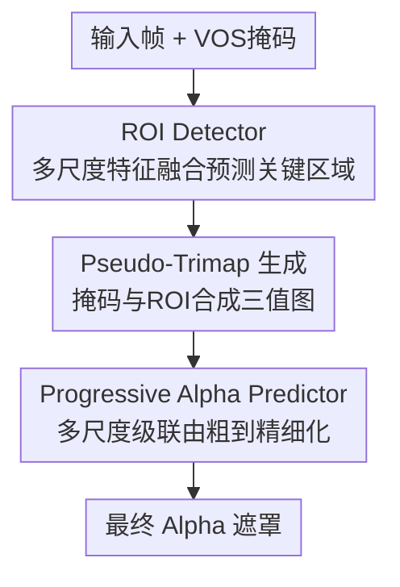

# SAM2Matting: Generalized Image and Video Matting

**会议**: ECCV 2026  
**arXiv**: [2606.27339](https://arxiv.org/abs/2606.27339)  
**项目**: [https://henghuiding.com/SAM2Matting](https://henghuiding.com/SAM2Matting)  
**代码**: [https://github.com/FudanCVL/SAM2Matting](https://github.com/FudanCVL/SAM2Matting)  
**领域**: 图像分割 / 视频理解  
**关键词**: 视频抠图, 图像抠图, SAM2, 解耦架构, ROI检测

## 一句话总结
SAM2Matting 提出一种解耦的"跟踪器到抠图"框架，将视频抠图拆分为高层跟踪（冻结的 VOS 跟踪器如 SAM2/SAM3 负责时序一致性）和低层抠图（可训练的 ROI 检测器 + 渐进式 Alpha 预测器负责细粒度透明度估计），仅用图像抠图数据训练就在视频抠图基准上以 zero-shot 方式达到 SOTA，同时支持多种 prompt 类型、维持强时序一致性、在人类和开放场景下均泛化良好。

## 研究背景与动机
图像抠图（image matting）旨在预测像素级 alpha 遮罩以分离前景与背景，是一个基础的低层视觉任务。扩展到视频时，通常需要显式指定目标（如首帧掩码）来消除歧义并实现跨帧一致跟踪。因此，视频抠图面临一个根本性权衡：它既需要高层语义理解来像视频目标分割（VOS）那样稳健跟踪目标，又需要低层细粒度感知来像图像抠图那样捕捉极其精细的细节。

为弥合这一鸿沟，现有方法严重依赖视频抠图数据集进行训练或微调。然而，跨帧标注像素级 alpha 值的成本极其高昂，导致这些数据集规模有限且领域狭窄——主要集中在人物抠图场景，不足以表征丰富的真实世界动态。在这种受限数据上从头训练无法建立稳健的跟踪能力，而在其上微调预训练 VOS 模型又会损害其原有的跟踪鲁棒性。

核心矛盾在于：高层跟踪需要大规模、多样化的视频分割数据来保证泛化性，低层抠图需要像素级 alpha 标注来保证精细度，而同时满足两者的视频抠图数据集几乎不存在。本文重新审视这一范式，认为视频抠图本质上是两个独立子任务的结合——高层跟踪（已被大规模训练的 VOS 模型很好地解决）和低层抠图（已被多样化的图像抠图数据集全面覆盖）。核心 idea：将两个子任务解耦，冻结 VOS 跟踪器保留其跟踪鲁棒性，仅用丰富的图像抠图数据训练专用的抠图组件，从而在不依赖昂贵视频抠图标注的前提下实现泛化性强的视频抠图。

## 方法详解

### 整体框架
SAM2Matting 的核心思路是将视频抠图解耦为高层跟踪与低层抠图两个独立部分：一个冻结的 VOS 跟踪器（SAM2.1-Tiny / SAM2.1-Base+ / SAM3）负责为每一帧输出时序一致的目标掩码；一组可训练的抠图组件接收该掩码与多尺度图像特征，先通过 ROI 检测器识别需要精细抠图的"关键区域"，再通过渐进式 Alpha 预测器在这些区域内由粗到精地生成并细化 alpha 遮罩。整个抠图组件仅在图像抠图数据上训练，训练时跟踪器冻结不动，因此零样本泛化到视频时天然继承了跟踪器的时序一致性。

### 关键设计

**1. ROI Detector：用可学习检测替代规则式形态学操作**

传统抠图方法通常用形态学膨胀/腐蚀在掩码上生成"未知区域"（ROI），这隐含假设边界重要性均匀，容易遗漏复杂结构内的精细细节或包含不需要抠图的确定前景区域。另一些方法直接使用原始掩码作为 ROI，同样粗糙。

ROI Detector 将 ROI 检测重新定义为像素级二分类任务——正像素表示需要抠图的关键区域（含精细细节或半透明区域）。具体来说，对第 $t$ 帧，在每个尺度 $i$ 上，一个尺度特定的卷积头 $f_{R,i}$ 以图像特征 $F_{t,i}$、缩放后的帧 $I_{t,i}$ 和缩放后的掩码 $M_{t,i}$ 为输入，预测 ROI logit 图 $L_{t,i}$：

$$L_{t,i} = f_{R,i}(F_{t,i}, M_{t,i}, I_{t,i})$$

不同尺度的 logit 图经过上采样和拼接后，由一个层次化卷积网络 $f_{\varphi}$ 融合全局上下文与结构细节，得到最终 logit 图 $L_t$。对 $L_t$ 做 sigmoid 并以阈值 $\theta=0.65$ 二值化即得 ROI 预测 $\mathcal{R}_t$。训练时用 focal loss 做像素级分类监督、smooth-L1 loss 抑制锯齿伪影。相比形态学操作，可学习的 ROI Detector 能根据图像内容自适应地识别每帧中真正需要精细抠图的区域（如飘动的头发、树叶间隙、手臂缝隙），既不会遗漏细节也不会误扩范围。

**2. Progressive Alpha Predictor：多尺度级联由粗到精迭代细化**

与 ROI Detector 的并行多尺度处理不同，Alpha 预测器将 alpha 估计视作一个序列化的细化过程。它采用由粗到精的级联策略：每个中间尺度的 alpha 预测会作为引导信息传递到下一个更精细的尺度。

在第 $t$ 帧的尺度 $i$ 上，复合输入 $X_{t,i}$ 拼接了图像特征 $F_{t,i}$、缩放后的 pseudo-trimap $\mathcal{T}_{t,i}$、缩放后的帧 $I_{t,i}$，以及来自上一尺度的上采样遮罩 $\mathcal{A}_{t,i-1}$（首尺度无此项）。尺度特定的投影层 $g_{\mathcal{A},i}$ 先将 $X_{t,i}$ 映射到固定维度嵌入，再由抠图头 $f_{\mathcal{A},i}$ 预测该尺度的 alpha 遮罩 $\mathcal{A}_{t,i}$：

$$\mathcal{A}_{t,i} = \sigma(f_{\mathcal{A},i}(g_{\mathcal{A},i}(X_{t,i})))$$

默认使用 3 个尺度，最细尺度的输出上采样回原分辨率即为最终 alpha 遮罩。这种自回归式的跨尺度信息传递使模型能在粗尺度捕获整体结构、在细尺度逐步恢复头发丝等精细结构，比单步预测质量显著更高。Pseudo-trimap 由 ROI 预测与 VOS 掩码合成：ROI=0 处取掩码值（确定前景/背景），ROI=1 处标为未知区域（0.5），为 Alpha 预测器提供结构化的像素级空间先验。

**3. 训练策略与损失设计：冻结跟踪器 + 仅图像数据训练 + 多层监督**

训练时 VOS 跟踪器完全冻结，仅优化抠图组件，这确保跟踪器的时序一致性不受抠图数据域偏移的影响。所有训练仅使用 8 个图像抠图数据集（I-HIM50K、P3M-10k、CelebAHairMask-HQ、AIM-500、Distinctions-646、AM-2K、UHRIM、RefMatte），不使用任何视频抠图数据。

ROI Detector 的监督信号 $\mathcal{R}_t^{GT}$ 由 ground-truth alpha 遮罩通过阈值截取（$\alpha=0.15, \beta=0.5$）后做膨胀减腐蚀得到，使用 focal loss $\mathcal{L}_{focal}$ 和 smooth-L1 loss $\mathcal{L}_{sm}$ 联合优化。Alpha 预测器在所有尺度上施加深度监督，每个尺度用 L1 loss 和 Laplacian loss 约束：

$$\mathcal{L}_{alpha} = \sum_{i=1}^{n} \lambda_i (\mathcal{L}_{L1}(\mathcal{A}_{t,i}, \mathcal{A}_{t,i}^{GT}) + \mathcal{L}_{lap}(\mathcal{A}_{t,i}, \mathcal{A}_{t,i}^{GT}))$$

损失权重随尺度递增（$\lambda_1=0.3, \lambda_2=0.6, \lambda_3=1.2$），鼓励细尺度更精确。此外，引入 matte-mask 一致性惩罚 $\mathcal{L}_{con}$（focal + dice 联合分割损失），将 alpha 遮罩锚定到 VOS 掩码上以防止前景内部出现空洞。总损失为 $\mathcal{L} = \mathcal{L}_{\mathcal{R}} + \mathcal{L}_{\mathcal{A}}$。

### 损失函数 / 训练策略
所有变体在 4 块 NVIDIA A6000 GPU 上训练 5 个 epoch，batch size 32，使用 AdamW 优化器，不同变体采用各自的学习率。超参数通过网格搜索确定：ROI 阈值 $\theta=0.65$，alpha 阈值 $\alpha=0.15, \beta=0.5$，3 个预测尺度的损失权重分别为 0.3、0.6、1.2。推理时跟踪器和抠图组件均无需微调，直接 zero-shot 应用于视频。

## 实验关键数据

### 主实验：图像抠图

| 数据集 | 方法 | MAD↓ | MSE↓ | Grad↓ | Conn↓ | SAD↓ |
|--------|------|------|------|------|------|------|
| P3M-500-NP | MAM | 15.40 | 9.20 | 14.22 | - | 25.82 |
| P3M-500-NP | Matte Anything | - | 2.80 | 17.30 | 10.00 | 10.70 |
| P3M-500-NP | **SAM2Matting (SAM2.1-T)** | **3.92** | **1.07** | **8.66** | **6.34** | **6.78** |
| P3M-500-NP | **SAM2Matting (SAM3)** | 3.83 | 0.97 | 8.48 | 5.84 | 6.61 |
| AM-2K | MAM | 10.10 | 3.50 | 10.65 | - | 17.30 |
| AM-2K | **SAM2Matting (SAM2.1-T)** | **4.57** | **1.39** | **7.02** | **7.22** | **7.88** |
| PPM-100 | MODNet | 8.60 | 4.40 | 64.26 | 80.16 | 94.78 |
| PPM-100 | **SAM2Matting (SAM2.1-T)** | **4.51** | **1.32** | **49.26** | **39.56** | **42.05** |

三个变体在三个图像抠图基准上一致超越此前方法。SAM2.1-Tiny 变体在 P3M-500-NP 上比 MAM 的 MAD 降低 11.48，在 PPM-100 上的 Conn 比 MODNet 降低约 40。

### 主实验：视频抠图（Zero-Shot）

| 数据集 | 方法 | MAD↓ | MSE↓ | Grad↓ | Conn↓ | dtSSD↓ |
|--------|------|------|------|------|------|--------|
| V-HIM60-Medium | MaGGIe (CVPR'24) | 13.85 | - | 6.31 | 5.11 | 23.63 |
| V-HIM60-Medium | MatAnyone2 (CVPR'26) | 15.12 | 5.86 | 6.36 | 5.43 | 4.50 |
| V-HIM60-Medium | **SAM2Matting (SAM2.1-T)** | 13.76 | 4.61 | 7.78 | 5.01 | **4.23** |
| V-HIM60-Medium | **SAM2Matting (SAM3)** | **11.77** | **3.64** | **5.92** | **4.23** | **3.81** |
| V-HIM60-Hard | MaGGIe (CVPR'24) | 21.23 | - | 7.08 | 6.89 | 29.90 |
| V-HIM60-Hard | MatAnyone2 (CVPR'26) | 45.75 | 35.03 | 8.43 | 14.75 | 6.16 |
| V-HIM60-Hard | **SAM2Matting (SAM2.1-T)** | 18.58 | 8.79 | 8.03 | 6.16 | **5.37** |
| V-HIM60-Hard | **SAM2Matting (SAM3)** | **14.37** | **5.52** | **5.85** | **4.72** | **4.37** |
| VideoMatte-SD | RVM (WACV'22) | 6.08 | 1.47 | 0.88 | 0.41 | 1.36 |
| VideoMatte-SD | MatAnyone2 (CVPR'26) | 4.73 | 0.55 | 0.51 | 0.19 | 1.12 |
| VideoMatte-SD | **SAM2Matting (SAM3)** | **4.44** | **0.27** | **0.23** | **0.16** | **1.11** |

SAM2Matting 在所有视频基准上以 zero-shot 方式超越使用视频数据训练的 SOTA 方法，且 dtSSD 最低，表明从冻结跟踪器继承的时序一致性极强。MatAnyone2 在 V-HIM60-Hard 上大幅退化（MAD 45.75），而 SAM2Matting 保持稳定，验证了解耦策略对困难场景的鲁棒性。

### 消融实验

| 实验 | 配置 | V-HIM60-Hard MAD↓ | Grad↓ | Conn↓ | dtSSD↓ |
|------|------|-------------------|-------|-------|--------|
| ROI 策略 | Morphological | 29.82 | 11.57 | 10.37 | 7.48 |
| ROI 策略 | Mask-only | 20.07 | 9.11 | 6.68 | 5.50 |
| ROI 策略 | **ROI Detector** | **18.20** | **7.39** | **6.01** | **5.10** |
| 架构/监督 | Prog. + Scaling only | 19.43 | 7.88 | 6.35 | 5.30 |
| 架构/监督 | + Consistency Loss | 18.65 | 7.70 | 6.20 | 5.18 |
| 架构/监督 | + Consistency + Smooth Loss | 18.26 | 7.45 | 6.04 | 5.09 |
| 架构/监督 | **All (Full model)** | **18.20** | **7.39** | **6.01** | **5.10** |

ROI Detector 相比形态学操作的 MAD 从 29.82 降至 18.20，降幅约 39%，证明可学习 ROI 对复杂场景的关键作用。渐进式多尺度细化单独贡献显著，matte-mask 一致性损失填补前景空洞，smoothness 损失消除锯齿边界——三者叠加构成完整的高保真抠图。

| 对照实验 | 条件 | P3M-500-NP MAD↓ | AM-2K MAD↓ |
|----------|------|-----------------|-------------|
| MAM | 原训练数据 + 原 backbone | 15.40 | 10.10 |
| SAM2Matting | 与 MAM 相同训练数据 | **4.05** | **5.38** |
| Matte Anything | 原训练数据 + 原 backbone | - | - |
| SAM2Matting | 与 Matte Anything 相同训练数据 | **3.94** | **5.95** |
| MAM | 换装 SAM2.1-B+ backbone | 12.92 | 8.64 |
| Matte Anything | 换装 SAM2.1-B+ backbone | 6.00 | 6.21 |
| **SAM2Matting** | **SAM2.1-B+ backbone** | **3.81** | **4.90** |

在控制训练数据和 backbone 的公平对比下，SAM2Matting 仍显著优于 MAM 和 Matte Anything，证明性能增益来自架构和监督设计本身，而非更大的数据或更强的 backbone。

### 关键发现
- **ROI Detector 是最大单一贡献模块**：替换为形态学操作后 MAD 从 18.20 飙升至 29.82，说明可学习的关键区域检测是高质量抠图的前提。
- **在视频抠图数据上微调反而损害泛化性**：在 V-HIM2K5 上微调后，域内 V-HIM60-Hard 略有提升（MAD 18.20→17.90），但 AM-2K 动物数据退化（MAD 4.90→5.23），且跟踪鲁棒性明显下降，即使简单无遮挡场景也出现跟踪漂移——说明窄域视频抠图数据会导致过拟合。
- **对跟踪不准确具有鲁棒性**：ROI Detector 将掩码作为多线索之一而非硬约束，能恢复跟踪器遗漏的前景细节（如滑雪杖）并移除误包含的背景物体（如桌面），实现了"跟踪器犯错、抠图组件纠错"的容错机制。
- **效率极高**：SAM2.1-Tiny 变体在 1080p 视频上跑 40 FPS、显存不到 4 GB，且 FPS 几乎不随分辨率变化（720p→2160p 仅从 40.46 降至 40.04），而 MatAnyone/MatAnyone2 在 1440p 时已降至 3 FPS 以下、2160p 直接 OOM。

## 亮点与洞察
- **解耦即泛化的典范**：把视频抠图拆成"跟踪"和"抠图"两个正交子问题，分别用最强的大规模预训练方案解决，是这篇论文最核心的方法论贡献。这种"冻结通用 backbone + 训练轻量专用 head"的模式可迁移到任何需要同时满足高层语义和低层细节的跨粒度任务（如视频实例分割的边界精修、交互式分割的点击响应）。
- **ROI Detector 用二分类替代形态学**：将 hand-crafted 的形态学操作替换为可学习的像素级分类器，本质上是用数据驱动的方式回答"哪些像素值得精细处理"——这个思路可以迁移到任何需要 selective refinement 的视觉任务（如超分辨率中的边缘增强区域选择、图像修复中的损坏区域检测）。
- **仅用图像数据训练实现 zero-shot 视频泛化**：这是解耦设计最优雅的副产品——训练时完全不需要视频标注，推理时直接享受跟踪器的时序一致性。对于标注成本极高的细粒度视频任务（如视频深度估计、视频光流精修），这种"图像训练 + 视频零样本"的策略极具实用价值。
- **matte-mask 一致性损失防止前景空洞**：这个设计小巧但效果直观：用 VOS 掩码作为 alpha 遮罩的结构锚点，确保抠出的前景不会出现"洞"，是一种简单有效的跨任务监督信号融合方式。

## 局限与展望
- **ROI Detector 依赖跟踪器掩码质量**：虽然实验显示对跟踪不准确有一定鲁棒性，但如果跟踪器完全丢失目标（如长期完全遮挡后目标从另一位置重现），ROI Detector 无法凭空恢复——它只能修正掩码内的边界错误，不能补全完全缺失的掩码区域。极端遮挡场景下的鲁棒性仍需验证。
- **仅在图像数据上训练带来的固有限制**：虽然 zero-shot 泛化是优势，但模型从未见过时序信息，可能导致帧间 alpha 预测存在微小不一致（尽管 dtSSD 指标很好，但定性 flickering 分析中仍可观察到极细微的闪烁）。引入无监督时序一致性正则化可能进一步改善。
- **不支持无 prompt 的全自动抠图**：当前框架需要显式指定目标（掩码/点/框/文本），对于"自动抠出视频中所有显著物体"的场景不适用。可探索将 ROI Detector 扩展为通用显著性检测器来实现无 prompt 模式。
- **多目标抠图未充分探索**：论文聚焦于单目标抠图，但实际应用中常需同时抠出多个目标（如多人视频会议背景替换）。扩展框架支持多实例抠图需要解决 ROI 冲突和实例级 alpha 分配问题。
- **评估基准有限**：视频抠图基准以人物为主（V-HIM60、VideoMatte-SD），在开放场景（如动物、车辆、自然物体）上的量化评估不足，尽管定性结果展示了强泛化性。

## 相关工作与启发
- **vs MaGGIe (CVPR'24) / MatAnyone (CVPR'25) / MatAnyone2 (CVPR'26)**: 这些方法均在视频抠图数据上训练或微调，受限于数据规模和领域偏置（主要人物抠图），泛化性不足。SAM2Matting 用解耦策略完全规避了视频抠图数据依赖，在人类和开放场景下均表现更好。劣势是这些端到端训练方法可能在特定人物抠图场景的帧间一致性略优。
- **vs Matte Anything (CVPR'24)**: Matte Anything 也使用 SAM 类模型做抠图，但采用形态学操作生成 ROI 且直接使用原始掩码进行抠图预测，SAM2Matting 的可学习 ROI Detector 和渐进式细化策略在同等 backbone 下显著优于它。
- **vs RVM (WACV'22)**: RVM 是经典的无需显式目标指定的视频抠图方法，但缺乏目标消歧能力使其在真实复杂场景中容易失效。SAM2Matting 通过 VOS 跟踪器引入显式目标指定，在需要精确控制目标的实际应用中更实用。
- **vs VideoMAMA (CVPR'26)**: VideoMAMA 通过伪标签扩展现有大规模 VOS 基准来合成视频抠图数据，虽然数据量更大但仍依赖伪标签质量，且未见与 SAM2Matting 的直接对比。两者思路互补：VideoMAMA 试图扩大视频抠图数据规模，SAM2Matting 则论证了根本不需要视频抠图数据。

## 评分
- 新颖性: ⭐⭐⭐⭐☆ 解耦跟踪与抠图的思路本身不新（此前已有 mask-guided matting 工作），但将其系统化为"冻结 tracker + 可学习 ROI + 渐进细化 + 仅图像训练 zero-shot 视频泛化"的完整框架，并论证了完全不需要视频抠图数据的可行性，方法论贡献清晰有力
- 实验充分度: ⭐⭐⭐⭐⭐ 覆盖 3 个图像基准 + 3 个视频基准，与 10+ 基线对比，消融覆盖 ROI 策略、架构监督设计、公平对照（控制数据/backbone）、微调分析、效率分析、定性比较，实验设计极为全面
- 写作质量: ⭐⭐⭐⭐☆ 结构清晰，动机阐述充分，方法描述详实，图表丰富（14 张图 + 7 张表），但部分公式变量定义分散在不同段落，阅读时需要来回对照
- 价值: ⭐⭐⭐⭐⭐ 对视频抠图社区有重要的范式启发——证明了解耦策略可以消除对昂贵视频抠图标注的依赖，同时 40 FPS 的实时性能和 5 GB 以下的显存开销使其具备直接部署到实际产品（如直播背景替换、影视后期）的工程价值

<!-- RELATED:START -->

## 相关论文

- [\[ICML 2025\] Generalized Interpolating Discrete Diffusion](../../ICML2025/llm_nlp/generalized_interpolating_discrete_diffusion.md)
- [\[ECCV 2024\] FunQA: Towards Surprising Video Comprehension](../../ECCV2024/llm_nlp/funqa_towards_surprising_video_comprehension.md)
- [\[CVPR 2026\] Single-step Diffusion-based Video Coding with Semantic-Temporal Guidance](../../CVPR2026/llm_nlp/single-step_diffusion-based_video_coding_with_semantic-temporal_guidance.md)
- [\[ACL 2025\] COSMIC: Generalized Refusal Direction Identification in LLM Activations](../../ACL2025/llm_nlp/cosmic_generalized_refusal_direction_identification_in_llm_activations.md)
- [\[AAAI 2026\] Soft Filtering: Guiding Zero-Shot Composed Image Retrieval with Prescriptive and Proscriptive Prompts](../../AAAI2026/llm_nlp/soft_filtering_guiding_zero-shot_composed_image_retrieval_with_prescriptive_and_.md)

<!-- RELATED:END -->
