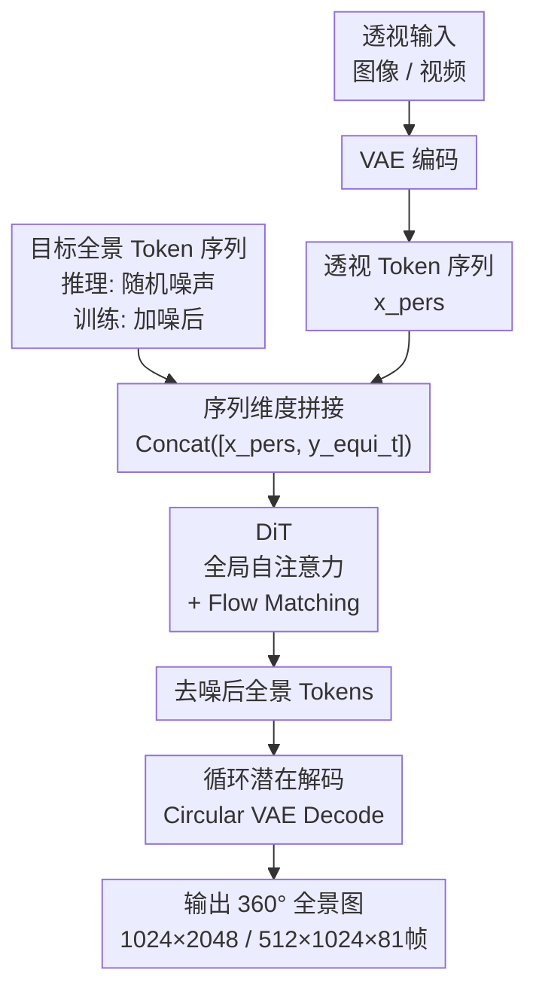

# 360Anything: Geometry-Free Lifting of Images and Videos to 360°

**会议**: ECCV2026  
**arXiv**: [2601.16192](https://arxiv.org/abs/2601.16192)  
**代码**: 无  
**领域**: 3D视觉  
**关键词**: 全景图生成, 扩散Transformer, 几何无关, 循环潜在编码, 视角到全景提升

## 一句话总结

360Anything 提出一种几何无关（geometry-free）的扩散Transformer框架，将透视输入和全景目标统一视为 token 序列、通过序列拼接让模型自行学习二者间的几何对应，无需任何相机元数据即可将任意视角图像/视频提升为重力对齐的无接缝 360° 全景图，在图像和视频两个任务上全面超越依赖真实相机参数的此前最优方法。

## 研究背景与动机

**领域现状**：将透视视角图像/视频"提升"为 360° 全景图是通向沉浸式 3D 世界生成的关键技术，在 AR/VR、机器人、游戏等领域有广泛前景。现有方法（CubeDiff、Argus、Imagine360 等）几乎都采用同一范式：先把透视输入通过显式几何投影映射到等距柱状投影（ERP）空间，获得与目标全景图像素级对齐的条件信号，再在该空间执行扩散生成。

**核心矛盾**：显式几何投影需要精确的相机元数据——视场角（FoV）、俯仰角、翻滚角等。对于互联网上随手拍摄的 in-the-wild 图像/视频，这些信息基本不可知。虽然可以用外部工具（MegaSaM、GeoCalib）估计，但估计结果在复杂场景下（大范围运动、光照变化、遮挡）容易产生噪声和漂移，导致投影对齐失败、生成质量严重退化。这意味着现有方法的能力上界被外部相机估计器的精度锁死——它们把"几何对齐"当成使用前提而非模型可以学习的任务。

**切入角度与核心 idea**：作者认为，显式几何投影并非全景生成的必要条件。只要模型容量足够大、训练数据足够丰富，一个通用架构完全可以从数据中隐式习得透视与 ERP 之间的几何映射。360Anything 的核心思想是：把透视输入和全景目标统一视为 token 序列，通过简单的序列维度拼接（sequence concatenation）输入扩散 Transformer（DiT），让全局自注意力自行建立两者的空间对应关系——模型必须"自己学会把透视内容放到全景画布的正确位置上"。

## 方法详解

### 整体框架

360Anything 基于预训练的潜在扩散 Transformer（DiT）构建。整体流程可分为三个阶段。

**阶段一：Token 化与条件注入**。将透视输入 $X_{\text{pers}}$ 用标准 VAE 编码为 latent token 序列 $x_{\text{pers}}$；将目标全景（训练时为真值图加噪、推理时为随机噪声）用循环潜在编码（Circular Latent Encoding）编码为全景 token 序列 $y_{\text{equi}}^t$。然后将两者在序列维度上拼接：$\text{Concat}([x_{\text{pers}}, y_{\text{equi}}^t])$。

**阶段二：DiT 全局推理**。拼接后的 token 序列输入 DiT，模型通过全局自注意力在全部 token 间建立关联，学习从透视 token 到全景 token 的映射，同时使用 Flow Matching 目标进行迭代去噪。

**阶段三：全景解码**。去噪后的全景 token 经过循环潜在解码恢复为像素空间的 360° 全景图。

### 关键设计

**1. 序列拼接的条件注入方式：让 DiT 自行学习几何对应**

现有方法将透视输入投影到 ERP 空间以获得像素级对齐的条件信号，这强制要求已知相机元数据。360Anything 放弃了这一几何先验：直接将透视图像编码为 token 序列 $x_{\text{pers}} = \mathcal{E}(X_{\text{pers}})$，与含噪全景 token $y_{\text{equi}}^t$ 在序列维度拼接后送入 DiT。模型通过全局自注意力在两种 token 之间建立对应——它必须推断出透视画面在全景画布上的位置、FoV 和朝向，才能正确生成周围的环境。这种设计的关键优势在于：（1）完全消除了对相机元数据的依赖，适用于任意来源的 in-the-wild 输入；（2）全景 token 数量约为透视 token 的 8 倍，序列拼接仅使输入序列长度增加约 12.5%（$1.125\times$），计算开销很小；（3）模型通过数据驱动自然具备了相机参数估计能力（见零样本 FoV 和姿态估计实验），实现了"生成即推理"。

**2. 循环潜在编码：从根源消除全景图接缝伪影**

ERP 全景图左右边界首尾相连，常见的伪影是生成结果在边界处出现可见的"接缝"。此前方法（如 Argus）使用推理时技巧（旋转去噪、混合解码）来"掩盖"接缝。360Anything 首次定位了接缝伪影的根因：现代扩散模型在卷积 VAE 的 latent 空间操作，VAE 编码器使用零填充（zero-padding）处理图像边界，这在全景图边界处引入了 discontinuity——即使像素本身是无缝的，其 latent 表示也已包含了一个断裂。解决方案简洁而优雅：在 VAE 编码全景图之前，先从左右两侧各裁剪 $w'$（实验中设为 $W/8$）列像素，填充到图片的对侧，扩展边界后进行编码：

$$y_{\text{equi}}^{\text{pad}} = \mathcal{E}(\text{Concat}([Y_{\text{equi}}[-w':], Y_{\text{equi}}, Y_{\text{equi}}[:w']]))$$

编码后丢弃填充区域对应的 latents，输入 DiT 的序列长度不变。这种"包装"操作保证了 latent 表示在边界处的连续性——即使将编码后的 latent 平移 $180^\circ$ 也没有 discontinuity，从而在训练阶段就消除了接缝的根因，且不引入任何推理时开销或质量损失。

**3. 正则坐标训练：强制输出重力对齐的直立全景**

由于模型不接收显式相机姿态，它天然不知道应该以什么坐标系输出全景图。之前的工作（CubeDiff、ViewPoint）假设输入视角总是在 ERP 中心，这意味着模型需要根据输入的实际姿态学习不同的球面畸变模式，负担很重。360Anything 采用"正则坐标约束"：训练模型**无论输入视角的相机姿态如何，都输出重力对齐（gravity-aligned）的直立全景图**。这迫使模型必须推断输入视角的相机姿态，将其"放置"到直立全景画布的正确位置。实现这个约束需要在训练数据侧做两阶段预处理：（1）对原始 360° 视频运行 COLMAP（rig-based）估计每帧相机姿态，旋转各帧消除帧间旋转（即视频稳定化）；（2）使用 GeoCalib 估计稳定化后的视频全局重力方向，旋转视频使重力方向与垂直轴对齐。通过这种 canonicalization，模型始终在一致、直立的数据上训练，生成的视频自然重力对齐，无需在推理时做任何特殊处理。

### 损失函数 / 训练策略

采用 Flow Matching 训练目标，denoiser $\mathcal{G}_{\boldsymbol{\theta}}$ 学习从标准正态分布到全景数据分布的映射：

$$\min_{\boldsymbol{\theta}} \mathbb{E}_{t\sim p(t), Y_{\text{equi}}\sim p_{\text{data}}, \boldsymbol{\epsilon}\sim\mathcal{N}(\boldsymbol{0},\boldsymbol{I})} \|(\boldsymbol{\epsilon}-Y_{\text{equi}}) - \mathcal{G}_{\boldsymbol{\theta}}(Y_{\text{equi}}^t, t, \boldsymbol{c})\|^2$$

图像模型基于 FLUX.1-dev（12B 参数）微调，Adam 优化器，lr=5e-5，batch size=512，训练 50k 步，输出分辨率 1024×2048。视频模型基于 Wan2.1-14B 微调，lr=1e-5，batch size=64，训练 20k 步（粗集 256×512 10k 步 + 高质量集 512×1024 10k 步），81 帧。训练时以 10% 概率随机丢弃文本和透视条件的嵌入以实现无分类器引导（CFG）。数据增强方面，训练时对透视视角的 FoV 在 [30°, 120°]、俯仰角在 [-60°, 60°]、翻滚角在 [-15°, 15°] 范围内均匀采样，模拟多样化的输入条件；对全景图做水平滚动增强。视频数据还使用模拟 + 真实世界相机轨迹（8:2 混合）来裁剪条件视角画面，提升对复杂运动的泛化能力。

## 实验关键数据

### 主实验

**图像全景生成（Laval Indoor / SUN360）**：

| 数据集 | 指标 | 360Anything | CubeDiff (SOTA) | 提升 |
|--------|------|-------------|-----------------|------|
| Laval Indoor | FID ↓ | 8.0 | 9.5 | -1.5 |
| Laval Indoor | KID (×10²) ↓ | 0.22 | 0.32 | -0.10 |
| Laval Indoor | FAED ↓ | 9.8 | 18.4 | -8.6（↓47%） |
| SUN360 | FID ↓ | 22.4 | 25.5 | -3.1 |
| SUN360 | KID (×10²) ↓ | 1.27 | 1.33 | -0.06 |
| SUN360 | FAED ↓ | 3.8 | 7.6 | -3.8（↓50%） |
| SUN360 | CLIP-Score ↑ | 28.07 | 25.00 | +3.07 |

> FAED 是唯一直接在全景图上评估的指标，360Anything 将误差降低了近 50%，说明生成的全景图在整体几何和质量上有质的飞跃。

**视频全景生成（Argus 101 test videos）**：

| 轨迹类型 | 指标 | 360Anything | ViewPoint | 提升 |
|----------|------|-------------|-----------|------|
| Real | PSNR ↑ | 25.75 | 23.25 | +2.50 |
| Real | LPIPS ↓ | 0.0468 | 0.1364 | -0.0896 |
| Real | FVD ↓ | 483.4 | 844.3 | -360.9 |
| Real | Imaging Quality ↑ | 0.5515 | 0.5293 | +0.0222 |
| Simulated | PSNR ↑ | 23.64 | 22.77 | +0.87 |
| Simulated | LPIPS ↓ | 0.0846 | 0.1326 | -0.0480 |
| Simulated | FVD ↓ | 432.9 | 957.8 | -524.9 |
| Simulated | Aesthetic Quality ↑ | 0.5394 | 0.5045 | +0.0349 |

> 在所有指标上全面超越此前方法（包括使用真实相机参数作为输入的基线），FVD 大幅降低说明生成的全景视频球面畸变更自然、时序更一致。

### 消融实验

**接缝消除技术对比**：

| 配置 | 图像 DS ↓ | 视频 DS ↓ | 说明 |
|------|-----------|-----------|------|
| Vanilla（无处理） | 9.92 | 35.52 | 直接生成有明显接缝 |
| Blended Decoding（Argus） | 5.29 | 19.84 | 推理时模糊接缝，仍有灰线伪影 |
| Circular Latent Encoding（本文） | 3.87 | 13.28 | 从训练阶段消除根因，无推理开销 |

**条件视角鲁棒性（平均 FID 退化）**：

| 方法 | 平均退化（FID ↑） | 说明 |
|------|------------------|------|
| w/o Camera Aug. | +6.48 | 无相机增强，非标准视角退化严重 |
| CC w/ GT Camera | +1.17 | 通道拼接 + 真实相机参数，鲁棒 |
| 360Anything（本文） | +0.98 | 无需相机参数，鲁棒性相当甚至略优 |

**视频正则坐标消融（FVD / Imaging Quality）**：

| 是否 Canonical | Real FVD ↓ | Real Imag. ↑ | Simulated FVD ↓ | Simulated Imag. ↑ |
|---------------|-----------|-------------|------------------|------------------|
| No | 559.5 | 0.4689 | 527.0 | 0.4601 |
| Yes（本文） | 470.8 | 0.5437 | 449.8 | 0.5387 |

> 正则坐标训练显著提升视觉质量（FVD 降 ~15%，Imaging Quality 升 ~7.5 个点），尽管 PSNR/LPIPS 略低（非 canonical 方法直接把条件视角放在 ERP 中心，重建更容易）。

### 关键发现

- **序列拼接 vs 通道拼接**：相同模型大小下，序列拼接在 VBench 各项指标上优于通道拼接变体（0.5515 vs 0.5403 Imaging Quality），仅引入不到 20% 的推理时延增加（55 min vs 46 min @ A100）。全景数据 token 约为透视的 8 倍，序列拼接仅将输入长度放大 1.125 倍。
- **相机增强意外有效**：训练时随机采样 FoV/姿态不仅没有降低标准视角（90°, 0°, 0°）的性能，反而提升了所有指标——多样化输入迫使模型更深入理解透视-全景几何对应，防止过拟合到单一映射。
- **零样本相机标定能力**：360Anything 在 FoV 估计（平均误差 4.93°）和姿态估计（MegaDepth 上 Roll 0.87°/Pitch 2.56°）上超越了多个有监督基线，仅略逊于专用方法 MoGe 和 GeoCalib。这表明序列拼接机制确实学到了准确的几何对应，生成网络内部具备了隐式几何推理能力。

## 亮点与洞察

- **用序列拼接取代几何投影**，将"显式硬对齐"转变为"隐式软学习"。这从根本上解除了全景生成对相机元数据的依赖，使模型可通过数据规模持续提升。
- **定位并修复了全景接缝伪影的根因**（VAE zero-padding），用简单的 circular padding 在训练阶段解决问题。此前只能用推理技巧掩盖，本文"追根溯源"的思路可迁移到其他边界连续性任务（360° 视频、环境贴图等）。
- **正则坐标约束使无相机信息时也输出重力对齐的全景**，不仅提升视觉质量，还使下游 3D 重建可直接使用输出而无需后处理对齐。
- **意外收获零样本相机标定能力**：一个生成式网络内部竟学到了准确的几何对应，是"生成即推理"的又一有力例证，也暗示了生成模型作为通用几何先验的潜力。

## 局限与展望

- **受限于基模型能力**：360Anything 微调自 FLUX/Wan2.1，继承其训练数据的偏差（如全景图底部出现三脚架、人手等 YouTube 360° 视频常见元素）；复杂物理场景（如流体、毛发）仍难以处理。
- **分辨率与时序受限**：当前视频模型仅支持 81 帧、512×1024 分辨率。全景图像素密度约为透视图的 8 倍，更大的上下文窗口是未来提升细节的必要方向。
- **全景图上采样仍是开放问题**：尝试用现成的透视视频上采样器处理全景图时，会重新引入 ERP 边界接缝和结构畸变，亟需全景专用的上采样技术。
- **时序扩展方向**：可与因果 DiT（CausVid、SelfForcing）结合扩展到长视频生成；全景图天然具备"工作记忆"特性（全场景同时生成），可进一步发展为长效情景记忆。

## 相关工作与启发

- **vs CubeDiff / ViewPoint**：两者分别用 Cubemap 和 Viewpoint Map 替代 ERP 表示来减轻畸变，但都假设输入位于全景中心（前视图），非正面输入时必须旋转全景画面产生畸变。360Anything 的序列拼接 + 正则坐标训练从根本上摆脱了这一约束。
- **vs Argus**：Argus 将透视投影到 ERP 后通道拼接作为条件，依赖外部相机估计器，且用推理时 blended decoding 掩盖接缝。360Anything 的序列拼接消除了相机依赖，循环编码从训练阶段消除了接缝。
- **vs 通用 DiT（FLUX/Wan2.1）**：360Anything 展示了 DiT 架构在全景生成领域的巧妙应用——只需改变 token 组织方式（从通道拼接变为序列拼接），就能学到全新的几何映射。这一思路可迁移到其他跨视角/跨模态生成任务。
- **对 3D 重建的启发**：360Anything 生成的全景视频可直接用于 3DGS 重建（sub-pixel 重投影误差，100% 帧注册率），为从窄视角单目视频到 3D 场景的端到端管线提供了新范式。

## 评分

- 新颖性: ⭐⭐⭐⭐⭐ 用序列拼接替代几何投影是全景生成领域的范式转变，首次定位并修复了 VAE 零填充导致的全景接缝伪影根因
- 实验充分度: ⭐⭐⭐⭐⭐ 在图像（2 数据集、5 指标）和视频（2 类轨迹、6 指标）上全面评估，附加零样本相机标定和 3D 重建验证，消融覆盖了所有设计选择
- 写作质量: ⭐⭐⭐⭐⭐ 动机清晰、问题定义明确、方法叙述逻辑流畅，接缝问题从发现到解决的叙事链条完整且有说服力
- 价值: ⭐⭐⭐⭐⭐ 全景生成不再受限于相机元数据的可获得性，对 AR/VR、世界模型、3D 重建等下游应用有直接的推动作用

<!-- RELATED:START -->

## 相关论文

- [\[ICCV 2025\] Synchronization of Multiple Videos](../../ICCV2025/llm_pretraining/synchronization_of_multiple_videos.md)
- [\[CVPR 2026\] Watch and Learn: Learning to Use Computers from Online Videos](../../CVPR2026/llm_pretraining/watch_and_learn_learning_to_use_computers_from_online_videos.md)
- [\[ICML 2025\] The Double-Ellipsoid Geometry of CLIP](../../ICML2025/llm_pretraining/the_double-ellipsoid_geometry_of_clip.md)
- [\[ICML 2025\] Whitened CLIP as a Likelihood Surrogate of Images and Captions](../../ICML2025/llm_pretraining/whitened_clip_as_a_likelihood_surrogate_of_images_and_captions.md)
- [\[ICCV 2025\] SynCity: Training-Free Generation of 3D Worlds](../../ICCV2025/llm_pretraining/syncity_training-free_generation_of_3d_worlds.md)

<!-- RELATED:END -->
