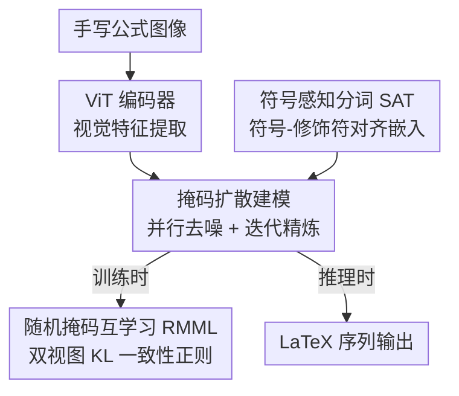

# GryphOne: Symbol-Aware Masked Diffusion for Structural Refinement in Offline Handwritten Mathematical Expression Recognition

**会议**: ECCV 2026  
**arXiv**: [2602.03370](https://arxiv.org/abs/2602.03370)  
**代码**: 无  
**领域**: OCR/文档理解  
**关键词**: 手写数学表达式识别, 掩码扩散模型, 符号感知分词, 互学习, 迭代精炼

## 一句话总结
GryphOne 将手写数学表达式识别（HMER）从自回归序列生成重新定义为离散掩码扩散的迭代符号精炼过程，通过符号感知分词（SAT）保持局部编辑的语法一致性，并用随机掩码互学习（RMML）提升精炼稳定性，在 MathWriting 上以 5.51% CER 和 59.9% ExpRate 全面超越重实现的自回归基线及商用 HMER 系统。

## 研究背景与动机
手写数学表达式识别（HMER）的核心难点在于双重歧义：一是符号歧义，手写风格导致"z"与"2"难以区分；二是语法歧义，空间布局（如上标、分式）容易误读（如 $\frac{a+b}{c}$ 被识别为 $a+\frac{b}{c}$）。主流方法采用自回归（AR）编码器-解码器框架，逐 token 生成 LaTeX 序列，但其天然存在 exposure bias——早期预测错误会沿自回归链向后传播，在复杂公式中注意力机制难以同时捕捉局部符号线索与全局结构约束，一处小错即可能导致级联失败。

语法感知模型（如 SAN、TAMER）通过编码语法树或图来约束输出一致性，但缺乏语法灵活性，面对训练中未见的嵌套结构时泛化能力有限；非自回归（NAR）模型（如 NAMER）通过并行预测缓解了 exposure bias，却丧失了迭代修正能力——一次性预测无法在发现错误后回头修正已输出的符号或结构。**核心矛盾**在于：AR 模型有能力逐步构建却受困于因果依赖的单向性，NAR 模型消除了单向依赖却失去了逐步修正的自由度，两者都无法同时做到"全局一致的结构推理"和"局部灵活的符号修正"。

本文的目标是统一结构一致性与符号鲁棒性，切入角度是将 HMER 从"生成"范式切换为"精炼"范式：不再从左到右一口气写出 LaTeX，而是从一个完全掩码的序列出发，通过多轮随机去掩码和重掩码逐步收敛到正确表达式。**核心 idea**：用离散掩码扩散模型（MDM）实现迭代符号精炼——每一步并行预测所有掩码位置的符号，然后按扩散调度随机重新掩码一部分，让模型在"猜→验证→修正"的循环中渐进式逼近真值，天然消除了 exposure bias 且保留了反复修正的自由度。

## 方法详解

### 整体框架
GryphOne 要解决的本质问题是：如何在没有自回归因果依赖的前提下，让模型有能力反复修正自己的预测直到结构一致、符号正确。整体方案是一个"编码器-扩散解码器"架构：ViT 编码器从手写公式的栅格化图像中提取视觉特征，扩散解码器在一个固定长度的掩码符号序列上执行迭代去噪，最终输出 LaTeX 序列。训练时，模型学习从任意掩码比例的部分观测中一步恢复完整序列；推理时，从全掩码序列出发，交替进行并行预测和随机重掩码，经过 $T$ 步精炼得到最终结果。

### 关键设计

**1. 掩码扩散建模：将 HMER 重新定义为迭代符号精炼**

AR 解码的 exposure bias 根因在于每一步预测都以前一步的预测（而非真值）为条件——模型在训练时见到的都是真值前缀，推理时却必须用自己的预测结果继续生成，训练与推理的条件分布不一致。GryphOne 用离散掩码扩散彻底绕开这个问题：前向过程中，对真值序列 $x_0$ 的每个位置 $i$ 以概率 $\beta_t = t/T$ 独立替换为 MASK token，得到 $x_t$；模型只学习一个 reverse step——从任意掩码比例的 $x_t$ 一步预测 $p(x_0|x_t)$，对所有位置（含掩码和未掩码）计算交叉熵损失。因为预测是并行且无因果掩码的，训练和推理的输入分布完全一致（都是部分掩码序列），从根本上消除了 exposure bias。

推理时执行完整的反向扩散过程：初始化 $x_T = [\text{MASK}, \dots, \text{MASK}]$，从 $t=T$ 到 $1$，每一步先并行预测 $p(x_0|x_t)$ 并取 argmax 得到 $\hat{x}_0$，再按前向扩散调度（概率 $(t-1)/T$）随机重掩码 $\hat{x}_0$ 的一部分得到 $x_{t-1}$。这种"预测→重掩码→再预测"的循环与训练时的去噪行为完全对偶，且随机重掩码注入了受控扰动，防止模型过早收敛到局部合理但全局不一致的结构。与 mask-predict 解码的本质区别在于：mask-predict 用 confidence-based 启发式选择掩码位置，缺乏显式的随机腐蚀模型，精炼过程不固定；而 GryphOne 的扩散调度 $\beta_t$ 从数学上定义了前向腐蚀和反向去噪的对应关系，精炼轨迹是可分析的。

**2. 符号感知分词 SAT：保持语法一致性的局部化编辑**

直接在原始 LaTeX token 序列上做扩散会遇到一个根本性障碍：LaTeX 中一个局部结构编辑（如删掉上标）会波及多个 token。例如将 `x_{1}^{y_{2}}` 改为 `x_{1} y_{2}` 需要删除 `^`、`{`、`y`、`2`、`}` 共五个 token——一个局部的语法变更在 token 空间里表现为大规模的非局部修改。扩散模型的 locality 假设（每个位置独立被掩码/预测）在这种情况下被严重破坏：掩码掉一个 `^` 意味着后面整段上标语法塌陷，模型极难从这种破坏中恢复。

SAT 的解决方案是将 LaTeX 序列分解为两个对齐序列：可见符号（数字、字母、运算符）和不可见修饰符（上标符 `^`、下标符 `_`、花括号）。修饰符按规则对齐到其作用的符号位置——`^`、`_`、`{` 对齐到其右侧最近的可符号，`}` 对齐到其左侧最近的可符号，同一符号的多个修饰符合并为一个修饰符 token，无修饰符的位置插入空 token。最终每个位置的嵌入为符号嵌入与修饰符嵌入的元素级求和：

$$\mathbf{E}_{\text{SAT}}(x_{t,i}) = \mathbf{E}_{\text{sym}}(x_{t,i}) + \mathbf{E}_{\text{mod}}(x_{t,i})$$

这样每个扩散单元（一个位置）就恰好对应一个手写字形及其语法修饰，序列长度在局部结构编辑下保持不变——删除一个上标只需修改一个位置的修饰符嵌入，不改变总长度。扩散过程的 locality 假设得以保持，早期迭代中符号-修饰符的对齐信息也能加速结构收敛（实验显示 SAT 在 $T=2$ 时就将 SER 从 3.71% 降至 2.21%）。

**3. 随机掩码互学习 RMML：提升精炼稳定性的双视图一致性正则**

掩码扩散的训练和推理都带有固有的随机性：每次采样的掩码模式不同，同一输入在不同掩码下可能产生不一致的预测，这会加剧推理时精炼轨迹的震荡。RMML 的核心直觉很简单：一个好的模型应该在看到同一真值的不同掩码版本时给出相近的预测分布。

具体做法是在一次训练迭代中对同一条真值 $x_0$ 采样两个独立掩码版本 $x'_t$ 和 $x''_t$，共享参数的解码器分别处理两者得到预测分布 $\hat{x}'_t$ 和 $\hat{x}''_t$。总损失由四部分相加组成：

$$\mathcal{L} = \text{CE}(\hat{x}'_t, x_0) + \text{CE}(\hat{x}''_t, x_0) + D_{\text{KL}}(\hat{x}'_t \parallel \hat{x}''_t) + D_{\text{KL}}(\hat{x}''_t \parallel \hat{x}'_t)$$

前两项是标准的去噪交叉熵，后两项是对称 KL 散度，强制两个掩码视图下的预测分布一致。这个方法不引入额外参数，仅在训练时增加一次前向传播（双视图共享 backbone），推理时无任何开销。其效果在深层扩散（$T=50$）时尤为明显：加入 RMML 后 SER 从 0.98% 进一步降至 0.84%（Table 3），同时输出多样性也显著降低（Fig. 5），表明精炼过程更加稳定。

### 损失函数 / 训练策略

训练目标如式 $\mathcal{L}$ 所示：对称 KL 散度下的双视图一致性损失 + 两个视图各自的交叉熵去噪损失。扩散步数 $T=50$（默认），训练时对每条样本随机采样 $t \sim \mathcal{U}(0, T)$ 以暴露模型于所有掩码比例。优化器为 AdamW，学习率 $10^{-4}$，权重衰减 $10^{-3}$，batch size 32，训练 60 个 epoch。编码器使用 DINO ViT（patch size 8，隐维度 384，输入分辨率 224x224），解码器为 5 层 Transformer，8 头注意力，30% dropout，最大序列长度 150。无数据增强。推理时所有结果取 10 次运行的平均值以消除随机性。

## 实验关键数据

### 主实验

MathWriting 测试集上 GryphOne-50 以 CER 5.51%、ExpRate 59.9% 全面超越所有重实现基线（虽 ICAL 以 Test CER 6.03%、EM 57.7% 在 AR 模型中表现最好，但 GryphOne-50 比其 EM 高 2.2 个百分点）。值得注意的是即便只用 10 步扩散（GryphOne-10），其 FPS 达 73.7，比所有 AR 基线都快（ICAL 仅 7.95 FPS），同时保持了 GryphOne-50 超 98% 的识别性能。MP（mask-predict 解码）虽然也优于 AR 基线，但始终低于同配置的扩散版本，说明扩散调度的随机重掩码比置信度引导的掩码更有利于精炼。

| 方法 | FPS↑ | Valid CER↓ | Valid EM↑ | Valid ≤1↑ | Test CER↓ | Test EM↑ | Test ≤1↑ |
|------|------|------------|-----------|-----------|-----------|----------|----------|
| BTTR | 8.56 | 6.45 | 60.4 | 72.0 | 6.85 | 53.4 | 65.5 |
| CoMER | 8.55 | 5.96 | 61.2 | 72.4 | 6.50 | 54.5 | 65.6 |
| ICAL | 7.95 | 5.43 | 63.4 | 74.5 | 6.03 | 57.7 | 68.2 |
| TAMER | 6.70 | 5.79 | 61.9 | 73.0 | 6.35 | 55.6 | 66.7 |
| PosFormer | 5.04 | 5.69 | 62.5 | 73.6 | 6.30 | 56.2 | 67.1 |
| GryphOne-MP | 73.5 | 5.34 | 68.2 | 83.0 | 6.29 | 55.8 | 75.9 |
| GryphOne-10 | 73.7 | 4.70 | 70.6 | 84.8 | 5.55 | 59.3 | 78.0 |
| GryphOne-50 | 21.2 | 4.63 | 71.0 | 85.0 | 5.51 | 59.9 | 78.1 |

CROHME 2014-2023 跨数据集泛化测试中，GryphOne-50 在四个年份版本上均取得最高 ExpRate（2014: 65.2%, 2016: 61.4%, 2019: 61.8%, 2023: 61.2%），分别超出最强基线 ICAL 2.8、2.4、0.8、2.9 个百分点（NAMER 文献值参考，非重实现不可直接比），验证了迭代符号精炼策略在不同数据分布下的泛化能力。

### 消融实验

SAT 和 RMML 在不同扩散深度 $T$ 下的消融结果（MathWriting 验证集）显示二者效果互补：SAT 在浅层扩散（$T=2$）时即提供显著增益（CER 从 5.42 降至 5.10，SER 从 3.71 降至 2.21），表明符号-修饰符对齐在早期迭代中加速结构收敛；RMML 在深层扩散中增益更大（$T=50$ 时 SER 从 0.98 进一步降至 0.84），表明一致性正则对长链精炼的稳定性改善更突出。二者叠加在所有 $T$ 下取得最低 CER 和竞争性的 SER。

| SAT | RMML | T=2 CER↓ | T=5 CER↓ | T=10 CER↓ | T=50 CER↓ | T=2 SER↓ | T=5 SER↓ | T=10 SER↓ | T=50 SER↓ |
|-----|------|----------|----------|-----------|-----------|----------|----------|-----------|-----------|
| - | - | 5.42 | 4.97 | 4.84 | 4.75 | 3.71 | 1.84 | 1.24 | 0.81 |
| - | Y | 5.20 | 4.86 | 4.75 | 4.67 | 2.88 | 1.42 | 0.96 | 0.59 |
| Y | - | 5.10 | 4.84 | 4.76 | 4.68 | 2.21 | 1.53 | 1.31 | 0.98 |
| Y | Y | 5.01 | 4.78 | 4.70 | 4.63 | 1.89 | 1.33 | 1.08 | 0.84 |

### 关键发现
- **SAT 和 RMML 互补而非重叠**：SAT 解决的是扩散单元与语法编辑的 locality 对齐问题（使单个位置的修改不波及其他位置），RMML 解决的是不同掩码模式下的预测一致性问题——两者作用于不同的维度，叠加效果最佳。
- **扩散深度 $T$ 是高灵活性的精度-延迟控制旋钮**：$T=10$ 时 FPS 73.7（比 AR 基线快 9 倍以上），EM 70.6%；$T=50$ 时 FPS 21.2，EM 71.0%。收益在 $T \approx 30$ 后趋于饱和，实际部署可用截断调度大幅降低推理成本而几乎不损失精度。这与 AR 方法不同——AR 的延迟随表达式长度线性增长，而 GryphOne 的扩散步数 $T$ 与序列长度无关。
- **扩散精炼确实在修正结构错误**：步进式 CER/SER 曲线（Fig. 3）显示错误率随 $t$ 递减直至约步骤 40 收敛，且 SAT 从最早迭代就压低 CER 和 SER，表明结构对齐信息在精炼早期就被有效利用。错误恢复实验（Fig. 4）进一步表明模型在部分损坏的序列上（$t \approx 20$）最吃力，此时剩余掩码足够多以致上下文不完整但又不足以重建，是精炼难度最高的阶段。
- **输出多样性低表明收敛稳定**：10 次独立解码的输出多样性分析（Fig. 5）显示多数表达式只有 1 种输出，SAT 和 RMML 均进一步压缩多样性，表明随机性主要来自真正的视觉歧义（如潦草分子 `14` vs `17` vs `4`）而非模型不稳定。

## 亮点与洞察
- **从"生成"到"精炼"的范式切换**：HMER 过去所有的改进都在 AR 框架内或 NAR 一次预测上打补丁，GryphOne 是第一个指出"exposure bias 的本质是训练-推理条件分布不一致"并用扩散模型的前向/反向过程对偶性从根本上消除它的工作。这个视角可以迁移到任何有结构化输出 + 长程依赖的识别任务（如公式 OCR、乐谱识别、化学结构式识别）。
- **SAT 的"一符一位"对齐思想简洁而深刻**：LaTeX 的语法信息分散在多个 token 中，SAT 通过 element-wise embedding sum 将符号身份和语法角色压缩到同一个位置向量里，既不丢失语法信息，又保持了扩散的 locality 假设。这个技巧本质上是一种"无损降维"——把 $N$ 个 token 的语法树压缩成 $N$ 个独立位置的 embedding sum，可推广到任何 token 序列中存在非局部语法依赖的场景（如代码补全、结构化数据生成）。
- **RMML 是轻量级的一致性正则范式**：仅需一次额外前向传播和对称 KL 散度，零推理开销，却显著提升扩散精炼的稳定性。其核心洞察——好的去噪模型应该是 mask-invariant 的——具有通用性，可应用于任何基于掩码的自监督或生成式预训练任务。

## 局限与展望
- **扩散推理的延迟仍是实际部署瓶颈**：$T=50$ 时需要 50 次解码器前向传播（虽然每次并行处理所有位置），FPS 仅 21.2，远低于 NAR 的 73+。作者建议用截断调度折中，但未探索更高效的扩散采样策略（如 DPM-Solver 类的 ODE 加速、蒸馏、或自适应步长），这是最直接的改进方向。
- **训练数据需求量大**：扩散模型天然比 AR 模型更"吃数据"，CROHME 这种小规模数据集单独训练效果不够，必须借助 MathWriting 的 23 万真实 + 40 万合成样本才能发挥优势。对于缺乏大规模标注数据的语种或符号系统，可能需要探索合成数据增强或预训练+微调的策略。
- **固定分辨率的 ViT 编码器对极端长宽比或超长公式支持不足**：224x224 的固定输入在处理多行公式、长分式链或矩阵时可能丢失细节。可考虑引入自适应分辨率编码或动态分块策略。
- **SAT 的对齐规则可能存在边界情况**：修饰符"对齐到最近可见符号"的规则在嵌套括号、多级上下标交错等极端情况下是否正确处理，论文未给出详尽分析。如果在极端语法结构下出现对齐错误，会导致修饰符信息被赋给错误的符号位置，需要进一步验证。

## 相关工作与启发
- **vs NAMER（NAR HMER）**: NAMER 用图解码器一次预测所有 token 和关系，消除了 exposure bias 但不支持迭代修正——一旦输出就是最终结果。GryphOne 的扩散范式天然支持多轮修正，在结构错误恢复上更灵活，代价是推理更慢。两者本质上是 NAR 精度-速度谱系的两端。
- **vs Mask-Predict（迭代掩码建模）**: Mask-Predict 也用迭代预测+掩码，但其掩码选择是 confidence-based 启发式的，缺乏前向腐蚀过程的定义。GryphOne 用扩散调度 $\beta_t = t/T$ 统一了训练腐蚀和推理重掩码，使得精炼行为在理论上更可分析（本质上是一个离散吸收扩散的 reverse process）。
- **vs TAMER / PosFormer（语法感知 AR）**: 这些方法在 AR 框架内通过语法树或位置任务约束输出，虽然减少了语法错误，但 exposure bias 仍在。GryphOne 与他们正交——可以把语法感知的思想融入扩散框架中（如在 SAT 基础上加入语法合法性验证作为推理时的 rejection 机制），是可行的改进方向。

## 评分
- 新颖性: ⭐⭐⭐⭐⭐ 首次将离散掩码扩散应用于 HMER，"迭代精炼"的范式切换在方向上具有开创性，SAT 和 RMML 两个设计都清爽有效
- 实验充分度: ⭐⭐⭐⭐ 在 MathWriting + CROHME 双基准上全面对比 AR/NAR 基线，消融覆盖 SAT×RMML×T 三维度，步进分析和错误恢复实验深入；但缺少与大型 VLM（如 Uni-MuMER）的直接对比，且未探索不同编码器 backbone
- 写作质量: ⭐⭐⭐⭐⭐ 结构清晰，从 AR/NAR 的各自缺陷自然引出扩散的必要性，算法伪代码与公式配合得当，实验分析有因果推理而非堆砌数字
- 价值: ⭐⭐⭐⭐ 为 HMER 开辟了扩散范式的新方向，"精炼而非生成"的思想可迁移到其他结构化识别任务；实用部署上推理延迟仍是障碍，但截断调度提供了可操作的折中方案

<!-- RELATED:START -->

## 相关论文

- [\[ICLR 2026\] Soft-Masked Diffusion Language Models](../../ICLR2026/llm_pretraining/soft-masked_diffusion_language_models.md)
- [\[ICML 2026\] Tuning the Implicit Regularizer of Masked Diffusion Language Models: Enhancing Generalization via Insights from k-Parity](../../ICML2026/llm_pretraining/tuning_the_implicit_regularizer_of_masked_diffusion_language_models_enhancing_ge.md)
- [\[ICML 2026\] Beyond Structural Symmetries: Linear Mode Connectivity via Neuron Identifiability](../../ICML2026/llm_pretraining/beyond_structural_symmetries_linear_mode_connectivity_via_neuron_identifiability.md)
- [\[ICML 2026\] Names Don't Matter: Symbol-Invariant Transformer for Open-Vocabulary Learning](../../ICML2026/llm_pretraining/names_dont_matter_symbol-invariant_transformer_for_open-vocabulary_learning.md)
- [\[ICLR 2026\] Should We Still Pretrain Encoders with Masked Language Modeling?](../../ICLR2026/llm_pretraining/should_we_still_pretrain_encoders_with_masked_language_modeling.md)

<!-- RELATED:END -->
