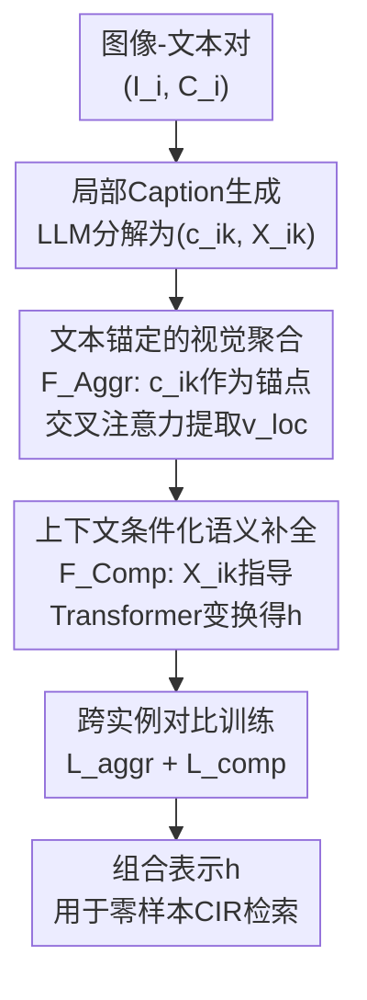

# Learning to Compose: Revisiting Proxy Task Design for Zero-Shot Composed Image Retrieval

**会议**: ECCV 2026  
**arXiv**: [2607.00374](https://arxiv.org/abs/2607.00374)  
**代码**: 无  
**领域**: 多模态VLM  
**关键词**: 零样本组合图像检索, 代理任务设计, 视觉-文本组合, 可学习组合机制, 跨实例对比学习  

## 一句话总结
FoCo（Focus-then-Complete）将零样本组合图像检索（ZS-CIR）中的视觉-文本组合建模为可学习的"先聚焦后补全"两阶段过程，通过文本锚定的视觉聚合和上下文条件化的语义补全两个代理任务联合训练，配合跨实例对比损失防止捷径学习，在四个 ZS-CIR 基准上全面超越已有方法，且推理时不依赖 LLM。

## 研究背景与动机
组合图像检索（CIR）要求模型根据一张参考图像和一段文本修改指令检索目标图像，核心挑战在于理解"改哪里"和"怎么改"。有监督 CIR 依赖昂贵的（参考图、修改文本、目标图）三元组标注，零样本 CIR（ZS-CIR）应运而生——它通过在大规模图像-文本对上设计代理任务来绕过三元组依赖。

现有 ZS-CIR 方法的共同痛点是：**代理任务的设计目标本末倒置**。无论是将图像特征映射为伪词注入冻结文本编码器的方案（如 Pic2Word、LinCIR、Context-I2W、PrediCIR），还是用球面插值等线性算术做特征组合的方案（如 SlerpTAT），本质上都是在训练视觉/文本表征去"凑"一个预先定死的、不可学习的组合规则——文本编码器预训练目标是全局图文对齐，天然不擅长捕捉 CIR 核心的局部语义变化；线性算术则无法表达真实修改中需要的非线性语义变换。组合函数本身从未被学习，模型只能在固定的组合公式下被动适配，限制了表达多样化和细粒度语义修改的能力。

受人类认知过程启发——人观察场景时先关注感兴趣区域，再利用更广泛的上下文线索精炼理解——本文提出 **Focus-then-Complete（FoCo）**，将组合机制本身变为可学习的：先定位修改相关的视觉语义，再在文本指导下将其补全为目标表示。**核心 idea**：不再让表征去适应固定组合规则，而是让组合过程本身从数据中学习，实现灵活、上下文相关的语义组合。

## 方法详解

### 整体框架
FoCo 仅使用图像-文本对进行训练，将组合建模为"聚焦→补全"两阶段可学习过程。整体流程：首先用 LLM 将图像的全局 caption 分解为多个局部 caption 和对应的上下文 caption，提供细粒度的代理监督信号；然后文本锚定的视觉聚合模块 $F_{\text{Aggr}}$ 以每个局部 caption 为锚点，通过交叉注意力从图像 patch 特征中提取修改相关的局部视觉表示 $v^{\text{loc}}$；接着上下文条件化的语义补全模块 $F_{\text{Comp}}$ 以上下文 caption 为变换指令，通过 Transformer 将 $v^{\text{loc}}$ 转换为完整的目标组合表示 $h$；最后用跨实例语义对比损失联合优化两个模块，防止模型走文本捷径。推理时修改文本直接作为聚焦和补全的输入，无需 LLM 参与。

### 关键设计

**1. 局部 Caption 生成：为聚焦-补全提供细粒度监督**

CIR 的文本修改通常对应局部语义变化（添加物体、改变颜色、替换动作等），但标准图像-文本对仅提供全局对齐信号。FoCo 用 Llama-3.1-8B-Instruct 将每张图像的全局 caption $C_i$ 语义分解为 $K$ 个局部 caption $\{c_{i_k}\}_{k=1}^K$ 和对应的上下文 caption $\{X_{i_k}\}_{k=1}^K$。每个局部 caption 描述场景的一个独立语义组件（如"一件蓝色连衣裙"），上下文 caption 则包含除该组件外的剩余场景信息（如"模特站在白色背景前"）。这一分解使 $\langle c_{i_k}, X_{i_k} \rangle$ 从不同视角覆盖完整场景语义：$c_{i_k}$ 作为聚焦锚点告诉模型"看哪里"，$X_{i_k}$ 作为补全条件告诉模型"补什么"。实验表明 $K \in [3,5]$ 效果最优——过少则监督粒度不足（$K=1$ 时性能显著下降），过多则 LLM 生成幻觉细节导致语义噪声（$K \geq 6$ 性能回落）。

**2. 文本锚定的视觉聚合：让模型学会定位修改相关区域**

CIR 的核心前提是知道参考图中哪些视觉内容与修改相关，但全局图像表示往往掩盖物体/区域级的细微差异。该模块将局部 caption $c_{i_k}$ 作为锚点，通过交叉注意力动态提取相关视觉内容。具体流程：先将 $c_{i_k}$ 与全局视觉特征 $v_i^g$ 做逐元素乘法并经过 MLP 生成文本引导的查询向量 $q_{i_k} = \text{MLP}(c_{i_k} \odot v_i^g)$；再以 $q_{i_k}$ 为 query、图像 patch 特征 $\mathcal{V}_i^p$ 为 key/value，通过多头交叉注意力得到局部视觉特征 $v_{i,i_k}^{\text{loc}} = \text{CrossAttn}(q_{i_k}, \mathcal{V}_i^p)$。查询向量同时编码文本语义和全局视觉上下文是关键设计——它使模型能根据具体图像内容消歧（如"红色"在不同图片中指向不同物体），单纯的文本查询或点积注意力都无法做到这一点（消融实验 4a/4b 均导致性能下降）。

**3. 上下文条件化的语义补全：让模型学会执行语义变换**

聚合模块解决的是"找到了要改的区域"，补全模块则解决"如何把它变成目标"。该模块构建复合输入序列 $S_{i,k} = [f_t(X_{i_k}); f_v(v_{i,i_k}^{\text{loc}}); f_v(\bar{v}_{i,i_k})]$，将三者沿序列维度拼接：上下文 caption $X_{i_k}$ 作为文本变换指令，局部视觉特征 $v_{i,i_k}^{\text{loc}}$ 是被变换的主体，$\bar{v}_{i,i_k}$ 是聚合注意力图逆权重加权得到的背景表示（保证未修改区域的视觉信息不被丢失）。然后以 $v_{i,i_k}^{\text{loc}}$ 初始化 query token，通过多层 Transformer block $\mathcal{T}$ 与 $S_{i,k}$ 交互，动态关注变换指令和背景细节，输出组合表示 $h_{i,i_k} = \mathcal{T}(q=v_{i,i_k}^{\text{loc}}, kv=S_{i,k})$。用 $v_{i,i_k}^{\text{loc}}$ 初始化 query 而非随机 token 是重要设计——它为变换提供语义锚点，确保模型是在"修改特定视觉内容"而非"凭空想象"；纳入背景表示则防止信息丢失。消融实验表明，去掉 Transformer（5a）、去掉背景（5b）、换成随机 query 初始化（5c）均会造成明显的性能下降。

**4. 跨实例语义对比训练：双损失联合防捷径**

直接用标准对比学习训练上述两个模块会失效——caption 分解产生了同一图像的多组局部 caption，标准 InfoNCE 假设单正例、粗粒度负样本，模型极易走"文本捷径"：仅通过比较 caption 间的文本相似度判断正负，完全忽略视觉证据。FoCo 设计了两个互补的 sigmoid-based 对比损失。

聚合损失 $\mathcal{L}^{\text{aggr}}$ 的创新在负样本构造：不用"同 caption 跨图像"的普通负对，而构造 $\langle v_{i,j_{k'}}^{\text{loc}}, c_{j_{k'}} \rangle$——即用图像 $I_i$ 的视觉特征与另一图像 $I_j$ 的局部 caption $c_{j_{k'}}$ 聚合得到 $v_{i,j_{k'}}^{\text{loc}}$，再与 $c_{j_{k'}}$ 做负对。这迫使模型判断 $v_{i,j_{k'}}^{\text{loc}}$ 是否真的被 $I_i$ 中的视觉证据支撑——如果模型只依赖 caption 文本特征，它会错误地认为这个负对是正例。损失形式为：

$$\mathcal{L}^{\text{aggr}}_i = -\left[\sum_{k=1}^{K} \phi^{+}(v_{i,i_k}^{\text{loc}}, c_{i_k}) + \sum_{j \neq i} \phi^{-}(v_{i,j_{k'}}^{\text{loc}}, c_{j_{k'}})\right]$$

其中 $\phi^{\pm}(u,v) = \log\sigma(\pm \frac{\text{sim}(u,v)}{\tau})$，sim 为余弦相似度，$\tau$ 为温度系数。

补全损失 $\mathcal{L}^{\text{comp}}$ 将组合表示 $h_{i,i_k}$ 与全局视觉嵌入 $v_i^g$ 做正对（验证补全结果与完整图像一致），负对则用无关样本的文本替换变换指令构造 $\langle h_{i,j_{k'}}, v_j^g \rangle$，打断语义连贯性。最终联合优化 $\mathcal{L} = \sum_i (\mathcal{L}^{\text{aggr}}_i + \mathcal{L}^{\text{comp}}_i)$，多正例 sigmoid loss 相比 InfoNCE 对多正例更友好且优化更稳定。

### 一个完整示例：推理走一遍

假设查询为参考图 $I_r$（一位模特穿着蓝色连衣裙）+ 修改文本 $T_m$ = "change the dress to red"。推理流程：
1. **聚焦阶段**：$F_{\text{Aggr}}$ 以 $T_m$ 为锚点，对 $I_r$ 的 patch 特征做交叉注意力，生成 $v_r^{\text{loc}}$。此时高响应区域集中在连衣裙区域，模型"看"到了需要修改的物体。
2. **补全阶段**：$F_{\text{Comp}}$ 以 $v_r^{\text{loc}}$ 为 query、$[f_t(T_m); f_v(v_r^{\text{loc}}); f_v(\bar{v}_r)]$ 为 key/value，通过两层 Transformer 生成组合表示 $h_r$。$h_r$ 编码了"红色连衣裙 + 原有背景和模特姿态"的完整语义。
3. **检索**：$h_r$ 与画廊中所有图像的全局嵌入 $v_j^g$ 计算余弦相似度，排名最高的即为穿着红色连衣裙的同一模特（目标图）。

整个过程不涉及 LLM，推理仅需 0.034 秒/查询，组合机制完全由训练学到的 $F_{\text{Aggr}}$ 和 $F_{\text{Comp}}$ 参数化执行。

### 损失函数 / 训练策略

训练分两个阶段：第一阶段先单独预训练聚合模块 $F_{\text{Aggr}}$ 3 个 epoch（学习率 $5\times10^{-4}$），让模型先学会稳定的视觉聚焦；第二阶段联合优化 $F_{\text{Aggr}}$ 和 $F_{\text{Comp}}$ 30 个 epoch（学习率分别为 $5\times10^{-5}$ 和 $3\times10^{-5}$），batch size 512。训练数据为 CC3M 的短 caption 经 Llama-3.1-8B 离线分解为局部-上下文 caption 对（$K \in [3,5]$）。CLIP ViT-L/14 或 ViT-G/14 的图像和文本编码器全程冻结，仅训练两个轻量模块——$F_{\text{Aggr}}$ 为单层交叉注意力 + 前馈投影，$F_{\text{Comp}}$ 为两层 Transformer（每层 8 头注意力 + FFN），ViT-L/14 下约 38M 可训参数，单卡训练约 17 小时。推理时直接用修改文本 $T_m$ 作为聚焦和补全输入，无 LLM 依赖。

## 实验关键数据

### 主实验

**FashionIQ 验证集结果（ViT-L/14 骨干）**：

| 方法 | Dress R10 | Dress R50 | Toptee R10 | Toptee R50 | Shirt R10 | Shirt R50 | Avg R10 | Avg R50 |
|------|-----------|-----------|------------|------------|-----------|-----------|---------|---------|
| Pic2Word (CVPR'23) | 20.0 | 40.2 | 27.9 | 47.4 | 26.2 | 43.6 | 24.7 | 43.7 |
| SEARLE-XL (ICCV'23) | 20.5 | 43.1 | 29.3 | 50.0 | 26.9 | 45.6 | 25.6 | 46.2 |
| Context-I2W (AAAI'24) | 23.1 | 45.3 | 30.6 | 52.9 | 29.7 | 48.6 | 27.8 | 48.9 |
| LinCIR (CVPR'24) | 20.9 | 42.4 | 28.8 | 50.2 | 29.1 | 46.8 | 26.3 | 46.5 |
| SlerpTAT (ECCV'24) | 23.4 | 45.1 | 32.0 | 51.2 | 29.9 | 46.5 | 28.4 | 47.6 |
| PrediCIR (CVPR'25) | 25.4 | 49.5 | 33.1 | 55.4 | 31.8 | 52.0 | 30.1 | 52.3 |
| MoA (SIGIR'25) | 25.2 | 48.5 | 33.2 | 54.8 | 31.9 | 50.7 | 30.1 | 51.3 |
| HIT (ICCV'25) | 25.6 | 47.1 | 32.8 | 54.7 | 32.4 | 51.2 | 30.3 | 51.0 |
| **FoCo** | **26.5** | **49.3** | **34.2** | **56.0** | **33.8** | **54.3** | **31.5** | **53.2** |

FashionIQ 侧重领域内属性编辑（颜色/材质等），FoCo 在所有子类上均有提升，说明聚焦-补全机制对细粒度属性修改特别有效。在 ViT-G/14 骨干下，FoCo 进一步达到 Avg R10 49.1 / R50 68.7。

**CIRR 和 CIRCO 测试集结果（ViT-L/14）**：

| 方法 | CIRR R@1 | CIRR R@5 | CIRR R@10 | CIRR R@50 | CIRCO mAP@5 | CIRCO mAP@10 | CIRCO mAP@25 | CIRCO mAP@50 |
|------|----------|----------|-----------|-----------|-------------|--------------|--------------|--------------|
| Pic2Word | 23.9 | 51.7 | 65.3 | 87.8 | 8.7 | 9.5 | 10.6 | 11.3 |
| SEARLE-XL | 24.2 | 52.5 | 66.3 | 88.8 | 11.7 | 12.7 | 14.3 | 15.1 |
| Context-I2W | 25.6 | 55.1 | 68.5 | 89.8 | 13.0 | 14.6 | 16.1 | 17.2 |
| LinCIR | 25.0 | 53.3 | 66.7 | – | 12.6 | 13.6 | 15.0 | 15.9 |
| SlerpTAT | 30.9 | 59.4 | 70.9 | 89.2 | 17.0 | 17.8 | 19.6 | 20.6 |
| PrediCIR | 27.2 | 57.0 | 70.2 | – | 15.7 | 17.1 | 18.6 | 19.3 |
| MoA | 27.1 | 56.5 | 69.2 | 90.0 | 15.3 | 17.1 | 18.5 | 19.3 |
| HIT | 27.9 | 57.6 | 70.5 | 90.4 | 15.5 | 16.7 | 18.9 | 19.9 |
| **FoCo** | **34.5** | **65.4** | **74.7** | **92.1** | **17.5** | **18.1** | **19.9** | **20.8** |

CIRR 包含自然场景复杂图像，R@1 提升 3.6 点（vs SlerpTAT），证明显式局部定位在多物体场景中的消歧能力远优于全局融合或伪词拼接。CIRCO 的 120K 画廊噪声更大，FoCo 的 mAP 全面领先说明补全模块生成的目标表示在噪声环境下仍保持精确。

### 消融实验

| 实验配置 | CIRR R@1 | CIRR R@5 | CIRR R@10 | FashionIQ R@10 | FashionIQ R@50 | 说明 |
|----------|----------|----------|-----------|----------------|----------------|------|
| Full model | 34.5 | 65.4 | 74.7 | 31.5 | 53.2 | 完整 FoCo |
| (1a) image+text baseline | 12.4 | 36.2 | 49.1 | 19.8 | 35.7 | 无聚合无补全，仅全局特征 |
| (1b) aggregation-only | 25.8 | 54.6 | 67.1 | 26.4 | 46.9 | 仅 $F_{\text{Aggr}}$，补全用线性融合 |
| (1c) completion-only | 22.2 | 49.8 | 60.9 | 23.5 | 42.7 | 仅 $F_{\text{Comp}}$，聚合用 CAM mask |
| (2a) InfoNCE loss | 33.1 | 63.9 | 73.2 | 30.2 | 51.7 | 替换为单正例 InfoNCE |
| (2b) naive neg. (aggr) | 31.0 | 61.8 | 71.5 | 28.8 | 50.4 | 聚合损失用普通负样本 |
| (2c) naive neg. (comp) | 32.3 | 62.6 | 72.4 | 27.9 | 49.1 | 补全损失用普通负样本 |
| (2d) w/o joint $\mathcal{L}^{\text{aggr}}$ | 33.2 | 63.5 | 73.0 | 30.4 | 52.0 | 联合训练中去掉聚合损失 |
| (3a) rule-based decom. | 30.7 | 60.9 | 70.6 | 28.5 | 49.6 | 规则句法拆分替代 LLM 分解 |
| (3b) single local caption (K=1) | 32.6 | 63.1 | 72.7 | 30.0 | 51.1 | 每张图仅一个局部 caption |
| (4a) w/o $\odot$ query fusion | 33.5 | 64.1 | 73.4 | 30.7 | 52.1 | 查询不做逐元素融合 |
| (4b) dot-product attention | 33.0 | 63.7 | 73.0 | 30.3 | 51.6 | 交叉注意力换为点积注意力 |
| (5a) w/o Transformer $\mathcal{T}$ | 32.8 | 63.0 | 72.5 | 27.5 | 47.9 | 补全去掉 Transformer blocks |
| (5b) w/o background $\bar{v}$ | 33.1 | 63.5 | 73.0 | 30.2 | 51.5 | 序列中去掉背景表示 |
| (5c) w/o visual-anchor init | 32.9 | 63.2 | 72.8 | 29.9 | 51.0 | query 用随机 token 初始化 |

### 关键发现
- **聚合模块的单体贡献大于补全模块**：(1b) 相比 (1a) 在 CIRR R@1 上提升 13.4 点，(1c) 仅提升 9.8 点，说明在零样本设定下"学会看哪里"比"学会怎么变"更难且更关键。两者结合（完整 FoCo）产生叠加增益，证明聚焦与补全是互补而非冗余的。
- **跨实例负样本是防捷径的关键**：(2b) 和 (2c) 在 FashionIQ R@10 上分别掉 2.7 和 3.6 点，设计不当的负样本严重损害模型对视觉证据的依赖，尤其在补全阶段（脱离视觉锚点的补全损失掉点更严重）。
- **LLM 语义分解不可替代**：(3a) 的规则句法拆分因产生不自然的孤立片段和不合语法的上下文，在 CIRR 和 FashionIQ 上均大幅下降，说明高质量语义分解是代理任务有效的前提条件。
- **分解粒度 $K$ 存在最优区间 $[3,5]$**：$K=1$ 时监督粒度过粗，$K \geq 6$ 时 LLM 倾向于生成幻觉细节，CIRCO 上的完整粒度曲线显示 $K=4$ 达到峰值。
- **额外数据并非增益来源**：将 LLM 分解后的 caption 拼接回完整句子作为额外训练数据加入 Context-I2W 和 LinCIR 基线，仅带来 $\leq 0.3$ 的微弱提升甚至负收益，排除了"FoCo 的增益来自 LLM 引入的额外语义信息"这一替代解释。

## 亮点与洞察
- **"先聚焦后补全"的两阶段解耦是核心洞察**：把组合检索中的"定位修改区域"和"执行语义变换"拆成两个可独立学习和评估的子任务，每个子任务有对应的代理监督信号（局部 caption 负责聚焦、上下文 caption 负责补全），设计干净且训练目标明确。这种"分而治之"的代理任务设计思路可迁移到其他需要细粒度跨模态对齐的任务（如指代表达理解、视觉问答中的空间推理、文本引导的图像编辑）。
- **跨实例负样本的构造方式是一个通用防捷径技巧**：将另一图像的局部 caption 作用于当前图像再与该 caption 做负对——"换图不换文"迫使模型真正依赖视觉证据。这种负样本构造不限于 CIR，任何多正例、多视角对比学习场景（如多粒度图文对齐、视频-文本检索）都可以复用。
- **离线 LLM 增强 + 在线轻量训练的模式值得推广**：LLM 仅用于一次性预处理（caption 分解），不增加训练和推理计算开销，却为代理任务提供了原本缺失的细粒度监督信号。在 VLM 能力越来越强的趋势下，这种"用强模型预处理数据、用轻量模块执行任务"的范式成本效益极佳。
- **CIRR R@1 提升 3.6 点的幅度说明范式级改进的价值**：从伪词拼接到可学习组合，性能跳变远超同范式内的 incremental 改进，说明解决"组合规则不可学习"这一根本问题比优化伪词质量更关键。

## 局限性 / 可改进方向
- **LLM 做 caption 分解引入了训练数据质量瓶颈**：虽然推理时不依赖 LLM，但训练数据的质量高度依赖 Llama-3.1-8B 的分解能力。对非英文或多语言场景、特定领域图像（如医学、遥感），分解质量可能显著下降。LLM 本身的偏见和知识边界也会影响局部 caption 的覆盖范围。
- **仅在 CLIP 骨干上验证**：实验主要基于 CLIP ViT-L/14 和 ViT-G/14，未系统性验证在其他 VLM（如 SigLIP、BLIP-2、EVA-CLIP）上的兼容性，附录中的 BLIP 结果较为初步。
- **补全模块容量有限**：仅两层 Transformer，相对于大规模 VLM 的表示空间，可能限制了在极端复杂修改场景（如多重组合修改、长文本指令）下的表现上限。
- **可扩展方向**：（1）将聚焦-补全范式扩展到视频 CIR 或多轮交互式检索，利用时序信息增强聚焦精度；（2）探索不依赖 LLM 的自监督 caption 分解替代方案（如基于视觉 grounding 模型或聚类的方法）；（3）将可学习组合机制引入图像编辑和生成任务，作为文本驱动的视觉修改 backbone；（4）结合更强的 VLM（如 BLIP-2、LLaVA）的表示空间来提升组合表示的上限。

## 相关工作与启发
- **vs Pic2Word / SEARLE / LinCIR / Context-I2W（伪词注入类）**：这些方法将参考图像映射为伪词 token 后注入冻结 CLIP 文本编码器，本质是让视觉特征去"适应"文本编码器的组合方式，但文本编码器天然对局部语义变化不敏感。FoCo 反过来显式建模组合过程本身，避免了这种"削足适履"。从范式角度看，FoCo 指出了一个方向：让组合可学习，而非让表征适配固定组合器。
- **vs SlerpTAT（特征算术类）**：SlerpTAT 假设修改可表示为参考特征到目标特征的向量差，在单位超球面上做球面插值，是线性组合的变体。FoCo 用 Transformer 做上下文条件化的非线性变换，表达能力强得多，在涉及属性修改和关系变化的复杂查询上优势尤其明显（CIRR 上 R@1 领先 3.6）。
- **vs PrediCIR / MoA / HIT（改进伪词质量）**：这些方法通过多物体伪词、层级语义组织等方式提升伪词质量，但仍绑定在"伪词 + 冻结编码器"的范式下。FoCo 提供范式级替代方案——不再纠结"如何生成更好的伪词"，而是直接让组合过程可学习——并在性能上全面超越，说明"范式改进 > 组件优化"。
- **vs CoTMR / IP-CIR / PDV（training-free / LLM-based）**：这些更近期的方法利用 LLM 推理能力直接在测试时做组合，无需训练，但推理成本高且精度受限于 LLM 的视觉理解能力。FoCo 用 LLM 仅做一次性离线预处理，在线推理轻量且精确，实现了效率与效果的更好平衡。

## 评分
- 新颖性: ⭐⭐⭐⭐ 将 ZS-CIR 中"组合机制"从固定规则升级为可学习过程的方向正确且有洞察力，两阶段分解和跨实例对比设计都干净有效，但单个组件（交叉注意力聚合、Transformer 补全）的技术层面不算颠覆性创新。
- 实验充分度: ⭐⭐⭐⭐⭐ 四个基准全覆盖、两种骨干、15+ 消融配置、Caption 粒度曲线、额外数据 fair comparison、可视化分析，实验设计严谨，排除了多个替代解释。
- 写作质量: ⭐⭐⭐⭐ 动机交代清晰（从两种范式的共同局限切入），方法部分公式完整，可视化（Fig. 5 的热力图）直观展示了聚焦-补全的实际效果，消融表因列数限制拆成两栏略有不便于一次性对比。
- 价值: ⭐⭐⭐⭐ 指出了 ZS-CIR 领域的根本问题——组合规则应该可学习而不应固定——对后续工作的方向引导价值大于单篇性能提升本身；跨实例负样本设计可作为通用训练技巧迁移到其他多正例对比学习场景。

<!-- RELATED:START -->

## 相关论文

- [\[ICML 2025\] Visual Language Models as Zero-Shot Deepfake Detectors](../../ICML2025/llm_safety/visual_language_models_as_zero-shot_deepfake_detectors.md)
- [\[NeurIPS 2025\] Zero-Shot Robustness of Vision Language Models Via Confidence-Aware Weighting](../../NeurIPS2025/llm_safety/zero-shot_robustness_of_vision_language_models_via_confidence-aware_weighting.md)
- [\[ACL 2026\] Modeling LLM Unlearning as an Asymmetric Two-Task Learning Problem](../../ACL2026/llm_safety/modeling_llm_unlearning_as_an_asymmetric_two-task_learning_problem.md)
- [\[CVPR 2026\] Revisiting Learning with Noisy Labels: Active Forgetting and Noise Suppression](../../CVPR2026/llm_safety/revisiting_learning_with_noisy_labels_active_forgetting_and_noise_suppression.md)
- [\[CVPR 2026\] ⊘ Source Models Leak What They Shouldn't ↛: Unlearning Zero-Shot Transfer in Domain Adaptation Through Adversarial Optimization](../../CVPR2026/llm_safety/oslash_source_models_leak_what_they_shouldnt_nrightarrow_unlearning_zero-shot_tr.md)

<!-- RELATED:END -->
