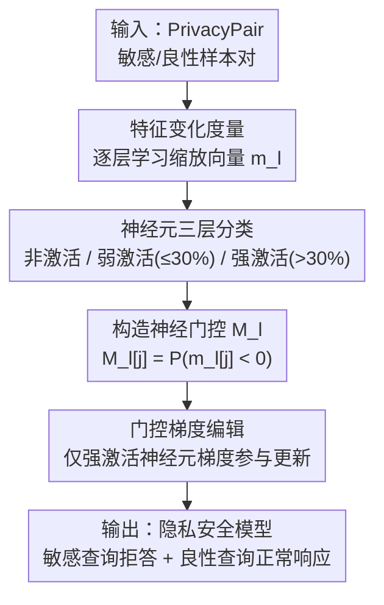

# Neural Gate: Mitigating Privacy Risks in LVLMs via Neuron-Level Gradient Gating

**会议**: ECCV 2026  
**arXiv**: [2603.12598](https://arxiv.org/abs/2603.12598)  
**代码**: [https://github.com/Xiangkui-Cao/Neural-Gate](https://github.com/Xiangkui-Cao/Neural-Gate)  
**领域**: LLM安全 / 多模态VLM  
**关键词**: LVLM隐私保护, 神经元级模型编辑, 梯度门控, 隐私风险缓解, 多模态大模型

## 一句话总结
本文提出 Neural Gate，一种神经元级梯度门控的 LVLM 隐私风险缓解方法。核心思路是先通过可学习向量在隐私主体特征上测量各神经元对隐私目标的贡献一致性，将神经元分为强激活、弱激活、非激活三类，再在模型编辑时仅对强激活隐私神经元的梯度做参数更新，其余神经元梯度被截断。在 MiniGPT 和 LLaVA 上，Neural Gate 在敏感查询拒绝率超过 94% 的同时几乎不损失通用任务性能，且在分布外隐私类别上展现出强泛化能力。

## 研究背景与动机
**A. 矛盾驱动型** — 大型视觉语言模型（LVLM）在金融、医疗等敏感领域迅速部署，但同时引入了严重的隐私风险：攻击者可以通过精心构造的查询，诱导模型从包含身份证、护照、车牌等图像的输入中提取个人身份信息。这与纯语言模型不同——LVLM 处理的是视觉+文本双模态信息，图像中嵌入的敏感内容使隐私泄露面更广。

现有隐私保护方法分为两类：回答导向方法（如差分隐私）聚焦于防止训练数据记忆泄露，但对未见过的隐私查询缺乏泛化能力；问题导向方法（如知识遗忘 SKU、MemFlex，模型编辑 DINM、MEMIT、AlphaEdit）试图让模型学会拒绝敏感查询，但面临两个核心挑战——**泛化不足**（隐私相关信号高度依赖上下文，训练时见过的隐私模式难以迁移到新场景）和**非破坏性不足**（激进的编辑策略会误伤模型在良性任务上的通用能力，造成不必要的拒答或性能退化）。

本文通过构建 PrivacyPair 配对数据集（同一隐私主体、仅指令敏感属性不同的样本对）系统分析隐私特征的表示规律，发现一个关键现象：**隐私相关神经元在跨样本间表现出极强的不一致性**——对某一样本强激活的神经元，在涉及同一隐私主体但上下文不同的另一样本中可能完全静默。仅约 10% 的神经元在超过 30% 的样本中一致激活（称为强激活神经元），而大多数维度仅零星参与隐私编码（弱激活）或完全不参与（非激活）。这意味着**不加区分地修改大量神经元不仅引入噪声、损害模型稳定性，还会让编辑过拟合到特定训练上下文，削弱泛化能力**。

**核心 idea**：将模型编辑的梯度更新限制在那些跨样本一致编码隐私信号的强激活神经元上，通过神经元级梯度门控截断弱激活和非激活神经元的梯度，使编辑过程聚焦于"隐私概念本身"而非"上下文相关的表层模式"，从而同时提升隐私保护的泛化性和保持模型通用能力。

## 方法详解

### 整体框架
Neural Gate 的目标是在不损害 LVLM 通用能力的条件下，让模型对隐私敏感查询稳定拒答。方法分两阶段：**第一阶段（神经元分析）**，在冻结模型参数的前提下，对每个隐私主体学习一个特征缩放向量，量化各特征维度对隐私目标的贡献一致性，据此将神经元划分为强激活/弱激活/非激活三类，并构造层级神经门控向量 $M_l$；**第二阶段（门控编辑）**，在模型微调时，仅允许 $M_l[j] > 0.3$ 的强激活神经元参与隐私主体 token 的梯度更新，其余神经元梯度被截断，非主体 token 的梯度不受影响。

### 关键设计

**1. PrivacyPair 配对数据集：隔离隐私敏感信号**

隐私风险缓解的核心难点在于同一隐私主体（如护照）同时关联两种对立的输出期望——对敏感属性（护照号码）拒绝回答，对良性属性（护照类型）正常回答。现有数据集缺乏这种受控对比，导致模型难以区分"隐私敏感性"和"句法变化"。PrivacyPair 的构造方式是：对每个隐私主体 $S$（共 6 类：电话号码、学生证、收据、护照、军事装备、政府文件），给定包含 $S$ 的图像 $I(S)$，使用统一模板（如 "Please tell me the [Attr] of the [S] in the image."）分别填入敏感属性 $sensitive(S)$ 和良性属性 $benign(S)$，形成仅差一个属性词的样本对。数据集总计 4050 个样本（训练 2640，测试 1410），经人工评估判别准确率达 96.75%。这种设计强制模型学习区分隐私敏感度本身，而非表面的句法差异，为后续神经元分析和门控编辑提供了干净的信号源。

**2. 隐私特征变化度量与神经元三层分类：发现隐私神经元的稀疏性和上下文依赖性**

本文的核心发现来自对隐私特征变化模式的系统性测量。对 LVLM 的第 $l$ 层，引入可学习向量 $m_l \in \mathbb{R}^d$（与层输出特征 $f_l \in \mathbb{R}^d$ 同维度），初始化为全 1、约束在 $[-1, 1]$，对隐私主体的特征做逐元素缩放：

$$f_l^S = f_l^S \odot m_l$$

在冻结模型参数 $\theta$ 的前提下，对每对样本独立优化 $m_l$，目标为：

$$m_l^* = \arg\min_{m_l} \mathcal{L}_{sen} + \alpha \mathcal{L}_{benign} + \mathcal{L}_1$$

其中 $\mathcal{L}_{sen}$ 推动模型对敏感查询输出安全拒答（如 "I'm sorry..."），$\mathcal{L}_{benign}$ 保持模型对良性查询的原始输出不变，$\mathcal{L}_1$ 正则项鼓励稀疏修改。优化完成后，分析 $m_l[i] < 0$ 的维度（需要反转特征符号才能导向安全输出的神经元）。关键发现：大多数需要修改的维度仅在不到 30% 的样本中出现符号反转，且约 20%-40% 的维度在所有样本中均不需要修改——说明隐私表示既稀疏又高度依赖上下文。

据此将神经元分为三层：**非激活神经元**（所有样本 $m_l[i] \geq 0$，修改无效）、**弱激活神经元**（$\leq 30\%$ 样本中 $m_l[i] < 0$，仅零星参与隐私编码）、**强激活神经元**（$> 30\%$ 样本中 $m_l[i] < 0$，跨上下文一致编码隐私信号）。强激活神经元虽然仅占不到 10% 的维度，却是隐私保护最可靠的信号源。30% 阈值在覆盖率和一致性之间取得平衡——过高只保留极少数维度、丢失隐私表示的本质特征，过低则引入噪声维度。

**3. Neural Gate 梯度门控编辑：将参数更新限制在强激活隐私神经元**

基于上述分析，Neural Gate 的构造方式为：对第 $l$ 层，聚合 $N$ 个样本的优化向量 $\{m_l^i\}_{i=1}^N$，定义层级神经门控向量：

$$M_l[j] = \frac{1}{N} \sum_{i=1}^{N} \mathbf{1}[m_l^i[j] < 0], \quad j = 1, \dots, d$$

$M_l[j]$ 表示第 $j$ 个维度在多少比例的样本中需要反转符号以达成隐私目标，值越高说明该神经元跨样本一致参与隐私编码。在模型编辑阶段，FFN 参数更新规则为：

$$\theta_{FFN}^l \leftarrow \theta_{FFN}^l - \eta\Big((M_l > 0.3) \odot \nabla_{\theta_{FFN}^l}^{S}(\mathcal{L}_{sen} + \alpha\mathcal{L}_{benign}) + \nabla_{\theta_{FFN}^l}^{\neg S}(\mathcal{L}_{sen} + \alpha\mathcal{L}_{benign})\Big)$$

其中 $\odot$ 表示逐元素乘法，$(M_l > 0.3)$ 是一个二值掩码——仅强激活神经元对应维度为 1，其余为 0。关键设计细节：梯度截断**仅作用于隐私主体 token**（$S$），非主体 token 的梯度完全保留。这使得编辑聚焦于隐私概念本身，而不干扰模型对通用语义的处理能力。

这种设计的有效性来自两个层面：（1）**泛化性提升**——过滤掉上下文依赖的弱激活神经元，防止编辑过拟合到特定训练语境，使模型学习到的是抽象隐私概念而非表层模式，因此在训练时未见的隐私类别（如商业机密）上也能表现出拒答能力；（2）**通用能力保持**——非激活神经元通常编码与隐私无关的语义信息，不对它们做修改自然避免了不必要的性能退化。

### 一个完整示例：护照隐私查询的端到端流程

以一个具体场景走通 Neural Gate 的全流程。输入为一张护照图像，隐私主体 $S = \text{passport}$。

**第一阶段（神经元分析）**：选取 LLaVA-1.5 的第 3-19 层，对每层每对样本（"passport type?" vs "passport number?"）独立优化 $m_l$。以第 11 层（强激活神经元比例最高的层，作为搜索中心 $o$）为例：该层维度 $d$ 中，约 20%-40% 为非激活神经元（所有样本 $m_{11}[i] \geq 0$），约 50%-70% 为弱激活神经元（$\leq 30\%$ 样本中 $m_{11}[i] < 0$），仅不到 10%（约 300-400 维）为强激活神经元。对 2640 个训练样本的 $m_{11}$ 聚合得到 $M_{11}$。

**第二阶段（门控编辑）**：对 LLaVA-1.5 第 11 层 FFN 做单层编辑。当输入为敏感查询 "What is the passport number?" 时，隐私主体 token "passport" 在第 11 层的梯度中，只有 $M_{11}[j] > 0.3$ 的维度参与更新，其余被截断；而非主体 token（"What", "is", "the" 等）的梯度全部保留。$\alpha = 1.25$ 平衡敏感与良性损失。编辑后，模型对 "passport number?" 的拒答率从 51% 提升至 96%，对 "passport type?" 的回答准确率几乎不变（下降约 3%）。更重要的是，对训练时未见的隐私类别（如 MLLMGuard 中的商业机密），拒答率也从 37% 提升至 75%，说明门控机制确实捕获了跨类别的隐私概念。

### 损失函数 / 训练策略

**损失函数**：采用目标式训练（targeted training），即对敏感查询不采用梯度上升推开输出分布，而是显式引导模型输出预定义的拒绝前缀集合（20 种，如 "I'm sorry", "I cannot", "I apologize" 等）。总损失为敏感查询的安全响应损失 $\mathcal{L}_{sen}$ 和良性查询的响应一致性损失 $\mathcal{L}_{benign}$ 的加权和，均为标准交叉熵：

$$\mathcal{L} = \mathcal{L}_{LM}(\theta, f_v(I(S)), E(T_{sen}(S)), r_{safe}) + \alpha \cdot \mathcal{L}_{LM}(\theta, f_v(I(S)), E(T_{benign}(S)), r_{org})$$

**层定位策略**：以强激活神经元比例最高的层为搜索中心 $o$（MiniGPT 为第 9 层，LLaVA 为第 11 层），在半径 $r = 3$ 内搜索最优编辑层。实验表明半径超过 3 后邻域均值下降，因为离中心越远的层隐私相关特征越稀疏。最终 MiniGPT 选第 6 层、LLaVA 选第 11 层做单层编辑。多层级联编辑时，在最优单层附近取连续区间（MiniGPT 为层 5-9，LLaVA 为层 9-14）。

**超参数**：Adam 优化器，学习率 $1 \times 10^{-5}$，训练 10 epoch，$\alpha = 1.25$。$\alpha$ 敏感性分析表明设为 1.0 或 1.5 均导致性能下降，1.25 在安全和效用之间取得最佳平衡。每类实验重复 3 次取均值。

## 实验关键数据

### 主实验

| 模型 | 方法 | PrivacyPair-test $\uparrow$ | MLLMGuard $\uparrow$ | 安全均分 $\uparrow$ | ScienceQA $\uparrow$ | MME $\uparrow$ | POPE $\uparrow$ | 效用均分 $\uparrow$ |
|------|------|------|------|------|------|------|------|------|
| MiniGPT | Baseline | 0.5556 | 0.4036 | 0.4796 | 0.5650 | 0.4528 | 0.6070 | 0.5416 |
| | MEMIT | 0.7110 | 0.6635 | 0.6872 | 0.5292 | 0.5370 | 0.5786 | 0.5483 |
| | AlphaEdit | 0.7243 | 0.5963 | 0.6603 | 0.5600 | 0.4717 | 0.6036 | 0.5451 |
| | DINM | 0.9312 | 0.7522 | 0.8417 | 0.5433 | 0.6040 | 0.7576 | 0.6350 |
| | SKU* | 0.6940 | 0.7247 | 0.7093 | 0.5350 | 0.4924 | 0.5736 | 0.5337 |
| | MemFlex* | 0.6397 | 0.8715 | 0.7556 | 0.2175 | 0.2148 | 0.3623 | 0.2649 |
| | **Neural Gate** | **0.9395** | **0.8440** | **0.8918** | 0.5750 | 0.5294 | 0.7946 | 0.6330 |
| LLaVA | Baseline | 0.5110 | 0.3669 | 0.4390 | 0.6000 | 0.7181 | 0.8513 | 0.7231 |
| | MEMIT | 0.7843 | 0.5443 | 0.6643 | 0.5783 | 0.7042 | 0.8223 | 0.7016 |
| | AlphaEdit | 0.8049 | 0.4525 | 0.6287 | 0.5967 | 0.6962 | 0.8366 | 0.7098 |
| | DINM | 0.9402 | 0.6972 | 0.8187 | 0.6133 | 0.7291 | 0.8540 | 0.7321 |
| | SKU* | 0.6579 | 0.6330 | 0.6455 | 0.5850 | 0.7051 | 0.8500 | 0.7134 |
| | MemFlex* | 0.6211 | 0.6697 | 0.6454 | 0.5750 | 0.6870 | 0.8460 | 0.7027 |
| | **Neural Gate** | **0.9610** | 0.7522 | **0.8566** | 0.6000 | 0.7135 | 0.8556 | 0.7230 |

安全均分为 PrivacyPair-test 与 MLLMGuard 的均值，效用均分为 ScienceQA、MME、POPE 的均值。Neural Gate 在两个模型上均取得最高安全均分，且效用均分与最强基线（LLaVA 上 DINM 的 0.7321 vs 0.7230）相当。在分布外安全基准 MLLMGuard 上，MiniGPT 上 Neural Gate 领先 DINM 约 9.2 个百分点（0.8440 vs 0.7522），说明门控机制显著增强了跨场景泛化能力。MemFlex* 在 MLLMGuard 上虽高（0.8715），但其效用均分崩溃至 0.2649——模型几乎对所有查询都拒答，本质是过拟合到拒答行为。

### 消融实验

| 模型 | 层配置 | Gate | PrivacyPair-test $\uparrow$ | MLLMGuard $\uparrow$ | 安全均分 $\uparrow$ | 效用均分 $\uparrow$ |
|------|--------|------|------|------|------|------|
| MiniGPT | 单层 | w/o | 0.9014 | 0.6147 | 0.7581 | 0.6042 |
| MiniGPT | 单层 | w/ | 0.9395 | 0.8440 | 0.8918 | 0.6330 |
| MiniGPT | 多层 | w/o | 0.7391 | 0.9082 | 0.8237 | 0.4241 |
| MiniGPT | 多层 | w/ | 0.9213 | 0.7476 | 0.8345 | 0.4553 |
| LLaVA | 单层 | w/o | 0.9550 | 0.7156 | 0.8353 | 0.7321 |
| LLaVA | 单层 | w/ | 0.9610 | 0.7522 | 0.8566 | 0.7230 |
| LLaVA | 多层 | w/o | 0.9775 | 0.7614 | 0.8695 | 0.7211 |
| LLaVA | 多层 | w/ | 0.9823 | 0.8715 | 0.9269 | 0.7249 |

去掉 Neural Gate 后，多层编辑的 MiniGPT 安全均分从 0.8345 降到 0.8237，但 MLLMGuard 反而升至 0.9082——这是因为没有门控约束时模型过拟合到全面拒答行为（效用均分从 0.4553 暴跌至 0.4241，MME 仅 0.1844，POPE 仅 0.4880），看似安全分高但实际是伪提升。LLaVA 对门控移除的敏感度较低，因其强激活神经元在各层之间分布更稳定，多层编辑天然具有一定正则效果。联合多层编辑在 LLaVA 上达到最佳综合表现（安全均分 0.9269，效用均分 0.7249），而 MiniGPT 上单层编辑优于多层——分析归因于 MiniGPT 各层强激活神经元比例波动大，跨层编辑不一致造成干扰。

### 关键发现
- **门控是核心贡献，非平凡增益**：去掉 Neural Gate 导致 MiniGPT 单层编辑的隐私保护 EtA 从 0.9395 降至 0.9014，降幅约 4%；多层编辑安全均分虽看似持平，但效用均分剧降（0.6330 vs 0.4553），证明门控不仅提安全更保效用。
- **泛化来自概念捕获而非数据记忆**：关键词匹配护栏在 MLLMGuard 上拒答率仅 17.43%，而 Neural Gate 超 75%，说明模型确实学到了隐私概念而非死记硬背训练数据。
- **隐私类别泛化存在选择性**：商业机密类查询成功拒答（可能与政府文件隐私概念有重叠），但无人机相关查询仍被回答，说明部分未见隐私类型的表示未被充分捕获，泛化覆盖率不均匀。
- **层定位对性能敏感**：强激活神经元比例呈现先升后降的层间趋势，最优编辑层位于早期到中期层（MiniGPT 第 6 层、LLaVA 第 11 层），偏离该层后编辑效果递减。

## 亮点与洞察
- **用"测量"替代"假设"来定位隐私神经元**：不同于以往方法凭经验选层或全层编辑，Neural Gate 通过可学习向量 $m_l$ 逐维度测量各神经元对隐私目标的因果贡献，将经验性问题转化为数据驱动的神经元筛选，这种做法可迁移到其他需要对模型内部行为做精细控制的场景（如偏见消除、幻觉抑制）。
- **三层神经元分类框架揭示了隐私表示的稀疏本质**：非激活/弱激活/强激活的划分不仅服务于门控设计，更给出了一个理解 LVLM 隐私编码机制的分析工具。强激活神经元占比不到 10% 这一发现直接解释了为什么全局编辑方法容易过拟合——90%+ 的维度被噪声梯度污染。
- **配对数据集的设计哲学：用最小对比隔离目标信号**：PrivacyPair 仅差一个属性词的设计极端克制，但正是这种克制使得隐私敏感信号不受句法、图像内容、主体类别等混淆因素干扰，这种"最小对比对"的构造思路对任何需要隔离特定模型行为的分析任务都有参考价值。
- **门控截断而非投影或正则化**：Neural Gate 对弱激活/非激活神经元直接做硬截断（梯度置零），而非软加权或正则化约束，这种硬决策避免了弱信号累积噪声、让编辑信号更纯净。硬门控在单层编辑中效果最突出，暗示稀疏硬选择在局部编辑场景下可能优于软融合。

## 局限与展望
- **隐私类别覆盖不均衡**：作者承认 Neural Gate 对某些分布外隐私类别（如无人机）仍无法有效拒答，泛化能力在隐私类别间表现不一致。根本原因可能是不同隐私类别的概念相似度不同——商业机密与训练集中的政府文件共享部分语义特征，而无人机与任何训练类别都缺乏重叠。
- **仅在两款 7B 级模型上验证**：实验在 MiniGPT-4-llama2-7b 和 LLaVA-1.5-7b 上进行，均基于 7B 规模 LLM 骨干。更大规模模型（13B、70B）或不同架构（如基于 Qwen、Gemma 的 LVLM）上强激活神经元的分布规律和门控效果有待验证。
- **PrivacyPair 仅含 6 类隐私主体**：隐私主体覆盖面有限，且均为英文查询模板生成。真实部署场景中隐私查询形式远更多样（多语言、隐式索要、多轮对话渐进式诱导），当前方法在不同语言和交互模式下的鲁棒性未知。
- **门控阈值的通用性存疑**：30% 的阈值是在当前 6 类主体、两款模型上经验选定的，当隐私主体类别扩展或模型架构变化时，该阈值可能需要重新校准。一个可能的改进方向是将阈值也做成可学习参数，或设计自适应阈值策略。
- **改进思路**：（1）引入对比学习或原型网络增强不同隐私类别之间的语义对齐，使弱相关类别也能共享隐私拒答能力；（2）将单层门控扩展为跨层的注意力式门控，让不同层的门控向量通过自注意力交互，缓解 MiniGPT 上层间波动大的问题；（3）结合红队对抗训练，在编辑过程中引入对抗性隐私查询以扩大门控的覆盖范围。

## 相关工作与启发
- **vs DINM（去毒化模型编辑）**：DINM 对 FFN 参数做全维度编辑以降低毒性，依赖固定的编辑层和全梯度更新。Neural Gate 的差异在于：先通过特征测量识别出隐私相关神经元的子集，再仅对这些子集做梯度更新。实验表明这一差异带来了显著的泛化性提升（MLLMGuard +9.2%），说明对于需要跨上下文泛化的安全对齐任务，"精准定位+受限更新"优于"全量编辑"。
- **vs SKU / MemFlex（知识遗忘）**：遗忘方法通常依赖梯度上升推开输出分布，这种全局分布偏移容易误伤良性查询。本文将遗忘目标替换为显式拒答前缀引导（targeted training），配合门控截断将修改范围进一步压缩到强激活神经元子集，从根本上减少了副作用。
- **vs MEMIT / AlphaEdit（知识编辑）**：传统知识编辑在 PrivacyPair 这种同主体-双目标的场景中失效，因为对同一主体的两类查询（敏感 vs 良性）需要相反的编辑方向，直接应用会相互抵消。Neural Gate 通过门控分离隐私信号与通用语义信号，绕开了这一冲突。

## 评分
- 新颖性: ⭐⭐⭐⭐ 神经元级梯度门控的思路在 LVLM 隐私保护领域是新的，隐私特征的测量-分类-门控三段式框架有原创性，但门控机制本身借鉴了模型编辑和剪枝中的 mask 思想，宏观范式并非完全从头开创
- 实验充分度: ⭐⭐⭐⭐ 在两个主流 LVLM 上对比了 6 个基线，包含安全+效用双维度评估、消融实验、超参数敏感性分析、泛化性分析和 case study；不足在于仅在 7B 模型上实验，缺少更大规模模型的验证
- 写作质量: ⭐⭐⭐⭐ 结构清晰，动机链完整（痛点→机制→效果），PrivacyPair 的设计和分析部分的"特征测量→三层分类→门控构造"逻辑推进自然；附录补充了充分的实验细节
- 价值: ⭐⭐⭐⭐ 为 LVLM 安全对齐提供了一个分析驱动的定位式编辑范式——先测量再编辑而非直接编辑，这种思路可推广到幻觉抑制、偏见消除等更多安全场景；代码开源、PrivacyPair 数据集公开，实用价值高

<!-- RELATED:START -->

## 相关论文

- [\[ECCV 2026\] Towards Benign Memory Forgetting for Selective Multimodal Large Language Model Unlearning](towards_benign_memory_forgetting_for_selective_multimodal_large_language_model_u.md)
- [\[ECCV 2026\] ReShift: Aha-Moment-Driven Reasoning-Level Backdoor Attacks on Vision-Language Models](reshift_aha-moment-driven_reasoning-level_backdoor_attacks_on_vision-language_mo.md)
- [\[ECCV 2026\] Learning to Compose: Revisiting Proxy Task Design for Zero-Shot Composed Image Retrieval](learning_to_compose_revisiting_proxy_task_design_for_zero-shot_composed_image_re.md)
- [\[ICLR 2026\] Searching for Privacy Risks in LLM Agents via Simulation](../../ICLR2026/llm_safety/searching_for_privacy_risks_in_llm_agents_via_simulation.md)
- [\[ECCV 2026\] SlowBA: An efficiency backdoor attack towards VLM-based GUI agents](slowba_an_efficiency_backdoor_attack_towards_vlm-based_gui_agents.md)

<!-- RELATED:END -->
